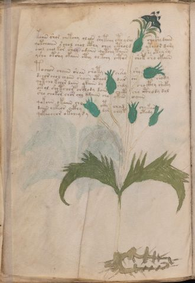

# Voynich Speculative Herbal Ferment Recipe — f29v

IMPORTANT: this is NOT a real or validated translation of the Voynich Manuscript. It is a speculative/procedural model that interprets EVA using a user-defined grammar to generate experimental recipes using safe, known edible substitutes.

This file is generated automatically from IVTFF/EVA transliteration plus a user-defined procedural grammar.



## Page / Folio
- currier: A
- folio: f29v
- page_number: 56
- plant_category_confidence: 0.0
- plant_category_guess: unknown
- section: herbal

## Plant Interpretation (Heuristic)
- category: unknown
- confidence: 0.0
- note: Heuristic classification based on the IVTFF 'Plant ID' string (not the drawing). Does not imply real identification of the manuscript plant.

## EVA Text (Transliteration)
```text
kooiin shor chetchy ol ls shytchy cthy shy cho shy daiin
qotcheaiin s chol chol cthy chey cthold ytchor dary
chol chol kor shey odaiin qotchy taiin s she otey sy
ysho otshy okaiin cthy oltchy ctos shot sho okaiin
tochon chain shan shoty chshy shy
dchor chol chaiin shaiin cthod dar chs shody
qotcho kchor daiin ykaiin dy shdy chocthy sheky
otol shotchor cholody dain ch[cti:cth] chy cthody dol
sho chokor chor chy ydaiin cho ykeeb oaiin
qokoiin okaiin cho [cti:cth] chyd chykar
daiin chteo[r:s] octhy dar chyt otody
qekeochor otchey s y
```

## Page Summary (Procedural, Aggregated)
- compound_counts: {'sugars': 13, 'mix/transfer': 56, 'secondary herb': 20, 'main herb': 38, 'heat': 22, 'complex herbal compound': 10, 'yeast fermentation': 20, 'liquid base': 4, 'general base': 1}
- dose_level: 2
- fermentation_estimate: 7–14 days

## Pantry (Max Needed For Any Single Line-Recipe)
- main_plant_dry_g: 10
- main_plant_substitute: ['chamomile (safe default substitute)']
- safe_complex_herbal_blend: ['gentle spices (e.g., 1 g cinnamon + 1 g clove) or a commercial herbal tea blend']
- secondary_herb_dry_g: 5
- secondary_herb_substitute: ['mint']
- sugar_or_honey_g: 50
- water_l: 0.5
- yeast_g: 1

## Recipes Index (This Page)
- [f29v.1,@P0](#f29v-1-f29v-1-p0)
- [f29v.2,+P0](#f29v-2-f29v-2-p0)
- [f29v.3,+P0](#f29v-3-f29v-3-p0)
- [f29v.4,+P0](#f29v-4-f29v-4-p0)
- [f29v.5,+P0](#f29v-5-f29v-5-p0)
- [f29v.6,+P0](#f29v-6-f29v-6-p0)
- [f29v.7,+P0](#f29v-7-f29v-7-p0)
- [f29v.8,+P0](#f29v-8-f29v-8-p0)
- [f29v.9,+P0](#f29v-9-f29v-9-p0)
- [f29v.10,+P0](#f29v-10-f29v-10-p0)
- [f29v.11,+P0](#f29v-11-f29v-11-p0)
- [f29v.12,+P0](#f29v-12-f29v-12-p0)

## Line Recipes (Each Line = One Recipe, 0.5L batch)

<a id="f29v-1-f29v-1-p0"></a>

### f29v.1,@P0

EVA: kooiin shor chetchy ol ls shytchy cthy shy cho shy daiin

## Ingredients
- main_plant_dry_g: 10
- main_plant_substitute: chamomile (safe default substitute)
- safe_complex_herbal_blend: gentle spices (e.g., 1 g cinnamon + 1 g clove) or a commercial herbal tea blend
- secondary_herb_dry_g: 5
- secondary_herb_substitute: mint
- sugar_or_honey_g: 50
- water_l: 0.5
- yeast_g: 1

Process:
1. Sanitize the jar/fermenter and utensils.
2. Base: combine 0.5 L water with 50 g sugar or honey.
3. Apply gentle heat: simmer 10–15 min, then cool to <30°C before adding yeast.
4. Add main plant: chamomile (safe default substitute) (~10 g dried).
5. Add secondary herb: mint (~5 g dried).
6. If a complex herbal compound appears, use a safe commercial blend or gentle spices in micro-doses.
7. Pitch yeast: 1 g (ideally cider/beer yeast).
8. Ferment with an airlock: 7–14 days (guided by iin/aiin markers).
9. Strain/rack (if very solid-heavy) and cold-crash 24 h.
10. Bottle only when activity clearly slows; refrigerate. Avoid overpressure.

Expected Result: A mild, aromatic herbal ferment, low-to-medium intensity depending on dose level.

Does It Make Sense?: partial

Direct Gloss (Procedural, Not a Real Translation):
- kooiin: add fermentable sugars → mix / transfer → duration level 2 → state: cooling/rest → medium fermentation phase
- shor: add secondary herb (safe substitute) → mix / transfer
- chetchy: apply heat/cooking → add main plant (safe substitute) → duration level 1 → state: active extraction
- ol: mix / transfer
- ls: [unparsed]
- shytchy: apply heat/cooking → add main plant (safe substitute) → add secondary herb (safe substitute)
- cthy: add complex herbal compound (safe blend)
- shy: add secondary herb (safe substitute)
- cho: add main plant (safe substitute) → mix / transfer
- shy: add secondary herb (safe substitute)
- daiin: start fermentation (yeast) → duration level 1 → state: fermentation start → long fermentation / aging phase

<a id="f29v-2-f29v-2-p0"></a>

### f29v.2,+P0

EVA: qotcheaiin s chol chol cthy chey cthold ytchor dary

## Ingredients
- main_plant_dry_g: 5
- main_plant_substitute: chamomile (safe default substitute)
- safe_complex_herbal_blend: gentle spices (e.g., 1 g cinnamon + 1 g clove) or a commercial herbal tea blend
- secondary_herb_dry_g: 1
- secondary_herb_substitute: mint
- sugar_or_honey_g: 12
- water_l: 0.5
- yeast_g: 1

Process:
1. Sanitize the jar/fermenter and utensils.
2. Base: combine 0.5 L water with 12 g sugar or honey.
3. Apply gentle heat: simmer 10–15 min, then cool to <30°C before adding yeast.
4. Add main plant: chamomile (safe default substitute) (~5 g dried).
5. Add secondary herb: mint (~1 g dried).
6. If a complex herbal compound appears, use a safe commercial blend or gentle spices in micro-doses.
7. Pitch yeast: 1 g (ideally cider/beer yeast).
8. Ferment with an airlock: 7–14 days (guided by iin/aiin markers).
9. Strain/rack (if very solid-heavy) and cold-crash 24 h.
10. Bottle only when activity clearly slows; refrigerate. Avoid overpressure.

Expected Result: A mild, aromatic herbal ferment, low-to-medium intensity depending on dose level.

Does It Make Sense?: partial

Direct Gloss (Procedural, Not a Real Translation):
- qotcheaiin: prepare liquid base → apply heat/cooking → add main plant (safe substitute) → duration level 1 → state: active extraction → long fermentation / aging phase
- s: [unparsed]
- chol: add main plant (safe substitute) → mix / transfer
- chol: add main plant (safe substitute) → mix / transfer
- cthy: add complex herbal compound (safe blend)
- chey: add main plant (safe substitute) → duration level 1 → state: active extraction
- cthold: mix / transfer → start fermentation (yeast) → add complex herbal compound (safe blend)
- ytchor: apply heat/cooking → add main plant (safe substitute) → mix / transfer
- dary: start fermentation (yeast) → duration level 1 → state: fermentation start

<a id="f29v-3-f29v-3-p0"></a>

### f29v.3,+P0

EVA: chol chol kor shey odaiin qotchy taiin s she otey sy

## Ingredients
- main_plant_dry_g: 5
- main_plant_substitute: chamomile (safe default substitute)
- secondary_herb_dry_g: 2
- secondary_herb_substitute: mint
- sugar_or_honey_g: 25
- water_l: 0.5
- yeast_g: 1

Process:
1. Sanitize the jar/fermenter and utensils.
2. Base: combine 0.5 L water with 25 g sugar or honey.
3. Apply gentle heat: simmer 10–15 min, then cool to <30°C before adding yeast.
4. Add main plant: chamomile (safe default substitute) (~5 g dried).
5. Add secondary herb: mint (~2 g dried).
6. Pitch yeast: 1 g (ideally cider/beer yeast).
7. Ferment with an airlock: 7–14 days (guided by iin/aiin markers).
8. Strain/rack (if very solid-heavy) and cold-crash 24 h.
9. Bottle only when activity clearly slows; refrigerate. Avoid overpressure.

Expected Result: A mild, aromatic herbal ferment, low-to-medium intensity depending on dose level.

Does It Make Sense?: partial

Direct Gloss (Procedural, Not a Real Translation):
- chol: add main plant (safe substitute) → mix / transfer
- chol: add main plant (safe substitute) → mix / transfer
- kor: add fermentable sugars → mix / transfer
- shey: add secondary herb (safe substitute) → duration level 1 → state: active extraction
- odaiin: mix / transfer → start fermentation (yeast) → duration level 1 → state: fermentation start → long fermentation / aging phase
- qotchy: prepare liquid base → apply heat/cooking → add main plant (safe substitute)
- taiin: apply heat/cooking → duration level 1 → state: fermentation start → long fermentation / aging phase
- s: [unparsed]
- she: add secondary herb (safe substitute) → duration level 1 → state: active extraction
- otey: apply heat/cooking → mix / transfer → duration level 1 → state: active extraction
- sy: [unparsed]

<a id="f29v-4-f29v-4-p0"></a>

### f29v.4,+P0

EVA: ysho otshy okaiin cthy oltchy ctos shot sho okaiin

## Ingredients
- main_plant_dry_g: 5
- main_plant_substitute: chamomile (safe default substitute)
- safe_complex_herbal_blend: gentle spices (e.g., 1 g cinnamon + 1 g clove) or a commercial herbal tea blend
- secondary_herb_dry_g: 2
- secondary_herb_substitute: mint
- sugar_or_honey_g: 25
- water_l: 0.5
- yeast_g: 1

Process:
1. Sanitize the jar/fermenter and utensils.
2. Base: combine 0.5 L water with 25 g sugar or honey.
3. Apply gentle heat: simmer 10–15 min, then cool to <30°C before adding yeast.
4. Add main plant: chamomile (safe default substitute) (~5 g dried).
5. Add secondary herb: mint (~2 g dried).
6. If a complex herbal compound appears, use a safe commercial blend or gentle spices in micro-doses.
7. Pitch yeast: 1 g (ideally cider/beer yeast).
8. Ferment with an airlock: 7–14 days (guided by iin/aiin markers).
9. Strain/rack (if very solid-heavy) and cold-crash 24 h.
10. Bottle only when activity clearly slows; refrigerate. Avoid overpressure.

Expected Result: A mild, aromatic herbal ferment, low-to-medium intensity depending on dose level.

Does It Make Sense?: partial

Direct Gloss (Procedural, Not a Real Translation):
- ysho: add secondary herb (safe substitute) → mix / transfer
- otshy: apply heat/cooking → add secondary herb (safe substitute) → mix / transfer
- okaiin: add fermentable sugars → mix / transfer → duration level 1 → state: fermentation start → long fermentation / aging phase
- cthy: add complex herbal compound (safe blend)
- oltchy: apply heat/cooking → add main plant (safe substitute) → mix / transfer
- ctos: apply heat/cooking → mix / transfer
- shot: apply heat/cooking → add secondary herb (safe substitute) → mix / transfer
- sho: add secondary herb (safe substitute) → mix / transfer
- okaiin: add fermentable sugars → mix / transfer → duration level 1 → state: fermentation start → long fermentation / aging phase

<a id="f29v-5-f29v-5-p0"></a>

### f29v.5,+P0

EVA: tochon chain shan shoty chshy shy

## Ingredients
- main_plant_dry_g: 5
- main_plant_substitute: chamomile (safe default substitute)
- secondary_herb_dry_g: 2
- secondary_herb_substitute: mint
- sugar_or_honey_g: 12
- water_l: 0.5
- yeast_g: 1

Process:
1. Sanitize the jar/fermenter and utensils.
2. Base: combine 0.5 L water with 12 g sugar or honey.
3. Apply gentle heat: simmer 10–15 min, then cool to <30°C before adding yeast.
4. Add main plant: chamomile (safe default substitute) (~5 g dried).
5. Add secondary herb: mint (~2 g dried).
6. Pitch yeast: 1 g (ideally cider/beer yeast).
7. Ferment with an airlock: 2–4 days (guided by iin/aiin markers).
8. Strain/rack (if very solid-heavy) and cold-crash 24 h.
9. Bottle only when activity clearly slows; refrigerate. Avoid overpressure.

Expected Result: A mild, aromatic herbal ferment, low-to-medium intensity depending on dose level.

Does It Make Sense?: partial

Direct Gloss (Procedural, Not a Real Translation):
- tochon: apply heat/cooking → add main plant (safe substitute) → mix / transfer
- chain: add main plant (safe substitute) → duration level 1 → state: fermentation start
- shan: add secondary herb (safe substitute) → duration level 1 → state: fermentation start
- shoty: apply heat/cooking → add secondary herb (safe substitute) → mix / transfer
- chshy: add main plant (safe substitute) → add secondary herb (safe substitute)
- shy: add secondary herb (safe substitute)

<a id="f29v-6-f29v-6-p0"></a>

### f29v.6,+P0

EVA: dchor chol chaiin shaiin cthod dar chs shody

## Ingredients
- main_plant_dry_g: 5
- main_plant_substitute: chamomile (safe default substitute)
- safe_complex_herbal_blend: gentle spices (e.g., 1 g cinnamon + 1 g clove) or a commercial herbal tea blend
- secondary_herb_dry_g: 2
- secondary_herb_substitute: mint
- sugar_or_honey_g: 12
- water_l: 0.5
- yeast_g: 1

Process:
1. Sanitize the jar/fermenter and utensils.
2. Base: combine 0.5 L water with 12 g sugar or honey.
3. Infusion: use hot (not boiling) water, then let it cool before adding yeast.
4. Add main plant: chamomile (safe default substitute) (~5 g dried).
5. Add secondary herb: mint (~2 g dried).
6. If a complex herbal compound appears, use a safe commercial blend or gentle spices in micro-doses.
7. Pitch yeast: 1 g (ideally cider/beer yeast).
8. Ferment with an airlock: 7–14 days (guided by iin/aiin markers).
9. Strain/rack (if very solid-heavy) and cold-crash 24 h.
10. Bottle only when activity clearly slows; refrigerate. Avoid overpressure.

Expected Result: A mild, aromatic herbal ferment, low-to-medium intensity depending on dose level.

Does It Make Sense?: partial

Direct Gloss (Procedural, Not a Real Translation):
- dchor: add main plant (safe substitute) → mix / transfer → start fermentation (yeast)
- chol: add main plant (safe substitute) → mix / transfer
- chaiin: add main plant (safe substitute) → duration level 1 → state: fermentation start → long fermentation / aging phase
- shaiin: add secondary herb (safe substitute) → duration level 1 → state: fermentation start → long fermentation / aging phase
- cthod: mix / transfer → start fermentation (yeast) → add complex herbal compound (safe blend)
- dar: start fermentation (yeast) → duration level 1 → state: fermentation start
- chs: add main plant (safe substitute)
- shody: add secondary herb (safe substitute) → mix / transfer → start fermentation (yeast)

<a id="f29v-7-f29v-7-p0"></a>

### f29v.7,+P0

EVA: qotcho kchor daiin ykaiin dy shdy chocthy sheky

## Ingredients
- main_plant_dry_g: 5
- main_plant_substitute: chamomile (safe default substitute)
- safe_complex_herbal_blend: gentle spices (e.g., 1 g cinnamon + 1 g clove) or a commercial herbal tea blend
- secondary_herb_dry_g: 2
- secondary_herb_substitute: mint
- sugar_or_honey_g: 25
- water_l: 0.5
- yeast_g: 1

Process:
1. Sanitize the jar/fermenter and utensils.
2. Base: combine 0.5 L water with 25 g sugar or honey.
3. Apply gentle heat: simmer 10–15 min, then cool to <30°C before adding yeast.
4. Add main plant: chamomile (safe default substitute) (~5 g dried).
5. Add secondary herb: mint (~2 g dried).
6. If a complex herbal compound appears, use a safe commercial blend or gentle spices in micro-doses.
7. Pitch yeast: 1 g (ideally cider/beer yeast).
8. Ferment with an airlock: 7–14 days (guided by iin/aiin markers).
9. Strain/rack (if very solid-heavy) and cold-crash 24 h.
10. Bottle only when activity clearly slows; refrigerate. Avoid overpressure.

Expected Result: A mild, aromatic herbal ferment, low-to-medium intensity depending on dose level.

Does It Make Sense?: partial

Direct Gloss (Procedural, Not a Real Translation):
- qotcho: prepare liquid base → apply heat/cooking → add main plant (safe substitute) → mix / transfer
- kchor: add fermentable sugars → add main plant (safe substitute) → mix / transfer
- daiin: start fermentation (yeast) → duration level 1 → state: fermentation start → long fermentation / aging phase
- ykaiin: add fermentable sugars → duration level 1 → state: fermentation start → long fermentation / aging phase
- dy: start fermentation (yeast)
- shdy: add secondary herb (safe substitute) → start fermentation (yeast)
- chocthy: add main plant (safe substitute) → mix / transfer → add complex herbal compound (safe blend)
- sheky: add fermentable sugars → add secondary herb (safe substitute) → duration level 1 → state: active extraction

<a id="f29v-8-f29v-8-p0"></a>

### f29v.8,+P0

EVA: otol shotchor cholody dain ch[cti:cth] chy cthody dol

## Ingredients
- main_plant_dry_g: 5
- main_plant_substitute: chamomile (safe default substitute)
- safe_complex_herbal_blend: gentle spices (e.g., 1 g cinnamon + 1 g clove) or a commercial herbal tea blend
- secondary_herb_dry_g: 2
- secondary_herb_substitute: mint
- sugar_or_honey_g: 12
- water_l: 0.5
- yeast_g: 1

Process:
1. Sanitize the jar/fermenter and utensils.
2. Base: combine 0.5 L water with 12 g sugar or honey.
3. Apply gentle heat: simmer 10–15 min, then cool to <30°C before adding yeast.
4. Add main plant: chamomile (safe default substitute) (~5 g dried).
5. Add secondary herb: mint (~2 g dried).
6. If a complex herbal compound appears, use a safe commercial blend or gentle spices in micro-doses.
7. Pitch yeast: 1 g (ideally cider/beer yeast).
8. Ferment with an airlock: 2–4 days (guided by iin/aiin markers).
9. Strain/rack (if very solid-heavy) and cold-crash 24 h.
10. Bottle only when activity clearly slows; refrigerate. Avoid overpressure.

Expected Result: A mild, aromatic herbal ferment, low-to-medium intensity depending on dose level.

Does It Make Sense?: partial

Direct Gloss (Procedural, Not a Real Translation):
- otol: apply heat/cooking → mix / transfer
- shotchor: apply heat/cooking → add main plant (safe substitute) → add secondary herb (safe substitute) → mix / transfer
- cholody: add main plant (safe substitute) → mix / transfer → start fermentation (yeast)
- dain: start fermentation (yeast) → duration level 1 → state: fermentation start
- ch: add main plant (safe substitute)
- cti: apply heat/cooking → duration level 1 → state: cooling/rest
- cth: add complex herbal compound (safe blend)
- chy: add main plant (safe substitute)
- cthody: mix / transfer → start fermentation (yeast) → add complex herbal compound (safe blend)
- dol: mix / transfer → start fermentation (yeast)

<a id="f29v-9-f29v-9-p0"></a>

### f29v.9,+P0

EVA: sho chokor chor chy ydaiin cho ykeeb oaiin

## Ingredients
- main_plant_dry_g: 10
- main_plant_substitute: chamomile (safe default substitute)
- secondary_herb_dry_g: 5
- secondary_herb_substitute: mint
- sugar_or_honey_g: 50
- water_l: 0.5
- yeast_g: 1

Process:
1. Sanitize the jar/fermenter and utensils.
2. Base: combine 0.5 L water with 50 g sugar or honey.
3. Infusion: use hot (not boiling) water, then let it cool before adding yeast.
4. Add main plant: chamomile (safe default substitute) (~10 g dried).
5. Add secondary herb: mint (~5 g dried).
6. Pitch yeast: 1 g (ideally cider/beer yeast).
7. Ferment with an airlock: 7–14 days (guided by iin/aiin markers).
8. Strain/rack (if very solid-heavy) and cold-crash 24 h.
9. Bottle only when activity clearly slows; refrigerate. Avoid overpressure.

Expected Result: A mild, aromatic herbal ferment, low-to-medium intensity depending on dose level.

Does It Make Sense?: partial

Direct Gloss (Procedural, Not a Real Translation):
- sho: add secondary herb (safe substitute) → mix / transfer
- chokor: add fermentable sugars → add main plant (safe substitute) → mix / transfer
- chor: add main plant (safe substitute) → mix / transfer
- chy: add main plant (safe substitute)
- ydaiin: start fermentation (yeast) → duration level 1 → state: fermentation start → long fermentation / aging phase
- cho: add main plant (safe substitute) → mix / transfer
- ykeeb: add fermentable sugars → duration level 2 → state: active extraction
- oaiin: mix / transfer → duration level 1 → state: fermentation start → long fermentation / aging phase

<a id="f29v-10-f29v-10-p0"></a>

### f29v.10,+P0

EVA: qokoiin okaiin cho [cti:cth] chyd chykar

## Ingredients
- main_plant_dry_g: 10
- main_plant_substitute: chamomile (safe default substitute)
- safe_complex_herbal_blend: gentle spices (e.g., 1 g cinnamon + 1 g clove) or a commercial herbal tea blend
- secondary_herb_dry_g: 2
- secondary_herb_substitute: mint
- sugar_or_honey_g: 50
- water_l: 0.5
- yeast_g: 1

Process:
1. Sanitize the jar/fermenter and utensils.
2. Base: combine 0.5 L water with 50 g sugar or honey.
3. Apply gentle heat: simmer 10–15 min, then cool to <30°C before adding yeast.
4. Add main plant: chamomile (safe default substitute) (~10 g dried).
5. Add secondary herb: mint (~2 g dried).
6. If a complex herbal compound appears, use a safe commercial blend or gentle spices in micro-doses.
7. Pitch yeast: 1 g (ideally cider/beer yeast).
8. Ferment with an airlock: 7–14 days (guided by iin/aiin markers).
9. Strain/rack (if very solid-heavy) and cold-crash 24 h.
10. Bottle only when activity clearly slows; refrigerate. Avoid overpressure.

Expected Result: A mild, aromatic herbal ferment, low-to-medium intensity depending on dose level.

Does It Make Sense?: partial

Direct Gloss (Procedural, Not a Real Translation):
- qokoiin: prepare liquid base → add fermentable sugars → mix / transfer → duration level 2 → state: cooling/rest → medium fermentation phase
- okaiin: add fermentable sugars → mix / transfer → duration level 1 → state: fermentation start → long fermentation / aging phase
- cho: add main plant (safe substitute) → mix / transfer
- cti: apply heat/cooking → duration level 1 → state: cooling/rest
- cth: add complex herbal compound (safe blend)
- chyd: add main plant (safe substitute) → start fermentation (yeast)
- chykar: add fermentable sugars → add main plant (safe substitute) → duration level 1 → state: fermentation start

<a id="f29v-11-f29v-11-p0"></a>

### f29v.11,+P0

EVA: daiin chteo[r:s] octhy dar chyt otody

## Ingredients
- main_plant_dry_g: 5
- main_plant_substitute: chamomile (safe default substitute)
- safe_complex_herbal_blend: gentle spices (e.g., 1 g cinnamon + 1 g clove) or a commercial herbal tea blend
- secondary_herb_dry_g: 1
- secondary_herb_substitute: mint
- sugar_or_honey_g: 12
- water_l: 0.5
- yeast_g: 1

Process:
1. Sanitize the jar/fermenter and utensils.
2. Base: combine 0.5 L water with 12 g sugar or honey.
3. Apply gentle heat: simmer 10–15 min, then cool to <30°C before adding yeast.
4. Add main plant: chamomile (safe default substitute) (~5 g dried).
5. Add secondary herb: mint (~1 g dried).
6. If a complex herbal compound appears, use a safe commercial blend or gentle spices in micro-doses.
7. Pitch yeast: 1 g (ideally cider/beer yeast).
8. Ferment with an airlock: 7–14 days (guided by iin/aiin markers).
9. Strain/rack (if very solid-heavy) and cold-crash 24 h.
10. Bottle only when activity clearly slows; refrigerate. Avoid overpressure.

Expected Result: A mild, aromatic herbal ferment, low-to-medium intensity depending on dose level.

Does It Make Sense?: partial

Direct Gloss (Procedural, Not a Real Translation):
- daiin: start fermentation (yeast) → duration level 1 → state: fermentation start → long fermentation / aging phase
- chteo: apply heat/cooking → add main plant (safe substitute) → mix / transfer → duration level 1 → state: active extraction
- r: [unparsed]
- s: [unparsed]
- octhy: mix / transfer → add complex herbal compound (safe blend)
- dar: start fermentation (yeast) → duration level 1 → state: fermentation start
- chyt: apply heat/cooking → add main plant (safe substitute)
- otody: apply heat/cooking → mix / transfer → start fermentation (yeast)

<a id="f29v-12-f29v-12-p0"></a>

### f29v.12,+P0

EVA: qekeochor otchey s y

## Ingredients
- main_plant_dry_g: 5
- main_plant_substitute: chamomile (safe default substitute)
- secondary_herb_dry_g: 1
- secondary_herb_substitute: mint
- sugar_or_honey_g: 25
- water_l: 0.5
- yeast_g: 1

Process:
1. Sanitize the jar/fermenter and utensils.
2. Base: combine 0.5 L water with 25 g sugar or honey.
3. Apply gentle heat: simmer 10–15 min, then cool to <30°C before adding yeast.
4. Add main plant: chamomile (safe default substitute) (~5 g dried).
5. Add secondary herb: mint (~1 g dried).
6. Pitch yeast: 1 g (ideally cider/beer yeast).
7. Ferment with an airlock: 2–4 days (guided by iin/aiin markers).
8. Strain/rack (if very solid-heavy) and cold-crash 24 h.
9. Bottle only when activity clearly slows; refrigerate. Avoid overpressure.

Expected Result: A mild, aromatic herbal ferment, low-to-medium intensity depending on dose level.

Does It Make Sense?: partial

Direct Gloss (Procedural, Not a Real Translation):
- qekeochor: prepare base (generic) → add fermentable sugars → add main plant (safe substitute) → mix / transfer → duration level 1 → state: active extraction
- otchey: apply heat/cooking → add main plant (safe substitute) → mix / transfer → duration level 1 → state: active extraction
- s: [unparsed]
- y: [unparsed]

## Risks & Warnings (Applies To All Line-Recipes)
- Never use unidentified Voynich plants directly; only use known edible substitutes.
- Do not consume if you see mold, smell rot, notice abnormal sliminess, or taste something clearly foul.
- Overpressure/bottle-bomb risk: do not bottle before stable; prefer an airlock and refrigeration.
- Avoid if pregnant/breastfeeding, for minors, or with medical conditions; consult a professional.
- No medical claims: this is an experimental beverage.

## Recommended Adjustments (General)
- If too bitter (leafy profile), halve the herbs or shorten steep/maceration time.
- If too sweet, extend fermentation or reduce sugar by 25–50%.
- For a non-alcoholic version, omit yeast and keep refrigerated as an infusion (not fermented).
