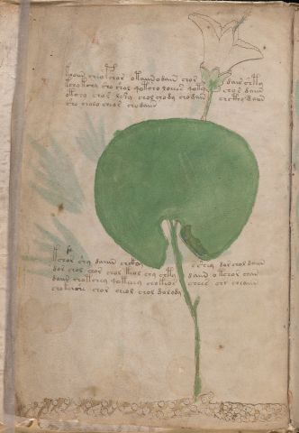

# Voynich Speculative Herbal Ferment Recipe — f2v

IMPORTANT: this is NOT a real or validated translation of the Voynich Manuscript. It is a speculative/procedural model that interprets EVA using a user-defined grammar to generate experimental recipes using safe, known edible substitutes.

This file is generated automatically from IVTFF/EVA transliteration plus a user-defined procedural grammar.



## Page / Folio
- currier: A
- folio: f2v
- page_number: 4
- section: herbal

## EVA Text (Transliteration)
```text
kooiin cheo pchor otaiin odain chor dair shty
kcho kchy sho shol qotcho loeees qoty chor daiin
otchy chor lshy chol chody chodain chcthy daiin
sho cholo cheor chodaiin
kchor shy daiiin chckom s shey dor chol daiin
dor chol chor chol keol chy chty daiin o tchor chan
daiin chotchey qoteeey chokeos chees chr cheaiin
chokoishe chor cheol chol dolody
```

## Recipes Index (This Page)
- [f2v.1,@P0](#f2v-1-f2v-1-p0)
- [f2v.2,+P0](#f2v-2-f2v-2-p0)
- [f2v.3,+P0](#f2v-3-f2v-3-p0)
- [f2v.4,+P0](#f2v-4-f2v-4-p0)
- [f2v.5,+P0](#f2v-5-f2v-5-p0)
- [f2v.6,+P0](#f2v-6-f2v-6-p0)
- [f2v.7,+P0](#f2v-7-f2v-7-p0)
- [f2v.8,+P0](#f2v-8-f2v-8-p0)

## Line Glosses (Procedural Gloss Only; Not a Translation)

<a id="f2v-1-f2v-1-p0"></a>

### f2v.1,@P0

EVA: kooiin cheo pchor otaiin odain chor dair shty

Direct Gloss (Procedural, Not a Real Translation):
- kooiin: add fermentable sugars → mix / transfer → duration level 2 → state: cooling/rest → medium fermentation phase
- cheo: add main plant (safe substitute) → mix / transfer → duration level 1 → state: active extraction
- pchor: add main plant (safe substitute) → mix / transfer → start fermentation (yeast)
- otaiin: apply heat/cooking → mix / transfer → duration level 1 → state: fermentation start → long fermentation / aging phase
- odain: mix / transfer → start fermentation (yeast) → duration level 1 → state: fermentation start
- chor: add main plant (safe substitute) → mix / transfer
- dair: start fermentation (yeast) → duration level 1 → state: fermentation start
- shty: apply heat/cooking → add secondary herb (safe substitute)

<a id="f2v-2-f2v-2-p0"></a>

### f2v.2,+P0

EVA: kcho kchy sho shol qotcho loeees qoty chor daiin

Direct Gloss (Procedural, Not a Real Translation):
- kcho: add fermentable sugars → add main plant (safe substitute) → mix / transfer
- kchy: add fermentable sugars → add main plant (safe substitute)
- sho: add secondary herb (safe substitute) → mix / transfer
- shol: add secondary herb (safe substitute) → mix / transfer
- qotcho: prepare liquid base → apply heat/cooking → add main plant (safe substitute) → mix / transfer
- loeees: mix / transfer → duration level 3 → state: active extraction
- qoty: prepare liquid base → apply heat/cooking
- chor: add main plant (safe substitute) → mix / transfer
- daiin: start fermentation (yeast) → duration level 1 → state: fermentation start → long fermentation / aging phase

<a id="f2v-3-f2v-3-p0"></a>

### f2v.3,+P0

EVA: otchy chor lshy chol chody chodain chcthy daiin

Direct Gloss (Procedural, Not a Real Translation):
- otchy: apply heat/cooking → add main plant (safe substitute) → mix / transfer
- chor: add main plant (safe substitute) → mix / transfer
- lshy: add secondary herb (safe substitute)
- chol: add main plant (safe substitute) → mix / transfer
- chody: add main plant (safe substitute) → mix / transfer → start fermentation (yeast)
- chodain: add main plant (safe substitute) → mix / transfer → start fermentation (yeast) → duration level 1 → state: fermentation start
- chcthy: add main plant (safe substitute) → add complex herbal compound (safe blend)
- daiin: start fermentation (yeast) → duration level 1 → state: fermentation start → long fermentation / aging phase

<a id="f2v-4-f2v-4-p0"></a>

### f2v.4,+P0

EVA: sho cholo cheor chodaiin

Direct Gloss (Procedural, Not a Real Translation):
- sho: add secondary herb (safe substitute) → mix / transfer
- cholo: add main plant (safe substitute) → mix / transfer
- cheor: add main plant (safe substitute) → mix / transfer → duration level 1 → state: active extraction
- chodaiin: add main plant (safe substitute) → mix / transfer → start fermentation (yeast) → duration level 1 → state: fermentation start → long fermentation / aging phase

<a id="f2v-5-f2v-5-p0"></a>

### f2v.5,+P0

EVA: kchor shy daiiin chckom s shey dor chol daiin

Direct Gloss (Procedural, Not a Real Translation):
- kchor: add fermentable sugars → add main plant (safe substitute) → mix / transfer
- shy: add secondary herb (safe substitute)
- daiiin: start fermentation (yeast) → duration level 1 → state: fermentation start → medium fermentation phase
- chckom: add fermentable sugars → add main plant (safe substitute) → mix / transfer
- s: [unparsed]
- shey: add secondary herb (safe substitute) → duration level 1 → state: active extraction
- dor: mix / transfer → start fermentation (yeast)
- chol: add main plant (safe substitute) → mix / transfer
- daiin: start fermentation (yeast) → duration level 1 → state: fermentation start → long fermentation / aging phase

<a id="f2v-6-f2v-6-p0"></a>

### f2v.6,+P0

EVA: dor chol chor chol keol chy chty daiin o tchor chan

Direct Gloss (Procedural, Not a Real Translation):
- dor: mix / transfer → start fermentation (yeast)
- chol: add main plant (safe substitute) → mix / transfer
- chor: add main plant (safe substitute) → mix / transfer
- chol: add main plant (safe substitute) → mix / transfer
- keol: add fermentable sugars → mix / transfer → duration level 1 → state: active extraction
- chy: add main plant (safe substitute)
- chty: apply heat/cooking → add main plant (safe substitute)
- daiin: start fermentation (yeast) → duration level 1 → state: fermentation start → long fermentation / aging phase
- o: mix / transfer
- tchor: apply heat/cooking → add main plant (safe substitute) → mix / transfer
- chan: add main plant (safe substitute) → duration level 1 → state: fermentation start

<a id="f2v-7-f2v-7-p0"></a>

### f2v.7,+P0

EVA: daiin chotchey qoteeey chokeos chees chr cheaiin

Direct Gloss (Procedural, Not a Real Translation):
- daiin: start fermentation (yeast) → duration level 1 → state: fermentation start → long fermentation / aging phase
- chotchey: apply heat/cooking → add main plant (safe substitute) → mix / transfer → duration level 1 → state: active extraction
- qoteeey: prepare liquid base → apply heat/cooking → duration level 3 → state: active extraction
- chokeos: add fermentable sugars → add main plant (safe substitute) → mix / transfer → duration level 1 → state: active extraction
- chees: add main plant (safe substitute) → duration level 2 → state: active extraction
- chr: add main plant (safe substitute)
- cheaiin: add main plant (safe substitute) → duration level 1 → state: active extraction → long fermentation / aging phase

<a id="f2v-8-f2v-8-p0"></a>

### f2v.8,+P0

EVA: chokoishe chor cheol chol dolody

Direct Gloss (Procedural, Not a Real Translation):
- chokoishe: add fermentable sugars → add main plant (safe substitute) → add secondary herb (safe substitute) → mix / transfer → duration level 1 → state: cooling/rest
- chor: add main plant (safe substitute) → mix / transfer
- cheol: add main plant (safe substitute) → mix / transfer → duration level 1 → state: active extraction
- chol: add main plant (safe substitute) → mix / transfer
- dolody: mix / transfer → start fermentation (yeast)
