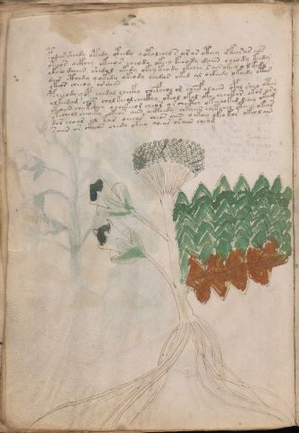

# Voynich Speculative Herbal Ferment Recipe — f31v

IMPORTANT: this is NOT a real or validated translation of the Voynich Manuscript. It is a speculative/procedural model that interprets EVA using a user-defined grammar to generate experimental recipes using safe, known edible substitutes.

This file is generated automatically from IVTFF/EVA transliteration plus a user-defined procedural grammar.



## Page / Folio
- currier: B
- folio: f31v
- page_number: 60
- plant_candidates: ['Heracleum cervofilum']
- plant_category_confidence: 0.25
- plant_category_guess: leaf
- plant_category_matches: ['section=herbal_default']
- plant_id: Heracleum cervofilum
- section: herbal

## Plant Interpretation (Heuristic)
- category: leaf
- confidence: 0.25
- note: Heuristic classification based on the IVTFF 'Plant ID' string (not the drawing). Does not imply real identification of the manuscript plant.
- textual_evidence_terms: ['section=herbal_default']

## EVA Text (Transliteration)
```text
podair sheedy otedy oteedy qotolcheo s ar ar oteey dk[ch:a]rar als
ytchos [o:a]ckhey okeeo s cheody okeey keeody daiin cheody keedy
ykeeo daiin shedal okedy okey keo dy okchey sair okees o lkedy
dair cthedy qokedy okeody chedar oked al ockhedy okeedy ota[s:d]
ykeos cheeoy or aiin
pcheeody qop chedal checfhy chefchol or cheef alaiin opal sheo otar
olkeedam ches chol keeol checkhy okeol okal oky cheokar okor ary
ykaiin chee ksheey ychekeeor cheor o r checthy okechoked lchey okam
ytecheol sheoeky okeos aiin a[ikh:ckh]edy chkaiin chetchey ctheey okear
dar choar al kar oeeeos cheos aiin o ckhey okeo kor okeol ain
saiin ar ckheos chedy okeey qoear oraiin cheam
```

## Page Summary (Procedural, Aggregated)
- compound_counts: {'yeast fermentation': 35, 'mix/transfer': 70, 'secondary herb': 5, 'heat': 9, 'liquid base': 4, 'main herb': 32, 'sugars': 40, 'complex herbal compound': 10, 'aroma modifier': 2}
- dose_level: 3
- fermentation_estimate: 7–14 days

## Pantry (Max Needed For Any Single Line-Recipe)
- aroma_modifier: ['lemon peel (optional)']
- aroma_modifier_dose: ['2–5 g (or 1 strip of peel, avoiding the bitter pith)']
- main_plant_dry_g: 15
- main_plant_substitute: ['lemon balm']
- safe_complex_herbal_blend: ['gentle spices (e.g., 1 g cinnamon + 1 g clove) or a commercial herbal tea blend']
- secondary_herb_dry_g: 5
- secondary_herb_substitute: ['mint']
- sugar_or_honey_g: 75
- water_l: 0.5
- yeast_g: 1

## Recipes Index (This Page)
- [f31v.1,@P0](#f31v-1-f31v-1-p0)
- [f31v.2,+P0](#f31v-2-f31v-2-p0)
- [f31v.3,+P0](#f31v-3-f31v-3-p0)
- [f31v.4,+P0](#f31v-4-f31v-4-p0)
- [f31v.5,+P0](#f31v-5-f31v-5-p0)
- [f31v.6,+P0](#f31v-6-f31v-6-p0)
- [f31v.7,+P0](#f31v-7-f31v-7-p0)
- [f31v.8,+P0](#f31v-8-f31v-8-p0)
- [f31v.9,+P0](#f31v-9-f31v-9-p0)
- [f31v.10,+P0](#f31v-10-f31v-10-p0)
- [f31v.11,+P0](#f31v-11-f31v-11-p0)

## Line Recipes (Each Line = One Recipe, 0.5L batch)

<a id="f31v-1-f31v-1-p0"></a>

### f31v.1,@P0

EVA: podair sheedy otedy oteedy qotolcheo s ar ar oteey dk[ch:a]rar als

## Ingredients
- main_plant_dry_g: 10
- main_plant_substitute: lemon balm
- secondary_herb_dry_g: 5
- secondary_herb_substitute: mint
- sugar_or_honey_g: 50
- water_l: 0.5
- yeast_g: 1

Process:
1. Sanitize the jar/fermenter and utensils.
2. Base: combine 0.5 L water with 50 g sugar or honey.
3. Apply gentle heat: simmer 10–15 min, then cool to <30°C before adding yeast.
4. Add main plant: lemon balm (~10 g dried).
5. Add secondary herb: mint (~5 g dried).
6. Pitch yeast: 1 g (ideally cider/beer yeast).
7. Ferment with an airlock: 2–4 days (guided by iin/aiin markers).
8. Strain/rack (if very solid-heavy) and cold-crash 24 h.
9. Bottle only when activity clearly slows; refrigerate. Avoid overpressure.

Expected Result: A mild, aromatic herbal ferment, low-to-medium intensity depending on dose level.

Does It Make Sense?: yes

Direct Gloss (Procedural, Not a Real Translation):
- podair: mix / transfer → start fermentation (yeast) → duration level 1 → state: fermentation start
- sheedy: add secondary herb (safe substitute) → start fermentation (yeast) → duration level 2 → state: active extraction
- otedy: apply heat/cooking → mix / transfer → start fermentation (yeast) → duration level 1 → state: active extraction
- oteedy: apply heat/cooking → mix / transfer → start fermentation (yeast) → duration level 2 → state: active extraction
- qotolcheo: prepare liquid base → apply heat/cooking → add main plant (safe substitute) → mix / transfer → duration level 1 → state: active extraction
- s: [unparsed]
- ar: duration level 1 → state: fermentation start
- ar: duration level 1 → state: fermentation start
- oteey: apply heat/cooking → mix / transfer → duration level 2 → state: active extraction
- dk: add fermentable sugars → start fermentation (yeast)
- ch: add main plant (safe substitute)
- a: duration level 1 → state: fermentation start
- rar: duration level 1 → state: fermentation start
- als: duration level 1 → state: fermentation start

<a id="f31v-2-f31v-2-p0"></a>

### f31v.2,+P0

EVA: ytchos [o:a]ckhey okeeo s cheody okeey keeody daiin cheody keedy

## Ingredients
- main_plant_dry_g: 10
- main_plant_substitute: lemon balm
- safe_complex_herbal_blend: gentle spices (e.g., 1 g cinnamon + 1 g clove) or a commercial herbal tea blend
- secondary_herb_dry_g: 2
- secondary_herb_substitute: mint
- sugar_or_honey_g: 50
- water_l: 0.5
- yeast_g: 1

Process:
1. Sanitize the jar/fermenter and utensils.
2. Base: combine 0.5 L water with 50 g sugar or honey.
3. Apply gentle heat: simmer 10–15 min, then cool to <30°C before adding yeast.
4. Add main plant: lemon balm (~10 g dried).
5. Add secondary herb: mint (~2 g dried).
6. If a complex herbal compound appears, use a safe commercial blend or gentle spices in micro-doses.
7. Pitch yeast: 1 g (ideally cider/beer yeast).
8. Ferment with an airlock: 7–14 days (guided by iin/aiin markers).
9. Strain/rack (if very solid-heavy) and cold-crash 24 h.
10. Bottle only when activity clearly slows; refrigerate. Avoid overpressure.

Expected Result: A mild, aromatic herbal ferment, low-to-medium intensity depending on dose level.

Does It Make Sense?: yes

Direct Gloss (Procedural, Not a Real Translation):
- ytchos: apply heat/cooking → add main plant (safe substitute) → mix / transfer
- o: mix / transfer
- a: duration level 1 → state: fermentation start
- ckhey: add complex herbal compound (safe blend) → duration level 1 → state: active extraction
- okeeo: add fermentable sugars → mix / transfer → duration level 2 → state: active extraction
- s: [unparsed]
- cheody: add main plant (safe substitute) → mix / transfer → start fermentation (yeast) → duration level 1 → state: active extraction
- okeey: add fermentable sugars → mix / transfer → duration level 2 → state: active extraction
- keeody: add fermentable sugars → mix / transfer → start fermentation (yeast) → duration level 2 → state: active extraction
- daiin: start fermentation (yeast) → duration level 1 → state: fermentation start → long fermentation / aging phase
- cheody: add main plant (safe substitute) → mix / transfer → start fermentation (yeast) → duration level 1 → state: active extraction
- keedy: add fermentable sugars → start fermentation (yeast) → duration level 2 → state: active extraction

<a id="f31v-3-f31v-3-p0"></a>

### f31v.3,+P0

EVA: ykeeo daiin shedal okedy okey keo dy okchey sair okees o lkedy

## Ingredients
- main_plant_dry_g: 10
- main_plant_substitute: lemon balm
- secondary_herb_dry_g: 5
- secondary_herb_substitute: mint
- sugar_or_honey_g: 50
- water_l: 0.5
- yeast_g: 1

Process:
1. Sanitize the jar/fermenter and utensils.
2. Base: combine 0.5 L water with 50 g sugar or honey.
3. Infusion: use hot (not boiling) water, then let it cool before adding yeast.
4. Add main plant: lemon balm (~10 g dried).
5. Add secondary herb: mint (~5 g dried).
6. Pitch yeast: 1 g (ideally cider/beer yeast).
7. Ferment with an airlock: 7–14 days (guided by iin/aiin markers).
8. Strain/rack (if very solid-heavy) and cold-crash 24 h.
9. Bottle only when activity clearly slows; refrigerate. Avoid overpressure.

Expected Result: A mild, aromatic herbal ferment, low-to-medium intensity depending on dose level.

Does It Make Sense?: yes

Direct Gloss (Procedural, Not a Real Translation):
- ykeeo: add fermentable sugars → mix / transfer → duration level 2 → state: active extraction
- daiin: start fermentation (yeast) → duration level 1 → state: fermentation start → long fermentation / aging phase
- shedal: add secondary herb (safe substitute) → start fermentation (yeast) → duration level 1 → state: active extraction
- okedy: add fermentable sugars → mix / transfer → start fermentation (yeast) → duration level 1 → state: active extraction
- okey: add fermentable sugars → mix / transfer → duration level 1 → state: active extraction
- keo: add fermentable sugars → mix / transfer → duration level 1 → state: active extraction
- dy: start fermentation (yeast)
- okchey: add fermentable sugars → add main plant (safe substitute) → mix / transfer → duration level 1 → state: active extraction
- sair: duration level 1 → state: fermentation start
- okees: add fermentable sugars → mix / transfer → duration level 2 → state: active extraction
- o: mix / transfer
- lkedy: add fermentable sugars → start fermentation (yeast) → duration level 1 → state: active extraction

<a id="f31v-4-f31v-4-p0"></a>

### f31v.4,+P0

EVA: dair cthedy qokedy okeody chedar oked al ockhedy okeedy ota[s:d]

## Ingredients
- main_plant_dry_g: 10
- main_plant_substitute: lemon balm
- safe_complex_herbal_blend: gentle spices (e.g., 1 g cinnamon + 1 g clove) or a commercial herbal tea blend
- secondary_herb_dry_g: 2
- secondary_herb_substitute: mint
- sugar_or_honey_g: 50
- water_l: 0.5
- yeast_g: 1

Process:
1. Sanitize the jar/fermenter and utensils.
2. Base: combine 0.5 L water with 50 g sugar or honey.
3. Apply gentle heat: simmer 10–15 min, then cool to <30°C before adding yeast.
4. Add main plant: lemon balm (~10 g dried).
5. Add secondary herb: mint (~2 g dried).
6. If a complex herbal compound appears, use a safe commercial blend or gentle spices in micro-doses.
7. Pitch yeast: 1 g (ideally cider/beer yeast).
8. Ferment with an airlock: 2–4 days (guided by iin/aiin markers).
9. Strain/rack (if very solid-heavy) and cold-crash 24 h.
10. Bottle only when activity clearly slows; refrigerate. Avoid overpressure.

Expected Result: A mild, aromatic herbal ferment, low-to-medium intensity depending on dose level.

Does It Make Sense?: yes

Direct Gloss (Procedural, Not a Real Translation):
- dair: start fermentation (yeast) → duration level 1 → state: fermentation start
- cthedy: start fermentation (yeast) → add complex herbal compound (safe blend) → duration level 1 → state: active extraction
- qokedy: prepare liquid base → add fermentable sugars → start fermentation (yeast) → duration level 1 → state: active extraction
- okeody: add fermentable sugars → mix / transfer → start fermentation (yeast) → duration level 1 → state: active extraction
- chedar: add main plant (safe substitute) → start fermentation (yeast) → duration level 1 → state: active extraction
- oked: add fermentable sugars → mix / transfer → start fermentation (yeast) → duration level 1 → state: active extraction
- al: duration level 1 → state: fermentation start
- ockhedy: mix / transfer → start fermentation (yeast) → add complex herbal compound (safe blend) → duration level 1 → state: active extraction
- okeedy: add fermentable sugars → mix / transfer → start fermentation (yeast) → duration level 2 → state: active extraction
- ota: apply heat/cooking → mix / transfer → duration level 1 → state: fermentation start
- s: [unparsed]
- d: start fermentation (yeast)

<a id="f31v-5-f31v-5-p0"></a>

### f31v.5,+P0

EVA: ykeos cheeoy or aiin

## Ingredients
- main_plant_dry_g: 10
- main_plant_substitute: lemon balm
- secondary_herb_dry_g: 2
- secondary_herb_substitute: mint
- sugar_or_honey_g: 50
- water_l: 0.5
- yeast_g: 1

Process:
1. Sanitize the jar/fermenter and utensils.
2. Base: combine 0.5 L water with 50 g sugar or honey.
3. Infusion: use hot (not boiling) water, then let it cool before adding yeast.
4. Add main plant: lemon balm (~10 g dried).
5. Add secondary herb: mint (~2 g dried).
6. Pitch yeast: 1 g (ideally cider/beer yeast).
7. Ferment with an airlock: 7–14 days (guided by iin/aiin markers).
8. Strain/rack (if very solid-heavy) and cold-crash 24 h.
9. Bottle only when activity clearly slows; refrigerate. Avoid overpressure.

Expected Result: A mild, aromatic herbal ferment, low-to-medium intensity depending on dose level.

Does It Make Sense?: yes

Direct Gloss (Procedural, Not a Real Translation):
- ykeos: add fermentable sugars → mix / transfer → duration level 1 → state: active extraction
- cheeoy: add main plant (safe substitute) → mix / transfer → duration level 2 → state: active extraction
- or: mix / transfer
- aiin: duration level 1 → state: fermentation start → long fermentation / aging phase

<a id="f31v-6-f31v-6-p0"></a>

### f31v.6,+P0

EVA: pcheeody qop chedal checfhy chefchol or cheef alaiin opal sheo otar

## Ingredients
- aroma_modifier: lemon peel (optional)
- aroma_modifier_dose: 2–5 g (or 1 strip of peel, avoiding the bitter pith)
- main_plant_dry_g: 10
- main_plant_substitute: lemon balm
- safe_complex_herbal_blend: gentle spices (e.g., 1 g cinnamon + 1 g clove) or a commercial herbal tea blend
- secondary_herb_dry_g: 5
- secondary_herb_substitute: mint
- sugar_or_honey_g: 25
- water_l: 0.5
- yeast_g: 1

Process:
1. Sanitize the jar/fermenter and utensils.
2. Base: combine 0.5 L water with 25 g sugar or honey.
3. Apply gentle heat: simmer 10–15 min, then cool to <30°C before adding yeast.
4. Add main plant: lemon balm (~10 g dried).
5. Add secondary herb: mint (~5 g dried).
6. Add aroma modifier (optional) in a low dose.
7. If a complex herbal compound appears, use a safe commercial blend or gentle spices in micro-doses.
8. Pitch yeast: 1 g (ideally cider/beer yeast).
9. Ferment with an airlock: 7–14 days (guided by iin/aiin markers).
10. Strain/rack (if very solid-heavy) and cold-crash 24 h.
11. Bottle only when activity clearly slows; refrigerate. Avoid overpressure.

Expected Result: A mild, aromatic herbal ferment, low-to-medium intensity depending on dose level.

Does It Make Sense?: yes

Direct Gloss (Procedural, Not a Real Translation):
- pcheeody: add main plant (safe substitute) → mix / transfer → start fermentation (yeast) → duration level 2 → state: active extraction
- qop: prepare liquid base → start fermentation (yeast)
- chedal: add main plant (safe substitute) → start fermentation (yeast) → duration level 1 → state: active extraction
- checfhy: add main plant (safe substitute) → add complex herbal compound (safe blend) → duration level 1 → state: active extraction
- chefchol: add main plant (safe substitute) → add aroma modifier → mix / transfer → duration level 1 → state: active extraction
- or: mix / transfer
- cheef: add main plant (safe substitute) → add aroma modifier → duration level 2 → state: active extraction
- alaiin: duration level 1 → state: fermentation start → long fermentation / aging phase
- opal: mix / transfer → start fermentation (yeast) → duration level 1 → state: fermentation start
- sheo: add secondary herb (safe substitute) → mix / transfer → duration level 1 → state: active extraction
- otar: apply heat/cooking → mix / transfer → duration level 1 → state: fermentation start

<a id="f31v-7-f31v-7-p0"></a>

### f31v.7,+P0

EVA: olkeedam ches chol keeol checkhy okeol okal oky cheokar okor ary

## Ingredients
- main_plant_dry_g: 10
- main_plant_substitute: lemon balm
- safe_complex_herbal_blend: gentle spices (e.g., 1 g cinnamon + 1 g clove) or a commercial herbal tea blend
- secondary_herb_dry_g: 2
- secondary_herb_substitute: mint
- sugar_or_honey_g: 50
- water_l: 0.5
- yeast_g: 1

Process:
1. Sanitize the jar/fermenter and utensils.
2. Base: combine 0.5 L water with 50 g sugar or honey.
3. Infusion: use hot (not boiling) water, then let it cool before adding yeast.
4. Add main plant: lemon balm (~10 g dried).
5. Add secondary herb: mint (~2 g dried).
6. If a complex herbal compound appears, use a safe commercial blend or gentle spices in micro-doses.
7. Pitch yeast: 1 g (ideally cider/beer yeast).
8. Ferment with an airlock: 2–4 days (guided by iin/aiin markers).
9. Strain/rack (if very solid-heavy) and cold-crash 24 h.
10. Bottle only when activity clearly slows; refrigerate. Avoid overpressure.

Expected Result: A mild, aromatic herbal ferment, low-to-medium intensity depending on dose level.

Does It Make Sense?: yes

Direct Gloss (Procedural, Not a Real Translation):
- olkeedam: add fermentable sugars → mix / transfer → start fermentation (yeast) → duration level 2 → state: active extraction
- ches: add main plant (safe substitute) → duration level 1 → state: active extraction
- chol: add main plant (safe substitute) → mix / transfer
- keeol: add fermentable sugars → mix / transfer → duration level 2 → state: active extraction
- checkhy: add main plant (safe substitute) → add complex herbal compound (safe blend) → duration level 1 → state: active extraction
- okeol: add fermentable sugars → mix / transfer → duration level 1 → state: active extraction
- okal: add fermentable sugars → mix / transfer → duration level 1 → state: fermentation start
- oky: add fermentable sugars → mix / transfer
- cheokar: add fermentable sugars → add main plant (safe substitute) → mix / transfer → duration level 1 → state: active extraction
- okor: add fermentable sugars → mix / transfer
- ary: duration level 1 → state: fermentation start

<a id="f31v-8-f31v-8-p0"></a>

### f31v.8,+P0

EVA: ykaiin chee ksheey ychekeeor cheor o r checthy okechoked lchey okam

## Ingredients
- main_plant_dry_g: 10
- main_plant_substitute: lemon balm
- safe_complex_herbal_blend: gentle spices (e.g., 1 g cinnamon + 1 g clove) or a commercial herbal tea blend
- secondary_herb_dry_g: 5
- secondary_herb_substitute: mint
- sugar_or_honey_g: 50
- water_l: 0.5
- yeast_g: 1

Process:
1. Sanitize the jar/fermenter and utensils.
2. Base: combine 0.5 L water with 50 g sugar or honey.
3. Infusion: use hot (not boiling) water, then let it cool before adding yeast.
4. Add main plant: lemon balm (~10 g dried).
5. Add secondary herb: mint (~5 g dried).
6. If a complex herbal compound appears, use a safe commercial blend or gentle spices in micro-doses.
7. Pitch yeast: 1 g (ideally cider/beer yeast).
8. Ferment with an airlock: 7–14 days (guided by iin/aiin markers).
9. Strain/rack (if very solid-heavy) and cold-crash 24 h.
10. Bottle only when activity clearly slows; refrigerate. Avoid overpressure.

Expected Result: A mild, aromatic herbal ferment, low-to-medium intensity depending on dose level.

Does It Make Sense?: yes

Direct Gloss (Procedural, Not a Real Translation):
- ykaiin: add fermentable sugars → duration level 1 → state: fermentation start → long fermentation / aging phase
- chee: add main plant (safe substitute) → duration level 2 → state: active extraction
- ksheey: add fermentable sugars → add secondary herb (safe substitute) → duration level 2 → state: active extraction
- ychekeeor: add fermentable sugars → add main plant (safe substitute) → mix / transfer → duration level 1 → state: active extraction
- cheor: add main plant (safe substitute) → mix / transfer → duration level 1 → state: active extraction
- o: mix / transfer
- r: [unparsed]
- checthy: add main plant (safe substitute) → add complex herbal compound (safe blend) → duration level 1 → state: active extraction
- okechoked: add fermentable sugars → add main plant (safe substitute) → mix / transfer → start fermentation (yeast) → duration level 1 → state: active extraction
- lchey: add main plant (safe substitute) → duration level 1 → state: active extraction
- okam: add fermentable sugars → mix / transfer → duration level 1 → state: fermentation start

<a id="f31v-9-f31v-9-p0"></a>

### f31v.9,+P0

EVA: ytecheol sheoeky okeos aiin a[ikh:ckh]edy chkaiin chetchey ctheey okear

## Ingredients
- main_plant_dry_g: 10
- main_plant_substitute: lemon balm
- safe_complex_herbal_blend: gentle spices (e.g., 1 g cinnamon + 1 g clove) or a commercial herbal tea blend
- secondary_herb_dry_g: 5
- secondary_herb_substitute: mint
- sugar_or_honey_g: 50
- water_l: 0.5
- yeast_g: 1

Process:
1. Sanitize the jar/fermenter and utensils.
2. Base: combine 0.5 L water with 50 g sugar or honey.
3. Apply gentle heat: simmer 10–15 min, then cool to <30°C before adding yeast.
4. Add main plant: lemon balm (~10 g dried).
5. Add secondary herb: mint (~5 g dried).
6. If a complex herbal compound appears, use a safe commercial blend or gentle spices in micro-doses.
7. Pitch yeast: 1 g (ideally cider/beer yeast).
8. Ferment with an airlock: 7–14 days (guided by iin/aiin markers).
9. Strain/rack (if very solid-heavy) and cold-crash 24 h.
10. Bottle only when activity clearly slows; refrigerate. Avoid overpressure.

Expected Result: A mild, aromatic herbal ferment, low-to-medium intensity depending on dose level.

Does It Make Sense?: yes

Direct Gloss (Procedural, Not a Real Translation):
- ytecheol: apply heat/cooking → add main plant (safe substitute) → mix / transfer → duration level 1 → state: active extraction
- sheoeky: add fermentable sugars → add secondary herb (safe substitute) → mix / transfer → duration level 1 → state: active extraction
- okeos: add fermentable sugars → mix / transfer → duration level 1 → state: active extraction
- aiin: duration level 1 → state: fermentation start → long fermentation / aging phase
- a: duration level 1 → state: fermentation start
- ikh: add fermentable sugars → duration level 1 → state: cooling/rest
- ckh: add complex herbal compound (safe blend)
- edy: start fermentation (yeast) → duration level 1 → state: active extraction
- chkaiin: add fermentable sugars → add main plant (safe substitute) → duration level 1 → state: fermentation start → long fermentation / aging phase
- chetchey: apply heat/cooking → add main plant (safe substitute) → duration level 1 → state: active extraction
- ctheey: add complex herbal compound (safe blend) → duration level 2 → state: active extraction
- okear: add fermentable sugars → mix / transfer → duration level 1 → state: active extraction

<a id="f31v-10-f31v-10-p0"></a>

### f31v.10,+P0

EVA: dar choar al kar oeeeos cheos aiin o ckhey okeo kor okeol ain

## Ingredients
- main_plant_dry_g: 15
- main_plant_substitute: lemon balm
- safe_complex_herbal_blend: gentle spices (e.g., 1 g cinnamon + 1 g clove) or a commercial herbal tea blend
- secondary_herb_dry_g: 3
- secondary_herb_substitute: mint
- sugar_or_honey_g: 75
- water_l: 0.5
- yeast_g: 1

Process:
1. Sanitize the jar/fermenter and utensils.
2. Base: combine 0.5 L water with 75 g sugar or honey.
3. Infusion: use hot (not boiling) water, then let it cool before adding yeast.
4. Add main plant: lemon balm (~15 g dried).
5. Add secondary herb: mint (~3 g dried).
6. If a complex herbal compound appears, use a safe commercial blend or gentle spices in micro-doses.
7. Pitch yeast: 1 g (ideally cider/beer yeast).
8. Ferment with an airlock: 7–14 days (guided by iin/aiin markers).
9. Strain/rack (if very solid-heavy) and cold-crash 24 h.
10. Bottle only when activity clearly slows; refrigerate. Avoid overpressure.

Expected Result: A mild, aromatic herbal ferment, low-to-medium intensity depending on dose level.

Does It Make Sense?: yes

Direct Gloss (Procedural, Not a Real Translation):
- dar: start fermentation (yeast) → duration level 1 → state: fermentation start
- choar: add main plant (safe substitute) → mix / transfer → duration level 1 → state: fermentation start
- al: duration level 1 → state: fermentation start
- kar: add fermentable sugars → duration level 1 → state: fermentation start
- oeeeos: mix / transfer → duration level 3 → state: active extraction
- cheos: add main plant (safe substitute) → mix / transfer → duration level 1 → state: active extraction
- aiin: duration level 1 → state: fermentation start → long fermentation / aging phase
- o: mix / transfer
- ckhey: add complex herbal compound (safe blend) → duration level 1 → state: active extraction
- okeo: add fermentable sugars → mix / transfer → duration level 1 → state: active extraction
- kor: add fermentable sugars → mix / transfer
- okeol: add fermentable sugars → mix / transfer → duration level 1 → state: active extraction
- ain: duration level 1 → state: fermentation start

<a id="f31v-11-f31v-11-p0"></a>

### f31v.11,+P0

EVA: saiin ar ckheos chedy okeey qoear oraiin cheam

## Ingredients
- main_plant_dry_g: 10
- main_plant_substitute: lemon balm
- safe_complex_herbal_blend: gentle spices (e.g., 1 g cinnamon + 1 g clove) or a commercial herbal tea blend
- secondary_herb_dry_g: 2
- secondary_herb_substitute: mint
- sugar_or_honey_g: 50
- water_l: 0.5
- yeast_g: 1

Process:
1. Sanitize the jar/fermenter and utensils.
2. Base: combine 0.5 L water with 50 g sugar or honey.
3. Infusion: use hot (not boiling) water, then let it cool before adding yeast.
4. Add main plant: lemon balm (~10 g dried).
5. Add secondary herb: mint (~2 g dried).
6. If a complex herbal compound appears, use a safe commercial blend or gentle spices in micro-doses.
7. Pitch yeast: 1 g (ideally cider/beer yeast).
8. Ferment with an airlock: 7–14 days (guided by iin/aiin markers).
9. Strain/rack (if very solid-heavy) and cold-crash 24 h.
10. Bottle only when activity clearly slows; refrigerate. Avoid overpressure.

Expected Result: A mild, aromatic herbal ferment, low-to-medium intensity depending on dose level.

Does It Make Sense?: yes

Direct Gloss (Procedural, Not a Real Translation):
- saiin: duration level 1 → state: fermentation start → long fermentation / aging phase
- ar: duration level 1 → state: fermentation start
- ckheos: mix / transfer → add complex herbal compound (safe blend) → duration level 1 → state: active extraction
- chedy: add main plant (safe substitute) → start fermentation (yeast) → duration level 1 → state: active extraction
- okeey: add fermentable sugars → mix / transfer → duration level 2 → state: active extraction
- qoear: prepare liquid base → duration level 1 → state: active extraction
- oraiin: mix / transfer → duration level 1 → state: fermentation start → long fermentation / aging phase
- cheam: add main plant (safe substitute) → duration level 1 → state: active extraction

## Risks & Warnings (Applies To All Line-Recipes)
- Never use unidentified Voynich plants directly; only use known edible substitutes.
- Do not consume if you see mold, smell rot, notice abnormal sliminess, or taste something clearly foul.
- Overpressure/bottle-bomb risk: do not bottle before stable; prefer an airlock and refrigeration.
- Avoid if pregnant/breastfeeding, for minors, or with medical conditions; consult a professional.
- No medical claims: this is an experimental beverage.

## Recommended Adjustments (General)
- If too bitter (leafy profile), halve the herbs or shorten steep/maceration time.
- If too sweet, extend fermentation or reduce sugar by 25–50%.
- For a non-alcoholic version, omit yeast and keep refrigerated as an infusion (not fermented).
