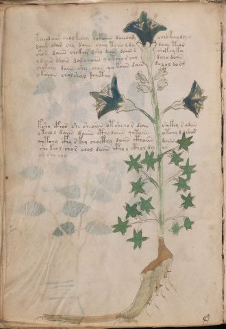

# Voynich Speculative Herbal Ferment Recipe — f32v

IMPORTANT: this is NOT a real or validated translation of the Voynich Manuscript. It is a speculative/procedural model that interprets EVA using a user-defined grammar to generate experimental recipes using safe, known edible substitutes.

This file is generated automatically from IVTFF/EVA transliteration plus a user-defined procedural grammar.



## Page / Folio
- currier: A
- folio: f32v
- page_number: 62
- plant_candidates: ['Campanula Ranunculus', 'Archangelica', 'Glockenblume']
- plant_category_confidence: 0.25
- plant_category_guess: leaf
- plant_category_matches: ['section=herbal_default']
- plant_id: Campanula Ranunculus (Holm), Archangelica, Glockenblume,
- section: herbal

## Plant Interpretation (Heuristic)
- category: leaf
- confidence: 0.25
- note: Heuristic classification based on the IVTFF 'Plant ID' string (not the drawing). Does not imply real identification of the manuscript plant.
- textual_evidence_terms: ['section=herbal_default']

## EVA Text (Transliteration)
```text
kcheodaiin chol kechy qotaiin daiioam o chofchody
daiin odar chy daiin chey tch[y:o] l dy dain teor
shor daiin chckhy dsho dain daiin s shokey ka
or chr chor dor chaiin qotcho r chy dch[o:a] daiin
chokchy daiin shy chor qo kaiin dain dchol dosg
o kchan chol shal dchcthy
ksho cpho[s:r] she sheaiin otshcho r dain shckhy s odan
otchol daiin daiin ctho daiin qotaiin otchy d shan
qotchy cfhy skey chocthy daiin cthaiin daiin
sho keol chor chol daiin cpho l cthol da ar
ol sho chy
```

## Page Summary (Procedural, Aggregated)
- compound_counts: {'sugars': 10, 'main herb': 30, 'mix/transfer': 41, 'yeast fermentation': 30, 'liquid base': 5, 'heat': 9, 'aroma modifier': 1, 'secondary herb': 13, 'complex herbal compound': 10}
- dose_level: 1
- fermentation_estimate: 7–14 days

## Pantry (Max Needed For Any Single Line-Recipe)
- aroma_modifier: ['lemon peel (optional)']
- aroma_modifier_dose: ['2–5 g (or 1 strip of peel, avoiding the bitter pith)']
- main_plant_dry_g: 5
- main_plant_substitute: ['lemon balm']
- safe_complex_herbal_blend: ['gentle spices (e.g., 1 g cinnamon + 1 g clove) or a commercial herbal tea blend']
- secondary_herb_dry_g: 2
- secondary_herb_substitute: ['mint']
- sugar_or_honey_g: 25
- water_l: 0.5
- yeast_g: 1

## Recipes Index (This Page)
- [f32v.1,@P0](#f32v-1-f32v-1-p0)
- [f32v.2,+P0](#f32v-2-f32v-2-p0)
- [f32v.3,+P0](#f32v-3-f32v-3-p0)
- [f32v.4,+P0](#f32v-4-f32v-4-p0)
- [f32v.5,+P0](#f32v-5-f32v-5-p0)
- [f32v.6,+P0](#f32v-6-f32v-6-p0)
- [f32v.7,+P0](#f32v-7-f32v-7-p0)
- [f32v.8,+P0](#f32v-8-f32v-8-p0)
- [f32v.9,+P0](#f32v-9-f32v-9-p0)
- [f32v.10,+P0](#f32v-10-f32v-10-p0)
- [f32v.11,+P0](#f32v-11-f32v-11-p0)

## Line Recipes (Each Line = One Recipe, 0.5L batch)

<a id="f32v-1-f32v-1-p0"></a>

### f32v.1,@P0

EVA: kcheodaiin chol kechy qotaiin daiioam o chofchody

## Ingredients
- aroma_modifier: lemon peel (optional)
- aroma_modifier_dose: 2–5 g (or 1 strip of peel, avoiding the bitter pith)
- main_plant_dry_g: 5
- main_plant_substitute: lemon balm
- secondary_herb_dry_g: 1
- secondary_herb_substitute: mint
- sugar_or_honey_g: 25
- water_l: 0.5
- yeast_g: 1

Process:
1. Sanitize the jar/fermenter and utensils.
2. Base: combine 0.5 L water with 25 g sugar or honey.
3. Apply gentle heat: simmer 10–15 min, then cool to <30°C before adding yeast.
4. Add main plant: lemon balm (~5 g dried).
5. Add secondary herb: mint (~1 g dried).
6. Add aroma modifier (optional) in a low dose.
7. Pitch yeast: 1 g (ideally cider/beer yeast).
8. Ferment with an airlock: 7–14 days (guided by iin/aiin markers).
9. Strain/rack (if very solid-heavy) and cold-crash 24 h.
10. Bottle only when activity clearly slows; refrigerate. Avoid overpressure.

Expected Result: A mild, aromatic herbal ferment, low-to-medium intensity depending on dose level.

Does It Make Sense?: yes

Direct Gloss (Procedural, Not a Real Translation):
- kcheodaiin: add fermentable sugars → add main plant (safe substitute) → mix / transfer → start fermentation (yeast) → duration level 1 → state: active extraction → long fermentation / aging phase
- chol: add main plant (safe substitute) → mix / transfer
- kechy: add fermentable sugars → add main plant (safe substitute) → duration level 1 → state: active extraction
- qotaiin: prepare liquid base → apply heat/cooking → duration level 1 → state: fermentation start → long fermentation / aging phase
- daiioam: mix / transfer → start fermentation (yeast) → duration level 1 → state: fermentation start
- o: mix / transfer
- chofchody: add main plant (safe substitute) → add aroma modifier → mix / transfer → start fermentation (yeast)

<a id="f32v-2-f32v-2-p0"></a>

### f32v.2,+P0

EVA: daiin odar chy daiin chey tch[y:o] l dy dain teor

## Ingredients
- main_plant_dry_g: 5
- main_plant_substitute: lemon balm
- secondary_herb_dry_g: 1
- secondary_herb_substitute: mint
- sugar_or_honey_g: 12
- water_l: 0.5
- yeast_g: 1

Process:
1. Sanitize the jar/fermenter and utensils.
2. Base: combine 0.5 L water with 12 g sugar or honey.
3. Apply gentle heat: simmer 10–15 min, then cool to <30°C before adding yeast.
4. Add main plant: lemon balm (~5 g dried).
5. Add secondary herb: mint (~1 g dried).
6. Pitch yeast: 1 g (ideally cider/beer yeast).
7. Ferment with an airlock: 7–14 days (guided by iin/aiin markers).
8. Strain/rack (if very solid-heavy) and cold-crash 24 h.
9. Bottle only when activity clearly slows; refrigerate. Avoid overpressure.

Expected Result: A mild, aromatic herbal ferment, low-to-medium intensity depending on dose level.

Does It Make Sense?: yes

Direct Gloss (Procedural, Not a Real Translation):
- daiin: start fermentation (yeast) → duration level 1 → state: fermentation start → long fermentation / aging phase
- odar: mix / transfer → start fermentation (yeast) → duration level 1 → state: fermentation start
- chy: add main plant (safe substitute)
- daiin: start fermentation (yeast) → duration level 1 → state: fermentation start → long fermentation / aging phase
- chey: add main plant (safe substitute) → duration level 1 → state: active extraction
- tch: apply heat/cooking → add main plant (safe substitute)
- y: [unparsed]
- o: mix / transfer
- l: [unparsed]
- dy: start fermentation (yeast)
- dain: start fermentation (yeast) → duration level 1 → state: fermentation start
- teor: apply heat/cooking → mix / transfer → duration level 1 → state: active extraction

<a id="f32v-3-f32v-3-p0"></a>

### f32v.3,+P0

EVA: shor daiin chckhy dsho dain daiin s shokey ka

## Ingredients
- main_plant_dry_g: 5
- main_plant_substitute: lemon balm
- safe_complex_herbal_blend: gentle spices (e.g., 1 g cinnamon + 1 g clove) or a commercial herbal tea blend
- secondary_herb_dry_g: 2
- secondary_herb_substitute: mint
- sugar_or_honey_g: 25
- water_l: 0.5
- yeast_g: 1

Process:
1. Sanitize the jar/fermenter and utensils.
2. Base: combine 0.5 L water with 25 g sugar or honey.
3. Infusion: use hot (not boiling) water, then let it cool before adding yeast.
4. Add main plant: lemon balm (~5 g dried).
5. Add secondary herb: mint (~2 g dried).
6. If a complex herbal compound appears, use a safe commercial blend or gentle spices in micro-doses.
7. Pitch yeast: 1 g (ideally cider/beer yeast).
8. Ferment with an airlock: 7–14 days (guided by iin/aiin markers).
9. Strain/rack (if very solid-heavy) and cold-crash 24 h.
10. Bottle only when activity clearly slows; refrigerate. Avoid overpressure.

Expected Result: A mild, aromatic herbal ferment, low-to-medium intensity depending on dose level.

Does It Make Sense?: yes

Direct Gloss (Procedural, Not a Real Translation):
- shor: add secondary herb (safe substitute) → mix / transfer
- daiin: start fermentation (yeast) → duration level 1 → state: fermentation start → long fermentation / aging phase
- chckhy: add main plant (safe substitute) → add complex herbal compound (safe blend)
- dsho: add secondary herb (safe substitute) → mix / transfer → start fermentation (yeast)
- dain: start fermentation (yeast) → duration level 1 → state: fermentation start
- daiin: start fermentation (yeast) → duration level 1 → state: fermentation start → long fermentation / aging phase
- s: [unparsed]
- shokey: add fermentable sugars → add secondary herb (safe substitute) → mix / transfer → duration level 1 → state: active extraction
- ka: add fermentable sugars → duration level 1 → state: fermentation start

<a id="f32v-4-f32v-4-p0"></a>

### f32v.4,+P0

EVA: or chr chor dor chaiin qotcho r chy dch[o:a] daiin

## Ingredients
- main_plant_dry_g: 5
- main_plant_substitute: lemon balm
- secondary_herb_dry_g: 1
- secondary_herb_substitute: mint
- sugar_or_honey_g: 12
- water_l: 0.5
- yeast_g: 1

Process:
1. Sanitize the jar/fermenter and utensils.
2. Base: combine 0.5 L water with 12 g sugar or honey.
3. Apply gentle heat: simmer 10–15 min, then cool to <30°C before adding yeast.
4. Add main plant: lemon balm (~5 g dried).
5. Add secondary herb: mint (~1 g dried).
6. Pitch yeast: 1 g (ideally cider/beer yeast).
7. Ferment with an airlock: 7–14 days (guided by iin/aiin markers).
8. Strain/rack (if very solid-heavy) and cold-crash 24 h.
9. Bottle only when activity clearly slows; refrigerate. Avoid overpressure.

Expected Result: A mild, aromatic herbal ferment, low-to-medium intensity depending on dose level.

Does It Make Sense?: yes

Direct Gloss (Procedural, Not a Real Translation):
- or: mix / transfer
- chr: add main plant (safe substitute)
- chor: add main plant (safe substitute) → mix / transfer
- dor: mix / transfer → start fermentation (yeast)
- chaiin: add main plant (safe substitute) → duration level 1 → state: fermentation start → long fermentation / aging phase
- qotcho: prepare liquid base → apply heat/cooking → add main plant (safe substitute) → mix / transfer
- r: [unparsed]
- chy: add main plant (safe substitute)
- dch: add main plant (safe substitute) → start fermentation (yeast)
- o: mix / transfer
- a: duration level 1 → state: fermentation start
- daiin: start fermentation (yeast) → duration level 1 → state: fermentation start → long fermentation / aging phase

<a id="f32v-5-f32v-5-p0"></a>

### f32v.5,+P0

EVA: chokchy daiin shy chor qo kaiin dain dchol dosg

## Ingredients
- main_plant_dry_g: 5
- main_plant_substitute: lemon balm
- secondary_herb_dry_g: 2
- secondary_herb_substitute: mint
- sugar_or_honey_g: 25
- water_l: 0.5
- yeast_g: 1

Process:
1. Sanitize the jar/fermenter and utensils.
2. Base: combine 0.5 L water with 25 g sugar or honey.
3. Infusion: use hot (not boiling) water, then let it cool before adding yeast.
4. Add main plant: lemon balm (~5 g dried).
5. Add secondary herb: mint (~2 g dried).
6. Pitch yeast: 1 g (ideally cider/beer yeast).
7. Ferment with an airlock: 7–14 days (guided by iin/aiin markers).
8. Strain/rack (if very solid-heavy) and cold-crash 24 h.
9. Bottle only when activity clearly slows; refrigerate. Avoid overpressure.

Expected Result: A mild, aromatic herbal ferment, low-to-medium intensity depending on dose level.

Does It Make Sense?: yes

Direct Gloss (Procedural, Not a Real Translation):
- chokchy: add fermentable sugars → add main plant (safe substitute) → mix / transfer
- daiin: start fermentation (yeast) → duration level 1 → state: fermentation start → long fermentation / aging phase
- shy: add secondary herb (safe substitute)
- chor: add main plant (safe substitute) → mix / transfer
- qo: prepare liquid base
- kaiin: add fermentable sugars → duration level 1 → state: fermentation start → long fermentation / aging phase
- dain: start fermentation (yeast) → duration level 1 → state: fermentation start
- dchol: add main plant (safe substitute) → mix / transfer → start fermentation (yeast)
- dosg: mix / transfer → start fermentation (yeast)

<a id="f32v-6-f32v-6-p0"></a>

### f32v.6,+P0

EVA: o kchan chol shal dchcthy

## Ingredients
- main_plant_dry_g: 5
- main_plant_substitute: lemon balm
- safe_complex_herbal_blend: gentle spices (e.g., 1 g cinnamon + 1 g clove) or a commercial herbal tea blend
- secondary_herb_dry_g: 2
- secondary_herb_substitute: mint
- sugar_or_honey_g: 25
- water_l: 0.5
- yeast_g: 1

Process:
1. Sanitize the jar/fermenter and utensils.
2. Base: combine 0.5 L water with 25 g sugar or honey.
3. Infusion: use hot (not boiling) water, then let it cool before adding yeast.
4. Add main plant: lemon balm (~5 g dried).
5. Add secondary herb: mint (~2 g dried).
6. If a complex herbal compound appears, use a safe commercial blend or gentle spices in micro-doses.
7. Pitch yeast: 1 g (ideally cider/beer yeast).
8. Ferment with an airlock: 2–4 days (guided by iin/aiin markers).
9. Strain/rack (if very solid-heavy) and cold-crash 24 h.
10. Bottle only when activity clearly slows; refrigerate. Avoid overpressure.

Expected Result: A mild, aromatic herbal ferment, low-to-medium intensity depending on dose level.

Does It Make Sense?: yes

Direct Gloss (Procedural, Not a Real Translation):
- o: mix / transfer
- kchan: add fermentable sugars → add main plant (safe substitute) → duration level 1 → state: fermentation start
- chol: add main plant (safe substitute) → mix / transfer
- shal: add secondary herb (safe substitute) → duration level 1 → state: fermentation start
- dchcthy: add main plant (safe substitute) → start fermentation (yeast) → add complex herbal compound (safe blend)

<a id="f32v-7-f32v-7-p0"></a>

### f32v.7,+P0

EVA: ksho cpho[s:r] she sheaiin otshcho r dain shckhy s odan

## Ingredients
- main_plant_dry_g: 5
- main_plant_substitute: lemon balm
- safe_complex_herbal_blend: gentle spices (e.g., 1 g cinnamon + 1 g clove) or a commercial herbal tea blend
- secondary_herb_dry_g: 2
- secondary_herb_substitute: mint
- sugar_or_honey_g: 25
- water_l: 0.5
- yeast_g: 1

Process:
1. Sanitize the jar/fermenter and utensils.
2. Base: combine 0.5 L water with 25 g sugar or honey.
3. Apply gentle heat: simmer 10–15 min, then cool to <30°C before adding yeast.
4. Add main plant: lemon balm (~5 g dried).
5. Add secondary herb: mint (~2 g dried).
6. If a complex herbal compound appears, use a safe commercial blend or gentle spices in micro-doses.
7. Pitch yeast: 1 g (ideally cider/beer yeast).
8. Ferment with an airlock: 7–14 days (guided by iin/aiin markers).
9. Strain/rack (if very solid-heavy) and cold-crash 24 h.
10. Bottle only when activity clearly slows; refrigerate. Avoid overpressure.

Expected Result: A mild, aromatic herbal ferment, low-to-medium intensity depending on dose level.

Does It Make Sense?: yes

Direct Gloss (Procedural, Not a Real Translation):
- ksho: add fermentable sugars → add secondary herb (safe substitute) → mix / transfer
- cpho: mix / transfer → add complex herbal compound (safe blend)
- s: [unparsed]
- r: [unparsed]
- she: add secondary herb (safe substitute) → duration level 1 → state: active extraction
- sheaiin: add secondary herb (safe substitute) → duration level 1 → state: active extraction → long fermentation / aging phase
- otshcho: apply heat/cooking → add main plant (safe substitute) → add secondary herb (safe substitute) → mix / transfer
- r: [unparsed]
- dain: start fermentation (yeast) → duration level 1 → state: fermentation start
- shckhy: add secondary herb (safe substitute) → add complex herbal compound (safe blend)
- s: [unparsed]
- odan: mix / transfer → start fermentation (yeast) → duration level 1 → state: fermentation start

<a id="f32v-8-f32v-8-p0"></a>

### f32v.8,+P0

EVA: otchol daiin daiin ctho daiin qotaiin otchy d shan

## Ingredients
- main_plant_dry_g: 5
- main_plant_substitute: lemon balm
- safe_complex_herbal_blend: gentle spices (e.g., 1 g cinnamon + 1 g clove) or a commercial herbal tea blend
- secondary_herb_dry_g: 2
- secondary_herb_substitute: mint
- sugar_or_honey_g: 12
- water_l: 0.5
- yeast_g: 1

Process:
1. Sanitize the jar/fermenter and utensils.
2. Base: combine 0.5 L water with 12 g sugar or honey.
3. Apply gentle heat: simmer 10–15 min, then cool to <30°C before adding yeast.
4. Add main plant: lemon balm (~5 g dried).
5. Add secondary herb: mint (~2 g dried).
6. If a complex herbal compound appears, use a safe commercial blend or gentle spices in micro-doses.
7. Pitch yeast: 1 g (ideally cider/beer yeast).
8. Ferment with an airlock: 7–14 days (guided by iin/aiin markers).
9. Strain/rack (if very solid-heavy) and cold-crash 24 h.
10. Bottle only when activity clearly slows; refrigerate. Avoid overpressure.

Expected Result: A mild, aromatic herbal ferment, low-to-medium intensity depending on dose level.

Does It Make Sense?: yes

Direct Gloss (Procedural, Not a Real Translation):
- otchol: apply heat/cooking → add main plant (safe substitute) → mix / transfer
- daiin: start fermentation (yeast) → duration level 1 → state: fermentation start → long fermentation / aging phase
- daiin: start fermentation (yeast) → duration level 1 → state: fermentation start → long fermentation / aging phase
- ctho: mix / transfer → add complex herbal compound (safe blend)
- daiin: start fermentation (yeast) → duration level 1 → state: fermentation start → long fermentation / aging phase
- qotaiin: prepare liquid base → apply heat/cooking → duration level 1 → state: fermentation start → long fermentation / aging phase
- otchy: apply heat/cooking → add main plant (safe substitute) → mix / transfer
- d: start fermentation (yeast)
- shan: add secondary herb (safe substitute) → duration level 1 → state: fermentation start

<a id="f32v-9-f32v-9-p0"></a>

### f32v.9,+P0

EVA: qotchy cfhy skey chocthy daiin cthaiin daiin

## Ingredients
- main_plant_dry_g: 5
- main_plant_substitute: lemon balm
- safe_complex_herbal_blend: gentle spices (e.g., 1 g cinnamon + 1 g clove) or a commercial herbal tea blend
- secondary_herb_dry_g: 1
- secondary_herb_substitute: mint
- sugar_or_honey_g: 25
- water_l: 0.5
- yeast_g: 1

Process:
1. Sanitize the jar/fermenter and utensils.
2. Base: combine 0.5 L water with 25 g sugar or honey.
3. Apply gentle heat: simmer 10–15 min, then cool to <30°C before adding yeast.
4. Add main plant: lemon balm (~5 g dried).
5. Add secondary herb: mint (~1 g dried).
6. If a complex herbal compound appears, use a safe commercial blend or gentle spices in micro-doses.
7. Pitch yeast: 1 g (ideally cider/beer yeast).
8. Ferment with an airlock: 7–14 days (guided by iin/aiin markers).
9. Strain/rack (if very solid-heavy) and cold-crash 24 h.
10. Bottle only when activity clearly slows; refrigerate. Avoid overpressure.

Expected Result: A mild, aromatic herbal ferment, low-to-medium intensity depending on dose level.

Does It Make Sense?: yes

Direct Gloss (Procedural, Not a Real Translation):
- qotchy: prepare liquid base → apply heat/cooking → add main plant (safe substitute)
- cfhy: add complex herbal compound (safe blend)
- skey: add fermentable sugars → duration level 1 → state: active extraction
- chocthy: add main plant (safe substitute) → mix / transfer → add complex herbal compound (safe blend)
- daiin: start fermentation (yeast) → duration level 1 → state: fermentation start → long fermentation / aging phase
- cthaiin: add complex herbal compound (safe blend) → duration level 1 → state: fermentation start → long fermentation / aging phase
- daiin: start fermentation (yeast) → duration level 1 → state: fermentation start → long fermentation / aging phase

<a id="f32v-10-f32v-10-p0"></a>

### f32v.10,+P0

EVA: sho keol chor chol daiin cpho l cthol da ar

## Ingredients
- main_plant_dry_g: 5
- main_plant_substitute: lemon balm
- safe_complex_herbal_blend: gentle spices (e.g., 1 g cinnamon + 1 g clove) or a commercial herbal tea blend
- secondary_herb_dry_g: 2
- secondary_herb_substitute: mint
- sugar_or_honey_g: 25
- water_l: 0.5
- yeast_g: 1

Process:
1. Sanitize the jar/fermenter and utensils.
2. Base: combine 0.5 L water with 25 g sugar or honey.
3. Infusion: use hot (not boiling) water, then let it cool before adding yeast.
4. Add main plant: lemon balm (~5 g dried).
5. Add secondary herb: mint (~2 g dried).
6. If a complex herbal compound appears, use a safe commercial blend or gentle spices in micro-doses.
7. Pitch yeast: 1 g (ideally cider/beer yeast).
8. Ferment with an airlock: 7–14 days (guided by iin/aiin markers).
9. Strain/rack (if very solid-heavy) and cold-crash 24 h.
10. Bottle only when activity clearly slows; refrigerate. Avoid overpressure.

Expected Result: A mild, aromatic herbal ferment, low-to-medium intensity depending on dose level.

Does It Make Sense?: yes

Direct Gloss (Procedural, Not a Real Translation):
- sho: add secondary herb (safe substitute) → mix / transfer
- keol: add fermentable sugars → mix / transfer → duration level 1 → state: active extraction
- chor: add main plant (safe substitute) → mix / transfer
- chol: add main plant (safe substitute) → mix / transfer
- daiin: start fermentation (yeast) → duration level 1 → state: fermentation start → long fermentation / aging phase
- cpho: mix / transfer → add complex herbal compound (safe blend)
- l: [unparsed]
- cthol: mix / transfer → add complex herbal compound (safe blend)
- da: start fermentation (yeast) → duration level 1 → state: fermentation start
- ar: duration level 1 → state: fermentation start

<a id="f32v-11-f32v-11-p0"></a>

### f32v.11,+P0

EVA: ol sho chy

## Ingredients
- main_plant_dry_g: 5
- main_plant_substitute: lemon balm
- secondary_herb_dry_g: 2
- secondary_herb_substitute: mint
- sugar_or_honey_g: 12
- water_l: 0.5
- yeast_g: 1

Process:
1. Sanitize the jar/fermenter and utensils.
2. Base: combine 0.5 L water with 12 g sugar or honey.
3. Infusion: use hot (not boiling) water, then let it cool before adding yeast.
4. Add main plant: lemon balm (~5 g dried).
5. Add secondary herb: mint (~2 g dried).
6. Pitch yeast: 1 g (ideally cider/beer yeast).
7. Ferment with an airlock: 2–4 days (guided by iin/aiin markers).
8. Strain/rack (if very solid-heavy) and cold-crash 24 h.
9. Bottle only when activity clearly slows; refrigerate. Avoid overpressure.

Expected Result: A mild, aromatic herbal ferment, low-to-medium intensity depending on dose level.

Does It Make Sense?: yes

Direct Gloss (Procedural, Not a Real Translation):
- ol: mix / transfer
- sho: add secondary herb (safe substitute) → mix / transfer
- chy: add main plant (safe substitute)

## Risks & Warnings (Applies To All Line-Recipes)
- Never use unidentified Voynich plants directly; only use known edible substitutes.
- Do not consume if you see mold, smell rot, notice abnormal sliminess, or taste something clearly foul.
- Overpressure/bottle-bomb risk: do not bottle before stable; prefer an airlock and refrigeration.
- Avoid if pregnant/breastfeeding, for minors, or with medical conditions; consult a professional.
- No medical claims: this is an experimental beverage.

## Recommended Adjustments (General)
- If too bitter (leafy profile), halve the herbs or shorten steep/maceration time.
- If too sweet, extend fermentation or reduce sugar by 25–50%.
- For a non-alcoholic version, omit yeast and keep refrigerated as an infusion (not fermented).
