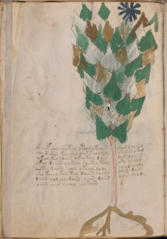

# Voynich Speculative Herbal Ferment Recipe — f38v

IMPORTANT: this is NOT a real or validated translation of the Voynich Manuscript. It is a speculative/procedural model that interprets EVA using a user-defined grammar to generate experimental recipes using safe, known edible substitutes.

This file is generated automatically from IVTFF/EVA transliteration plus a user-defined procedural grammar.



## Page / Folio
- currier: A
- folio: f38v
- page_number: 74
- plant_candidates: ['Cickorium?', 'Lactuca']
- plant_category_confidence: 0.25
- plant_category_guess: leaf
- plant_category_matches: ['section=herbal_default']
- plant_id: Cickorium?, Lactuca
- section: herbal

## Plant Interpretation (Heuristic)
- category: leaf
- confidence: 0.25
- note: Heuristic classification based on the IVTFF 'Plant ID' string (not the drawing). Does not imply real identification of the manuscript plant.
- textual_evidence_terms: ['section=herbal_default']

## EVA Text (Transliteration)
```text
okchop chol shotol oteol okee[a:y] s chor d aiin d
choiin shey key sho oiin s chol ldy okeaiin o kom
qokeey keor daiin okey keey daiin dair daiin s
okeey d aiin qokeey chotey tody oky aiiin d
qoty daiin chol oteeol dody cheod chody
sho keeey key tey daiin daiiin dain dain
daiin qol chy dain @153; or daiin dain daldy
o aiin char chshol chokaiin
```

## Page Summary (Procedural, Aggregated)
- compound_counts: {'mix/transfer': 33, 'sugars': 15, 'main herb': 13, 'yeast fermentation': 26, 'secondary herb': 5, 'heat': 7, 'liquid base': 4}
- dose_level: 3
- fermentation_estimate: 7–14 days

## Pantry (Max Needed For Any Single Line-Recipe)
- main_plant_dry_g: 10
- main_plant_substitute: ['lemon balm']
- secondary_herb_dry_g: 7
- secondary_herb_substitute: ['mint']
- sugar_or_honey_g: 75
- water_l: 0.5
- yeast_g: 1

## Recipes Index (This Page)
- [f38v.1,@P0](#f38v-1-f38v-1-p0)
- [f38v.2,+P0](#f38v-2-f38v-2-p0)
- [f38v.3,+P0](#f38v-3-f38v-3-p0)
- [f38v.4,+P0](#f38v-4-f38v-4-p0)
- [f38v.5,+P0](#f38v-5-f38v-5-p0)
- [f38v.6,+P0](#f38v-6-f38v-6-p0)
- [f38v.7,+P0](#f38v-7-f38v-7-p0)
- [f38v.8,+P0](#f38v-8-f38v-8-p0)

## Line Recipes (Each Line = One Recipe, 0.5L batch)

<a id="f38v-1-f38v-1-p0"></a>

### f38v.1,@P0

EVA: okchop chol shotol oteol okee[a:y] s chor d aiin d

## Ingredients
- main_plant_dry_g: 10
- main_plant_substitute: lemon balm
- secondary_herb_dry_g: 5
- secondary_herb_substitute: mint
- sugar_or_honey_g: 50
- water_l: 0.5
- yeast_g: 1

Process:
1. Sanitize the jar/fermenter and utensils.
2. Base: combine 0.5 L water with 50 g sugar or honey.
3. Apply gentle heat: simmer 10–15 min, then cool to <30°C before adding yeast.
4. Add main plant: lemon balm (~10 g dried).
5. Add secondary herb: mint (~5 g dried).
6. Pitch yeast: 1 g (ideally cider/beer yeast).
7. Ferment with an airlock: 7–14 days (guided by iin/aiin markers).
8. Strain/rack (if very solid-heavy) and cold-crash 24 h.
9. Bottle only when activity clearly slows; refrigerate. Avoid overpressure.

Expected Result: A mild, aromatic herbal ferment, low-to-medium intensity depending on dose level.

Does It Make Sense?: yes

Direct Gloss (Procedural, Not a Real Translation):
- okchop: add fermentable sugars → add main plant (safe substitute) → mix / transfer → start fermentation (yeast)
- chol: add main plant (safe substitute) → mix / transfer
- shotol: apply heat/cooking → add secondary herb (safe substitute) → mix / transfer
- oteol: apply heat/cooking → mix / transfer → duration level 1 → state: active extraction
- okee: add fermentable sugars → mix / transfer → duration level 2 → state: active extraction
- a: duration level 1 → state: fermentation start
- y: [unparsed]
- s: [unparsed]
- chor: add main plant (safe substitute) → mix / transfer
- d: start fermentation (yeast)
- aiin: duration level 1 → state: fermentation start → long fermentation / aging phase
- d: start fermentation (yeast)

<a id="f38v-2-f38v-2-p0"></a>

### f38v.2,+P0

EVA: choiin shey key sho oiin s chol ldy okeaiin o kom

## Ingredients
- main_plant_dry_g: 10
- main_plant_substitute: lemon balm
- secondary_herb_dry_g: 5
- secondary_herb_substitute: mint
- sugar_or_honey_g: 50
- water_l: 0.5
- yeast_g: 1

Process:
1. Sanitize the jar/fermenter and utensils.
2. Base: combine 0.5 L water with 50 g sugar or honey.
3. Infusion: use hot (not boiling) water, then let it cool before adding yeast.
4. Add main plant: lemon balm (~10 g dried).
5. Add secondary herb: mint (~5 g dried).
6. Pitch yeast: 1 g (ideally cider/beer yeast).
7. Ferment with an airlock: 7–14 days (guided by iin/aiin markers).
8. Strain/rack (if very solid-heavy) and cold-crash 24 h.
9. Bottle only when activity clearly slows; refrigerate. Avoid overpressure.

Expected Result: A mild, aromatic herbal ferment, low-to-medium intensity depending on dose level.

Does It Make Sense?: yes

Direct Gloss (Procedural, Not a Real Translation):
- choiin: add main plant (safe substitute) → mix / transfer → duration level 2 → state: cooling/rest → medium fermentation phase
- shey: add secondary herb (safe substitute) → duration level 1 → state: active extraction
- key: add fermentable sugars → duration level 1 → state: active extraction
- sho: add secondary herb (safe substitute) → mix / transfer
- oiin: mix / transfer → duration level 2 → state: cooling/rest → medium fermentation phase
- s: [unparsed]
- chol: add main plant (safe substitute) → mix / transfer
- ldy: start fermentation (yeast)
- okeaiin: add fermentable sugars → mix / transfer → duration level 1 → state: active extraction → long fermentation / aging phase
- o: mix / transfer
- kom: add fermentable sugars → mix / transfer

<a id="f38v-3-f38v-3-p0"></a>

### f38v.3,+P0

EVA: qokeey keor daiin okey keey daiin dair daiin s

## Ingredients
- main_plant_dry_g: 5
- main_plant_substitute: lemon balm
- secondary_herb_dry_g: 2
- secondary_herb_substitute: mint
- sugar_or_honey_g: 50
- water_l: 0.5
- yeast_g: 1

Process:
1. Sanitize the jar/fermenter and utensils.
2. Base: combine 0.5 L water with 50 g sugar or honey.
3. Infusion: use hot (not boiling) water, then let it cool before adding yeast.
4. Add main plant: lemon balm (~5 g dried).
5. Add secondary herb: mint (~2 g dried).
6. Pitch yeast: 1 g (ideally cider/beer yeast).
7. Ferment with an airlock: 7–14 days (guided by iin/aiin markers).
8. Strain/rack (if very solid-heavy) and cold-crash 24 h.
9. Bottle only when activity clearly slows; refrigerate. Avoid overpressure.

Expected Result: A mild, aromatic herbal ferment, low-to-medium intensity depending on dose level.

Does It Make Sense?: yes

Direct Gloss (Procedural, Not a Real Translation):
- qokeey: prepare liquid base → add fermentable sugars → duration level 2 → state: active extraction
- keor: add fermentable sugars → mix / transfer → duration level 1 → state: active extraction
- daiin: start fermentation (yeast) → duration level 1 → state: fermentation start → long fermentation / aging phase
- okey: add fermentable sugars → mix / transfer → duration level 1 → state: active extraction
- keey: add fermentable sugars → duration level 2 → state: active extraction
- daiin: start fermentation (yeast) → duration level 1 → state: fermentation start → long fermentation / aging phase
- dair: start fermentation (yeast) → duration level 1 → state: fermentation start
- daiin: start fermentation (yeast) → duration level 1 → state: fermentation start → long fermentation / aging phase
- s: [unparsed]

<a id="f38v-4-f38v-4-p0"></a>

### f38v.4,+P0

EVA: okeey d aiin qokeey chotey tody oky aiiin d

## Ingredients
- main_plant_dry_g: 10
- main_plant_substitute: lemon balm
- secondary_herb_dry_g: 2
- secondary_herb_substitute: mint
- sugar_or_honey_g: 50
- water_l: 0.5
- yeast_g: 1

Process:
1. Sanitize the jar/fermenter and utensils.
2. Base: combine 0.5 L water with 50 g sugar or honey.
3. Apply gentle heat: simmer 10–15 min, then cool to <30°C before adding yeast.
4. Add main plant: lemon balm (~10 g dried).
5. Add secondary herb: mint (~2 g dried).
6. Pitch yeast: 1 g (ideally cider/beer yeast).
7. Ferment with an airlock: 7–14 days (guided by iin/aiin markers).
8. Strain/rack (if very solid-heavy) and cold-crash 24 h.
9. Bottle only when activity clearly slows; refrigerate. Avoid overpressure.

Expected Result: A mild, aromatic herbal ferment, low-to-medium intensity depending on dose level.

Does It Make Sense?: yes

Direct Gloss (Procedural, Not a Real Translation):
- okeey: add fermentable sugars → mix / transfer → duration level 2 → state: active extraction
- d: start fermentation (yeast)
- aiin: duration level 1 → state: fermentation start → long fermentation / aging phase
- qokeey: prepare liquid base → add fermentable sugars → duration level 2 → state: active extraction
- chotey: apply heat/cooking → add main plant (safe substitute) → mix / transfer → duration level 1 → state: active extraction
- tody: apply heat/cooking → mix / transfer → start fermentation (yeast)
- oky: add fermentable sugars → mix / transfer
- aiiin: duration level 1 → state: fermentation start → medium fermentation phase
- d: start fermentation (yeast)

<a id="f38v-5-f38v-5-p0"></a>

### f38v.5,+P0

EVA: qoty daiin chol oteeol dody cheod chody

## Ingredients
- main_plant_dry_g: 10
- main_plant_substitute: lemon balm
- secondary_herb_dry_g: 2
- secondary_herb_substitute: mint
- sugar_or_honey_g: 25
- water_l: 0.5
- yeast_g: 1

Process:
1. Sanitize the jar/fermenter and utensils.
2. Base: combine 0.5 L water with 25 g sugar or honey.
3. Apply gentle heat: simmer 10–15 min, then cool to <30°C before adding yeast.
4. Add main plant: lemon balm (~10 g dried).
5. Add secondary herb: mint (~2 g dried).
6. Pitch yeast: 1 g (ideally cider/beer yeast).
7. Ferment with an airlock: 7–14 days (guided by iin/aiin markers).
8. Strain/rack (if very solid-heavy) and cold-crash 24 h.
9. Bottle only when activity clearly slows; refrigerate. Avoid overpressure.

Expected Result: A mild, aromatic herbal ferment, low-to-medium intensity depending on dose level.

Does It Make Sense?: yes

Direct Gloss (Procedural, Not a Real Translation):
- qoty: prepare liquid base → apply heat/cooking
- daiin: start fermentation (yeast) → duration level 1 → state: fermentation start → long fermentation / aging phase
- chol: add main plant (safe substitute) → mix / transfer
- oteeol: apply heat/cooking → mix / transfer → duration level 2 → state: active extraction
- dody: mix / transfer → start fermentation (yeast)
- cheod: add main plant (safe substitute) → mix / transfer → start fermentation (yeast) → duration level 1 → state: active extraction
- chody: add main plant (safe substitute) → mix / transfer → start fermentation (yeast)

<a id="f38v-6-f38v-6-p0"></a>

### f38v.6,+P0

EVA: sho keeey key tey daiin daiiin dain dain

## Ingredients
- main_plant_dry_g: 7
- main_plant_substitute: lemon balm
- secondary_herb_dry_g: 7
- secondary_herb_substitute: mint
- sugar_or_honey_g: 75
- water_l: 0.5
- yeast_g: 1

Process:
1. Sanitize the jar/fermenter and utensils.
2. Base: combine 0.5 L water with 75 g sugar or honey.
3. Apply gentle heat: simmer 10–15 min, then cool to <30°C before adding yeast.
4. Add main plant: lemon balm (~7 g dried).
5. Add secondary herb: mint (~7 g dried).
6. Pitch yeast: 1 g (ideally cider/beer yeast).
7. Ferment with an airlock: 7–14 days (guided by iin/aiin markers).
8. Strain/rack (if very solid-heavy) and cold-crash 24 h.
9. Bottle only when activity clearly slows; refrigerate. Avoid overpressure.

Expected Result: A mild, aromatic herbal ferment, low-to-medium intensity depending on dose level.

Does It Make Sense?: yes

Direct Gloss (Procedural, Not a Real Translation):
- sho: add secondary herb (safe substitute) → mix / transfer
- keeey: add fermentable sugars → duration level 3 → state: active extraction
- key: add fermentable sugars → duration level 1 → state: active extraction
- tey: apply heat/cooking → duration level 1 → state: active extraction
- daiin: start fermentation (yeast) → duration level 1 → state: fermentation start → long fermentation / aging phase
- daiiin: start fermentation (yeast) → duration level 1 → state: fermentation start → medium fermentation phase
- dain: start fermentation (yeast) → duration level 1 → state: fermentation start
- dain: start fermentation (yeast) → duration level 1 → state: fermentation start

<a id="f38v-7-f38v-7-p0"></a>

### f38v.7,+P0

EVA: daiin qol chy dain @153; or daiin dain daldy

## Ingredients
- main_plant_dry_g: 5
- main_plant_substitute: lemon balm
- secondary_herb_dry_g: 1
- secondary_herb_substitute: mint
- sugar_or_honey_g: 12
- water_l: 0.5
- yeast_g: 1

Process:
1. Sanitize the jar/fermenter and utensils.
2. Base: combine 0.5 L water with 12 g sugar or honey.
3. Infusion: use hot (not boiling) water, then let it cool before adding yeast.
4. Add main plant: lemon balm (~5 g dried).
5. Add secondary herb: mint (~1 g dried).
6. Pitch yeast: 1 g (ideally cider/beer yeast).
7. Ferment with an airlock: 7–14 days (guided by iin/aiin markers).
8. Strain/rack (if very solid-heavy) and cold-crash 24 h.
9. Bottle only when activity clearly slows; refrigerate. Avoid overpressure.

Expected Result: A mild, aromatic herbal ferment, low-to-medium intensity depending on dose level.

Does It Make Sense?: yes

Direct Gloss (Procedural, Not a Real Translation):
- daiin: start fermentation (yeast) → duration level 1 → state: fermentation start → long fermentation / aging phase
- qol: prepare liquid base
- chy: add main plant (safe substitute)
- dain: start fermentation (yeast) → duration level 1 → state: fermentation start
- or: mix / transfer
- daiin: start fermentation (yeast) → duration level 1 → state: fermentation start → long fermentation / aging phase
- dain: start fermentation (yeast) → duration level 1 → state: fermentation start
- daldy: start fermentation (yeast) → duration level 1 → state: fermentation start

<a id="f38v-8-f38v-8-p0"></a>

### f38v.8,+P0

EVA: o aiin char chshol chokaiin

## Ingredients
- main_plant_dry_g: 5
- main_plant_substitute: lemon balm
- secondary_herb_dry_g: 2
- secondary_herb_substitute: mint
- sugar_or_honey_g: 25
- water_l: 0.5
- yeast_g: 1

Process:
1. Sanitize the jar/fermenter and utensils.
2. Base: combine 0.5 L water with 25 g sugar or honey.
3. Infusion: use hot (not boiling) water, then let it cool before adding yeast.
4. Add main plant: lemon balm (~5 g dried).
5. Add secondary herb: mint (~2 g dried).
6. Pitch yeast: 1 g (ideally cider/beer yeast).
7. Ferment with an airlock: 7–14 days (guided by iin/aiin markers).
8. Strain/rack (if very solid-heavy) and cold-crash 24 h.
9. Bottle only when activity clearly slows; refrigerate. Avoid overpressure.

Expected Result: A mild, aromatic herbal ferment, low-to-medium intensity depending on dose level.

Does It Make Sense?: yes

Direct Gloss (Procedural, Not a Real Translation):
- o: mix / transfer
- aiin: duration level 1 → state: fermentation start → long fermentation / aging phase
- char: add main plant (safe substitute) → duration level 1 → state: fermentation start
- chshol: add main plant (safe substitute) → add secondary herb (safe substitute) → mix / transfer
- chokaiin: add fermentable sugars → add main plant (safe substitute) → mix / transfer → duration level 1 → state: fermentation start → long fermentation / aging phase

## Risks & Warnings (Applies To All Line-Recipes)
- Never use unidentified Voynich plants directly; only use known edible substitutes.
- Do not consume if you see mold, smell rot, notice abnormal sliminess, or taste something clearly foul.
- Overpressure/bottle-bomb risk: do not bottle before stable; prefer an airlock and refrigeration.
- Avoid if pregnant/breastfeeding, for minors, or with medical conditions; consult a professional.
- No medical claims: this is an experimental beverage.

## Recommended Adjustments (General)
- If too bitter (leafy profile), halve the herbs or shorten steep/maceration time.
- If too sweet, extend fermentation or reduce sugar by 25–50%.
- For a non-alcoholic version, omit yeast and keep refrigerated as an infusion (not fermented).
