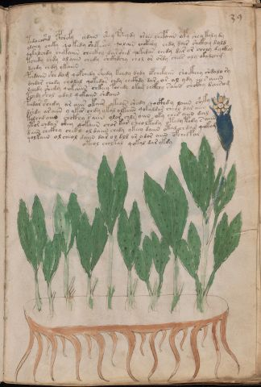

# Voynich Speculative Herbal Ferment Recipe — f39r

IMPORTANT: this is NOT a real or validated translation of the Voynich Manuscript. It is a speculative/procedural model that interprets EVA using a user-defined grammar to generate experimental recipes using safe, known edible substitutes.

This file is generated automatically from IVTFF/EVA transliteration plus a user-defined procedural grammar.

## Page / Folio
- currier: B
- folio: f39r
- page_number: 75
- plant_candidates: ['crocus?']
- plant_category_confidence: 0.25
- plant_category_guess: leaf
- plant_category_matches: ['section=herbal_default']
- plant_id: crocus? (RZ)
- section: herbal

## Plant Interpretation (Heuristic)
- category: leaf
- confidence: 0.25
- note: Heuristic classification based on the IVTFF 'Plant ID' string (not the drawing). Does not imply real identification of the manuscript plant.
- textual_evidence_terms: ['section=herbal_default']

## EVA Text (Transliteration)
tedo chshd cphhofy chdain shey f[sh:se]y dy orain cheepaiin ofy shey k[a:o]ly dy
olchey cheky qokedy shekshey qolain chckh'hy chdy dair shckhey dold
qokalchdy chekaiin checkhy darshed qokeedar eeedy dar ar cheey dyckhy
tchedy chdy olaiin chedy shckhdchy chol or ordy chees aly okalcheg
dchdy chdy ykaiin
pchdaiin she dam qofchedy shedy kchdy dydy opchekaiin shockhhy shdalo ry
dchdar chedy cholal qokedar chdy chckhdy dar ar al ydy eee s aiiin
lchedy shedy qokaiin chkeey fchedy okam chcfhhy saiin chckhy daisog
tchedy shol odal qokaiin shdaiin
pchdar shedy ar aiir okair ykeols shedy qockhdy laiin c'yky
dshdy ar aiin y yk[en:cr] chdy ykal olkaiin qokaldar cheol dar aiin
tolchda[iin:ii?] chckhy s aiin olor chls aiin oky ches aiin dal
ytor chdar shey qokaiin chor kar sheolkedy otedy tedy s aiin
daiin shckhy chekl ol daiin chedy ykeey daiin otal chdam qokam
qolkain ol cheol daiin dar ol dld [ar:iir] ador aiin ofcheefar
oteol cholkal qokal dar ykdy

## Page Summary (Procedural, Aggregated)
- compound_counts: {'heat': 9, 'yeast fermentation': 79, 'mix/transfer': 42, 'main herb': 50, 'secondary herb': 22, 'complex herbal compound': 13, 'aroma modifier': 7, 'sugars': 34, 'liquid base': 14}
- dose_level: 3
- fermentation_estimate: 7–14 days

## Pantry (Max Needed For Any Single Line-Recipe)
- aroma_modifier: ['lemon peel (optional)']
- aroma_modifier_dose: ['2–5 g (or 1 strip of peel, avoiding the bitter pith)']
- main_plant_dry_g: 15
- main_plant_substitute: ['lemon balm']
- safe_complex_herbal_blend: ['gentle spices (e.g., 1 g cinnamon + 1 g clove) or a commercial herbal tea blend']
- secondary_herb_dry_g: 7
- secondary_herb_substitute: ['mint']
- sugar_or_honey_g: 75
- water_l: 0.5
- yeast_g: 1

## Line Recipes (Each Line = One Recipe, 0.5L batch)

### f39r.1,@P0

EVA: tedo chshd cphhofy chdain shey f[sh:se]y dy orain cheepaiin ofy shey k[a:o]ly dy

## Ingredients
- aroma_modifier: lemon peel (optional)
- aroma_modifier_dose: 2–5 g (or 1 strip of peel, avoiding the bitter pith)
- main_plant_dry_g: 10
- main_plant_substitute: lemon balm
- safe_complex_herbal_blend: gentle spices (e.g., 1 g cinnamon + 1 g clove) or a commercial herbal tea blend
- secondary_herb_dry_g: 5
- secondary_herb_substitute: mint
- sugar_or_honey_g: 50
- water_l: 0.5
- yeast_g: 1

Process:
1. Sanitize the jar/fermenter and utensils.
2. Base: combine 0.5 L water with 50 g sugar or honey.
3. Apply gentle heat: simmer 10–15 min, then cool to <30°C before adding yeast.
4. Add main plant: lemon balm (~10 g dried).
5. Add secondary herb: mint (~5 g dried).
6. Add aroma modifier (optional) in a low dose.
7. If a complex herbal compound appears, use a safe commercial blend or gentle spices in micro-doses.
8. Pitch yeast: 1 g (ideally cider/beer yeast).
9. Ferment with an airlock: 7–14 days (guided by iin/aiin markers).
10. Strain/rack (if very solid-heavy) and cold-crash 24 h.
11. Bottle only when activity clearly slows; refrigerate. Avoid overpressure.

Expected Result: A mild, aromatic herbal ferment, low-to-medium intensity depending on dose level.

Does It Make Sense?: yes

Direct Gloss (Procedural, Not a Real Translation):
- tedo: apply heat/cooking → mix / transfer → start fermentation (yeast) → duration level 1 → state: active extraction
- chshd: add main plant (safe substitute) → add secondary herb (safe substitute) → start fermentation (yeast)
- cphhofy: add aroma modifier → mix / transfer → add complex herbal compound (safe blend)
- chdain: add main plant (safe substitute) → start fermentation (yeast) → duration level 1 → state: fermentation start
- shey: add secondary herb (safe substitute) → duration level 1 → state: active extraction
- f: add aroma modifier
- sh: add secondary herb (safe substitute)
- se: duration level 1 → state: active extraction
- y: [unparsed]
- dy: start fermentation (yeast)
- orain: mix / transfer → duration level 1 → state: fermentation start
- cheepaiin: add main plant (safe substitute) → start fermentation (yeast) → duration level 2 → state: active extraction → long fermentation / aging phase
- ofy: add aroma modifier → mix / transfer
- shey: add secondary herb (safe substitute) → duration level 1 → state: active extraction
- k: add fermentable sugars
- a: duration level 1 → state: fermentation start
- o: mix / transfer
- ly: [unparsed]
- dy: start fermentation (yeast)

### f39r.2,+P0

EVA: olchey cheky qokedy shekshey qolain chckh'hy chdy dair shckhey dold

## Ingredients
- main_plant_dry_g: 5
- main_plant_substitute: lemon balm
- safe_complex_herbal_blend: gentle spices (e.g., 1 g cinnamon + 1 g clove) or a commercial herbal tea blend
- secondary_herb_dry_g: 2
- secondary_herb_substitute: mint
- sugar_or_honey_g: 25
- water_l: 0.5
- yeast_g: 1

Process:
1. Sanitize the jar/fermenter and utensils.
2. Base: combine 0.5 L water with 25 g sugar or honey.
3. Infusion: use hot (not boiling) water, then let it cool before adding yeast.
4. Add main plant: lemon balm (~5 g dried).
5. Add secondary herb: mint (~2 g dried).
6. If a complex herbal compound appears, use a safe commercial blend or gentle spices in micro-doses.
7. Pitch yeast: 1 g (ideally cider/beer yeast).
8. Ferment with an airlock: 2–4 days (guided by iin/aiin markers).
9. Strain/rack (if very solid-heavy) and cold-crash 24 h.
10. Bottle only when activity clearly slows; refrigerate. Avoid overpressure.

Expected Result: A mild, aromatic herbal ferment, low-to-medium intensity depending on dose level.

Does It Make Sense?: yes

Direct Gloss (Procedural, Not a Real Translation):
- olchey: add main plant (safe substitute) → mix / transfer → duration level 1 → state: active extraction
- cheky: add fermentable sugars → add main plant (safe substitute) → duration level 1 → state: active extraction
- qokedy: prepare liquid base → add fermentable sugars → start fermentation (yeast) → duration level 1 → state: active extraction
- shekshey: add fermentable sugars → add secondary herb (safe substitute) → duration level 1 → state: active extraction
- qolain: prepare liquid base → duration level 1 → state: fermentation start
- chckh: add main plant (safe substitute) → add complex herbal compound (safe blend)
- hy: [unparsed]
- chdy: add main plant (safe substitute) → start fermentation (yeast)
- dair: start fermentation (yeast) → duration level 1 → state: fermentation start
- shckhey: add secondary herb (safe substitute) → add complex herbal compound (safe blend) → duration level 1 → state: active extraction
- dold: mix / transfer → start fermentation (yeast)

### f39r.3,+P0

EVA: qokalchdy chekaiin checkhy darshed qokeedar eeedy dar ar cheey dyckhy

## Ingredients
- main_plant_dry_g: 15
- main_plant_substitute: lemon balm
- safe_complex_herbal_blend: gentle spices (e.g., 1 g cinnamon + 1 g clove) or a commercial herbal tea blend
- secondary_herb_dry_g: 7
- secondary_herb_substitute: mint
- sugar_or_honey_g: 75
- water_l: 0.5
- yeast_g: 1

Process:
1. Sanitize the jar/fermenter and utensils.
2. Base: combine 0.5 L water with 75 g sugar or honey.
3. Infusion: use hot (not boiling) water, then let it cool before adding yeast.
4. Add main plant: lemon balm (~15 g dried).
5. Add secondary herb: mint (~7 g dried).
6. If a complex herbal compound appears, use a safe commercial blend or gentle spices in micro-doses.
7. Pitch yeast: 1 g (ideally cider/beer yeast).
8. Ferment with an airlock: 7–14 days (guided by iin/aiin markers).
9. Strain/rack (if very solid-heavy) and cold-crash 24 h.
10. Bottle only when activity clearly slows; refrigerate. Avoid overpressure.

Expected Result: A mild, aromatic herbal ferment, low-to-medium intensity depending on dose level.

Does It Make Sense?: yes

Direct Gloss (Procedural, Not a Real Translation):
- qokalchdy: prepare liquid base → add fermentable sugars → add main plant (safe substitute) → start fermentation (yeast) → duration level 1 → state: fermentation start
- chekaiin: add fermentable sugars → add main plant (safe substitute) → duration level 1 → state: active extraction → long fermentation / aging phase
- checkhy: add main plant (safe substitute) → add complex herbal compound (safe blend) → duration level 1 → state: active extraction
- darshed: add secondary herb (safe substitute) → start fermentation (yeast) → duration level 1 → state: fermentation start
- qokeedar: prepare liquid base → add fermentable sugars → start fermentation (yeast) → duration level 2 → state: active extraction
- eeedy: start fermentation (yeast) → duration level 3 → state: active extraction
- dar: start fermentation (yeast) → duration level 1 → state: fermentation start
- ar: duration level 1 → state: fermentation start
- cheey: add main plant (safe substitute) → duration level 2 → state: active extraction
- dyckhy: start fermentation (yeast) → add complex herbal compound (safe blend)

### f39r.4,+P0

EVA: tchedy chdy olaiin chedy shckhdchy chol or ordy chees aly okalcheg

## Ingredients
- main_plant_dry_g: 10
- main_plant_substitute: lemon balm
- safe_complex_herbal_blend: gentle spices (e.g., 1 g cinnamon + 1 g clove) or a commercial herbal tea blend
- secondary_herb_dry_g: 5
- secondary_herb_substitute: mint
- sugar_or_honey_g: 50
- water_l: 0.5
- yeast_g: 1

Process:
1. Sanitize the jar/fermenter and utensils.
2. Base: combine 0.5 L water with 50 g sugar or honey.
3. Apply gentle heat: simmer 10–15 min, then cool to <30°C before adding yeast.
4. Add main plant: lemon balm (~10 g dried).
5. Add secondary herb: mint (~5 g dried).
6. If a complex herbal compound appears, use a safe commercial blend or gentle spices in micro-doses.
7. Pitch yeast: 1 g (ideally cider/beer yeast).
8. Ferment with an airlock: 7–14 days (guided by iin/aiin markers).
9. Strain/rack (if very solid-heavy) and cold-crash 24 h.
10. Bottle only when activity clearly slows; refrigerate. Avoid overpressure.

Expected Result: A mild, aromatic herbal ferment, low-to-medium intensity depending on dose level.

Does It Make Sense?: yes

Direct Gloss (Procedural, Not a Real Translation):
- tchedy: apply heat/cooking → add main plant (safe substitute) → start fermentation (yeast) → duration level 1 → state: active extraction
- chdy: add main plant (safe substitute) → start fermentation (yeast)
- olaiin: mix / transfer → duration level 1 → state: fermentation start → long fermentation / aging phase
- chedy: add main plant (safe substitute) → start fermentation (yeast) → duration level 1 → state: active extraction
- shckhdchy: add main plant (safe substitute) → add secondary herb (safe substitute) → start fermentation (yeast) → add complex herbal compound (safe blend)
- chol: add main plant (safe substitute) → mix / transfer
- or: mix / transfer
- ordy: mix / transfer → start fermentation (yeast)
- chees: add main plant (safe substitute) → duration level 2 → state: active extraction
- aly: duration level 1 → state: fermentation start
- okalcheg: add fermentable sugars → add main plant (safe substitute) → mix / transfer → duration level 1 → state: fermentation start

### f39r.5,+P0

EVA: dchdy chdy ykaiin

## Ingredients
- main_plant_dry_g: 5
- main_plant_substitute: lemon balm
- secondary_herb_dry_g: 1
- secondary_herb_substitute: mint
- sugar_or_honey_g: 25
- water_l: 0.5
- yeast_g: 1

Process:
1. Sanitize the jar/fermenter and utensils.
2. Base: combine 0.5 L water with 25 g sugar or honey.
3. Infusion: use hot (not boiling) water, then let it cool before adding yeast.
4. Add main plant: lemon balm (~5 g dried).
5. Add secondary herb: mint (~1 g dried).
6. Pitch yeast: 1 g (ideally cider/beer yeast).
7. Ferment with an airlock: 7–14 days (guided by iin/aiin markers).
8. Strain/rack (if very solid-heavy) and cold-crash 24 h.
9. Bottle only when activity clearly slows; refrigerate. Avoid overpressure.

Expected Result: A mild, aromatic herbal ferment, low-to-medium intensity depending on dose level.

Does It Make Sense?: yes

Direct Gloss (Procedural, Not a Real Translation):
- dchdy: add main plant (safe substitute) → start fermentation (yeast)
- chdy: add main plant (safe substitute) → start fermentation (yeast)
- ykaiin: add fermentable sugars → duration level 1 → state: fermentation start → long fermentation / aging phase

### f39r.6,+P0

EVA: pchdaiin she dam qofchedy shedy kchdy dydy opchekaiin shockhhy shdalo ry

## Ingredients
- aroma_modifier: lemon peel (optional)
- aroma_modifier_dose: 2–5 g (or 1 strip of peel, avoiding the bitter pith)
- main_plant_dry_g: 5
- main_plant_substitute: lemon balm
- safe_complex_herbal_blend: gentle spices (e.g., 1 g cinnamon + 1 g clove) or a commercial herbal tea blend
- secondary_herb_dry_g: 2
- secondary_herb_substitute: mint
- sugar_or_honey_g: 25
- water_l: 0.5
- yeast_g: 1

Process:
1. Sanitize the jar/fermenter and utensils.
2. Base: combine 0.5 L water with 25 g sugar or honey.
3. Infusion: use hot (not boiling) water, then let it cool before adding yeast.
4. Add main plant: lemon balm (~5 g dried).
5. Add secondary herb: mint (~2 g dried).
6. Add aroma modifier (optional) in a low dose.
7. If a complex herbal compound appears, use a safe commercial blend or gentle spices in micro-doses.
8. Pitch yeast: 1 g (ideally cider/beer yeast).
9. Ferment with an airlock: 7–14 days (guided by iin/aiin markers).
10. Strain/rack (if very solid-heavy) and cold-crash 24 h.
11. Bottle only when activity clearly slows; refrigerate. Avoid overpressure.

Expected Result: A mild, aromatic herbal ferment, low-to-medium intensity depending on dose level.

Does It Make Sense?: yes

Direct Gloss (Procedural, Not a Real Translation):
- pchdaiin: add main plant (safe substitute) → start fermentation (yeast) → duration level 1 → state: fermentation start → long fermentation / aging phase
- she: add secondary herb (safe substitute) → duration level 1 → state: active extraction
- dam: start fermentation (yeast) → duration level 1 → state: fermentation start
- qofchedy: prepare liquid base → add main plant (safe substitute) → add aroma modifier → start fermentation (yeast) → duration level 1 → state: active extraction
- shedy: add secondary herb (safe substitute) → start fermentation (yeast) → duration level 1 → state: active extraction
- kchdy: add fermentable sugars → add main plant (safe substitute) → start fermentation (yeast)
- dydy: start fermentation (yeast)
- opchekaiin: add fermentable sugars → add main plant (safe substitute) → mix / transfer → start fermentation (yeast) → duration level 1 → state: active extraction → long fermentation / aging phase
- shockhhy: add secondary herb (safe substitute) → mix / transfer → add complex herbal compound (safe blend)
- shdalo: add secondary herb (safe substitute) → mix / transfer → start fermentation (yeast) → duration level 1 → state: fermentation start
- ry: [unparsed]

### f39r.7,+P0

EVA: dchdar chedy cholal qokedar chdy chckhdy dar ar al ydy eee s aiiin

## Ingredients
- main_plant_dry_g: 15
- main_plant_substitute: lemon balm
- safe_complex_herbal_blend: gentle spices (e.g., 1 g cinnamon + 1 g clove) or a commercial herbal tea blend
- secondary_herb_dry_g: 3
- secondary_herb_substitute: mint
- sugar_or_honey_g: 75
- water_l: 0.5
- yeast_g: 1

Process:
1. Sanitize the jar/fermenter and utensils.
2. Base: combine 0.5 L water with 75 g sugar or honey.
3. Infusion: use hot (not boiling) water, then let it cool before adding yeast.
4. Add main plant: lemon balm (~15 g dried).
5. Add secondary herb: mint (~3 g dried).
6. If a complex herbal compound appears, use a safe commercial blend or gentle spices in micro-doses.
7. Pitch yeast: 1 g (ideally cider/beer yeast).
8. Ferment with an airlock: 3–5 days (guided by iin/aiin markers).
9. Strain/rack (if very solid-heavy) and cold-crash 24 h.
10. Bottle only when activity clearly slows; refrigerate. Avoid overpressure.

Expected Result: A mild, aromatic herbal ferment, low-to-medium intensity depending on dose level.

Does It Make Sense?: yes

Direct Gloss (Procedural, Not a Real Translation):
- dchdar: add main plant (safe substitute) → start fermentation (yeast) → duration level 1 → state: fermentation start
- chedy: add main plant (safe substitute) → start fermentation (yeast) → duration level 1 → state: active extraction
- cholal: add main plant (safe substitute) → mix / transfer → duration level 1 → state: fermentation start
- qokedar: prepare liquid base → add fermentable sugars → start fermentation (yeast) → duration level 1 → state: active extraction
- chdy: add main plant (safe substitute) → start fermentation (yeast)
- chckhdy: add main plant (safe substitute) → start fermentation (yeast) → add complex herbal compound (safe blend)
- dar: start fermentation (yeast) → duration level 1 → state: fermentation start
- ar: duration level 1 → state: fermentation start
- al: duration level 1 → state: fermentation start
- ydy: start fermentation (yeast)
- eee: duration level 3 → state: active extraction
- s: [unparsed]
- aiiin: duration level 1 → state: fermentation start → medium fermentation phase

### f39r.8,+P0

EVA: lchedy shedy qokaiin chkeey fchedy okam chcfhhy saiin chckhy daisog

## Ingredients
- aroma_modifier: lemon peel (optional)
- aroma_modifier_dose: 2–5 g (or 1 strip of peel, avoiding the bitter pith)
- main_plant_dry_g: 10
- main_plant_substitute: lemon balm
- safe_complex_herbal_blend: gentle spices (e.g., 1 g cinnamon + 1 g clove) or a commercial herbal tea blend
- secondary_herb_dry_g: 5
- secondary_herb_substitute: mint
- sugar_or_honey_g: 50
- water_l: 0.5
- yeast_g: 1

Process:
1. Sanitize the jar/fermenter and utensils.
2. Base: combine 0.5 L water with 50 g sugar or honey.
3. Infusion: use hot (not boiling) water, then let it cool before adding yeast.
4. Add main plant: lemon balm (~10 g dried).
5. Add secondary herb: mint (~5 g dried).
6. Add aroma modifier (optional) in a low dose.
7. If a complex herbal compound appears, use a safe commercial blend or gentle spices in micro-doses.
8. Pitch yeast: 1 g (ideally cider/beer yeast).
9. Ferment with an airlock: 7–14 days (guided by iin/aiin markers).
10. Strain/rack (if very solid-heavy) and cold-crash 24 h.
11. Bottle only when activity clearly slows; refrigerate. Avoid overpressure.

Expected Result: A mild, aromatic herbal ferment, low-to-medium intensity depending on dose level.

Does It Make Sense?: yes

Direct Gloss (Procedural, Not a Real Translation):
- lchedy: add main plant (safe substitute) → start fermentation (yeast) → duration level 1 → state: active extraction
- shedy: add secondary herb (safe substitute) → start fermentation (yeast) → duration level 1 → state: active extraction
- qokaiin: prepare liquid base → add fermentable sugars → duration level 1 → state: fermentation start → long fermentation / aging phase
- chkeey: add fermentable sugars → add main plant (safe substitute) → duration level 2 → state: active extraction
- fchedy: add main plant (safe substitute) → add aroma modifier → start fermentation (yeast) → duration level 1 → state: active extraction
- okam: add fermentable sugars → mix / transfer → duration level 1 → state: fermentation start
- chcfhhy: add main plant (safe substitute) → add complex herbal compound (safe blend)
- saiin: duration level 1 → state: fermentation start → long fermentation / aging phase
- chckhy: add main plant (safe substitute) → add complex herbal compound (safe blend)
- daisog: mix / transfer → start fermentation (yeast) → duration level 1 → state: fermentation start

### f39r.9,+P0

EVA: tchedy shol odal qokaiin shdaiin

## Ingredients
- main_plant_dry_g: 5
- main_plant_substitute: lemon balm
- secondary_herb_dry_g: 2
- secondary_herb_substitute: mint
- sugar_or_honey_g: 25
- water_l: 0.5
- yeast_g: 1

Process:
1. Sanitize the jar/fermenter and utensils.
2. Base: combine 0.5 L water with 25 g sugar or honey.
3. Apply gentle heat: simmer 10–15 min, then cool to <30°C before adding yeast.
4. Add main plant: lemon balm (~5 g dried).
5. Add secondary herb: mint (~2 g dried).
6. Pitch yeast: 1 g (ideally cider/beer yeast).
7. Ferment with an airlock: 7–14 days (guided by iin/aiin markers).
8. Strain/rack (if very solid-heavy) and cold-crash 24 h.
9. Bottle only when activity clearly slows; refrigerate. Avoid overpressure.

Expected Result: A mild, aromatic herbal ferment, low-to-medium intensity depending on dose level.

Does It Make Sense?: yes

Direct Gloss (Procedural, Not a Real Translation):
- tchedy: apply heat/cooking → add main plant (safe substitute) → start fermentation (yeast) → duration level 1 → state: active extraction
- shol: add secondary herb (safe substitute) → mix / transfer
- odal: mix / transfer → start fermentation (yeast) → duration level 1 → state: fermentation start
- qokaiin: prepare liquid base → add fermentable sugars → duration level 1 → state: fermentation start → long fermentation / aging phase
- shdaiin: add secondary herb (safe substitute) → start fermentation (yeast) → duration level 1 → state: fermentation start → long fermentation / aging phase

### f39r.10,+P0

EVA: pchdar shedy ar aiir okair ykeols shedy qockhdy laiin c'yky

## Ingredients
- main_plant_dry_g: 5
- main_plant_substitute: lemon balm
- safe_complex_herbal_blend: gentle spices (e.g., 1 g cinnamon + 1 g clove) or a commercial herbal tea blend
- secondary_herb_dry_g: 2
- secondary_herb_substitute: mint
- sugar_or_honey_g: 25
- water_l: 0.5
- yeast_g: 1

Process:
1. Sanitize the jar/fermenter and utensils.
2. Base: combine 0.5 L water with 25 g sugar or honey.
3. Infusion: use hot (not boiling) water, then let it cool before adding yeast.
4. Add main plant: lemon balm (~5 g dried).
5. Add secondary herb: mint (~2 g dried).
6. If a complex herbal compound appears, use a safe commercial blend or gentle spices in micro-doses.
7. Pitch yeast: 1 g (ideally cider/beer yeast).
8. Ferment with an airlock: 7–14 days (guided by iin/aiin markers).
9. Strain/rack (if very solid-heavy) and cold-crash 24 h.
10. Bottle only when activity clearly slows; refrigerate. Avoid overpressure.

Expected Result: A mild, aromatic herbal ferment, low-to-medium intensity depending on dose level.

Does It Make Sense?: yes

Direct Gloss (Procedural, Not a Real Translation):
- pchdar: add main plant (safe substitute) → start fermentation (yeast) → duration level 1 → state: fermentation start
- shedy: add secondary herb (safe substitute) → start fermentation (yeast) → duration level 1 → state: active extraction
- ar: duration level 1 → state: fermentation start
- aiir: duration level 1 → state: fermentation start
- okair: add fermentable sugars → mix / transfer → duration level 1 → state: fermentation start
- ykeols: add fermentable sugars → mix / transfer → duration level 1 → state: active extraction
- shedy: add secondary herb (safe substitute) → start fermentation (yeast) → duration level 1 → state: active extraction
- qockhdy: prepare liquid base → start fermentation (yeast) → add complex herbal compound (safe blend)
- laiin: duration level 1 → state: fermentation start → long fermentation / aging phase
- c: [unparsed]
- yky: add fermentable sugars

### f39r.11,+P0

EVA: dshdy ar aiin y yk[en:cr] chdy ykal olkaiin qokaldar cheol dar aiin

## Ingredients
- main_plant_dry_g: 5
- main_plant_substitute: lemon balm
- secondary_herb_dry_g: 2
- secondary_herb_substitute: mint
- sugar_or_honey_g: 25
- water_l: 0.5
- yeast_g: 1

Process:
1. Sanitize the jar/fermenter and utensils.
2. Base: combine 0.5 L water with 25 g sugar or honey.
3. Infusion: use hot (not boiling) water, then let it cool before adding yeast.
4. Add main plant: lemon balm (~5 g dried).
5. Add secondary herb: mint (~2 g dried).
6. Pitch yeast: 1 g (ideally cider/beer yeast).
7. Ferment with an airlock: 7–14 days (guided by iin/aiin markers).
8. Strain/rack (if very solid-heavy) and cold-crash 24 h.
9. Bottle only when activity clearly slows; refrigerate. Avoid overpressure.

Expected Result: A mild, aromatic herbal ferment, low-to-medium intensity depending on dose level.

Does It Make Sense?: yes

Direct Gloss (Procedural, Not a Real Translation):
- dshdy: add secondary herb (safe substitute) → start fermentation (yeast)
- ar: duration level 1 → state: fermentation start
- aiin: duration level 1 → state: fermentation start → long fermentation / aging phase
- y: [unparsed]
- yk: add fermentable sugars
- en: duration level 1 → state: active extraction
- cr: [unparsed]
- chdy: add main plant (safe substitute) → start fermentation (yeast)
- ykal: add fermentable sugars → duration level 1 → state: fermentation start
- olkaiin: add fermentable sugars → mix / transfer → duration level 1 → state: fermentation start → long fermentation / aging phase
- qokaldar: prepare liquid base → add fermentable sugars → start fermentation (yeast) → duration level 1 → state: fermentation start
- cheol: add main plant (safe substitute) → mix / transfer → duration level 1 → state: active extraction
- dar: start fermentation (yeast) → duration level 1 → state: fermentation start
- aiin: duration level 1 → state: fermentation start → long fermentation / aging phase

### f39r.12,+P0

EVA: tolchda[iin:ii?] chckhy s aiin olor chls aiin oky ches aiin dal

## Ingredients
- main_plant_dry_g: 10
- main_plant_substitute: lemon balm
- safe_complex_herbal_blend: gentle spices (e.g., 1 g cinnamon + 1 g clove) or a commercial herbal tea blend
- secondary_herb_dry_g: 2
- secondary_herb_substitute: mint
- sugar_or_honey_g: 50
- water_l: 0.5
- yeast_g: 1

Process:
1. Sanitize the jar/fermenter and utensils.
2. Base: combine 0.5 L water with 50 g sugar or honey.
3. Apply gentle heat: simmer 10–15 min, then cool to <30°C before adding yeast.
4. Add main plant: lemon balm (~10 g dried).
5. Add secondary herb: mint (~2 g dried).
6. If a complex herbal compound appears, use a safe commercial blend or gentle spices in micro-doses.
7. Pitch yeast: 1 g (ideally cider/beer yeast).
8. Ferment with an airlock: 7–14 days (guided by iin/aiin markers).
9. Strain/rack (if very solid-heavy) and cold-crash 24 h.
10. Bottle only when activity clearly slows; refrigerate. Avoid overpressure.

Expected Result: A mild, aromatic herbal ferment, low-to-medium intensity depending on dose level.

Does It Make Sense?: yes

Direct Gloss (Procedural, Not a Real Translation):
- tolchda: apply heat/cooking → add main plant (safe substitute) → mix / transfer → start fermentation (yeast) → duration level 1 → state: fermentation start
- iin: duration level 2 → state: cooling/rest → medium fermentation phase
- ii: duration level 2 → state: cooling/rest
- chckhy: add main plant (safe substitute) → add complex herbal compound (safe blend)
- s: [unparsed]
- aiin: duration level 1 → state: fermentation start → long fermentation / aging phase
- olor: mix / transfer
- chls: add main plant (safe substitute)
- aiin: duration level 1 → state: fermentation start → long fermentation / aging phase
- oky: add fermentable sugars → mix / transfer
- ches: add main plant (safe substitute) → duration level 1 → state: active extraction
- aiin: duration level 1 → state: fermentation start → long fermentation / aging phase
- dal: start fermentation (yeast) → duration level 1 → state: fermentation start

### f39r.13,+P0

EVA: ytor chdar shey qokaiin chor kar sheolkedy otedy tedy s aiin

## Ingredients
- main_plant_dry_g: 5
- main_plant_substitute: lemon balm
- secondary_herb_dry_g: 2
- secondary_herb_substitute: mint
- sugar_or_honey_g: 25
- water_l: 0.5
- yeast_g: 1

Process:
1. Sanitize the jar/fermenter and utensils.
2. Base: combine 0.5 L water with 25 g sugar or honey.
3. Apply gentle heat: simmer 10–15 min, then cool to <30°C before adding yeast.
4. Add main plant: lemon balm (~5 g dried).
5. Add secondary herb: mint (~2 g dried).
6. Pitch yeast: 1 g (ideally cider/beer yeast).
7. Ferment with an airlock: 7–14 days (guided by iin/aiin markers).
8. Strain/rack (if very solid-heavy) and cold-crash 24 h.
9. Bottle only when activity clearly slows; refrigerate. Avoid overpressure.

Expected Result: A mild, aromatic herbal ferment, low-to-medium intensity depending on dose level.

Does It Make Sense?: yes

Direct Gloss (Procedural, Not a Real Translation):
- ytor: apply heat/cooking → mix / transfer
- chdar: add main plant (safe substitute) → start fermentation (yeast) → duration level 1 → state: fermentation start
- shey: add secondary herb (safe substitute) → duration level 1 → state: active extraction
- qokaiin: prepare liquid base → add fermentable sugars → duration level 1 → state: fermentation start → long fermentation / aging phase
- chor: add main plant (safe substitute) → mix / transfer
- kar: add fermentable sugars → duration level 1 → state: fermentation start
- sheolkedy: add fermentable sugars → add secondary herb (safe substitute) → mix / transfer → start fermentation (yeast) → duration level 1 → state: active extraction
- otedy: apply heat/cooking → mix / transfer → start fermentation (yeast) → duration level 1 → state: active extraction
- tedy: apply heat/cooking → start fermentation (yeast) → duration level 1 → state: active extraction
- s: [unparsed]
- aiin: duration level 1 → state: fermentation start → long fermentation / aging phase

### f39r.14,+P0

EVA: daiin shckhy chekl ol daiin chedy ykeey daiin otal chdam qokam

## Ingredients
- main_plant_dry_g: 10
- main_plant_substitute: lemon balm
- safe_complex_herbal_blend: gentle spices (e.g., 1 g cinnamon + 1 g clove) or a commercial herbal tea blend
- secondary_herb_dry_g: 5
- secondary_herb_substitute: mint
- sugar_or_honey_g: 50
- water_l: 0.5
- yeast_g: 1

Process:
1. Sanitize the jar/fermenter and utensils.
2. Base: combine 0.5 L water with 50 g sugar or honey.
3. Apply gentle heat: simmer 10–15 min, then cool to <30°C before adding yeast.
4. Add main plant: lemon balm (~10 g dried).
5. Add secondary herb: mint (~5 g dried).
6. If a complex herbal compound appears, use a safe commercial blend or gentle spices in micro-doses.
7. Pitch yeast: 1 g (ideally cider/beer yeast).
8. Ferment with an airlock: 7–14 days (guided by iin/aiin markers).
9. Strain/rack (if very solid-heavy) and cold-crash 24 h.
10. Bottle only when activity clearly slows; refrigerate. Avoid overpressure.

Expected Result: A mild, aromatic herbal ferment, low-to-medium intensity depending on dose level.

Does It Make Sense?: yes

Direct Gloss (Procedural, Not a Real Translation):
- daiin: start fermentation (yeast) → duration level 1 → state: fermentation start → long fermentation / aging phase
- shckhy: add secondary herb (safe substitute) → add complex herbal compound (safe blend)
- chekl: add fermentable sugars → add main plant (safe substitute) → duration level 1 → state: active extraction
- ol: mix / transfer
- daiin: start fermentation (yeast) → duration level 1 → state: fermentation start → long fermentation / aging phase
- chedy: add main plant (safe substitute) → start fermentation (yeast) → duration level 1 → state: active extraction
- ykeey: add fermentable sugars → duration level 2 → state: active extraction
- daiin: start fermentation (yeast) → duration level 1 → state: fermentation start → long fermentation / aging phase
- otal: apply heat/cooking → mix / transfer → duration level 1 → state: fermentation start
- chdam: add main plant (safe substitute) → start fermentation (yeast) → duration level 1 → state: fermentation start
- qokam: prepare liquid base → add fermentable sugars → duration level 1 → state: fermentation start

### f39r.15,+P0

EVA: qolkain ol cheol daiin dar ol dld [ar:iir] ador aiin ofcheefar

## Ingredients
- aroma_modifier: lemon peel (optional)
- aroma_modifier_dose: 2–5 g (or 1 strip of peel, avoiding the bitter pith)
- main_plant_dry_g: 10
- main_plant_substitute: lemon balm
- secondary_herb_dry_g: 2
- secondary_herb_substitute: mint
- sugar_or_honey_g: 50
- water_l: 0.5
- yeast_g: 1

Process:
1. Sanitize the jar/fermenter and utensils.
2. Base: combine 0.5 L water with 50 g sugar or honey.
3. Infusion: use hot (not boiling) water, then let it cool before adding yeast.
4. Add main plant: lemon balm (~10 g dried).
5. Add secondary herb: mint (~2 g dried).
6. Add aroma modifier (optional) in a low dose.
7. Pitch yeast: 1 g (ideally cider/beer yeast).
8. Ferment with an airlock: 7–14 days (guided by iin/aiin markers).
9. Strain/rack (if very solid-heavy) and cold-crash 24 h.
10. Bottle only when activity clearly slows; refrigerate. Avoid overpressure.

Expected Result: A mild, aromatic herbal ferment, low-to-medium intensity depending on dose level.

Does It Make Sense?: yes

Direct Gloss (Procedural, Not a Real Translation):
- qolkain: prepare liquid base → add fermentable sugars → duration level 1 → state: fermentation start
- ol: mix / transfer
- cheol: add main plant (safe substitute) → mix / transfer → duration level 1 → state: active extraction
- daiin: start fermentation (yeast) → duration level 1 → state: fermentation start → long fermentation / aging phase
- dar: start fermentation (yeast) → duration level 1 → state: fermentation start
- ol: mix / transfer
- dld: start fermentation (yeast)
- ar: duration level 1 → state: fermentation start
- iir: duration level 2 → state: cooling/rest
- ador: mix / transfer → start fermentation (yeast) → duration level 1 → state: fermentation start
- aiin: duration level 1 → state: fermentation start → long fermentation / aging phase
- ofcheefar: add main plant (safe substitute) → add aroma modifier → mix / transfer → duration level 2 → state: active extraction

### f39r.16,+Pc

EVA: oteol cholkal qokal dar ykdy

## Ingredients
- main_plant_dry_g: 5
- main_plant_substitute: lemon balm
- secondary_herb_dry_g: 1
- secondary_herb_substitute: mint
- sugar_or_honey_g: 25
- water_l: 0.5
- yeast_g: 1

Process:
1. Sanitize the jar/fermenter and utensils.
2. Base: combine 0.5 L water with 25 g sugar or honey.
3. Apply gentle heat: simmer 10–15 min, then cool to <30°C before adding yeast.
4. Add main plant: lemon balm (~5 g dried).
5. Add secondary herb: mint (~1 g dried).
6. Pitch yeast: 1 g (ideally cider/beer yeast).
7. Ferment with an airlock: 2–4 days (guided by iin/aiin markers).
8. Strain/rack (if very solid-heavy) and cold-crash 24 h.
9. Bottle only when activity clearly slows; refrigerate. Avoid overpressure.

Expected Result: A mild, aromatic herbal ferment, low-to-medium intensity depending on dose level.

Does It Make Sense?: yes

Direct Gloss (Procedural, Not a Real Translation):
- oteol: apply heat/cooking → mix / transfer → duration level 1 → state: active extraction
- cholkal: add fermentable sugars → add main plant (safe substitute) → mix / transfer → duration level 1 → state: fermentation start
- qokal: prepare liquid base → add fermentable sugars → duration level 1 → state: fermentation start
- dar: start fermentation (yeast) → duration level 1 → state: fermentation start
- ykdy: add fermentable sugars → start fermentation (yeast)

## Risks & Warnings (Applies To All Line-Recipes)
- Never use unidentified Voynich plants directly; only use known edible substitutes.
- Do not consume if you see mold, smell rot, notice abnormal sliminess, or taste something clearly foul.
- Overpressure/bottle-bomb risk: do not bottle before stable; prefer an airlock and refrigeration.
- Avoid if pregnant/breastfeeding, for minors, or with medical conditions; consult a professional.
- No medical claims: this is an experimental beverage.

## Recommended Adjustments (General)
- If too bitter (leafy profile), halve the herbs or shorten steep/maceration time.
- If too sweet, extend fermentation or reduce sugar by 25–50%.
- For a non-alcoholic version, omit yeast and keep refrigerated as an infusion (not fermented).
