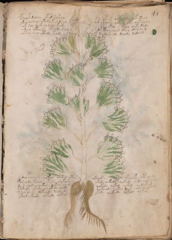

# Voynich Speculative Herbal Ferment Recipe — f41r

IMPORTANT: this is NOT a real or validated translation of the Voynich Manuscript. It is a speculative/procedural model that interprets EVA using a user-defined grammar to generate experimental recipes using safe, known edible substitutes.

This file is generated automatically from IVTFF/EVA transliteration plus a user-defined procedural grammar.



## Page / Folio
- currier: B
- folio: f41r
- page_number: 79
- plant_candidates: ['Thistle']
- plant_category_confidence: 0.25
- plant_category_guess: leaf
- plant_category_matches: ['section=herbal_default']
- plant_id: Thistle
- section: herbal

## Plant Interpretation (Heuristic)
- category: leaf
- confidence: 0.25
- note: Heuristic classification based on the IVTFF 'Plant ID' string (not the drawing). Does not imply real identification of the manuscript plant.
- textual_evidence_terms: ['section=herbal_default']

## EVA Text (Transliteration)
```text
pshey kedal[ee:ch]y oked seekeeey opshes [o:y]p[ch:ee]d qotchedy shkakeedy
ykeeo alshey ykedy kesh dy dy dor [y:q]cheoky qokee[d:?] chpy qokedy dy
qok sa[y:?] [q:y][o:e]kedy ychdykchdy qokedy qokedy shekchy cheky daly
chdchy ytcheeky ypchedy schdy ytedy cthhy chees oteey otal da[m:g]
qotchy sal yteedy kchdy dchedy k[ee:ch]dy dchedy dalain
shedey polchedy qokeey chekedy ytey chkeeod ypchedpy shepy shedy
parchdy kchey yteedy qokeod[o:y] okedy chkedy qokedy ched[y:e] qokedy
dair chedy chckhy qokey lchdy qokedy qokal chekedy qodar a[g:j]
qokeedy okedy chekedy chedy chckheody chekol daiin cheo al otedy
sshok shedy qekchdy dchdaldy ykedy qokeedy qokedy qokeg
ykeod ykeedy chekeedy cheked
```

## Page Summary (Procedural, Aggregated)
- compound_counts: {'yeast fermentation': 80, 'secondary herb': 11, 'sugars': 48, 'main herb': 41, 'mix/transfer': 21, 'liquid base': 19, 'heat': 10, 'general base': 3, 'complex herbal compound': 3}
- dose_level: 2
- fermentation_estimate: 7–14 days

## Pantry (Max Needed For Any Single Line-Recipe)
- main_plant_dry_g: 10
- main_plant_substitute: ['lemon balm']
- safe_complex_herbal_blend: ['gentle spices (e.g., 1 g cinnamon + 1 g clove) or a commercial herbal tea blend']
- secondary_herb_dry_g: 5
- secondary_herb_substitute: ['mint']
- sugar_or_honey_g: 50
- water_l: 0.5
- yeast_g: 1

## Recipes Index (This Page)
- [f41r.1,@P0](#f41r-1-f41r-1-p0)
- [f41r.2,+P0](#f41r-2-f41r-2-p0)
- [f41r.3,+P0](#f41r-3-f41r-3-p0)
- [f41r.4,+P0](#f41r-4-f41r-4-p0)
- [f41r.5,+P0](#f41r-5-f41r-5-p0)
- [f41r.6,+P0](#f41r-6-f41r-6-p0)
- [f41r.7,+P0](#f41r-7-f41r-7-p0)
- [f41r.8,+P0](#f41r-8-f41r-8-p0)
- [f41r.9,+P0](#f41r-9-f41r-9-p0)
- [f41r.10,+P0](#f41r-10-f41r-10-p0)
- [f41r.11,+P0](#f41r-11-f41r-11-p0)

## Line Recipes (Each Line = One Recipe, 0.5L batch)

<a id="f41r-1-f41r-1-p0"></a>

### f41r.1,@P0

EVA: pshey kedal[ee:ch]y oked seekeeey opshes [o:y]p[ch:ee]d qotchedy shkakeedy

## Ingredients
- main_plant_dry_g: 10
- main_plant_substitute: lemon balm
- secondary_herb_dry_g: 5
- secondary_herb_substitute: mint
- sugar_or_honey_g: 50
- water_l: 0.5
- yeast_g: 1

Process:
1. Sanitize the jar/fermenter and utensils.
2. Base: combine 0.5 L water with 50 g sugar or honey.
3. Apply gentle heat: simmer 10–15 min, then cool to <30°C before adding yeast.
4. Add main plant: lemon balm (~10 g dried).
5. Add secondary herb: mint (~5 g dried).
6. Pitch yeast: 1 g (ideally cider/beer yeast).
7. Ferment with an airlock: 2–4 days (guided by iin/aiin markers).
8. Strain/rack (if very solid-heavy) and cold-crash 24 h.
9. Bottle only when activity clearly slows; refrigerate. Avoid overpressure.

Expected Result: A mild, aromatic herbal ferment, low-to-medium intensity depending on dose level.

Does It Make Sense?: yes

Direct Gloss (Procedural, Not a Real Translation):
- pshey: add secondary herb (safe substitute) → start fermentation (yeast) → duration level 1 → state: active extraction
- kedal: add fermentable sugars → start fermentation (yeast) → duration level 1 → state: active extraction
- ee: duration level 2 → state: active extraction
- ch: add main plant (safe substitute)
- y: [unparsed]
- oked: add fermentable sugars → mix / transfer → start fermentation (yeast) → duration level 1 → state: active extraction
- seekeeey: add fermentable sugars → duration level 2 → state: active extraction
- opshes: add secondary herb (safe substitute) → mix / transfer → start fermentation (yeast) → duration level 1 → state: active extraction
- o: mix / transfer
- y: [unparsed]
- p: start fermentation (yeast)
- ch: add main plant (safe substitute)
- ee: duration level 2 → state: active extraction
- d: start fermentation (yeast)
- qotchedy: prepare liquid base → apply heat/cooking → add main plant (safe substitute) → start fermentation (yeast) → duration level 1 → state: active extraction
- shkakeedy: add fermentable sugars → add secondary herb (safe substitute) → start fermentation (yeast) → duration level 1 → state: fermentation start

<a id="f41r-2-f41r-2-p0"></a>

### f41r.2,+P0

EVA: ykeeo alshey ykedy kesh dy dy dor [y:q]cheoky qokee[d:?] chpy qokedy dy

## Ingredients
- main_plant_dry_g: 10
- main_plant_substitute: lemon balm
- secondary_herb_dry_g: 5
- secondary_herb_substitute: mint
- sugar_or_honey_g: 50
- water_l: 0.5
- yeast_g: 1

Process:
1. Sanitize the jar/fermenter and utensils.
2. Base: combine 0.5 L water with 50 g sugar or honey.
3. Infusion: use hot (not boiling) water, then let it cool before adding yeast.
4. Add main plant: lemon balm (~10 g dried).
5. Add secondary herb: mint (~5 g dried).
6. Pitch yeast: 1 g (ideally cider/beer yeast).
7. Ferment with an airlock: 2–4 days (guided by iin/aiin markers).
8. Strain/rack (if very solid-heavy) and cold-crash 24 h.
9. Bottle only when activity clearly slows; refrigerate. Avoid overpressure.

Expected Result: A mild, aromatic herbal ferment, low-to-medium intensity depending on dose level.

Does It Make Sense?: yes

Direct Gloss (Procedural, Not a Real Translation):
- ykeeo: add fermentable sugars → mix / transfer → duration level 2 → state: active extraction
- alshey: add secondary herb (safe substitute) → duration level 1 → state: fermentation start
- ykedy: add fermentable sugars → start fermentation (yeast) → duration level 1 → state: active extraction
- kesh: add fermentable sugars → add secondary herb (safe substitute) → duration level 1 → state: active extraction
- dy: start fermentation (yeast)
- dy: start fermentation (yeast)
- dor: mix / transfer → start fermentation (yeast)
- y: [unparsed]
- q: prepare base (generic)
- cheoky: add fermentable sugars → add main plant (safe substitute) → mix / transfer → duration level 1 → state: active extraction
- qokee: prepare liquid base → add fermentable sugars → duration level 2 → state: active extraction
- d: start fermentation (yeast)
- chpy: add main plant (safe substitute) → start fermentation (yeast)
- qokedy: prepare liquid base → add fermentable sugars → start fermentation (yeast) → duration level 1 → state: active extraction
- dy: start fermentation (yeast)

<a id="f41r-3-f41r-3-p0"></a>

### f41r.3,+P0

EVA: qok sa[y:?] [q:y][o:e]kedy ychdykchdy qokedy qokedy shekchy cheky daly

## Ingredients
- main_plant_dry_g: 5
- main_plant_substitute: lemon balm
- secondary_herb_dry_g: 2
- secondary_herb_substitute: mint
- sugar_or_honey_g: 25
- water_l: 0.5
- yeast_g: 1

Process:
1. Sanitize the jar/fermenter and utensils.
2. Base: combine 0.5 L water with 25 g sugar or honey.
3. Infusion: use hot (not boiling) water, then let it cool before adding yeast.
4. Add main plant: lemon balm (~5 g dried).
5. Add secondary herb: mint (~2 g dried).
6. Pitch yeast: 1 g (ideally cider/beer yeast).
7. Ferment with an airlock: 2–4 days (guided by iin/aiin markers).
8. Strain/rack (if very solid-heavy) and cold-crash 24 h.
9. Bottle only when activity clearly slows; refrigerate. Avoid overpressure.

Expected Result: A mild, aromatic herbal ferment, low-to-medium intensity depending on dose level.

Does It Make Sense?: yes

Direct Gloss (Procedural, Not a Real Translation):
- qok: prepare liquid base → add fermentable sugars
- sa: duration level 1 → state: fermentation start
- y: [unparsed]
- q: prepare base (generic)
- y: [unparsed]
- o: mix / transfer
- e: duration level 1 → state: active extraction
- kedy: add fermentable sugars → start fermentation (yeast) → duration level 1 → state: active extraction
- ychdykchdy: add fermentable sugars → add main plant (safe substitute) → start fermentation (yeast)
- qokedy: prepare liquid base → add fermentable sugars → start fermentation (yeast) → duration level 1 → state: active extraction
- qokedy: prepare liquid base → add fermentable sugars → start fermentation (yeast) → duration level 1 → state: active extraction
- shekchy: add fermentable sugars → add main plant (safe substitute) → add secondary herb (safe substitute) → duration level 1 → state: active extraction
- cheky: add fermentable sugars → add main plant (safe substitute) → duration level 1 → state: active extraction
- daly: start fermentation (yeast) → duration level 1 → state: fermentation start

<a id="f41r-4-f41r-4-p0"></a>

### f41r.4,+P0

EVA: chdchy ytcheeky ypchedy schdy ytedy cthhy chees oteey otal da[m:g]

## Ingredients
- main_plant_dry_g: 10
- main_plant_substitute: lemon balm
- safe_complex_herbal_blend: gentle spices (e.g., 1 g cinnamon + 1 g clove) or a commercial herbal tea blend
- secondary_herb_dry_g: 2
- secondary_herb_substitute: mint
- sugar_or_honey_g: 50
- water_l: 0.5
- yeast_g: 1

Process:
1. Sanitize the jar/fermenter and utensils.
2. Base: combine 0.5 L water with 50 g sugar or honey.
3. Apply gentle heat: simmer 10–15 min, then cool to <30°C before adding yeast.
4. Add main plant: lemon balm (~10 g dried).
5. Add secondary herb: mint (~2 g dried).
6. If a complex herbal compound appears, use a safe commercial blend or gentle spices in micro-doses.
7. Pitch yeast: 1 g (ideally cider/beer yeast).
8. Ferment with an airlock: 2–4 days (guided by iin/aiin markers).
9. Strain/rack (if very solid-heavy) and cold-crash 24 h.
10. Bottle only when activity clearly slows; refrigerate. Avoid overpressure.

Expected Result: A mild, aromatic herbal ferment, low-to-medium intensity depending on dose level.

Does It Make Sense?: yes

Direct Gloss (Procedural, Not a Real Translation):
- chdchy: add main plant (safe substitute) → start fermentation (yeast)
- ytcheeky: add fermentable sugars → apply heat/cooking → add main plant (safe substitute) → duration level 2 → state: active extraction
- ypchedy: add main plant (safe substitute) → start fermentation (yeast) → duration level 1 → state: active extraction
- schdy: add main plant (safe substitute) → start fermentation (yeast)
- ytedy: apply heat/cooking → start fermentation (yeast) → duration level 1 → state: active extraction
- cthhy: add complex herbal compound (safe blend)
- chees: add main plant (safe substitute) → duration level 2 → state: active extraction
- oteey: apply heat/cooking → mix / transfer → duration level 2 → state: active extraction
- otal: apply heat/cooking → mix / transfer → duration level 1 → state: fermentation start
- da: start fermentation (yeast) → duration level 1 → state: fermentation start
- m: [unparsed]
- g: [unparsed]

<a id="f41r-5-f41r-5-p0"></a>

### f41r.5,+P0

EVA: qotchy sal yteedy kchdy dchedy k[ee:ch]dy dchedy dalain

## Ingredients
- main_plant_dry_g: 10
- main_plant_substitute: lemon balm
- secondary_herb_dry_g: 2
- secondary_herb_substitute: mint
- sugar_or_honey_g: 50
- water_l: 0.5
- yeast_g: 1

Process:
1. Sanitize the jar/fermenter and utensils.
2. Base: combine 0.5 L water with 50 g sugar or honey.
3. Apply gentle heat: simmer 10–15 min, then cool to <30°C before adding yeast.
4. Add main plant: lemon balm (~10 g dried).
5. Add secondary herb: mint (~2 g dried).
6. Pitch yeast: 1 g (ideally cider/beer yeast).
7. Ferment with an airlock: 2–4 days (guided by iin/aiin markers).
8. Strain/rack (if very solid-heavy) and cold-crash 24 h.
9. Bottle only when activity clearly slows; refrigerate. Avoid overpressure.

Expected Result: A mild, aromatic herbal ferment, low-to-medium intensity depending on dose level.

Does It Make Sense?: yes

Direct Gloss (Procedural, Not a Real Translation):
- qotchy: prepare liquid base → apply heat/cooking → add main plant (safe substitute)
- sal: duration level 1 → state: fermentation start
- yteedy: apply heat/cooking → start fermentation (yeast) → duration level 2 → state: active extraction
- kchdy: add fermentable sugars → add main plant (safe substitute) → start fermentation (yeast)
- dchedy: add main plant (safe substitute) → start fermentation (yeast) → duration level 1 → state: active extraction
- k: add fermentable sugars
- ee: duration level 2 → state: active extraction
- ch: add main plant (safe substitute)
- dy: start fermentation (yeast)
- dchedy: add main plant (safe substitute) → start fermentation (yeast) → duration level 1 → state: active extraction
- dalain: start fermentation (yeast) → duration level 1 → state: fermentation start

<a id="f41r-6-f41r-6-p0"></a>

### f41r.6,+P0

EVA: shedey polchedy qokeey chekedy ytey chkeeod ypchedpy shepy shedy

## Ingredients
- main_plant_dry_g: 10
- main_plant_substitute: lemon balm
- secondary_herb_dry_g: 5
- secondary_herb_substitute: mint
- sugar_or_honey_g: 50
- water_l: 0.5
- yeast_g: 1

Process:
1. Sanitize the jar/fermenter and utensils.
2. Base: combine 0.5 L water with 50 g sugar or honey.
3. Apply gentle heat: simmer 10–15 min, then cool to <30°C before adding yeast.
4. Add main plant: lemon balm (~10 g dried).
5. Add secondary herb: mint (~5 g dried).
6. Pitch yeast: 1 g (ideally cider/beer yeast).
7. Ferment with an airlock: 2–4 days (guided by iin/aiin markers).
8. Strain/rack (if very solid-heavy) and cold-crash 24 h.
9. Bottle only when activity clearly slows; refrigerate. Avoid overpressure.

Expected Result: A mild, aromatic herbal ferment, low-to-medium intensity depending on dose level.

Does It Make Sense?: yes

Direct Gloss (Procedural, Not a Real Translation):
- shedey: add secondary herb (safe substitute) → start fermentation (yeast) → duration level 1 → state: active extraction
- polchedy: add main plant (safe substitute) → mix / transfer → start fermentation (yeast) → duration level 1 → state: active extraction
- qokeey: prepare liquid base → add fermentable sugars → duration level 2 → state: active extraction
- chekedy: add fermentable sugars → add main plant (safe substitute) → start fermentation (yeast) → duration level 1 → state: active extraction
- ytey: apply heat/cooking → duration level 1 → state: active extraction
- chkeeod: add fermentable sugars → add main plant (safe substitute) → mix / transfer → start fermentation (yeast) → duration level 2 → state: active extraction
- ypchedpy: add main plant (safe substitute) → start fermentation (yeast) → duration level 1 → state: active extraction
- shepy: add secondary herb (safe substitute) → start fermentation (yeast) → duration level 1 → state: active extraction
- shedy: add secondary herb (safe substitute) → start fermentation (yeast) → duration level 1 → state: active extraction

<a id="f41r-7-f41r-7-p0"></a>

### f41r.7,+P0

EVA: parchdy kchey yteedy qokeod[o:y] okedy chkedy qokedy ched[y:e] qokedy

## Ingredients
- main_plant_dry_g: 10
- main_plant_substitute: lemon balm
- secondary_herb_dry_g: 2
- secondary_herb_substitute: mint
- sugar_or_honey_g: 50
- water_l: 0.5
- yeast_g: 1

Process:
1. Sanitize the jar/fermenter and utensils.
2. Base: combine 0.5 L water with 50 g sugar or honey.
3. Apply gentle heat: simmer 10–15 min, then cool to <30°C before adding yeast.
4. Add main plant: lemon balm (~10 g dried).
5. Add secondary herb: mint (~2 g dried).
6. Pitch yeast: 1 g (ideally cider/beer yeast).
7. Ferment with an airlock: 2–4 days (guided by iin/aiin markers).
8. Strain/rack (if very solid-heavy) and cold-crash 24 h.
9. Bottle only when activity clearly slows; refrigerate. Avoid overpressure.

Expected Result: A mild, aromatic herbal ferment, low-to-medium intensity depending on dose level.

Does It Make Sense?: yes

Direct Gloss (Procedural, Not a Real Translation):
- parchdy: add main plant (safe substitute) → start fermentation (yeast) → duration level 1 → state: fermentation start
- kchey: add fermentable sugars → add main plant (safe substitute) → duration level 1 → state: active extraction
- yteedy: apply heat/cooking → start fermentation (yeast) → duration level 2 → state: active extraction
- qokeod: prepare liquid base → add fermentable sugars → mix / transfer → start fermentation (yeast) → duration level 1 → state: active extraction
- o: mix / transfer
- y: [unparsed]
- okedy: add fermentable sugars → mix / transfer → start fermentation (yeast) → duration level 1 → state: active extraction
- chkedy: add fermentable sugars → add main plant (safe substitute) → start fermentation (yeast) → duration level 1 → state: active extraction
- qokedy: prepare liquid base → add fermentable sugars → start fermentation (yeast) → duration level 1 → state: active extraction
- ched: add main plant (safe substitute) → start fermentation (yeast) → duration level 1 → state: active extraction
- y: [unparsed]
- e: duration level 1 → state: active extraction
- qokedy: prepare liquid base → add fermentable sugars → start fermentation (yeast) → duration level 1 → state: active extraction

<a id="f41r-8-f41r-8-p0"></a>

### f41r.8,+P0

EVA: dair chedy chckhy qokey lchdy qokedy qokal chekedy qodar a[g:j]

## Ingredients
- main_plant_dry_g: 5
- main_plant_substitute: lemon balm
- safe_complex_herbal_blend: gentle spices (e.g., 1 g cinnamon + 1 g clove) or a commercial herbal tea blend
- secondary_herb_dry_g: 1
- secondary_herb_substitute: mint
- sugar_or_honey_g: 25
- water_l: 0.5
- yeast_g: 1

Process:
1. Sanitize the jar/fermenter and utensils.
2. Base: combine 0.5 L water with 25 g sugar or honey.
3. Infusion: use hot (not boiling) water, then let it cool before adding yeast.
4. Add main plant: lemon balm (~5 g dried).
5. Add secondary herb: mint (~1 g dried).
6. If a complex herbal compound appears, use a safe commercial blend or gentle spices in micro-doses.
7. Pitch yeast: 1 g (ideally cider/beer yeast).
8. Ferment with an airlock: 2–4 days (guided by iin/aiin markers).
9. Strain/rack (if very solid-heavy) and cold-crash 24 h.
10. Bottle only when activity clearly slows; refrigerate. Avoid overpressure.

Expected Result: A mild, aromatic herbal ferment, low-to-medium intensity depending on dose level.

Does It Make Sense?: yes

Direct Gloss (Procedural, Not a Real Translation):
- dair: start fermentation (yeast) → duration level 1 → state: fermentation start
- chedy: add main plant (safe substitute) → start fermentation (yeast) → duration level 1 → state: active extraction
- chckhy: add main plant (safe substitute) → add complex herbal compound (safe blend)
- qokey: prepare liquid base → add fermentable sugars → duration level 1 → state: active extraction
- lchdy: add main plant (safe substitute) → start fermentation (yeast)
- qokedy: prepare liquid base → add fermentable sugars → start fermentation (yeast) → duration level 1 → state: active extraction
- qokal: prepare liquid base → add fermentable sugars → duration level 1 → state: fermentation start
- chekedy: add fermentable sugars → add main plant (safe substitute) → start fermentation (yeast) → duration level 1 → state: active extraction
- qodar: prepare liquid base → start fermentation (yeast) → duration level 1 → state: fermentation start
- a: duration level 1 → state: fermentation start
- g: [unparsed]
- j: [unparsed]

<a id="f41r-9-f41r-9-p0"></a>

### f41r.9,+P0

EVA: qokeedy okedy chekedy chedy chckheody chekol daiin cheo al otedy

## Ingredients
- main_plant_dry_g: 10
- main_plant_substitute: lemon balm
- safe_complex_herbal_blend: gentle spices (e.g., 1 g cinnamon + 1 g clove) or a commercial herbal tea blend
- secondary_herb_dry_g: 2
- secondary_herb_substitute: mint
- sugar_or_honey_g: 50
- water_l: 0.5
- yeast_g: 1

Process:
1. Sanitize the jar/fermenter and utensils.
2. Base: combine 0.5 L water with 50 g sugar or honey.
3. Apply gentle heat: simmer 10–15 min, then cool to <30°C before adding yeast.
4. Add main plant: lemon balm (~10 g dried).
5. Add secondary herb: mint (~2 g dried).
6. If a complex herbal compound appears, use a safe commercial blend or gentle spices in micro-doses.
7. Pitch yeast: 1 g (ideally cider/beer yeast).
8. Ferment with an airlock: 7–14 days (guided by iin/aiin markers).
9. Strain/rack (if very solid-heavy) and cold-crash 24 h.
10. Bottle only when activity clearly slows; refrigerate. Avoid overpressure.

Expected Result: A mild, aromatic herbal ferment, low-to-medium intensity depending on dose level.

Does It Make Sense?: yes

Direct Gloss (Procedural, Not a Real Translation):
- qokeedy: prepare liquid base → add fermentable sugars → start fermentation (yeast) → duration level 2 → state: active extraction
- okedy: add fermentable sugars → mix / transfer → start fermentation (yeast) → duration level 1 → state: active extraction
- chekedy: add fermentable sugars → add main plant (safe substitute) → start fermentation (yeast) → duration level 1 → state: active extraction
- chedy: add main plant (safe substitute) → start fermentation (yeast) → duration level 1 → state: active extraction
- chckheody: add main plant (safe substitute) → mix / transfer → start fermentation (yeast) → add complex herbal compound (safe blend) → duration level 1 → state: active extraction
- chekol: add fermentable sugars → add main plant (safe substitute) → mix / transfer → duration level 1 → state: active extraction
- daiin: start fermentation (yeast) → duration level 1 → state: fermentation start → long fermentation / aging phase
- cheo: add main plant (safe substitute) → mix / transfer → duration level 1 → state: active extraction
- al: duration level 1 → state: fermentation start
- otedy: apply heat/cooking → mix / transfer → start fermentation (yeast) → duration level 1 → state: active extraction

<a id="f41r-10-f41r-10-p0"></a>

### f41r.10,+P0

EVA: sshok shedy qekchdy dchdaldy ykedy qokeedy qokedy qokeg

## Ingredients
- main_plant_dry_g: 10
- main_plant_substitute: lemon balm
- secondary_herb_dry_g: 5
- secondary_herb_substitute: mint
- sugar_or_honey_g: 50
- water_l: 0.5
- yeast_g: 1

Process:
1. Sanitize the jar/fermenter and utensils.
2. Base: combine 0.5 L water with 50 g sugar or honey.
3. Infusion: use hot (not boiling) water, then let it cool before adding yeast.
4. Add main plant: lemon balm (~10 g dried).
5. Add secondary herb: mint (~5 g dried).
6. Pitch yeast: 1 g (ideally cider/beer yeast).
7. Ferment with an airlock: 2–4 days (guided by iin/aiin markers).
8. Strain/rack (if very solid-heavy) and cold-crash 24 h.
9. Bottle only when activity clearly slows; refrigerate. Avoid overpressure.

Expected Result: A mild, aromatic herbal ferment, low-to-medium intensity depending on dose level.

Does It Make Sense?: yes

Direct Gloss (Procedural, Not a Real Translation):
- sshok: add fermentable sugars → add secondary herb (safe substitute) → mix / transfer
- shedy: add secondary herb (safe substitute) → start fermentation (yeast) → duration level 1 → state: active extraction
- qekchdy: prepare base (generic) → add fermentable sugars → add main plant (safe substitute) → start fermentation (yeast) → duration level 1 → state: active extraction
- dchdaldy: add main plant (safe substitute) → start fermentation (yeast) → duration level 1 → state: fermentation start
- ykedy: add fermentable sugars → start fermentation (yeast) → duration level 1 → state: active extraction
- qokeedy: prepare liquid base → add fermentable sugars → start fermentation (yeast) → duration level 2 → state: active extraction
- qokedy: prepare liquid base → add fermentable sugars → start fermentation (yeast) → duration level 1 → state: active extraction
- qokeg: prepare liquid base → add fermentable sugars → duration level 1 → state: active extraction

<a id="f41r-11-f41r-11-p0"></a>

### f41r.11,+P0

EVA: ykeod ykeedy chekeedy cheked

## Ingredients
- main_plant_dry_g: 10
- main_plant_substitute: lemon balm
- secondary_herb_dry_g: 2
- secondary_herb_substitute: mint
- sugar_or_honey_g: 50
- water_l: 0.5
- yeast_g: 1

Process:
1. Sanitize the jar/fermenter and utensils.
2. Base: combine 0.5 L water with 50 g sugar or honey.
3. Infusion: use hot (not boiling) water, then let it cool before adding yeast.
4. Add main plant: lemon balm (~10 g dried).
5. Add secondary herb: mint (~2 g dried).
6. Pitch yeast: 1 g (ideally cider/beer yeast).
7. Ferment with an airlock: 2–4 days (guided by iin/aiin markers).
8. Strain/rack (if very solid-heavy) and cold-crash 24 h.
9. Bottle only when activity clearly slows; refrigerate. Avoid overpressure.

Expected Result: A mild, aromatic herbal ferment, low-to-medium intensity depending on dose level.

Does It Make Sense?: yes

Direct Gloss (Procedural, Not a Real Translation):
- ykeod: add fermentable sugars → mix / transfer → start fermentation (yeast) → duration level 1 → state: active extraction
- ykeedy: add fermentable sugars → start fermentation (yeast) → duration level 2 → state: active extraction
- chekeedy: add fermentable sugars → add main plant (safe substitute) → start fermentation (yeast) → duration level 1 → state: active extraction
- cheked: add fermentable sugars → add main plant (safe substitute) → start fermentation (yeast) → duration level 1 → state: active extraction

## Risks & Warnings (Applies To All Line-Recipes)
- Never use unidentified Voynich plants directly; only use known edible substitutes.
- Do not consume if you see mold, smell rot, notice abnormal sliminess, or taste something clearly foul.
- Overpressure/bottle-bomb risk: do not bottle before stable; prefer an airlock and refrigeration.
- Avoid if pregnant/breastfeeding, for minors, or with medical conditions; consult a professional.
- No medical claims: this is an experimental beverage.

## Recommended Adjustments (General)
- If too bitter (leafy profile), halve the herbs or shorten steep/maceration time.
- If too sweet, extend fermentation or reduce sugar by 25–50%.
- For a non-alcoholic version, omit yeast and keep refrigerated as an infusion (not fermented).
