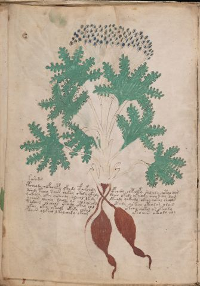

# Voynich Speculative Herbal Ferment Recipe — f41v

IMPORTANT: this is NOT a real or validated translation of the Voynich Manuscript. It is a speculative/procedural model that interprets EVA using a user-defined grammar to generate experimental recipes using safe, known edible substitutes.

This file is generated automatically from IVTFF/EVA transliteration plus a user-defined procedural grammar.



## Page / Folio
- currier: B
- folio: f41v
- page_number: 80
- plant_candidates: ['<unreadable>', 'Fern', 'Maidenhair fern??? Tansy?']
- plant_category_confidence: 0.25
- plant_category_guess: leaf
- plant_category_matches: ['section=herbal_default']
- plant_id: <unreadable>, Fern, Maidenhair fern??? Tansy?
- section: herbal

## Plant Interpretation (Heuristic)
- category: leaf
- confidence: 0.25
- note: Heuristic classification based on the IVTFF 'Plant ID' string (not the drawing). Does not imply real identification of the manuscript plant.
- textual_evidence_terms: ['section=herbal_default']

## EVA Text (Transliteration)
```text
keer[e:o]dal
pcheody qofcheepy ofchdy cfhekchdy ypchedy chepchefy shdchdy qotal dar
dshedy tchey s aiin shekey okedy okaly daiin okedy ykeeody choy keoy dam
qoke[o:d]dy okey qokeody oleeol lkedy lkeeody qokeedy okeey qokol sheols
ycheos olchey daiin or chol[a:o]laiin oteedy qoteol oteodar orain
tadaiin ol cheos yteedy okal [o:a]ld oteol qokal or oteody
ykeey okey ykeeol ckhdy chdal ykeo aiin okeody oly
daiin olkeeo lkol chedy okeey
```

## Page Summary (Procedural, Aggregated)
- compound_counts: {'sugars': 26, 'mix/transfer': 47, 'yeast fermentation': 37, 'main herb': 16, 'liquid base': 8, 'aroma modifier': 3, 'complex herbal compound': 2, 'secondary herb': 4, 'heat': 9}
- dose_level: 2
- fermentation_estimate: 7–14 days

## Pantry (Max Needed For Any Single Line-Recipe)
- aroma_modifier: ['lemon peel (optional)']
- aroma_modifier_dose: ['2–5 g (or 1 strip of peel, avoiding the bitter pith)']
- main_plant_dry_g: 10
- main_plant_substitute: ['lemon balm']
- safe_complex_herbal_blend: ['gentle spices (e.g., 1 g cinnamon + 1 g clove) or a commercial herbal tea blend']
- secondary_herb_dry_g: 5
- secondary_herb_substitute: ['mint']
- sugar_or_honey_g: 50
- water_l: 0.5
- yeast_g: 1

## Recipes Index (This Page)
- [f41v.1,@Lp](#f41v-1-f41v-1-lp)
- [f41v.2,+P0](#f41v-2-f41v-2-p0)
- [f41v.3,+P0](#f41v-3-f41v-3-p0)
- [f41v.4,+P0](#f41v-4-f41v-4-p0)
- [f41v.5,+P0](#f41v-5-f41v-5-p0)
- [f41v.6,+P0](#f41v-6-f41v-6-p0)
- [f41v.7,+P0](#f41v-7-f41v-7-p0)
- [f41v.8,+P0](#f41v-8-f41v-8-p0)

## Line Recipes (Each Line = One Recipe, 0.5L batch)

<a id="f41v-1-f41v-1-lp"></a>

### f41v.1,@Lp

EVA: keer[e:o]dal

## Ingredients
- main_plant_dry_g: 5
- main_plant_substitute: lemon balm
- secondary_herb_dry_g: 2
- secondary_herb_substitute: mint
- sugar_or_honey_g: 50
- water_l: 0.5
- yeast_g: 1

Process:
1. Sanitize the jar/fermenter and utensils.
2. Base: combine 0.5 L water with 50 g sugar or honey.
3. Infusion: use hot (not boiling) water, then let it cool before adding yeast.
4. Add main plant: lemon balm (~5 g dried).
5. Add secondary herb: mint (~2 g dried).
6. Pitch yeast: 1 g (ideally cider/beer yeast).
7. Ferment with an airlock: 2–4 days (guided by iin/aiin markers).
8. Strain/rack (if very solid-heavy) and cold-crash 24 h.
9. Bottle only when activity clearly slows; refrigerate. Avoid overpressure.

Expected Result: A mild, aromatic herbal ferment, low-to-medium intensity depending on dose level.

Does It Make Sense?: yes

Direct Gloss (Procedural, Not a Real Translation):
- keer: add fermentable sugars → duration level 2 → state: active extraction
- e: duration level 1 → state: active extraction
- o: mix / transfer
- dal: start fermentation (yeast) → duration level 1 → state: fermentation start

<a id="f41v-2-f41v-2-p0"></a>

### f41v.2,+P0

EVA: pcheody qofcheepy ofchdy cfhekchdy ypchedy chepchefy shdchdy qotal dar

## Ingredients
- aroma_modifier: lemon peel (optional)
- aroma_modifier_dose: 2–5 g (or 1 strip of peel, avoiding the bitter pith)
- main_plant_dry_g: 10
- main_plant_substitute: lemon balm
- safe_complex_herbal_blend: gentle spices (e.g., 1 g cinnamon + 1 g clove) or a commercial herbal tea blend
- secondary_herb_dry_g: 5
- secondary_herb_substitute: mint
- sugar_or_honey_g: 50
- water_l: 0.5
- yeast_g: 1

Process:
1. Sanitize the jar/fermenter and utensils.
2. Base: combine 0.5 L water with 50 g sugar or honey.
3. Apply gentle heat: simmer 10–15 min, then cool to <30°C before adding yeast.
4. Add main plant: lemon balm (~10 g dried).
5. Add secondary herb: mint (~5 g dried).
6. Add aroma modifier (optional) in a low dose.
7. If a complex herbal compound appears, use a safe commercial blend or gentle spices in micro-doses.
8. Pitch yeast: 1 g (ideally cider/beer yeast).
9. Ferment with an airlock: 2–4 days (guided by iin/aiin markers).
10. Strain/rack (if very solid-heavy) and cold-crash 24 h.
11. Bottle only when activity clearly slows; refrigerate. Avoid overpressure.

Expected Result: A mild, aromatic herbal ferment, low-to-medium intensity depending on dose level.

Does It Make Sense?: yes

Direct Gloss (Procedural, Not a Real Translation):
- pcheody: add main plant (safe substitute) → mix / transfer → start fermentation (yeast) → duration level 1 → state: active extraction
- qofcheepy: prepare liquid base → add main plant (safe substitute) → add aroma modifier → start fermentation (yeast) → duration level 2 → state: active extraction
- ofchdy: add main plant (safe substitute) → add aroma modifier → mix / transfer → start fermentation (yeast)
- cfhekchdy: add fermentable sugars → add main plant (safe substitute) → start fermentation (yeast) → add complex herbal compound (safe blend) → duration level 1 → state: active extraction
- ypchedy: add main plant (safe substitute) → start fermentation (yeast) → duration level 1 → state: active extraction
- chepchefy: add main plant (safe substitute) → add aroma modifier → start fermentation (yeast) → duration level 1 → state: active extraction
- shdchdy: add main plant (safe substitute) → add secondary herb (safe substitute) → start fermentation (yeast)
- qotal: prepare liquid base → apply heat/cooking → duration level 1 → state: fermentation start
- dar: start fermentation (yeast) → duration level 1 → state: fermentation start

<a id="f41v-3-f41v-3-p0"></a>

### f41v.3,+P0

EVA: dshedy tchey s aiin shekey okedy okaly daiin okedy ykeeody choy keoy dam

## Ingredients
- main_plant_dry_g: 10
- main_plant_substitute: lemon balm
- secondary_herb_dry_g: 5
- secondary_herb_substitute: mint
- sugar_or_honey_g: 50
- water_l: 0.5
- yeast_g: 1

Process:
1. Sanitize the jar/fermenter and utensils.
2. Base: combine 0.5 L water with 50 g sugar or honey.
3. Apply gentle heat: simmer 10–15 min, then cool to <30°C before adding yeast.
4. Add main plant: lemon balm (~10 g dried).
5. Add secondary herb: mint (~5 g dried).
6. Pitch yeast: 1 g (ideally cider/beer yeast).
7. Ferment with an airlock: 7–14 days (guided by iin/aiin markers).
8. Strain/rack (if very solid-heavy) and cold-crash 24 h.
9. Bottle only when activity clearly slows; refrigerate. Avoid overpressure.

Expected Result: A mild, aromatic herbal ferment, low-to-medium intensity depending on dose level.

Does It Make Sense?: yes

Direct Gloss (Procedural, Not a Real Translation):
- dshedy: add secondary herb (safe substitute) → start fermentation (yeast) → duration level 1 → state: active extraction
- tchey: apply heat/cooking → add main plant (safe substitute) → duration level 1 → state: active extraction
- s: [unparsed]
- aiin: duration level 1 → state: fermentation start → long fermentation / aging phase
- shekey: add fermentable sugars → add secondary herb (safe substitute) → duration level 1 → state: active extraction
- okedy: add fermentable sugars → mix / transfer → start fermentation (yeast) → duration level 1 → state: active extraction
- okaly: add fermentable sugars → mix / transfer → duration level 1 → state: fermentation start
- daiin: start fermentation (yeast) → duration level 1 → state: fermentation start → long fermentation / aging phase
- okedy: add fermentable sugars → mix / transfer → start fermentation (yeast) → duration level 1 → state: active extraction
- ykeeody: add fermentable sugars → mix / transfer → start fermentation (yeast) → duration level 2 → state: active extraction
- choy: add main plant (safe substitute) → mix / transfer
- keoy: add fermentable sugars → mix / transfer → duration level 1 → state: active extraction
- dam: start fermentation (yeast) → duration level 1 → state: fermentation start

<a id="f41v-4-f41v-4-p0"></a>

### f41v.4,+P0

EVA: qoke[o:d]dy okey qokeody oleeol lkedy lkeeody qokeedy okeey qokol sheols

## Ingredients
- main_plant_dry_g: 5
- main_plant_substitute: lemon balm
- secondary_herb_dry_g: 5
- secondary_herb_substitute: mint
- sugar_or_honey_g: 50
- water_l: 0.5
- yeast_g: 1

Process:
1. Sanitize the jar/fermenter and utensils.
2. Base: combine 0.5 L water with 50 g sugar or honey.
3. Infusion: use hot (not boiling) water, then let it cool before adding yeast.
4. Add main plant: lemon balm (~5 g dried).
5. Add secondary herb: mint (~5 g dried).
6. Pitch yeast: 1 g (ideally cider/beer yeast).
7. Ferment with an airlock: 2–4 days (guided by iin/aiin markers).
8. Strain/rack (if very solid-heavy) and cold-crash 24 h.
9. Bottle only when activity clearly slows; refrigerate. Avoid overpressure.

Expected Result: A mild, aromatic herbal ferment, low-to-medium intensity depending on dose level.

Does It Make Sense?: yes

Direct Gloss (Procedural, Not a Real Translation):
- qoke: prepare liquid base → add fermentable sugars → duration level 1 → state: active extraction
- o: mix / transfer
- d: start fermentation (yeast)
- dy: start fermentation (yeast)
- okey: add fermentable sugars → mix / transfer → duration level 1 → state: active extraction
- qokeody: prepare liquid base → add fermentable sugars → mix / transfer → start fermentation (yeast) → duration level 1 → state: active extraction
- oleeol: mix / transfer → duration level 2 → state: active extraction
- lkedy: add fermentable sugars → start fermentation (yeast) → duration level 1 → state: active extraction
- lkeeody: add fermentable sugars → mix / transfer → start fermentation (yeast) → duration level 2 → state: active extraction
- qokeedy: prepare liquid base → add fermentable sugars → start fermentation (yeast) → duration level 2 → state: active extraction
- okeey: add fermentable sugars → mix / transfer → duration level 2 → state: active extraction
- qokol: prepare liquid base → add fermentable sugars → mix / transfer
- sheols: add secondary herb (safe substitute) → mix / transfer → duration level 1 → state: active extraction

<a id="f41v-5-f41v-5-p0"></a>

### f41v.5,+P0

EVA: ycheos olchey daiin or chol[a:o]laiin oteedy qoteol oteodar orain

## Ingredients
- main_plant_dry_g: 10
- main_plant_substitute: lemon balm
- secondary_herb_dry_g: 2
- secondary_herb_substitute: mint
- sugar_or_honey_g: 25
- water_l: 0.5
- yeast_g: 1

Process:
1. Sanitize the jar/fermenter and utensils.
2. Base: combine 0.5 L water with 25 g sugar or honey.
3. Apply gentle heat: simmer 10–15 min, then cool to <30°C before adding yeast.
4. Add main plant: lemon balm (~10 g dried).
5. Add secondary herb: mint (~2 g dried).
6. Pitch yeast: 1 g (ideally cider/beer yeast).
7. Ferment with an airlock: 7–14 days (guided by iin/aiin markers).
8. Strain/rack (if very solid-heavy) and cold-crash 24 h.
9. Bottle only when activity clearly slows; refrigerate. Avoid overpressure.

Expected Result: A mild, aromatic herbal ferment, low-to-medium intensity depending on dose level.

Does It Make Sense?: yes

Direct Gloss (Procedural, Not a Real Translation):
- ycheos: add main plant (safe substitute) → mix / transfer → duration level 1 → state: active extraction
- olchey: add main plant (safe substitute) → mix / transfer → duration level 1 → state: active extraction
- daiin: start fermentation (yeast) → duration level 1 → state: fermentation start → long fermentation / aging phase
- or: mix / transfer
- chol: add main plant (safe substitute) → mix / transfer
- a: duration level 1 → state: fermentation start
- o: mix / transfer
- laiin: duration level 1 → state: fermentation start → long fermentation / aging phase
- oteedy: apply heat/cooking → mix / transfer → start fermentation (yeast) → duration level 2 → state: active extraction
- qoteol: prepare liquid base → apply heat/cooking → mix / transfer → duration level 1 → state: active extraction
- oteodar: apply heat/cooking → mix / transfer → start fermentation (yeast) → duration level 1 → state: active extraction
- orain: mix / transfer → duration level 1 → state: fermentation start

<a id="f41v-6-f41v-6-p0"></a>

### f41v.6,+P0

EVA: tadaiin ol cheos yteedy okal [o:a]ld oteol qokal or oteody

## Ingredients
- main_plant_dry_g: 10
- main_plant_substitute: lemon balm
- secondary_herb_dry_g: 2
- secondary_herb_substitute: mint
- sugar_or_honey_g: 50
- water_l: 0.5
- yeast_g: 1

Process:
1. Sanitize the jar/fermenter and utensils.
2. Base: combine 0.5 L water with 50 g sugar or honey.
3. Apply gentle heat: simmer 10–15 min, then cool to <30°C before adding yeast.
4. Add main plant: lemon balm (~10 g dried).
5. Add secondary herb: mint (~2 g dried).
6. Pitch yeast: 1 g (ideally cider/beer yeast).
7. Ferment with an airlock: 7–14 days (guided by iin/aiin markers).
8. Strain/rack (if very solid-heavy) and cold-crash 24 h.
9. Bottle only when activity clearly slows; refrigerate. Avoid overpressure.

Expected Result: A mild, aromatic herbal ferment, low-to-medium intensity depending on dose level.

Does It Make Sense?: yes

Direct Gloss (Procedural, Not a Real Translation):
- tadaiin: apply heat/cooking → start fermentation (yeast) → duration level 1 → state: fermentation start → long fermentation / aging phase
- ol: mix / transfer
- cheos: add main plant (safe substitute) → mix / transfer → duration level 1 → state: active extraction
- yteedy: apply heat/cooking → start fermentation (yeast) → duration level 2 → state: active extraction
- okal: add fermentable sugars → mix / transfer → duration level 1 → state: fermentation start
- o: mix / transfer
- a: duration level 1 → state: fermentation start
- ld: start fermentation (yeast)
- oteol: apply heat/cooking → mix / transfer → duration level 1 → state: active extraction
- qokal: prepare liquid base → add fermentable sugars → duration level 1 → state: fermentation start
- or: mix / transfer
- oteody: apply heat/cooking → mix / transfer → start fermentation (yeast) → duration level 1 → state: active extraction

<a id="f41v-7-f41v-7-p0"></a>

### f41v.7,+P0

EVA: ykeey okey ykeeol ckhdy chdal ykeo aiin okeody oly

## Ingredients
- main_plant_dry_g: 10
- main_plant_substitute: lemon balm
- safe_complex_herbal_blend: gentle spices (e.g., 1 g cinnamon + 1 g clove) or a commercial herbal tea blend
- secondary_herb_dry_g: 2
- secondary_herb_substitute: mint
- sugar_or_honey_g: 50
- water_l: 0.5
- yeast_g: 1

Process:
1. Sanitize the jar/fermenter and utensils.
2. Base: combine 0.5 L water with 50 g sugar or honey.
3. Infusion: use hot (not boiling) water, then let it cool before adding yeast.
4. Add main plant: lemon balm (~10 g dried).
5. Add secondary herb: mint (~2 g dried).
6. If a complex herbal compound appears, use a safe commercial blend or gentle spices in micro-doses.
7. Pitch yeast: 1 g (ideally cider/beer yeast).
8. Ferment with an airlock: 7–14 days (guided by iin/aiin markers).
9. Strain/rack (if very solid-heavy) and cold-crash 24 h.
10. Bottle only when activity clearly slows; refrigerate. Avoid overpressure.

Expected Result: A mild, aromatic herbal ferment, low-to-medium intensity depending on dose level.

Does It Make Sense?: yes

Direct Gloss (Procedural, Not a Real Translation):
- ykeey: add fermentable sugars → duration level 2 → state: active extraction
- okey: add fermentable sugars → mix / transfer → duration level 1 → state: active extraction
- ykeeol: add fermentable sugars → mix / transfer → duration level 2 → state: active extraction
- ckhdy: start fermentation (yeast) → add complex herbal compound (safe blend)
- chdal: add main plant (safe substitute) → start fermentation (yeast) → duration level 1 → state: fermentation start
- ykeo: add fermentable sugars → mix / transfer → duration level 1 → state: active extraction
- aiin: duration level 1 → state: fermentation start → long fermentation / aging phase
- okeody: add fermentable sugars → mix / transfer → start fermentation (yeast) → duration level 1 → state: active extraction
- oly: mix / transfer

<a id="f41v-8-f41v-8-p0"></a>

### f41v.8,+P0

EVA: daiin olkeeo lkol chedy okeey

## Ingredients
- main_plant_dry_g: 10
- main_plant_substitute: lemon balm
- secondary_herb_dry_g: 2
- secondary_herb_substitute: mint
- sugar_or_honey_g: 50
- water_l: 0.5
- yeast_g: 1

Process:
1. Sanitize the jar/fermenter and utensils.
2. Base: combine 0.5 L water with 50 g sugar or honey.
3. Infusion: use hot (not boiling) water, then let it cool before adding yeast.
4. Add main plant: lemon balm (~10 g dried).
5. Add secondary herb: mint (~2 g dried).
6. Pitch yeast: 1 g (ideally cider/beer yeast).
7. Ferment with an airlock: 7–14 days (guided by iin/aiin markers).
8. Strain/rack (if very solid-heavy) and cold-crash 24 h.
9. Bottle only when activity clearly slows; refrigerate. Avoid overpressure.

Expected Result: A mild, aromatic herbal ferment, low-to-medium intensity depending on dose level.

Does It Make Sense?: yes

Direct Gloss (Procedural, Not a Real Translation):
- daiin: start fermentation (yeast) → duration level 1 → state: fermentation start → long fermentation / aging phase
- olkeeo: add fermentable sugars → mix / transfer → duration level 2 → state: active extraction
- lkol: add fermentable sugars → mix / transfer
- chedy: add main plant (safe substitute) → start fermentation (yeast) → duration level 1 → state: active extraction
- okeey: add fermentable sugars → mix / transfer → duration level 2 → state: active extraction

## Risks & Warnings (Applies To All Line-Recipes)
- Never use unidentified Voynich plants directly; only use known edible substitutes.
- Do not consume if you see mold, smell rot, notice abnormal sliminess, or taste something clearly foul.
- Overpressure/bottle-bomb risk: do not bottle before stable; prefer an airlock and refrigeration.
- Avoid if pregnant/breastfeeding, for minors, or with medical conditions; consult a professional.
- No medical claims: this is an experimental beverage.

## Recommended Adjustments (General)
- If too bitter (leafy profile), halve the herbs or shorten steep/maceration time.
- If too sweet, extend fermentation or reduce sugar by 25–50%.
- For a non-alcoholic version, omit yeast and keep refrigerated as an infusion (not fermented).
