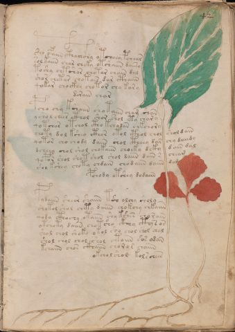

# Voynich Speculative Herbal Ferment Recipe — f42r

IMPORTANT: this is NOT a real or validated translation of the Voynich Manuscript. It is a speculative/procedural model that interprets EVA using a user-defined grammar to generate experimental recipes using safe, known edible substitutes.

This file is generated automatically from IVTFF/EVA transliteration plus a user-defined procedural grammar.



## Page / Folio
- currier: A
- folio: f42r
- page_number: 81
- section: herbal

## EVA Text (Transliteration)
```text
c@155;ho ofaiin cthaihc@196;hy otcheey pchear
solkaiin char cheky otshaiin daiir[y:a]
toshy chtshar chotar chain dal
shor chetar chotai[s:r] dar cthaiin
qokar chockhy chotor chy kary
dorain [ih:ch]ar
pcho chy kshaiin shotaiin cham shan
yshol chees cthol shor shol ety char y
qotch[a:o]r otchol ctho kchodan chkchory
choty dol ksheo cthor otol cthol chol shol dain
qotor cho chody daiin shol ctheey dar chy daiidy
dcheey chol shol chokaiin choeky dcky dain dal
qopor shol shot shol shol daiin dain s cheam
sho kshey choty chdain chodaiin daiin dam
pchody otshey dodaiin
pydaiin sheor shaiin tsh olchy sholy
shotol shol chety daiin chokchy chkaiin
qody cthochy otaiin shy kshes chorain
otchoty daiin chot sho ck@191;hy cty s os
shol chol shoky okol sho chol shol chal
shol chol chol shol ctoiin c'os odan
kchaiin chos ckhaiin choro r chaiin
okchol shol kolschees
```

## Recipes Index (This Page)
- [f42r.1,@P0](#f42r-1-f42r-1-p0)
- [f42r.2,+P0](#f42r-2-f42r-2-p0)
- [f42r.3,+P0](#f42r-3-f42r-3-p0)
- [f42r.4,+P0](#f42r-4-f42r-4-p0)
- [f42r.5,+P0](#f42r-5-f42r-5-p0)
- [f42r.6,+Pc](#f42r-6-f42r-6-pc)
- [f42r.7,+P0](#f42r-7-f42r-7-p0)
- [f42r.8,+P0](#f42r-8-f42r-8-p0)
- [f42r.9,+P0](#f42r-9-f42r-9-p0)
- [f42r.10,+P0](#f42r-10-f42r-10-p0)
- [f42r.11,+P0](#f42r-11-f42r-11-p0)
- [f42r.12,+P0](#f42r-12-f42r-12-p0)
- [f42r.13,+P0](#f42r-13-f42r-13-p0)
- [f42r.14,+P0](#f42r-14-f42r-14-p0)
- [f42r.15,+Pr](#f42r-15-f42r-15-pr)
- [f42r.16,+P0](#f42r-16-f42r-16-p0)
- [f42r.17,+P0](#f42r-17-f42r-17-p0)
- [f42r.18,+P0](#f42r-18-f42r-18-p0)
- [f42r.19,+P0](#f42r-19-f42r-19-p0)
- [f42r.20,+P0](#f42r-20-f42r-20-p0)
- [f42r.21,+P0](#f42r-21-f42r-21-p0)
- [f42r.22,+P0](#f42r-22-f42r-22-p0)
- [f42r.23,+Pr](#f42r-23-f42r-23-pr)

## Line Glosses (Procedural Gloss Only; Not a Translation)

<a id="f42r-1-f42r-1-p0"></a>

### f42r.1,@P0

EVA: c@155;ho ofaiin cthaihc@196;hy otcheey pchear

Direct Gloss (Procedural, Not a Real Translation):
- c: [unparsed]
- ho: mix / transfer
- ofaiin: add aroma modifier → mix / transfer → duration level 1 → state: fermentation start → long fermentation / aging phase
- cthaihc: add complex herbal compound (safe blend) → duration level 1 → state: fermentation start
- hy: [unparsed]
- otcheey: apply heat/cooking → add main plant (safe substitute) → mix / transfer → duration level 2 → state: active extraction
- pchear: add main plant (safe substitute) → start fermentation (yeast) → duration level 1 → state: active extraction

<a id="f42r-2-f42r-2-p0"></a>

### f42r.2,+P0

EVA: solkaiin char cheky otshaiin daiir[y:a]

Direct Gloss (Procedural, Not a Real Translation):
- solkaiin: add fermentable sugars → mix / transfer → duration level 1 → state: fermentation start → long fermentation / aging phase
- char: add main plant (safe substitute) → duration level 1 → state: fermentation start
- cheky: add fermentable sugars → add main plant (safe substitute) → duration level 1 → state: active extraction
- otshaiin: apply heat/cooking → add secondary herb (safe substitute) → mix / transfer → duration level 1 → state: fermentation start → long fermentation / aging phase
- daiir: start fermentation (yeast) → duration level 1 → state: fermentation start
- y: [unparsed]
- a: duration level 1 → state: fermentation start

<a id="f42r-3-f42r-3-p0"></a>

### f42r.3,+P0

EVA: toshy chtshar chotar chain dal

Direct Gloss (Procedural, Not a Real Translation):
- toshy: apply heat/cooking → add secondary herb (safe substitute) → mix / transfer
- chtshar: apply heat/cooking → add main plant (safe substitute) → add secondary herb (safe substitute) → duration level 1 → state: fermentation start
- chotar: apply heat/cooking → add main plant (safe substitute) → mix / transfer → duration level 1 → state: fermentation start
- chain: add main plant (safe substitute) → duration level 1 → state: fermentation start
- dal: start fermentation (yeast) → duration level 1 → state: fermentation start

<a id="f42r-4-f42r-4-p0"></a>

### f42r.4,+P0

EVA: shor chetar chotai[s:r] dar cthaiin

Direct Gloss (Procedural, Not a Real Translation):
- shor: add secondary herb (safe substitute) → mix / transfer
- chetar: apply heat/cooking → add main plant (safe substitute) → duration level 1 → state: active extraction
- chotai: apply heat/cooking → add main plant (safe substitute) → mix / transfer → duration level 1 → state: fermentation start
- s: [unparsed]
- r: [unparsed]
- dar: start fermentation (yeast) → duration level 1 → state: fermentation start
- cthaiin: add complex herbal compound (safe blend) → duration level 1 → state: fermentation start → long fermentation / aging phase

<a id="f42r-5-f42r-5-p0"></a>

### f42r.5,+P0

EVA: qokar chockhy chotor chy kary

Direct Gloss (Procedural, Not a Real Translation):
- qokar: prepare liquid base → add fermentable sugars → duration level 1 → state: fermentation start
- chockhy: add main plant (safe substitute) → mix / transfer → add complex herbal compound (safe blend)
- chotor: apply heat/cooking → add main plant (safe substitute) → mix / transfer
- chy: add main plant (safe substitute)
- kary: add fermentable sugars → duration level 1 → state: fermentation start

<a id="f42r-6-f42r-6-pc"></a>

### f42r.6,+Pc

EVA: dorain [ih:ch]ar

Direct Gloss (Procedural, Not a Real Translation):
- dorain: mix / transfer → start fermentation (yeast) → duration level 1 → state: fermentation start
- ih: duration level 1 → state: cooling/rest
- ch: add main plant (safe substitute)
- ar: duration level 1 → state: fermentation start

<a id="f42r-7-f42r-7-p0"></a>

### f42r.7,+P0

EVA: pcho chy kshaiin shotaiin cham shan

Direct Gloss (Procedural, Not a Real Translation):
- pcho: add main plant (safe substitute) → mix / transfer → start fermentation (yeast)
- chy: add main plant (safe substitute)
- kshaiin: add fermentable sugars → add secondary herb (safe substitute) → duration level 1 → state: fermentation start → long fermentation / aging phase
- shotaiin: apply heat/cooking → add secondary herb (safe substitute) → mix / transfer → duration level 1 → state: fermentation start → long fermentation / aging phase
- cham: add main plant (safe substitute) → duration level 1 → state: fermentation start
- shan: add secondary herb (safe substitute) → duration level 1 → state: fermentation start

<a id="f42r-8-f42r-8-p0"></a>

### f42r.8,+P0

EVA: yshol chees cthol shor shol ety char y

Direct Gloss (Procedural, Not a Real Translation):
- yshol: add secondary herb (safe substitute) → mix / transfer
- chees: add main plant (safe substitute) → duration level 2 → state: active extraction
- cthol: mix / transfer → add complex herbal compound (safe blend)
- shor: add secondary herb (safe substitute) → mix / transfer
- shol: add secondary herb (safe substitute) → mix / transfer
- ety: apply heat/cooking → duration level 1 → state: active extraction
- char: add main plant (safe substitute) → duration level 1 → state: fermentation start
- y: [unparsed]

<a id="f42r-9-f42r-9-p0"></a>

### f42r.9,+P0

EVA: qotch[a:o]r otchol ctho kchodan chkchory

Direct Gloss (Procedural, Not a Real Translation):
- qotch: prepare liquid base → apply heat/cooking → add main plant (safe substitute)
- a: duration level 1 → state: fermentation start
- o: mix / transfer
- r: [unparsed]
- otchol: apply heat/cooking → add main plant (safe substitute) → mix / transfer
- ctho: mix / transfer → add complex herbal compound (safe blend)
- kchodan: add fermentable sugars → add main plant (safe substitute) → mix / transfer → start fermentation (yeast) → duration level 1 → state: fermentation start
- chkchory: add fermentable sugars → add main plant (safe substitute) → mix / transfer

<a id="f42r-10-f42r-10-p0"></a>

### f42r.10,+P0

EVA: choty dol ksheo cthor otol cthol chol shol dain

Direct Gloss (Procedural, Not a Real Translation):
- choty: apply heat/cooking → add main plant (safe substitute) → mix / transfer
- dol: mix / transfer → start fermentation (yeast)
- ksheo: add fermentable sugars → add secondary herb (safe substitute) → mix / transfer → duration level 1 → state: active extraction
- cthor: mix / transfer → add complex herbal compound (safe blend)
- otol: apply heat/cooking → mix / transfer
- cthol: mix / transfer → add complex herbal compound (safe blend)
- chol: add main plant (safe substitute) → mix / transfer
- shol: add secondary herb (safe substitute) → mix / transfer
- dain: start fermentation (yeast) → duration level 1 → state: fermentation start

<a id="f42r-11-f42r-11-p0"></a>

### f42r.11,+P0

EVA: qotor cho chody daiin shol ctheey dar chy daiidy

Direct Gloss (Procedural, Not a Real Translation):
- qotor: prepare liquid base → apply heat/cooking → mix / transfer
- cho: add main plant (safe substitute) → mix / transfer
- chody: add main plant (safe substitute) → mix / transfer → start fermentation (yeast)
- daiin: start fermentation (yeast) → duration level 1 → state: fermentation start → long fermentation / aging phase
- shol: add secondary herb (safe substitute) → mix / transfer
- ctheey: add complex herbal compound (safe blend) → duration level 2 → state: active extraction
- dar: start fermentation (yeast) → duration level 1 → state: fermentation start
- chy: add main plant (safe substitute)
- daiidy: start fermentation (yeast) → duration level 1 → state: fermentation start

<a id="f42r-12-f42r-12-p0"></a>

### f42r.12,+P0

EVA: dcheey chol shol chokaiin choeky dcky dain dal

Direct Gloss (Procedural, Not a Real Translation):
- dcheey: add main plant (safe substitute) → start fermentation (yeast) → duration level 2 → state: active extraction
- chol: add main plant (safe substitute) → mix / transfer
- shol: add secondary herb (safe substitute) → mix / transfer
- chokaiin: add fermentable sugars → add main plant (safe substitute) → mix / transfer → duration level 1 → state: fermentation start → long fermentation / aging phase
- choeky: add fermentable sugars → add main plant (safe substitute) → mix / transfer → duration level 1 → state: active extraction
- dcky: add fermentable sugars → start fermentation (yeast)
- dain: start fermentation (yeast) → duration level 1 → state: fermentation start
- dal: start fermentation (yeast) → duration level 1 → state: fermentation start

<a id="f42r-13-f42r-13-p0"></a>

### f42r.13,+P0

EVA: qopor shol shot shol shol daiin dain s cheam

Direct Gloss (Procedural, Not a Real Translation):
- qopor: prepare liquid base → mix / transfer → start fermentation (yeast)
- shol: add secondary herb (safe substitute) → mix / transfer
- shot: apply heat/cooking → add secondary herb (safe substitute) → mix / transfer
- shol: add secondary herb (safe substitute) → mix / transfer
- shol: add secondary herb (safe substitute) → mix / transfer
- daiin: start fermentation (yeast) → duration level 1 → state: fermentation start → long fermentation / aging phase
- dain: start fermentation (yeast) → duration level 1 → state: fermentation start
- s: [unparsed]
- cheam: add main plant (safe substitute) → duration level 1 → state: active extraction

<a id="f42r-14-f42r-14-p0"></a>

### f42r.14,+P0

EVA: sho kshey choty chdain chodaiin daiin dam

Direct Gloss (Procedural, Not a Real Translation):
- sho: add secondary herb (safe substitute) → mix / transfer
- kshey: add fermentable sugars → add secondary herb (safe substitute) → duration level 1 → state: active extraction
- choty: apply heat/cooking → add main plant (safe substitute) → mix / transfer
- chdain: add main plant (safe substitute) → start fermentation (yeast) → duration level 1 → state: fermentation start
- chodaiin: add main plant (safe substitute) → mix / transfer → start fermentation (yeast) → duration level 1 → state: fermentation start → long fermentation / aging phase
- daiin: start fermentation (yeast) → duration level 1 → state: fermentation start → long fermentation / aging phase
- dam: start fermentation (yeast) → duration level 1 → state: fermentation start

<a id="f42r-15-f42r-15-pr"></a>

### f42r.15,+Pr

EVA: pchody otshey dodaiin

Direct Gloss (Procedural, Not a Real Translation):
- pchody: add main plant (safe substitute) → mix / transfer → start fermentation (yeast)
- otshey: apply heat/cooking → add secondary herb (safe substitute) → mix / transfer → duration level 1 → state: active extraction
- dodaiin: mix / transfer → start fermentation (yeast) → duration level 1 → state: fermentation start → long fermentation / aging phase

<a id="f42r-16-f42r-16-p0"></a>

### f42r.16,+P0

EVA: pydaiin sheor shaiin tsh olchy sholy

Direct Gloss (Procedural, Not a Real Translation):
- pydaiin: start fermentation (yeast) → duration level 1 → state: fermentation start → long fermentation / aging phase
- sheor: add secondary herb (safe substitute) → mix / transfer → duration level 1 → state: active extraction
- shaiin: add secondary herb (safe substitute) → duration level 1 → state: fermentation start → long fermentation / aging phase
- tsh: apply heat/cooking → add secondary herb (safe substitute)
- olchy: add main plant (safe substitute) → mix / transfer
- sholy: add secondary herb (safe substitute) → mix / transfer

<a id="f42r-17-f42r-17-p0"></a>

### f42r.17,+P0

EVA: shotol shol chety daiin chokchy chkaiin

Direct Gloss (Procedural, Not a Real Translation):
- shotol: apply heat/cooking → add secondary herb (safe substitute) → mix / transfer
- shol: add secondary herb (safe substitute) → mix / transfer
- chety: apply heat/cooking → add main plant (safe substitute) → duration level 1 → state: active extraction
- daiin: start fermentation (yeast) → duration level 1 → state: fermentation start → long fermentation / aging phase
- chokchy: add fermentable sugars → add main plant (safe substitute) → mix / transfer
- chkaiin: add fermentable sugars → add main plant (safe substitute) → duration level 1 → state: fermentation start → long fermentation / aging phase

<a id="f42r-18-f42r-18-p0"></a>

### f42r.18,+P0

EVA: qody cthochy otaiin shy kshes chorain

Direct Gloss (Procedural, Not a Real Translation):
- qody: prepare liquid base → start fermentation (yeast)
- cthochy: add main plant (safe substitute) → mix / transfer → add complex herbal compound (safe blend)
- otaiin: apply heat/cooking → mix / transfer → duration level 1 → state: fermentation start → long fermentation / aging phase
- shy: add secondary herb (safe substitute)
- kshes: add fermentable sugars → add secondary herb (safe substitute) → duration level 1 → state: active extraction
- chorain: add main plant (safe substitute) → mix / transfer → duration level 1 → state: fermentation start

<a id="f42r-19-f42r-19-p0"></a>

### f42r.19,+P0

EVA: otchoty daiin chot sho ck@191;hy cty s os

Direct Gloss (Procedural, Not a Real Translation):
- otchoty: apply heat/cooking → add main plant (safe substitute) → mix / transfer
- daiin: start fermentation (yeast) → duration level 1 → state: fermentation start → long fermentation / aging phase
- chot: apply heat/cooking → add main plant (safe substitute) → mix / transfer
- sho: add secondary herb (safe substitute) → mix / transfer
- ck: add fermentable sugars
- hy: [unparsed]
- cty: apply heat/cooking
- s: [unparsed]
- os: mix / transfer

<a id="f42r-20-f42r-20-p0"></a>

### f42r.20,+P0

EVA: shol chol shoky okol sho chol shol chal

Direct Gloss (Procedural, Not a Real Translation):
- shol: add secondary herb (safe substitute) → mix / transfer
- chol: add main plant (safe substitute) → mix / transfer
- shoky: add fermentable sugars → add secondary herb (safe substitute) → mix / transfer
- okol: add fermentable sugars → mix / transfer
- sho: add secondary herb (safe substitute) → mix / transfer
- chol: add main plant (safe substitute) → mix / transfer
- shol: add secondary herb (safe substitute) → mix / transfer
- chal: add main plant (safe substitute) → duration level 1 → state: fermentation start

<a id="f42r-21-f42r-21-p0"></a>

### f42r.21,+P0

EVA: shol chol chol shol ctoiin c'os odan

Direct Gloss (Procedural, Not a Real Translation):
- shol: add secondary herb (safe substitute) → mix / transfer
- chol: add main plant (safe substitute) → mix / transfer
- chol: add main plant (safe substitute) → mix / transfer
- shol: add secondary herb (safe substitute) → mix / transfer
- ctoiin: apply heat/cooking → mix / transfer → duration level 2 → state: cooling/rest → medium fermentation phase
- c: [unparsed]
- os: mix / transfer
- odan: mix / transfer → start fermentation (yeast) → duration level 1 → state: fermentation start

<a id="f42r-22-f42r-22-p0"></a>

### f42r.22,+P0

EVA: kchaiin chos ckhaiin choro r chaiin

Direct Gloss (Procedural, Not a Real Translation):
- kchaiin: add fermentable sugars → add main plant (safe substitute) → duration level 1 → state: fermentation start → long fermentation / aging phase
- chos: add main plant (safe substitute) → mix / transfer
- ckhaiin: add complex herbal compound (safe blend) → duration level 1 → state: fermentation start → long fermentation / aging phase
- choro: add main plant (safe substitute) → mix / transfer
- r: [unparsed]
- chaiin: add main plant (safe substitute) → duration level 1 → state: fermentation start → long fermentation / aging phase

<a id="f42r-23-f42r-23-pr"></a>

### f42r.23,+Pr

EVA: okchol shol kolschees

Direct Gloss (Procedural, Not a Real Translation):
- okchol: add fermentable sugars → add main plant (safe substitute) → mix / transfer
- shol: add secondary herb (safe substitute) → mix / transfer
- kolschees: add fermentable sugars → add main plant (safe substitute) → mix / transfer → duration level 2 → state: active extraction
