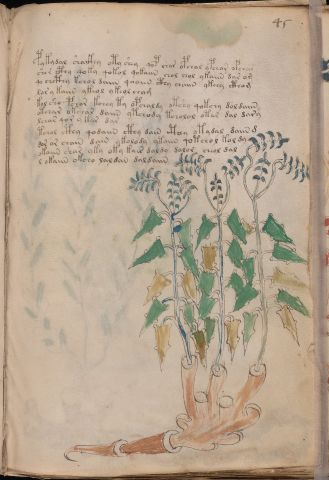

# Voynich Speculative Herbal Ferment Recipe — f45r

IMPORTANT: this is NOT a real or validated translation of the Voynich Manuscript. It is a speculative/procedural model that interprets EVA using a user-defined grammar to generate experimental recipes using safe, known edible substitutes.

This file is generated automatically from IVTFF/EVA transliteration plus a user-defined procedural grammar.



## Page / Folio
- folio: f45r
- page_number: 87
- plant_category_confidence: 0.0
- plant_category_guess: unknown
- section: herbal

## Plant Interpretation (Heuristic)
- category: unknown
- confidence: 0.0
- note: Heuristic classification based on the IVTFF 'Plant ID' string (not the drawing). Does not imply real identification of the manuscript plant.

## EVA Text (Transliteration)
```text
pykydal shaikhy oty shey qop char opchal ypchor ofchar
shor cthy qoky qokol qokaiin chol chol ykaiin dar om
qo chcthy kchol daiin qoaiin cthy chaiin ykeey cthom
lor y kaiin ykeol ykeol cham
kol sho pchor kchey ty opchaldy otshy qokchy dol daiin
otchar okchar daiin ytchody tcholol otar dal dary
lchar qor y kar dar
tchol cthy qodaiin cthy dain @246;thhey otydal daiin [g:d]
@201;or or chain dain ykolody ytaiin qotchol kol dy
okaiin shar yky oky kair daldy dalor cheol dal
l okaiin okcho laldan daldaiin
```

## Page Summary (Procedural, Aggregated)
- compound_counts: {'yeast fermentation': 32, 'sugars': 24, 'secondary herb': 6, 'mix/transfer': 41, 'heat': 12, 'liquid base': 10, 'main herb': 24, 'aroma modifier': 1, 'complex herbal compound': 6}
- dose_level: 2
- fermentation_estimate: 7–14 days

## Pantry (Max Needed For Any Single Line-Recipe)
- aroma_modifier: ['lemon peel (optional)']
- aroma_modifier_dose: ['2–5 g (or 1 strip of peel, avoiding the bitter pith)']
- main_plant_dry_g: 10
- main_plant_substitute: ['chamomile (safe default substitute)']
- safe_complex_herbal_blend: ['gentle spices (e.g., 1 g cinnamon + 1 g clove) or a commercial herbal tea blend']
- secondary_herb_dry_g: 2
- secondary_herb_substitute: ['mint']
- sugar_or_honey_g: 50
- water_l: 0.5
- yeast_g: 1

## Recipes Index (This Page)
- [f45r.1,@P0](#f45r-1-f45r-1-p0)
- [f45r.2,+P0](#f45r-2-f45r-2-p0)
- [f45r.3,+P0](#f45r-3-f45r-3-p0)
- [f45r.4,+P0](#f45r-4-f45r-4-p0)
- [f45r.5,+P0](#f45r-5-f45r-5-p0)
- [f45r.6,+P0](#f45r-6-f45r-6-p0)
- [f45r.7,+P0](#f45r-7-f45r-7-p0)
- [f45r.8,+P0](#f45r-8-f45r-8-p0)
- [f45r.9,+P0](#f45r-9-f45r-9-p0)
- [f45r.10,+P0](#f45r-10-f45r-10-p0)
- [f45r.11,+P0](#f45r-11-f45r-11-p0)

## Line Recipes (Each Line = One Recipe, 0.5L batch)

<a id="f45r-1-f45r-1-p0"></a>

### f45r.1,@P0

EVA: pykydal shaikhy oty shey qop char opchal ypchor ofchar

## Ingredients
- aroma_modifier: lemon peel (optional)
- aroma_modifier_dose: 2–5 g (or 1 strip of peel, avoiding the bitter pith)
- main_plant_dry_g: 5
- main_plant_substitute: chamomile (safe default substitute)
- secondary_herb_dry_g: 2
- secondary_herb_substitute: mint
- sugar_or_honey_g: 25
- water_l: 0.5
- yeast_g: 1

Process:
1. Sanitize the jar/fermenter and utensils.
2. Base: combine 0.5 L water with 25 g sugar or honey.
3. Apply gentle heat: simmer 10–15 min, then cool to <30°C before adding yeast.
4. Add main plant: chamomile (safe default substitute) (~5 g dried).
5. Add secondary herb: mint (~2 g dried).
6. Add aroma modifier (optional) in a low dose.
7. Pitch yeast: 1 g (ideally cider/beer yeast).
8. Ferment with an airlock: 2–4 days (guided by iin/aiin markers).
9. Strain/rack (if very solid-heavy) and cold-crash 24 h.
10. Bottle only when activity clearly slows; refrigerate. Avoid overpressure.

Expected Result: A mild, aromatic herbal ferment, low-to-medium intensity depending on dose level.

Does It Make Sense?: partial

Direct Gloss (Procedural, Not a Real Translation):
- pykydal: add fermentable sugars → start fermentation (yeast) → duration level 1 → state: fermentation start
- shaikhy: add fermentable sugars → add secondary herb (safe substitute) → duration level 1 → state: fermentation start
- oty: apply heat/cooking → mix / transfer
- shey: add secondary herb (safe substitute) → duration level 1 → state: active extraction
- qop: prepare liquid base → start fermentation (yeast)
- char: add main plant (safe substitute) → duration level 1 → state: fermentation start
- opchal: add main plant (safe substitute) → mix / transfer → start fermentation (yeast) → duration level 1 → state: fermentation start
- ypchor: add main plant (safe substitute) → mix / transfer → start fermentation (yeast)
- ofchar: add main plant (safe substitute) → add aroma modifier → mix / transfer → duration level 1 → state: fermentation start

<a id="f45r-2-f45r-2-p0"></a>

### f45r.2,+P0

EVA: shor cthy qoky qokol qokaiin chol chol ykaiin dar om

## Ingredients
- main_plant_dry_g: 5
- main_plant_substitute: chamomile (safe default substitute)
- safe_complex_herbal_blend: gentle spices (e.g., 1 g cinnamon + 1 g clove) or a commercial herbal tea blend
- secondary_herb_dry_g: 2
- secondary_herb_substitute: mint
- sugar_or_honey_g: 25
- water_l: 0.5
- yeast_g: 1

Process:
1. Sanitize the jar/fermenter and utensils.
2. Base: combine 0.5 L water with 25 g sugar or honey.
3. Infusion: use hot (not boiling) water, then let it cool before adding yeast.
4. Add main plant: chamomile (safe default substitute) (~5 g dried).
5. Add secondary herb: mint (~2 g dried).
6. If a complex herbal compound appears, use a safe commercial blend or gentle spices in micro-doses.
7. Pitch yeast: 1 g (ideally cider/beer yeast).
8. Ferment with an airlock: 7–14 days (guided by iin/aiin markers).
9. Strain/rack (if very solid-heavy) and cold-crash 24 h.
10. Bottle only when activity clearly slows; refrigerate. Avoid overpressure.

Expected Result: A mild, aromatic herbal ferment, low-to-medium intensity depending on dose level.

Does It Make Sense?: partial

Direct Gloss (Procedural, Not a Real Translation):
- shor: add secondary herb (safe substitute) → mix / transfer
- cthy: add complex herbal compound (safe blend)
- qoky: prepare liquid base → add fermentable sugars
- qokol: prepare liquid base → add fermentable sugars → mix / transfer
- qokaiin: prepare liquid base → add fermentable sugars → duration level 1 → state: fermentation start → long fermentation / aging phase
- chol: add main plant (safe substitute) → mix / transfer
- chol: add main plant (safe substitute) → mix / transfer
- ykaiin: add fermentable sugars → duration level 1 → state: fermentation start → long fermentation / aging phase
- dar: start fermentation (yeast) → duration level 1 → state: fermentation start
- om: mix / transfer

<a id="f45r-3-f45r-3-p0"></a>

### f45r.3,+P0

EVA: qo chcthy kchol daiin qoaiin cthy chaiin ykeey cthom

## Ingredients
- main_plant_dry_g: 10
- main_plant_substitute: chamomile (safe default substitute)
- safe_complex_herbal_blend: gentle spices (e.g., 1 g cinnamon + 1 g clove) or a commercial herbal tea blend
- secondary_herb_dry_g: 2
- secondary_herb_substitute: mint
- sugar_or_honey_g: 50
- water_l: 0.5
- yeast_g: 1

Process:
1. Sanitize the jar/fermenter and utensils.
2. Base: combine 0.5 L water with 50 g sugar or honey.
3. Infusion: use hot (not boiling) water, then let it cool before adding yeast.
4. Add main plant: chamomile (safe default substitute) (~10 g dried).
5. Add secondary herb: mint (~2 g dried).
6. If a complex herbal compound appears, use a safe commercial blend or gentle spices in micro-doses.
7. Pitch yeast: 1 g (ideally cider/beer yeast).
8. Ferment with an airlock: 7–14 days (guided by iin/aiin markers).
9. Strain/rack (if very solid-heavy) and cold-crash 24 h.
10. Bottle only when activity clearly slows; refrigerate. Avoid overpressure.

Expected Result: A mild, aromatic herbal ferment, low-to-medium intensity depending on dose level.

Does It Make Sense?: partial

Direct Gloss (Procedural, Not a Real Translation):
- qo: prepare liquid base
- chcthy: add main plant (safe substitute) → add complex herbal compound (safe blend)
- kchol: add fermentable sugars → add main plant (safe substitute) → mix / transfer
- daiin: start fermentation (yeast) → duration level 1 → state: fermentation start → long fermentation / aging phase
- qoaiin: prepare liquid base → duration level 1 → state: fermentation start → long fermentation / aging phase
- cthy: add complex herbal compound (safe blend)
- chaiin: add main plant (safe substitute) → duration level 1 → state: fermentation start → long fermentation / aging phase
- ykeey: add fermentable sugars → duration level 2 → state: active extraction
- cthom: mix / transfer → add complex herbal compound (safe blend)

<a id="f45r-4-f45r-4-p0"></a>

### f45r.4,+P0

EVA: lor y kaiin ykeol ykeol cham

## Ingredients
- main_plant_dry_g: 5
- main_plant_substitute: chamomile (safe default substitute)
- secondary_herb_dry_g: 1
- secondary_herb_substitute: mint
- sugar_or_honey_g: 25
- water_l: 0.5
- yeast_g: 1

Process:
1. Sanitize the jar/fermenter and utensils.
2. Base: combine 0.5 L water with 25 g sugar or honey.
3. Infusion: use hot (not boiling) water, then let it cool before adding yeast.
4. Add main plant: chamomile (safe default substitute) (~5 g dried).
5. Add secondary herb: mint (~1 g dried).
6. Pitch yeast: 1 g (ideally cider/beer yeast).
7. Ferment with an airlock: 7–14 days (guided by iin/aiin markers).
8. Strain/rack (if very solid-heavy) and cold-crash 24 h.
9. Bottle only when activity clearly slows; refrigerate. Avoid overpressure.

Expected Result: A mild, aromatic herbal ferment, low-to-medium intensity depending on dose level.

Does It Make Sense?: partial

Direct Gloss (Procedural, Not a Real Translation):
- lor: mix / transfer
- y: [unparsed]
- kaiin: add fermentable sugars → duration level 1 → state: fermentation start → long fermentation / aging phase
- ykeol: add fermentable sugars → mix / transfer → duration level 1 → state: active extraction
- ykeol: add fermentable sugars → mix / transfer → duration level 1 → state: active extraction
- cham: add main plant (safe substitute) → duration level 1 → state: fermentation start

<a id="f45r-5-f45r-5-p0"></a>

### f45r.5,+P0

EVA: kol sho pchor kchey ty opchaldy otshy qokchy dol daiin

## Ingredients
- main_plant_dry_g: 5
- main_plant_substitute: chamomile (safe default substitute)
- secondary_herb_dry_g: 2
- secondary_herb_substitute: mint
- sugar_or_honey_g: 25
- water_l: 0.5
- yeast_g: 1

Process:
1. Sanitize the jar/fermenter and utensils.
2. Base: combine 0.5 L water with 25 g sugar or honey.
3. Apply gentle heat: simmer 10–15 min, then cool to <30°C before adding yeast.
4. Add main plant: chamomile (safe default substitute) (~5 g dried).
5. Add secondary herb: mint (~2 g dried).
6. Pitch yeast: 1 g (ideally cider/beer yeast).
7. Ferment with an airlock: 7–14 days (guided by iin/aiin markers).
8. Strain/rack (if very solid-heavy) and cold-crash 24 h.
9. Bottle only when activity clearly slows; refrigerate. Avoid overpressure.

Expected Result: A mild, aromatic herbal ferment, low-to-medium intensity depending on dose level.

Does It Make Sense?: partial

Direct Gloss (Procedural, Not a Real Translation):
- kol: add fermentable sugars → mix / transfer
- sho: add secondary herb (safe substitute) → mix / transfer
- pchor: add main plant (safe substitute) → mix / transfer → start fermentation (yeast)
- kchey: add fermentable sugars → add main plant (safe substitute) → duration level 1 → state: active extraction
- ty: apply heat/cooking
- opchaldy: add main plant (safe substitute) → mix / transfer → start fermentation (yeast) → duration level 1 → state: fermentation start
- otshy: apply heat/cooking → add secondary herb (safe substitute) → mix / transfer
- qokchy: prepare liquid base → add fermentable sugars → add main plant (safe substitute)
- dol: mix / transfer → start fermentation (yeast)
- daiin: start fermentation (yeast) → duration level 1 → state: fermentation start → long fermentation / aging phase

<a id="f45r-6-f45r-6-p0"></a>

### f45r.6,+P0

EVA: otchar okchar daiin ytchody tcholol otar dal dary

## Ingredients
- main_plant_dry_g: 5
- main_plant_substitute: chamomile (safe default substitute)
- secondary_herb_dry_g: 1
- secondary_herb_substitute: mint
- sugar_or_honey_g: 25
- water_l: 0.5
- yeast_g: 1

Process:
1. Sanitize the jar/fermenter and utensils.
2. Base: combine 0.5 L water with 25 g sugar or honey.
3. Apply gentle heat: simmer 10–15 min, then cool to <30°C before adding yeast.
4. Add main plant: chamomile (safe default substitute) (~5 g dried).
5. Add secondary herb: mint (~1 g dried).
6. Pitch yeast: 1 g (ideally cider/beer yeast).
7. Ferment with an airlock: 7–14 days (guided by iin/aiin markers).
8. Strain/rack (if very solid-heavy) and cold-crash 24 h.
9. Bottle only when activity clearly slows; refrigerate. Avoid overpressure.

Expected Result: A mild, aromatic herbal ferment, low-to-medium intensity depending on dose level.

Does It Make Sense?: partial

Direct Gloss (Procedural, Not a Real Translation):
- otchar: apply heat/cooking → add main plant (safe substitute) → mix / transfer → duration level 1 → state: fermentation start
- okchar: add fermentable sugars → add main plant (safe substitute) → mix / transfer → duration level 1 → state: fermentation start
- daiin: start fermentation (yeast) → duration level 1 → state: fermentation start → long fermentation / aging phase
- ytchody: apply heat/cooking → add main plant (safe substitute) → mix / transfer → start fermentation (yeast)
- tcholol: apply heat/cooking → add main plant (safe substitute) → mix / transfer
- otar: apply heat/cooking → mix / transfer → duration level 1 → state: fermentation start
- dal: start fermentation (yeast) → duration level 1 → state: fermentation start
- dary: start fermentation (yeast) → duration level 1 → state: fermentation start

<a id="f45r-7-f45r-7-p0"></a>

### f45r.7,+P0

EVA: lchar qor y kar dar

## Ingredients
- main_plant_dry_g: 5
- main_plant_substitute: chamomile (safe default substitute)
- secondary_herb_dry_g: 1
- secondary_herb_substitute: mint
- sugar_or_honey_g: 25
- water_l: 0.5
- yeast_g: 1

Process:
1. Sanitize the jar/fermenter and utensils.
2. Base: combine 0.5 L water with 25 g sugar or honey.
3. Infusion: use hot (not boiling) water, then let it cool before adding yeast.
4. Add main plant: chamomile (safe default substitute) (~5 g dried).
5. Add secondary herb: mint (~1 g dried).
6. Pitch yeast: 1 g (ideally cider/beer yeast).
7. Ferment with an airlock: 2–4 days (guided by iin/aiin markers).
8. Strain/rack (if very solid-heavy) and cold-crash 24 h.
9. Bottle only when activity clearly slows; refrigerate. Avoid overpressure.

Expected Result: A mild, aromatic herbal ferment, low-to-medium intensity depending on dose level.

Does It Make Sense?: partial

Direct Gloss (Procedural, Not a Real Translation):
- lchar: add main plant (safe substitute) → duration level 1 → state: fermentation start
- qor: prepare liquid base
- y: [unparsed]
- kar: add fermentable sugars → duration level 1 → state: fermentation start
- dar: start fermentation (yeast) → duration level 1 → state: fermentation start

<a id="f45r-8-f45r-8-p0"></a>

### f45r.8,+P0

EVA: tchol cthy qodaiin cthy dain @246;thhey otydal daiin [g:d]

## Ingredients
- main_plant_dry_g: 5
- main_plant_substitute: chamomile (safe default substitute)
- safe_complex_herbal_blend: gentle spices (e.g., 1 g cinnamon + 1 g clove) or a commercial herbal tea blend
- secondary_herb_dry_g: 1
- secondary_herb_substitute: mint
- sugar_or_honey_g: 12
- water_l: 0.5
- yeast_g: 1

Process:
1. Sanitize the jar/fermenter and utensils.
2. Base: combine 0.5 L water with 12 g sugar or honey.
3. Apply gentle heat: simmer 10–15 min, then cool to <30°C before adding yeast.
4. Add main plant: chamomile (safe default substitute) (~5 g dried).
5. Add secondary herb: mint (~1 g dried).
6. If a complex herbal compound appears, use a safe commercial blend or gentle spices in micro-doses.
7. Pitch yeast: 1 g (ideally cider/beer yeast).
8. Ferment with an airlock: 7–14 days (guided by iin/aiin markers).
9. Strain/rack (if very solid-heavy) and cold-crash 24 h.
10. Bottle only when activity clearly slows; refrigerate. Avoid overpressure.

Expected Result: A mild, aromatic herbal ferment, low-to-medium intensity depending on dose level.

Does It Make Sense?: partial

Direct Gloss (Procedural, Not a Real Translation):
- tchol: apply heat/cooking → add main plant (safe substitute) → mix / transfer
- cthy: add complex herbal compound (safe blend)
- qodaiin: prepare liquid base → start fermentation (yeast) → duration level 1 → state: fermentation start → long fermentation / aging phase
- cthy: add complex herbal compound (safe blend)
- dain: start fermentation (yeast) → duration level 1 → state: fermentation start
- thhey: apply heat/cooking → duration level 1 → state: active extraction
- otydal: apply heat/cooking → mix / transfer → start fermentation (yeast) → duration level 1 → state: fermentation start
- daiin: start fermentation (yeast) → duration level 1 → state: fermentation start → long fermentation / aging phase
- g: [unparsed]
- d: start fermentation (yeast)

<a id="f45r-9-f45r-9-p0"></a>

### f45r.9,+P0

EVA: @201;or or chain dain ykolody ytaiin qotchol kol dy

## Ingredients
- main_plant_dry_g: 5
- main_plant_substitute: chamomile (safe default substitute)
- secondary_herb_dry_g: 1
- secondary_herb_substitute: mint
- sugar_or_honey_g: 25
- water_l: 0.5
- yeast_g: 1

Process:
1. Sanitize the jar/fermenter and utensils.
2. Base: combine 0.5 L water with 25 g sugar or honey.
3. Apply gentle heat: simmer 10–15 min, then cool to <30°C before adding yeast.
4. Add main plant: chamomile (safe default substitute) (~5 g dried).
5. Add secondary herb: mint (~1 g dried).
6. Pitch yeast: 1 g (ideally cider/beer yeast).
7. Ferment with an airlock: 7–14 days (guided by iin/aiin markers).
8. Strain/rack (if very solid-heavy) and cold-crash 24 h.
9. Bottle only when activity clearly slows; refrigerate. Avoid overpressure.

Expected Result: A mild, aromatic herbal ferment, low-to-medium intensity depending on dose level.

Does It Make Sense?: partial

Direct Gloss (Procedural, Not a Real Translation):
- or: mix / transfer
- or: mix / transfer
- chain: add main plant (safe substitute) → duration level 1 → state: fermentation start
- dain: start fermentation (yeast) → duration level 1 → state: fermentation start
- ykolody: add fermentable sugars → mix / transfer → start fermentation (yeast)
- ytaiin: apply heat/cooking → duration level 1 → state: fermentation start → long fermentation / aging phase
- qotchol: prepare liquid base → apply heat/cooking → add main plant (safe substitute) → mix / transfer
- kol: add fermentable sugars → mix / transfer
- dy: start fermentation (yeast)

<a id="f45r-10-f45r-10-p0"></a>

### f45r.10,+P0

EVA: okaiin shar yky oky kair daldy dalor cheol dal

## Ingredients
- main_plant_dry_g: 5
- main_plant_substitute: chamomile (safe default substitute)
- secondary_herb_dry_g: 2
- secondary_herb_substitute: mint
- sugar_or_honey_g: 25
- water_l: 0.5
- yeast_g: 1

Process:
1. Sanitize the jar/fermenter and utensils.
2. Base: combine 0.5 L water with 25 g sugar or honey.
3. Infusion: use hot (not boiling) water, then let it cool before adding yeast.
4. Add main plant: chamomile (safe default substitute) (~5 g dried).
5. Add secondary herb: mint (~2 g dried).
6. Pitch yeast: 1 g (ideally cider/beer yeast).
7. Ferment with an airlock: 7–14 days (guided by iin/aiin markers).
8. Strain/rack (if very solid-heavy) and cold-crash 24 h.
9. Bottle only when activity clearly slows; refrigerate. Avoid overpressure.

Expected Result: A mild, aromatic herbal ferment, low-to-medium intensity depending on dose level.

Does It Make Sense?: partial

Direct Gloss (Procedural, Not a Real Translation):
- okaiin: add fermentable sugars → mix / transfer → duration level 1 → state: fermentation start → long fermentation / aging phase
- shar: add secondary herb (safe substitute) → duration level 1 → state: fermentation start
- yky: add fermentable sugars
- oky: add fermentable sugars → mix / transfer
- kair: add fermentable sugars → duration level 1 → state: fermentation start
- daldy: start fermentation (yeast) → duration level 1 → state: fermentation start
- dalor: mix / transfer → start fermentation (yeast) → duration level 1 → state: fermentation start
- cheol: add main plant (safe substitute) → mix / transfer → duration level 1 → state: active extraction
- dal: start fermentation (yeast) → duration level 1 → state: fermentation start

<a id="f45r-11-f45r-11-p0"></a>

### f45r.11,+P0

EVA: l okaiin okcho laldan daldaiin

## Ingredients
- main_plant_dry_g: 5
- main_plant_substitute: chamomile (safe default substitute)
- secondary_herb_dry_g: 1
- secondary_herb_substitute: mint
- sugar_or_honey_g: 25
- water_l: 0.5
- yeast_g: 1

Process:
1. Sanitize the jar/fermenter and utensils.
2. Base: combine 0.5 L water with 25 g sugar or honey.
3. Infusion: use hot (not boiling) water, then let it cool before adding yeast.
4. Add main plant: chamomile (safe default substitute) (~5 g dried).
5. Add secondary herb: mint (~1 g dried).
6. Pitch yeast: 1 g (ideally cider/beer yeast).
7. Ferment with an airlock: 7–14 days (guided by iin/aiin markers).
8. Strain/rack (if very solid-heavy) and cold-crash 24 h.
9. Bottle only when activity clearly slows; refrigerate. Avoid overpressure.

Expected Result: A mild, aromatic herbal ferment, low-to-medium intensity depending on dose level.

Does It Make Sense?: partial

Direct Gloss (Procedural, Not a Real Translation):
- l: [unparsed]
- okaiin: add fermentable sugars → mix / transfer → duration level 1 → state: fermentation start → long fermentation / aging phase
- okcho: add fermentable sugars → add main plant (safe substitute) → mix / transfer
- laldan: start fermentation (yeast) → duration level 1 → state: fermentation start
- daldaiin: start fermentation (yeast) → duration level 1 → state: fermentation start → long fermentation / aging phase

## Risks & Warnings (Applies To All Line-Recipes)
- Never use unidentified Voynich plants directly; only use known edible substitutes.
- Do not consume if you see mold, smell rot, notice abnormal sliminess, or taste something clearly foul.
- Overpressure/bottle-bomb risk: do not bottle before stable; prefer an airlock and refrigeration.
- Avoid if pregnant/breastfeeding, for minors, or with medical conditions; consult a professional.
- No medical claims: this is an experimental beverage.

## Recommended Adjustments (General)
- If too bitter (leafy profile), halve the herbs or shorten steep/maceration time.
- If too sweet, extend fermentation or reduce sugar by 25–50%.
- For a non-alcoholic version, omit yeast and keep refrigerated as an infusion (not fermented).
