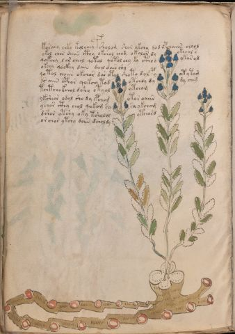

# Voynich Speculative Herbal Ferment Recipe — f45v

IMPORTANT: this is NOT a real or validated translation of the Voynich Manuscript. It is a speculative/procedural model that interprets EVA using a user-defined grammar to generate experimental recipes using safe, known edible substitutes.

This file is generated automatically from IVTFF/EVA transliteration plus a user-defined procedural grammar.

## Page / Folio
- folio: f45v
- page_number: 88
- plant_candidates: ['Sentellaria', 'Veronica? carnedris', 'Ehrenpreis?']
- plant_category_confidence: 0.25
- plant_category_guess: leaf
- plant_category_matches: ['section=herbal_default']
- plant_id: Sentellaria, Veronica? carnedris(sp), Ehrenpreis?,
- section: herbal

## Plant Interpretation (Heuristic)
- category: leaf
- confidence: 0.25
- note: Heuristic classification based on the IVTFF 'Plant ID' string (not the drawing). Does not imply real identification of the manuscript plant.
- textual_evidence_terms: ['section=herbal_default']

## EVA Text (Transliteration)
ko[r:s]ary chko kol chey fsholom shor ykchy dod opchaiin olald
okol chor daiin cthy okchol chom okolo[r:n] dy okchol s
qokchy l or cheol qot[o:a]l qotol chy ky cthod ykar yd
okchy qockhy dain dail dair shy
qotol choiin okchar dar oty shoto dol py otytam
?s aiin cphor qokcy tod ytchdy dy dy cheg
tchtcho kchol dshy o tyol ytchom
yksheor odal sho dy pchom otor oa[iir:iin]
ychor cthy chol qokom sy sa ykchom
dshor otshy oky tsholol ytchord
or chor ytchy doiin dcholdy

## Page Summary (Procedural, Aggregated)
- compound_counts: {'sugars': 19, 'mix/transfer': 62, 'main herb': 28, 'aroma modifier': 1, 'secondary herb': 10, 'yeast fermentation': 27, 'complex herbal compound': 5, 'liquid base': 7, 'heat': 18}
- dose_level: 2
- fermentation_estimate: 7–14 days

## Pantry (Max Needed For Any Single Line-Recipe)
- aroma_modifier: ['lemon peel (optional)']
- aroma_modifier_dose: ['2–5 g (or 1 strip of peel, avoiding the bitter pith)']
- main_plant_dry_g: 10
- main_plant_substitute: ['lemon balm']
- safe_complex_herbal_blend: ['gentle spices (e.g., 1 g cinnamon + 1 g clove) or a commercial herbal tea blend']
- secondary_herb_dry_g: 5
- secondary_herb_substitute: ['mint']
- sugar_or_honey_g: 50
- water_l: 0.5
- yeast_g: 1

## Line Recipes (Each Line = One Recipe, 0.5L batch)

### f45v.1,@P0

EVA: ko[r:s]ary chko kol chey fsholom shor ykchy dod opchaiin olald

## Ingredients
- aroma_modifier: lemon peel (optional)
- aroma_modifier_dose: 2–5 g (or 1 strip of peel, avoiding the bitter pith)
- main_plant_dry_g: 5
- main_plant_substitute: lemon balm
- secondary_herb_dry_g: 2
- secondary_herb_substitute: mint
- sugar_or_honey_g: 25
- water_l: 0.5
- yeast_g: 1

Process:
1. Sanitize the jar/fermenter and utensils.
2. Base: combine 0.5 L water with 25 g sugar or honey.
3. Infusion: use hot (not boiling) water, then let it cool before adding yeast.
4. Add main plant: lemon balm (~5 g dried).
5. Add secondary herb: mint (~2 g dried).
6. Add aroma modifier (optional) in a low dose.
7. Pitch yeast: 1 g (ideally cider/beer yeast).
8. Ferment with an airlock: 7–14 days (guided by iin/aiin markers).
9. Strain/rack (if very solid-heavy) and cold-crash 24 h.
10. Bottle only when activity clearly slows; refrigerate. Avoid overpressure.

Expected Result: A mild, aromatic herbal ferment, low-to-medium intensity depending on dose level.

Does It Make Sense?: yes

Direct Gloss (Procedural, Not a Real Translation):
- ko: add fermentable sugars → mix / transfer
- r: [unparsed]
- s: [unparsed]
- ary: duration level 1 → state: fermentation start
- chko: add fermentable sugars → add main plant (safe substitute) → mix / transfer
- kol: add fermentable sugars → mix / transfer
- chey: add main plant (safe substitute) → duration level 1 → state: active extraction
- fsholom: add secondary herb (safe substitute) → add aroma modifier → mix / transfer
- shor: add secondary herb (safe substitute) → mix / transfer
- ykchy: add fermentable sugars → add main plant (safe substitute)
- dod: mix / transfer → start fermentation (yeast)
- opchaiin: add main plant (safe substitute) → mix / transfer → start fermentation (yeast) → duration level 1 → state: fermentation start → long fermentation / aging phase
- olald: mix / transfer → start fermentation (yeast) → duration level 1 → state: fermentation start

### f45v.2,+P0

EVA: okol chor daiin cthy okchol chom okolo[r:n] dy okchol s

## Ingredients
- main_plant_dry_g: 5
- main_plant_substitute: lemon balm
- safe_complex_herbal_blend: gentle spices (e.g., 1 g cinnamon + 1 g clove) or a commercial herbal tea blend
- secondary_herb_dry_g: 1
- secondary_herb_substitute: mint
- sugar_or_honey_g: 25
- water_l: 0.5
- yeast_g: 1

Process:
1. Sanitize the jar/fermenter and utensils.
2. Base: combine 0.5 L water with 25 g sugar or honey.
3. Infusion: use hot (not boiling) water, then let it cool before adding yeast.
4. Add main plant: lemon balm (~5 g dried).
5. Add secondary herb: mint (~1 g dried).
6. If a complex herbal compound appears, use a safe commercial blend or gentle spices in micro-doses.
7. Pitch yeast: 1 g (ideally cider/beer yeast).
8. Ferment with an airlock: 7–14 days (guided by iin/aiin markers).
9. Strain/rack (if very solid-heavy) and cold-crash 24 h.
10. Bottle only when activity clearly slows; refrigerate. Avoid overpressure.

Expected Result: A mild, aromatic herbal ferment, low-to-medium intensity depending on dose level.

Does It Make Sense?: yes

Direct Gloss (Procedural, Not a Real Translation):
- okol: add fermentable sugars → mix / transfer
- chor: add main plant (safe substitute) → mix / transfer
- daiin: start fermentation (yeast) → duration level 1 → state: fermentation start → long fermentation / aging phase
- cthy: add complex herbal compound (safe blend)
- okchol: add fermentable sugars → add main plant (safe substitute) → mix / transfer
- chom: add main plant (safe substitute) → mix / transfer
- okolo: add fermentable sugars → mix / transfer
- r: [unparsed]
- n: [unparsed]
- dy: start fermentation (yeast)
- okchol: add fermentable sugars → add main plant (safe substitute) → mix / transfer
- s: [unparsed]

### f45v.3,+P0

EVA: qokchy l or cheol qot[o:a]l qotol chy ky cthod ykar yd

## Ingredients
- main_plant_dry_g: 5
- main_plant_substitute: lemon balm
- safe_complex_herbal_blend: gentle spices (e.g., 1 g cinnamon + 1 g clove) or a commercial herbal tea blend
- secondary_herb_dry_g: 1
- secondary_herb_substitute: mint
- sugar_or_honey_g: 25
- water_l: 0.5
- yeast_g: 1

Process:
1. Sanitize the jar/fermenter and utensils.
2. Base: combine 0.5 L water with 25 g sugar or honey.
3. Apply gentle heat: simmer 10–15 min, then cool to <30°C before adding yeast.
4. Add main plant: lemon balm (~5 g dried).
5. Add secondary herb: mint (~1 g dried).
6. If a complex herbal compound appears, use a safe commercial blend or gentle spices in micro-doses.
7. Pitch yeast: 1 g (ideally cider/beer yeast).
8. Ferment with an airlock: 2–4 days (guided by iin/aiin markers).
9. Strain/rack (if very solid-heavy) and cold-crash 24 h.
10. Bottle only when activity clearly slows; refrigerate. Avoid overpressure.

Expected Result: A mild, aromatic herbal ferment, low-to-medium intensity depending on dose level.

Does It Make Sense?: yes

Direct Gloss (Procedural, Not a Real Translation):
- qokchy: prepare liquid base → add fermentable sugars → add main plant (safe substitute)
- l: [unparsed]
- or: mix / transfer
- cheol: add main plant (safe substitute) → mix / transfer → duration level 1 → state: active extraction
- qot: prepare liquid base → apply heat/cooking
- o: mix / transfer
- a: duration level 1 → state: fermentation start
- l: [unparsed]
- qotol: prepare liquid base → apply heat/cooking → mix / transfer
- chy: add main plant (safe substitute)
- ky: add fermentable sugars
- cthod: mix / transfer → start fermentation (yeast) → add complex herbal compound (safe blend)
- ykar: add fermentable sugars → duration level 1 → state: fermentation start
- yd: start fermentation (yeast)

### f45v.4,+P0

EVA: okchy qockhy dain dail dair shy

## Ingredients
- main_plant_dry_g: 5
- main_plant_substitute: lemon balm
- safe_complex_herbal_blend: gentle spices (e.g., 1 g cinnamon + 1 g clove) or a commercial herbal tea blend
- secondary_herb_dry_g: 2
- secondary_herb_substitute: mint
- sugar_or_honey_g: 25
- water_l: 0.5
- yeast_g: 1

Process:
1. Sanitize the jar/fermenter and utensils.
2. Base: combine 0.5 L water with 25 g sugar or honey.
3. Infusion: use hot (not boiling) water, then let it cool before adding yeast.
4. Add main plant: lemon balm (~5 g dried).
5. Add secondary herb: mint (~2 g dried).
6. If a complex herbal compound appears, use a safe commercial blend or gentle spices in micro-doses.
7. Pitch yeast: 1 g (ideally cider/beer yeast).
8. Ferment with an airlock: 2–4 days (guided by iin/aiin markers).
9. Strain/rack (if very solid-heavy) and cold-crash 24 h.
10. Bottle only when activity clearly slows; refrigerate. Avoid overpressure.

Expected Result: A mild, aromatic herbal ferment, low-to-medium intensity depending on dose level.

Does It Make Sense?: yes

Direct Gloss (Procedural, Not a Real Translation):
- okchy: add fermentable sugars → add main plant (safe substitute) → mix / transfer
- qockhy: prepare liquid base → add complex herbal compound (safe blend)
- dain: start fermentation (yeast) → duration level 1 → state: fermentation start
- dail: start fermentation (yeast) → duration level 1 → state: fermentation start
- dair: start fermentation (yeast) → duration level 1 → state: fermentation start
- shy: add secondary herb (safe substitute)

### f45v.5,+P0

EVA: qotol choiin okchar dar oty shoto dol py otytam

## Ingredients
- main_plant_dry_g: 10
- main_plant_substitute: lemon balm
- secondary_herb_dry_g: 5
- secondary_herb_substitute: mint
- sugar_or_honey_g: 50
- water_l: 0.5
- yeast_g: 1

Process:
1. Sanitize the jar/fermenter and utensils.
2. Base: combine 0.5 L water with 50 g sugar or honey.
3. Apply gentle heat: simmer 10–15 min, then cool to <30°C before adding yeast.
4. Add main plant: lemon balm (~10 g dried).
5. Add secondary herb: mint (~5 g dried).
6. Pitch yeast: 1 g (ideally cider/beer yeast).
7. Ferment with an airlock: 3–5 days (guided by iin/aiin markers).
8. Strain/rack (if very solid-heavy) and cold-crash 24 h.
9. Bottle only when activity clearly slows; refrigerate. Avoid overpressure.

Expected Result: A mild, aromatic herbal ferment, low-to-medium intensity depending on dose level.

Does It Make Sense?: yes

Direct Gloss (Procedural, Not a Real Translation):
- qotol: prepare liquid base → apply heat/cooking → mix / transfer
- choiin: add main plant (safe substitute) → mix / transfer → duration level 2 → state: cooling/rest → medium fermentation phase
- okchar: add fermentable sugars → add main plant (safe substitute) → mix / transfer → duration level 1 → state: fermentation start
- dar: start fermentation (yeast) → duration level 1 → state: fermentation start
- oty: apply heat/cooking → mix / transfer
- shoto: apply heat/cooking → add secondary herb (safe substitute) → mix / transfer
- dol: mix / transfer → start fermentation (yeast)
- py: start fermentation (yeast)
- otytam: apply heat/cooking → mix / transfer → duration level 1 → state: fermentation start

### f45v.6,+P0

EVA: ?s aiin cphor qokcy tod ytchdy dy dy cheg

## Ingredients
- main_plant_dry_g: 5
- main_plant_substitute: lemon balm
- safe_complex_herbal_blend: gentle spices (e.g., 1 g cinnamon + 1 g clove) or a commercial herbal tea blend
- secondary_herb_dry_g: 1
- secondary_herb_substitute: mint
- sugar_or_honey_g: 25
- water_l: 0.5
- yeast_g: 1

Process:
1. Sanitize the jar/fermenter and utensils.
2. Base: combine 0.5 L water with 25 g sugar or honey.
3. Apply gentle heat: simmer 10–15 min, then cool to <30°C before adding yeast.
4. Add main plant: lemon balm (~5 g dried).
5. Add secondary herb: mint (~1 g dried).
6. If a complex herbal compound appears, use a safe commercial blend or gentle spices in micro-doses.
7. Pitch yeast: 1 g (ideally cider/beer yeast).
8. Ferment with an airlock: 7–14 days (guided by iin/aiin markers).
9. Strain/rack (if very solid-heavy) and cold-crash 24 h.
10. Bottle only when activity clearly slows; refrigerate. Avoid overpressure.

Expected Result: A mild, aromatic herbal ferment, low-to-medium intensity depending on dose level.

Does It Make Sense?: yes

Direct Gloss (Procedural, Not a Real Translation):
- s: [unparsed]
- aiin: duration level 1 → state: fermentation start → long fermentation / aging phase
- cphor: mix / transfer → add complex herbal compound (safe blend)
- qokcy: prepare liquid base → add fermentable sugars
- tod: apply heat/cooking → mix / transfer → start fermentation (yeast)
- ytchdy: apply heat/cooking → add main plant (safe substitute) → start fermentation (yeast)
- dy: start fermentation (yeast)
- dy: start fermentation (yeast)
- cheg: add main plant (safe substitute) → duration level 1 → state: active extraction

### f45v.7,+P0

EVA: tchtcho kchol dshy o tyol ytchom

## Ingredients
- main_plant_dry_g: 5
- main_plant_substitute: lemon balm
- secondary_herb_dry_g: 2
- secondary_herb_substitute: mint
- sugar_or_honey_g: 25
- water_l: 0.5
- yeast_g: 1

Process:
1. Sanitize the jar/fermenter and utensils.
2. Base: combine 0.5 L water with 25 g sugar or honey.
3. Apply gentle heat: simmer 10–15 min, then cool to <30°C before adding yeast.
4. Add main plant: lemon balm (~5 g dried).
5. Add secondary herb: mint (~2 g dried).
6. Pitch yeast: 1 g (ideally cider/beer yeast).
7. Ferment with an airlock: 2–4 days (guided by iin/aiin markers).
8. Strain/rack (if very solid-heavy) and cold-crash 24 h.
9. Bottle only when activity clearly slows; refrigerate. Avoid overpressure.

Expected Result: A mild, aromatic herbal ferment, low-to-medium intensity depending on dose level.

Does It Make Sense?: yes

Direct Gloss (Procedural, Not a Real Translation):
- tchtcho: apply heat/cooking → add main plant (safe substitute) → mix / transfer
- kchol: add fermentable sugars → add main plant (safe substitute) → mix / transfer
- dshy: add secondary herb (safe substitute) → start fermentation (yeast)
- o: mix / transfer
- tyol: apply heat/cooking → mix / transfer
- ytchom: apply heat/cooking → add main plant (safe substitute) → mix / transfer

### f45v.8,+P0

EVA: yksheor odal sho dy pchom otor oa[iir:iin]

## Ingredients
- main_plant_dry_g: 10
- main_plant_substitute: lemon balm
- secondary_herb_dry_g: 5
- secondary_herb_substitute: mint
- sugar_or_honey_g: 50
- water_l: 0.5
- yeast_g: 1

Process:
1. Sanitize the jar/fermenter and utensils.
2. Base: combine 0.5 L water with 50 g sugar or honey.
3. Apply gentle heat: simmer 10–15 min, then cool to <30°C before adding yeast.
4. Add main plant: lemon balm (~10 g dried).
5. Add secondary herb: mint (~5 g dried).
6. Pitch yeast: 1 g (ideally cider/beer yeast).
7. Ferment with an airlock: 3–5 days (guided by iin/aiin markers).
8. Strain/rack (if very solid-heavy) and cold-crash 24 h.
9. Bottle only when activity clearly slows; refrigerate. Avoid overpressure.

Expected Result: A mild, aromatic herbal ferment, low-to-medium intensity depending on dose level.

Does It Make Sense?: yes

Direct Gloss (Procedural, Not a Real Translation):
- yksheor: add fermentable sugars → add secondary herb (safe substitute) → mix / transfer → duration level 1 → state: active extraction
- odal: mix / transfer → start fermentation (yeast) → duration level 1 → state: fermentation start
- sho: add secondary herb (safe substitute) → mix / transfer
- dy: start fermentation (yeast)
- pchom: add main plant (safe substitute) → mix / transfer → start fermentation (yeast)
- otor: apply heat/cooking → mix / transfer
- oa: mix / transfer → duration level 1 → state: fermentation start
- iir: duration level 2 → state: cooling/rest
- iin: duration level 2 → state: cooling/rest → medium fermentation phase

### f45v.9,+P0

EVA: ychor cthy chol qokom sy sa ykchom

## Ingredients
- main_plant_dry_g: 5
- main_plant_substitute: lemon balm
- safe_complex_herbal_blend: gentle spices (e.g., 1 g cinnamon + 1 g clove) or a commercial herbal tea blend
- secondary_herb_dry_g: 1
- secondary_herb_substitute: mint
- sugar_or_honey_g: 25
- water_l: 0.5
- yeast_g: 1

Process:
1. Sanitize the jar/fermenter and utensils.
2. Base: combine 0.5 L water with 25 g sugar or honey.
3. Infusion: use hot (not boiling) water, then let it cool before adding yeast.
4. Add main plant: lemon balm (~5 g dried).
5. Add secondary herb: mint (~1 g dried).
6. If a complex herbal compound appears, use a safe commercial blend or gentle spices in micro-doses.
7. Pitch yeast: 1 g (ideally cider/beer yeast).
8. Ferment with an airlock: 2–4 days (guided by iin/aiin markers).
9. Strain/rack (if very solid-heavy) and cold-crash 24 h.
10. Bottle only when activity clearly slows; refrigerate. Avoid overpressure.

Expected Result: A mild, aromatic herbal ferment, low-to-medium intensity depending on dose level.

Does It Make Sense?: yes

Direct Gloss (Procedural, Not a Real Translation):
- ychor: add main plant (safe substitute) → mix / transfer
- cthy: add complex herbal compound (safe blend)
- chol: add main plant (safe substitute) → mix / transfer
- qokom: prepare liquid base → add fermentable sugars → mix / transfer
- sy: [unparsed]
- sa: duration level 1 → state: fermentation start
- ykchom: add fermentable sugars → add main plant (safe substitute) → mix / transfer

### f45v.10,+P0

EVA: dshor otshy oky tsholol ytchord

## Ingredients
- main_plant_dry_g: 5
- main_plant_substitute: lemon balm
- secondary_herb_dry_g: 2
- secondary_herb_substitute: mint
- sugar_or_honey_g: 25
- water_l: 0.5
- yeast_g: 1

Process:
1. Sanitize the jar/fermenter and utensils.
2. Base: combine 0.5 L water with 25 g sugar or honey.
3. Apply gentle heat: simmer 10–15 min, then cool to <30°C before adding yeast.
4. Add main plant: lemon balm (~5 g dried).
5. Add secondary herb: mint (~2 g dried).
6. Pitch yeast: 1 g (ideally cider/beer yeast).
7. Ferment with an airlock: 2–4 days (guided by iin/aiin markers).
8. Strain/rack (if very solid-heavy) and cold-crash 24 h.
9. Bottle only when activity clearly slows; refrigerate. Avoid overpressure.

Expected Result: A mild, aromatic herbal ferment, low-to-medium intensity depending on dose level.

Does It Make Sense?: yes

Direct Gloss (Procedural, Not a Real Translation):
- dshor: add secondary herb (safe substitute) → mix / transfer → start fermentation (yeast)
- otshy: apply heat/cooking → add secondary herb (safe substitute) → mix / transfer
- oky: add fermentable sugars → mix / transfer
- tsholol: apply heat/cooking → add secondary herb (safe substitute) → mix / transfer
- ytchord: apply heat/cooking → add main plant (safe substitute) → mix / transfer → start fermentation (yeast)

### f45v.11,+P0

EVA: or chor ytchy doiin dcholdy

## Ingredients
- main_plant_dry_g: 10
- main_plant_substitute: lemon balm
- secondary_herb_dry_g: 2
- secondary_herb_substitute: mint
- sugar_or_honey_g: 25
- water_l: 0.5
- yeast_g: 1

Process:
1. Sanitize the jar/fermenter and utensils.
2. Base: combine 0.5 L water with 25 g sugar or honey.
3. Apply gentle heat: simmer 10–15 min, then cool to <30°C before adding yeast.
4. Add main plant: lemon balm (~10 g dried).
5. Add secondary herb: mint (~2 g dried).
6. Pitch yeast: 1 g (ideally cider/beer yeast).
7. Ferment with an airlock: 3–5 days (guided by iin/aiin markers).
8. Strain/rack (if very solid-heavy) and cold-crash 24 h.
9. Bottle only when activity clearly slows; refrigerate. Avoid overpressure.

Expected Result: A mild, aromatic herbal ferment, low-to-medium intensity depending on dose level.

Does It Make Sense?: yes

Direct Gloss (Procedural, Not a Real Translation):
- or: mix / transfer
- chor: add main plant (safe substitute) → mix / transfer
- ytchy: apply heat/cooking → add main plant (safe substitute)
- doiin: mix / transfer → start fermentation (yeast) → duration level 2 → state: cooling/rest → medium fermentation phase
- dcholdy: add main plant (safe substitute) → mix / transfer → start fermentation (yeast)

## Risks & Warnings (Applies To All Line-Recipes)
- Never use unidentified Voynich plants directly; only use known edible substitutes.
- Do not consume if you see mold, smell rot, notice abnormal sliminess, or taste something clearly foul.
- Overpressure/bottle-bomb risk: do not bottle before stable; prefer an airlock and refrigeration.
- Avoid if pregnant/breastfeeding, for minors, or with medical conditions; consult a professional.
- No medical claims: this is an experimental beverage.

## Recommended Adjustments (General)
- If too bitter (leafy profile), halve the herbs or shorten steep/maceration time.
- If too sweet, extend fermentation or reduce sugar by 25–50%.
- For a non-alcoholic version, omit yeast and keep refrigerated as an infusion (not fermented).
