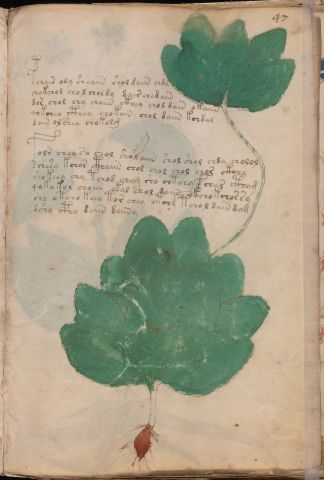

# Voynich Speculative Herbal Ferment Recipe — f47r

IMPORTANT: this is NOT a real or validated translation of the Voynich Manuscript. It is a speculative/procedural model that interprets EVA using a user-defined grammar to generate experimental recipes using safe, known edible substitutes.

This file is generated automatically from IVTFF/EVA transliteration plus a user-defined procedural grammar.

## Page / Folio
- folio: f47r
- page_number: 91
- plant_candidates: ['Indian cucumber?']
- plant_category_confidence: 0.95
- plant_category_guess: root
- plant_category_matches: ['cucumber']
- plant_id: Indian cucumber?
- section: herbal

## Plant Interpretation (Heuristic)
- category: root
- confidence: 0.95
- note: Heuristic classification based on the IVTFF 'Plant ID' string (not the drawing). Does not imply real identification of the manuscript plant.
- textual_evidence_terms: ['cucumber']

## EVA Text (Transliteration)
@159;chair oly sheaiin shol daiin chdy
chokchol chol choldy dair cha[d:j] aiin
dor chol chy chaiin ckhey chol dain okaiin
qokcheo cthey chokain chol daiin kchdal
dain olshey chokolg
folr chey so chol shol aiin shol shol chdy cholol
schesy kchor cthaiin chol chol chol chor ck@191;hey
shokeey chy tchod choy sho chtchy @161;char ctham
qoko kor chaiin okal chol daiin okcho kcho[r:s]sy
shy otcho keey tor chey otchy tchol dain dam
dsho cphy daiin daiiny

## Page Summary (Procedural, Aggregated)
- compound_counts: {'main herb': 40, 'mix/transfer': 46, 'secondary herb': 10, 'yeast fermentation': 18, 'sugars': 15, 'complex herbal compound': 5, 'liquid base': 2, 'aroma modifier': 1, 'heat': 6}
- dose_level: 2
- fermentation_estimate: 7–14 days

## Pantry (Max Needed For Any Single Line-Recipe)
- aroma_modifier: ['cardamom (optional)']
- aroma_modifier_dose: ['2–5 g (or 1 strip of peel, avoiding the bitter pith)']
- main_plant_dry_g: 10
- main_plant_substitute: ['ginger (dry or fresh)']
- safe_complex_herbal_blend: ['gentle spices (e.g., 1 g cinnamon + 1 g clove) or a commercial herbal tea blend']
- secondary_herb_dry_g: 5
- secondary_herb_substitute: ['food-grade lemon peel']
- sugar_or_honey_g: 50
- water_l: 0.5
- yeast_g: 1

## Line Recipes (Each Line = One Recipe, 0.5L batch)

### f47r.1,@P0

EVA: @159;chair oly sheaiin shol daiin chdy

## Ingredients
- main_plant_dry_g: 5
- main_plant_substitute: ginger (dry or fresh)
- secondary_herb_dry_g: 2
- secondary_herb_substitute: food-grade lemon peel
- sugar_or_honey_g: 12
- water_l: 0.5
- yeast_g: 1

Process:
1. Sanitize the jar/fermenter and utensils.
2. Base: combine 0.5 L water with 12 g sugar or honey.
3. Infusion: use hot (not boiling) water, then let it cool before adding yeast.
4. Add main plant: ginger (dry or fresh) (~5 g dried).
5. Add secondary herb: food-grade lemon peel (~2 g dried).
6. Pitch yeast: 1 g (ideally cider/beer yeast).
7. Ferment with an airlock: 7–14 days (guided by iin/aiin markers).
8. Strain/rack (if very solid-heavy) and cold-crash 24 h.
9. Bottle only when activity clearly slows; refrigerate. Avoid overpressure.

Expected Result: A mild, aromatic herbal ferment, low-to-medium intensity depending on dose level.

Does It Make Sense?: yes

Direct Gloss (Procedural, Not a Real Translation):
- chair: add main plant (safe substitute) → duration level 1 → state: fermentation start
- oly: mix / transfer
- sheaiin: add secondary herb (safe substitute) → duration level 1 → state: active extraction → long fermentation / aging phase
- shol: add secondary herb (safe substitute) → mix / transfer
- daiin: start fermentation (yeast) → duration level 1 → state: fermentation start → long fermentation / aging phase
- chdy: add main plant (safe substitute) → start fermentation (yeast)

### f47r.2,+P0

EVA: chokchol chol choldy dair cha[d:j] aiin

## Ingredients
- main_plant_dry_g: 5
- main_plant_substitute: ginger (dry or fresh)
- secondary_herb_dry_g: 1
- secondary_herb_substitute: food-grade lemon peel
- sugar_or_honey_g: 25
- water_l: 0.5
- yeast_g: 1

Process:
1. Sanitize the jar/fermenter and utensils.
2. Base: combine 0.5 L water with 25 g sugar or honey.
3. Infusion: use hot (not boiling) water, then let it cool before adding yeast.
4. Add main plant: ginger (dry or fresh) (~5 g dried).
5. Add secondary herb: food-grade lemon peel (~1 g dried).
6. Pitch yeast: 1 g (ideally cider/beer yeast).
7. Ferment with an airlock: 7–14 days (guided by iin/aiin markers).
8. Strain/rack (if very solid-heavy) and cold-crash 24 h.
9. Bottle only when activity clearly slows; refrigerate. Avoid overpressure.

Expected Result: A mild, aromatic herbal ferment, low-to-medium intensity depending on dose level.

Does It Make Sense?: yes

Direct Gloss (Procedural, Not a Real Translation):
- chokchol: add fermentable sugars → add main plant (safe substitute) → mix / transfer
- chol: add main plant (safe substitute) → mix / transfer
- choldy: add main plant (safe substitute) → mix / transfer → start fermentation (yeast)
- dair: start fermentation (yeast) → duration level 1 → state: fermentation start
- cha: add main plant (safe substitute) → duration level 1 → state: fermentation start
- d: start fermentation (yeast)
- j: [unparsed]
- aiin: duration level 1 → state: fermentation start → long fermentation / aging phase

### f47r.3,+P0

EVA: dor chol chy chaiin ckhey chol dain okaiin

## Ingredients
- main_plant_dry_g: 5
- main_plant_substitute: ginger (dry or fresh)
- safe_complex_herbal_blend: gentle spices (e.g., 1 g cinnamon + 1 g clove) or a commercial herbal tea blend
- secondary_herb_dry_g: 1
- secondary_herb_substitute: food-grade lemon peel
- sugar_or_honey_g: 25
- water_l: 0.5
- yeast_g: 1

Process:
1. Sanitize the jar/fermenter and utensils.
2. Base: combine 0.5 L water with 25 g sugar or honey.
3. Infusion: use hot (not boiling) water, then let it cool before adding yeast.
4. Add main plant: ginger (dry or fresh) (~5 g dried).
5. Add secondary herb: food-grade lemon peel (~1 g dried).
6. If a complex herbal compound appears, use a safe commercial blend or gentle spices in micro-doses.
7. Pitch yeast: 1 g (ideally cider/beer yeast).
8. Ferment with an airlock: 7–14 days (guided by iin/aiin markers).
9. Strain/rack (if very solid-heavy) and cold-crash 24 h.
10. Bottle only when activity clearly slows; refrigerate. Avoid overpressure.

Expected Result: A mild, aromatic herbal ferment, low-to-medium intensity depending on dose level.

Does It Make Sense?: yes

Direct Gloss (Procedural, Not a Real Translation):
- dor: mix / transfer → start fermentation (yeast)
- chol: add main plant (safe substitute) → mix / transfer
- chy: add main plant (safe substitute)
- chaiin: add main plant (safe substitute) → duration level 1 → state: fermentation start → long fermentation / aging phase
- ckhey: add complex herbal compound (safe blend) → duration level 1 → state: active extraction
- chol: add main plant (safe substitute) → mix / transfer
- dain: start fermentation (yeast) → duration level 1 → state: fermentation start
- okaiin: add fermentable sugars → mix / transfer → duration level 1 → state: fermentation start → long fermentation / aging phase

### f47r.4,+P0

EVA: qokcheo cthey chokain chol daiin kchdal

## Ingredients
- main_plant_dry_g: 5
- main_plant_substitute: ginger (dry or fresh)
- safe_complex_herbal_blend: gentle spices (e.g., 1 g cinnamon + 1 g clove) or a commercial herbal tea blend
- secondary_herb_dry_g: 1
- secondary_herb_substitute: food-grade lemon peel
- sugar_or_honey_g: 25
- water_l: 0.5
- yeast_g: 1

Process:
1. Sanitize the jar/fermenter and utensils.
2. Base: combine 0.5 L water with 25 g sugar or honey.
3. Infusion: use hot (not boiling) water, then let it cool before adding yeast.
4. Add main plant: ginger (dry or fresh) (~5 g dried).
5. Add secondary herb: food-grade lemon peel (~1 g dried).
6. If a complex herbal compound appears, use a safe commercial blend or gentle spices in micro-doses.
7. Pitch yeast: 1 g (ideally cider/beer yeast).
8. Ferment with an airlock: 7–14 days (guided by iin/aiin markers).
9. Strain/rack (if very solid-heavy) and cold-crash 24 h.
10. Bottle only when activity clearly slows; refrigerate. Avoid overpressure.

Expected Result: A mild, aromatic herbal ferment, low-to-medium intensity depending on dose level.

Does It Make Sense?: yes

Direct Gloss (Procedural, Not a Real Translation):
- qokcheo: prepare liquid base → add fermentable sugars → add main plant (safe substitute) → mix / transfer → duration level 1 → state: active extraction
- cthey: add complex herbal compound (safe blend) → duration level 1 → state: active extraction
- chokain: add fermentable sugars → add main plant (safe substitute) → mix / transfer → duration level 1 → state: fermentation start
- chol: add main plant (safe substitute) → mix / transfer
- daiin: start fermentation (yeast) → duration level 1 → state: fermentation start → long fermentation / aging phase
- kchdal: add fermentable sugars → add main plant (safe substitute) → start fermentation (yeast) → duration level 1 → state: fermentation start

### f47r.5,+P0

EVA: dain olshey chokolg

## Ingredients
- main_plant_dry_g: 5
- main_plant_substitute: ginger (dry or fresh)
- secondary_herb_dry_g: 2
- secondary_herb_substitute: food-grade lemon peel
- sugar_or_honey_g: 25
- water_l: 0.5
- yeast_g: 1

Process:
1. Sanitize the jar/fermenter and utensils.
2. Base: combine 0.5 L water with 25 g sugar or honey.
3. Infusion: use hot (not boiling) water, then let it cool before adding yeast.
4. Add main plant: ginger (dry or fresh) (~5 g dried).
5. Add secondary herb: food-grade lemon peel (~2 g dried).
6. Pitch yeast: 1 g (ideally cider/beer yeast).
7. Ferment with an airlock: 2–4 days (guided by iin/aiin markers).
8. Strain/rack (if very solid-heavy) and cold-crash 24 h.
9. Bottle only when activity clearly slows; refrigerate. Avoid overpressure.

Expected Result: A mild, aromatic herbal ferment, low-to-medium intensity depending on dose level.

Does It Make Sense?: yes

Direct Gloss (Procedural, Not a Real Translation):
- dain: start fermentation (yeast) → duration level 1 → state: fermentation start
- olshey: add secondary herb (safe substitute) → mix / transfer → duration level 1 → state: active extraction
- chokolg: add fermentable sugars → add main plant (safe substitute) → mix / transfer

### f47r.6,+P0

EVA: folr chey so chol shol aiin shol shol chdy cholol

## Ingredients
- aroma_modifier: cardamom (optional)
- aroma_modifier_dose: 2–5 g (or 1 strip of peel, avoiding the bitter pith)
- main_plant_dry_g: 5
- main_plant_substitute: ginger (dry or fresh)
- secondary_herb_dry_g: 2
- secondary_herb_substitute: food-grade lemon peel
- sugar_or_honey_g: 12
- water_l: 0.5
- yeast_g: 1

Process:
1. Sanitize the jar/fermenter and utensils.
2. Base: combine 0.5 L water with 12 g sugar or honey.
3. Infusion: use hot (not boiling) water, then let it cool before adding yeast.
4. Add main plant: ginger (dry or fresh) (~5 g dried).
5. Add secondary herb: food-grade lemon peel (~2 g dried).
6. Add aroma modifier (optional) in a low dose.
7. Pitch yeast: 1 g (ideally cider/beer yeast).
8. Ferment with an airlock: 7–14 days (guided by iin/aiin markers).
9. Strain/rack (if very solid-heavy) and cold-crash 24 h.
10. Bottle only when activity clearly slows; refrigerate. Avoid overpressure.

Expected Result: A mild, aromatic herbal ferment, low-to-medium intensity depending on dose level.

Does It Make Sense?: yes

Direct Gloss (Procedural, Not a Real Translation):
- folr: add aroma modifier → mix / transfer
- chey: add main plant (safe substitute) → duration level 1 → state: active extraction
- so: mix / transfer
- chol: add main plant (safe substitute) → mix / transfer
- shol: add secondary herb (safe substitute) → mix / transfer
- aiin: duration level 1 → state: fermentation start → long fermentation / aging phase
- shol: add secondary herb (safe substitute) → mix / transfer
- shol: add secondary herb (safe substitute) → mix / transfer
- chdy: add main plant (safe substitute) → start fermentation (yeast)
- cholol: add main plant (safe substitute) → mix / transfer

### f47r.7,+P0

EVA: schesy kchor cthaiin chol chol chol chor ck@191;hey

## Ingredients
- main_plant_dry_g: 5
- main_plant_substitute: ginger (dry or fresh)
- safe_complex_herbal_blend: gentle spices (e.g., 1 g cinnamon + 1 g clove) or a commercial herbal tea blend
- secondary_herb_dry_g: 1
- secondary_herb_substitute: food-grade lemon peel
- sugar_or_honey_g: 25
- water_l: 0.5
- yeast_g: 1

Process:
1. Sanitize the jar/fermenter and utensils.
2. Base: combine 0.5 L water with 25 g sugar or honey.
3. Infusion: use hot (not boiling) water, then let it cool before adding yeast.
4. Add main plant: ginger (dry or fresh) (~5 g dried).
5. Add secondary herb: food-grade lemon peel (~1 g dried).
6. If a complex herbal compound appears, use a safe commercial blend or gentle spices in micro-doses.
7. Pitch yeast: 1 g (ideally cider/beer yeast).
8. Ferment with an airlock: 7–14 days (guided by iin/aiin markers).
9. Strain/rack (if very solid-heavy) and cold-crash 24 h.
10. Bottle only when activity clearly slows; refrigerate. Avoid overpressure.

Expected Result: A mild, aromatic herbal ferment, low-to-medium intensity depending on dose level.

Does It Make Sense?: yes

Direct Gloss (Procedural, Not a Real Translation):
- schesy: add main plant (safe substitute) → duration level 1 → state: active extraction
- kchor: add fermentable sugars → add main plant (safe substitute) → mix / transfer
- cthaiin: add complex herbal compound (safe blend) → duration level 1 → state: fermentation start → long fermentation / aging phase
- chol: add main plant (safe substitute) → mix / transfer
- chol: add main plant (safe substitute) → mix / transfer
- chol: add main plant (safe substitute) → mix / transfer
- chor: add main plant (safe substitute) → mix / transfer
- ck: add fermentable sugars
- hey: duration level 1 → state: active extraction

### f47r.8,+P0

EVA: shokeey chy tchod choy sho chtchy @161;char ctham

## Ingredients
- main_plant_dry_g: 10
- main_plant_substitute: ginger (dry or fresh)
- safe_complex_herbal_blend: gentle spices (e.g., 1 g cinnamon + 1 g clove) or a commercial herbal tea blend
- secondary_herb_dry_g: 5
- secondary_herb_substitute: food-grade lemon peel
- sugar_or_honey_g: 50
- water_l: 0.5
- yeast_g: 1

Process:
1. Sanitize the jar/fermenter and utensils.
2. Base: combine 0.5 L water with 50 g sugar or honey.
3. Apply gentle heat: simmer 10–15 min, then cool to <30°C before adding yeast.
4. Add main plant: ginger (dry or fresh) (~10 g dried).
5. Add secondary herb: food-grade lemon peel (~5 g dried).
6. If a complex herbal compound appears, use a safe commercial blend or gentle spices in micro-doses.
7. Pitch yeast: 1 g (ideally cider/beer yeast).
8. Ferment with an airlock: 2–4 days (guided by iin/aiin markers).
9. Strain/rack (if very solid-heavy) and cold-crash 24 h.
10. Bottle only when activity clearly slows; refrigerate. Avoid overpressure.

Expected Result: A mild, aromatic herbal ferment, low-to-medium intensity depending on dose level.

Does It Make Sense?: yes

Direct Gloss (Procedural, Not a Real Translation):
- shokeey: add fermentable sugars → add secondary herb (safe substitute) → mix / transfer → duration level 2 → state: active extraction
- chy: add main plant (safe substitute)
- tchod: apply heat/cooking → add main plant (safe substitute) → mix / transfer → start fermentation (yeast)
- choy: add main plant (safe substitute) → mix / transfer
- sho: add secondary herb (safe substitute) → mix / transfer
- chtchy: apply heat/cooking → add main plant (safe substitute)
- char: add main plant (safe substitute) → duration level 1 → state: fermentation start
- ctham: add complex herbal compound (safe blend) → duration level 1 → state: fermentation start

### f47r.9,+P0

EVA: qoko kor chaiin okal chol daiin okcho kcho[r:s]sy

## Ingredients
- main_plant_dry_g: 5
- main_plant_substitute: ginger (dry or fresh)
- secondary_herb_dry_g: 1
- secondary_herb_substitute: food-grade lemon peel
- sugar_or_honey_g: 25
- water_l: 0.5
- yeast_g: 1

Process:
1. Sanitize the jar/fermenter and utensils.
2. Base: combine 0.5 L water with 25 g sugar or honey.
3. Infusion: use hot (not boiling) water, then let it cool before adding yeast.
4. Add main plant: ginger (dry or fresh) (~5 g dried).
5. Add secondary herb: food-grade lemon peel (~1 g dried).
6. Pitch yeast: 1 g (ideally cider/beer yeast).
7. Ferment with an airlock: 7–14 days (guided by iin/aiin markers).
8. Strain/rack (if very solid-heavy) and cold-crash 24 h.
9. Bottle only when activity clearly slows; refrigerate. Avoid overpressure.

Expected Result: A mild, aromatic herbal ferment, low-to-medium intensity depending on dose level.

Does It Make Sense?: yes

Direct Gloss (Procedural, Not a Real Translation):
- qoko: prepare liquid base → add fermentable sugars → mix / transfer
- kor: add fermentable sugars → mix / transfer
- chaiin: add main plant (safe substitute) → duration level 1 → state: fermentation start → long fermentation / aging phase
- okal: add fermentable sugars → mix / transfer → duration level 1 → state: fermentation start
- chol: add main plant (safe substitute) → mix / transfer
- daiin: start fermentation (yeast) → duration level 1 → state: fermentation start → long fermentation / aging phase
- okcho: add fermentable sugars → add main plant (safe substitute) → mix / transfer
- kcho: add fermentable sugars → add main plant (safe substitute) → mix / transfer
- r: [unparsed]
- s: [unparsed]
- sy: [unparsed]

### f47r.10,+P0

EVA: shy otcho keey tor chey otchy tchol dain dam

## Ingredients
- main_plant_dry_g: 10
- main_plant_substitute: ginger (dry or fresh)
- secondary_herb_dry_g: 5
- secondary_herb_substitute: food-grade lemon peel
- sugar_or_honey_g: 50
- water_l: 0.5
- yeast_g: 1

Process:
1. Sanitize the jar/fermenter and utensils.
2. Base: combine 0.5 L water with 50 g sugar or honey.
3. Apply gentle heat: simmer 10–15 min, then cool to <30°C before adding yeast.
4. Add main plant: ginger (dry or fresh) (~10 g dried).
5. Add secondary herb: food-grade lemon peel (~5 g dried).
6. Pitch yeast: 1 g (ideally cider/beer yeast).
7. Ferment with an airlock: 2–4 days (guided by iin/aiin markers).
8. Strain/rack (if very solid-heavy) and cold-crash 24 h.
9. Bottle only when activity clearly slows; refrigerate. Avoid overpressure.

Expected Result: A mild, aromatic herbal ferment, low-to-medium intensity depending on dose level.

Does It Make Sense?: yes

Direct Gloss (Procedural, Not a Real Translation):
- shy: add secondary herb (safe substitute)
- otcho: apply heat/cooking → add main plant (safe substitute) → mix / transfer
- keey: add fermentable sugars → duration level 2 → state: active extraction
- tor: apply heat/cooking → mix / transfer
- chey: add main plant (safe substitute) → duration level 1 → state: active extraction
- otchy: apply heat/cooking → add main plant (safe substitute) → mix / transfer
- tchol: apply heat/cooking → add main plant (safe substitute) → mix / transfer
- dain: start fermentation (yeast) → duration level 1 → state: fermentation start
- dam: start fermentation (yeast) → duration level 1 → state: fermentation start

### f47r.11,+P0

EVA: dsho cphy daiin daiiny

## Ingredients
- main_plant_dry_g: 2
- main_plant_substitute: ginger (dry or fresh)
- safe_complex_herbal_blend: gentle spices (e.g., 1 g cinnamon + 1 g clove) or a commercial herbal tea blend
- secondary_herb_dry_g: 2
- secondary_herb_substitute: food-grade lemon peel
- sugar_or_honey_g: 12
- water_l: 0.5
- yeast_g: 1

Process:
1. Sanitize the jar/fermenter and utensils.
2. Base: combine 0.5 L water with 12 g sugar or honey.
3. Infusion: use hot (not boiling) water, then let it cool before adding yeast.
4. Add main plant: ginger (dry or fresh) (~2 g dried).
5. Add secondary herb: food-grade lemon peel (~2 g dried).
6. If a complex herbal compound appears, use a safe commercial blend or gentle spices in micro-doses.
7. Pitch yeast: 1 g (ideally cider/beer yeast).
8. Ferment with an airlock: 7–14 days (guided by iin/aiin markers).
9. Strain/rack (if very solid-heavy) and cold-crash 24 h.
10. Bottle only when activity clearly slows; refrigerate. Avoid overpressure.

Expected Result: A mild, aromatic herbal ferment, low-to-medium intensity depending on dose level.

Does It Make Sense?: yes

Direct Gloss (Procedural, Not a Real Translation):
- dsho: add secondary herb (safe substitute) → mix / transfer → start fermentation (yeast)
- cphy: add complex herbal compound (safe blend)
- daiin: start fermentation (yeast) → duration level 1 → state: fermentation start → long fermentation / aging phase
- daiiny: start fermentation (yeast) → duration level 1 → state: fermentation start → long fermentation / aging phase

## Risks & Warnings (Applies To All Line-Recipes)
- Never use unidentified Voynich plants directly; only use known edible substitutes.
- Do not consume if you see mold, smell rot, notice abnormal sliminess, or taste something clearly foul.
- Overpressure/bottle-bomb risk: do not bottle before stable; prefer an airlock and refrigeration.
- Avoid if pregnant/breastfeeding, for minors, or with medical conditions; consult a professional.
- No medical claims: this is an experimental beverage.

## Recommended Adjustments (General)
- If too bitter (leafy profile), halve the herbs or shorten steep/maceration time.
- If too sweet, extend fermentation or reduce sugar by 25–50%.
- For a non-alcoholic version, omit yeast and keep refrigerated as an infusion (not fermented).
