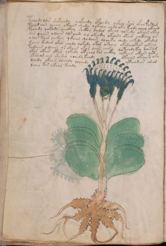

# Voynich Speculative Herbal Ferment Recipe — f50v

IMPORTANT: this is NOT a real or validated translation of the Voynich Manuscript. It is a speculative/procedural model that interprets EVA using a user-defined grammar to generate experimental recipes using safe, known edible substitutes.

This file is generated automatically from IVTFF/EVA transliteration plus a user-defined procedural grammar.



## Page / Folio
- currier: B
- folio: f50v
- page_number: 98
- plant_candidates: ['Umbellifera?']
- plant_category_confidence: 0.25
- plant_category_guess: leaf
- plant_category_matches: ['section=herbal_default']
- plant_id: Umbellifera? (O'Neill), (coxcomb?)
- section: herbal

## Plant Interpretation (Heuristic)
- category: leaf
- confidence: 0.25
- note: Heuristic classification based on the IVTFF 'Plant ID' string (not the drawing). Does not imply real identification of the manuscript plant.
- textual_evidence_terms: ['section=herbal_default']

## EVA Text (Transliteration)
```text
tchy do ldar shotchdy qokchdy opchedy qokol shor ofar fardam
tchodain oeeey okaiin shedy qokaly chdy oky keody cheey okain
pochedy qokody checkhy shckhy dalol ykeeey qokedy okain okal
dar qoain olaiin ol[s:r] aiin o l okeedy okchdy otar chckhey or
y chy tair chckhy qekaiin qodaiin olcheky chedy chkedy okedyd
daiin kedair okal chody qokedy okar okchey okedy ota[r:s] chkeey
tedaiin odaiin or okaiin ykor daiin choky qotchdy k[cy:ey] dairam
ykar okair otor qokedy ykchol kar chckhy olkaiin okain qo'd
ytsheod ain sheshy echedy kchdy otaiin okaiin [o:a]ky
dchedy okaiin olchdy oloeedy ykeeod ar aro[o:a]d
lchey kar ykchy kchdy
```

## Page Summary (Procedural, Aggregated)
- compound_counts: {'heat': 11, 'main herb': 30, 'yeast fermentation': 46, 'mix/transfer': 54, 'secondary herb': 7, 'liquid base': 11, 'sugars': 44, 'aroma modifier': 2, 'complex herbal compound': 5, 'general base': 1}
- dose_level: 3
- fermentation_estimate: 7–14 days

## Pantry (Max Needed For Any Single Line-Recipe)
- aroma_modifier: ['lemon peel (optional)']
- aroma_modifier_dose: ['2–5 g (or 1 strip of peel, avoiding the bitter pith)']
- main_plant_dry_g: 15
- main_plant_substitute: ['lemon balm']
- safe_complex_herbal_blend: ['gentle spices (e.g., 1 g cinnamon + 1 g clove) or a commercial herbal tea blend']
- secondary_herb_dry_g: 7
- secondary_herb_substitute: ['mint']
- sugar_or_honey_g: 75
- water_l: 0.5
- yeast_g: 1

## Recipes Index (This Page)
- [f50v.1,@P0](#f50v-1-f50v-1-p0)
- [f50v.2,+P0](#f50v-2-f50v-2-p0)
- [f50v.3,+P0](#f50v-3-f50v-3-p0)
- [f50v.4,+P0](#f50v-4-f50v-4-p0)
- [f50v.5,+P0](#f50v-5-f50v-5-p0)
- [f50v.6,+P0](#f50v-6-f50v-6-p0)
- [f50v.7,+P0](#f50v-7-f50v-7-p0)
- [f50v.8,+P0](#f50v-8-f50v-8-p0)
- [f50v.9,+P0](#f50v-9-f50v-9-p0)
- [f50v.10,+P0](#f50v-10-f50v-10-p0)
- [f50v.11,+P0](#f50v-11-f50v-11-p0)

## Line Recipes (Each Line = One Recipe, 0.5L batch)

<a id="f50v-1-f50v-1-p0"></a>

### f50v.1,@P0

EVA: tchy do ldar shotchdy qokchdy opchedy qokol shor ofar fardam

## Ingredients
- aroma_modifier: lemon peel (optional)
- aroma_modifier_dose: 2–5 g (or 1 strip of peel, avoiding the bitter pith)
- main_plant_dry_g: 5
- main_plant_substitute: lemon balm
- secondary_herb_dry_g: 2
- secondary_herb_substitute: mint
- sugar_or_honey_g: 25
- water_l: 0.5
- yeast_g: 1

Process:
1. Sanitize the jar/fermenter and utensils.
2. Base: combine 0.5 L water with 25 g sugar or honey.
3. Apply gentle heat: simmer 10–15 min, then cool to <30°C before adding yeast.
4. Add main plant: lemon balm (~5 g dried).
5. Add secondary herb: mint (~2 g dried).
6. Add aroma modifier (optional) in a low dose.
7. Pitch yeast: 1 g (ideally cider/beer yeast).
8. Ferment with an airlock: 2–4 days (guided by iin/aiin markers).
9. Strain/rack (if very solid-heavy) and cold-crash 24 h.
10. Bottle only when activity clearly slows; refrigerate. Avoid overpressure.

Expected Result: A mild, aromatic herbal ferment, low-to-medium intensity depending on dose level.

Does It Make Sense?: yes

Direct Gloss (Procedural, Not a Real Translation):
- tchy: apply heat/cooking → add main plant (safe substitute)
- do: mix / transfer → start fermentation (yeast)
- ldar: start fermentation (yeast) → duration level 1 → state: fermentation start
- shotchdy: apply heat/cooking → add main plant (safe substitute) → add secondary herb (safe substitute) → mix / transfer → start fermentation (yeast)
- qokchdy: prepare liquid base → add fermentable sugars → add main plant (safe substitute) → start fermentation (yeast)
- opchedy: add main plant (safe substitute) → mix / transfer → start fermentation (yeast) → duration level 1 → state: active extraction
- qokol: prepare liquid base → add fermentable sugars → mix / transfer
- shor: add secondary herb (safe substitute) → mix / transfer
- ofar: add aroma modifier → mix / transfer → duration level 1 → state: fermentation start
- fardam: add aroma modifier → start fermentation (yeast) → duration level 1 → state: fermentation start

<a id="f50v-2-f50v-2-p0"></a>

### f50v.2,+P0

EVA: tchodain oeeey okaiin shedy qokaly chdy oky keody cheey okain

## Ingredients
- main_plant_dry_g: 15
- main_plant_substitute: lemon balm
- secondary_herb_dry_g: 7
- secondary_herb_substitute: mint
- sugar_or_honey_g: 75
- water_l: 0.5
- yeast_g: 1

Process:
1. Sanitize the jar/fermenter and utensils.
2. Base: combine 0.5 L water with 75 g sugar or honey.
3. Apply gentle heat: simmer 10–15 min, then cool to <30°C before adding yeast.
4. Add main plant: lemon balm (~15 g dried).
5. Add secondary herb: mint (~7 g dried).
6. Pitch yeast: 1 g (ideally cider/beer yeast).
7. Ferment with an airlock: 7–14 days (guided by iin/aiin markers).
8. Strain/rack (if very solid-heavy) and cold-crash 24 h.
9. Bottle only when activity clearly slows; refrigerate. Avoid overpressure.

Expected Result: A mild, aromatic herbal ferment, low-to-medium intensity depending on dose level.

Does It Make Sense?: yes

Direct Gloss (Procedural, Not a Real Translation):
- tchodain: apply heat/cooking → add main plant (safe substitute) → mix / transfer → start fermentation (yeast) → duration level 1 → state: fermentation start
- oeeey: mix / transfer → duration level 3 → state: active extraction
- okaiin: add fermentable sugars → mix / transfer → duration level 1 → state: fermentation start → long fermentation / aging phase
- shedy: add secondary herb (safe substitute) → start fermentation (yeast) → duration level 1 → state: active extraction
- qokaly: prepare liquid base → add fermentable sugars → duration level 1 → state: fermentation start
- chdy: add main plant (safe substitute) → start fermentation (yeast)
- oky: add fermentable sugars → mix / transfer
- keody: add fermentable sugars → mix / transfer → start fermentation (yeast) → duration level 1 → state: active extraction
- cheey: add main plant (safe substitute) → duration level 2 → state: active extraction
- okain: add fermentable sugars → mix / transfer → duration level 1 → state: fermentation start

<a id="f50v-3-f50v-3-p0"></a>

### f50v.3,+P0

EVA: pochedy qokody checkhy shckhy dalol ykeeey qokedy okain okal

## Ingredients
- main_plant_dry_g: 15
- main_plant_substitute: lemon balm
- safe_complex_herbal_blend: gentle spices (e.g., 1 g cinnamon + 1 g clove) or a commercial herbal tea blend
- secondary_herb_dry_g: 7
- secondary_herb_substitute: mint
- sugar_or_honey_g: 75
- water_l: 0.5
- yeast_g: 1

Process:
1. Sanitize the jar/fermenter and utensils.
2. Base: combine 0.5 L water with 75 g sugar or honey.
3. Infusion: use hot (not boiling) water, then let it cool before adding yeast.
4. Add main plant: lemon balm (~15 g dried).
5. Add secondary herb: mint (~7 g dried).
6. If a complex herbal compound appears, use a safe commercial blend or gentle spices in micro-doses.
7. Pitch yeast: 1 g (ideally cider/beer yeast).
8. Ferment with an airlock: 2–4 days (guided by iin/aiin markers).
9. Strain/rack (if very solid-heavy) and cold-crash 24 h.
10. Bottle only when activity clearly slows; refrigerate. Avoid overpressure.

Expected Result: A mild, aromatic herbal ferment, low-to-medium intensity depending on dose level.

Does It Make Sense?: yes

Direct Gloss (Procedural, Not a Real Translation):
- pochedy: add main plant (safe substitute) → mix / transfer → start fermentation (yeast) → duration level 1 → state: active extraction
- qokody: prepare liquid base → add fermentable sugars → mix / transfer → start fermentation (yeast)
- checkhy: add main plant (safe substitute) → add complex herbal compound (safe blend) → duration level 1 → state: active extraction
- shckhy: add secondary herb (safe substitute) → add complex herbal compound (safe blend)
- dalol: mix / transfer → start fermentation (yeast) → duration level 1 → state: fermentation start
- ykeeey: add fermentable sugars → duration level 3 → state: active extraction
- qokedy: prepare liquid base → add fermentable sugars → start fermentation (yeast) → duration level 1 → state: active extraction
- okain: add fermentable sugars → mix / transfer → duration level 1 → state: fermentation start
- okal: add fermentable sugars → mix / transfer → duration level 1 → state: fermentation start

<a id="f50v-4-f50v-4-p0"></a>

### f50v.4,+P0

EVA: dar qoain olaiin ol[s:r] aiin o l okeedy okchdy otar chckhey or

## Ingredients
- main_plant_dry_g: 10
- main_plant_substitute: lemon balm
- safe_complex_herbal_blend: gentle spices (e.g., 1 g cinnamon + 1 g clove) or a commercial herbal tea blend
- secondary_herb_dry_g: 2
- secondary_herb_substitute: mint
- sugar_or_honey_g: 50
- water_l: 0.5
- yeast_g: 1

Process:
1. Sanitize the jar/fermenter and utensils.
2. Base: combine 0.5 L water with 50 g sugar or honey.
3. Apply gentle heat: simmer 10–15 min, then cool to <30°C before adding yeast.
4. Add main plant: lemon balm (~10 g dried).
5. Add secondary herb: mint (~2 g dried).
6. If a complex herbal compound appears, use a safe commercial blend or gentle spices in micro-doses.
7. Pitch yeast: 1 g (ideally cider/beer yeast).
8. Ferment with an airlock: 7–14 days (guided by iin/aiin markers).
9. Strain/rack (if very solid-heavy) and cold-crash 24 h.
10. Bottle only when activity clearly slows; refrigerate. Avoid overpressure.

Expected Result: A mild, aromatic herbal ferment, low-to-medium intensity depending on dose level.

Does It Make Sense?: yes

Direct Gloss (Procedural, Not a Real Translation):
- dar: start fermentation (yeast) → duration level 1 → state: fermentation start
- qoain: prepare liquid base → duration level 1 → state: fermentation start
- olaiin: mix / transfer → duration level 1 → state: fermentation start → long fermentation / aging phase
- ol: mix / transfer
- s: [unparsed]
- r: [unparsed]
- aiin: duration level 1 → state: fermentation start → long fermentation / aging phase
- o: mix / transfer
- l: [unparsed]
- okeedy: add fermentable sugars → mix / transfer → start fermentation (yeast) → duration level 2 → state: active extraction
- okchdy: add fermentable sugars → add main plant (safe substitute) → mix / transfer → start fermentation (yeast)
- otar: apply heat/cooking → mix / transfer → duration level 1 → state: fermentation start
- chckhey: add main plant (safe substitute) → add complex herbal compound (safe blend) → duration level 1 → state: active extraction
- or: mix / transfer

<a id="f50v-5-f50v-5-p0"></a>

### f50v.5,+P0

EVA: y chy tair chckhy qekaiin qodaiin olcheky chedy chkedy okedyd

## Ingredients
- main_plant_dry_g: 5
- main_plant_substitute: lemon balm
- safe_complex_herbal_blend: gentle spices (e.g., 1 g cinnamon + 1 g clove) or a commercial herbal tea blend
- secondary_herb_dry_g: 1
- secondary_herb_substitute: mint
- sugar_or_honey_g: 25
- water_l: 0.5
- yeast_g: 1

Process:
1. Sanitize the jar/fermenter and utensils.
2. Base: combine 0.5 L water with 25 g sugar or honey.
3. Apply gentle heat: simmer 10–15 min, then cool to <30°C before adding yeast.
4. Add main plant: lemon balm (~5 g dried).
5. Add secondary herb: mint (~1 g dried).
6. If a complex herbal compound appears, use a safe commercial blend or gentle spices in micro-doses.
7. Pitch yeast: 1 g (ideally cider/beer yeast).
8. Ferment with an airlock: 7–14 days (guided by iin/aiin markers).
9. Strain/rack (if very solid-heavy) and cold-crash 24 h.
10. Bottle only when activity clearly slows; refrigerate. Avoid overpressure.

Expected Result: A mild, aromatic herbal ferment, low-to-medium intensity depending on dose level.

Does It Make Sense?: yes

Direct Gloss (Procedural, Not a Real Translation):
- y: [unparsed]
- chy: add main plant (safe substitute)
- tair: apply heat/cooking → duration level 1 → state: fermentation start
- chckhy: add main plant (safe substitute) → add complex herbal compound (safe blend)
- qekaiin: prepare base (generic) → add fermentable sugars → duration level 1 → state: active extraction → long fermentation / aging phase
- qodaiin: prepare liquid base → start fermentation (yeast) → duration level 1 → state: fermentation start → long fermentation / aging phase
- olcheky: add fermentable sugars → add main plant (safe substitute) → mix / transfer → duration level 1 → state: active extraction
- chedy: add main plant (safe substitute) → start fermentation (yeast) → duration level 1 → state: active extraction
- chkedy: add fermentable sugars → add main plant (safe substitute) → start fermentation (yeast) → duration level 1 → state: active extraction
- okedyd: add fermentable sugars → mix / transfer → start fermentation (yeast) → duration level 1 → state: active extraction

<a id="f50v-6-f50v-6-p0"></a>

### f50v.6,+P0

EVA: daiin kedair okal chody qokedy okar okchey okedy ota[r:s] chkeey

## Ingredients
- main_plant_dry_g: 10
- main_plant_substitute: lemon balm
- secondary_herb_dry_g: 2
- secondary_herb_substitute: mint
- sugar_or_honey_g: 50
- water_l: 0.5
- yeast_g: 1

Process:
1. Sanitize the jar/fermenter and utensils.
2. Base: combine 0.5 L water with 50 g sugar or honey.
3. Apply gentle heat: simmer 10–15 min, then cool to <30°C before adding yeast.
4. Add main plant: lemon balm (~10 g dried).
5. Add secondary herb: mint (~2 g dried).
6. Pitch yeast: 1 g (ideally cider/beer yeast).
7. Ferment with an airlock: 7–14 days (guided by iin/aiin markers).
8. Strain/rack (if very solid-heavy) and cold-crash 24 h.
9. Bottle only when activity clearly slows; refrigerate. Avoid overpressure.

Expected Result: A mild, aromatic herbal ferment, low-to-medium intensity depending on dose level.

Does It Make Sense?: yes

Direct Gloss (Procedural, Not a Real Translation):
- daiin: start fermentation (yeast) → duration level 1 → state: fermentation start → long fermentation / aging phase
- kedair: add fermentable sugars → start fermentation (yeast) → duration level 1 → state: active extraction
- okal: add fermentable sugars → mix / transfer → duration level 1 → state: fermentation start
- chody: add main plant (safe substitute) → mix / transfer → start fermentation (yeast)
- qokedy: prepare liquid base → add fermentable sugars → start fermentation (yeast) → duration level 1 → state: active extraction
- okar: add fermentable sugars → mix / transfer → duration level 1 → state: fermentation start
- okchey: add fermentable sugars → add main plant (safe substitute) → mix / transfer → duration level 1 → state: active extraction
- okedy: add fermentable sugars → mix / transfer → start fermentation (yeast) → duration level 1 → state: active extraction
- ota: apply heat/cooking → mix / transfer → duration level 1 → state: fermentation start
- r: [unparsed]
- s: [unparsed]
- chkeey: add fermentable sugars → add main plant (safe substitute) → duration level 2 → state: active extraction

<a id="f50v-7-f50v-7-p0"></a>

### f50v.7,+P0

EVA: tedaiin odaiin or okaiin ykor daiin choky qotchdy k[cy:ey] dairam

## Ingredients
- main_plant_dry_g: 5
- main_plant_substitute: lemon balm
- secondary_herb_dry_g: 1
- secondary_herb_substitute: mint
- sugar_or_honey_g: 25
- water_l: 0.5
- yeast_g: 1

Process:
1. Sanitize the jar/fermenter and utensils.
2. Base: combine 0.5 L water with 25 g sugar or honey.
3. Apply gentle heat: simmer 10–15 min, then cool to <30°C before adding yeast.
4. Add main plant: lemon balm (~5 g dried).
5. Add secondary herb: mint (~1 g dried).
6. Pitch yeast: 1 g (ideally cider/beer yeast).
7. Ferment with an airlock: 7–14 days (guided by iin/aiin markers).
8. Strain/rack (if very solid-heavy) and cold-crash 24 h.
9. Bottle only when activity clearly slows; refrigerate. Avoid overpressure.

Expected Result: A mild, aromatic herbal ferment, low-to-medium intensity depending on dose level.

Does It Make Sense?: yes

Direct Gloss (Procedural, Not a Real Translation):
- tedaiin: apply heat/cooking → start fermentation (yeast) → duration level 1 → state: active extraction → long fermentation / aging phase
- odaiin: mix / transfer → start fermentation (yeast) → duration level 1 → state: fermentation start → long fermentation / aging phase
- or: mix / transfer
- okaiin: add fermentable sugars → mix / transfer → duration level 1 → state: fermentation start → long fermentation / aging phase
- ykor: add fermentable sugars → mix / transfer
- daiin: start fermentation (yeast) → duration level 1 → state: fermentation start → long fermentation / aging phase
- choky: add fermentable sugars → add main plant (safe substitute) → mix / transfer
- qotchdy: prepare liquid base → apply heat/cooking → add main plant (safe substitute) → start fermentation (yeast)
- k: add fermentable sugars
- cy: [unparsed]
- ey: duration level 1 → state: active extraction
- dairam: start fermentation (yeast) → duration level 1 → state: fermentation start

<a id="f50v-8-f50v-8-p0"></a>

### f50v.8,+P0

EVA: ykar okair otor qokedy ykchol kar chckhy olkaiin okain qo'd

## Ingredients
- main_plant_dry_g: 5
- main_plant_substitute: lemon balm
- safe_complex_herbal_blend: gentle spices (e.g., 1 g cinnamon + 1 g clove) or a commercial herbal tea blend
- secondary_herb_dry_g: 1
- secondary_herb_substitute: mint
- sugar_or_honey_g: 25
- water_l: 0.5
- yeast_g: 1

Process:
1. Sanitize the jar/fermenter and utensils.
2. Base: combine 0.5 L water with 25 g sugar or honey.
3. Apply gentle heat: simmer 10–15 min, then cool to <30°C before adding yeast.
4. Add main plant: lemon balm (~5 g dried).
5. Add secondary herb: mint (~1 g dried).
6. If a complex herbal compound appears, use a safe commercial blend or gentle spices in micro-doses.
7. Pitch yeast: 1 g (ideally cider/beer yeast).
8. Ferment with an airlock: 7–14 days (guided by iin/aiin markers).
9. Strain/rack (if very solid-heavy) and cold-crash 24 h.
10. Bottle only when activity clearly slows; refrigerate. Avoid overpressure.

Expected Result: A mild, aromatic herbal ferment, low-to-medium intensity depending on dose level.

Does It Make Sense?: yes

Direct Gloss (Procedural, Not a Real Translation):
- ykar: add fermentable sugars → duration level 1 → state: fermentation start
- okair: add fermentable sugars → mix / transfer → duration level 1 → state: fermentation start
- otor: apply heat/cooking → mix / transfer
- qokedy: prepare liquid base → add fermentable sugars → start fermentation (yeast) → duration level 1 → state: active extraction
- ykchol: add fermentable sugars → add main plant (safe substitute) → mix / transfer
- kar: add fermentable sugars → duration level 1 → state: fermentation start
- chckhy: add main plant (safe substitute) → add complex herbal compound (safe blend)
- olkaiin: add fermentable sugars → mix / transfer → duration level 1 → state: fermentation start → long fermentation / aging phase
- okain: add fermentable sugars → mix / transfer → duration level 1 → state: fermentation start
- qo: prepare liquid base
- d: start fermentation (yeast)

<a id="f50v-9-f50v-9-p0"></a>

### f50v.9,+P0

EVA: ytsheod ain sheshy echedy kchdy otaiin okaiin [o:a]ky

## Ingredients
- main_plant_dry_g: 5
- main_plant_substitute: lemon balm
- secondary_herb_dry_g: 2
- secondary_herb_substitute: mint
- sugar_or_honey_g: 25
- water_l: 0.5
- yeast_g: 1

Process:
1. Sanitize the jar/fermenter and utensils.
2. Base: combine 0.5 L water with 25 g sugar or honey.
3. Apply gentle heat: simmer 10–15 min, then cool to <30°C before adding yeast.
4. Add main plant: lemon balm (~5 g dried).
5. Add secondary herb: mint (~2 g dried).
6. Pitch yeast: 1 g (ideally cider/beer yeast).
7. Ferment with an airlock: 7–14 days (guided by iin/aiin markers).
8. Strain/rack (if very solid-heavy) and cold-crash 24 h.
9. Bottle only when activity clearly slows; refrigerate. Avoid overpressure.

Expected Result: A mild, aromatic herbal ferment, low-to-medium intensity depending on dose level.

Does It Make Sense?: yes

Direct Gloss (Procedural, Not a Real Translation):
- ytsheod: apply heat/cooking → add secondary herb (safe substitute) → mix / transfer → start fermentation (yeast) → duration level 1 → state: active extraction
- ain: duration level 1 → state: fermentation start
- sheshy: add secondary herb (safe substitute) → duration level 1 → state: active extraction
- echedy: add main plant (safe substitute) → start fermentation (yeast) → duration level 1 → state: active extraction
- kchdy: add fermentable sugars → add main plant (safe substitute) → start fermentation (yeast)
- otaiin: apply heat/cooking → mix / transfer → duration level 1 → state: fermentation start → long fermentation / aging phase
- okaiin: add fermentable sugars → mix / transfer → duration level 1 → state: fermentation start → long fermentation / aging phase
- o: mix / transfer
- a: duration level 1 → state: fermentation start
- ky: add fermentable sugars

<a id="f50v-10-f50v-10-p0"></a>

### f50v.10,+P0

EVA: dchedy okaiin olchdy oloeedy ykeeod ar aro[o:a]d

## Ingredients
- main_plant_dry_g: 10
- main_plant_substitute: lemon balm
- secondary_herb_dry_g: 2
- secondary_herb_substitute: mint
- sugar_or_honey_g: 50
- water_l: 0.5
- yeast_g: 1

Process:
1. Sanitize the jar/fermenter and utensils.
2. Base: combine 0.5 L water with 50 g sugar or honey.
3. Infusion: use hot (not boiling) water, then let it cool before adding yeast.
4. Add main plant: lemon balm (~10 g dried).
5. Add secondary herb: mint (~2 g dried).
6. Pitch yeast: 1 g (ideally cider/beer yeast).
7. Ferment with an airlock: 7–14 days (guided by iin/aiin markers).
8. Strain/rack (if very solid-heavy) and cold-crash 24 h.
9. Bottle only when activity clearly slows; refrigerate. Avoid overpressure.

Expected Result: A mild, aromatic herbal ferment, low-to-medium intensity depending on dose level.

Does It Make Sense?: yes

Direct Gloss (Procedural, Not a Real Translation):
- dchedy: add main plant (safe substitute) → start fermentation (yeast) → duration level 1 → state: active extraction
- okaiin: add fermentable sugars → mix / transfer → duration level 1 → state: fermentation start → long fermentation / aging phase
- olchdy: add main plant (safe substitute) → mix / transfer → start fermentation (yeast)
- oloeedy: mix / transfer → start fermentation (yeast) → duration level 2 → state: active extraction
- ykeeod: add fermentable sugars → mix / transfer → start fermentation (yeast) → duration level 2 → state: active extraction
- ar: duration level 1 → state: fermentation start
- aro: mix / transfer → duration level 1 → state: fermentation start
- o: mix / transfer
- a: duration level 1 → state: fermentation start
- d: start fermentation (yeast)

<a id="f50v-11-f50v-11-p0"></a>

### f50v.11,+P0

EVA: lchey kar ykchy kchdy

## Ingredients
- main_plant_dry_g: 5
- main_plant_substitute: lemon balm
- secondary_herb_dry_g: 1
- secondary_herb_substitute: mint
- sugar_or_honey_g: 25
- water_l: 0.5
- yeast_g: 1

Process:
1. Sanitize the jar/fermenter and utensils.
2. Base: combine 0.5 L water with 25 g sugar or honey.
3. Infusion: use hot (not boiling) water, then let it cool before adding yeast.
4. Add main plant: lemon balm (~5 g dried).
5. Add secondary herb: mint (~1 g dried).
6. Pitch yeast: 1 g (ideally cider/beer yeast).
7. Ferment with an airlock: 2–4 days (guided by iin/aiin markers).
8. Strain/rack (if very solid-heavy) and cold-crash 24 h.
9. Bottle only when activity clearly slows; refrigerate. Avoid overpressure.

Expected Result: A mild, aromatic herbal ferment, low-to-medium intensity depending on dose level.

Does It Make Sense?: yes

Direct Gloss (Procedural, Not a Real Translation):
- lchey: add main plant (safe substitute) → duration level 1 → state: active extraction
- kar: add fermentable sugars → duration level 1 → state: fermentation start
- ykchy: add fermentable sugars → add main plant (safe substitute)
- kchdy: add fermentable sugars → add main plant (safe substitute) → start fermentation (yeast)

## Risks & Warnings (Applies To All Line-Recipes)
- Never use unidentified Voynich plants directly; only use known edible substitutes.
- Do not consume if you see mold, smell rot, notice abnormal sliminess, or taste something clearly foul.
- Overpressure/bottle-bomb risk: do not bottle before stable; prefer an airlock and refrigeration.
- Avoid if pregnant/breastfeeding, for minors, or with medical conditions; consult a professional.
- No medical claims: this is an experimental beverage.

## Recommended Adjustments (General)
- If too bitter (leafy profile), halve the herbs or shorten steep/maceration time.
- If too sweet, extend fermentation or reduce sugar by 25–50%.
- For a non-alcoholic version, omit yeast and keep refrigerated as an infusion (not fermented).
