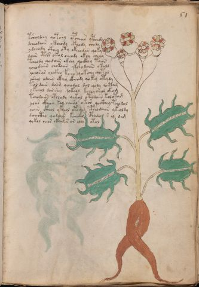

# Voynich Speculative Herbal Ferment Recipe — f51r

IMPORTANT: this is NOT a real or validated translation of the Voynich Manuscript. It is a speculative/procedural model that interprets EVA using a user-defined grammar to generate experimental recipes using safe, known edible substitutes.

This file is generated automatically from IVTFF/EVA transliteration plus a user-defined procedural grammar.



## Page / Folio
- currier: A
- folio: f51r
- page_number: 99
- section: herbal

## EVA Text (Transliteration)
```text
tsholdchy qotchy opchear ypchedy
dcheodaiin ckheody ckhody chody
ydchody ckhey oty ckhe[o:a]dar qoky
daiin ct[e:i]s okol cheody ckhy cheeey
tcheody qodaiin okeey qockhey taiin
ycho daiin chokaiin ykchodaiin ykald
ychos ar eeckhy kcho qokchy qotal
oshol odaiin [ckhe:ckhh]y ckheody qokey otydy
tol daiin daim qchodal dal qody qoetam
ykchol d[o:a]r shey qokeol kchey shol okam
tchodaiin [oph:cph]eody qokol ot[e:i]odaiin kol ota[g:m]
yoees ckheey kol cheeal okeor qockhey pchodal
oaiin ckhol yk[i:?]eol otchey cpheo daiin ykeoldy
daiiithy qodaiin kaiiidal cphodal [s:r] al dam
qokol cheor ckhal s or aldy otal
```

## Recipes Index (This Page)
- [f51r.1,@P0](#f51r-1-f51r-1-p0)
- [f51r.2,+P0](#f51r-2-f51r-2-p0)
- [f51r.3,+P0](#f51r-3-f51r-3-p0)
- [f51r.4,+P0](#f51r-4-f51r-4-p0)
- [f51r.5,+P0](#f51r-5-f51r-5-p0)
- [f51r.6,+P0](#f51r-6-f51r-6-p0)
- [f51r.7,+P0](#f51r-7-f51r-7-p0)
- [f51r.8,+P0](#f51r-8-f51r-8-p0)
- [f51r.9,+P0](#f51r-9-f51r-9-p0)
- [f51r.10,+P0](#f51r-10-f51r-10-p0)
- [f51r.11,+P0](#f51r-11-f51r-11-p0)
- [f51r.12,+P0](#f51r-12-f51r-12-p0)
- [f51r.13,+P0](#f51r-13-f51r-13-p0)
- [f51r.14,+P0](#f51r-14-f51r-14-p0)
- [f51r.15,+P0](#f51r-15-f51r-15-p0)

## Line Glosses (Procedural Gloss Only; Not a Translation)

<a id="f51r-1-f51r-1-p0"></a>

### f51r.1,@P0

EVA: tsholdchy qotchy opchear ypchedy

Direct Gloss (Procedural, Not a Real Translation):
- tsholdchy: apply heat/cooking → add main plant (safe substitute) → add secondary herb (safe substitute) → mix / transfer → start fermentation (yeast)
- qotchy: prepare liquid base → apply heat/cooking → add main plant (safe substitute)
- opchear: add main plant (safe substitute) → mix / transfer → start fermentation (yeast) → duration level 1 → state: active extraction
- ypchedy: add main plant (safe substitute) → start fermentation (yeast) → duration level 1 → state: active extraction

<a id="f51r-2-f51r-2-p0"></a>

### f51r.2,+P0

EVA: dcheodaiin ckheody ckhody chody

Direct Gloss (Procedural, Not a Real Translation):
- dcheodaiin: add main plant (safe substitute) → mix / transfer → start fermentation (yeast) → duration level 1 → state: active extraction → long fermentation / aging phase
- ckheody: mix / transfer → start fermentation (yeast) → add complex herbal compound (safe blend) → duration level 1 → state: active extraction
- ckhody: mix / transfer → start fermentation (yeast) → add complex herbal compound (safe blend)
- chody: add main plant (safe substitute) → mix / transfer → start fermentation (yeast)

<a id="f51r-3-f51r-3-p0"></a>

### f51r.3,+P0

EVA: ydchody ckhey oty ckhe[o:a]dar qoky

Direct Gloss (Procedural, Not a Real Translation):
- ydchody: add main plant (safe substitute) → mix / transfer → start fermentation (yeast)
- ckhey: add complex herbal compound (safe blend) → duration level 1 → state: active extraction
- oty: apply heat/cooking → mix / transfer
- ckhe: add complex herbal compound (safe blend) → duration level 1 → state: active extraction
- o: mix / transfer
- a: duration level 1 → state: fermentation start
- dar: start fermentation (yeast) → duration level 1 → state: fermentation start
- qoky: prepare liquid base → add fermentable sugars

<a id="f51r-4-f51r-4-p0"></a>

### f51r.4,+P0

EVA: daiin ct[e:i]s okol cheody ckhy cheeey

Direct Gloss (Procedural, Not a Real Translation):
- daiin: start fermentation (yeast) → duration level 1 → state: fermentation start → long fermentation / aging phase
- ct: apply heat/cooking
- e: duration level 1 → state: active extraction
- i: duration level 1 → state: cooling/rest
- s: [unparsed]
- okol: add fermentable sugars → mix / transfer
- cheody: add main plant (safe substitute) → mix / transfer → start fermentation (yeast) → duration level 1 → state: active extraction
- ckhy: add complex herbal compound (safe blend)
- cheeey: add main plant (safe substitute) → duration level 3 → state: active extraction

<a id="f51r-5-f51r-5-p0"></a>

### f51r.5,+P0

EVA: tcheody qodaiin okeey qockhey taiin

Direct Gloss (Procedural, Not a Real Translation):
- tcheody: apply heat/cooking → add main plant (safe substitute) → mix / transfer → start fermentation (yeast) → duration level 1 → state: active extraction
- qodaiin: prepare liquid base → start fermentation (yeast) → duration level 1 → state: fermentation start → long fermentation / aging phase
- okeey: add fermentable sugars → mix / transfer → duration level 2 → state: active extraction
- qockhey: prepare liquid base → add complex herbal compound (safe blend) → duration level 1 → state: active extraction
- taiin: apply heat/cooking → duration level 1 → state: fermentation start → long fermentation / aging phase

<a id="f51r-6-f51r-6-p0"></a>

### f51r.6,+P0

EVA: ycho daiin chokaiin ykchodaiin ykald

Direct Gloss (Procedural, Not a Real Translation):
- ycho: add main plant (safe substitute) → mix / transfer
- daiin: start fermentation (yeast) → duration level 1 → state: fermentation start → long fermentation / aging phase
- chokaiin: add fermentable sugars → add main plant (safe substitute) → mix / transfer → duration level 1 → state: fermentation start → long fermentation / aging phase
- ykchodaiin: add fermentable sugars → add main plant (safe substitute) → mix / transfer → start fermentation (yeast) → duration level 1 → state: fermentation start → long fermentation / aging phase
- ykald: add fermentable sugars → start fermentation (yeast) → duration level 1 → state: fermentation start

<a id="f51r-7-f51r-7-p0"></a>

### f51r.7,+P0

EVA: ychos ar eeckhy kcho qokchy qotal

Direct Gloss (Procedural, Not a Real Translation):
- ychos: add main plant (safe substitute) → mix / transfer
- ar: duration level 1 → state: fermentation start
- eeckhy: add complex herbal compound (safe blend) → duration level 2 → state: active extraction
- kcho: add fermentable sugars → add main plant (safe substitute) → mix / transfer
- qokchy: prepare liquid base → add fermentable sugars → add main plant (safe substitute)
- qotal: prepare liquid base → apply heat/cooking → duration level 1 → state: fermentation start

<a id="f51r-8-f51r-8-p0"></a>

### f51r.8,+P0

EVA: oshol odaiin [ckhe:ckhh]y ckheody qokey otydy

Direct Gloss (Procedural, Not a Real Translation):
- oshol: add secondary herb (safe substitute) → mix / transfer
- odaiin: mix / transfer → start fermentation (yeast) → duration level 1 → state: fermentation start → long fermentation / aging phase
- ckhe: add complex herbal compound (safe blend) → duration level 1 → state: active extraction
- ckhh: add complex herbal compound (safe blend)
- y: [unparsed]
- ckheody: mix / transfer → start fermentation (yeast) → add complex herbal compound (safe blend) → duration level 1 → state: active extraction
- qokey: prepare liquid base → add fermentable sugars → duration level 1 → state: active extraction
- otydy: apply heat/cooking → mix / transfer → start fermentation (yeast)

<a id="f51r-9-f51r-9-p0"></a>

### f51r.9,+P0

EVA: tol daiin daim qchodal dal qody qoetam

Direct Gloss (Procedural, Not a Real Translation):
- tol: apply heat/cooking → mix / transfer
- daiin: start fermentation (yeast) → duration level 1 → state: fermentation start → long fermentation / aging phase
- daim: start fermentation (yeast) → duration level 1 → state: fermentation start
- qchodal: prepare base (generic) → add main plant (safe substitute) → mix / transfer → start fermentation (yeast) → duration level 1 → state: fermentation start
- dal: start fermentation (yeast) → duration level 1 → state: fermentation start
- qody: prepare liquid base → start fermentation (yeast)
- qoetam: prepare liquid base → apply heat/cooking → duration level 1 → state: active extraction

<a id="f51r-10-f51r-10-p0"></a>

### f51r.10,+P0

EVA: ykchol d[o:a]r shey qokeol kchey shol okam

Direct Gloss (Procedural, Not a Real Translation):
- ykchol: add fermentable sugars → add main plant (safe substitute) → mix / transfer
- d: start fermentation (yeast)
- o: mix / transfer
- a: duration level 1 → state: fermentation start
- r: [unparsed]
- shey: add secondary herb (safe substitute) → duration level 1 → state: active extraction
- qokeol: prepare liquid base → add fermentable sugars → mix / transfer → duration level 1 → state: active extraction
- kchey: add fermentable sugars → add main plant (safe substitute) → duration level 1 → state: active extraction
- shol: add secondary herb (safe substitute) → mix / transfer
- okam: add fermentable sugars → mix / transfer → duration level 1 → state: fermentation start

<a id="f51r-11-f51r-11-p0"></a>

### f51r.11,+P0

EVA: tchodaiin [oph:cph]eody qokol ot[e:i]odaiin kol ota[g:m]

Direct Gloss (Procedural, Not a Real Translation):
- tchodaiin: apply heat/cooking → add main plant (safe substitute) → mix / transfer → start fermentation (yeast) → duration level 1 → state: fermentation start → long fermentation / aging phase
- oph: mix / transfer → start fermentation (yeast)
- cph: add complex herbal compound (safe blend)
- eody: mix / transfer → start fermentation (yeast) → duration level 1 → state: active extraction
- qokol: prepare liquid base → add fermentable sugars → mix / transfer
- ot: apply heat/cooking → mix / transfer
- e: duration level 1 → state: active extraction
- i: duration level 1 → state: cooling/rest
- odaiin: mix / transfer → start fermentation (yeast) → duration level 1 → state: fermentation start → long fermentation / aging phase
- kol: add fermentable sugars → mix / transfer
- ota: apply heat/cooking → mix / transfer → duration level 1 → state: fermentation start
- g: [unparsed]
- m: [unparsed]

<a id="f51r-12-f51r-12-p0"></a>

### f51r.12,+P0

EVA: yoees ckheey kol cheeal okeor qockhey pchodal

Direct Gloss (Procedural, Not a Real Translation):
- yoees: mix / transfer → duration level 2 → state: active extraction
- ckheey: add complex herbal compound (safe blend) → duration level 2 → state: active extraction
- kol: add fermentable sugars → mix / transfer
- cheeal: add main plant (safe substitute) → duration level 2 → state: active extraction
- okeor: add fermentable sugars → mix / transfer → duration level 1 → state: active extraction
- qockhey: prepare liquid base → add complex herbal compound (safe blend) → duration level 1 → state: active extraction
- pchodal: add main plant (safe substitute) → mix / transfer → start fermentation (yeast) → duration level 1 → state: fermentation start

<a id="f51r-13-f51r-13-p0"></a>

### f51r.13,+P0

EVA: oaiin ckhol yk[i:?]eol otchey cpheo daiin ykeoldy

Direct Gloss (Procedural, Not a Real Translation):
- oaiin: mix / transfer → duration level 1 → state: fermentation start → long fermentation / aging phase
- ckhol: mix / transfer → add complex herbal compound (safe blend)
- yk: add fermentable sugars
- i: duration level 1 → state: cooling/rest
- eol: mix / transfer → duration level 1 → state: active extraction
- otchey: apply heat/cooking → add main plant (safe substitute) → mix / transfer → duration level 1 → state: active extraction
- cpheo: mix / transfer → add complex herbal compound (safe blend) → duration level 1 → state: active extraction
- daiin: start fermentation (yeast) → duration level 1 → state: fermentation start → long fermentation / aging phase
- ykeoldy: add fermentable sugars → mix / transfer → start fermentation (yeast) → duration level 1 → state: active extraction

<a id="f51r-14-f51r-14-p0"></a>

### f51r.14,+P0

EVA: daiiithy qodaiin kaiiidal cphodal [s:r] al dam

Direct Gloss (Procedural, Not a Real Translation):
- daiiithy: apply heat/cooking → start fermentation (yeast) → duration level 1 → state: fermentation start
- qodaiin: prepare liquid base → start fermentation (yeast) → duration level 1 → state: fermentation start → long fermentation / aging phase
- kaiiidal: add fermentable sugars → start fermentation (yeast) → duration level 1 → state: fermentation start
- cphodal: mix / transfer → start fermentation (yeast) → add complex herbal compound (safe blend) → duration level 1 → state: fermentation start
- s: [unparsed]
- r: [unparsed]
- al: duration level 1 → state: fermentation start
- dam: start fermentation (yeast) → duration level 1 → state: fermentation start

<a id="f51r-15-f51r-15-p0"></a>

### f51r.15,+P0

EVA: qokol cheor ckhal s or aldy otal

Direct Gloss (Procedural, Not a Real Translation):
- qokol: prepare liquid base → add fermentable sugars → mix / transfer
- cheor: add main plant (safe substitute) → mix / transfer → duration level 1 → state: active extraction
- ckhal: add complex herbal compound (safe blend) → duration level 1 → state: fermentation start
- s: [unparsed]
- or: mix / transfer
- aldy: start fermentation (yeast) → duration level 1 → state: fermentation start
- otal: apply heat/cooking → mix / transfer → duration level 1 → state: fermentation start
