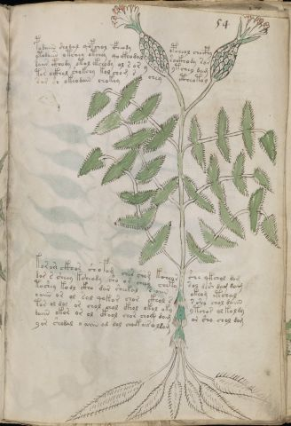

# Voynich Speculative Herbal Ferment Recipe — f54r

IMPORTANT: this is NOT a real or validated translation of the Voynich Manuscript. It is a speculative/procedural model that interprets EVA using a user-defined grammar to generate experimental recipes using safe, known edible substitutes.

This file is generated automatically from IVTFF/EVA transliteration plus a user-defined procedural grammar.



## Page / Folio
- currier: A
- folio: f54r
- page_number: 105
- plant_candidates: ['Thistle', 'leaves of boneset']
- plant_category_confidence: 0.25
- plant_category_guess: leaf
- plant_category_matches: ['section=herbal_default']
- plant_id: Thistle, leaves of boneset
- section: herbal

## Plant Interpretation (Heuristic)
- category: leaf
- confidence: 0.25
- note: Heuristic classification based on the IVTFF 'Plant ID' string (not the drawing). Does not imply real identification of the manuscript plant.
- textual_evidence_terms: ['section=herbal_default']

## EVA Text (Transliteration)
```text
podaiin shodal qopchol cfhe[o:a]dy opcheol chocphy
ytodaiin otchey otchey qockhodal sockhody sar
daiir cthody ot[a:o]l [e:o]kchody ol s or y ytchey dam
tor ockhol shokchy kol chom [s:r] chey ctheot[o:a]l
sar sh okeodain chokey
korar[e:i] ckhos shofom cher chom kcheor she qkchol dam
dor s sheey ksheody sho or cheey chety sol de[sh:?] dam dam
t[o:a]shey kodl ckho dar sheekal s aiin okeam etchal
oaiin or ol sal qokor chor ckhol s s sho chol daiin
tor ol dol or chol chol ckhol okol oky ytchor ol koldy
daiin okor or ol ckhol chor cho@165; dam or sho chol dom
yor shodal o aiin al dol choek air o ldam
```

## Page Summary (Procedural, Aggregated)
- compound_counts: {'yeast fermentation': 31, 'mix/transfer': 85, 'secondary herb': 14, 'liquid base': 3, 'main herb': 27, 'complex herbal compound': 12, 'heat': 12, 'sugars': 18, 'aroma modifier': 1, 'general base': 1}
- dose_level: 2
- fermentation_estimate: 7–14 days

## Pantry (Max Needed For Any Single Line-Recipe)
- aroma_modifier: ['lemon peel (optional)']
- aroma_modifier_dose: ['2–5 g (or 1 strip of peel, avoiding the bitter pith)']
- main_plant_dry_g: 10
- main_plant_substitute: ['lemon balm']
- safe_complex_herbal_blend: ['gentle spices (e.g., 1 g cinnamon + 1 g clove) or a commercial herbal tea blend']
- secondary_herb_dry_g: 5
- secondary_herb_substitute: ['mint']
- sugar_or_honey_g: 50
- water_l: 0.5
- yeast_g: 1

## Recipes Index (This Page)
- [f54r.1,@P0](#f54r-1-f54r-1-p0)
- [f54r.2,+P0](#f54r-2-f54r-2-p0)
- [f54r.3,+P0](#f54r-3-f54r-3-p0)
- [f54r.4,+P0](#f54r-4-f54r-4-p0)
- [f54r.5,+P0](#f54r-5-f54r-5-p0)
- [f54r.6,+P0](#f54r-6-f54r-6-p0)
- [f54r.7,+P0](#f54r-7-f54r-7-p0)
- [f54r.8,+P0](#f54r-8-f54r-8-p0)
- [f54r.9,+P0](#f54r-9-f54r-9-p0)
- [f54r.10,+P0](#f54r-10-f54r-10-p0)
- [f54r.11,+P0](#f54r-11-f54r-11-p0)
- [f54r.12,+P0](#f54r-12-f54r-12-p0)

## Line Recipes (Each Line = One Recipe, 0.5L batch)

<a id="f54r-1-f54r-1-p0"></a>

### f54r.1,@P0

EVA: podaiin shodal qopchol cfhe[o:a]dy opcheol chocphy

## Ingredients
- main_plant_dry_g: 5
- main_plant_substitute: lemon balm
- safe_complex_herbal_blend: gentle spices (e.g., 1 g cinnamon + 1 g clove) or a commercial herbal tea blend
- secondary_herb_dry_g: 2
- secondary_herb_substitute: mint
- sugar_or_honey_g: 12
- water_l: 0.5
- yeast_g: 1

Process:
1. Sanitize the jar/fermenter and utensils.
2. Base: combine 0.5 L water with 12 g sugar or honey.
3. Infusion: use hot (not boiling) water, then let it cool before adding yeast.
4. Add main plant: lemon balm (~5 g dried).
5. Add secondary herb: mint (~2 g dried).
6. If a complex herbal compound appears, use a safe commercial blend or gentle spices in micro-doses.
7. Pitch yeast: 1 g (ideally cider/beer yeast).
8. Ferment with an airlock: 7–14 days (guided by iin/aiin markers).
9. Strain/rack (if very solid-heavy) and cold-crash 24 h.
10. Bottle only when activity clearly slows; refrigerate. Avoid overpressure.

Expected Result: A mild, aromatic herbal ferment, low-to-medium intensity depending on dose level.

Does It Make Sense?: yes

Direct Gloss (Procedural, Not a Real Translation):
- podaiin: mix / transfer → start fermentation (yeast) → duration level 1 → state: fermentation start → long fermentation / aging phase
- shodal: add secondary herb (safe substitute) → mix / transfer → start fermentation (yeast) → duration level 1 → state: fermentation start
- qopchol: prepare liquid base → add main plant (safe substitute) → mix / transfer → start fermentation (yeast)
- cfhe: add complex herbal compound (safe blend) → duration level 1 → state: active extraction
- o: mix / transfer
- a: duration level 1 → state: fermentation start
- dy: start fermentation (yeast)
- opcheol: add main plant (safe substitute) → mix / transfer → start fermentation (yeast) → duration level 1 → state: active extraction
- chocphy: add main plant (safe substitute) → mix / transfer → add complex herbal compound (safe blend)

<a id="f54r-2-f54r-2-p0"></a>

### f54r.2,+P0

EVA: ytodaiin otchey otchey qockhodal sockhody sar

## Ingredients
- main_plant_dry_g: 5
- main_plant_substitute: lemon balm
- safe_complex_herbal_blend: gentle spices (e.g., 1 g cinnamon + 1 g clove) or a commercial herbal tea blend
- secondary_herb_dry_g: 1
- secondary_herb_substitute: mint
- sugar_or_honey_g: 12
- water_l: 0.5
- yeast_g: 1

Process:
1. Sanitize the jar/fermenter and utensils.
2. Base: combine 0.5 L water with 12 g sugar or honey.
3. Apply gentle heat: simmer 10–15 min, then cool to <30°C before adding yeast.
4. Add main plant: lemon balm (~5 g dried).
5. Add secondary herb: mint (~1 g dried).
6. If a complex herbal compound appears, use a safe commercial blend or gentle spices in micro-doses.
7. Pitch yeast: 1 g (ideally cider/beer yeast).
8. Ferment with an airlock: 7–14 days (guided by iin/aiin markers).
9. Strain/rack (if very solid-heavy) and cold-crash 24 h.
10. Bottle only when activity clearly slows; refrigerate. Avoid overpressure.

Expected Result: A mild, aromatic herbal ferment, low-to-medium intensity depending on dose level.

Does It Make Sense?: yes

Direct Gloss (Procedural, Not a Real Translation):
- ytodaiin: apply heat/cooking → mix / transfer → start fermentation (yeast) → duration level 1 → state: fermentation start → long fermentation / aging phase
- otchey: apply heat/cooking → add main plant (safe substitute) → mix / transfer → duration level 1 → state: active extraction
- otchey: apply heat/cooking → add main plant (safe substitute) → mix / transfer → duration level 1 → state: active extraction
- qockhodal: prepare liquid base → mix / transfer → start fermentation (yeast) → add complex herbal compound (safe blend) → duration level 1 → state: fermentation start
- sockhody: mix / transfer → start fermentation (yeast) → add complex herbal compound (safe blend)
- sar: duration level 1 → state: fermentation start

<a id="f54r-3-f54r-3-p0"></a>

### f54r.3,+P0

EVA: daiir cthody ot[a:o]l [e:o]kchody ol s or y ytchey dam

## Ingredients
- main_plant_dry_g: 5
- main_plant_substitute: lemon balm
- safe_complex_herbal_blend: gentle spices (e.g., 1 g cinnamon + 1 g clove) or a commercial herbal tea blend
- secondary_herb_dry_g: 1
- secondary_herb_substitute: mint
- sugar_or_honey_g: 25
- water_l: 0.5
- yeast_g: 1

Process:
1. Sanitize the jar/fermenter and utensils.
2. Base: combine 0.5 L water with 25 g sugar or honey.
3. Apply gentle heat: simmer 10–15 min, then cool to <30°C before adding yeast.
4. Add main plant: lemon balm (~5 g dried).
5. Add secondary herb: mint (~1 g dried).
6. If a complex herbal compound appears, use a safe commercial blend or gentle spices in micro-doses.
7. Pitch yeast: 1 g (ideally cider/beer yeast).
8. Ferment with an airlock: 2–4 days (guided by iin/aiin markers).
9. Strain/rack (if very solid-heavy) and cold-crash 24 h.
10. Bottle only when activity clearly slows; refrigerate. Avoid overpressure.

Expected Result: A mild, aromatic herbal ferment, low-to-medium intensity depending on dose level.

Does It Make Sense?: yes

Direct Gloss (Procedural, Not a Real Translation):
- daiir: start fermentation (yeast) → duration level 1 → state: fermentation start
- cthody: mix / transfer → start fermentation (yeast) → add complex herbal compound (safe blend)
- ot: apply heat/cooking → mix / transfer
- a: duration level 1 → state: fermentation start
- o: mix / transfer
- l: [unparsed]
- e: duration level 1 → state: active extraction
- o: mix / transfer
- kchody: add fermentable sugars → add main plant (safe substitute) → mix / transfer → start fermentation (yeast)
- ol: mix / transfer
- s: [unparsed]
- or: mix / transfer
- y: [unparsed]
- ytchey: apply heat/cooking → add main plant (safe substitute) → duration level 1 → state: active extraction
- dam: start fermentation (yeast) → duration level 1 → state: fermentation start

<a id="f54r-4-f54r-4-p0"></a>

### f54r.4,+P0

EVA: tor ockhol shokchy kol chom [s:r] chey ctheot[o:a]l

## Ingredients
- main_plant_dry_g: 5
- main_plant_substitute: lemon balm
- safe_complex_herbal_blend: gentle spices (e.g., 1 g cinnamon + 1 g clove) or a commercial herbal tea blend
- secondary_herb_dry_g: 2
- secondary_herb_substitute: mint
- sugar_or_honey_g: 25
- water_l: 0.5
- yeast_g: 1

Process:
1. Sanitize the jar/fermenter and utensils.
2. Base: combine 0.5 L water with 25 g sugar or honey.
3. Apply gentle heat: simmer 10–15 min, then cool to <30°C before adding yeast.
4. Add main plant: lemon balm (~5 g dried).
5. Add secondary herb: mint (~2 g dried).
6. If a complex herbal compound appears, use a safe commercial blend or gentle spices in micro-doses.
7. Pitch yeast: 1 g (ideally cider/beer yeast).
8. Ferment with an airlock: 2–4 days (guided by iin/aiin markers).
9. Strain/rack (if very solid-heavy) and cold-crash 24 h.
10. Bottle only when activity clearly slows; refrigerate. Avoid overpressure.

Expected Result: A mild, aromatic herbal ferment, low-to-medium intensity depending on dose level.

Does It Make Sense?: yes

Direct Gloss (Procedural, Not a Real Translation):
- tor: apply heat/cooking → mix / transfer
- ockhol: mix / transfer → add complex herbal compound (safe blend)
- shokchy: add fermentable sugars → add main plant (safe substitute) → add secondary herb (safe substitute) → mix / transfer
- kol: add fermentable sugars → mix / transfer
- chom: add main plant (safe substitute) → mix / transfer
- s: [unparsed]
- r: [unparsed]
- chey: add main plant (safe substitute) → duration level 1 → state: active extraction
- ctheot: apply heat/cooking → mix / transfer → add complex herbal compound (safe blend) → duration level 1 → state: active extraction
- o: mix / transfer
- a: duration level 1 → state: fermentation start
- l: [unparsed]

<a id="f54r-5-f54r-5-p0"></a>

### f54r.5,+P0

EVA: sar sh okeodain chokey

## Ingredients
- main_plant_dry_g: 5
- main_plant_substitute: lemon balm
- secondary_herb_dry_g: 2
- secondary_herb_substitute: mint
- sugar_or_honey_g: 25
- water_l: 0.5
- yeast_g: 1

Process:
1. Sanitize the jar/fermenter and utensils.
2. Base: combine 0.5 L water with 25 g sugar or honey.
3. Infusion: use hot (not boiling) water, then let it cool before adding yeast.
4. Add main plant: lemon balm (~5 g dried).
5. Add secondary herb: mint (~2 g dried).
6. Pitch yeast: 1 g (ideally cider/beer yeast).
7. Ferment with an airlock: 2–4 days (guided by iin/aiin markers).
8. Strain/rack (if very solid-heavy) and cold-crash 24 h.
9. Bottle only when activity clearly slows; refrigerate. Avoid overpressure.

Expected Result: A mild, aromatic herbal ferment, low-to-medium intensity depending on dose level.

Does It Make Sense?: yes

Direct Gloss (Procedural, Not a Real Translation):
- sar: duration level 1 → state: fermentation start
- sh: add secondary herb (safe substitute)
- okeodain: add fermentable sugars → mix / transfer → start fermentation (yeast) → duration level 1 → state: active extraction
- chokey: add fermentable sugars → add main plant (safe substitute) → mix / transfer → duration level 1 → state: active extraction

<a id="f54r-6-f54r-6-p0"></a>

### f54r.6,+P0

EVA: korar[e:i] ckhos shofom cher chom kcheor she qkchol dam

## Ingredients
- aroma_modifier: lemon peel (optional)
- aroma_modifier_dose: 2–5 g (or 1 strip of peel, avoiding the bitter pith)
- main_plant_dry_g: 5
- main_plant_substitute: lemon balm
- safe_complex_herbal_blend: gentle spices (e.g., 1 g cinnamon + 1 g clove) or a commercial herbal tea blend
- secondary_herb_dry_g: 2
- secondary_herb_substitute: mint
- sugar_or_honey_g: 25
- water_l: 0.5
- yeast_g: 1

Process:
1. Sanitize the jar/fermenter and utensils.
2. Base: combine 0.5 L water with 25 g sugar or honey.
3. Infusion: use hot (not boiling) water, then let it cool before adding yeast.
4. Add main plant: lemon balm (~5 g dried).
5. Add secondary herb: mint (~2 g dried).
6. Add aroma modifier (optional) in a low dose.
7. If a complex herbal compound appears, use a safe commercial blend or gentle spices in micro-doses.
8. Pitch yeast: 1 g (ideally cider/beer yeast).
9. Ferment with an airlock: 2–4 days (guided by iin/aiin markers).
10. Strain/rack (if very solid-heavy) and cold-crash 24 h.
11. Bottle only when activity clearly slows; refrigerate. Avoid overpressure.

Expected Result: A mild, aromatic herbal ferment, low-to-medium intensity depending on dose level.

Does It Make Sense?: yes

Direct Gloss (Procedural, Not a Real Translation):
- korar: add fermentable sugars → mix / transfer → duration level 1 → state: fermentation start
- e: duration level 1 → state: active extraction
- i: duration level 1 → state: cooling/rest
- ckhos: mix / transfer → add complex herbal compound (safe blend)
- shofom: add secondary herb (safe substitute) → add aroma modifier → mix / transfer
- cher: add main plant (safe substitute) → duration level 1 → state: active extraction
- chom: add main plant (safe substitute) → mix / transfer
- kcheor: add fermentable sugars → add main plant (safe substitute) → mix / transfer → duration level 1 → state: active extraction
- she: add secondary herb (safe substitute) → duration level 1 → state: active extraction
- qkchol: prepare base (generic) → add fermentable sugars → add main plant (safe substitute) → mix / transfer
- dam: start fermentation (yeast) → duration level 1 → state: fermentation start

<a id="f54r-7-f54r-7-p0"></a>

### f54r.7,+P0

EVA: dor s sheey ksheody sho or cheey chety sol de[sh:?] dam dam

## Ingredients
- main_plant_dry_g: 10
- main_plant_substitute: lemon balm
- secondary_herb_dry_g: 5
- secondary_herb_substitute: mint
- sugar_or_honey_g: 50
- water_l: 0.5
- yeast_g: 1

Process:
1. Sanitize the jar/fermenter and utensils.
2. Base: combine 0.5 L water with 50 g sugar or honey.
3. Apply gentle heat: simmer 10–15 min, then cool to <30°C before adding yeast.
4. Add main plant: lemon balm (~10 g dried).
5. Add secondary herb: mint (~5 g dried).
6. Pitch yeast: 1 g (ideally cider/beer yeast).
7. Ferment with an airlock: 2–4 days (guided by iin/aiin markers).
8. Strain/rack (if very solid-heavy) and cold-crash 24 h.
9. Bottle only when activity clearly slows; refrigerate. Avoid overpressure.

Expected Result: A mild, aromatic herbal ferment, low-to-medium intensity depending on dose level.

Does It Make Sense?: yes

Direct Gloss (Procedural, Not a Real Translation):
- dor: mix / transfer → start fermentation (yeast)
- s: [unparsed]
- sheey: add secondary herb (safe substitute) → duration level 2 → state: active extraction
- ksheody: add fermentable sugars → add secondary herb (safe substitute) → mix / transfer → start fermentation (yeast) → duration level 1 → state: active extraction
- sho: add secondary herb (safe substitute) → mix / transfer
- or: mix / transfer
- cheey: add main plant (safe substitute) → duration level 2 → state: active extraction
- chety: apply heat/cooking → add main plant (safe substitute) → duration level 1 → state: active extraction
- sol: mix / transfer
- de: start fermentation (yeast) → duration level 1 → state: active extraction
- sh: add secondary herb (safe substitute)
- dam: start fermentation (yeast) → duration level 1 → state: fermentation start
- dam: start fermentation (yeast) → duration level 1 → state: fermentation start

<a id="f54r-8-f54r-8-p0"></a>

### f54r.8,+P0

EVA: t[o:a]shey kodl ckho dar sheekal s aiin okeam etchal

## Ingredients
- main_plant_dry_g: 10
- main_plant_substitute: lemon balm
- safe_complex_herbal_blend: gentle spices (e.g., 1 g cinnamon + 1 g clove) or a commercial herbal tea blend
- secondary_herb_dry_g: 5
- secondary_herb_substitute: mint
- sugar_or_honey_g: 50
- water_l: 0.5
- yeast_g: 1

Process:
1. Sanitize the jar/fermenter and utensils.
2. Base: combine 0.5 L water with 50 g sugar or honey.
3. Apply gentle heat: simmer 10–15 min, then cool to <30°C before adding yeast.
4. Add main plant: lemon balm (~10 g dried).
5. Add secondary herb: mint (~5 g dried).
6. If a complex herbal compound appears, use a safe commercial blend or gentle spices in micro-doses.
7. Pitch yeast: 1 g (ideally cider/beer yeast).
8. Ferment with an airlock: 7–14 days (guided by iin/aiin markers).
9. Strain/rack (if very solid-heavy) and cold-crash 24 h.
10. Bottle only when activity clearly slows; refrigerate. Avoid overpressure.

Expected Result: A mild, aromatic herbal ferment, low-to-medium intensity depending on dose level.

Does It Make Sense?: yes

Direct Gloss (Procedural, Not a Real Translation):
- t: apply heat/cooking
- o: mix / transfer
- a: duration level 1 → state: fermentation start
- shey: add secondary herb (safe substitute) → duration level 1 → state: active extraction
- kodl: add fermentable sugars → mix / transfer → start fermentation (yeast)
- ckho: mix / transfer → add complex herbal compound (safe blend)
- dar: start fermentation (yeast) → duration level 1 → state: fermentation start
- sheekal: add fermentable sugars → add secondary herb (safe substitute) → duration level 2 → state: active extraction
- s: [unparsed]
- aiin: duration level 1 → state: fermentation start → long fermentation / aging phase
- okeam: add fermentable sugars → mix / transfer → duration level 1 → state: active extraction
- etchal: apply heat/cooking → add main plant (safe substitute) → duration level 1 → state: active extraction

<a id="f54r-9-f54r-9-p0"></a>

### f54r.9,+P0

EVA: oaiin or ol sal qokor chor ckhol s s sho chol daiin

## Ingredients
- main_plant_dry_g: 5
- main_plant_substitute: lemon balm
- safe_complex_herbal_blend: gentle spices (e.g., 1 g cinnamon + 1 g clove) or a commercial herbal tea blend
- secondary_herb_dry_g: 2
- secondary_herb_substitute: mint
- sugar_or_honey_g: 25
- water_l: 0.5
- yeast_g: 1

Process:
1. Sanitize the jar/fermenter and utensils.
2. Base: combine 0.5 L water with 25 g sugar or honey.
3. Infusion: use hot (not boiling) water, then let it cool before adding yeast.
4. Add main plant: lemon balm (~5 g dried).
5. Add secondary herb: mint (~2 g dried).
6. If a complex herbal compound appears, use a safe commercial blend or gentle spices in micro-doses.
7. Pitch yeast: 1 g (ideally cider/beer yeast).
8. Ferment with an airlock: 7–14 days (guided by iin/aiin markers).
9. Strain/rack (if very solid-heavy) and cold-crash 24 h.
10. Bottle only when activity clearly slows; refrigerate. Avoid overpressure.

Expected Result: A mild, aromatic herbal ferment, low-to-medium intensity depending on dose level.

Does It Make Sense?: yes

Direct Gloss (Procedural, Not a Real Translation):
- oaiin: mix / transfer → duration level 1 → state: fermentation start → long fermentation / aging phase
- or: mix / transfer
- ol: mix / transfer
- sal: duration level 1 → state: fermentation start
- qokor: prepare liquid base → add fermentable sugars → mix / transfer
- chor: add main plant (safe substitute) → mix / transfer
- ckhol: mix / transfer → add complex herbal compound (safe blend)
- s: [unparsed]
- s: [unparsed]
- sho: add secondary herb (safe substitute) → mix / transfer
- chol: add main plant (safe substitute) → mix / transfer
- daiin: start fermentation (yeast) → duration level 1 → state: fermentation start → long fermentation / aging phase

<a id="f54r-10-f54r-10-p0"></a>

### f54r.10,+P0

EVA: tor ol dol or chol chol ckhol okol oky ytchor ol koldy

## Ingredients
- main_plant_dry_g: 5
- main_plant_substitute: lemon balm
- safe_complex_herbal_blend: gentle spices (e.g., 1 g cinnamon + 1 g clove) or a commercial herbal tea blend
- secondary_herb_dry_g: 1
- secondary_herb_substitute: mint
- sugar_or_honey_g: 25
- water_l: 0.5
- yeast_g: 1

Process:
1. Sanitize the jar/fermenter and utensils.
2. Base: combine 0.5 L water with 25 g sugar or honey.
3. Apply gentle heat: simmer 10–15 min, then cool to <30°C before adding yeast.
4. Add main plant: lemon balm (~5 g dried).
5. Add secondary herb: mint (~1 g dried).
6. If a complex herbal compound appears, use a safe commercial blend or gentle spices in micro-doses.
7. Pitch yeast: 1 g (ideally cider/beer yeast).
8. Ferment with an airlock: 2–4 days (guided by iin/aiin markers).
9. Strain/rack (if very solid-heavy) and cold-crash 24 h.
10. Bottle only when activity clearly slows; refrigerate. Avoid overpressure.

Expected Result: A mild, aromatic herbal ferment, low-to-medium intensity depending on dose level.

Does It Make Sense?: yes

Direct Gloss (Procedural, Not a Real Translation):
- tor: apply heat/cooking → mix / transfer
- ol: mix / transfer
- dol: mix / transfer → start fermentation (yeast)
- or: mix / transfer
- chol: add main plant (safe substitute) → mix / transfer
- chol: add main plant (safe substitute) → mix / transfer
- ckhol: mix / transfer → add complex herbal compound (safe blend)
- okol: add fermentable sugars → mix / transfer
- oky: add fermentable sugars → mix / transfer
- ytchor: apply heat/cooking → add main plant (safe substitute) → mix / transfer
- ol: mix / transfer
- koldy: add fermentable sugars → mix / transfer → start fermentation (yeast)

<a id="f54r-11-f54r-11-p0"></a>

### f54r.11,+P0

EVA: daiin okor or ol ckhol chor cho@165; dam or sho chol dom

## Ingredients
- main_plant_dry_g: 5
- main_plant_substitute: lemon balm
- safe_complex_herbal_blend: gentle spices (e.g., 1 g cinnamon + 1 g clove) or a commercial herbal tea blend
- secondary_herb_dry_g: 2
- secondary_herb_substitute: mint
- sugar_or_honey_g: 25
- water_l: 0.5
- yeast_g: 1

Process:
1. Sanitize the jar/fermenter and utensils.
2. Base: combine 0.5 L water with 25 g sugar or honey.
3. Infusion: use hot (not boiling) water, then let it cool before adding yeast.
4. Add main plant: lemon balm (~5 g dried).
5. Add secondary herb: mint (~2 g dried).
6. If a complex herbal compound appears, use a safe commercial blend or gentle spices in micro-doses.
7. Pitch yeast: 1 g (ideally cider/beer yeast).
8. Ferment with an airlock: 7–14 days (guided by iin/aiin markers).
9. Strain/rack (if very solid-heavy) and cold-crash 24 h.
10. Bottle only when activity clearly slows; refrigerate. Avoid overpressure.

Expected Result: A mild, aromatic herbal ferment, low-to-medium intensity depending on dose level.

Does It Make Sense?: yes

Direct Gloss (Procedural, Not a Real Translation):
- daiin: start fermentation (yeast) → duration level 1 → state: fermentation start → long fermentation / aging phase
- okor: add fermentable sugars → mix / transfer
- or: mix / transfer
- ol: mix / transfer
- ckhol: mix / transfer → add complex herbal compound (safe blend)
- chor: add main plant (safe substitute) → mix / transfer
- cho: add main plant (safe substitute) → mix / transfer
- dam: start fermentation (yeast) → duration level 1 → state: fermentation start
- or: mix / transfer
- sho: add secondary herb (safe substitute) → mix / transfer
- chol: add main plant (safe substitute) → mix / transfer
- dom: mix / transfer → start fermentation (yeast)

<a id="f54r-12-f54r-12-p0"></a>

### f54r.12,+P0

EVA: yor shodal o aiin al dol choek air o ldam

## Ingredients
- main_plant_dry_g: 5
- main_plant_substitute: lemon balm
- secondary_herb_dry_g: 2
- secondary_herb_substitute: mint
- sugar_or_honey_g: 25
- water_l: 0.5
- yeast_g: 1

Process:
1. Sanitize the jar/fermenter and utensils.
2. Base: combine 0.5 L water with 25 g sugar or honey.
3. Infusion: use hot (not boiling) water, then let it cool before adding yeast.
4. Add main plant: lemon balm (~5 g dried).
5. Add secondary herb: mint (~2 g dried).
6. Pitch yeast: 1 g (ideally cider/beer yeast).
7. Ferment with an airlock: 7–14 days (guided by iin/aiin markers).
8. Strain/rack (if very solid-heavy) and cold-crash 24 h.
9. Bottle only when activity clearly slows; refrigerate. Avoid overpressure.

Expected Result: A mild, aromatic herbal ferment, low-to-medium intensity depending on dose level.

Does It Make Sense?: yes

Direct Gloss (Procedural, Not a Real Translation):
- yor: mix / transfer
- shodal: add secondary herb (safe substitute) → mix / transfer → start fermentation (yeast) → duration level 1 → state: fermentation start
- o: mix / transfer
- aiin: duration level 1 → state: fermentation start → long fermentation / aging phase
- al: duration level 1 → state: fermentation start
- dol: mix / transfer → start fermentation (yeast)
- choek: add fermentable sugars → add main plant (safe substitute) → mix / transfer → duration level 1 → state: active extraction
- air: duration level 1 → state: fermentation start
- o: mix / transfer
- ldam: start fermentation (yeast) → duration level 1 → state: fermentation start

## Risks & Warnings (Applies To All Line-Recipes)
- Never use unidentified Voynich plants directly; only use known edible substitutes.
- Do not consume if you see mold, smell rot, notice abnormal sliminess, or taste something clearly foul.
- Overpressure/bottle-bomb risk: do not bottle before stable; prefer an airlock and refrigeration.
- Avoid if pregnant/breastfeeding, for minors, or with medical conditions; consult a professional.
- No medical claims: this is an experimental beverage.

## Recommended Adjustments (General)
- If too bitter (leafy profile), halve the herbs or shorten steep/maceration time.
- If too sweet, extend fermentation or reduce sugar by 25–50%.
- For a non-alcoholic version, omit yeast and keep refrigerated as an infusion (not fermented).
