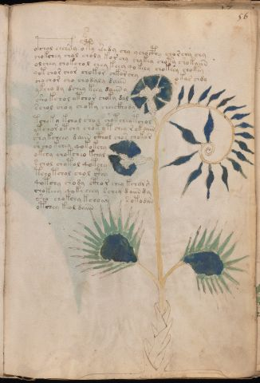

# Voynich Speculative Herbal Ferment Recipe — f56r

IMPORTANT: this is NOT a real or validated translation of the Voynich Manuscript. It is a speculative/procedural model that interprets EVA using a user-defined grammar to generate experimental recipes using safe, known edible substitutes.

This file is generated automatically from IVTFF/EVA transliteration plus a user-defined procedural grammar.

## Page / Folio
- currier: A
- folio: f56r
- page_number: 109
- plant_candidates: ['Boragine echium', 'Dianthus flower']
- plant_category_confidence: 0.95
- plant_category_guess: flower
- plant_category_matches: ['flower']
- plant_id: Boragine echium, Dianthus flower (convolvulus?)
- section: herbal

## Plant Interpretation (Heuristic)
- category: flower
- confidence: 0.95
- note: Heuristic classification based on the IVTFF 'Plant ID' string (not the drawing). Does not imply real identification of the manuscript plant.
- textual_evidence_terms: ['flower']

## EVA Text (Transliteration)
o@167;chal chchs@168;y oty esedy chy ychocphy chorchy chy
chokchey ch[o:a]l choly korchy chykey choty shokaiin
olchey chokchol chey keey qokeey chokeey choksy
qot chor chor chokor chkor chy okar chdy
chochor cho chodaly daiin
ykch[o:a] dy dchey keey daiin y
sho kchol otchor choky dal
schol choy choky cheeckhody
tchoky kchol shol chotchey tchol
yt chor otchy chok y t chey r okaiin
shy kcheey daiin cthol chos chokor
sh cho kchey qokokchy
okchy chokcheo kchal
s chol chotol qotchy
tcho tchol chol cthy
qotchy chody ctho r chey kch[a:o]rg
chokeey qokcheey schey d aiin dy
sho chokchy kchoar sotodan
otchey keol daiin

## Page Summary (Procedural, Aggregated)
- compound_counts: {'mix/transfer': 70, 'main herb': 76, 'heat': 17, 'yeast fermentation': 15, 'complex herbal compound': 5, 'sugars': 35, 'secondary herb': 6, 'liquid base': 6}
- dose_level: 2
- fermentation_estimate: 7–14 days

## Pantry (Max Needed For Any Single Line-Recipe)
- main_plant_dry_g: 10
- main_plant_substitute: ['chamomile']
- safe_complex_herbal_blend: ['gentle spices (e.g., 1 g cinnamon + 1 g clove) or a commercial herbal tea blend']
- secondary_herb_dry_g: 5
- secondary_herb_substitute: ['lemon balm']
- sugar_or_honey_g: 50
- water_l: 0.5
- yeast_g: 1

## Line Recipes (Each Line = One Recipe, 0.5L batch)

### f56r.1,@P0

EVA: o@167;chal chchs@168;y oty esedy chy ychocphy chorchy chy

## Ingredients
- main_plant_dry_g: 5
- main_plant_substitute: chamomile
- safe_complex_herbal_blend: gentle spices (e.g., 1 g cinnamon + 1 g clove) or a commercial herbal tea blend
- secondary_herb_dry_g: 1
- secondary_herb_substitute: lemon balm
- sugar_or_honey_g: 12
- water_l: 0.5
- yeast_g: 1

Process:
1. Sanitize the jar/fermenter and utensils.
2. Base: combine 0.5 L water with 12 g sugar or honey.
3. Apply gentle heat: simmer 10–15 min, then cool to <30°C before adding yeast.
4. Add main plant: chamomile (~5 g dried).
5. Add secondary herb: lemon balm (~1 g dried).
6. If a complex herbal compound appears, use a safe commercial blend or gentle spices in micro-doses.
7. Pitch yeast: 1 g (ideally cider/beer yeast).
8. Ferment with an airlock: 2–4 days (guided by iin/aiin markers).
9. Strain/rack (if very solid-heavy) and cold-crash 24 h.
10. Bottle only when activity clearly slows; refrigerate. Avoid overpressure.

Expected Result: A mild, aromatic herbal ferment, low-to-medium intensity depending on dose level.

Does It Make Sense?: yes

Direct Gloss (Procedural, Not a Real Translation):
- o: mix / transfer
- chal: add main plant (safe substitute) → duration level 1 → state: fermentation start
- chchs: add main plant (safe substitute)
- y: [unparsed]
- oty: apply heat/cooking → mix / transfer
- esedy: start fermentation (yeast) → duration level 1 → state: active extraction
- chy: add main plant (safe substitute)
- ychocphy: add main plant (safe substitute) → mix / transfer → add complex herbal compound (safe blend)
- chorchy: add main plant (safe substitute) → mix / transfer
- chy: add main plant (safe substitute)

### f56r.2,+P0

EVA: chokchey ch[o:a]l choly korchy chykey choty shokaiin

## Ingredients
- main_plant_dry_g: 5
- main_plant_substitute: chamomile
- secondary_herb_dry_g: 2
- secondary_herb_substitute: lemon balm
- sugar_or_honey_g: 25
- water_l: 0.5
- yeast_g: 1

Process:
1. Sanitize the jar/fermenter and utensils.
2. Base: combine 0.5 L water with 25 g sugar or honey.
3. Apply gentle heat: simmer 10–15 min, then cool to <30°C before adding yeast.
4. Add main plant: chamomile (~5 g dried).
5. Add secondary herb: lemon balm (~2 g dried).
6. Pitch yeast: 1 g (ideally cider/beer yeast).
7. Ferment with an airlock: 7–14 days (guided by iin/aiin markers).
8. Strain/rack (if very solid-heavy) and cold-crash 24 h.
9. Bottle only when activity clearly slows; refrigerate. Avoid overpressure.

Expected Result: A mild, aromatic herbal ferment, low-to-medium intensity depending on dose level.

Does It Make Sense?: yes

Direct Gloss (Procedural, Not a Real Translation):
- chokchey: add fermentable sugars → add main plant (safe substitute) → mix / transfer → duration level 1 → state: active extraction
- ch: add main plant (safe substitute)
- o: mix / transfer
- a: duration level 1 → state: fermentation start
- l: [unparsed]
- choly: add main plant (safe substitute) → mix / transfer
- korchy: add fermentable sugars → add main plant (safe substitute) → mix / transfer
- chykey: add fermentable sugars → add main plant (safe substitute) → duration level 1 → state: active extraction
- choty: apply heat/cooking → add main plant (safe substitute) → mix / transfer
- shokaiin: add fermentable sugars → add secondary herb (safe substitute) → mix / transfer → duration level 1 → state: fermentation start → long fermentation / aging phase

### f56r.3,+P0

EVA: olchey chokchol chey keey qokeey chokeey choksy

## Ingredients
- main_plant_dry_g: 10
- main_plant_substitute: chamomile
- secondary_herb_dry_g: 2
- secondary_herb_substitute: lemon balm
- sugar_or_honey_g: 50
- water_l: 0.5
- yeast_g: 1

Process:
1. Sanitize the jar/fermenter and utensils.
2. Base: combine 0.5 L water with 50 g sugar or honey.
3. Infusion: use hot (not boiling) water, then let it cool before adding yeast.
4. Add main plant: chamomile (~10 g dried).
5. Add secondary herb: lemon balm (~2 g dried).
6. Pitch yeast: 1 g (ideally cider/beer yeast).
7. Ferment with an airlock: 2–4 days (guided by iin/aiin markers).
8. Strain/rack (if very solid-heavy) and cold-crash 24 h.
9. Bottle only when activity clearly slows; refrigerate. Avoid overpressure.

Expected Result: A mild, aromatic herbal ferment, low-to-medium intensity depending on dose level.

Does It Make Sense?: yes

Direct Gloss (Procedural, Not a Real Translation):
- olchey: add main plant (safe substitute) → mix / transfer → duration level 1 → state: active extraction
- chokchol: add fermentable sugars → add main plant (safe substitute) → mix / transfer
- chey: add main plant (safe substitute) → duration level 1 → state: active extraction
- keey: add fermentable sugars → duration level 2 → state: active extraction
- qokeey: prepare liquid base → add fermentable sugars → duration level 2 → state: active extraction
- chokeey: add fermentable sugars → add main plant (safe substitute) → mix / transfer → duration level 2 → state: active extraction
- choksy: add fermentable sugars → add main plant (safe substitute) → mix / transfer

### f56r.4,+P0

EVA: qot chor chor chokor chkor chy okar chdy

## Ingredients
- main_plant_dry_g: 5
- main_plant_substitute: chamomile
- secondary_herb_dry_g: 1
- secondary_herb_substitute: lemon balm
- sugar_or_honey_g: 25
- water_l: 0.5
- yeast_g: 1

Process:
1. Sanitize the jar/fermenter and utensils.
2. Base: combine 0.5 L water with 25 g sugar or honey.
3. Apply gentle heat: simmer 10–15 min, then cool to <30°C before adding yeast.
4. Add main plant: chamomile (~5 g dried).
5. Add secondary herb: lemon balm (~1 g dried).
6. Pitch yeast: 1 g (ideally cider/beer yeast).
7. Ferment with an airlock: 2–4 days (guided by iin/aiin markers).
8. Strain/rack (if very solid-heavy) and cold-crash 24 h.
9. Bottle only when activity clearly slows; refrigerate. Avoid overpressure.

Expected Result: A mild, aromatic herbal ferment, low-to-medium intensity depending on dose level.

Does It Make Sense?: yes

Direct Gloss (Procedural, Not a Real Translation):
- qot: prepare liquid base → apply heat/cooking
- chor: add main plant (safe substitute) → mix / transfer
- chor: add main plant (safe substitute) → mix / transfer
- chokor: add fermentable sugars → add main plant (safe substitute) → mix / transfer
- chkor: add fermentable sugars → add main plant (safe substitute) → mix / transfer
- chy: add main plant (safe substitute)
- okar: add fermentable sugars → mix / transfer → duration level 1 → state: fermentation start
- chdy: add main plant (safe substitute) → start fermentation (yeast)

### f56r.5,+P0

EVA: chochor cho chodaly daiin

## Ingredients
- main_plant_dry_g: 5
- main_plant_substitute: chamomile
- secondary_herb_dry_g: 1
- secondary_herb_substitute: lemon balm
- sugar_or_honey_g: 12
- water_l: 0.5
- yeast_g: 1

Process:
1. Sanitize the jar/fermenter and utensils.
2. Base: combine 0.5 L water with 12 g sugar or honey.
3. Infusion: use hot (not boiling) water, then let it cool before adding yeast.
4. Add main plant: chamomile (~5 g dried).
5. Add secondary herb: lemon balm (~1 g dried).
6. Pitch yeast: 1 g (ideally cider/beer yeast).
7. Ferment with an airlock: 7–14 days (guided by iin/aiin markers).
8. Strain/rack (if very solid-heavy) and cold-crash 24 h.
9. Bottle only when activity clearly slows; refrigerate. Avoid overpressure.

Expected Result: A mild, aromatic herbal ferment, low-to-medium intensity depending on dose level.

Does It Make Sense?: yes

Direct Gloss (Procedural, Not a Real Translation):
- chochor: add main plant (safe substitute) → mix / transfer
- cho: add main plant (safe substitute) → mix / transfer
- chodaly: add main plant (safe substitute) → mix / transfer → start fermentation (yeast) → duration level 1 → state: fermentation start
- daiin: start fermentation (yeast) → duration level 1 → state: fermentation start → long fermentation / aging phase

### f56r.6,+P0

EVA: ykch[o:a] dy dchey keey daiin y

## Ingredients
- main_plant_dry_g: 10
- main_plant_substitute: chamomile
- secondary_herb_dry_g: 2
- secondary_herb_substitute: lemon balm
- sugar_or_honey_g: 50
- water_l: 0.5
- yeast_g: 1

Process:
1. Sanitize the jar/fermenter and utensils.
2. Base: combine 0.5 L water with 50 g sugar or honey.
3. Infusion: use hot (not boiling) water, then let it cool before adding yeast.
4. Add main plant: chamomile (~10 g dried).
5. Add secondary herb: lemon balm (~2 g dried).
6. Pitch yeast: 1 g (ideally cider/beer yeast).
7. Ferment with an airlock: 7–14 days (guided by iin/aiin markers).
8. Strain/rack (if very solid-heavy) and cold-crash 24 h.
9. Bottle only when activity clearly slows; refrigerate. Avoid overpressure.

Expected Result: A mild, aromatic herbal ferment, low-to-medium intensity depending on dose level.

Does It Make Sense?: yes

Direct Gloss (Procedural, Not a Real Translation):
- ykch: add fermentable sugars → add main plant (safe substitute)
- o: mix / transfer
- a: duration level 1 → state: fermentation start
- dy: start fermentation (yeast)
- dchey: add main plant (safe substitute) → start fermentation (yeast) → duration level 1 → state: active extraction
- keey: add fermentable sugars → duration level 2 → state: active extraction
- daiin: start fermentation (yeast) → duration level 1 → state: fermentation start → long fermentation / aging phase
- y: [unparsed]

### f56r.7,+P0

EVA: sho kchol otchor choky dal

## Ingredients
- main_plant_dry_g: 5
- main_plant_substitute: chamomile
- secondary_herb_dry_g: 2
- secondary_herb_substitute: lemon balm
- sugar_or_honey_g: 25
- water_l: 0.5
- yeast_g: 1

Process:
1. Sanitize the jar/fermenter and utensils.
2. Base: combine 0.5 L water with 25 g sugar or honey.
3. Apply gentle heat: simmer 10–15 min, then cool to <30°C before adding yeast.
4. Add main plant: chamomile (~5 g dried).
5. Add secondary herb: lemon balm (~2 g dried).
6. Pitch yeast: 1 g (ideally cider/beer yeast).
7. Ferment with an airlock: 2–4 days (guided by iin/aiin markers).
8. Strain/rack (if very solid-heavy) and cold-crash 24 h.
9. Bottle only when activity clearly slows; refrigerate. Avoid overpressure.

Expected Result: A mild, aromatic herbal ferment, low-to-medium intensity depending on dose level.

Does It Make Sense?: yes

Direct Gloss (Procedural, Not a Real Translation):
- sho: add secondary herb (safe substitute) → mix / transfer
- kchol: add fermentable sugars → add main plant (safe substitute) → mix / transfer
- otchor: apply heat/cooking → add main plant (safe substitute) → mix / transfer
- choky: add fermentable sugars → add main plant (safe substitute) → mix / transfer
- dal: start fermentation (yeast) → duration level 1 → state: fermentation start

### f56r.8,+P0

EVA: schol choy choky cheeckhody

## Ingredients
- main_plant_dry_g: 10
- main_plant_substitute: chamomile
- safe_complex_herbal_blend: gentle spices (e.g., 1 g cinnamon + 1 g clove) or a commercial herbal tea blend
- secondary_herb_dry_g: 2
- secondary_herb_substitute: lemon balm
- sugar_or_honey_g: 50
- water_l: 0.5
- yeast_g: 1

Process:
1. Sanitize the jar/fermenter and utensils.
2. Base: combine 0.5 L water with 50 g sugar or honey.
3. Infusion: use hot (not boiling) water, then let it cool before adding yeast.
4. Add main plant: chamomile (~10 g dried).
5. Add secondary herb: lemon balm (~2 g dried).
6. If a complex herbal compound appears, use a safe commercial blend or gentle spices in micro-doses.
7. Pitch yeast: 1 g (ideally cider/beer yeast).
8. Ferment with an airlock: 2–4 days (guided by iin/aiin markers).
9. Strain/rack (if very solid-heavy) and cold-crash 24 h.
10. Bottle only when activity clearly slows; refrigerate. Avoid overpressure.

Expected Result: A mild, aromatic herbal ferment, low-to-medium intensity depending on dose level.

Does It Make Sense?: yes

Direct Gloss (Procedural, Not a Real Translation):
- schol: add main plant (safe substitute) → mix / transfer
- choy: add main plant (safe substitute) → mix / transfer
- choky: add fermentable sugars → add main plant (safe substitute) → mix / transfer
- cheeckhody: add main plant (safe substitute) → mix / transfer → start fermentation (yeast) → add complex herbal compound (safe blend) → duration level 2 → state: active extraction

### f56r.9,+P0

EVA: tchoky kchol shol chotchey tchol

## Ingredients
- main_plant_dry_g: 5
- main_plant_substitute: chamomile
- secondary_herb_dry_g: 2
- secondary_herb_substitute: lemon balm
- sugar_or_honey_g: 25
- water_l: 0.5
- yeast_g: 1

Process:
1. Sanitize the jar/fermenter and utensils.
2. Base: combine 0.5 L water with 25 g sugar or honey.
3. Apply gentle heat: simmer 10–15 min, then cool to <30°C before adding yeast.
4. Add main plant: chamomile (~5 g dried).
5. Add secondary herb: lemon balm (~2 g dried).
6. Pitch yeast: 1 g (ideally cider/beer yeast).
7. Ferment with an airlock: 2–4 days (guided by iin/aiin markers).
8. Strain/rack (if very solid-heavy) and cold-crash 24 h.
9. Bottle only when activity clearly slows; refrigerate. Avoid overpressure.

Expected Result: A mild, aromatic herbal ferment, low-to-medium intensity depending on dose level.

Does It Make Sense?: yes

Direct Gloss (Procedural, Not a Real Translation):
- tchoky: add fermentable sugars → apply heat/cooking → add main plant (safe substitute) → mix / transfer
- kchol: add fermentable sugars → add main plant (safe substitute) → mix / transfer
- shol: add secondary herb (safe substitute) → mix / transfer
- chotchey: apply heat/cooking → add main plant (safe substitute) → mix / transfer → duration level 1 → state: active extraction
- tchol: apply heat/cooking → add main plant (safe substitute) → mix / transfer

### f56r.10,+P0

EVA: yt chor otchy chok y t chey r okaiin

## Ingredients
- main_plant_dry_g: 5
- main_plant_substitute: chamomile
- secondary_herb_dry_g: 1
- secondary_herb_substitute: lemon balm
- sugar_or_honey_g: 25
- water_l: 0.5
- yeast_g: 1

Process:
1. Sanitize the jar/fermenter and utensils.
2. Base: combine 0.5 L water with 25 g sugar or honey.
3. Apply gentle heat: simmer 10–15 min, then cool to <30°C before adding yeast.
4. Add main plant: chamomile (~5 g dried).
5. Add secondary herb: lemon balm (~1 g dried).
6. Pitch yeast: 1 g (ideally cider/beer yeast).
7. Ferment with an airlock: 7–14 days (guided by iin/aiin markers).
8. Strain/rack (if very solid-heavy) and cold-crash 24 h.
9. Bottle only when activity clearly slows; refrigerate. Avoid overpressure.

Expected Result: A mild, aromatic herbal ferment, low-to-medium intensity depending on dose level.

Does It Make Sense?: yes

Direct Gloss (Procedural, Not a Real Translation):
- yt: apply heat/cooking
- chor: add main plant (safe substitute) → mix / transfer
- otchy: apply heat/cooking → add main plant (safe substitute) → mix / transfer
- chok: add fermentable sugars → add main plant (safe substitute) → mix / transfer
- y: [unparsed]
- t: apply heat/cooking
- chey: add main plant (safe substitute) → duration level 1 → state: active extraction
- r: [unparsed]
- okaiin: add fermentable sugars → mix / transfer → duration level 1 → state: fermentation start → long fermentation / aging phase

### f56r.11,+P0

EVA: shy kcheey daiin cthol chos chokor

## Ingredients
- main_plant_dry_g: 10
- main_plant_substitute: chamomile
- safe_complex_herbal_blend: gentle spices (e.g., 1 g cinnamon + 1 g clove) or a commercial herbal tea blend
- secondary_herb_dry_g: 5
- secondary_herb_substitute: lemon balm
- sugar_or_honey_g: 50
- water_l: 0.5
- yeast_g: 1

Process:
1. Sanitize the jar/fermenter and utensils.
2. Base: combine 0.5 L water with 50 g sugar or honey.
3. Infusion: use hot (not boiling) water, then let it cool before adding yeast.
4. Add main plant: chamomile (~10 g dried).
5. Add secondary herb: lemon balm (~5 g dried).
6. If a complex herbal compound appears, use a safe commercial blend or gentle spices in micro-doses.
7. Pitch yeast: 1 g (ideally cider/beer yeast).
8. Ferment with an airlock: 7–14 days (guided by iin/aiin markers).
9. Strain/rack (if very solid-heavy) and cold-crash 24 h.
10. Bottle only when activity clearly slows; refrigerate. Avoid overpressure.

Expected Result: A mild, aromatic herbal ferment, low-to-medium intensity depending on dose level.

Does It Make Sense?: yes

Direct Gloss (Procedural, Not a Real Translation):
- shy: add secondary herb (safe substitute)
- kcheey: add fermentable sugars → add main plant (safe substitute) → duration level 2 → state: active extraction
- daiin: start fermentation (yeast) → duration level 1 → state: fermentation start → long fermentation / aging phase
- cthol: mix / transfer → add complex herbal compound (safe blend)
- chos: add main plant (safe substitute) → mix / transfer
- chokor: add fermentable sugars → add main plant (safe substitute) → mix / transfer

### f56r.12,+P0

EVA: sh cho kchey qokokchy

## Ingredients
- main_plant_dry_g: 5
- main_plant_substitute: chamomile
- secondary_herb_dry_g: 2
- secondary_herb_substitute: lemon balm
- sugar_or_honey_g: 25
- water_l: 0.5
- yeast_g: 1

Process:
1. Sanitize the jar/fermenter and utensils.
2. Base: combine 0.5 L water with 25 g sugar or honey.
3. Infusion: use hot (not boiling) water, then let it cool before adding yeast.
4. Add main plant: chamomile (~5 g dried).
5. Add secondary herb: lemon balm (~2 g dried).
6. Pitch yeast: 1 g (ideally cider/beer yeast).
7. Ferment with an airlock: 2–4 days (guided by iin/aiin markers).
8. Strain/rack (if very solid-heavy) and cold-crash 24 h.
9. Bottle only when activity clearly slows; refrigerate. Avoid overpressure.

Expected Result: A mild, aromatic herbal ferment, low-to-medium intensity depending on dose level.

Does It Make Sense?: yes

Direct Gloss (Procedural, Not a Real Translation):
- sh: add secondary herb (safe substitute)
- cho: add main plant (safe substitute) → mix / transfer
- kchey: add fermentable sugars → add main plant (safe substitute) → duration level 1 → state: active extraction
- qokokchy: prepare liquid base → add fermentable sugars → add main plant (safe substitute) → mix / transfer

### f56r.13,+P0

EVA: okchy chokcheo kchal

## Ingredients
- main_plant_dry_g: 5
- main_plant_substitute: chamomile
- secondary_herb_dry_g: 1
- secondary_herb_substitute: lemon balm
- sugar_or_honey_g: 25
- water_l: 0.5
- yeast_g: 1

Process:
1. Sanitize the jar/fermenter and utensils.
2. Base: combine 0.5 L water with 25 g sugar or honey.
3. Infusion: use hot (not boiling) water, then let it cool before adding yeast.
4. Add main plant: chamomile (~5 g dried).
5. Add secondary herb: lemon balm (~1 g dried).
6. Pitch yeast: 1 g (ideally cider/beer yeast).
7. Ferment with an airlock: 2–4 days (guided by iin/aiin markers).
8. Strain/rack (if very solid-heavy) and cold-crash 24 h.
9. Bottle only when activity clearly slows; refrigerate. Avoid overpressure.

Expected Result: A mild, aromatic herbal ferment, low-to-medium intensity depending on dose level.

Does It Make Sense?: yes

Direct Gloss (Procedural, Not a Real Translation):
- okchy: add fermentable sugars → add main plant (safe substitute) → mix / transfer
- chokcheo: add fermentable sugars → add main plant (safe substitute) → mix / transfer → duration level 1 → state: active extraction
- kchal: add fermentable sugars → add main plant (safe substitute) → duration level 1 → state: fermentation start

### f56r.14,+P0

EVA: s chol chotol qotchy

## Ingredients
- main_plant_dry_g: 5
- main_plant_substitute: chamomile
- secondary_herb_dry_g: 1
- secondary_herb_substitute: lemon balm
- sugar_or_honey_g: 12
- water_l: 0.5
- yeast_g: 1

Process:
1. Sanitize the jar/fermenter and utensils.
2. Base: combine 0.5 L water with 12 g sugar or honey.
3. Apply gentle heat: simmer 10–15 min, then cool to <30°C before adding yeast.
4. Add main plant: chamomile (~5 g dried).
5. Add secondary herb: lemon balm (~1 g dried).
6. Pitch yeast: 1 g (ideally cider/beer yeast).
7. Ferment with an airlock: 2–4 days (guided by iin/aiin markers).
8. Strain/rack (if very solid-heavy) and cold-crash 24 h.
9. Bottle only when activity clearly slows; refrigerate. Avoid overpressure.

Expected Result: A mild, aromatic herbal ferment, low-to-medium intensity depending on dose level.

Does It Make Sense?: yes

Direct Gloss (Procedural, Not a Real Translation):
- s: [unparsed]
- chol: add main plant (safe substitute) → mix / transfer
- chotol: apply heat/cooking → add main plant (safe substitute) → mix / transfer
- qotchy: prepare liquid base → apply heat/cooking → add main plant (safe substitute)

### f56r.15,+P0

EVA: tcho tchol chol cthy

## Ingredients
- main_plant_dry_g: 5
- main_plant_substitute: chamomile
- safe_complex_herbal_blend: gentle spices (e.g., 1 g cinnamon + 1 g clove) or a commercial herbal tea blend
- secondary_herb_dry_g: 1
- secondary_herb_substitute: lemon balm
- sugar_or_honey_g: 12
- water_l: 0.5
- yeast_g: 1

Process:
1. Sanitize the jar/fermenter and utensils.
2. Base: combine 0.5 L water with 12 g sugar or honey.
3. Apply gentle heat: simmer 10–15 min, then cool to <30°C before adding yeast.
4. Add main plant: chamomile (~5 g dried).
5. Add secondary herb: lemon balm (~1 g dried).
6. If a complex herbal compound appears, use a safe commercial blend or gentle spices in micro-doses.
7. Pitch yeast: 1 g (ideally cider/beer yeast).
8. Ferment with an airlock: 2–4 days (guided by iin/aiin markers).
9. Strain/rack (if very solid-heavy) and cold-crash 24 h.
10. Bottle only when activity clearly slows; refrigerate. Avoid overpressure.

Expected Result: A mild, aromatic herbal ferment, low-to-medium intensity depending on dose level.

Does It Make Sense?: yes

Direct Gloss (Procedural, Not a Real Translation):
- tcho: apply heat/cooking → add main plant (safe substitute) → mix / transfer
- tchol: apply heat/cooking → add main plant (safe substitute) → mix / transfer
- chol: add main plant (safe substitute) → mix / transfer
- cthy: add complex herbal compound (safe blend)

### f56r.16,+P0

EVA: qotchy chody ctho r chey kch[a:o]rg

## Ingredients
- main_plant_dry_g: 5
- main_plant_substitute: chamomile
- safe_complex_herbal_blend: gentle spices (e.g., 1 g cinnamon + 1 g clove) or a commercial herbal tea blend
- secondary_herb_dry_g: 1
- secondary_herb_substitute: lemon balm
- sugar_or_honey_g: 25
- water_l: 0.5
- yeast_g: 1

Process:
1. Sanitize the jar/fermenter and utensils.
2. Base: combine 0.5 L water with 25 g sugar or honey.
3. Apply gentle heat: simmer 10–15 min, then cool to <30°C before adding yeast.
4. Add main plant: chamomile (~5 g dried).
5. Add secondary herb: lemon balm (~1 g dried).
6. If a complex herbal compound appears, use a safe commercial blend or gentle spices in micro-doses.
7. Pitch yeast: 1 g (ideally cider/beer yeast).
8. Ferment with an airlock: 2–4 days (guided by iin/aiin markers).
9. Strain/rack (if very solid-heavy) and cold-crash 24 h.
10. Bottle only when activity clearly slows; refrigerate. Avoid overpressure.

Expected Result: A mild, aromatic herbal ferment, low-to-medium intensity depending on dose level.

Does It Make Sense?: yes

Direct Gloss (Procedural, Not a Real Translation):
- qotchy: prepare liquid base → apply heat/cooking → add main plant (safe substitute)
- chody: add main plant (safe substitute) → mix / transfer → start fermentation (yeast)
- ctho: mix / transfer → add complex herbal compound (safe blend)
- r: [unparsed]
- chey: add main plant (safe substitute) → duration level 1 → state: active extraction
- kch: add fermentable sugars → add main plant (safe substitute)
- a: duration level 1 → state: fermentation start
- o: mix / transfer
- rg: [unparsed]

### f56r.17,+P0

EVA: chokeey qokcheey schey d aiin dy

## Ingredients
- main_plant_dry_g: 10
- main_plant_substitute: chamomile
- secondary_herb_dry_g: 2
- secondary_herb_substitute: lemon balm
- sugar_or_honey_g: 50
- water_l: 0.5
- yeast_g: 1

Process:
1. Sanitize the jar/fermenter and utensils.
2. Base: combine 0.5 L water with 50 g sugar or honey.
3. Infusion: use hot (not boiling) water, then let it cool before adding yeast.
4. Add main plant: chamomile (~10 g dried).
5. Add secondary herb: lemon balm (~2 g dried).
6. Pitch yeast: 1 g (ideally cider/beer yeast).
7. Ferment with an airlock: 7–14 days (guided by iin/aiin markers).
8. Strain/rack (if very solid-heavy) and cold-crash 24 h.
9. Bottle only when activity clearly slows; refrigerate. Avoid overpressure.

Expected Result: A mild, aromatic herbal ferment, low-to-medium intensity depending on dose level.

Does It Make Sense?: yes

Direct Gloss (Procedural, Not a Real Translation):
- chokeey: add fermentable sugars → add main plant (safe substitute) → mix / transfer → duration level 2 → state: active extraction
- qokcheey: prepare liquid base → add fermentable sugars → add main plant (safe substitute) → duration level 2 → state: active extraction
- schey: add main plant (safe substitute) → duration level 1 → state: active extraction
- d: start fermentation (yeast)
- aiin: duration level 1 → state: fermentation start → long fermentation / aging phase
- dy: start fermentation (yeast)

### f56r.18,+P0

EVA: sho chokchy kchoar sotodan

## Ingredients
- main_plant_dry_g: 5
- main_plant_substitute: chamomile
- secondary_herb_dry_g: 2
- secondary_herb_substitute: lemon balm
- sugar_or_honey_g: 25
- water_l: 0.5
- yeast_g: 1

Process:
1. Sanitize the jar/fermenter and utensils.
2. Base: combine 0.5 L water with 25 g sugar or honey.
3. Apply gentle heat: simmer 10–15 min, then cool to <30°C before adding yeast.
4. Add main plant: chamomile (~5 g dried).
5. Add secondary herb: lemon balm (~2 g dried).
6. Pitch yeast: 1 g (ideally cider/beer yeast).
7. Ferment with an airlock: 2–4 days (guided by iin/aiin markers).
8. Strain/rack (if very solid-heavy) and cold-crash 24 h.
9. Bottle only when activity clearly slows; refrigerate. Avoid overpressure.

Expected Result: A mild, aromatic herbal ferment, low-to-medium intensity depending on dose level.

Does It Make Sense?: yes

Direct Gloss (Procedural, Not a Real Translation):
- sho: add secondary herb (safe substitute) → mix / transfer
- chokchy: add fermentable sugars → add main plant (safe substitute) → mix / transfer
- kchoar: add fermentable sugars → add main plant (safe substitute) → mix / transfer → duration level 1 → state: fermentation start
- sotodan: apply heat/cooking → mix / transfer → start fermentation (yeast) → duration level 1 → state: fermentation start

### f56r.19,+P0

EVA: otchey keol daiin

## Ingredients
- main_plant_dry_g: 5
- main_plant_substitute: chamomile
- secondary_herb_dry_g: 1
- secondary_herb_substitute: lemon balm
- sugar_or_honey_g: 25
- water_l: 0.5
- yeast_g: 1

Process:
1. Sanitize the jar/fermenter and utensils.
2. Base: combine 0.5 L water with 25 g sugar or honey.
3. Apply gentle heat: simmer 10–15 min, then cool to <30°C before adding yeast.
4. Add main plant: chamomile (~5 g dried).
5. Add secondary herb: lemon balm (~1 g dried).
6. Pitch yeast: 1 g (ideally cider/beer yeast).
7. Ferment with an airlock: 7–14 days (guided by iin/aiin markers).
8. Strain/rack (if very solid-heavy) and cold-crash 24 h.
9. Bottle only when activity clearly slows; refrigerate. Avoid overpressure.

Expected Result: A mild, aromatic herbal ferment, low-to-medium intensity depending on dose level.

Does It Make Sense?: yes

Direct Gloss (Procedural, Not a Real Translation):
- otchey: apply heat/cooking → add main plant (safe substitute) → mix / transfer → duration level 1 → state: active extraction
- keol: add fermentable sugars → mix / transfer → duration level 1 → state: active extraction
- daiin: start fermentation (yeast) → duration level 1 → state: fermentation start → long fermentation / aging phase

## Risks & Warnings (Applies To All Line-Recipes)
- Never use unidentified Voynich plants directly; only use known edible substitutes.
- Do not consume if you see mold, smell rot, notice abnormal sliminess, or taste something clearly foul.
- Overpressure/bottle-bomb risk: do not bottle before stable; prefer an airlock and refrigeration.
- Avoid if pregnant/breastfeeding, for minors, or with medical conditions; consult a professional.
- No medical claims: this is an experimental beverage.

## Recommended Adjustments (General)
- If too bitter (leafy profile), halve the herbs or shorten steep/maceration time.
- If too sweet, extend fermentation or reduce sugar by 25–50%.
- For a non-alcoholic version, omit yeast and keep refrigerated as an infusion (not fermented).
