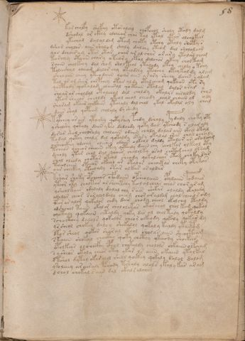

# Voynich Speculative Herbal Ferment Recipe — f58r

IMPORTANT: this is NOT a real or validated translation of the Voynich Manuscript. It is a speculative/procedural model that interprets EVA using a user-defined grammar to generate experimental recipes using safe, known edible substitutes.

This file is generated automatically from IVTFF/EVA transliteration plus a user-defined procedural grammar.



## Page / Folio
- currier: A
- folio: f58r
- page_number: 113
- section: text only

## EVA Text (Transliteration)
```text
kor cholfy shofchy otoralchy chofchol sholy otaly dal m
dshodal or ckhy olchear char tal ytal ytar olchokal
ykechod dalaldam ytam choty otchy otaly shoty s
dshor sholar aiin shalom shaly dalchy oteom dal sholala@210;
qor dchair am otar otar char ar al char ar ary ytalar cham
torchey otaiin chary oteor y otal dalchor ykeey choltam
saiin cholkeey dal shom sholteol ytalody otey cheoly o tchy
toleeshal oleeam dalor chy oteodchy yteochy otey kal dy alam
sholaiin cheey yteodaiin qoar aiin arary sheey daiin e alam
tal ar am shar chepchey otar aldy otal cheam qokaiin ote [s:r]y
qocphody qokalam chairal qoctaiin otalal dalor orar
shoar ar choldal otalchal dal choldy okalys airaldy shar
ytar sheear cheoldy ykeol cheal cheody chal chaiin ol oly
sharam okair chekaiin ytchaly dalchal ykal okalal oly chal
daiir shal qopaim cholaly dy shedy
typchey ar air ytashy qotyshey pchdy dshaly pydaly choky opy
ysholshy qotoly daiin ykal dalchdy qoky dal ytchody s olar aly
darar shol cholraly cholaiin odaiin chaly dalar aiin okal otal
todal qotey chaly dal qokaldy otary okalal ch'ees chal [o:a]chaly
ysheockhy olchey oleesey alaiin olkeal daldy otalar ar aroda[i:?]m
tcheos ycheor sheain okey qotaily daiin chy cholkor olkeol oty
dcholy ytar chol dal qoaiir chalolky osal chotam chal olsee[g:m]
shol [a:o]leedy chotar okeal sheody qokalchar otal choky sar
tazain oteeos okeal ar otalor cheoekar cheky otaka[s:r]
oar cheekey oteeoaly otar alkar or aldar
kshar shoky opcheear ofadain opsheolaiin opydaiin podaiir
yteor oty chaltar ar sheeetchy tal al chear chear chor ar am
yshealkair odalaly dalal chy s air shokar olaldy okalody
odalar cheor sar alol daly cheom chor ar aldam chal cheal [r:s] omy
ytor ar alom qokalor chdy dair chody cheol okolchy otaldy
odshchol taiin okal or chol ol ekar otarchol chol kam qokal
oqotaly qokaiin chtaldy qoky dar al chol taly qokaldy
schocthhy dalols qokalos cheor oekeody qokaly qokar dy
yssheol chokey dalol shokalol qokaly kaldy ytaipom
dto[s:r] sheol qokor sharal ckhol shol ar aiin sheoctham
skaiin shokal chockhy qoky chcthy ykeeshy shoekar
opolkeor olchocfhy cphol chykaldy cholols chkaiin olfcham
s ysheos okaly cheos otey ykar ls aiin okaiin ytolkal
dtshol dytal okar olol sheol qockhy qokaly salol dalam
y[r:?]oleeey ar airaly pchody tshaly alols ykaly kar aram
dchol chokal saiin dal okal s alchey
```

## Recipes Index (This Page)
- [f58r.1,@P0](#f58r-1-f58r-1-p0)
- [f58r.2,+P0](#f58r-2-f58r-2-p0)
- [f58r.3,+P0](#f58r-3-f58r-3-p0)
- [f58r.4,+P0](#f58r-4-f58r-4-p0)
- [f58r.5,+P0](#f58r-5-f58r-5-p0)
- [f58r.6,+P0](#f58r-6-f58r-6-p0)
- [f58r.7,+P0](#f58r-7-f58r-7-p0)
- [f58r.8,+P0](#f58r-8-f58r-8-p0)
- [f58r.9,+P0](#f58r-9-f58r-9-p0)
- [f58r.10,+P0](#f58r-10-f58r-10-p0)
- [f58r.11,+P0](#f58r-11-f58r-11-p0)
- [f58r.12,+P0](#f58r-12-f58r-12-p0)
- [f58r.13,+P0](#f58r-13-f58r-13-p0)
- [f58r.14,+P0](#f58r-14-f58r-14-p0)
- [f58r.15,+P0](#f58r-15-f58r-15-p0)
- [f58r.16,+P0](#f58r-16-f58r-16-p0)
- [f58r.17,+P0](#f58r-17-f58r-17-p0)
- [f58r.18,+P0](#f58r-18-f58r-18-p0)
- [f58r.19,+P0](#f58r-19-f58r-19-p0)
- [f58r.20,+P0](#f58r-20-f58r-20-p0)
- [f58r.21,+P0](#f58r-21-f58r-21-p0)
- [f58r.22,+P0](#f58r-22-f58r-22-p0)
- [f58r.23,+P0](#f58r-23-f58r-23-p0)
- [f58r.24,+P0](#f58r-24-f58r-24-p0)
- [f58r.25,+P0](#f58r-25-f58r-25-p0)
- [f58r.26,+P0](#f58r-26-f58r-26-p0)
- [f58r.27,+P0](#f58r-27-f58r-27-p0)
- [f58r.28,+P0](#f58r-28-f58r-28-p0)
- [f58r.29,+P0](#f58r-29-f58r-29-p0)
- [f58r.30,+P0](#f58r-30-f58r-30-p0)
- [f58r.31,+P0](#f58r-31-f58r-31-p0)
- [f58r.32,+P0](#f58r-32-f58r-32-p0)
- [f58r.33,+P0](#f58r-33-f58r-33-p0)
- [f58r.34,+P0](#f58r-34-f58r-34-p0)
- [f58r.35,+P0](#f58r-35-f58r-35-p0)
- [f58r.36,+P0](#f58r-36-f58r-36-p0)
- [f58r.37,+P0](#f58r-37-f58r-37-p0)
- [f58r.38,+P0](#f58r-38-f58r-38-p0)
- [f58r.39,+P0](#f58r-39-f58r-39-p0)
- [f58r.40,+P0](#f58r-40-f58r-40-p0)
- [f58r.41,+P0](#f58r-41-f58r-41-p0)

## Line Glosses (Procedural Gloss Only; Not a Translation)

<a id="f58r-1-f58r-1-p0"></a>

### f58r.1,@P0

EVA: kor cholfy shofchy otoralchy chofchol sholy otaly dal m

Direct Gloss (Procedural, Not a Real Translation):
- kor: add fermentable sugars → mix / transfer
- cholfy: add main plant (safe substitute) → add aroma modifier → mix / transfer
- shofchy: add main plant (safe substitute) → add secondary herb (safe substitute) → add aroma modifier → mix / transfer
- otoralchy: apply heat/cooking → add main plant (safe substitute) → mix / transfer → duration level 1 → state: fermentation start
- chofchol: add main plant (safe substitute) → add aroma modifier → mix / transfer
- sholy: add secondary herb (safe substitute) → mix / transfer
- otaly: apply heat/cooking → mix / transfer → duration level 1 → state: fermentation start
- dal: start fermentation (yeast) → duration level 1 → state: fermentation start
- m: [unparsed]

<a id="f58r-2-f58r-2-p0"></a>

### f58r.2,+P0

EVA: dshodal or ckhy olchear char tal ytal ytar olchokal

Direct Gloss (Procedural, Not a Real Translation):
- dshodal: add secondary herb (safe substitute) → mix / transfer → start fermentation (yeast) → duration level 1 → state: fermentation start
- or: mix / transfer
- ckhy: add complex herbal compound (safe blend)
- olchear: add main plant (safe substitute) → mix / transfer → duration level 1 → state: active extraction
- char: add main plant (safe substitute) → duration level 1 → state: fermentation start
- tal: apply heat/cooking → duration level 1 → state: fermentation start
- ytal: apply heat/cooking → duration level 1 → state: fermentation start
- ytar: apply heat/cooking → duration level 1 → state: fermentation start
- olchokal: add fermentable sugars → add main plant (safe substitute) → mix / transfer → duration level 1 → state: fermentation start

<a id="f58r-3-f58r-3-p0"></a>

### f58r.3,+P0

EVA: ykechod dalaldam ytam choty otchy otaly shoty s

Direct Gloss (Procedural, Not a Real Translation):
- ykechod: add fermentable sugars → add main plant (safe substitute) → mix / transfer → start fermentation (yeast) → duration level 1 → state: active extraction
- dalaldam: start fermentation (yeast) → duration level 1 → state: fermentation start
- ytam: apply heat/cooking → duration level 1 → state: fermentation start
- choty: apply heat/cooking → add main plant (safe substitute) → mix / transfer
- otchy: apply heat/cooking → add main plant (safe substitute) → mix / transfer
- otaly: apply heat/cooking → mix / transfer → duration level 1 → state: fermentation start
- shoty: apply heat/cooking → add secondary herb (safe substitute) → mix / transfer
- s: [unparsed]

<a id="f58r-4-f58r-4-p0"></a>

### f58r.4,+P0

EVA: dshor sholar aiin shalom shaly dalchy oteom dal sholala@210;

Direct Gloss (Procedural, Not a Real Translation):
- dshor: add secondary herb (safe substitute) → mix / transfer → start fermentation (yeast)
- sholar: add secondary herb (safe substitute) → mix / transfer → duration level 1 → state: fermentation start
- aiin: duration level 1 → state: fermentation start → long fermentation / aging phase
- shalom: add secondary herb (safe substitute) → mix / transfer → duration level 1 → state: fermentation start
- shaly: add secondary herb (safe substitute) → duration level 1 → state: fermentation start
- dalchy: add main plant (safe substitute) → start fermentation (yeast) → duration level 1 → state: fermentation start
- oteom: apply heat/cooking → mix / transfer → duration level 1 → state: active extraction
- dal: start fermentation (yeast) → duration level 1 → state: fermentation start
- sholala: add secondary herb (safe substitute) → mix / transfer → duration level 1 → state: fermentation start

<a id="f58r-5-f58r-5-p0"></a>

### f58r.5,+P0

EVA: qor dchair am otar otar char ar al char ar ary ytalar cham

Direct Gloss (Procedural, Not a Real Translation):
- qor: prepare liquid base
- dchair: add main plant (safe substitute) → start fermentation (yeast) → duration level 1 → state: fermentation start
- am: duration level 1 → state: fermentation start
- otar: apply heat/cooking → mix / transfer → duration level 1 → state: fermentation start
- otar: apply heat/cooking → mix / transfer → duration level 1 → state: fermentation start
- char: add main plant (safe substitute) → duration level 1 → state: fermentation start
- ar: duration level 1 → state: fermentation start
- al: duration level 1 → state: fermentation start
- char: add main plant (safe substitute) → duration level 1 → state: fermentation start
- ar: duration level 1 → state: fermentation start
- ary: duration level 1 → state: fermentation start
- ytalar: apply heat/cooking → duration level 1 → state: fermentation start
- cham: add main plant (safe substitute) → duration level 1 → state: fermentation start

<a id="f58r-6-f58r-6-p0"></a>

### f58r.6,+P0

EVA: torchey otaiin chary oteor y otal dalchor ykeey choltam

Direct Gloss (Procedural, Not a Real Translation):
- torchey: apply heat/cooking → add main plant (safe substitute) → mix / transfer → duration level 1 → state: active extraction
- otaiin: apply heat/cooking → mix / transfer → duration level 1 → state: fermentation start → long fermentation / aging phase
- chary: add main plant (safe substitute) → duration level 1 → state: fermentation start
- oteor: apply heat/cooking → mix / transfer → duration level 1 → state: active extraction
- y: [unparsed]
- otal: apply heat/cooking → mix / transfer → duration level 1 → state: fermentation start
- dalchor: add main plant (safe substitute) → mix / transfer → start fermentation (yeast) → duration level 1 → state: fermentation start
- ykeey: add fermentable sugars → duration level 2 → state: active extraction
- choltam: apply heat/cooking → add main plant (safe substitute) → mix / transfer → duration level 1 → state: fermentation start

<a id="f58r-7-f58r-7-p0"></a>

### f58r.7,+P0

EVA: saiin cholkeey dal shom sholteol ytalody otey cheoly o tchy

Direct Gloss (Procedural, Not a Real Translation):
- saiin: duration level 1 → state: fermentation start → long fermentation / aging phase
- cholkeey: add fermentable sugars → add main plant (safe substitute) → mix / transfer → duration level 2 → state: active extraction
- dal: start fermentation (yeast) → duration level 1 → state: fermentation start
- shom: add secondary herb (safe substitute) → mix / transfer
- sholteol: apply heat/cooking → add secondary herb (safe substitute) → mix / transfer → duration level 1 → state: active extraction
- ytalody: apply heat/cooking → mix / transfer → start fermentation (yeast) → duration level 1 → state: fermentation start
- otey: apply heat/cooking → mix / transfer → duration level 1 → state: active extraction
- cheoly: add main plant (safe substitute) → mix / transfer → duration level 1 → state: active extraction
- o: mix / transfer
- tchy: apply heat/cooking → add main plant (safe substitute)

<a id="f58r-8-f58r-8-p0"></a>

### f58r.8,+P0

EVA: toleeshal oleeam dalor chy oteodchy yteochy otey kal dy alam

Direct Gloss (Procedural, Not a Real Translation):
- toleeshal: apply heat/cooking → add secondary herb (safe substitute) → mix / transfer → duration level 2 → state: active extraction
- oleeam: mix / transfer → duration level 2 → state: active extraction
- dalor: mix / transfer → start fermentation (yeast) → duration level 1 → state: fermentation start
- chy: add main plant (safe substitute)
- oteodchy: apply heat/cooking → add main plant (safe substitute) → mix / transfer → start fermentation (yeast) → duration level 1 → state: active extraction
- yteochy: apply heat/cooking → add main plant (safe substitute) → mix / transfer → duration level 1 → state: active extraction
- otey: apply heat/cooking → mix / transfer → duration level 1 → state: active extraction
- kal: add fermentable sugars → duration level 1 → state: fermentation start
- dy: start fermentation (yeast)
- alam: duration level 1 → state: fermentation start

<a id="f58r-9-f58r-9-p0"></a>

### f58r.9,+P0

EVA: sholaiin cheey yteodaiin qoar aiin arary sheey daiin e alam

Direct Gloss (Procedural, Not a Real Translation):
- sholaiin: add secondary herb (safe substitute) → mix / transfer → duration level 1 → state: fermentation start → long fermentation / aging phase
- cheey: add main plant (safe substitute) → duration level 2 → state: active extraction
- yteodaiin: apply heat/cooking → mix / transfer → start fermentation (yeast) → duration level 1 → state: active extraction → long fermentation / aging phase
- qoar: prepare liquid base → duration level 1 → state: fermentation start
- aiin: duration level 1 → state: fermentation start → long fermentation / aging phase
- arary: duration level 1 → state: fermentation start
- sheey: add secondary herb (safe substitute) → duration level 2 → state: active extraction
- daiin: start fermentation (yeast) → duration level 1 → state: fermentation start → long fermentation / aging phase
- e: duration level 1 → state: active extraction
- alam: duration level 1 → state: fermentation start

<a id="f58r-10-f58r-10-p0"></a>

### f58r.10,+P0

EVA: tal ar am shar chepchey otar aldy otal cheam qokaiin ote [s:r]y

Direct Gloss (Procedural, Not a Real Translation):
- tal: apply heat/cooking → duration level 1 → state: fermentation start
- ar: duration level 1 → state: fermentation start
- am: duration level 1 → state: fermentation start
- shar: add secondary herb (safe substitute) → duration level 1 → state: fermentation start
- chepchey: add main plant (safe substitute) → start fermentation (yeast) → duration level 1 → state: active extraction
- otar: apply heat/cooking → mix / transfer → duration level 1 → state: fermentation start
- aldy: start fermentation (yeast) → duration level 1 → state: fermentation start
- otal: apply heat/cooking → mix / transfer → duration level 1 → state: fermentation start
- cheam: add main plant (safe substitute) → duration level 1 → state: active extraction
- qokaiin: prepare liquid base → add fermentable sugars → duration level 1 → state: fermentation start → long fermentation / aging phase
- ote: apply heat/cooking → mix / transfer → duration level 1 → state: active extraction
- s: [unparsed]
- r: [unparsed]
- y: [unparsed]

<a id="f58r-11-f58r-11-p0"></a>

### f58r.11,+P0

EVA: qocphody qokalam chairal qoctaiin otalal dalor orar

Direct Gloss (Procedural, Not a Real Translation):
- qocphody: prepare liquid base → mix / transfer → start fermentation (yeast) → add complex herbal compound (safe blend)
- qokalam: prepare liquid base → add fermentable sugars → duration level 1 → state: fermentation start
- chairal: add main plant (safe substitute) → duration level 1 → state: fermentation start
- qoctaiin: prepare liquid base → apply heat/cooking → duration level 1 → state: fermentation start → long fermentation / aging phase
- otalal: apply heat/cooking → mix / transfer → duration level 1 → state: fermentation start
- dalor: mix / transfer → start fermentation (yeast) → duration level 1 → state: fermentation start
- orar: mix / transfer → duration level 1 → state: fermentation start

<a id="f58r-12-f58r-12-p0"></a>

### f58r.12,+P0

EVA: shoar ar choldal otalchal dal choldy okalys airaldy shar

Direct Gloss (Procedural, Not a Real Translation):
- shoar: add secondary herb (safe substitute) → mix / transfer → duration level 1 → state: fermentation start
- ar: duration level 1 → state: fermentation start
- choldal: add main plant (safe substitute) → mix / transfer → start fermentation (yeast) → duration level 1 → state: fermentation start
- otalchal: apply heat/cooking → add main plant (safe substitute) → mix / transfer → duration level 1 → state: fermentation start
- dal: start fermentation (yeast) → duration level 1 → state: fermentation start
- choldy: add main plant (safe substitute) → mix / transfer → start fermentation (yeast)
- okalys: add fermentable sugars → mix / transfer → duration level 1 → state: fermentation start
- airaldy: start fermentation (yeast) → duration level 1 → state: fermentation start
- shar: add secondary herb (safe substitute) → duration level 1 → state: fermentation start

<a id="f58r-13-f58r-13-p0"></a>

### f58r.13,+P0

EVA: ytar sheear cheoldy ykeol cheal cheody chal chaiin ol oly

Direct Gloss (Procedural, Not a Real Translation):
- ytar: apply heat/cooking → duration level 1 → state: fermentation start
- sheear: add secondary herb (safe substitute) → duration level 2 → state: active extraction
- cheoldy: add main plant (safe substitute) → mix / transfer → start fermentation (yeast) → duration level 1 → state: active extraction
- ykeol: add fermentable sugars → mix / transfer → duration level 1 → state: active extraction
- cheal: add main plant (safe substitute) → duration level 1 → state: active extraction
- cheody: add main plant (safe substitute) → mix / transfer → start fermentation (yeast) → duration level 1 → state: active extraction
- chal: add main plant (safe substitute) → duration level 1 → state: fermentation start
- chaiin: add main plant (safe substitute) → duration level 1 → state: fermentation start → long fermentation / aging phase
- ol: mix / transfer
- oly: mix / transfer

<a id="f58r-14-f58r-14-p0"></a>

### f58r.14,+P0

EVA: sharam okair chekaiin ytchaly dalchal ykal okalal oly chal

Direct Gloss (Procedural, Not a Real Translation):
- sharam: add secondary herb (safe substitute) → duration level 1 → state: fermentation start
- okair: add fermentable sugars → mix / transfer → duration level 1 → state: fermentation start
- chekaiin: add fermentable sugars → add main plant (safe substitute) → duration level 1 → state: active extraction → long fermentation / aging phase
- ytchaly: apply heat/cooking → add main plant (safe substitute) → duration level 1 → state: fermentation start
- dalchal: add main plant (safe substitute) → start fermentation (yeast) → duration level 1 → state: fermentation start
- ykal: add fermentable sugars → duration level 1 → state: fermentation start
- okalal: add fermentable sugars → mix / transfer → duration level 1 → state: fermentation start
- oly: mix / transfer
- chal: add main plant (safe substitute) → duration level 1 → state: fermentation start

<a id="f58r-15-f58r-15-p0"></a>

### f58r.15,+P0

EVA: daiir shal qopaim cholaly dy shedy

Direct Gloss (Procedural, Not a Real Translation):
- daiir: start fermentation (yeast) → duration level 1 → state: fermentation start
- shal: add secondary herb (safe substitute) → duration level 1 → state: fermentation start
- qopaim: prepare liquid base → start fermentation (yeast) → duration level 1 → state: fermentation start
- cholaly: add main plant (safe substitute) → mix / transfer → duration level 1 → state: fermentation start
- dy: start fermentation (yeast)
- shedy: add secondary herb (safe substitute) → start fermentation (yeast) → duration level 1 → state: active extraction

<a id="f58r-16-f58r-16-p0"></a>

### f58r.16,+P0

EVA: typchey ar air ytashy qotyshey pchdy dshaly pydaly choky opy

Direct Gloss (Procedural, Not a Real Translation):
- typchey: apply heat/cooking → add main plant (safe substitute) → start fermentation (yeast) → duration level 1 → state: active extraction
- ar: duration level 1 → state: fermentation start
- air: duration level 1 → state: fermentation start
- ytashy: apply heat/cooking → add secondary herb (safe substitute) → duration level 1 → state: fermentation start
- qotyshey: prepare liquid base → apply heat/cooking → add secondary herb (safe substitute) → duration level 1 → state: active extraction
- pchdy: add main plant (safe substitute) → start fermentation (yeast)
- dshaly: add secondary herb (safe substitute) → start fermentation (yeast) → duration level 1 → state: fermentation start
- pydaly: start fermentation (yeast) → duration level 1 → state: fermentation start
- choky: add fermentable sugars → add main plant (safe substitute) → mix / transfer
- opy: mix / transfer → start fermentation (yeast)

<a id="f58r-17-f58r-17-p0"></a>

### f58r.17,+P0

EVA: ysholshy qotoly daiin ykal dalchdy qoky dal ytchody s olar aly

Direct Gloss (Procedural, Not a Real Translation):
- ysholshy: add secondary herb (safe substitute) → mix / transfer
- qotoly: prepare liquid base → apply heat/cooking → mix / transfer
- daiin: start fermentation (yeast) → duration level 1 → state: fermentation start → long fermentation / aging phase
- ykal: add fermentable sugars → duration level 1 → state: fermentation start
- dalchdy: add main plant (safe substitute) → start fermentation (yeast) → duration level 1 → state: fermentation start
- qoky: prepare liquid base → add fermentable sugars
- dal: start fermentation (yeast) → duration level 1 → state: fermentation start
- ytchody: apply heat/cooking → add main plant (safe substitute) → mix / transfer → start fermentation (yeast)
- s: [unparsed]
- olar: mix / transfer → duration level 1 → state: fermentation start
- aly: duration level 1 → state: fermentation start

<a id="f58r-18-f58r-18-p0"></a>

### f58r.18,+P0

EVA: darar shol cholraly cholaiin odaiin chaly dalar aiin okal otal

Direct Gloss (Procedural, Not a Real Translation):
- darar: start fermentation (yeast) → duration level 1 → state: fermentation start
- shol: add secondary herb (safe substitute) → mix / transfer
- cholraly: add main plant (safe substitute) → mix / transfer → duration level 1 → state: fermentation start
- cholaiin: add main plant (safe substitute) → mix / transfer → duration level 1 → state: fermentation start → long fermentation / aging phase
- odaiin: mix / transfer → start fermentation (yeast) → duration level 1 → state: fermentation start → long fermentation / aging phase
- chaly: add main plant (safe substitute) → duration level 1 → state: fermentation start
- dalar: start fermentation (yeast) → duration level 1 → state: fermentation start
- aiin: duration level 1 → state: fermentation start → long fermentation / aging phase
- okal: add fermentable sugars → mix / transfer → duration level 1 → state: fermentation start
- otal: apply heat/cooking → mix / transfer → duration level 1 → state: fermentation start

<a id="f58r-19-f58r-19-p0"></a>

### f58r.19,+P0

EVA: todal qotey chaly dal qokaldy otary okalal ch'ees chal [o:a]chaly

Direct Gloss (Procedural, Not a Real Translation):
- todal: apply heat/cooking → mix / transfer → start fermentation (yeast) → duration level 1 → state: fermentation start
- qotey: prepare liquid base → apply heat/cooking → duration level 1 → state: active extraction
- chaly: add main plant (safe substitute) → duration level 1 → state: fermentation start
- dal: start fermentation (yeast) → duration level 1 → state: fermentation start
- qokaldy: prepare liquid base → add fermentable sugars → start fermentation (yeast) → duration level 1 → state: fermentation start
- otary: apply heat/cooking → mix / transfer → duration level 1 → state: fermentation start
- okalal: add fermentable sugars → mix / transfer → duration level 1 → state: fermentation start
- ch: add main plant (safe substitute)
- ees: duration level 2 → state: active extraction
- chal: add main plant (safe substitute) → duration level 1 → state: fermentation start
- o: mix / transfer
- a: duration level 1 → state: fermentation start
- chaly: add main plant (safe substitute) → duration level 1 → state: fermentation start

<a id="f58r-20-f58r-20-p0"></a>

### f58r.20,+P0

EVA: ysheockhy olchey oleesey alaiin olkeal daldy otalar ar aroda[i:?]m

Direct Gloss (Procedural, Not a Real Translation):
- ysheockhy: add secondary herb (safe substitute) → mix / transfer → add complex herbal compound (safe blend) → duration level 1 → state: active extraction
- olchey: add main plant (safe substitute) → mix / transfer → duration level 1 → state: active extraction
- oleesey: mix / transfer → duration level 2 → state: active extraction
- alaiin: duration level 1 → state: fermentation start → long fermentation / aging phase
- olkeal: add fermentable sugars → mix / transfer → duration level 1 → state: active extraction
- daldy: start fermentation (yeast) → duration level 1 → state: fermentation start
- otalar: apply heat/cooking → mix / transfer → duration level 1 → state: fermentation start
- ar: duration level 1 → state: fermentation start
- aroda: mix / transfer → start fermentation (yeast) → duration level 1 → state: fermentation start
- i: duration level 1 → state: cooling/rest
- m: [unparsed]

<a id="f58r-21-f58r-21-p0"></a>

### f58r.21,+P0

EVA: tcheos ycheor sheain okey qotaily daiin chy cholkor olkeol oty

Direct Gloss (Procedural, Not a Real Translation):
- tcheos: apply heat/cooking → add main plant (safe substitute) → mix / transfer → duration level 1 → state: active extraction
- ycheor: add main plant (safe substitute) → mix / transfer → duration level 1 → state: active extraction
- sheain: add secondary herb (safe substitute) → duration level 1 → state: active extraction
- okey: add fermentable sugars → mix / transfer → duration level 1 → state: active extraction
- qotaily: prepare liquid base → apply heat/cooking → duration level 1 → state: fermentation start
- daiin: start fermentation (yeast) → duration level 1 → state: fermentation start → long fermentation / aging phase
- chy: add main plant (safe substitute)
- cholkor: add fermentable sugars → add main plant (safe substitute) → mix / transfer
- olkeol: add fermentable sugars → mix / transfer → duration level 1 → state: active extraction
- oty: apply heat/cooking → mix / transfer

<a id="f58r-22-f58r-22-p0"></a>

### f58r.22,+P0

EVA: dcholy ytar chol dal qoaiir chalolky osal chotam chal olsee[g:m]

Direct Gloss (Procedural, Not a Real Translation):
- dcholy: add main plant (safe substitute) → mix / transfer → start fermentation (yeast)
- ytar: apply heat/cooking → duration level 1 → state: fermentation start
- chol: add main plant (safe substitute) → mix / transfer
- dal: start fermentation (yeast) → duration level 1 → state: fermentation start
- qoaiir: prepare liquid base → duration level 1 → state: fermentation start
- chalolky: add fermentable sugars → add main plant (safe substitute) → mix / transfer → duration level 1 → state: fermentation start
- osal: mix / transfer → duration level 1 → state: fermentation start
- chotam: apply heat/cooking → add main plant (safe substitute) → mix / transfer → duration level 1 → state: fermentation start
- chal: add main plant (safe substitute) → duration level 1 → state: fermentation start
- olsee: mix / transfer → duration level 2 → state: active extraction
- g: [unparsed]
- m: [unparsed]

<a id="f58r-23-f58r-23-p0"></a>

### f58r.23,+P0

EVA: shol [a:o]leedy chotar okeal sheody qokalchar otal choky sar

Direct Gloss (Procedural, Not a Real Translation):
- shol: add secondary herb (safe substitute) → mix / transfer
- a: duration level 1 → state: fermentation start
- o: mix / transfer
- leedy: start fermentation (yeast) → duration level 2 → state: active extraction
- chotar: apply heat/cooking → add main plant (safe substitute) → mix / transfer → duration level 1 → state: fermentation start
- okeal: add fermentable sugars → mix / transfer → duration level 1 → state: active extraction
- sheody: add secondary herb (safe substitute) → mix / transfer → start fermentation (yeast) → duration level 1 → state: active extraction
- qokalchar: prepare liquid base → add fermentable sugars → add main plant (safe substitute) → duration level 1 → state: fermentation start
- otal: apply heat/cooking → mix / transfer → duration level 1 → state: fermentation start
- choky: add fermentable sugars → add main plant (safe substitute) → mix / transfer
- sar: duration level 1 → state: fermentation start

<a id="f58r-24-f58r-24-p0"></a>

### f58r.24,+P0

EVA: tazain oteeos okeal ar otalor cheoekar cheky otaka[s:r]

Direct Gloss (Procedural, Not a Real Translation):
- tazain: apply heat/cooking → duration level 1 → state: fermentation start
- oteeos: apply heat/cooking → mix / transfer → duration level 2 → state: active extraction
- okeal: add fermentable sugars → mix / transfer → duration level 1 → state: active extraction
- ar: duration level 1 → state: fermentation start
- otalor: apply heat/cooking → mix / transfer → duration level 1 → state: fermentation start
- cheoekar: add fermentable sugars → add main plant (safe substitute) → mix / transfer → duration level 1 → state: active extraction
- cheky: add fermentable sugars → add main plant (safe substitute) → duration level 1 → state: active extraction
- otaka: add fermentable sugars → apply heat/cooking → mix / transfer → duration level 1 → state: fermentation start
- s: [unparsed]
- r: [unparsed]

<a id="f58r-25-f58r-25-p0"></a>

### f58r.25,+P0

EVA: oar cheekey oteeoaly otar alkar or aldar

Direct Gloss (Procedural, Not a Real Translation):
- oar: mix / transfer → duration level 1 → state: fermentation start
- cheekey: add fermentable sugars → add main plant (safe substitute) → duration level 2 → state: active extraction
- oteeoaly: apply heat/cooking → mix / transfer → duration level 2 → state: active extraction
- otar: apply heat/cooking → mix / transfer → duration level 1 → state: fermentation start
- alkar: add fermentable sugars → duration level 1 → state: fermentation start
- or: mix / transfer
- aldar: start fermentation (yeast) → duration level 1 → state: fermentation start

<a id="f58r-26-f58r-26-p0"></a>

### f58r.26,+P0

EVA: kshar shoky opcheear ofadain opsheolaiin opydaiin podaiir

Direct Gloss (Procedural, Not a Real Translation):
- kshar: add fermentable sugars → add secondary herb (safe substitute) → duration level 1 → state: fermentation start
- shoky: add fermentable sugars → add secondary herb (safe substitute) → mix / transfer
- opcheear: add main plant (safe substitute) → mix / transfer → start fermentation (yeast) → duration level 2 → state: active extraction
- ofadain: add aroma modifier → mix / transfer → start fermentation (yeast) → duration level 1 → state: fermentation start
- opsheolaiin: add secondary herb (safe substitute) → mix / transfer → start fermentation (yeast) → duration level 1 → state: active extraction → long fermentation / aging phase
- opydaiin: mix / transfer → start fermentation (yeast) → duration level 1 → state: fermentation start → long fermentation / aging phase
- podaiir: mix / transfer → start fermentation (yeast) → duration level 1 → state: fermentation start

<a id="f58r-27-f58r-27-p0"></a>

### f58r.27,+P0

EVA: yteor oty chaltar ar sheeetchy tal al chear chear chor ar am

Direct Gloss (Procedural, Not a Real Translation):
- yteor: apply heat/cooking → mix / transfer → duration level 1 → state: active extraction
- oty: apply heat/cooking → mix / transfer
- chaltar: apply heat/cooking → add main plant (safe substitute) → duration level 1 → state: fermentation start
- ar: duration level 1 → state: fermentation start
- sheeetchy: apply heat/cooking → add main plant (safe substitute) → add secondary herb (safe substitute) → duration level 3 → state: active extraction
- tal: apply heat/cooking → duration level 1 → state: fermentation start
- al: duration level 1 → state: fermentation start
- chear: add main plant (safe substitute) → duration level 1 → state: active extraction
- chear: add main plant (safe substitute) → duration level 1 → state: active extraction
- chor: add main plant (safe substitute) → mix / transfer
- ar: duration level 1 → state: fermentation start
- am: duration level 1 → state: fermentation start

<a id="f58r-28-f58r-28-p0"></a>

### f58r.28,+P0

EVA: yshealkair odalaly dalal chy s air shokar olaldy okalody

Direct Gloss (Procedural, Not a Real Translation):
- yshealkair: add fermentable sugars → add secondary herb (safe substitute) → duration level 1 → state: active extraction
- odalaly: mix / transfer → start fermentation (yeast) → duration level 1 → state: fermentation start
- dalal: start fermentation (yeast) → duration level 1 → state: fermentation start
- chy: add main plant (safe substitute)
- s: [unparsed]
- air: duration level 1 → state: fermentation start
- shokar: add fermentable sugars → add secondary herb (safe substitute) → mix / transfer → duration level 1 → state: fermentation start
- olaldy: mix / transfer → start fermentation (yeast) → duration level 1 → state: fermentation start
- okalody: add fermentable sugars → mix / transfer → start fermentation (yeast) → duration level 1 → state: fermentation start

<a id="f58r-29-f58r-29-p0"></a>

### f58r.29,+P0

EVA: odalar cheor sar alol daly cheom chor ar aldam chal cheal [r:s] omy

Direct Gloss (Procedural, Not a Real Translation):
- odalar: mix / transfer → start fermentation (yeast) → duration level 1 → state: fermentation start
- cheor: add main plant (safe substitute) → mix / transfer → duration level 1 → state: active extraction
- sar: duration level 1 → state: fermentation start
- alol: mix / transfer → duration level 1 → state: fermentation start
- daly: start fermentation (yeast) → duration level 1 → state: fermentation start
- cheom: add main plant (safe substitute) → mix / transfer → duration level 1 → state: active extraction
- chor: add main plant (safe substitute) → mix / transfer
- ar: duration level 1 → state: fermentation start
- aldam: start fermentation (yeast) → duration level 1 → state: fermentation start
- chal: add main plant (safe substitute) → duration level 1 → state: fermentation start
- cheal: add main plant (safe substitute) → duration level 1 → state: active extraction
- r: [unparsed]
- s: [unparsed]
- omy: mix / transfer

<a id="f58r-30-f58r-30-p0"></a>

### f58r.30,+P0

EVA: ytor ar alom qokalor chdy dair chody cheol okolchy otaldy

Direct Gloss (Procedural, Not a Real Translation):
- ytor: apply heat/cooking → mix / transfer
- ar: duration level 1 → state: fermentation start
- alom: mix / transfer → duration level 1 → state: fermentation start
- qokalor: prepare liquid base → add fermentable sugars → mix / transfer → duration level 1 → state: fermentation start
- chdy: add main plant (safe substitute) → start fermentation (yeast)
- dair: start fermentation (yeast) → duration level 1 → state: fermentation start
- chody: add main plant (safe substitute) → mix / transfer → start fermentation (yeast)
- cheol: add main plant (safe substitute) → mix / transfer → duration level 1 → state: active extraction
- okolchy: add fermentable sugars → add main plant (safe substitute) → mix / transfer
- otaldy: apply heat/cooking → mix / transfer → start fermentation (yeast) → duration level 1 → state: fermentation start

<a id="f58r-31-f58r-31-p0"></a>

### f58r.31,+P0

EVA: odshchol taiin okal or chol ol ekar otarchol chol kam qokal

Direct Gloss (Procedural, Not a Real Translation):
- odshchol: add main plant (safe substitute) → add secondary herb (safe substitute) → mix / transfer → start fermentation (yeast)
- taiin: apply heat/cooking → duration level 1 → state: fermentation start → long fermentation / aging phase
- okal: add fermentable sugars → mix / transfer → duration level 1 → state: fermentation start
- or: mix / transfer
- chol: add main plant (safe substitute) → mix / transfer
- ol: mix / transfer
- ekar: add fermentable sugars → duration level 1 → state: active extraction
- otarchol: apply heat/cooking → add main plant (safe substitute) → mix / transfer → duration level 1 → state: fermentation start
- chol: add main plant (safe substitute) → mix / transfer
- kam: add fermentable sugars → duration level 1 → state: fermentation start
- qokal: prepare liquid base → add fermentable sugars → duration level 1 → state: fermentation start

<a id="f58r-32-f58r-32-p0"></a>

### f58r.32,+P0

EVA: oqotaly qokaiin chtaldy qoky dar al chol taly qokaldy

Direct Gloss (Procedural, Not a Real Translation):
- oqotaly: prepare liquid base → apply heat/cooking → mix / transfer → duration level 1 → state: fermentation start
- qokaiin: prepare liquid base → add fermentable sugars → duration level 1 → state: fermentation start → long fermentation / aging phase
- chtaldy: apply heat/cooking → add main plant (safe substitute) → start fermentation (yeast) → duration level 1 → state: fermentation start
- qoky: prepare liquid base → add fermentable sugars
- dar: start fermentation (yeast) → duration level 1 → state: fermentation start
- al: duration level 1 → state: fermentation start
- chol: add main plant (safe substitute) → mix / transfer
- taly: apply heat/cooking → duration level 1 → state: fermentation start
- qokaldy: prepare liquid base → add fermentable sugars → start fermentation (yeast) → duration level 1 → state: fermentation start

<a id="f58r-33-f58r-33-p0"></a>

### f58r.33,+P0

EVA: schocthhy dalols qokalos cheor oekeody qokaly qokar dy

Direct Gloss (Procedural, Not a Real Translation):
- schocthhy: add main plant (safe substitute) → mix / transfer → add complex herbal compound (safe blend)
- dalols: mix / transfer → start fermentation (yeast) → duration level 1 → state: fermentation start
- qokalos: prepare liquid base → add fermentable sugars → mix / transfer → duration level 1 → state: fermentation start
- cheor: add main plant (safe substitute) → mix / transfer → duration level 1 → state: active extraction
- oekeody: add fermentable sugars → mix / transfer → start fermentation (yeast) → duration level 1 → state: active extraction
- qokaly: prepare liquid base → add fermentable sugars → duration level 1 → state: fermentation start
- qokar: prepare liquid base → add fermentable sugars → duration level 1 → state: fermentation start
- dy: start fermentation (yeast)

<a id="f58r-34-f58r-34-p0"></a>

### f58r.34,+P0

EVA: yssheol chokey dalol shokalol qokaly kaldy ytaipom

Direct Gloss (Procedural, Not a Real Translation):
- yssheol: add secondary herb (safe substitute) → mix / transfer → duration level 1 → state: active extraction
- chokey: add fermentable sugars → add main plant (safe substitute) → mix / transfer → duration level 1 → state: active extraction
- dalol: mix / transfer → start fermentation (yeast) → duration level 1 → state: fermentation start
- shokalol: add fermentable sugars → add secondary herb (safe substitute) → mix / transfer → duration level 1 → state: fermentation start
- qokaly: prepare liquid base → add fermentable sugars → duration level 1 → state: fermentation start
- kaldy: add fermentable sugars → start fermentation (yeast) → duration level 1 → state: fermentation start
- ytaipom: apply heat/cooking → mix / transfer → start fermentation (yeast) → duration level 1 → state: fermentation start

<a id="f58r-35-f58r-35-p0"></a>

### f58r.35,+P0

EVA: dto[s:r] sheol qokor sharal ckhol shol ar aiin sheoctham

Direct Gloss (Procedural, Not a Real Translation):
- dto: apply heat/cooking → mix / transfer → start fermentation (yeast)
- s: [unparsed]
- r: [unparsed]
- sheol: add secondary herb (safe substitute) → mix / transfer → duration level 1 → state: active extraction
- qokor: prepare liquid base → add fermentable sugars → mix / transfer
- sharal: add secondary herb (safe substitute) → duration level 1 → state: fermentation start
- ckhol: mix / transfer → add complex herbal compound (safe blend)
- shol: add secondary herb (safe substitute) → mix / transfer
- ar: duration level 1 → state: fermentation start
- aiin: duration level 1 → state: fermentation start → long fermentation / aging phase
- sheoctham: add secondary herb (safe substitute) → mix / transfer → add complex herbal compound (safe blend) → duration level 1 → state: active extraction

<a id="f58r-36-f58r-36-p0"></a>

### f58r.36,+P0

EVA: skaiin shokal chockhy qoky chcthy ykeeshy shoekar

Direct Gloss (Procedural, Not a Real Translation):
- skaiin: add fermentable sugars → duration level 1 → state: fermentation start → long fermentation / aging phase
- shokal: add fermentable sugars → add secondary herb (safe substitute) → mix / transfer → duration level 1 → state: fermentation start
- chockhy: add main plant (safe substitute) → mix / transfer → add complex herbal compound (safe blend)
- qoky: prepare liquid base → add fermentable sugars
- chcthy: add main plant (safe substitute) → add complex herbal compound (safe blend)
- ykeeshy: add fermentable sugars → add secondary herb (safe substitute) → duration level 2 → state: active extraction
- shoekar: add fermentable sugars → add secondary herb (safe substitute) → mix / transfer → duration level 1 → state: active extraction

<a id="f58r-37-f58r-37-p0"></a>

### f58r.37,+P0

EVA: opolkeor olchocfhy cphol chykaldy cholols chkaiin olfcham

Direct Gloss (Procedural, Not a Real Translation):
- opolkeor: add fermentable sugars → mix / transfer → start fermentation (yeast) → duration level 1 → state: active extraction
- olchocfhy: add main plant (safe substitute) → mix / transfer → add complex herbal compound (safe blend)
- cphol: mix / transfer → add complex herbal compound (safe blend)
- chykaldy: add fermentable sugars → add main plant (safe substitute) → start fermentation (yeast) → duration level 1 → state: fermentation start
- cholols: add main plant (safe substitute) → mix / transfer
- chkaiin: add fermentable sugars → add main plant (safe substitute) → duration level 1 → state: fermentation start → long fermentation / aging phase
- olfcham: add main plant (safe substitute) → add aroma modifier → mix / transfer → duration level 1 → state: fermentation start

<a id="f58r-38-f58r-38-p0"></a>

### f58r.38,+P0

EVA: s ysheos okaly cheos otey ykar ls aiin okaiin ytolkal

Direct Gloss (Procedural, Not a Real Translation):
- s: [unparsed]
- ysheos: add secondary herb (safe substitute) → mix / transfer → duration level 1 → state: active extraction
- okaly: add fermentable sugars → mix / transfer → duration level 1 → state: fermentation start
- cheos: add main plant (safe substitute) → mix / transfer → duration level 1 → state: active extraction
- otey: apply heat/cooking → mix / transfer → duration level 1 → state: active extraction
- ykar: add fermentable sugars → duration level 1 → state: fermentation start
- ls: [unparsed]
- aiin: duration level 1 → state: fermentation start → long fermentation / aging phase
- okaiin: add fermentable sugars → mix / transfer → duration level 1 → state: fermentation start → long fermentation / aging phase
- ytolkal: add fermentable sugars → apply heat/cooking → mix / transfer → duration level 1 → state: fermentation start

<a id="f58r-39-f58r-39-p0"></a>

### f58r.39,+P0

EVA: dtshol dytal okar olol sheol qockhy qokaly salol dalam

Direct Gloss (Procedural, Not a Real Translation):
- dtshol: apply heat/cooking → add secondary herb (safe substitute) → mix / transfer → start fermentation (yeast)
- dytal: apply heat/cooking → start fermentation (yeast) → duration level 1 → state: fermentation start
- okar: add fermentable sugars → mix / transfer → duration level 1 → state: fermentation start
- olol: mix / transfer
- sheol: add secondary herb (safe substitute) → mix / transfer → duration level 1 → state: active extraction
- qockhy: prepare liquid base → add complex herbal compound (safe blend)
- qokaly: prepare liquid base → add fermentable sugars → duration level 1 → state: fermentation start
- salol: mix / transfer → duration level 1 → state: fermentation start
- dalam: start fermentation (yeast) → duration level 1 → state: fermentation start

<a id="f58r-40-f58r-40-p0"></a>

### f58r.40,+P0

EVA: y[r:?]oleeey ar airaly pchody tshaly alols ykaly kar aram

Direct Gloss (Procedural, Not a Real Translation):
- y: [unparsed]
- r: [unparsed]
- oleeey: mix / transfer → duration level 3 → state: active extraction
- ar: duration level 1 → state: fermentation start
- airaly: duration level 1 → state: fermentation start
- pchody: add main plant (safe substitute) → mix / transfer → start fermentation (yeast)
- tshaly: apply heat/cooking → add secondary herb (safe substitute) → duration level 1 → state: fermentation start
- alols: mix / transfer → duration level 1 → state: fermentation start
- ykaly: add fermentable sugars → duration level 1 → state: fermentation start
- kar: add fermentable sugars → duration level 1 → state: fermentation start
- aram: duration level 1 → state: fermentation start

<a id="f58r-41-f58r-41-p0"></a>

### f58r.41,+P0

EVA: dchol chokal saiin dal okal s alchey

Direct Gloss (Procedural, Not a Real Translation):
- dchol: add main plant (safe substitute) → mix / transfer → start fermentation (yeast)
- chokal: add fermentable sugars → add main plant (safe substitute) → mix / transfer → duration level 1 → state: fermentation start
- saiin: duration level 1 → state: fermentation start → long fermentation / aging phase
- dal: start fermentation (yeast) → duration level 1 → state: fermentation start
- okal: add fermentable sugars → mix / transfer → duration level 1 → state: fermentation start
- s: [unparsed]
- alchey: add main plant (safe substitute) → duration level 1 → state: fermentation start
