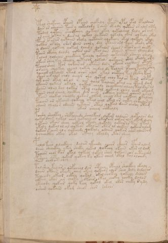

# Voynich Speculative Herbal Ferment Recipe — f58v

IMPORTANT: this is NOT a real or validated translation of the Voynich Manuscript. It is a speculative/procedural model that interprets EVA using a user-defined grammar to generate experimental recipes using safe, known edible substitutes.

This file is generated automatically from IVTFF/EVA transliteration plus a user-defined procedural grammar.



## Page / Folio
- currier: A
- folio: f58v
- page_number: 114
- section: text only

## EVA Text (Transliteration)
```text
tol shokchy opaiin opaiin chofaly ypar ypal opal opaldaiin
dair or ch'haiin tair y qotalody s aiin okeody qotair ar alor orky
todal qotain sho@246;k@191;@191;hy qokeol okey qokalchal daly ar aim
or aiin okair y dair al qokal qokaiin qokaly okar olkaly okal
faiir ofas ar qotaiin sholy qotaiin yqokaly okal qokaly okaly
qokair ar aly sho[r:s] daiin choly dal ykaiin org fchey okaly oky
y daiin qokeey qokar lchedy qokalor sheols oteor aiin cheky
taiin ckhey daldy qokair alar ytal aiin otaiin ykaiin ykaly dam
salal qolaiin chockhey tcholy qokaiin qokaiinos orcheey olaly
ykair shey key ctholy qotalom qokals qokaiin okal okaldy ory
tchol shol tor qokair or y ykaiin dory okaiir chodaiin otals
oreeey cheekey cheal qokey chedal dy tolair opchey poaly cfhy
qoeear alkeain ytal chos alor okal chcthy tal ckh'hy kar
shar air alo[r:s] chol oeear sho qotal chol tal ar tar aropam
qot oiin okal aral s air qoal talchos okal cho ytam dam
ykam qokair okaly qokal chaly cheockhey olaly taldar al
daiin alal dal qok[a:?]r otal chodol qokeal cheol chos okeeam
taiin chal sheal qockhy dar aiin ockhey qokeey qoaiin aral
okain chokal sheoldy qokor olkam cheol dar chokeey okalchy
tolain ar ykeain qokeey otal chol okal ar chhty chkalarol
olain olalor odaiin qetair otal qokal da[ir:in] oi[?:sh]y otam
okar sheey shekealy
pchshy sheoltey shopalchedy sheolkeal qokar aldaiin qokalar dal
qokal daiin qokal cham qokalcheal okor air ain ar als okam daly
qotain okeor sheey qokeol okeoly qokaly qokair or tas ykal
ykaly qokal ol al qokeos okal ar okos al shekar qokair alam
qokar s aiin al y qokchedy qo[e:?]kaly odaiin qokar char alaiinom
ycheockhy okey okal otaly okaldy okeor sheey
polal keeo o leeckhey dalar ykeeody choar ckhar yfair alam
daiin sheoikhy ykey sheky qokal qokeey okain okar ol dam
tcheor chor kar okal qokeey qokal shol qokain ar oetalchg
psheey qoty qokar qokey ky ykar cheal otal kol olchedy
qoa[ir:is] chol ar chey
tol sheo keo ar qofcheal dar aiphey opchal shockhy okaly
daiin otain okain chey okeey qokeeos olar sheo daly dalychs
tcheody oke[o:y]r ockhy qokal okal shokey qokeey dalar
olkeey okar ar choky otair otol chokey cheeky dalar
ykeeody qokar qoky keey qokol okal okor cheky sydy
oshar qokain okam shear ch[er:?] sarols
```

## Recipes Index (This Page)
- [f58v.1,@P0](#f58v-1-f58v-1-p0)
- [f58v.2,+P0](#f58v-2-f58v-2-p0)
- [f58v.3,+P0](#f58v-3-f58v-3-p0)
- [f58v.4,+P0](#f58v-4-f58v-4-p0)
- [f58v.5,+P0](#f58v-5-f58v-5-p0)
- [f58v.6,+P0](#f58v-6-f58v-6-p0)
- [f58v.7,+P0](#f58v-7-f58v-7-p0)
- [f58v.8,+P0](#f58v-8-f58v-8-p0)
- [f58v.9,+P0](#f58v-9-f58v-9-p0)
- [f58v.10,+P0](#f58v-10-f58v-10-p0)
- [f58v.11,+P0](#f58v-11-f58v-11-p0)
- [f58v.12,+P0](#f58v-12-f58v-12-p0)
- [f58v.13,+P0](#f58v-13-f58v-13-p0)
- [f58v.14,+P0](#f58v-14-f58v-14-p0)
- [f58v.15,+P0](#f58v-15-f58v-15-p0)
- [f58v.16,+P0](#f58v-16-f58v-16-p0)
- [f58v.17,+P0](#f58v-17-f58v-17-p0)
- [f58v.18,+P0](#f58v-18-f58v-18-p0)
- [f58v.19,+P0](#f58v-19-f58v-19-p0)
- [f58v.20,+P0](#f58v-20-f58v-20-p0)
- [f58v.21,+P0](#f58v-21-f58v-21-p0)
- [f58v.22,+Pc](#f58v-22-f58v-22-pc)
- [f58v.23,*P0](#f58v-23-f58v-23-p0)
- [f58v.24,+P0](#f58v-24-f58v-24-p0)
- [f58v.25,+P0](#f58v-25-f58v-25-p0)
- [f58v.26,+P0](#f58v-26-f58v-26-p0)
- [f58v.27,+P0](#f58v-27-f58v-27-p0)
- [f58v.28,+P0](#f58v-28-f58v-28-p0)
- [f58v.29,+P0](#f58v-29-f58v-29-p0)
- [f58v.30,+P0](#f58v-30-f58v-30-p0)
- [f58v.31,+P0](#f58v-31-f58v-31-p0)
- [f58v.32,+P0](#f58v-32-f58v-32-p0)
- [f58v.33,+P0](#f58v-33-f58v-33-p0)
- [f58v.34,+P0](#f58v-34-f58v-34-p0)
- [f58v.35,+P0](#f58v-35-f58v-35-p0)
- [f58v.36,+P0](#f58v-36-f58v-36-p0)
- [f58v.37,+P0](#f58v-37-f58v-37-p0)
- [f58v.38,+P0](#f58v-38-f58v-38-p0)
- [f58v.39,+P0](#f58v-39-f58v-39-p0)

## Line Glosses (Procedural Gloss Only; Not a Translation)

<a id="f58v-1-f58v-1-p0"></a>

### f58v.1,@P0

EVA: tol shokchy opaiin opaiin chofaly ypar ypal opal opaldaiin

Direct Gloss (Procedural, Not a Real Translation):
- tol: apply heat/cooking → mix / transfer
- shokchy: add fermentable sugars → add main plant (safe substitute) → add secondary herb (safe substitute) → mix / transfer
- opaiin: mix / transfer → start fermentation (yeast) → duration level 1 → state: fermentation start → long fermentation / aging phase
- opaiin: mix / transfer → start fermentation (yeast) → duration level 1 → state: fermentation start → long fermentation / aging phase
- chofaly: add main plant (safe substitute) → add aroma modifier → mix / transfer → duration level 1 → state: fermentation start
- ypar: start fermentation (yeast) → duration level 1 → state: fermentation start
- ypal: start fermentation (yeast) → duration level 1 → state: fermentation start
- opal: mix / transfer → start fermentation (yeast) → duration level 1 → state: fermentation start
- opaldaiin: mix / transfer → start fermentation (yeast) → duration level 1 → state: fermentation start → long fermentation / aging phase

<a id="f58v-2-f58v-2-p0"></a>

### f58v.2,+P0

EVA: dair or ch'haiin tair y qotalody s aiin okeody qotair ar alor orky

Direct Gloss (Procedural, Not a Real Translation):
- dair: start fermentation (yeast) → duration level 1 → state: fermentation start
- or: mix / transfer
- ch: add main plant (safe substitute)
- haiin: duration level 1 → state: fermentation start → long fermentation / aging phase
- tair: apply heat/cooking → duration level 1 → state: fermentation start
- y: [unparsed]
- qotalody: prepare liquid base → apply heat/cooking → mix / transfer → start fermentation (yeast) → duration level 1 → state: fermentation start
- s: [unparsed]
- aiin: duration level 1 → state: fermentation start → long fermentation / aging phase
- okeody: add fermentable sugars → mix / transfer → start fermentation (yeast) → duration level 1 → state: active extraction
- qotair: prepare liquid base → apply heat/cooking → duration level 1 → state: fermentation start
- ar: duration level 1 → state: fermentation start
- alor: mix / transfer → duration level 1 → state: fermentation start
- orky: add fermentable sugars → mix / transfer

<a id="f58v-3-f58v-3-p0"></a>

### f58v.3,+P0

EVA: todal qotain sho@246;k@191;@191;hy qokeol okey qokalchal daly ar aim

Direct Gloss (Procedural, Not a Real Translation):
- todal: apply heat/cooking → mix / transfer → start fermentation (yeast) → duration level 1 → state: fermentation start
- qotain: prepare liquid base → apply heat/cooking → duration level 1 → state: fermentation start
- sho: add secondary herb (safe substitute) → mix / transfer
- k: add fermentable sugars
- hy: [unparsed]
- qokeol: prepare liquid base → add fermentable sugars → mix / transfer → duration level 1 → state: active extraction
- okey: add fermentable sugars → mix / transfer → duration level 1 → state: active extraction
- qokalchal: prepare liquid base → add fermentable sugars → add main plant (safe substitute) → duration level 1 → state: fermentation start
- daly: start fermentation (yeast) → duration level 1 → state: fermentation start
- ar: duration level 1 → state: fermentation start
- aim: duration level 1 → state: fermentation start

<a id="f58v-4-f58v-4-p0"></a>

### f58v.4,+P0

EVA: or aiin okair y dair al qokal qokaiin qokaly okar olkaly okal

Direct Gloss (Procedural, Not a Real Translation):
- or: mix / transfer
- aiin: duration level 1 → state: fermentation start → long fermentation / aging phase
- okair: add fermentable sugars → mix / transfer → duration level 1 → state: fermentation start
- y: [unparsed]
- dair: start fermentation (yeast) → duration level 1 → state: fermentation start
- al: duration level 1 → state: fermentation start
- qokal: prepare liquid base → add fermentable sugars → duration level 1 → state: fermentation start
- qokaiin: prepare liquid base → add fermentable sugars → duration level 1 → state: fermentation start → long fermentation / aging phase
- qokaly: prepare liquid base → add fermentable sugars → duration level 1 → state: fermentation start
- okar: add fermentable sugars → mix / transfer → duration level 1 → state: fermentation start
- olkaly: add fermentable sugars → mix / transfer → duration level 1 → state: fermentation start
- okal: add fermentable sugars → mix / transfer → duration level 1 → state: fermentation start

<a id="f58v-5-f58v-5-p0"></a>

### f58v.5,+P0

EVA: faiir ofas ar qotaiin sholy qotaiin yqokaly okal qokaly okaly

Direct Gloss (Procedural, Not a Real Translation):
- faiir: add aroma modifier → duration level 1 → state: fermentation start
- ofas: add aroma modifier → mix / transfer → duration level 1 → state: fermentation start
- ar: duration level 1 → state: fermentation start
- qotaiin: prepare liquid base → apply heat/cooking → duration level 1 → state: fermentation start → long fermentation / aging phase
- sholy: add secondary herb (safe substitute) → mix / transfer
- qotaiin: prepare liquid base → apply heat/cooking → duration level 1 → state: fermentation start → long fermentation / aging phase
- yqokaly: prepare liquid base → add fermentable sugars → duration level 1 → state: fermentation start
- okal: add fermentable sugars → mix / transfer → duration level 1 → state: fermentation start
- qokaly: prepare liquid base → add fermentable sugars → duration level 1 → state: fermentation start
- okaly: add fermentable sugars → mix / transfer → duration level 1 → state: fermentation start

<a id="f58v-6-f58v-6-p0"></a>

### f58v.6,+P0

EVA: qokair ar aly sho[r:s] daiin choly dal ykaiin org fchey okaly oky

Direct Gloss (Procedural, Not a Real Translation):
- qokair: prepare liquid base → add fermentable sugars → duration level 1 → state: fermentation start
- ar: duration level 1 → state: fermentation start
- aly: duration level 1 → state: fermentation start
- sho: add secondary herb (safe substitute) → mix / transfer
- r: [unparsed]
- s: [unparsed]
- daiin: start fermentation (yeast) → duration level 1 → state: fermentation start → long fermentation / aging phase
- choly: add main plant (safe substitute) → mix / transfer
- dal: start fermentation (yeast) → duration level 1 → state: fermentation start
- ykaiin: add fermentable sugars → duration level 1 → state: fermentation start → long fermentation / aging phase
- org: mix / transfer
- fchey: add main plant (safe substitute) → add aroma modifier → duration level 1 → state: active extraction
- okaly: add fermentable sugars → mix / transfer → duration level 1 → state: fermentation start
- oky: add fermentable sugars → mix / transfer

<a id="f58v-7-f58v-7-p0"></a>

### f58v.7,+P0

EVA: y daiin qokeey qokar lchedy qokalor sheols oteor aiin cheky

Direct Gloss (Procedural, Not a Real Translation):
- y: [unparsed]
- daiin: start fermentation (yeast) → duration level 1 → state: fermentation start → long fermentation / aging phase
- qokeey: prepare liquid base → add fermentable sugars → duration level 2 → state: active extraction
- qokar: prepare liquid base → add fermentable sugars → duration level 1 → state: fermentation start
- lchedy: add main plant (safe substitute) → start fermentation (yeast) → duration level 1 → state: active extraction
- qokalor: prepare liquid base → add fermentable sugars → mix / transfer → duration level 1 → state: fermentation start
- sheols: add secondary herb (safe substitute) → mix / transfer → duration level 1 → state: active extraction
- oteor: apply heat/cooking → mix / transfer → duration level 1 → state: active extraction
- aiin: duration level 1 → state: fermentation start → long fermentation / aging phase
- cheky: add fermentable sugars → add main plant (safe substitute) → duration level 1 → state: active extraction

<a id="f58v-8-f58v-8-p0"></a>

### f58v.8,+P0

EVA: taiin ckhey daldy qokair alar ytal aiin otaiin ykaiin ykaly dam

Direct Gloss (Procedural, Not a Real Translation):
- taiin: apply heat/cooking → duration level 1 → state: fermentation start → long fermentation / aging phase
- ckhey: add complex herbal compound (safe blend) → duration level 1 → state: active extraction
- daldy: start fermentation (yeast) → duration level 1 → state: fermentation start
- qokair: prepare liquid base → add fermentable sugars → duration level 1 → state: fermentation start
- alar: duration level 1 → state: fermentation start
- ytal: apply heat/cooking → duration level 1 → state: fermentation start
- aiin: duration level 1 → state: fermentation start → long fermentation / aging phase
- otaiin: apply heat/cooking → mix / transfer → duration level 1 → state: fermentation start → long fermentation / aging phase
- ykaiin: add fermentable sugars → duration level 1 → state: fermentation start → long fermentation / aging phase
- ykaly: add fermentable sugars → duration level 1 → state: fermentation start
- dam: start fermentation (yeast) → duration level 1 → state: fermentation start

<a id="f58v-9-f58v-9-p0"></a>

### f58v.9,+P0

EVA: salal qolaiin chockhey tcholy qokaiin qokaiinos orcheey olaly

Direct Gloss (Procedural, Not a Real Translation):
- salal: duration level 1 → state: fermentation start
- qolaiin: prepare liquid base → duration level 1 → state: fermentation start → long fermentation / aging phase
- chockhey: add main plant (safe substitute) → mix / transfer → add complex herbal compound (safe blend) → duration level 1 → state: active extraction
- tcholy: apply heat/cooking → add main plant (safe substitute) → mix / transfer
- qokaiin: prepare liquid base → add fermentable sugars → duration level 1 → state: fermentation start → long fermentation / aging phase
- qokaiinos: prepare liquid base → add fermentable sugars → mix / transfer → duration level 1 → state: fermentation start → long fermentation / aging phase
- orcheey: add main plant (safe substitute) → mix / transfer → duration level 2 → state: active extraction
- olaly: mix / transfer → duration level 1 → state: fermentation start

<a id="f58v-10-f58v-10-p0"></a>

### f58v.10,+P0

EVA: ykair shey key ctholy qotalom qokals qokaiin okal okaldy ory

Direct Gloss (Procedural, Not a Real Translation):
- ykair: add fermentable sugars → duration level 1 → state: fermentation start
- shey: add secondary herb (safe substitute) → duration level 1 → state: active extraction
- key: add fermentable sugars → duration level 1 → state: active extraction
- ctholy: mix / transfer → add complex herbal compound (safe blend)
- qotalom: prepare liquid base → apply heat/cooking → mix / transfer → duration level 1 → state: fermentation start
- qokals: prepare liquid base → add fermentable sugars → duration level 1 → state: fermentation start
- qokaiin: prepare liquid base → add fermentable sugars → duration level 1 → state: fermentation start → long fermentation / aging phase
- okal: add fermentable sugars → mix / transfer → duration level 1 → state: fermentation start
- okaldy: add fermentable sugars → mix / transfer → start fermentation (yeast) → duration level 1 → state: fermentation start
- ory: mix / transfer

<a id="f58v-11-f58v-11-p0"></a>

### f58v.11,+P0

EVA: tchol shol tor qokair or y ykaiin dory okaiir chodaiin otals

Direct Gloss (Procedural, Not a Real Translation):
- tchol: apply heat/cooking → add main plant (safe substitute) → mix / transfer
- shol: add secondary herb (safe substitute) → mix / transfer
- tor: apply heat/cooking → mix / transfer
- qokair: prepare liquid base → add fermentable sugars → duration level 1 → state: fermentation start
- or: mix / transfer
- y: [unparsed]
- ykaiin: add fermentable sugars → duration level 1 → state: fermentation start → long fermentation / aging phase
- dory: mix / transfer → start fermentation (yeast)
- okaiir: add fermentable sugars → mix / transfer → duration level 1 → state: fermentation start
- chodaiin: add main plant (safe substitute) → mix / transfer → start fermentation (yeast) → duration level 1 → state: fermentation start → long fermentation / aging phase
- otals: apply heat/cooking → mix / transfer → duration level 1 → state: fermentation start

<a id="f58v-12-f58v-12-p0"></a>

### f58v.12,+P0

EVA: oreeey cheekey cheal qokey chedal dy tolair opchey poaly cfhy

Direct Gloss (Procedural, Not a Real Translation):
- oreeey: mix / transfer → duration level 3 → state: active extraction
- cheekey: add fermentable sugars → add main plant (safe substitute) → duration level 2 → state: active extraction
- cheal: add main plant (safe substitute) → duration level 1 → state: active extraction
- qokey: prepare liquid base → add fermentable sugars → duration level 1 → state: active extraction
- chedal: add main plant (safe substitute) → start fermentation (yeast) → duration level 1 → state: active extraction
- dy: start fermentation (yeast)
- tolair: apply heat/cooking → mix / transfer → duration level 1 → state: fermentation start
- opchey: add main plant (safe substitute) → mix / transfer → start fermentation (yeast) → duration level 1 → state: active extraction
- poaly: mix / transfer → start fermentation (yeast) → duration level 1 → state: fermentation start
- cfhy: add complex herbal compound (safe blend)

<a id="f58v-13-f58v-13-p0"></a>

### f58v.13,+P0

EVA: qoeear alkeain ytal chos alor okal chcthy tal ckh'hy kar

Direct Gloss (Procedural, Not a Real Translation):
- qoeear: prepare liquid base → duration level 2 → state: active extraction
- alkeain: add fermentable sugars → duration level 1 → state: fermentation start
- ytal: apply heat/cooking → duration level 1 → state: fermentation start
- chos: add main plant (safe substitute) → mix / transfer
- alor: mix / transfer → duration level 1 → state: fermentation start
- okal: add fermentable sugars → mix / transfer → duration level 1 → state: fermentation start
- chcthy: add main plant (safe substitute) → add complex herbal compound (safe blend)
- tal: apply heat/cooking → duration level 1 → state: fermentation start
- ckh: add complex herbal compound (safe blend)
- hy: [unparsed]
- kar: add fermentable sugars → duration level 1 → state: fermentation start

<a id="f58v-14-f58v-14-p0"></a>

### f58v.14,+P0

EVA: shar air alo[r:s] chol oeear sho qotal chol tal ar tar aropam

Direct Gloss (Procedural, Not a Real Translation):
- shar: add secondary herb (safe substitute) → duration level 1 → state: fermentation start
- air: duration level 1 → state: fermentation start
- alo: mix / transfer → duration level 1 → state: fermentation start
- r: [unparsed]
- s: [unparsed]
- chol: add main plant (safe substitute) → mix / transfer
- oeear: mix / transfer → duration level 2 → state: active extraction
- sho: add secondary herb (safe substitute) → mix / transfer
- qotal: prepare liquid base → apply heat/cooking → duration level 1 → state: fermentation start
- chol: add main plant (safe substitute) → mix / transfer
- tal: apply heat/cooking → duration level 1 → state: fermentation start
- ar: duration level 1 → state: fermentation start
- tar: apply heat/cooking → duration level 1 → state: fermentation start
- aropam: mix / transfer → start fermentation (yeast) → duration level 1 → state: fermentation start

<a id="f58v-15-f58v-15-p0"></a>

### f58v.15,+P0

EVA: qot oiin okal aral s air qoal talchos okal cho ytam dam

Direct Gloss (Procedural, Not a Real Translation):
- qot: prepare liquid base → apply heat/cooking
- oiin: mix / transfer → duration level 2 → state: cooling/rest → medium fermentation phase
- okal: add fermentable sugars → mix / transfer → duration level 1 → state: fermentation start
- aral: duration level 1 → state: fermentation start
- s: [unparsed]
- air: duration level 1 → state: fermentation start
- qoal: prepare liquid base → duration level 1 → state: fermentation start
- talchos: apply heat/cooking → add main plant (safe substitute) → mix / transfer → duration level 1 → state: fermentation start
- okal: add fermentable sugars → mix / transfer → duration level 1 → state: fermentation start
- cho: add main plant (safe substitute) → mix / transfer
- ytam: apply heat/cooking → duration level 1 → state: fermentation start
- dam: start fermentation (yeast) → duration level 1 → state: fermentation start

<a id="f58v-16-f58v-16-p0"></a>

### f58v.16,+P0

EVA: ykam qokair okaly qokal chaly cheockhey olaly taldar al

Direct Gloss (Procedural, Not a Real Translation):
- ykam: add fermentable sugars → duration level 1 → state: fermentation start
- qokair: prepare liquid base → add fermentable sugars → duration level 1 → state: fermentation start
- okaly: add fermentable sugars → mix / transfer → duration level 1 → state: fermentation start
- qokal: prepare liquid base → add fermentable sugars → duration level 1 → state: fermentation start
- chaly: add main plant (safe substitute) → duration level 1 → state: fermentation start
- cheockhey: add main plant (safe substitute) → mix / transfer → add complex herbal compound (safe blend) → duration level 1 → state: active extraction
- olaly: mix / transfer → duration level 1 → state: fermentation start
- taldar: apply heat/cooking → start fermentation (yeast) → duration level 1 → state: fermentation start
- al: duration level 1 → state: fermentation start

<a id="f58v-17-f58v-17-p0"></a>

### f58v.17,+P0

EVA: daiin alal dal qok[a:?]r otal chodol qokeal cheol chos okeeam

Direct Gloss (Procedural, Not a Real Translation):
- daiin: start fermentation (yeast) → duration level 1 → state: fermentation start → long fermentation / aging phase
- alal: duration level 1 → state: fermentation start
- dal: start fermentation (yeast) → duration level 1 → state: fermentation start
- qok: prepare liquid base → add fermentable sugars
- a: duration level 1 → state: fermentation start
- r: [unparsed]
- otal: apply heat/cooking → mix / transfer → duration level 1 → state: fermentation start
- chodol: add main plant (safe substitute) → mix / transfer → start fermentation (yeast)
- qokeal: prepare liquid base → add fermentable sugars → duration level 1 → state: active extraction
- cheol: add main plant (safe substitute) → mix / transfer → duration level 1 → state: active extraction
- chos: add main plant (safe substitute) → mix / transfer
- okeeam: add fermentable sugars → mix / transfer → duration level 2 → state: active extraction

<a id="f58v-18-f58v-18-p0"></a>

### f58v.18,+P0

EVA: taiin chal sheal qockhy dar aiin ockhey qokeey qoaiin aral

Direct Gloss (Procedural, Not a Real Translation):
- taiin: apply heat/cooking → duration level 1 → state: fermentation start → long fermentation / aging phase
- chal: add main plant (safe substitute) → duration level 1 → state: fermentation start
- sheal: add secondary herb (safe substitute) → duration level 1 → state: active extraction
- qockhy: prepare liquid base → add complex herbal compound (safe blend)
- dar: start fermentation (yeast) → duration level 1 → state: fermentation start
- aiin: duration level 1 → state: fermentation start → long fermentation / aging phase
- ockhey: mix / transfer → add complex herbal compound (safe blend) → duration level 1 → state: active extraction
- qokeey: prepare liquid base → add fermentable sugars → duration level 2 → state: active extraction
- qoaiin: prepare liquid base → duration level 1 → state: fermentation start → long fermentation / aging phase
- aral: duration level 1 → state: fermentation start

<a id="f58v-19-f58v-19-p0"></a>

### f58v.19,+P0

EVA: okain chokal sheoldy qokor olkam cheol dar chokeey okalchy

Direct Gloss (Procedural, Not a Real Translation):
- okain: add fermentable sugars → mix / transfer → duration level 1 → state: fermentation start
- chokal: add fermentable sugars → add main plant (safe substitute) → mix / transfer → duration level 1 → state: fermentation start
- sheoldy: add secondary herb (safe substitute) → mix / transfer → start fermentation (yeast) → duration level 1 → state: active extraction
- qokor: prepare liquid base → add fermentable sugars → mix / transfer
- olkam: add fermentable sugars → mix / transfer → duration level 1 → state: fermentation start
- cheol: add main plant (safe substitute) → mix / transfer → duration level 1 → state: active extraction
- dar: start fermentation (yeast) → duration level 1 → state: fermentation start
- chokeey: add fermentable sugars → add main plant (safe substitute) → mix / transfer → duration level 2 → state: active extraction
- okalchy: add fermentable sugars → add main plant (safe substitute) → mix / transfer → duration level 1 → state: fermentation start

<a id="f58v-20-f58v-20-p0"></a>

### f58v.20,+P0

EVA: tolain ar ykeain qokeey otal chol okal ar chhty chkalarol

Direct Gloss (Procedural, Not a Real Translation):
- tolain: apply heat/cooking → mix / transfer → duration level 1 → state: fermentation start
- ar: duration level 1 → state: fermentation start
- ykeain: add fermentable sugars → duration level 1 → state: active extraction
- qokeey: prepare liquid base → add fermentable sugars → duration level 2 → state: active extraction
- otal: apply heat/cooking → mix / transfer → duration level 1 → state: fermentation start
- chol: add main plant (safe substitute) → mix / transfer
- okal: add fermentable sugars → mix / transfer → duration level 1 → state: fermentation start
- ar: duration level 1 → state: fermentation start
- chhty: apply heat/cooking → add main plant (safe substitute)
- chkalarol: add fermentable sugars → add main plant (safe substitute) → mix / transfer → duration level 1 → state: fermentation start

<a id="f58v-21-f58v-21-p0"></a>

### f58v.21,+P0

EVA: olain olalor odaiin qetair otal qokal da[ir:in] oi[?:sh]y otam

Direct Gloss (Procedural, Not a Real Translation):
- olain: mix / transfer → duration level 1 → state: fermentation start
- olalor: mix / transfer → duration level 1 → state: fermentation start
- odaiin: mix / transfer → start fermentation (yeast) → duration level 1 → state: fermentation start → long fermentation / aging phase
- qetair: prepare base (generic) → apply heat/cooking → duration level 1 → state: active extraction
- otal: apply heat/cooking → mix / transfer → duration level 1 → state: fermentation start
- qokal: prepare liquid base → add fermentable sugars → duration level 1 → state: fermentation start
- da: start fermentation (yeast) → duration level 1 → state: fermentation start
- ir: duration level 1 → state: cooling/rest
- in: duration level 1 → state: cooling/rest
- oi: mix / transfer → duration level 1 → state: cooling/rest
- sh: add secondary herb (safe substitute)
- y: [unparsed]
- otam: apply heat/cooking → mix / transfer → duration level 1 → state: fermentation start

<a id="f58v-22-f58v-22-pc"></a>

### f58v.22,+Pc

EVA: okar sheey shekealy

Direct Gloss (Procedural, Not a Real Translation):
- okar: add fermentable sugars → mix / transfer → duration level 1 → state: fermentation start
- sheey: add secondary herb (safe substitute) → duration level 2 → state: active extraction
- shekealy: add fermentable sugars → add secondary herb (safe substitute) → duration level 1 → state: active extraction

<a id="f58v-23-f58v-23-p0"></a>

### f58v.23,*P0

EVA: pchshy sheoltey shopalchedy sheolkeal qokar aldaiin qokalar dal

Direct Gloss (Procedural, Not a Real Translation):
- pchshy: add main plant (safe substitute) → add secondary herb (safe substitute) → start fermentation (yeast)
- sheoltey: apply heat/cooking → add secondary herb (safe substitute) → mix / transfer → duration level 1 → state: active extraction
- shopalchedy: add main plant (safe substitute) → add secondary herb (safe substitute) → mix / transfer → start fermentation (yeast) → duration level 1 → state: fermentation start
- sheolkeal: add fermentable sugars → add secondary herb (safe substitute) → mix / transfer → duration level 1 → state: active extraction
- qokar: prepare liquid base → add fermentable sugars → duration level 1 → state: fermentation start
- aldaiin: start fermentation (yeast) → duration level 1 → state: fermentation start → long fermentation / aging phase
- qokalar: prepare liquid base → add fermentable sugars → duration level 1 → state: fermentation start
- dal: start fermentation (yeast) → duration level 1 → state: fermentation start

<a id="f58v-24-f58v-24-p0"></a>

### f58v.24,+P0

EVA: qokal daiin qokal cham qokalcheal okor air ain ar als okam daly

Direct Gloss (Procedural, Not a Real Translation):
- qokal: prepare liquid base → add fermentable sugars → duration level 1 → state: fermentation start
- daiin: start fermentation (yeast) → duration level 1 → state: fermentation start → long fermentation / aging phase
- qokal: prepare liquid base → add fermentable sugars → duration level 1 → state: fermentation start
- cham: add main plant (safe substitute) → duration level 1 → state: fermentation start
- qokalcheal: prepare liquid base → add fermentable sugars → add main plant (safe substitute) → duration level 1 → state: fermentation start
- okor: add fermentable sugars → mix / transfer
- air: duration level 1 → state: fermentation start
- ain: duration level 1 → state: fermentation start
- ar: duration level 1 → state: fermentation start
- als: duration level 1 → state: fermentation start
- okam: add fermentable sugars → mix / transfer → duration level 1 → state: fermentation start
- daly: start fermentation (yeast) → duration level 1 → state: fermentation start

<a id="f58v-25-f58v-25-p0"></a>

### f58v.25,+P0

EVA: qotain okeor sheey qokeol okeoly qokaly qokair or tas ykal

Direct Gloss (Procedural, Not a Real Translation):
- qotain: prepare liquid base → apply heat/cooking → duration level 1 → state: fermentation start
- okeor: add fermentable sugars → mix / transfer → duration level 1 → state: active extraction
- sheey: add secondary herb (safe substitute) → duration level 2 → state: active extraction
- qokeol: prepare liquid base → add fermentable sugars → mix / transfer → duration level 1 → state: active extraction
- okeoly: add fermentable sugars → mix / transfer → duration level 1 → state: active extraction
- qokaly: prepare liquid base → add fermentable sugars → duration level 1 → state: fermentation start
- qokair: prepare liquid base → add fermentable sugars → duration level 1 → state: fermentation start
- or: mix / transfer
- tas: apply heat/cooking → duration level 1 → state: fermentation start
- ykal: add fermentable sugars → duration level 1 → state: fermentation start

<a id="f58v-26-f58v-26-p0"></a>

### f58v.26,+P0

EVA: ykaly qokal ol al qokeos okal ar okos al shekar qokair alam

Direct Gloss (Procedural, Not a Real Translation):
- ykaly: add fermentable sugars → duration level 1 → state: fermentation start
- qokal: prepare liquid base → add fermentable sugars → duration level 1 → state: fermentation start
- ol: mix / transfer
- al: duration level 1 → state: fermentation start
- qokeos: prepare liquid base → add fermentable sugars → mix / transfer → duration level 1 → state: active extraction
- okal: add fermentable sugars → mix / transfer → duration level 1 → state: fermentation start
- ar: duration level 1 → state: fermentation start
- okos: add fermentable sugars → mix / transfer
- al: duration level 1 → state: fermentation start
- shekar: add fermentable sugars → add secondary herb (safe substitute) → duration level 1 → state: active extraction
- qokair: prepare liquid base → add fermentable sugars → duration level 1 → state: fermentation start
- alam: duration level 1 → state: fermentation start

<a id="f58v-27-f58v-27-p0"></a>

### f58v.27,+P0

EVA: qokar s aiin al y qokchedy qo[e:?]kaly odaiin qokar char alaiinom

Direct Gloss (Procedural, Not a Real Translation):
- qokar: prepare liquid base → add fermentable sugars → duration level 1 → state: fermentation start
- s: [unparsed]
- aiin: duration level 1 → state: fermentation start → long fermentation / aging phase
- al: duration level 1 → state: fermentation start
- y: [unparsed]
- qokchedy: prepare liquid base → add fermentable sugars → add main plant (safe substitute) → start fermentation (yeast) → duration level 1 → state: active extraction
- qo: prepare liquid base
- e: duration level 1 → state: active extraction
- kaly: add fermentable sugars → duration level 1 → state: fermentation start
- odaiin: mix / transfer → start fermentation (yeast) → duration level 1 → state: fermentation start → long fermentation / aging phase
- qokar: prepare liquid base → add fermentable sugars → duration level 1 → state: fermentation start
- char: add main plant (safe substitute) → duration level 1 → state: fermentation start
- alaiinom: mix / transfer → duration level 1 → state: fermentation start → long fermentation / aging phase

<a id="f58v-28-f58v-28-p0"></a>

### f58v.28,+P0

EVA: ycheockhy okey okal otaly okaldy okeor sheey

Direct Gloss (Procedural, Not a Real Translation):
- ycheockhy: add main plant (safe substitute) → mix / transfer → add complex herbal compound (safe blend) → duration level 1 → state: active extraction
- okey: add fermentable sugars → mix / transfer → duration level 1 → state: active extraction
- okal: add fermentable sugars → mix / transfer → duration level 1 → state: fermentation start
- otaly: apply heat/cooking → mix / transfer → duration level 1 → state: fermentation start
- okaldy: add fermentable sugars → mix / transfer → start fermentation (yeast) → duration level 1 → state: fermentation start
- okeor: add fermentable sugars → mix / transfer → duration level 1 → state: active extraction
- sheey: add secondary herb (safe substitute) → duration level 2 → state: active extraction

<a id="f58v-29-f58v-29-p0"></a>

### f58v.29,+P0

EVA: polal keeo o leeckhey dalar ykeeody choar ckhar yfair alam

Direct Gloss (Procedural, Not a Real Translation):
- polal: mix / transfer → start fermentation (yeast) → duration level 1 → state: fermentation start
- keeo: add fermentable sugars → mix / transfer → duration level 2 → state: active extraction
- o: mix / transfer
- leeckhey: add complex herbal compound (safe blend) → duration level 2 → state: active extraction
- dalar: start fermentation (yeast) → duration level 1 → state: fermentation start
- ykeeody: add fermentable sugars → mix / transfer → start fermentation (yeast) → duration level 2 → state: active extraction
- choar: add main plant (safe substitute) → mix / transfer → duration level 1 → state: fermentation start
- ckhar: add complex herbal compound (safe blend) → duration level 1 → state: fermentation start
- yfair: add aroma modifier → duration level 1 → state: fermentation start
- alam: duration level 1 → state: fermentation start

<a id="f58v-30-f58v-30-p0"></a>

### f58v.30,+P0

EVA: daiin sheoikhy ykey sheky qokal qokeey okain okar ol dam

Direct Gloss (Procedural, Not a Real Translation):
- daiin: start fermentation (yeast) → duration level 1 → state: fermentation start → long fermentation / aging phase
- sheoikhy: add fermentable sugars → add secondary herb (safe substitute) → mix / transfer → duration level 1 → state: active extraction
- ykey: add fermentable sugars → duration level 1 → state: active extraction
- sheky: add fermentable sugars → add secondary herb (safe substitute) → duration level 1 → state: active extraction
- qokal: prepare liquid base → add fermentable sugars → duration level 1 → state: fermentation start
- qokeey: prepare liquid base → add fermentable sugars → duration level 2 → state: active extraction
- okain: add fermentable sugars → mix / transfer → duration level 1 → state: fermentation start
- okar: add fermentable sugars → mix / transfer → duration level 1 → state: fermentation start
- ol: mix / transfer
- dam: start fermentation (yeast) → duration level 1 → state: fermentation start

<a id="f58v-31-f58v-31-p0"></a>

### f58v.31,+P0

EVA: tcheor chor kar okal qokeey qokal shol qokain ar oetalchg

Direct Gloss (Procedural, Not a Real Translation):
- tcheor: apply heat/cooking → add main plant (safe substitute) → mix / transfer → duration level 1 → state: active extraction
- chor: add main plant (safe substitute) → mix / transfer
- kar: add fermentable sugars → duration level 1 → state: fermentation start
- okal: add fermentable sugars → mix / transfer → duration level 1 → state: fermentation start
- qokeey: prepare liquid base → add fermentable sugars → duration level 2 → state: active extraction
- qokal: prepare liquid base → add fermentable sugars → duration level 1 → state: fermentation start
- shol: add secondary herb (safe substitute) → mix / transfer
- qokain: prepare liquid base → add fermentable sugars → duration level 1 → state: fermentation start
- ar: duration level 1 → state: fermentation start
- oetalchg: apply heat/cooking → add main plant (safe substitute) → mix / transfer → duration level 1 → state: active extraction

<a id="f58v-32-f58v-32-p0"></a>

### f58v.32,+P0

EVA: psheey qoty qokar qokey ky ykar cheal otal kol olchedy

Direct Gloss (Procedural, Not a Real Translation):
- psheey: add secondary herb (safe substitute) → start fermentation (yeast) → duration level 2 → state: active extraction
- qoty: prepare liquid base → apply heat/cooking
- qokar: prepare liquid base → add fermentable sugars → duration level 1 → state: fermentation start
- qokey: prepare liquid base → add fermentable sugars → duration level 1 → state: active extraction
- ky: add fermentable sugars
- ykar: add fermentable sugars → duration level 1 → state: fermentation start
- cheal: add main plant (safe substitute) → duration level 1 → state: active extraction
- otal: apply heat/cooking → mix / transfer → duration level 1 → state: fermentation start
- kol: add fermentable sugars → mix / transfer
- olchedy: add main plant (safe substitute) → mix / transfer → start fermentation (yeast) → duration level 1 → state: active extraction

<a id="f58v-33-f58v-33-p0"></a>

### f58v.33,+P0

EVA: qoa[ir:is] chol ar chey

Direct Gloss (Procedural, Not a Real Translation):
- qoa: prepare liquid base → duration level 1 → state: fermentation start
- ir: duration level 1 → state: cooling/rest
- is: duration level 1 → state: cooling/rest
- chol: add main plant (safe substitute) → mix / transfer
- ar: duration level 1 → state: fermentation start
- chey: add main plant (safe substitute) → duration level 1 → state: active extraction

<a id="f58v-34-f58v-34-p0"></a>

### f58v.34,+P0

EVA: tol sheo keo ar qofcheal dar aiphey opchal shockhy okaly

Direct Gloss (Procedural, Not a Real Translation):
- tol: apply heat/cooking → mix / transfer
- sheo: add secondary herb (safe substitute) → mix / transfer → duration level 1 → state: active extraction
- keo: add fermentable sugars → mix / transfer → duration level 1 → state: active extraction
- ar: duration level 1 → state: fermentation start
- qofcheal: prepare liquid base → add main plant (safe substitute) → add aroma modifier → duration level 1 → state: active extraction
- dar: start fermentation (yeast) → duration level 1 → state: fermentation start
- aiphey: start fermentation (yeast) → duration level 1 → state: fermentation start
- opchal: add main plant (safe substitute) → mix / transfer → start fermentation (yeast) → duration level 1 → state: fermentation start
- shockhy: add secondary herb (safe substitute) → mix / transfer → add complex herbal compound (safe blend)
- okaly: add fermentable sugars → mix / transfer → duration level 1 → state: fermentation start

<a id="f58v-35-f58v-35-p0"></a>

### f58v.35,+P0

EVA: daiin otain okain chey okeey qokeeos olar sheo daly dalychs

Direct Gloss (Procedural, Not a Real Translation):
- daiin: start fermentation (yeast) → duration level 1 → state: fermentation start → long fermentation / aging phase
- otain: apply heat/cooking → mix / transfer → duration level 1 → state: fermentation start
- okain: add fermentable sugars → mix / transfer → duration level 1 → state: fermentation start
- chey: add main plant (safe substitute) → duration level 1 → state: active extraction
- okeey: add fermentable sugars → mix / transfer → duration level 2 → state: active extraction
- qokeeos: prepare liquid base → add fermentable sugars → mix / transfer → duration level 2 → state: active extraction
- olar: mix / transfer → duration level 1 → state: fermentation start
- sheo: add secondary herb (safe substitute) → mix / transfer → duration level 1 → state: active extraction
- daly: start fermentation (yeast) → duration level 1 → state: fermentation start
- dalychs: add main plant (safe substitute) → start fermentation (yeast) → duration level 1 → state: fermentation start

<a id="f58v-36-f58v-36-p0"></a>

### f58v.36,+P0

EVA: tcheody oke[o:y]r ockhy qokal okal shokey qokeey dalar

Direct Gloss (Procedural, Not a Real Translation):
- tcheody: apply heat/cooking → add main plant (safe substitute) → mix / transfer → start fermentation (yeast) → duration level 1 → state: active extraction
- oke: add fermentable sugars → mix / transfer → duration level 1 → state: active extraction
- o: mix / transfer
- y: [unparsed]
- r: [unparsed]
- ockhy: mix / transfer → add complex herbal compound (safe blend)
- qokal: prepare liquid base → add fermentable sugars → duration level 1 → state: fermentation start
- okal: add fermentable sugars → mix / transfer → duration level 1 → state: fermentation start
- shokey: add fermentable sugars → add secondary herb (safe substitute) → mix / transfer → duration level 1 → state: active extraction
- qokeey: prepare liquid base → add fermentable sugars → duration level 2 → state: active extraction
- dalar: start fermentation (yeast) → duration level 1 → state: fermentation start

<a id="f58v-37-f58v-37-p0"></a>

### f58v.37,+P0

EVA: olkeey okar ar choky otair otol chokey cheeky dalar

Direct Gloss (Procedural, Not a Real Translation):
- olkeey: add fermentable sugars → mix / transfer → duration level 2 → state: active extraction
- okar: add fermentable sugars → mix / transfer → duration level 1 → state: fermentation start
- ar: duration level 1 → state: fermentation start
- choky: add fermentable sugars → add main plant (safe substitute) → mix / transfer
- otair: apply heat/cooking → mix / transfer → duration level 1 → state: fermentation start
- otol: apply heat/cooking → mix / transfer
- chokey: add fermentable sugars → add main plant (safe substitute) → mix / transfer → duration level 1 → state: active extraction
- cheeky: add fermentable sugars → add main plant (safe substitute) → duration level 2 → state: active extraction
- dalar: start fermentation (yeast) → duration level 1 → state: fermentation start

<a id="f58v-38-f58v-38-p0"></a>

### f58v.38,+P0

EVA: ykeeody qokar qoky keey qokol okal okor cheky sydy

Direct Gloss (Procedural, Not a Real Translation):
- ykeeody: add fermentable sugars → mix / transfer → start fermentation (yeast) → duration level 2 → state: active extraction
- qokar: prepare liquid base → add fermentable sugars → duration level 1 → state: fermentation start
- qoky: prepare liquid base → add fermentable sugars
- keey: add fermentable sugars → duration level 2 → state: active extraction
- qokol: prepare liquid base → add fermentable sugars → mix / transfer
- okal: add fermentable sugars → mix / transfer → duration level 1 → state: fermentation start
- okor: add fermentable sugars → mix / transfer
- cheky: add fermentable sugars → add main plant (safe substitute) → duration level 1 → state: active extraction
- sydy: start fermentation (yeast)

<a id="f58v-39-f58v-39-p0"></a>

### f58v.39,+P0

EVA: oshar qokain okam shear ch[er:?] sarols

Direct Gloss (Procedural, Not a Real Translation):
- oshar: add secondary herb (safe substitute) → mix / transfer → duration level 1 → state: fermentation start
- qokain: prepare liquid base → add fermentable sugars → duration level 1 → state: fermentation start
- okam: add fermentable sugars → mix / transfer → duration level 1 → state: fermentation start
- shear: add secondary herb (safe substitute) → duration level 1 → state: active extraction
- ch: add main plant (safe substitute)
- er: duration level 1 → state: active extraction
- sarols: mix / transfer → duration level 1 → state: fermentation start
