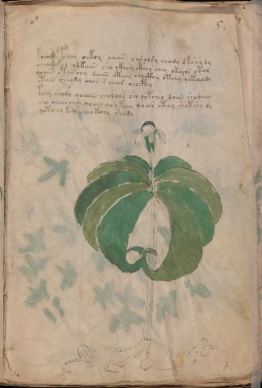

# Voynich Speculative Herbal Ferment Recipe — f5r

IMPORTANT: this is NOT a real or validated translation of the Voynich Manuscript. It is a speculative/procedural model that interprets EVA using a user-defined grammar to generate experimental recipes using safe, known edible substitutes.

This file is generated automatically from IVTFF/EVA transliteration plus a user-defined procedural grammar.



## Page / Folio
- currier: A
- folio: f5r
- page_number: 9
- plant_candidates: ['Herba Paris', 'Indian Cucumber?']
- plant_category_confidence: 0.95
- plant_category_guess: root
- plant_category_matches: ['cucumber']
- plant_id: [Herba] Paris, Indian Cucumber?
- section: herbal

## Plant Interpretation (Heuristic)
- category: root
- confidence: 0.95
- note: Heuristic classification based on the IVTFF 'Plant ID' string (not the drawing). Does not imply real identification of the manuscript plant.
- textual_evidence_terms: ['cucumber']

## EVA Text (Transliteration)
```text
kchody fchoy chkoy oaiin oar olsy chody dkshy dy
ochey okey qokaiin sho ckhoy cthey chey ok[a:y]@131;os otol
qoaiin otan chy daiin oteeeb chocthy otchy qotchody
otain sheody chan s cheor chocthy
tchy shody qoaiin cholols sho qotcheo daiin shodaiin
sho cheor chey qoeeey qoykeeey qoeor cthy shotshy dy
qotoeey keey cheo kchy shody
```

## Page Summary (Procedural, Aggregated)
- compound_counts: {'sugars': 9, 'main herb': 20, 'mix/transfer': 37, 'yeast fermentation': 12, 'aroma modifier': 1, 'secondary herb': 10, 'liquid base': 9, 'complex herbal compound': 5, 'heat': 10}
- dose_level: 3
- fermentation_estimate: 7–14 days

## Pantry (Max Needed For Any Single Line-Recipe)
- aroma_modifier: ['cardamom (optional)']
- aroma_modifier_dose: ['2–5 g (or 1 strip of peel, avoiding the bitter pith)']
- main_plant_dry_g: 15
- main_plant_substitute: ['ginger (dry or fresh)']
- safe_complex_herbal_blend: ['gentle spices (e.g., 1 g cinnamon + 1 g clove) or a commercial herbal tea blend']
- secondary_herb_dry_g: 7
- secondary_herb_substitute: ['food-grade lemon peel']
- sugar_or_honey_g: 75
- water_l: 0.5
- yeast_g: 1

## Recipes Index (This Page)
- [f5r.1,@P0](#f5r-1-f5r-1-p0)
- [f5r.2,+P0](#f5r-2-f5r-2-p0)
- [f5r.3,+P0](#f5r-3-f5r-3-p0)
- [f5r.4,+P0](#f5r-4-f5r-4-p0)
- [f5r.5,+P0](#f5r-5-f5r-5-p0)
- [f5r.6,+P0](#f5r-6-f5r-6-p0)
- [f5r.7,+P0](#f5r-7-f5r-7-p0)

## Line Recipes (Each Line = One Recipe, 0.5L batch)

<a id="f5r-1-f5r-1-p0"></a>

### f5r.1,@P0

EVA: kchody fchoy chkoy oaiin oar olsy chody dkshy dy

## Ingredients
- aroma_modifier: cardamom (optional)
- aroma_modifier_dose: 2–5 g (or 1 strip of peel, avoiding the bitter pith)
- main_plant_dry_g: 5
- main_plant_substitute: ginger (dry or fresh)
- secondary_herb_dry_g: 2
- secondary_herb_substitute: food-grade lemon peel
- sugar_or_honey_g: 25
- water_l: 0.5
- yeast_g: 1

Process:
1. Sanitize the jar/fermenter and utensils.
2. Base: combine 0.5 L water with 25 g sugar or honey.
3. Infusion: use hot (not boiling) water, then let it cool before adding yeast.
4. Add main plant: ginger (dry or fresh) (~5 g dried).
5. Add secondary herb: food-grade lemon peel (~2 g dried).
6. Add aroma modifier (optional) in a low dose.
7. Pitch yeast: 1 g (ideally cider/beer yeast).
8. Ferment with an airlock: 7–14 days (guided by iin/aiin markers).
9. Strain/rack (if very solid-heavy) and cold-crash 24 h.
10. Bottle only when activity clearly slows; refrigerate. Avoid overpressure.

Expected Result: A mild, aromatic herbal ferment, low-to-medium intensity depending on dose level.

Does It Make Sense?: yes

Direct Gloss (Procedural, Not a Real Translation):
- kchody: add fermentable sugars → add main plant (safe substitute) → mix / transfer → start fermentation (yeast)
- fchoy: add main plant (safe substitute) → add aroma modifier → mix / transfer
- chkoy: add fermentable sugars → add main plant (safe substitute) → mix / transfer
- oaiin: mix / transfer → duration level 1 → state: fermentation start → long fermentation / aging phase
- oar: mix / transfer → duration level 1 → state: fermentation start
- olsy: mix / transfer
- chody: add main plant (safe substitute) → mix / transfer → start fermentation (yeast)
- dkshy: add fermentable sugars → add secondary herb (safe substitute) → start fermentation (yeast)
- dy: start fermentation (yeast)

<a id="f5r-2-f5r-2-p0"></a>

### f5r.2,+P0

EVA: ochey okey qokaiin sho ckhoy cthey chey ok[a:y]@131;os otol

## Ingredients
- main_plant_dry_g: 5
- main_plant_substitute: ginger (dry or fresh)
- safe_complex_herbal_blend: gentle spices (e.g., 1 g cinnamon + 1 g clove) or a commercial herbal tea blend
- secondary_herb_dry_g: 2
- secondary_herb_substitute: food-grade lemon peel
- sugar_or_honey_g: 25
- water_l: 0.5
- yeast_g: 1

Process:
1. Sanitize the jar/fermenter and utensils.
2. Base: combine 0.5 L water with 25 g sugar or honey.
3. Apply gentle heat: simmer 10–15 min, then cool to <30°C before adding yeast.
4. Add main plant: ginger (dry or fresh) (~5 g dried).
5. Add secondary herb: food-grade lemon peel (~2 g dried).
6. If a complex herbal compound appears, use a safe commercial blend or gentle spices in micro-doses.
7. Pitch yeast: 1 g (ideally cider/beer yeast).
8. Ferment with an airlock: 7–14 days (guided by iin/aiin markers).
9. Strain/rack (if very solid-heavy) and cold-crash 24 h.
10. Bottle only when activity clearly slows; refrigerate. Avoid overpressure.

Expected Result: A mild, aromatic herbal ferment, low-to-medium intensity depending on dose level.

Does It Make Sense?: yes

Direct Gloss (Procedural, Not a Real Translation):
- ochey: add main plant (safe substitute) → mix / transfer → duration level 1 → state: active extraction
- okey: add fermentable sugars → mix / transfer → duration level 1 → state: active extraction
- qokaiin: prepare liquid base → add fermentable sugars → duration level 1 → state: fermentation start → long fermentation / aging phase
- sho: add secondary herb (safe substitute) → mix / transfer
- ckhoy: mix / transfer → add complex herbal compound (safe blend)
- cthey: add complex herbal compound (safe blend) → duration level 1 → state: active extraction
- chey: add main plant (safe substitute) → duration level 1 → state: active extraction
- ok: add fermentable sugars → mix / transfer
- a: duration level 1 → state: fermentation start
- y: [unparsed]
- os: mix / transfer
- otol: apply heat/cooking → mix / transfer

<a id="f5r-3-f5r-3-p0"></a>

### f5r.3,+P0

EVA: qoaiin otan chy daiin oteeeb chocthy otchy qotchody

## Ingredients
- main_plant_dry_g: 15
- main_plant_substitute: ginger (dry or fresh)
- safe_complex_herbal_blend: gentle spices (e.g., 1 g cinnamon + 1 g clove) or a commercial herbal tea blend
- secondary_herb_dry_g: 3
- secondary_herb_substitute: food-grade lemon peel
- sugar_or_honey_g: 37
- water_l: 0.5
- yeast_g: 1

Process:
1. Sanitize the jar/fermenter and utensils.
2. Base: combine 0.5 L water with 37 g sugar or honey.
3. Apply gentle heat: simmer 10–15 min, then cool to <30°C before adding yeast.
4. Add main plant: ginger (dry or fresh) (~15 g dried).
5. Add secondary herb: food-grade lemon peel (~3 g dried).
6. If a complex herbal compound appears, use a safe commercial blend or gentle spices in micro-doses.
7. Pitch yeast: 1 g (ideally cider/beer yeast).
8. Ferment with an airlock: 7–14 days (guided by iin/aiin markers).
9. Strain/rack (if very solid-heavy) and cold-crash 24 h.
10. Bottle only when activity clearly slows; refrigerate. Avoid overpressure.

Expected Result: A mild, aromatic herbal ferment, low-to-medium intensity depending on dose level.

Does It Make Sense?: yes

Direct Gloss (Procedural, Not a Real Translation):
- qoaiin: prepare liquid base → duration level 1 → state: fermentation start → long fermentation / aging phase
- otan: apply heat/cooking → mix / transfer → duration level 1 → state: fermentation start
- chy: add main plant (safe substitute)
- daiin: start fermentation (yeast) → duration level 1 → state: fermentation start → long fermentation / aging phase
- oteeeb: apply heat/cooking → mix / transfer → duration level 3 → state: active extraction
- chocthy: add main plant (safe substitute) → mix / transfer → add complex herbal compound (safe blend)
- otchy: apply heat/cooking → add main plant (safe substitute) → mix / transfer
- qotchody: prepare liquid base → apply heat/cooking → add main plant (safe substitute) → mix / transfer → start fermentation (yeast)

<a id="f5r-4-f5r-4-p0"></a>

### f5r.4,+P0

EVA: otain sheody chan s cheor chocthy

## Ingredients
- main_plant_dry_g: 5
- main_plant_substitute: ginger (dry or fresh)
- safe_complex_herbal_blend: gentle spices (e.g., 1 g cinnamon + 1 g clove) or a commercial herbal tea blend
- secondary_herb_dry_g: 2
- secondary_herb_substitute: food-grade lemon peel
- sugar_or_honey_g: 12
- water_l: 0.5
- yeast_g: 1

Process:
1. Sanitize the jar/fermenter and utensils.
2. Base: combine 0.5 L water with 12 g sugar or honey.
3. Apply gentle heat: simmer 10–15 min, then cool to <30°C before adding yeast.
4. Add main plant: ginger (dry or fresh) (~5 g dried).
5. Add secondary herb: food-grade lemon peel (~2 g dried).
6. If a complex herbal compound appears, use a safe commercial blend or gentle spices in micro-doses.
7. Pitch yeast: 1 g (ideally cider/beer yeast).
8. Ferment with an airlock: 2–4 days (guided by iin/aiin markers).
9. Strain/rack (if very solid-heavy) and cold-crash 24 h.
10. Bottle only when activity clearly slows; refrigerate. Avoid overpressure.

Expected Result: A mild, aromatic herbal ferment, low-to-medium intensity depending on dose level.

Does It Make Sense?: yes

Direct Gloss (Procedural, Not a Real Translation):
- otain: apply heat/cooking → mix / transfer → duration level 1 → state: fermentation start
- sheody: add secondary herb (safe substitute) → mix / transfer → start fermentation (yeast) → duration level 1 → state: active extraction
- chan: add main plant (safe substitute) → duration level 1 → state: fermentation start
- s: [unparsed]
- cheor: add main plant (safe substitute) → mix / transfer → duration level 1 → state: active extraction
- chocthy: add main plant (safe substitute) → mix / transfer → add complex herbal compound (safe blend)

<a id="f5r-5-f5r-5-p0"></a>

### f5r.5,+P0

EVA: tchy shody qoaiin cholols sho qotcheo daiin shodaiin

## Ingredients
- main_plant_dry_g: 5
- main_plant_substitute: ginger (dry or fresh)
- secondary_herb_dry_g: 2
- secondary_herb_substitute: food-grade lemon peel
- sugar_or_honey_g: 12
- water_l: 0.5
- yeast_g: 1

Process:
1. Sanitize the jar/fermenter and utensils.
2. Base: combine 0.5 L water with 12 g sugar or honey.
3. Apply gentle heat: simmer 10–15 min, then cool to <30°C before adding yeast.
4. Add main plant: ginger (dry or fresh) (~5 g dried).
5. Add secondary herb: food-grade lemon peel (~2 g dried).
6. Pitch yeast: 1 g (ideally cider/beer yeast).
7. Ferment with an airlock: 7–14 days (guided by iin/aiin markers).
8. Strain/rack (if very solid-heavy) and cold-crash 24 h.
9. Bottle only when activity clearly slows; refrigerate. Avoid overpressure.

Expected Result: A mild, aromatic herbal ferment, low-to-medium intensity depending on dose level.

Does It Make Sense?: yes

Direct Gloss (Procedural, Not a Real Translation):
- tchy: apply heat/cooking → add main plant (safe substitute)
- shody: add secondary herb (safe substitute) → mix / transfer → start fermentation (yeast)
- qoaiin: prepare liquid base → duration level 1 → state: fermentation start → long fermentation / aging phase
- cholols: add main plant (safe substitute) → mix / transfer
- sho: add secondary herb (safe substitute) → mix / transfer
- qotcheo: prepare liquid base → apply heat/cooking → add main plant (safe substitute) → mix / transfer → duration level 1 → state: active extraction
- daiin: start fermentation (yeast) → duration level 1 → state: fermentation start → long fermentation / aging phase
- shodaiin: add secondary herb (safe substitute) → mix / transfer → start fermentation (yeast) → duration level 1 → state: fermentation start → long fermentation / aging phase

<a id="f5r-6-f5r-6-p0"></a>

### f5r.6,+P0

EVA: sho cheor chey qoeeey qoykeeey qoeor cthy shotshy dy

## Ingredients
- main_plant_dry_g: 15
- main_plant_substitute: ginger (dry or fresh)
- safe_complex_herbal_blend: gentle spices (e.g., 1 g cinnamon + 1 g clove) or a commercial herbal tea blend
- secondary_herb_dry_g: 7
- secondary_herb_substitute: food-grade lemon peel
- sugar_or_honey_g: 75
- water_l: 0.5
- yeast_g: 1

Process:
1. Sanitize the jar/fermenter and utensils.
2. Base: combine 0.5 L water with 75 g sugar or honey.
3. Apply gentle heat: simmer 10–15 min, then cool to <30°C before adding yeast.
4. Add main plant: ginger (dry or fresh) (~15 g dried).
5. Add secondary herb: food-grade lemon peel (~7 g dried).
6. If a complex herbal compound appears, use a safe commercial blend or gentle spices in micro-doses.
7. Pitch yeast: 1 g (ideally cider/beer yeast).
8. Ferment with an airlock: 2–4 days (guided by iin/aiin markers).
9. Strain/rack (if very solid-heavy) and cold-crash 24 h.
10. Bottle only when activity clearly slows; refrigerate. Avoid overpressure.

Expected Result: A mild, aromatic herbal ferment, low-to-medium intensity depending on dose level.

Does It Make Sense?: yes

Direct Gloss (Procedural, Not a Real Translation):
- sho: add secondary herb (safe substitute) → mix / transfer
- cheor: add main plant (safe substitute) → mix / transfer → duration level 1 → state: active extraction
- chey: add main plant (safe substitute) → duration level 1 → state: active extraction
- qoeeey: prepare liquid base → duration level 3 → state: active extraction
- qoykeeey: prepare liquid base → add fermentable sugars → duration level 3 → state: active extraction
- qoeor: prepare liquid base → mix / transfer → duration level 1 → state: active extraction
- cthy: add complex herbal compound (safe blend)
- shotshy: apply heat/cooking → add secondary herb (safe substitute) → mix / transfer
- dy: start fermentation (yeast)

<a id="f5r-7-f5r-7-p0"></a>

### f5r.7,+P0

EVA: qotoeey keey cheo kchy shody

## Ingredients
- main_plant_dry_g: 10
- main_plant_substitute: ginger (dry or fresh)
- secondary_herb_dry_g: 5
- secondary_herb_substitute: food-grade lemon peel
- sugar_or_honey_g: 50
- water_l: 0.5
- yeast_g: 1

Process:
1. Sanitize the jar/fermenter and utensils.
2. Base: combine 0.5 L water with 50 g sugar or honey.
3. Apply gentle heat: simmer 10–15 min, then cool to <30°C before adding yeast.
4. Add main plant: ginger (dry or fresh) (~10 g dried).
5. Add secondary herb: food-grade lemon peel (~5 g dried).
6. Pitch yeast: 1 g (ideally cider/beer yeast).
7. Ferment with an airlock: 2–4 days (guided by iin/aiin markers).
8. Strain/rack (if very solid-heavy) and cold-crash 24 h.
9. Bottle only when activity clearly slows; refrigerate. Avoid overpressure.

Expected Result: A mild, aromatic herbal ferment, low-to-medium intensity depending on dose level.

Does It Make Sense?: yes

Direct Gloss (Procedural, Not a Real Translation):
- qotoeey: prepare liquid base → apply heat/cooking → mix / transfer → duration level 2 → state: active extraction
- keey: add fermentable sugars → duration level 2 → state: active extraction
- cheo: add main plant (safe substitute) → mix / transfer → duration level 1 → state: active extraction
- kchy: add fermentable sugars → add main plant (safe substitute)
- shody: add secondary herb (safe substitute) → mix / transfer → start fermentation (yeast)

## Risks & Warnings (Applies To All Line-Recipes)
- Never use unidentified Voynich plants directly; only use known edible substitutes.
- Do not consume if you see mold, smell rot, notice abnormal sliminess, or taste something clearly foul.
- Overpressure/bottle-bomb risk: do not bottle before stable; prefer an airlock and refrigeration.
- Avoid if pregnant/breastfeeding, for minors, or with medical conditions; consult a professional.
- No medical claims: this is an experimental beverage.

## Recommended Adjustments (General)
- If too bitter (leafy profile), halve the herbs or shorten steep/maceration time.
- If too sweet, extend fermentation or reduce sugar by 25–50%.
- For a non-alcoholic version, omit yeast and keep refrigerated as an infusion (not fermented).
