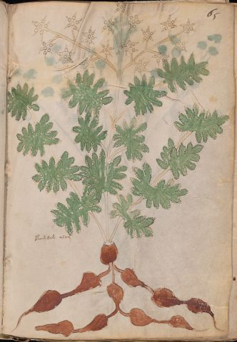

# Voynich Speculative Herbal Ferment Recipe — f65r

IMPORTANT: this is NOT a real or validated translation of the Voynich Manuscript. It is a speculative/procedural model that interprets EVA using a user-defined grammar to generate experimental recipes using safe, known edible substitutes.

This file is generated automatically from IVTFF/EVA transliteration plus a user-defined procedural grammar.



## Page / Folio
- folio: f65r
- page_number: 115
- section: herbal

## EVA Text (Transliteration)
```text
otaim dam alam
```

## Recipes Index (This Page)
- [f65r.1,@Lp](#f65r-1-f65r-1-lp)

## Line Glosses (Procedural Gloss Only; Not a Translation)

<a id="f65r-1-f65r-1-lp"></a>

### f65r.1,@Lp

EVA: otaim dam alam

Direct Gloss (Procedural, Not a Real Translation):
- otaim: apply heat/cooking → mix / transfer → duration level 1 → state: fermentation start
- dam: start fermentation (yeast) → duration level 1 → state: fermentation start
- alam: duration level 1 → state: fermentation start
