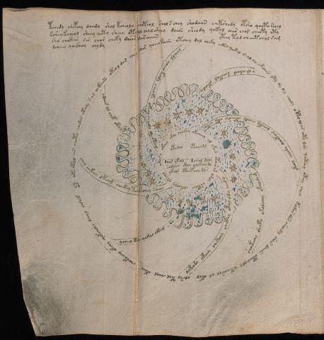

# Voynich Speculative Herbal Ferment Recipe — f68v3

IMPORTANT: this is NOT a real or validated translation of the Voynich Manuscript. It is a speculative/procedural model that interprets EVA using a user-defined grammar to generate experimental recipes using safe, known edible substitutes.

This file is generated automatically from IVTFF/EVA transliteration plus a user-defined procedural grammar.



## Page / Folio
- folio: f68v3
- page_number: 128
- plant_category_confidence: 0.0
- plant_category_guess: unknown
- section: cosmological

## Plant Interpretation (Heuristic)
- category: unknown
- confidence: 0.0
- note: Heuristic classification based on the IVTFF 'Plant ID' string (not the drawing). Does not imply real identification of the manuscript plant.

## EVA Text (Transliteration)
```text
tchedy chepchy daiidy shol kcheoly choteol shol s chey shodaiin chetshedy otsho qooto seeey
sshey kcheol sheey qety sheey otchol chal sheey daiin sheody qokol aiir chor cheoty oty
sho chokar sor chor cheky daiin dar aiiin ytey tol cheeetchol sam
dcheey qockhhy chydy
oky otol ees choty cheda[s:r] otchdy s ar oekaiin oteol dar cheo dais qoeeo kaiin okchey dal cheky ykos [y:q]akeg s ol ay ykoees yty dy dy chody otol ol ees oty dar qotay otoy chey kodar dar sheody shees daiin oteeoaly oteeosol ol okol olsey tol cheol okeey choekcheey okchy qokchshy dchol chshek
ocheal qoeey keody cheoky okeey chody dy ote?m
r al chdail schekol okeody
okeol cheody qoekeey ocheky eeody okchdy oko okos
shoekechy sheky okolchey okol[m:k]om
qokeody okeey chekchy chckhy okal ody chedy
ycheeo key qokal okeeg
ochey chekchy dkeeeg cheekey teokechey saiir
ydaiil ol chek okchyd
okosy okchy okol choekey okeoeeey ol yko[?n:in] otairo[s:r] orol orkeeey olkeeoly ykeeol
otodol
opcholdg
roar ykeol darol daly
solaiin ckhhy olekeey dy
ykeol ctheepoey dar
```

## Page Summary (Procedural, Aggregated)
- compound_counts: {'heat': 28, 'main herb': 59, 'yeast fermentation': 48, 'secondary herb': 17, 'mix/transfer': 127, 'sugars': 61, 'liquid base': 10, 'general base': 2, 'complex herbal compound': 4}
- dose_level: 3
- fermentation_estimate: 7–14 days

## Pantry (Max Needed For Any Single Line-Recipe)
- main_plant_dry_g: 15
- main_plant_substitute: ['chamomile (safe default substitute)']
- safe_complex_herbal_blend: ['gentle spices (e.g., 1 g cinnamon + 1 g clove) or a commercial herbal tea blend']
- secondary_herb_dry_g: 7
- secondary_herb_substitute: ['mint']
- sugar_or_honey_g: 75
- water_l: 0.5
- yeast_g: 1

## Recipes Index (This Page)
- [f68v3.1,@P0](#f68v3-1-f68v3-1-p0)
- [f68v3.2,+P0](#f68v3-2-f68v3-2-p0)
- [f68v3.3,+P0](#f68v3-3-f68v3-3-p0)
- [f68v3.4,+P0](#f68v3-4-f68v3-4-p0)
- [f68v3.5,@Cc](#f68v3-5-f68v3-5-cc)
- [f68v3.6,@Ri](#f68v3-6-f68v3-6-ri)
- [f68v3.7,@Ri](#f68v3-7-f68v3-7-ri)
- [f68v3.8,@Ri](#f68v3-8-f68v3-8-ri)
- [f68v3.9,@Ri](#f68v3-9-f68v3-9-ri)
- [f68v3.10,@Ri](#f68v3-10-f68v3-10-ri)
- [f68v3.11,@Ri](#f68v3-11-f68v3-11-ri)
- [f68v3.12,@Ri](#f68v3-12-f68v3-12-ri)
- [f68v3.13,@Ri](#f68v3-13-f68v3-13-ri)
- [f68v3.14,@Cc](#f68v3-14-f68v3-14-cc)
- [f68v3.15,@L0](#f68v3-15-f68v3-15-l0)
- [f68v3.16,=L0](#f68v3-16-f68v3-16-l0)
- [f68v3.17,@Pb](#f68v3-17-f68v3-17-pb)
- [f68v3.18,+Pb](#f68v3-18-f68v3-18-pb)
- [f68v3.19,+Pb](#f68v3-19-f68v3-19-pb)

## Line Recipes (Each Line = One Recipe, 0.5L batch)

<a id="f68v3-1-f68v3-1-p0"></a>

### f68v3.1,@P0

EVA: tchedy chepchy daiidy shol kcheoly choteol shol s chey shodaiin chetshedy otsho qooto seeey

## Ingredients
- main_plant_dry_g: 15
- main_plant_substitute: chamomile (safe default substitute)
- secondary_herb_dry_g: 7
- secondary_herb_substitute: mint
- sugar_or_honey_g: 75
- water_l: 0.5
- yeast_g: 1

Process:
1. Sanitize the jar/fermenter and utensils.
2. Base: combine 0.5 L water with 75 g sugar or honey.
3. Apply gentle heat: simmer 10–15 min, then cool to <30°C before adding yeast.
4. Add main plant: chamomile (safe default substitute) (~15 g dried).
5. Add secondary herb: mint (~7 g dried).
6. Pitch yeast: 1 g (ideally cider/beer yeast).
7. Ferment with an airlock: 7–14 days (guided by iin/aiin markers).
8. Strain/rack (if very solid-heavy) and cold-crash 24 h.
9. Bottle only when activity clearly slows; refrigerate. Avoid overpressure.

Expected Result: A mild, aromatic herbal ferment, low-to-medium intensity depending on dose level.

Does It Make Sense?: partial

Direct Gloss (Procedural, Not a Real Translation):
- tchedy: apply heat/cooking → add main plant (safe substitute) → start fermentation (yeast) → duration level 1 → state: active extraction
- chepchy: add main plant (safe substitute) → start fermentation (yeast) → duration level 1 → state: active extraction
- daiidy: start fermentation (yeast) → duration level 1 → state: fermentation start
- shol: add secondary herb (safe substitute) → mix / transfer
- kcheoly: add fermentable sugars → add main plant (safe substitute) → mix / transfer → duration level 1 → state: active extraction
- choteol: apply heat/cooking → add main plant (safe substitute) → mix / transfer → duration level 1 → state: active extraction
- shol: add secondary herb (safe substitute) → mix / transfer
- s: [unparsed]
- chey: add main plant (safe substitute) → duration level 1 → state: active extraction
- shodaiin: add secondary herb (safe substitute) → mix / transfer → start fermentation (yeast) → duration level 1 → state: fermentation start → long fermentation / aging phase
- chetshedy: apply heat/cooking → add main plant (safe substitute) → add secondary herb (safe substitute) → start fermentation (yeast) → duration level 1 → state: active extraction
- otsho: apply heat/cooking → add secondary herb (safe substitute) → mix / transfer
- qooto: prepare liquid base → apply heat/cooking → mix / transfer
- seeey: duration level 3 → state: active extraction

<a id="f68v3-2-f68v3-2-p0"></a>

### f68v3.2,+P0

EVA: sshey kcheol sheey qety sheey otchol chal sheey daiin sheody qokol aiir chor cheoty oty

## Ingredients
- main_plant_dry_g: 10
- main_plant_substitute: chamomile (safe default substitute)
- secondary_herb_dry_g: 5
- secondary_herb_substitute: mint
- sugar_or_honey_g: 50
- water_l: 0.5
- yeast_g: 1

Process:
1. Sanitize the jar/fermenter and utensils.
2. Base: combine 0.5 L water with 50 g sugar or honey.
3. Apply gentle heat: simmer 10–15 min, then cool to <30°C before adding yeast.
4. Add main plant: chamomile (safe default substitute) (~10 g dried).
5. Add secondary herb: mint (~5 g dried).
6. Pitch yeast: 1 g (ideally cider/beer yeast).
7. Ferment with an airlock: 7–14 days (guided by iin/aiin markers).
8. Strain/rack (if very solid-heavy) and cold-crash 24 h.
9. Bottle only when activity clearly slows; refrigerate. Avoid overpressure.

Expected Result: A mild, aromatic herbal ferment, low-to-medium intensity depending on dose level.

Does It Make Sense?: partial

Direct Gloss (Procedural, Not a Real Translation):
- sshey: add secondary herb (safe substitute) → duration level 1 → state: active extraction
- kcheol: add fermentable sugars → add main plant (safe substitute) → mix / transfer → duration level 1 → state: active extraction
- sheey: add secondary herb (safe substitute) → duration level 2 → state: active extraction
- qety: prepare base (generic) → apply heat/cooking → duration level 1 → state: active extraction
- sheey: add secondary herb (safe substitute) → duration level 2 → state: active extraction
- otchol: apply heat/cooking → add main plant (safe substitute) → mix / transfer
- chal: add main plant (safe substitute) → duration level 1 → state: fermentation start
- sheey: add secondary herb (safe substitute) → duration level 2 → state: active extraction
- daiin: start fermentation (yeast) → duration level 1 → state: fermentation start → long fermentation / aging phase
- sheody: add secondary herb (safe substitute) → mix / transfer → start fermentation (yeast) → duration level 1 → state: active extraction
- qokol: prepare liquid base → add fermentable sugars → mix / transfer
- aiir: duration level 1 → state: fermentation start
- chor: add main plant (safe substitute) → mix / transfer
- cheoty: apply heat/cooking → add main plant (safe substitute) → mix / transfer → duration level 1 → state: active extraction
- oty: apply heat/cooking → mix / transfer

<a id="f68v3-3-f68v3-3-p0"></a>

### f68v3.3,+P0

EVA: sho chokar sor chor cheky daiin dar aiiin ytey tol cheeetchol sam

## Ingredients
- main_plant_dry_g: 15
- main_plant_substitute: chamomile (safe default substitute)
- secondary_herb_dry_g: 7
- secondary_herb_substitute: mint
- sugar_or_honey_g: 75
- water_l: 0.5
- yeast_g: 1

Process:
1. Sanitize the jar/fermenter and utensils.
2. Base: combine 0.5 L water with 75 g sugar or honey.
3. Apply gentle heat: simmer 10–15 min, then cool to <30°C before adding yeast.
4. Add main plant: chamomile (safe default substitute) (~15 g dried).
5. Add secondary herb: mint (~7 g dried).
6. Pitch yeast: 1 g (ideally cider/beer yeast).
7. Ferment with an airlock: 7–14 days (guided by iin/aiin markers).
8. Strain/rack (if very solid-heavy) and cold-crash 24 h.
9. Bottle only when activity clearly slows; refrigerate. Avoid overpressure.

Expected Result: A mild, aromatic herbal ferment, low-to-medium intensity depending on dose level.

Does It Make Sense?: partial

Direct Gloss (Procedural, Not a Real Translation):
- sho: add secondary herb (safe substitute) → mix / transfer
- chokar: add fermentable sugars → add main plant (safe substitute) → mix / transfer → duration level 1 → state: fermentation start
- sor: mix / transfer
- chor: add main plant (safe substitute) → mix / transfer
- cheky: add fermentable sugars → add main plant (safe substitute) → duration level 1 → state: active extraction
- daiin: start fermentation (yeast) → duration level 1 → state: fermentation start → long fermentation / aging phase
- dar: start fermentation (yeast) → duration level 1 → state: fermentation start
- aiiin: duration level 1 → state: fermentation start → medium fermentation phase
- ytey: apply heat/cooking → duration level 1 → state: active extraction
- tol: apply heat/cooking → mix / transfer
- cheeetchol: apply heat/cooking → add main plant (safe substitute) → mix / transfer → duration level 3 → state: active extraction
- sam: duration level 1 → state: fermentation start

<a id="f68v3-4-f68v3-4-p0"></a>

### f68v3.4,+P0

EVA: dcheey qockhhy chydy

## Ingredients
- main_plant_dry_g: 10
- main_plant_substitute: chamomile (safe default substitute)
- safe_complex_herbal_blend: gentle spices (e.g., 1 g cinnamon + 1 g clove) or a commercial herbal tea blend
- secondary_herb_dry_g: 2
- secondary_herb_substitute: mint
- sugar_or_honey_g: 25
- water_l: 0.5
- yeast_g: 1

Process:
1. Sanitize the jar/fermenter and utensils.
2. Base: combine 0.5 L water with 25 g sugar or honey.
3. Infusion: use hot (not boiling) water, then let it cool before adding yeast.
4. Add main plant: chamomile (safe default substitute) (~10 g dried).
5. Add secondary herb: mint (~2 g dried).
6. If a complex herbal compound appears, use a safe commercial blend or gentle spices in micro-doses.
7. Pitch yeast: 1 g (ideally cider/beer yeast).
8. Ferment with an airlock: 2–4 days (guided by iin/aiin markers).
9. Strain/rack (if very solid-heavy) and cold-crash 24 h.
10. Bottle only when activity clearly slows; refrigerate. Avoid overpressure.

Expected Result: A mild, aromatic herbal ferment, low-to-medium intensity depending on dose level.

Does It Make Sense?: partial

Direct Gloss (Procedural, Not a Real Translation):
- dcheey: add main plant (safe substitute) → start fermentation (yeast) → duration level 2 → state: active extraction
- qockhhy: prepare liquid base → add complex herbal compound (safe blend)
- chydy: add main plant (safe substitute) → start fermentation (yeast)

<a id="f68v3-5-f68v3-5-cc"></a>

### f68v3.5,@Cc

EVA: oky otol ees choty cheda[s:r] otchdy s ar oekaiin oteol dar cheo dais qoeeo kaiin okchey dal cheky ykos [y:q]akeg s ol ay ykoees yty dy dy chody otol ol ees oty dar qotay otoy chey kodar dar sheody shees daiin oteeoaly oteeosol ol okol olsey tol cheol okeey choekcheey okchy qokchshy dchol chshek

## Ingredients
- main_plant_dry_g: 10
- main_plant_substitute: chamomile (safe default substitute)
- secondary_herb_dry_g: 5
- secondary_herb_substitute: mint
- sugar_or_honey_g: 50
- water_l: 0.5
- yeast_g: 1

Process:
1. Sanitize the jar/fermenter and utensils.
2. Base: combine 0.5 L water with 50 g sugar or honey.
3. Apply gentle heat: simmer 10–15 min, then cool to <30°C before adding yeast.
4. Add main plant: chamomile (safe default substitute) (~10 g dried).
5. Add secondary herb: mint (~5 g dried).
6. Pitch yeast: 1 g (ideally cider/beer yeast).
7. Ferment with an airlock: 7–14 days (guided by iin/aiin markers).
8. Strain/rack (if very solid-heavy) and cold-crash 24 h.
9. Bottle only when activity clearly slows; refrigerate. Avoid overpressure.

Expected Result: A mild, aromatic herbal ferment, low-to-medium intensity depending on dose level.

Does It Make Sense?: partial

Direct Gloss (Procedural, Not a Real Translation):
- oky: add fermentable sugars → mix / transfer
- otol: apply heat/cooking → mix / transfer
- ees: duration level 2 → state: active extraction
- choty: apply heat/cooking → add main plant (safe substitute) → mix / transfer
- cheda: add main plant (safe substitute) → start fermentation (yeast) → duration level 1 → state: active extraction
- s: [unparsed]
- r: [unparsed]
- otchdy: apply heat/cooking → add main plant (safe substitute) → mix / transfer → start fermentation (yeast)
- s: [unparsed]
- ar: duration level 1 → state: fermentation start
- oekaiin: add fermentable sugars → mix / transfer → duration level 1 → state: active extraction → long fermentation / aging phase
- oteol: apply heat/cooking → mix / transfer → duration level 1 → state: active extraction
- dar: start fermentation (yeast) → duration level 1 → state: fermentation start
- cheo: add main plant (safe substitute) → mix / transfer → duration level 1 → state: active extraction
- dais: start fermentation (yeast) → duration level 1 → state: fermentation start
- qoeeo: prepare liquid base → mix / transfer → duration level 2 → state: active extraction
- kaiin: add fermentable sugars → duration level 1 → state: fermentation start → long fermentation / aging phase
- okchey: add fermentable sugars → add main plant (safe substitute) → mix / transfer → duration level 1 → state: active extraction
- dal: start fermentation (yeast) → duration level 1 → state: fermentation start
- cheky: add fermentable sugars → add main plant (safe substitute) → duration level 1 → state: active extraction
- ykos: add fermentable sugars → mix / transfer
- y: [unparsed]
- q: prepare base (generic)
- akeg: add fermentable sugars → duration level 1 → state: fermentation start
- s: [unparsed]
- ol: mix / transfer
- ay: duration level 1 → state: fermentation start
- ykoees: add fermentable sugars → mix / transfer → duration level 2 → state: active extraction
- yty: apply heat/cooking
- dy: start fermentation (yeast)
- dy: start fermentation (yeast)
- chody: add main plant (safe substitute) → mix / transfer → start fermentation (yeast)
- otol: apply heat/cooking → mix / transfer
- ol: mix / transfer
- ees: duration level 2 → state: active extraction
- oty: apply heat/cooking → mix / transfer
- dar: start fermentation (yeast) → duration level 1 → state: fermentation start
- qotay: prepare liquid base → apply heat/cooking → duration level 1 → state: fermentation start
- otoy: apply heat/cooking → mix / transfer
- chey: add main plant (safe substitute) → duration level 1 → state: active extraction
- kodar: add fermentable sugars → mix / transfer → start fermentation (yeast) → duration level 1 → state: fermentation start
- dar: start fermentation (yeast) → duration level 1 → state: fermentation start
- sheody: add secondary herb (safe substitute) → mix / transfer → start fermentation (yeast) → duration level 1 → state: active extraction
- shees: add secondary herb (safe substitute) → duration level 2 → state: active extraction
- daiin: start fermentation (yeast) → duration level 1 → state: fermentation start → long fermentation / aging phase
- oteeoaly: apply heat/cooking → mix / transfer → duration level 2 → state: active extraction
- oteeosol: apply heat/cooking → mix / transfer → duration level 2 → state: active extraction
- ol: mix / transfer
- okol: add fermentable sugars → mix / transfer
- olsey: mix / transfer → duration level 1 → state: active extraction
- tol: apply heat/cooking → mix / transfer
- cheol: add main plant (safe substitute) → mix / transfer → duration level 1 → state: active extraction
- okeey: add fermentable sugars → mix / transfer → duration level 2 → state: active extraction
- choekcheey: add fermentable sugars → add main plant (safe substitute) → mix / transfer → duration level 1 → state: active extraction
- okchy: add fermentable sugars → add main plant (safe substitute) → mix / transfer
- qokchshy: prepare liquid base → add fermentable sugars → add main plant (safe substitute) → add secondary herb (safe substitute)
- dchol: add main plant (safe substitute) → mix / transfer → start fermentation (yeast)
- chshek: add fermentable sugars → add main plant (safe substitute) → add secondary herb (safe substitute) → duration level 1 → state: active extraction

<a id="f68v3-6-f68v3-6-ri"></a>

### f68v3.6,@Ri

EVA: ocheal qoeey keody cheoky okeey chody dy ote?m

## Ingredients
- main_plant_dry_g: 10
- main_plant_substitute: chamomile (safe default substitute)
- secondary_herb_dry_g: 2
- secondary_herb_substitute: mint
- sugar_or_honey_g: 50
- water_l: 0.5
- yeast_g: 1

Process:
1. Sanitize the jar/fermenter and utensils.
2. Base: combine 0.5 L water with 50 g sugar or honey.
3. Apply gentle heat: simmer 10–15 min, then cool to <30°C before adding yeast.
4. Add main plant: chamomile (safe default substitute) (~10 g dried).
5. Add secondary herb: mint (~2 g dried).
6. Pitch yeast: 1 g (ideally cider/beer yeast).
7. Ferment with an airlock: 2–4 days (guided by iin/aiin markers).
8. Strain/rack (if very solid-heavy) and cold-crash 24 h.
9. Bottle only when activity clearly slows; refrigerate. Avoid overpressure.

Expected Result: A mild, aromatic herbal ferment, low-to-medium intensity depending on dose level.

Does It Make Sense?: partial

Direct Gloss (Procedural, Not a Real Translation):
- ocheal: add main plant (safe substitute) → mix / transfer → duration level 1 → state: active extraction
- qoeey: prepare liquid base → duration level 2 → state: active extraction
- keody: add fermentable sugars → mix / transfer → start fermentation (yeast) → duration level 1 → state: active extraction
- cheoky: add fermentable sugars → add main plant (safe substitute) → mix / transfer → duration level 1 → state: active extraction
- okeey: add fermentable sugars → mix / transfer → duration level 2 → state: active extraction
- chody: add main plant (safe substitute) → mix / transfer → start fermentation (yeast)
- dy: start fermentation (yeast)
- ote: apply heat/cooking → mix / transfer → duration level 1 → state: active extraction
- m: [unparsed]

<a id="f68v3-7-f68v3-7-ri"></a>

### f68v3.7,@Ri

EVA: r al chdail schekol okeody

## Ingredients
- main_plant_dry_g: 5
- main_plant_substitute: chamomile (safe default substitute)
- secondary_herb_dry_g: 1
- secondary_herb_substitute: mint
- sugar_or_honey_g: 25
- water_l: 0.5
- yeast_g: 1

Process:
1. Sanitize the jar/fermenter and utensils.
2. Base: combine 0.5 L water with 25 g sugar or honey.
3. Infusion: use hot (not boiling) water, then let it cool before adding yeast.
4. Add main plant: chamomile (safe default substitute) (~5 g dried).
5. Add secondary herb: mint (~1 g dried).
6. Pitch yeast: 1 g (ideally cider/beer yeast).
7. Ferment with an airlock: 2–4 days (guided by iin/aiin markers).
8. Strain/rack (if very solid-heavy) and cold-crash 24 h.
9. Bottle only when activity clearly slows; refrigerate. Avoid overpressure.

Expected Result: A mild, aromatic herbal ferment, low-to-medium intensity depending on dose level.

Does It Make Sense?: partial

Direct Gloss (Procedural, Not a Real Translation):
- r: [unparsed]
- al: duration level 1 → state: fermentation start
- chdail: add main plant (safe substitute) → start fermentation (yeast) → duration level 1 → state: fermentation start
- schekol: add fermentable sugars → add main plant (safe substitute) → mix / transfer → duration level 1 → state: active extraction
- okeody: add fermentable sugars → mix / transfer → start fermentation (yeast) → duration level 1 → state: active extraction

<a id="f68v3-8-f68v3-8-ri"></a>

### f68v3.8,@Ri

EVA: okeol cheody qoekeey ocheky eeody okchdy oko okos

## Ingredients
- main_plant_dry_g: 10
- main_plant_substitute: chamomile (safe default substitute)
- secondary_herb_dry_g: 2
- secondary_herb_substitute: mint
- sugar_or_honey_g: 50
- water_l: 0.5
- yeast_g: 1

Process:
1. Sanitize the jar/fermenter and utensils.
2. Base: combine 0.5 L water with 50 g sugar or honey.
3. Infusion: use hot (not boiling) water, then let it cool before adding yeast.
4. Add main plant: chamomile (safe default substitute) (~10 g dried).
5. Add secondary herb: mint (~2 g dried).
6. Pitch yeast: 1 g (ideally cider/beer yeast).
7. Ferment with an airlock: 2–4 days (guided by iin/aiin markers).
8. Strain/rack (if very solid-heavy) and cold-crash 24 h.
9. Bottle only when activity clearly slows; refrigerate. Avoid overpressure.

Expected Result: A mild, aromatic herbal ferment, low-to-medium intensity depending on dose level.

Does It Make Sense?: partial

Direct Gloss (Procedural, Not a Real Translation):
- okeol: add fermentable sugars → mix / transfer → duration level 1 → state: active extraction
- cheody: add main plant (safe substitute) → mix / transfer → start fermentation (yeast) → duration level 1 → state: active extraction
- qoekeey: prepare liquid base → add fermentable sugars → duration level 1 → state: active extraction
- ocheky: add fermentable sugars → add main plant (safe substitute) → mix / transfer → duration level 1 → state: active extraction
- eeody: mix / transfer → start fermentation (yeast) → duration level 2 → state: active extraction
- okchdy: add fermentable sugars → add main plant (safe substitute) → mix / transfer → start fermentation (yeast)
- oko: add fermentable sugars → mix / transfer
- okos: add fermentable sugars → mix / transfer

<a id="f68v3-9-f68v3-9-ri"></a>

### f68v3.9,@Ri

EVA: shoekechy sheky okolchey okol[m:k]om

## Ingredients
- main_plant_dry_g: 5
- main_plant_substitute: chamomile (safe default substitute)
- secondary_herb_dry_g: 2
- secondary_herb_substitute: mint
- sugar_or_honey_g: 25
- water_l: 0.5
- yeast_g: 1

Process:
1. Sanitize the jar/fermenter and utensils.
2. Base: combine 0.5 L water with 25 g sugar or honey.
3. Infusion: use hot (not boiling) water, then let it cool before adding yeast.
4. Add main plant: chamomile (safe default substitute) (~5 g dried).
5. Add secondary herb: mint (~2 g dried).
6. Pitch yeast: 1 g (ideally cider/beer yeast).
7. Ferment with an airlock: 2–4 days (guided by iin/aiin markers).
8. Strain/rack (if very solid-heavy) and cold-crash 24 h.
9. Bottle only when activity clearly slows; refrigerate. Avoid overpressure.

Expected Result: A mild, aromatic herbal ferment, low-to-medium intensity depending on dose level.

Does It Make Sense?: partial

Direct Gloss (Procedural, Not a Real Translation):
- shoekechy: add fermentable sugars → add main plant (safe substitute) → add secondary herb (safe substitute) → mix / transfer → duration level 1 → state: active extraction
- sheky: add fermentable sugars → add secondary herb (safe substitute) → duration level 1 → state: active extraction
- okolchey: add fermentable sugars → add main plant (safe substitute) → mix / transfer → duration level 1 → state: active extraction
- okol: add fermentable sugars → mix / transfer
- m: [unparsed]
- k: add fermentable sugars
- om: mix / transfer

<a id="f68v3-10-f68v3-10-ri"></a>

### f68v3.10,@Ri

EVA: qokeody okeey chekchy chckhy okal ody chedy

## Ingredients
- main_plant_dry_g: 10
- main_plant_substitute: chamomile (safe default substitute)
- safe_complex_herbal_blend: gentle spices (e.g., 1 g cinnamon + 1 g clove) or a commercial herbal tea blend
- secondary_herb_dry_g: 2
- secondary_herb_substitute: mint
- sugar_or_honey_g: 50
- water_l: 0.5
- yeast_g: 1

Process:
1. Sanitize the jar/fermenter and utensils.
2. Base: combine 0.5 L water with 50 g sugar or honey.
3. Infusion: use hot (not boiling) water, then let it cool before adding yeast.
4. Add main plant: chamomile (safe default substitute) (~10 g dried).
5. Add secondary herb: mint (~2 g dried).
6. If a complex herbal compound appears, use a safe commercial blend or gentle spices in micro-doses.
7. Pitch yeast: 1 g (ideally cider/beer yeast).
8. Ferment with an airlock: 2–4 days (guided by iin/aiin markers).
9. Strain/rack (if very solid-heavy) and cold-crash 24 h.
10. Bottle only when activity clearly slows; refrigerate. Avoid overpressure.

Expected Result: A mild, aromatic herbal ferment, low-to-medium intensity depending on dose level.

Does It Make Sense?: partial

Direct Gloss (Procedural, Not a Real Translation):
- qokeody: prepare liquid base → add fermentable sugars → mix / transfer → start fermentation (yeast) → duration level 1 → state: active extraction
- okeey: add fermentable sugars → mix / transfer → duration level 2 → state: active extraction
- chekchy: add fermentable sugars → add main plant (safe substitute) → duration level 1 → state: active extraction
- chckhy: add main plant (safe substitute) → add complex herbal compound (safe blend)
- okal: add fermentable sugars → mix / transfer → duration level 1 → state: fermentation start
- ody: mix / transfer → start fermentation (yeast)
- chedy: add main plant (safe substitute) → start fermentation (yeast) → duration level 1 → state: active extraction

<a id="f68v3-11-f68v3-11-ri"></a>

### f68v3.11,@Ri

EVA: ycheeo key qokal okeeg

## Ingredients
- main_plant_dry_g: 10
- main_plant_substitute: chamomile (safe default substitute)
- secondary_herb_dry_g: 2
- secondary_herb_substitute: mint
- sugar_or_honey_g: 50
- water_l: 0.5
- yeast_g: 1

Process:
1. Sanitize the jar/fermenter and utensils.
2. Base: combine 0.5 L water with 50 g sugar or honey.
3. Infusion: use hot (not boiling) water, then let it cool before adding yeast.
4. Add main plant: chamomile (safe default substitute) (~10 g dried).
5. Add secondary herb: mint (~2 g dried).
6. Pitch yeast: 1 g (ideally cider/beer yeast).
7. Ferment with an airlock: 2–4 days (guided by iin/aiin markers).
8. Strain/rack (if very solid-heavy) and cold-crash 24 h.
9. Bottle only when activity clearly slows; refrigerate. Avoid overpressure.

Expected Result: A mild, aromatic herbal ferment, low-to-medium intensity depending on dose level.

Does It Make Sense?: partial

Direct Gloss (Procedural, Not a Real Translation):
- ycheeo: add main plant (safe substitute) → mix / transfer → duration level 2 → state: active extraction
- key: add fermentable sugars → duration level 1 → state: active extraction
- qokal: prepare liquid base → add fermentable sugars → duration level 1 → state: fermentation start
- okeeg: add fermentable sugars → mix / transfer → duration level 2 → state: active extraction

<a id="f68v3-12-f68v3-12-ri"></a>

### f68v3.12,@Ri

EVA: ochey chekchy dkeeeg cheekey teokechey saiir

## Ingredients
- main_plant_dry_g: 15
- main_plant_substitute: chamomile (safe default substitute)
- secondary_herb_dry_g: 3
- secondary_herb_substitute: mint
- sugar_or_honey_g: 75
- water_l: 0.5
- yeast_g: 1

Process:
1. Sanitize the jar/fermenter and utensils.
2. Base: combine 0.5 L water with 75 g sugar or honey.
3. Apply gentle heat: simmer 10–15 min, then cool to <30°C before adding yeast.
4. Add main plant: chamomile (safe default substitute) (~15 g dried).
5. Add secondary herb: mint (~3 g dried).
6. Pitch yeast: 1 g (ideally cider/beer yeast).
7. Ferment with an airlock: 2–4 days (guided by iin/aiin markers).
8. Strain/rack (if very solid-heavy) and cold-crash 24 h.
9. Bottle only when activity clearly slows; refrigerate. Avoid overpressure.

Expected Result: A mild, aromatic herbal ferment, low-to-medium intensity depending on dose level.

Does It Make Sense?: partial

Direct Gloss (Procedural, Not a Real Translation):
- ochey: add main plant (safe substitute) → mix / transfer → duration level 1 → state: active extraction
- chekchy: add fermentable sugars → add main plant (safe substitute) → duration level 1 → state: active extraction
- dkeeeg: add fermentable sugars → start fermentation (yeast) → duration level 3 → state: active extraction
- cheekey: add fermentable sugars → add main plant (safe substitute) → duration level 2 → state: active extraction
- teokechey: add fermentable sugars → apply heat/cooking → add main plant (safe substitute) → mix / transfer → duration level 1 → state: active extraction
- saiir: duration level 1 → state: fermentation start

<a id="f68v3-13-f68v3-13-ri"></a>

### f68v3.13,@Ri

EVA: ydaiil ol chek okchyd

## Ingredients
- main_plant_dry_g: 5
- main_plant_substitute: chamomile (safe default substitute)
- secondary_herb_dry_g: 1
- secondary_herb_substitute: mint
- sugar_or_honey_g: 25
- water_l: 0.5
- yeast_g: 1

Process:
1. Sanitize the jar/fermenter and utensils.
2. Base: combine 0.5 L water with 25 g sugar or honey.
3. Infusion: use hot (not boiling) water, then let it cool before adding yeast.
4. Add main plant: chamomile (safe default substitute) (~5 g dried).
5. Add secondary herb: mint (~1 g dried).
6. Pitch yeast: 1 g (ideally cider/beer yeast).
7. Ferment with an airlock: 2–4 days (guided by iin/aiin markers).
8. Strain/rack (if very solid-heavy) and cold-crash 24 h.
9. Bottle only when activity clearly slows; refrigerate. Avoid overpressure.

Expected Result: A mild, aromatic herbal ferment, low-to-medium intensity depending on dose level.

Does It Make Sense?: partial

Direct Gloss (Procedural, Not a Real Translation):
- ydaiil: start fermentation (yeast) → duration level 1 → state: fermentation start
- ol: mix / transfer
- chek: add fermentable sugars → add main plant (safe substitute) → duration level 1 → state: active extraction
- okchyd: add fermentable sugars → add main plant (safe substitute) → mix / transfer → start fermentation (yeast)

<a id="f68v3-14-f68v3-14-cc"></a>

### f68v3.14,@Cc

EVA: okosy okchy okol choekey okeoeeey ol yko[?n:in] otairo[s:r] orol orkeeey olkeeoly ykeeol

## Ingredients
- main_plant_dry_g: 15
- main_plant_substitute: chamomile (safe default substitute)
- secondary_herb_dry_g: 3
- secondary_herb_substitute: mint
- sugar_or_honey_g: 75
- water_l: 0.5
- yeast_g: 1

Process:
1. Sanitize the jar/fermenter and utensils.
2. Base: combine 0.5 L water with 75 g sugar or honey.
3. Apply gentle heat: simmer 10–15 min, then cool to <30°C before adding yeast.
4. Add main plant: chamomile (safe default substitute) (~15 g dried).
5. Add secondary herb: mint (~3 g dried).
6. Pitch yeast: 1 g (ideally cider/beer yeast).
7. Ferment with an airlock: 2–4 days (guided by iin/aiin markers).
8. Strain/rack (if very solid-heavy) and cold-crash 24 h.
9. Bottle only when activity clearly slows; refrigerate. Avoid overpressure.

Expected Result: A mild, aromatic herbal ferment, low-to-medium intensity depending on dose level.

Does It Make Sense?: partial

Direct Gloss (Procedural, Not a Real Translation):
- okosy: add fermentable sugars → mix / transfer
- okchy: add fermentable sugars → add main plant (safe substitute) → mix / transfer
- okol: add fermentable sugars → mix / transfer
- choekey: add fermentable sugars → add main plant (safe substitute) → mix / transfer → duration level 1 → state: active extraction
- okeoeeey: add fermentable sugars → mix / transfer → duration level 1 → state: active extraction
- ol: mix / transfer
- yko: add fermentable sugars → mix / transfer
- n: [unparsed]
- in: duration level 1 → state: cooling/rest
- otairo: apply heat/cooking → mix / transfer → duration level 1 → state: fermentation start
- s: [unparsed]
- r: [unparsed]
- orol: mix / transfer
- orkeeey: add fermentable sugars → mix / transfer → duration level 3 → state: active extraction
- olkeeoly: add fermentable sugars → mix / transfer → duration level 2 → state: active extraction
- ykeeol: add fermentable sugars → mix / transfer → duration level 2 → state: active extraction

<a id="f68v3-15-f68v3-15-l0"></a>

### f68v3.15,@L0

EVA: otodol

## Ingredients
- main_plant_dry_g: 2
- main_plant_substitute: chamomile (safe default substitute)
- secondary_herb_dry_g: 1
- secondary_herb_substitute: mint
- sugar_or_honey_g: 12
- water_l: 0.5
- yeast_g: 1

Process:
1. Sanitize the jar/fermenter and utensils.
2. Base: combine 0.5 L water with 12 g sugar or honey.
3. Apply gentle heat: simmer 10–15 min, then cool to <30°C before adding yeast.
4. Add main plant: chamomile (safe default substitute) (~2 g dried).
5. Add secondary herb: mint (~1 g dried).
6. Pitch yeast: 1 g (ideally cider/beer yeast).
7. Ferment with an airlock: 2–4 days (guided by iin/aiin markers).
8. Strain/rack (if very solid-heavy) and cold-crash 24 h.
9. Bottle only when activity clearly slows; refrigerate. Avoid overpressure.

Expected Result: A mild, aromatic herbal ferment, low-to-medium intensity depending on dose level.

Does It Make Sense?: partial

Direct Gloss (Procedural, Not a Real Translation):
- otodol: apply heat/cooking → mix / transfer → start fermentation (yeast)

<a id="f68v3-16-f68v3-16-l0"></a>

### f68v3.16,=L0

EVA: opcholdg

## Ingredients
- main_plant_dry_g: 5
- main_plant_substitute: chamomile (safe default substitute)
- secondary_herb_dry_g: 1
- secondary_herb_substitute: mint
- sugar_or_honey_g: 12
- water_l: 0.5
- yeast_g: 1

Process:
1. Sanitize the jar/fermenter and utensils.
2. Base: combine 0.5 L water with 12 g sugar or honey.
3. Infusion: use hot (not boiling) water, then let it cool before adding yeast.
4. Add main plant: chamomile (safe default substitute) (~5 g dried).
5. Add secondary herb: mint (~1 g dried).
6. Pitch yeast: 1 g (ideally cider/beer yeast).
7. Ferment with an airlock: 2–4 days (guided by iin/aiin markers).
8. Strain/rack (if very solid-heavy) and cold-crash 24 h.
9. Bottle only when activity clearly slows; refrigerate. Avoid overpressure.

Expected Result: A mild, aromatic herbal ferment, low-to-medium intensity depending on dose level.

Does It Make Sense?: partial

Direct Gloss (Procedural, Not a Real Translation):
- opcholdg: add main plant (safe substitute) → mix / transfer → start fermentation (yeast)

<a id="f68v3-17-f68v3-17-pb"></a>

### f68v3.17,@Pb

EVA: roar ykeol darol daly

## Ingredients
- main_plant_dry_g: 2
- main_plant_substitute: chamomile (safe default substitute)
- secondary_herb_dry_g: 1
- secondary_herb_substitute: mint
- sugar_or_honey_g: 25
- water_l: 0.5
- yeast_g: 1

Process:
1. Sanitize the jar/fermenter and utensils.
2. Base: combine 0.5 L water with 25 g sugar or honey.
3. Infusion: use hot (not boiling) water, then let it cool before adding yeast.
4. Add main plant: chamomile (safe default substitute) (~2 g dried).
5. Add secondary herb: mint (~1 g dried).
6. Pitch yeast: 1 g (ideally cider/beer yeast).
7. Ferment with an airlock: 2–4 days (guided by iin/aiin markers).
8. Strain/rack (if very solid-heavy) and cold-crash 24 h.
9. Bottle only when activity clearly slows; refrigerate. Avoid overpressure.

Expected Result: A mild, aromatic herbal ferment, low-to-medium intensity depending on dose level.

Does It Make Sense?: partial

Direct Gloss (Procedural, Not a Real Translation):
- roar: mix / transfer → duration level 1 → state: fermentation start
- ykeol: add fermentable sugars → mix / transfer → duration level 1 → state: active extraction
- darol: mix / transfer → start fermentation (yeast) → duration level 1 → state: fermentation start
- daly: start fermentation (yeast) → duration level 1 → state: fermentation start

<a id="f68v3-18-f68v3-18-pb"></a>

### f68v3.18,+Pb

EVA: solaiin ckhhy olekeey dy

## Ingredients
- main_plant_dry_g: 2
- main_plant_substitute: chamomile (safe default substitute)
- safe_complex_herbal_blend: gentle spices (e.g., 1 g cinnamon + 1 g clove) or a commercial herbal tea blend
- secondary_herb_dry_g: 1
- secondary_herb_substitute: mint
- sugar_or_honey_g: 25
- water_l: 0.5
- yeast_g: 1

Process:
1. Sanitize the jar/fermenter and utensils.
2. Base: combine 0.5 L water with 25 g sugar or honey.
3. Infusion: use hot (not boiling) water, then let it cool before adding yeast.
4. Add main plant: chamomile (safe default substitute) (~2 g dried).
5. Add secondary herb: mint (~1 g dried).
6. If a complex herbal compound appears, use a safe commercial blend or gentle spices in micro-doses.
7. Pitch yeast: 1 g (ideally cider/beer yeast).
8. Ferment with an airlock: 7–14 days (guided by iin/aiin markers).
9. Strain/rack (if very solid-heavy) and cold-crash 24 h.
10. Bottle only when activity clearly slows; refrigerate. Avoid overpressure.

Expected Result: A mild, aromatic herbal ferment, low-to-medium intensity depending on dose level.

Does It Make Sense?: partial

Direct Gloss (Procedural, Not a Real Translation):
- solaiin: mix / transfer → duration level 1 → state: fermentation start → long fermentation / aging phase
- ckhhy: add complex herbal compound (safe blend)
- olekeey: add fermentable sugars → mix / transfer → duration level 1 → state: active extraction
- dy: start fermentation (yeast)

<a id="f68v3-19-f68v3-19-pb"></a>

### f68v3.19,+Pb

EVA: ykeol ctheepoey dar

## Ingredients
- main_plant_dry_g: 5
- main_plant_substitute: chamomile (safe default substitute)
- safe_complex_herbal_blend: gentle spices (e.g., 1 g cinnamon + 1 g clove) or a commercial herbal tea blend
- secondary_herb_dry_g: 2
- secondary_herb_substitute: mint
- sugar_or_honey_g: 50
- water_l: 0.5
- yeast_g: 1

Process:
1. Sanitize the jar/fermenter and utensils.
2. Base: combine 0.5 L water with 50 g sugar or honey.
3. Infusion: use hot (not boiling) water, then let it cool before adding yeast.
4. Add main plant: chamomile (safe default substitute) (~5 g dried).
5. Add secondary herb: mint (~2 g dried).
6. If a complex herbal compound appears, use a safe commercial blend or gentle spices in micro-doses.
7. Pitch yeast: 1 g (ideally cider/beer yeast).
8. Ferment with an airlock: 2–4 days (guided by iin/aiin markers).
9. Strain/rack (if very solid-heavy) and cold-crash 24 h.
10. Bottle only when activity clearly slows; refrigerate. Avoid overpressure.

Expected Result: A mild, aromatic herbal ferment, low-to-medium intensity depending on dose level.

Does It Make Sense?: partial

Direct Gloss (Procedural, Not a Real Translation):
- ykeol: add fermentable sugars → mix / transfer → duration level 1 → state: active extraction
- ctheepoey: mix / transfer → start fermentation (yeast) → add complex herbal compound (safe blend) → duration level 2 → state: active extraction
- dar: start fermentation (yeast) → duration level 1 → state: fermentation start

## Risks & Warnings (Applies To All Line-Recipes)
- Never use unidentified Voynich plants directly; only use known edible substitutes.
- Do not consume if you see mold, smell rot, notice abnormal sliminess, or taste something clearly foul.
- Overpressure/bottle-bomb risk: do not bottle before stable; prefer an airlock and refrigeration.
- Avoid if pregnant/breastfeeding, for minors, or with medical conditions; consult a professional.
- No medical claims: this is an experimental beverage.

## Recommended Adjustments (General)
- If too bitter (leafy profile), halve the herbs or shorten steep/maceration time.
- If too sweet, extend fermentation or reduce sugar by 25–50%.
- For a non-alcoholic version, omit yeast and keep refrigerated as an infusion (not fermented).
