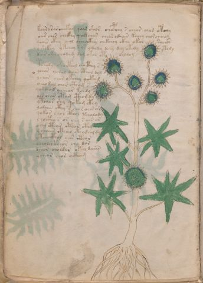

# Voynich Speculative Herbal Ferment Recipe — f6v

IMPORTANT: this is NOT a real or validated translation of the Voynich Manuscript. It is a speculative/procedural model that interprets EVA using a user-defined grammar to generate experimental recipes using safe, known edible substitutes.

This file is generated automatically from IVTFF/EVA transliteration plus a user-defined procedural grammar.

## Page / Folio
- currier: A
- folio: f6v
- page_number: 12
- plant_candidates: ['blackgum tree?', 'arctium? Bidenskyptis']
- plant_category_confidence: 0.4
- plant_category_guess: root
- plant_category_matches: ['arctium']
- plant_id: blackgum tree?, arctium? Bidens(sp?)kyptis (O'Neill),
- section: herbal

## Plant Interpretation (Heuristic)
- category: root
- confidence: 0.4
- note: Heuristic classification based on the IVTFF 'Plant ID' string (not the drawing). Does not imply real identification of the manuscript plant.
- textual_evidence_terms: ['arctium']

## EVA Text (Transliteration)
koary sar [ch:oh]eekar qoor shor chapchy s chear char otchy
oees chor chckhy qoekchar chea[s:r] odaiiin kchey chor chaiin
qoair ckhy chol oechockhy chekchoy ckhy okol rychos
y shckhy ytchoy s os y jajy dchy dey okody ytody
dair c'ha chodam dam okor oty doldom
tchody shocthol chocthhy s
ychos ychol daiin cthol dol
ychor chor okchey qokom
oeeo dal chor cthom s
qokchod ychear kchdy
lor char otam ctho m dy
ytcho[s:r] shy qokam cthy
yodaiin cthy s chor oees or
qokor chol cthol tchalody
chockhy s or chy s ain ar
ochy cthar cth[a:o]r cthy
y chaies ckhal cthodam dy
ytchocthol ches ithor
ocholy kchos chy dor
dchor choldar okol daiin
ycheor chor octham

## Page Summary (Procedural, Aggregated)
- compound_counts: {'sugars': 16, 'mix/transfer': 75, 'main herb': 50, 'liquid base': 7, 'secondary herb': 4, 'yeast fermentation': 26, 'heat': 10, 'complex herbal compound': 21}
- dose_level: 2
- fermentation_estimate: 7–14 days

## Pantry (Max Needed For Any Single Line-Recipe)
- main_plant_dry_g: 10
- main_plant_substitute: ['ginger (dry or fresh)']
- safe_complex_herbal_blend: ['gentle spices (e.g., 1 g cinnamon + 1 g clove) or a commercial herbal tea blend']
- secondary_herb_dry_g: 5
- secondary_herb_substitute: ['food-grade lemon peel']
- sugar_or_honey_g: 50
- water_l: 0.5
- yeast_g: 1

## Line Recipes (Each Line = One Recipe, 0.5L batch)

### f6v.1,@P0

EVA: koary sar [ch:oh]eekar qoor shor chapchy s chear char otchy

## Ingredients
- main_plant_dry_g: 10
- main_plant_substitute: ginger (dry or fresh)
- secondary_herb_dry_g: 5
- secondary_herb_substitute: food-grade lemon peel
- sugar_or_honey_g: 50
- water_l: 0.5
- yeast_g: 1

Process:
1. Sanitize the jar/fermenter and utensils.
2. Base: combine 0.5 L water with 50 g sugar or honey.
3. Apply gentle heat: simmer 10–15 min, then cool to <30°C before adding yeast.
4. Add main plant: ginger (dry or fresh) (~10 g dried).
5. Add secondary herb: food-grade lemon peel (~5 g dried).
6. Pitch yeast: 1 g (ideally cider/beer yeast).
7. Ferment with an airlock: 2–4 days (guided by iin/aiin markers).
8. Strain/rack (if very solid-heavy) and cold-crash 24 h.
9. Bottle only when activity clearly slows; refrigerate. Avoid overpressure.

Expected Result: A mild, aromatic herbal ferment, low-to-medium intensity depending on dose level.

Does It Make Sense?: yes

Direct Gloss (Procedural, Not a Real Translation):
- koary: add fermentable sugars → mix / transfer → duration level 1 → state: fermentation start
- sar: duration level 1 → state: fermentation start
- ch: add main plant (safe substitute)
- oh: mix / transfer
- eekar: add fermentable sugars → duration level 2 → state: active extraction
- qoor: prepare liquid base → mix / transfer
- shor: add secondary herb (safe substitute) → mix / transfer
- chapchy: add main plant (safe substitute) → start fermentation (yeast) → duration level 1 → state: fermentation start
- s: [unparsed]
- chear: add main plant (safe substitute) → duration level 1 → state: active extraction
- char: add main plant (safe substitute) → duration level 1 → state: fermentation start
- otchy: apply heat/cooking → add main plant (safe substitute) → mix / transfer

### f6v.2,+P0

EVA: oees chor chckhy qoekchar chea[s:r] odaiiin kchey chor chaiin

## Ingredients
- main_plant_dry_g: 10
- main_plant_substitute: ginger (dry or fresh)
- safe_complex_herbal_blend: gentle spices (e.g., 1 g cinnamon + 1 g clove) or a commercial herbal tea blend
- secondary_herb_dry_g: 2
- secondary_herb_substitute: food-grade lemon peel
- sugar_or_honey_g: 50
- water_l: 0.5
- yeast_g: 1

Process:
1. Sanitize the jar/fermenter and utensils.
2. Base: combine 0.5 L water with 50 g sugar or honey.
3. Infusion: use hot (not boiling) water, then let it cool before adding yeast.
4. Add main plant: ginger (dry or fresh) (~10 g dried).
5. Add secondary herb: food-grade lemon peel (~2 g dried).
6. If a complex herbal compound appears, use a safe commercial blend or gentle spices in micro-doses.
7. Pitch yeast: 1 g (ideally cider/beer yeast).
8. Ferment with an airlock: 7–14 days (guided by iin/aiin markers).
9. Strain/rack (if very solid-heavy) and cold-crash 24 h.
10. Bottle only when activity clearly slows; refrigerate. Avoid overpressure.

Expected Result: A mild, aromatic herbal ferment, low-to-medium intensity depending on dose level.

Does It Make Sense?: yes

Direct Gloss (Procedural, Not a Real Translation):
- oees: mix / transfer → duration level 2 → state: active extraction
- chor: add main plant (safe substitute) → mix / transfer
- chckhy: add main plant (safe substitute) → add complex herbal compound (safe blend)
- qoekchar: prepare liquid base → add fermentable sugars → add main plant (safe substitute) → duration level 1 → state: active extraction
- chea: add main plant (safe substitute) → duration level 1 → state: active extraction
- s: [unparsed]
- r: [unparsed]
- odaiiin: mix / transfer → start fermentation (yeast) → duration level 1 → state: fermentation start → medium fermentation phase
- kchey: add fermentable sugars → add main plant (safe substitute) → duration level 1 → state: active extraction
- chor: add main plant (safe substitute) → mix / transfer
- chaiin: add main plant (safe substitute) → duration level 1 → state: fermentation start → long fermentation / aging phase

### f6v.3,+P0

EVA: qoair ckhy chol oechockhy chekchoy ckhy okol rychos

## Ingredients
- main_plant_dry_g: 5
- main_plant_substitute: ginger (dry or fresh)
- safe_complex_herbal_blend: gentle spices (e.g., 1 g cinnamon + 1 g clove) or a commercial herbal tea blend
- secondary_herb_dry_g: 1
- secondary_herb_substitute: food-grade lemon peel
- sugar_or_honey_g: 25
- water_l: 0.5
- yeast_g: 1

Process:
1. Sanitize the jar/fermenter and utensils.
2. Base: combine 0.5 L water with 25 g sugar or honey.
3. Infusion: use hot (not boiling) water, then let it cool before adding yeast.
4. Add main plant: ginger (dry or fresh) (~5 g dried).
5. Add secondary herb: food-grade lemon peel (~1 g dried).
6. If a complex herbal compound appears, use a safe commercial blend or gentle spices in micro-doses.
7. Pitch yeast: 1 g (ideally cider/beer yeast).
8. Ferment with an airlock: 2–4 days (guided by iin/aiin markers).
9. Strain/rack (if very solid-heavy) and cold-crash 24 h.
10. Bottle only when activity clearly slows; refrigerate. Avoid overpressure.

Expected Result: A mild, aromatic herbal ferment, low-to-medium intensity depending on dose level.

Does It Make Sense?: yes

Direct Gloss (Procedural, Not a Real Translation):
- qoair: prepare liquid base → duration level 1 → state: fermentation start
- ckhy: add complex herbal compound (safe blend)
- chol: add main plant (safe substitute) → mix / transfer
- oechockhy: add main plant (safe substitute) → mix / transfer → add complex herbal compound (safe blend) → duration level 1 → state: active extraction
- chekchoy: add fermentable sugars → add main plant (safe substitute) → mix / transfer → duration level 1 → state: active extraction
- ckhy: add complex herbal compound (safe blend)
- okol: add fermentable sugars → mix / transfer
- rychos: add main plant (safe substitute) → mix / transfer

### f6v.4,+P0

EVA: y shckhy ytchoy s os y jajy dchy dey okody ytody

## Ingredients
- main_plant_dry_g: 5
- main_plant_substitute: ginger (dry or fresh)
- safe_complex_herbal_blend: gentle spices (e.g., 1 g cinnamon + 1 g clove) or a commercial herbal tea blend
- secondary_herb_dry_g: 2
- secondary_herb_substitute: food-grade lemon peel
- sugar_or_honey_g: 25
- water_l: 0.5
- yeast_g: 1

Process:
1. Sanitize the jar/fermenter and utensils.
2. Base: combine 0.5 L water with 25 g sugar or honey.
3. Apply gentle heat: simmer 10–15 min, then cool to <30°C before adding yeast.
4. Add main plant: ginger (dry or fresh) (~5 g dried).
5. Add secondary herb: food-grade lemon peel (~2 g dried).
6. If a complex herbal compound appears, use a safe commercial blend or gentle spices in micro-doses.
7. Pitch yeast: 1 g (ideally cider/beer yeast).
8. Ferment with an airlock: 2–4 days (guided by iin/aiin markers).
9. Strain/rack (if very solid-heavy) and cold-crash 24 h.
10. Bottle only when activity clearly slows; refrigerate. Avoid overpressure.

Expected Result: A mild, aromatic herbal ferment, low-to-medium intensity depending on dose level.

Does It Make Sense?: yes

Direct Gloss (Procedural, Not a Real Translation):
- y: [unparsed]
- shckhy: add secondary herb (safe substitute) → add complex herbal compound (safe blend)
- ytchoy: apply heat/cooking → add main plant (safe substitute) → mix / transfer
- s: [unparsed]
- os: mix / transfer
- y: [unparsed]
- jajy: duration level 1 → state: fermentation start
- dchy: add main plant (safe substitute) → start fermentation (yeast)
- dey: start fermentation (yeast) → duration level 1 → state: active extraction
- okody: add fermentable sugars → mix / transfer → start fermentation (yeast)
- ytody: apply heat/cooking → mix / transfer → start fermentation (yeast)

### f6v.5,+P0

EVA: dair c'ha chodam dam okor oty doldom

## Ingredients
- main_plant_dry_g: 5
- main_plant_substitute: ginger (dry or fresh)
- secondary_herb_dry_g: 1
- secondary_herb_substitute: food-grade lemon peel
- sugar_or_honey_g: 25
- water_l: 0.5
- yeast_g: 1

Process:
1. Sanitize the jar/fermenter and utensils.
2. Base: combine 0.5 L water with 25 g sugar or honey.
3. Apply gentle heat: simmer 10–15 min, then cool to <30°C before adding yeast.
4. Add main plant: ginger (dry or fresh) (~5 g dried).
5. Add secondary herb: food-grade lemon peel (~1 g dried).
6. Pitch yeast: 1 g (ideally cider/beer yeast).
7. Ferment with an airlock: 2–4 days (guided by iin/aiin markers).
8. Strain/rack (if very solid-heavy) and cold-crash 24 h.
9. Bottle only when activity clearly slows; refrigerate. Avoid overpressure.

Expected Result: A mild, aromatic herbal ferment, low-to-medium intensity depending on dose level.

Does It Make Sense?: yes

Direct Gloss (Procedural, Not a Real Translation):
- dair: start fermentation (yeast) → duration level 1 → state: fermentation start
- c: [unparsed]
- ha: duration level 1 → state: fermentation start
- chodam: add main plant (safe substitute) → mix / transfer → start fermentation (yeast) → duration level 1 → state: fermentation start
- dam: start fermentation (yeast) → duration level 1 → state: fermentation start
- okor: add fermentable sugars → mix / transfer
- oty: apply heat/cooking → mix / transfer
- doldom: mix / transfer → start fermentation (yeast)

### f6v.6,+P0

EVA: tchody shocthol chocthhy s

## Ingredients
- main_plant_dry_g: 5
- main_plant_substitute: ginger (dry or fresh)
- safe_complex_herbal_blend: gentle spices (e.g., 1 g cinnamon + 1 g clove) or a commercial herbal tea blend
- secondary_herb_dry_g: 2
- secondary_herb_substitute: food-grade lemon peel
- sugar_or_honey_g: 12
- water_l: 0.5
- yeast_g: 1

Process:
1. Sanitize the jar/fermenter and utensils.
2. Base: combine 0.5 L water with 12 g sugar or honey.
3. Apply gentle heat: simmer 10–15 min, then cool to <30°C before adding yeast.
4. Add main plant: ginger (dry or fresh) (~5 g dried).
5. Add secondary herb: food-grade lemon peel (~2 g dried).
6. If a complex herbal compound appears, use a safe commercial blend or gentle spices in micro-doses.
7. Pitch yeast: 1 g (ideally cider/beer yeast).
8. Ferment with an airlock: 2–4 days (guided by iin/aiin markers).
9. Strain/rack (if very solid-heavy) and cold-crash 24 h.
10. Bottle only when activity clearly slows; refrigerate. Avoid overpressure.

Expected Result: A mild, aromatic herbal ferment, low-to-medium intensity depending on dose level.

Does It Make Sense?: yes

Direct Gloss (Procedural, Not a Real Translation):
- tchody: apply heat/cooking → add main plant (safe substitute) → mix / transfer → start fermentation (yeast)
- shocthol: add secondary herb (safe substitute) → mix / transfer → add complex herbal compound (safe blend)
- chocthhy: add main plant (safe substitute) → mix / transfer → add complex herbal compound (safe blend)
- s: [unparsed]

### f6v.7,+P0

EVA: ychos ychol daiin cthol dol

## Ingredients
- main_plant_dry_g: 5
- main_plant_substitute: ginger (dry or fresh)
- safe_complex_herbal_blend: gentle spices (e.g., 1 g cinnamon + 1 g clove) or a commercial herbal tea blend
- secondary_herb_dry_g: 1
- secondary_herb_substitute: food-grade lemon peel
- sugar_or_honey_g: 12
- water_l: 0.5
- yeast_g: 1

Process:
1. Sanitize the jar/fermenter and utensils.
2. Base: combine 0.5 L water with 12 g sugar or honey.
3. Infusion: use hot (not boiling) water, then let it cool before adding yeast.
4. Add main plant: ginger (dry or fresh) (~5 g dried).
5. Add secondary herb: food-grade lemon peel (~1 g dried).
6. If a complex herbal compound appears, use a safe commercial blend or gentle spices in micro-doses.
7. Pitch yeast: 1 g (ideally cider/beer yeast).
8. Ferment with an airlock: 7–14 days (guided by iin/aiin markers).
9. Strain/rack (if very solid-heavy) and cold-crash 24 h.
10. Bottle only when activity clearly slows; refrigerate. Avoid overpressure.

Expected Result: A mild, aromatic herbal ferment, low-to-medium intensity depending on dose level.

Does It Make Sense?: yes

Direct Gloss (Procedural, Not a Real Translation):
- ychos: add main plant (safe substitute) → mix / transfer
- ychol: add main plant (safe substitute) → mix / transfer
- daiin: start fermentation (yeast) → duration level 1 → state: fermentation start → long fermentation / aging phase
- cthol: mix / transfer → add complex herbal compound (safe blend)
- dol: mix / transfer → start fermentation (yeast)

### f6v.8,+P0

EVA: ychor chor okchey qokom

## Ingredients
- main_plant_dry_g: 5
- main_plant_substitute: ginger (dry or fresh)
- secondary_herb_dry_g: 1
- secondary_herb_substitute: food-grade lemon peel
- sugar_or_honey_g: 25
- water_l: 0.5
- yeast_g: 1

Process:
1. Sanitize the jar/fermenter and utensils.
2. Base: combine 0.5 L water with 25 g sugar or honey.
3. Infusion: use hot (not boiling) water, then let it cool before adding yeast.
4. Add main plant: ginger (dry or fresh) (~5 g dried).
5. Add secondary herb: food-grade lemon peel (~1 g dried).
6. Pitch yeast: 1 g (ideally cider/beer yeast).
7. Ferment with an airlock: 2–4 days (guided by iin/aiin markers).
8. Strain/rack (if very solid-heavy) and cold-crash 24 h.
9. Bottle only when activity clearly slows; refrigerate. Avoid overpressure.

Expected Result: A mild, aromatic herbal ferment, low-to-medium intensity depending on dose level.

Does It Make Sense?: yes

Direct Gloss (Procedural, Not a Real Translation):
- ychor: add main plant (safe substitute) → mix / transfer
- chor: add main plant (safe substitute) → mix / transfer
- okchey: add fermentable sugars → add main plant (safe substitute) → mix / transfer → duration level 1 → state: active extraction
- qokom: prepare liquid base → add fermentable sugars → mix / transfer

### f6v.9,+P0

EVA: oeeo dal chor cthom s

## Ingredients
- main_plant_dry_g: 10
- main_plant_substitute: ginger (dry or fresh)
- safe_complex_herbal_blend: gentle spices (e.g., 1 g cinnamon + 1 g clove) or a commercial herbal tea blend
- secondary_herb_dry_g: 2
- secondary_herb_substitute: food-grade lemon peel
- sugar_or_honey_g: 25
- water_l: 0.5
- yeast_g: 1

Process:
1. Sanitize the jar/fermenter and utensils.
2. Base: combine 0.5 L water with 25 g sugar or honey.
3. Infusion: use hot (not boiling) water, then let it cool before adding yeast.
4. Add main plant: ginger (dry or fresh) (~10 g dried).
5. Add secondary herb: food-grade lemon peel (~2 g dried).
6. If a complex herbal compound appears, use a safe commercial blend or gentle spices in micro-doses.
7. Pitch yeast: 1 g (ideally cider/beer yeast).
8. Ferment with an airlock: 2–4 days (guided by iin/aiin markers).
9. Strain/rack (if very solid-heavy) and cold-crash 24 h.
10. Bottle only when activity clearly slows; refrigerate. Avoid overpressure.

Expected Result: A mild, aromatic herbal ferment, low-to-medium intensity depending on dose level.

Does It Make Sense?: yes

Direct Gloss (Procedural, Not a Real Translation):
- oeeo: mix / transfer → duration level 2 → state: active extraction
- dal: start fermentation (yeast) → duration level 1 → state: fermentation start
- chor: add main plant (safe substitute) → mix / transfer
- cthom: mix / transfer → add complex herbal compound (safe blend)
- s: [unparsed]

### f6v.10,+P0

EVA: qokchod ychear kchdy

## Ingredients
- main_plant_dry_g: 5
- main_plant_substitute: ginger (dry or fresh)
- secondary_herb_dry_g: 1
- secondary_herb_substitute: food-grade lemon peel
- sugar_or_honey_g: 25
- water_l: 0.5
- yeast_g: 1

Process:
1. Sanitize the jar/fermenter and utensils.
2. Base: combine 0.5 L water with 25 g sugar or honey.
3. Infusion: use hot (not boiling) water, then let it cool before adding yeast.
4. Add main plant: ginger (dry or fresh) (~5 g dried).
5. Add secondary herb: food-grade lemon peel (~1 g dried).
6. Pitch yeast: 1 g (ideally cider/beer yeast).
7. Ferment with an airlock: 2–4 days (guided by iin/aiin markers).
8. Strain/rack (if very solid-heavy) and cold-crash 24 h.
9. Bottle only when activity clearly slows; refrigerate. Avoid overpressure.

Expected Result: A mild, aromatic herbal ferment, low-to-medium intensity depending on dose level.

Does It Make Sense?: yes

Direct Gloss (Procedural, Not a Real Translation):
- qokchod: prepare liquid base → add fermentable sugars → add main plant (safe substitute) → mix / transfer → start fermentation (yeast)
- ychear: add main plant (safe substitute) → duration level 1 → state: active extraction
- kchdy: add fermentable sugars → add main plant (safe substitute) → start fermentation (yeast)

### f6v.11,+P0

EVA: lor char otam ctho m dy

## Ingredients
- main_plant_dry_g: 5
- main_plant_substitute: ginger (dry or fresh)
- safe_complex_herbal_blend: gentle spices (e.g., 1 g cinnamon + 1 g clove) or a commercial herbal tea blend
- secondary_herb_dry_g: 1
- secondary_herb_substitute: food-grade lemon peel
- sugar_or_honey_g: 12
- water_l: 0.5
- yeast_g: 1

Process:
1. Sanitize the jar/fermenter and utensils.
2. Base: combine 0.5 L water with 12 g sugar or honey.
3. Apply gentle heat: simmer 10–15 min, then cool to <30°C before adding yeast.
4. Add main plant: ginger (dry or fresh) (~5 g dried).
5. Add secondary herb: food-grade lemon peel (~1 g dried).
6. If a complex herbal compound appears, use a safe commercial blend or gentle spices in micro-doses.
7. Pitch yeast: 1 g (ideally cider/beer yeast).
8. Ferment with an airlock: 2–4 days (guided by iin/aiin markers).
9. Strain/rack (if very solid-heavy) and cold-crash 24 h.
10. Bottle only when activity clearly slows; refrigerate. Avoid overpressure.

Expected Result: A mild, aromatic herbal ferment, low-to-medium intensity depending on dose level.

Does It Make Sense?: yes

Direct Gloss (Procedural, Not a Real Translation):
- lor: mix / transfer
- char: add main plant (safe substitute) → duration level 1 → state: fermentation start
- otam: apply heat/cooking → mix / transfer → duration level 1 → state: fermentation start
- ctho: mix / transfer → add complex herbal compound (safe blend)
- m: [unparsed]
- dy: start fermentation (yeast)

### f6v.12,+P0

EVA: ytcho[s:r] shy qokam cthy

## Ingredients
- main_plant_dry_g: 5
- main_plant_substitute: ginger (dry or fresh)
- safe_complex_herbal_blend: gentle spices (e.g., 1 g cinnamon + 1 g clove) or a commercial herbal tea blend
- secondary_herb_dry_g: 2
- secondary_herb_substitute: food-grade lemon peel
- sugar_or_honey_g: 25
- water_l: 0.5
- yeast_g: 1

Process:
1. Sanitize the jar/fermenter and utensils.
2. Base: combine 0.5 L water with 25 g sugar or honey.
3. Apply gentle heat: simmer 10–15 min, then cool to <30°C before adding yeast.
4. Add main plant: ginger (dry or fresh) (~5 g dried).
5. Add secondary herb: food-grade lemon peel (~2 g dried).
6. If a complex herbal compound appears, use a safe commercial blend or gentle spices in micro-doses.
7. Pitch yeast: 1 g (ideally cider/beer yeast).
8. Ferment with an airlock: 2–4 days (guided by iin/aiin markers).
9. Strain/rack (if very solid-heavy) and cold-crash 24 h.
10. Bottle only when activity clearly slows; refrigerate. Avoid overpressure.

Expected Result: A mild, aromatic herbal ferment, low-to-medium intensity depending on dose level.

Does It Make Sense?: yes

Direct Gloss (Procedural, Not a Real Translation):
- ytcho: apply heat/cooking → add main plant (safe substitute) → mix / transfer
- s: [unparsed]
- r: [unparsed]
- shy: add secondary herb (safe substitute)
- qokam: prepare liquid base → add fermentable sugars → duration level 1 → state: fermentation start
- cthy: add complex herbal compound (safe blend)

### f6v.13,+P0

EVA: yodaiin cthy s chor oees or

## Ingredients
- main_plant_dry_g: 10
- main_plant_substitute: ginger (dry or fresh)
- safe_complex_herbal_blend: gentle spices (e.g., 1 g cinnamon + 1 g clove) or a commercial herbal tea blend
- secondary_herb_dry_g: 2
- secondary_herb_substitute: food-grade lemon peel
- sugar_or_honey_g: 25
- water_l: 0.5
- yeast_g: 1

Process:
1. Sanitize the jar/fermenter and utensils.
2. Base: combine 0.5 L water with 25 g sugar or honey.
3. Infusion: use hot (not boiling) water, then let it cool before adding yeast.
4. Add main plant: ginger (dry or fresh) (~10 g dried).
5. Add secondary herb: food-grade lemon peel (~2 g dried).
6. If a complex herbal compound appears, use a safe commercial blend or gentle spices in micro-doses.
7. Pitch yeast: 1 g (ideally cider/beer yeast).
8. Ferment with an airlock: 7–14 days (guided by iin/aiin markers).
9. Strain/rack (if very solid-heavy) and cold-crash 24 h.
10. Bottle only when activity clearly slows; refrigerate. Avoid overpressure.

Expected Result: A mild, aromatic herbal ferment, low-to-medium intensity depending on dose level.

Does It Make Sense?: yes

Direct Gloss (Procedural, Not a Real Translation):
- yodaiin: mix / transfer → start fermentation (yeast) → duration level 1 → state: fermentation start → long fermentation / aging phase
- cthy: add complex herbal compound (safe blend)
- s: [unparsed]
- chor: add main plant (safe substitute) → mix / transfer
- oees: mix / transfer → duration level 2 → state: active extraction
- or: mix / transfer

### f6v.14,+P0

EVA: qokor chol cthol tchalody

## Ingredients
- main_plant_dry_g: 5
- main_plant_substitute: ginger (dry or fresh)
- safe_complex_herbal_blend: gentle spices (e.g., 1 g cinnamon + 1 g clove) or a commercial herbal tea blend
- secondary_herb_dry_g: 1
- secondary_herb_substitute: food-grade lemon peel
- sugar_or_honey_g: 25
- water_l: 0.5
- yeast_g: 1

Process:
1. Sanitize the jar/fermenter and utensils.
2. Base: combine 0.5 L water with 25 g sugar or honey.
3. Apply gentle heat: simmer 10–15 min, then cool to <30°C before adding yeast.
4. Add main plant: ginger (dry or fresh) (~5 g dried).
5. Add secondary herb: food-grade lemon peel (~1 g dried).
6. If a complex herbal compound appears, use a safe commercial blend or gentle spices in micro-doses.
7. Pitch yeast: 1 g (ideally cider/beer yeast).
8. Ferment with an airlock: 2–4 days (guided by iin/aiin markers).
9. Strain/rack (if very solid-heavy) and cold-crash 24 h.
10. Bottle only when activity clearly slows; refrigerate. Avoid overpressure.

Expected Result: A mild, aromatic herbal ferment, low-to-medium intensity depending on dose level.

Does It Make Sense?: yes

Direct Gloss (Procedural, Not a Real Translation):
- qokor: prepare liquid base → add fermentable sugars → mix / transfer
- chol: add main plant (safe substitute) → mix / transfer
- cthol: mix / transfer → add complex herbal compound (safe blend)
- tchalody: apply heat/cooking → add main plant (safe substitute) → mix / transfer → start fermentation (yeast) → duration level 1 → state: fermentation start

### f6v.15,+P0

EVA: chockhy s or chy s ain ar

## Ingredients
- main_plant_dry_g: 5
- main_plant_substitute: ginger (dry or fresh)
- safe_complex_herbal_blend: gentle spices (e.g., 1 g cinnamon + 1 g clove) or a commercial herbal tea blend
- secondary_herb_dry_g: 1
- secondary_herb_substitute: food-grade lemon peel
- sugar_or_honey_g: 12
- water_l: 0.5
- yeast_g: 1

Process:
1. Sanitize the jar/fermenter and utensils.
2. Base: combine 0.5 L water with 12 g sugar or honey.
3. Infusion: use hot (not boiling) water, then let it cool before adding yeast.
4. Add main plant: ginger (dry or fresh) (~5 g dried).
5. Add secondary herb: food-grade lemon peel (~1 g dried).
6. If a complex herbal compound appears, use a safe commercial blend or gentle spices in micro-doses.
7. Pitch yeast: 1 g (ideally cider/beer yeast).
8. Ferment with an airlock: 2–4 days (guided by iin/aiin markers).
9. Strain/rack (if very solid-heavy) and cold-crash 24 h.
10. Bottle only when activity clearly slows; refrigerate. Avoid overpressure.

Expected Result: A mild, aromatic herbal ferment, low-to-medium intensity depending on dose level.

Does It Make Sense?: yes

Direct Gloss (Procedural, Not a Real Translation):
- chockhy: add main plant (safe substitute) → mix / transfer → add complex herbal compound (safe blend)
- s: [unparsed]
- or: mix / transfer
- chy: add main plant (safe substitute)
- s: [unparsed]
- ain: duration level 1 → state: fermentation start
- ar: duration level 1 → state: fermentation start

### f6v.16,+P0

EVA: ochy cthar cth[a:o]r cthy

## Ingredients
- main_plant_dry_g: 5
- main_plant_substitute: ginger (dry or fresh)
- safe_complex_herbal_blend: gentle spices (e.g., 1 g cinnamon + 1 g clove) or a commercial herbal tea blend
- secondary_herb_dry_g: 1
- secondary_herb_substitute: food-grade lemon peel
- sugar_or_honey_g: 12
- water_l: 0.5
- yeast_g: 1

Process:
1. Sanitize the jar/fermenter and utensils.
2. Base: combine 0.5 L water with 12 g sugar or honey.
3. Infusion: use hot (not boiling) water, then let it cool before adding yeast.
4. Add main plant: ginger (dry or fresh) (~5 g dried).
5. Add secondary herb: food-grade lemon peel (~1 g dried).
6. If a complex herbal compound appears, use a safe commercial blend or gentle spices in micro-doses.
7. Pitch yeast: 1 g (ideally cider/beer yeast).
8. Ferment with an airlock: 2–4 days (guided by iin/aiin markers).
9. Strain/rack (if very solid-heavy) and cold-crash 24 h.
10. Bottle only when activity clearly slows; refrigerate. Avoid overpressure.

Expected Result: A mild, aromatic herbal ferment, low-to-medium intensity depending on dose level.

Does It Make Sense?: yes

Direct Gloss (Procedural, Not a Real Translation):
- ochy: add main plant (safe substitute) → mix / transfer
- cthar: add complex herbal compound (safe blend) → duration level 1 → state: fermentation start
- cth: add complex herbal compound (safe blend)
- a: duration level 1 → state: fermentation start
- o: mix / transfer
- r: [unparsed]
- cthy: add complex herbal compound (safe blend)

### f6v.17,+P0

EVA: y chaies ckhal cthodam dy

## Ingredients
- main_plant_dry_g: 5
- main_plant_substitute: ginger (dry or fresh)
- safe_complex_herbal_blend: gentle spices (e.g., 1 g cinnamon + 1 g clove) or a commercial herbal tea blend
- secondary_herb_dry_g: 1
- secondary_herb_substitute: food-grade lemon peel
- sugar_or_honey_g: 12
- water_l: 0.5
- yeast_g: 1

Process:
1. Sanitize the jar/fermenter and utensils.
2. Base: combine 0.5 L water with 12 g sugar or honey.
3. Infusion: use hot (not boiling) water, then let it cool before adding yeast.
4. Add main plant: ginger (dry or fresh) (~5 g dried).
5. Add secondary herb: food-grade lemon peel (~1 g dried).
6. If a complex herbal compound appears, use a safe commercial blend or gentle spices in micro-doses.
7. Pitch yeast: 1 g (ideally cider/beer yeast).
8. Ferment with an airlock: 2–4 days (guided by iin/aiin markers).
9. Strain/rack (if very solid-heavy) and cold-crash 24 h.
10. Bottle only when activity clearly slows; refrigerate. Avoid overpressure.

Expected Result: A mild, aromatic herbal ferment, low-to-medium intensity depending on dose level.

Does It Make Sense?: yes

Direct Gloss (Procedural, Not a Real Translation):
- y: [unparsed]
- chaies: add main plant (safe substitute) → duration level 1 → state: fermentation start
- ckhal: add complex herbal compound (safe blend) → duration level 1 → state: fermentation start
- cthodam: mix / transfer → start fermentation (yeast) → add complex herbal compound (safe blend) → duration level 1 → state: fermentation start
- dy: start fermentation (yeast)

### f6v.18,+P0

EVA: ytchocthol ches ithor

## Ingredients
- main_plant_dry_g: 5
- main_plant_substitute: ginger (dry or fresh)
- safe_complex_herbal_blend: gentle spices (e.g., 1 g cinnamon + 1 g clove) or a commercial herbal tea blend
- secondary_herb_dry_g: 1
- secondary_herb_substitute: food-grade lemon peel
- sugar_or_honey_g: 12
- water_l: 0.5
- yeast_g: 1

Process:
1. Sanitize the jar/fermenter and utensils.
2. Base: combine 0.5 L water with 12 g sugar or honey.
3. Apply gentle heat: simmer 10–15 min, then cool to <30°C before adding yeast.
4. Add main plant: ginger (dry or fresh) (~5 g dried).
5. Add secondary herb: food-grade lemon peel (~1 g dried).
6. If a complex herbal compound appears, use a safe commercial blend or gentle spices in micro-doses.
7. Pitch yeast: 1 g (ideally cider/beer yeast).
8. Ferment with an airlock: 2–4 days (guided by iin/aiin markers).
9. Strain/rack (if very solid-heavy) and cold-crash 24 h.
10. Bottle only when activity clearly slows; refrigerate. Avoid overpressure.

Expected Result: A mild, aromatic herbal ferment, low-to-medium intensity depending on dose level.

Does It Make Sense?: yes

Direct Gloss (Procedural, Not a Real Translation):
- ytchocthol: apply heat/cooking → add main plant (safe substitute) → mix / transfer → add complex herbal compound (safe blend)
- ches: add main plant (safe substitute) → duration level 1 → state: active extraction
- ithor: apply heat/cooking → mix / transfer → duration level 1 → state: cooling/rest

### f6v.19,+P0

EVA: ocholy kchos chy dor

## Ingredients
- main_plant_dry_g: 5
- main_plant_substitute: ginger (dry or fresh)
- secondary_herb_dry_g: 1
- secondary_herb_substitute: food-grade lemon peel
- sugar_or_honey_g: 25
- water_l: 0.5
- yeast_g: 1

Process:
1. Sanitize the jar/fermenter and utensils.
2. Base: combine 0.5 L water with 25 g sugar or honey.
3. Infusion: use hot (not boiling) water, then let it cool before adding yeast.
4. Add main plant: ginger (dry or fresh) (~5 g dried).
5. Add secondary herb: food-grade lemon peel (~1 g dried).
6. Pitch yeast: 1 g (ideally cider/beer yeast).
7. Ferment with an airlock: 2–4 days (guided by iin/aiin markers).
8. Strain/rack (if very solid-heavy) and cold-crash 24 h.
9. Bottle only when activity clearly slows; refrigerate. Avoid overpressure.

Expected Result: A mild, aromatic herbal ferment, low-to-medium intensity depending on dose level.

Does It Make Sense?: yes

Direct Gloss (Procedural, Not a Real Translation):
- ocholy: add main plant (safe substitute) → mix / transfer
- kchos: add fermentable sugars → add main plant (safe substitute) → mix / transfer
- chy: add main plant (safe substitute)
- dor: mix / transfer → start fermentation (yeast)

### f6v.20,+P0

EVA: dchor choldar okol daiin

## Ingredients
- main_plant_dry_g: 5
- main_plant_substitute: ginger (dry or fresh)
- secondary_herb_dry_g: 1
- secondary_herb_substitute: food-grade lemon peel
- sugar_or_honey_g: 25
- water_l: 0.5
- yeast_g: 1

Process:
1. Sanitize the jar/fermenter and utensils.
2. Base: combine 0.5 L water with 25 g sugar or honey.
3. Infusion: use hot (not boiling) water, then let it cool before adding yeast.
4. Add main plant: ginger (dry or fresh) (~5 g dried).
5. Add secondary herb: food-grade lemon peel (~1 g dried).
6. Pitch yeast: 1 g (ideally cider/beer yeast).
7. Ferment with an airlock: 7–14 days (guided by iin/aiin markers).
8. Strain/rack (if very solid-heavy) and cold-crash 24 h.
9. Bottle only when activity clearly slows; refrigerate. Avoid overpressure.

Expected Result: A mild, aromatic herbal ferment, low-to-medium intensity depending on dose level.

Does It Make Sense?: yes

Direct Gloss (Procedural, Not a Real Translation):
- dchor: add main plant (safe substitute) → mix / transfer → start fermentation (yeast)
- choldar: add main plant (safe substitute) → mix / transfer → start fermentation (yeast) → duration level 1 → state: fermentation start
- okol: add fermentable sugars → mix / transfer
- daiin: start fermentation (yeast) → duration level 1 → state: fermentation start → long fermentation / aging phase

### f6v.21,+P0

EVA: ycheor chor octham

## Ingredients
- main_plant_dry_g: 5
- main_plant_substitute: ginger (dry or fresh)
- safe_complex_herbal_blend: gentle spices (e.g., 1 g cinnamon + 1 g clove) or a commercial herbal tea blend
- secondary_herb_dry_g: 1
- secondary_herb_substitute: food-grade lemon peel
- sugar_or_honey_g: 12
- water_l: 0.5
- yeast_g: 1

Process:
1. Sanitize the jar/fermenter and utensils.
2. Base: combine 0.5 L water with 12 g sugar or honey.
3. Infusion: use hot (not boiling) water, then let it cool before adding yeast.
4. Add main plant: ginger (dry or fresh) (~5 g dried).
5. Add secondary herb: food-grade lemon peel (~1 g dried).
6. If a complex herbal compound appears, use a safe commercial blend or gentle spices in micro-doses.
7. Pitch yeast: 1 g (ideally cider/beer yeast).
8. Ferment with an airlock: 2–4 days (guided by iin/aiin markers).
9. Strain/rack (if very solid-heavy) and cold-crash 24 h.
10. Bottle only when activity clearly slows; refrigerate. Avoid overpressure.

Expected Result: A mild, aromatic herbal ferment, low-to-medium intensity depending on dose level.

Does It Make Sense?: yes

Direct Gloss (Procedural, Not a Real Translation):
- ycheor: add main plant (safe substitute) → mix / transfer → duration level 1 → state: active extraction
- chor: add main plant (safe substitute) → mix / transfer
- octham: mix / transfer → add complex herbal compound (safe blend) → duration level 1 → state: fermentation start

## Risks & Warnings (Applies To All Line-Recipes)
- Never use unidentified Voynich plants directly; only use known edible substitutes.
- Do not consume if you see mold, smell rot, notice abnormal sliminess, or taste something clearly foul.
- Overpressure/bottle-bomb risk: do not bottle before stable; prefer an airlock and refrigeration.
- Avoid if pregnant/breastfeeding, for minors, or with medical conditions; consult a professional.
- No medical claims: this is an experimental beverage.

## Recommended Adjustments (General)
- If too bitter (leafy profile), halve the herbs or shorten steep/maceration time.
- If too sweet, extend fermentation or reduce sugar by 25–50%.
- For a non-alcoholic version, omit yeast and keep refrigerated as an infusion (not fermented).
