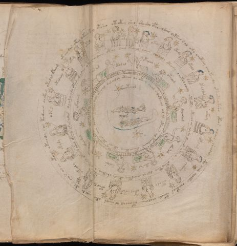

# Voynich Speculative Herbal Ferment Recipe — f70v2

IMPORTANT: this is NOT a real or validated translation of the Voynich Manuscript. It is a speculative/procedural model that interprets EVA using a user-defined grammar to generate experimental recipes using safe, known edible substitutes.

This file is generated automatically from IVTFF/EVA transliteration plus a user-defined procedural grammar.



## Page / Folio
- folio: f70v2
- page_number: 135

## EVA Text (Transliteration)
```text
okcheo dar otey ykeey tchy otsheo oteotey she[y:o] shecth opcheoldair dateey sal ody choteey choeteedy oteoteotsho yteos alain sheodaly c@162;ho aiin cholkal chokear oteody cholaiin oteeoal al sheeos okey chol dy otees cho s ola[r:n] otoaiin oteeody sos todaiin chokain otalal oteeam
otalalg
ykary
otar?
oty
oky ody
oty ar
okala
otody
otald
otaldar
okody
opysam
chckhhy
otaly
otal arar
otaldy
okeoly
okydy
okee[s:r]
daii@197;amdy otar am aral otair chedaiin oteey dair shchey daiin chalaly oteody chotol chedy oteotey oteeeor ar alody daiir oteedar oteey teey dalal cheoltey oteedy sheeteey ?okeeol ykeeos shey ykair arar alos
otar am
otar al
otalar
otalam
dolaram
okaram
oteosal
salols
okaldal
ykolaiin
otal daly oteoal dal aildy otaiin ar oteey shal o qoteeal ar al otaiin al teodaiin oteeo cthey oteeos oteos aiin daim
otolal
```

## Recipes Index (This Page)
- [f70v2.1,@Cc](#f70v2-1-f70v2-1-cc)
- [f70v2.2,@Lz](#f70v2-2-f70v2-2-lz)
- [f70v2.3,&Lz](#f70v2-3-f70v2-3-lz)
- [f70v2.4,&Lz](#f70v2-4-f70v2-4-lz)
- [f70v2.5,&Lz](#f70v2-5-f70v2-5-lz)
- [f70v2.6,&Lz](#f70v2-6-f70v2-6-lz)
- [f70v2.7,&Lz](#f70v2-7-f70v2-7-lz)
- [f70v2.8,&Lz](#f70v2-8-f70v2-8-lz)
- [f70v2.9,&Lz](#f70v2-9-f70v2-9-lz)
- [f70v2.10,&Lz](#f70v2-10-f70v2-10-lz)
- [f70v2.11,&Lz](#f70v2-11-f70v2-11-lz)
- [f70v2.12,&Lz](#f70v2-12-f70v2-12-lz)
- [f70v2.13,&Lz](#f70v2-13-f70v2-13-lz)
- [f70v2.14,&Lz](#f70v2-14-f70v2-14-lz)
- [f70v2.15,&Lz](#f70v2-15-f70v2-15-lz)
- [f70v2.16,&Lz](#f70v2-16-f70v2-16-lz)
- [f70v2.17,&Lz](#f70v2-17-f70v2-17-lz)
- [f70v2.18,&Lz](#f70v2-18-f70v2-18-lz)
- [f70v2.19,&Lz](#f70v2-19-f70v2-19-lz)
- [f70v2.20,&Lz](#f70v2-20-f70v2-20-lz)
- [f70v2.21,@Cc](#f70v2-21-f70v2-21-cc)
- [f70v2.22,@Lz](#f70v2-22-f70v2-22-lz)
- [f70v2.23,&Lz](#f70v2-23-f70v2-23-lz)
- [f70v2.24,&Lz](#f70v2-24-f70v2-24-lz)
- [f70v2.25,&Lz](#f70v2-25-f70v2-25-lz)
- [f70v2.26,&Lz](#f70v2-26-f70v2-26-lz)
- [f70v2.27,&Lz](#f70v2-27-f70v2-27-lz)
- [f70v2.28,&Lz](#f70v2-28-f70v2-28-lz)
- [f70v2.29,&Lz](#f70v2-29-f70v2-29-lz)
- [f70v2.30,&Lz](#f70v2-30-f70v2-30-lz)
- [f70v2.31,&Lz](#f70v2-31-f70v2-31-lz)
- [f70v2.32,@Cc](#f70v2-32-f70v2-32-cc)
- [f70v2.33,@Lz](#f70v2-33-f70v2-33-lz)

## Line Glosses (Procedural Gloss Only; Not a Translation)

<a id="f70v2-1-f70v2-1-cc"></a>

### f70v2.1,@Cc

EVA: okcheo dar otey ykeey tchy otsheo oteotey she[y:o] shecth opcheoldair dateey sal ody choteey choeteedy oteoteotsho yteos alain sheodaly c@162;ho aiin cholkal chokear oteody cholaiin oteeoal al sheeos okey chol dy otees cho s ola[r:n] otoaiin oteeody sos todaiin chokain otalal oteeam

Direct Gloss (Procedural, Not a Real Translation):
- okcheo: add fermentable sugars → add main plant (safe substitute) → mix / transfer → duration level 1 → state: active extraction
- dar: start fermentation (yeast) → duration level 1 → state: fermentation start
- otey: apply heat/cooking → mix / transfer → duration level 1 → state: active extraction
- ykeey: add fermentable sugars → duration level 2 → state: active extraction
- tchy: apply heat/cooking → add main plant (safe substitute)
- otsheo: apply heat/cooking → add secondary herb (safe substitute) → mix / transfer → duration level 1 → state: active extraction
- oteotey: apply heat/cooking → mix / transfer → duration level 1 → state: active extraction
- she: add secondary herb (safe substitute) → duration level 1 → state: active extraction
- y: [unparsed]
- o: mix / transfer
- shecth: add secondary herb (safe substitute) → add complex herbal compound (safe blend) → duration level 1 → state: active extraction
- opcheoldair: add main plant (safe substitute) → mix / transfer → start fermentation (yeast) → duration level 1 → state: active extraction
- dateey: apply heat/cooking → start fermentation (yeast) → duration level 1 → state: fermentation start
- sal: duration level 1 → state: fermentation start
- ody: mix / transfer → start fermentation (yeast)
- choteey: apply heat/cooking → add main plant (safe substitute) → mix / transfer → duration level 2 → state: active extraction
- choeteedy: apply heat/cooking → add main plant (safe substitute) → mix / transfer → start fermentation (yeast) → duration level 1 → state: active extraction
- oteoteotsho: apply heat/cooking → add secondary herb (safe substitute) → mix / transfer → duration level 1 → state: active extraction
- yteos: apply heat/cooking → mix / transfer → duration level 1 → state: active extraction
- alain: duration level 1 → state: fermentation start
- sheodaly: add secondary herb (safe substitute) → mix / transfer → start fermentation (yeast) → duration level 1 → state: active extraction
- c: [unparsed]
- ho: mix / transfer
- aiin: duration level 1 → state: fermentation start → long fermentation / aging phase
- cholkal: add fermentable sugars → add main plant (safe substitute) → mix / transfer → duration level 1 → state: fermentation start
- chokear: add fermentable sugars → add main plant (safe substitute) → mix / transfer → duration level 1 → state: active extraction
- oteody: apply heat/cooking → mix / transfer → start fermentation (yeast) → duration level 1 → state: active extraction
- cholaiin: add main plant (safe substitute) → mix / transfer → duration level 1 → state: fermentation start → long fermentation / aging phase
- oteeoal: apply heat/cooking → mix / transfer → duration level 2 → state: active extraction
- al: duration level 1 → state: fermentation start
- sheeos: add secondary herb (safe substitute) → mix / transfer → duration level 2 → state: active extraction
- okey: add fermentable sugars → mix / transfer → duration level 1 → state: active extraction
- chol: add main plant (safe substitute) → mix / transfer
- dy: start fermentation (yeast)
- otees: apply heat/cooking → mix / transfer → duration level 2 → state: active extraction
- cho: add main plant (safe substitute) → mix / transfer
- s: [unparsed]
- ola: mix / transfer → duration level 1 → state: fermentation start
- r: [unparsed]
- n: [unparsed]
- otoaiin: apply heat/cooking → mix / transfer → duration level 1 → state: fermentation start → long fermentation / aging phase
- oteeody: apply heat/cooking → mix / transfer → start fermentation (yeast) → duration level 2 → state: active extraction
- sos: mix / transfer
- todaiin: apply heat/cooking → mix / transfer → start fermentation (yeast) → duration level 1 → state: fermentation start → long fermentation / aging phase
- chokain: add fermentable sugars → add main plant (safe substitute) → mix / transfer → duration level 1 → state: fermentation start
- otalal: apply heat/cooking → mix / transfer → duration level 1 → state: fermentation start
- oteeam: apply heat/cooking → mix / transfer → duration level 2 → state: active extraction

<a id="f70v2-2-f70v2-2-lz"></a>

### f70v2.2,@Lz

EVA: otalalg

Direct Gloss (Procedural, Not a Real Translation):
- otalalg: apply heat/cooking → mix / transfer → duration level 1 → state: fermentation start

<a id="f70v2-3-f70v2-3-lz"></a>

### f70v2.3,&Lz

EVA: ykary

Direct Gloss (Procedural, Not a Real Translation):
- ykary: add fermentable sugars → duration level 1 → state: fermentation start

<a id="f70v2-4-f70v2-4-lz"></a>

### f70v2.4,&Lz

EVA: otar?

Direct Gloss (Procedural, Not a Real Translation):
- otar: apply heat/cooking → mix / transfer → duration level 1 → state: fermentation start

<a id="f70v2-5-f70v2-5-lz"></a>

### f70v2.5,&Lz

EVA: oty

Direct Gloss (Procedural, Not a Real Translation):
- oty: apply heat/cooking → mix / transfer

<a id="f70v2-6-f70v2-6-lz"></a>

### f70v2.6,&Lz

EVA: oky ody

Direct Gloss (Procedural, Not a Real Translation):
- oky: add fermentable sugars → mix / transfer
- ody: mix / transfer → start fermentation (yeast)

<a id="f70v2-7-f70v2-7-lz"></a>

### f70v2.7,&Lz

EVA: oty ar

Direct Gloss (Procedural, Not a Real Translation):
- oty: apply heat/cooking → mix / transfer
- ar: duration level 1 → state: fermentation start

<a id="f70v2-8-f70v2-8-lz"></a>

### f70v2.8,&Lz

EVA: okala

Direct Gloss (Procedural, Not a Real Translation):
- okala: add fermentable sugars → mix / transfer → duration level 1 → state: fermentation start

<a id="f70v2-9-f70v2-9-lz"></a>

### f70v2.9,&Lz

EVA: otody

Direct Gloss (Procedural, Not a Real Translation):
- otody: apply heat/cooking → mix / transfer → start fermentation (yeast)

<a id="f70v2-10-f70v2-10-lz"></a>

### f70v2.10,&Lz

EVA: otald

Direct Gloss (Procedural, Not a Real Translation):
- otald: apply heat/cooking → mix / transfer → start fermentation (yeast) → duration level 1 → state: fermentation start

<a id="f70v2-11-f70v2-11-lz"></a>

### f70v2.11,&Lz

EVA: otaldar

Direct Gloss (Procedural, Not a Real Translation):
- otaldar: apply heat/cooking → mix / transfer → start fermentation (yeast) → duration level 1 → state: fermentation start

<a id="f70v2-12-f70v2-12-lz"></a>

### f70v2.12,&Lz

EVA: okody

Direct Gloss (Procedural, Not a Real Translation):
- okody: add fermentable sugars → mix / transfer → start fermentation (yeast)

<a id="f70v2-13-f70v2-13-lz"></a>

### f70v2.13,&Lz

EVA: opysam

Direct Gloss (Procedural, Not a Real Translation):
- opysam: mix / transfer → start fermentation (yeast) → duration level 1 → state: fermentation start

<a id="f70v2-14-f70v2-14-lz"></a>

### f70v2.14,&Lz

EVA: chckhhy

Direct Gloss (Procedural, Not a Real Translation):
- chckhhy: add main plant (safe substitute) → add complex herbal compound (safe blend)

<a id="f70v2-15-f70v2-15-lz"></a>

### f70v2.15,&Lz

EVA: otaly

Direct Gloss (Procedural, Not a Real Translation):
- otaly: apply heat/cooking → mix / transfer → duration level 1 → state: fermentation start

<a id="f70v2-16-f70v2-16-lz"></a>

### f70v2.16,&Lz

EVA: otal arar

Direct Gloss (Procedural, Not a Real Translation):
- otal: apply heat/cooking → mix / transfer → duration level 1 → state: fermentation start
- arar: duration level 1 → state: fermentation start

<a id="f70v2-17-f70v2-17-lz"></a>

### f70v2.17,&Lz

EVA: otaldy

Direct Gloss (Procedural, Not a Real Translation):
- otaldy: apply heat/cooking → mix / transfer → start fermentation (yeast) → duration level 1 → state: fermentation start

<a id="f70v2-18-f70v2-18-lz"></a>

### f70v2.18,&Lz

EVA: okeoly

Direct Gloss (Procedural, Not a Real Translation):
- okeoly: add fermentable sugars → mix / transfer → duration level 1 → state: active extraction

<a id="f70v2-19-f70v2-19-lz"></a>

### f70v2.19,&Lz

EVA: okydy

Direct Gloss (Procedural, Not a Real Translation):
- okydy: add fermentable sugars → mix / transfer → start fermentation (yeast)

<a id="f70v2-20-f70v2-20-lz"></a>

### f70v2.20,&Lz

EVA: okee[s:r]

Direct Gloss (Procedural, Not a Real Translation):
- okee: add fermentable sugars → mix / transfer → duration level 2 → state: active extraction
- s: [unparsed]
- r: [unparsed]

<a id="f70v2-21-f70v2-21-cc"></a>

### f70v2.21,@Cc

EVA: daii@197;amdy otar am aral otair chedaiin oteey dair shchey daiin chalaly oteody chotol chedy oteotey oteeeor ar alody daiir oteedar oteey teey dalal cheoltey oteedy sheeteey ?okeeol ykeeos shey ykair arar alos

Direct Gloss (Procedural, Not a Real Translation):
- daii: start fermentation (yeast) → duration level 1 → state: fermentation start
- amdy: start fermentation (yeast) → duration level 1 → state: fermentation start
- otar: apply heat/cooking → mix / transfer → duration level 1 → state: fermentation start
- am: duration level 1 → state: fermentation start
- aral: duration level 1 → state: fermentation start
- otair: apply heat/cooking → mix / transfer → duration level 1 → state: fermentation start
- chedaiin: add main plant (safe substitute) → start fermentation (yeast) → duration level 1 → state: active extraction → long fermentation / aging phase
- oteey: apply heat/cooking → mix / transfer → duration level 2 → state: active extraction
- dair: start fermentation (yeast) → duration level 1 → state: fermentation start
- shchey: add main plant (safe substitute) → add secondary herb (safe substitute) → duration level 1 → state: active extraction
- daiin: start fermentation (yeast) → duration level 1 → state: fermentation start → long fermentation / aging phase
- chalaly: add main plant (safe substitute) → duration level 1 → state: fermentation start
- oteody: apply heat/cooking → mix / transfer → start fermentation (yeast) → duration level 1 → state: active extraction
- chotol: apply heat/cooking → add main plant (safe substitute) → mix / transfer
- chedy: add main plant (safe substitute) → start fermentation (yeast) → duration level 1 → state: active extraction
- oteotey: apply heat/cooking → mix / transfer → duration level 1 → state: active extraction
- oteeeor: apply heat/cooking → mix / transfer → duration level 3 → state: active extraction
- ar: duration level 1 → state: fermentation start
- alody: mix / transfer → start fermentation (yeast) → duration level 1 → state: fermentation start
- daiir: start fermentation (yeast) → duration level 1 → state: fermentation start
- oteedar: apply heat/cooking → mix / transfer → start fermentation (yeast) → duration level 2 → state: active extraction
- oteey: apply heat/cooking → mix / transfer → duration level 2 → state: active extraction
- teey: apply heat/cooking → duration level 2 → state: active extraction
- dalal: start fermentation (yeast) → duration level 1 → state: fermentation start
- cheoltey: apply heat/cooking → add main plant (safe substitute) → mix / transfer → duration level 1 → state: active extraction
- oteedy: apply heat/cooking → mix / transfer → start fermentation (yeast) → duration level 2 → state: active extraction
- sheeteey: apply heat/cooking → add secondary herb (safe substitute) → duration level 2 → state: active extraction
- okeeol: add fermentable sugars → mix / transfer → duration level 2 → state: active extraction
- ykeeos: add fermentable sugars → mix / transfer → duration level 2 → state: active extraction
- shey: add secondary herb (safe substitute) → duration level 1 → state: active extraction
- ykair: add fermentable sugars → duration level 1 → state: fermentation start
- arar: duration level 1 → state: fermentation start
- alos: mix / transfer → duration level 1 → state: fermentation start

<a id="f70v2-22-f70v2-22-lz"></a>

### f70v2.22,@Lz

EVA: otar am

Direct Gloss (Procedural, Not a Real Translation):
- otar: apply heat/cooking → mix / transfer → duration level 1 → state: fermentation start
- am: duration level 1 → state: fermentation start

<a id="f70v2-23-f70v2-23-lz"></a>

### f70v2.23,&Lz

EVA: otar al

Direct Gloss (Procedural, Not a Real Translation):
- otar: apply heat/cooking → mix / transfer → duration level 1 → state: fermentation start
- al: duration level 1 → state: fermentation start

<a id="f70v2-24-f70v2-24-lz"></a>

### f70v2.24,&Lz

EVA: otalar

Direct Gloss (Procedural, Not a Real Translation):
- otalar: apply heat/cooking → mix / transfer → duration level 1 → state: fermentation start

<a id="f70v2-25-f70v2-25-lz"></a>

### f70v2.25,&Lz

EVA: otalam

Direct Gloss (Procedural, Not a Real Translation):
- otalam: apply heat/cooking → mix / transfer → duration level 1 → state: fermentation start

<a id="f70v2-26-f70v2-26-lz"></a>

### f70v2.26,&Lz

EVA: dolaram

Direct Gloss (Procedural, Not a Real Translation):
- dolaram: mix / transfer → start fermentation (yeast) → duration level 1 → state: fermentation start

<a id="f70v2-27-f70v2-27-lz"></a>

### f70v2.27,&Lz

EVA: okaram

Direct Gloss (Procedural, Not a Real Translation):
- okaram: add fermentable sugars → mix / transfer → duration level 1 → state: fermentation start

<a id="f70v2-28-f70v2-28-lz"></a>

### f70v2.28,&Lz

EVA: oteosal

Direct Gloss (Procedural, Not a Real Translation):
- oteosal: apply heat/cooking → mix / transfer → duration level 1 → state: active extraction

<a id="f70v2-29-f70v2-29-lz"></a>

### f70v2.29,&Lz

EVA: salols

Direct Gloss (Procedural, Not a Real Translation):
- salols: mix / transfer → duration level 1 → state: fermentation start

<a id="f70v2-30-f70v2-30-lz"></a>

### f70v2.30,&Lz

EVA: okaldal

Direct Gloss (Procedural, Not a Real Translation):
- okaldal: add fermentable sugars → mix / transfer → start fermentation (yeast) → duration level 1 → state: fermentation start

<a id="f70v2-31-f70v2-31-lz"></a>

### f70v2.31,&Lz

EVA: ykolaiin

Direct Gloss (Procedural, Not a Real Translation):
- ykolaiin: add fermentable sugars → mix / transfer → duration level 1 → state: fermentation start → long fermentation / aging phase

<a id="f70v2-32-f70v2-32-cc"></a>

### f70v2.32,@Cc

EVA: otal daly oteoal dal aildy otaiin ar oteey shal o qoteeal ar al otaiin al teodaiin oteeo cthey oteeos oteos aiin daim

Direct Gloss (Procedural, Not a Real Translation):
- otal: apply heat/cooking → mix / transfer → duration level 1 → state: fermentation start
- daly: start fermentation (yeast) → duration level 1 → state: fermentation start
- oteoal: apply heat/cooking → mix / transfer → duration level 1 → state: active extraction
- dal: start fermentation (yeast) → duration level 1 → state: fermentation start
- aildy: start fermentation (yeast) → duration level 1 → state: fermentation start
- otaiin: apply heat/cooking → mix / transfer → duration level 1 → state: fermentation start → long fermentation / aging phase
- ar: duration level 1 → state: fermentation start
- oteey: apply heat/cooking → mix / transfer → duration level 2 → state: active extraction
- shal: add secondary herb (safe substitute) → duration level 1 → state: fermentation start
- o: mix / transfer
- qoteeal: prepare liquid base → apply heat/cooking → duration level 2 → state: active extraction
- ar: duration level 1 → state: fermentation start
- al: duration level 1 → state: fermentation start
- otaiin: apply heat/cooking → mix / transfer → duration level 1 → state: fermentation start → long fermentation / aging phase
- al: duration level 1 → state: fermentation start
- teodaiin: apply heat/cooking → mix / transfer → start fermentation (yeast) → duration level 1 → state: active extraction → long fermentation / aging phase
- oteeo: apply heat/cooking → mix / transfer → duration level 2 → state: active extraction
- cthey: add complex herbal compound (safe blend) → duration level 1 → state: active extraction
- oteeos: apply heat/cooking → mix / transfer → duration level 2 → state: active extraction
- oteos: apply heat/cooking → mix / transfer → duration level 1 → state: active extraction
- aiin: duration level 1 → state: fermentation start → long fermentation / aging phase
- daim: start fermentation (yeast) → duration level 1 → state: fermentation start

<a id="f70v2-33-f70v2-33-lz"></a>

### f70v2.33,@Lz

EVA: otolal

Direct Gloss (Procedural, Not a Real Translation):
- otolal: apply heat/cooking → mix / transfer → duration level 1 → state: fermentation start
