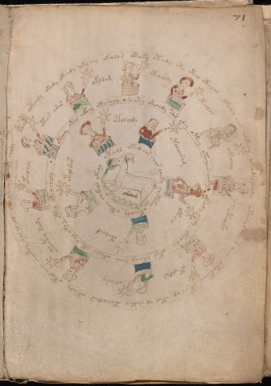

# Voynich Speculative Herbal Ferment Recipe — f71r

IMPORTANT: this is NOT a real or validated translation of the Voynich Manuscript. It is a speculative/procedural model that interprets EVA using a user-defined grammar to generate experimental recipes using safe, known edible substitutes.

This file is generated automatically from IVTFF/EVA transliteration plus a user-defined procedural grammar.



## Page / Folio
- folio: f71r
- page_number: 137

## EVA Text (Transliteration)
```text
olkeeody okody okeeedy oky chy okeodar okeoky oteody oto otol oteeyar yko oar aiin oekeeey okeo keo keody okeodar chy s aiin otokeoar or ar al otol al shckhy oteeeodar oteody otol aiin shoekey solalald cheeokeeo [ch:?]oe[k:t]y choly
oteos arar
okldam
oteoaldy
oteolar
okeoaly
otaleky
otalsar
cheary
oteotey rary
otalaly
oteody oteos ockhhy oteeschey lsheotey okalody shs shey oteey otechar chek[a:?]l okody eeedy oteodal eeokol lkchol daiin okeeees ykees al ok[ee:a]y otey oteo shaly o
otolchdy
otoloaram
oteeol
otolchd
otaldar
oteeol otal chs char cheky chotshy okeeody oteey chekea' okeol
```

## Recipes Index (This Page)
- [f71r.1,@Cc](#f71r-1-f71r-1-cc)
- [f71r.2,@Lz](#f71r-2-f71r-2-lz)
- [f71r.3,&Lz](#f71r-3-f71r-3-lz)
- [f71r.4,&Lz](#f71r-4-f71r-4-lz)
- [f71r.5,&Lz](#f71r-5-f71r-5-lz)
- [f71r.6,&Lz](#f71r-6-f71r-6-lz)
- [f71r.7,&Lz](#f71r-7-f71r-7-lz)
- [f71r.8,&Lz](#f71r-8-f71r-8-lz)
- [f71r.9,&Lz](#f71r-9-f71r-9-lz)
- [f71r.10,&Lz](#f71r-10-f71r-10-lz)
- [f71r.11,&Lz](#f71r-11-f71r-11-lz)
- [f71r.12,@Cc](#f71r-12-f71r-12-cc)
- [f71r.13,@Lz](#f71r-13-f71r-13-lz)
- [f71r.14,&Lz](#f71r-14-f71r-14-lz)
- [f71r.15,&Lz](#f71r-15-f71r-15-lz)
- [f71r.16,&Lz](#f71r-16-f71r-16-lz)
- [f71r.17,&Lz](#f71r-17-f71r-17-lz)
- [f71r.18,@Cc](#f71r-18-f71r-18-cc)

## Line Glosses (Procedural Gloss Only; Not a Translation)

<a id="f71r-1-f71r-1-cc"></a>

### f71r.1,@Cc

EVA: olkeeody okody okeeedy oky chy okeodar okeoky oteody oto otol oteeyar yko oar aiin oekeeey okeo keo keody okeodar chy s aiin otokeoar or ar al otol al shckhy oteeeodar oteody otol aiin shoekey solalald cheeokeeo [ch:?]oe[k:t]y choly

Direct Gloss (Procedural, Not a Real Translation):
- olkeeody: add fermentable sugars → mix / transfer → start fermentation (yeast) → duration level 2 → state: active extraction
- okody: add fermentable sugars → mix / transfer → start fermentation (yeast)
- okeeedy: add fermentable sugars → mix / transfer → start fermentation (yeast) → duration level 3 → state: active extraction
- oky: add fermentable sugars → mix / transfer
- chy: add main plant (safe substitute)
- okeodar: add fermentable sugars → mix / transfer → start fermentation (yeast) → duration level 1 → state: active extraction
- okeoky: add fermentable sugars → mix / transfer → duration level 1 → state: active extraction
- oteody: apply heat/cooking → mix / transfer → start fermentation (yeast) → duration level 1 → state: active extraction
- oto: apply heat/cooking → mix / transfer
- otol: apply heat/cooking → mix / transfer
- oteeyar: apply heat/cooking → mix / transfer → duration level 2 → state: active extraction
- yko: add fermentable sugars → mix / transfer
- oar: mix / transfer → duration level 1 → state: fermentation start
- aiin: duration level 1 → state: fermentation start → long fermentation / aging phase
- oekeeey: add fermentable sugars → mix / transfer → duration level 1 → state: active extraction
- okeo: add fermentable sugars → mix / transfer → duration level 1 → state: active extraction
- keo: add fermentable sugars → mix / transfer → duration level 1 → state: active extraction
- keody: add fermentable sugars → mix / transfer → start fermentation (yeast) → duration level 1 → state: active extraction
- okeodar: add fermentable sugars → mix / transfer → start fermentation (yeast) → duration level 1 → state: active extraction
- chy: add main plant (safe substitute)
- s: [unparsed]
- aiin: duration level 1 → state: fermentation start → long fermentation / aging phase
- otokeoar: add fermentable sugars → apply heat/cooking → mix / transfer → duration level 1 → state: active extraction
- or: mix / transfer
- ar: duration level 1 → state: fermentation start
- al: duration level 1 → state: fermentation start
- otol: apply heat/cooking → mix / transfer
- al: duration level 1 → state: fermentation start
- shckhy: add secondary herb (safe substitute) → add complex herbal compound (safe blend)
- oteeeodar: apply heat/cooking → mix / transfer → start fermentation (yeast) → duration level 3 → state: active extraction
- oteody: apply heat/cooking → mix / transfer → start fermentation (yeast) → duration level 1 → state: active extraction
- otol: apply heat/cooking → mix / transfer
- aiin: duration level 1 → state: fermentation start → long fermentation / aging phase
- shoekey: add fermentable sugars → add secondary herb (safe substitute) → mix / transfer → duration level 1 → state: active extraction
- solalald: mix / transfer → start fermentation (yeast) → duration level 1 → state: fermentation start
- cheeokeeo: add fermentable sugars → add main plant (safe substitute) → mix / transfer → duration level 2 → state: active extraction
- ch: add main plant (safe substitute)
- oe: mix / transfer → duration level 1 → state: active extraction
- k: add fermentable sugars
- t: apply heat/cooking
- y: [unparsed]
- choly: add main plant (safe substitute) → mix / transfer

<a id="f71r-2-f71r-2-lz"></a>

### f71r.2,@Lz

EVA: oteos arar

Direct Gloss (Procedural, Not a Real Translation):
- oteos: apply heat/cooking → mix / transfer → duration level 1 → state: active extraction
- arar: duration level 1 → state: fermentation start

<a id="f71r-3-f71r-3-lz"></a>

### f71r.3,&Lz

EVA: okldam

Direct Gloss (Procedural, Not a Real Translation):
- okldam: add fermentable sugars → mix / transfer → start fermentation (yeast) → duration level 1 → state: fermentation start

<a id="f71r-4-f71r-4-lz"></a>

### f71r.4,&Lz

EVA: oteoaldy

Direct Gloss (Procedural, Not a Real Translation):
- oteoaldy: apply heat/cooking → mix / transfer → start fermentation (yeast) → duration level 1 → state: active extraction

<a id="f71r-5-f71r-5-lz"></a>

### f71r.5,&Lz

EVA: oteolar

Direct Gloss (Procedural, Not a Real Translation):
- oteolar: apply heat/cooking → mix / transfer → duration level 1 → state: active extraction

<a id="f71r-6-f71r-6-lz"></a>

### f71r.6,&Lz

EVA: okeoaly

Direct Gloss (Procedural, Not a Real Translation):
- okeoaly: add fermentable sugars → mix / transfer → duration level 1 → state: active extraction

<a id="f71r-7-f71r-7-lz"></a>

### f71r.7,&Lz

EVA: otaleky

Direct Gloss (Procedural, Not a Real Translation):
- otaleky: add fermentable sugars → apply heat/cooking → mix / transfer → duration level 1 → state: fermentation start

<a id="f71r-8-f71r-8-lz"></a>

### f71r.8,&Lz

EVA: otalsar

Direct Gloss (Procedural, Not a Real Translation):
- otalsar: apply heat/cooking → mix / transfer → duration level 1 → state: fermentation start

<a id="f71r-9-f71r-9-lz"></a>

### f71r.9,&Lz

EVA: cheary

Direct Gloss (Procedural, Not a Real Translation):
- cheary: add main plant (safe substitute) → duration level 1 → state: active extraction

<a id="f71r-10-f71r-10-lz"></a>

### f71r.10,&Lz

EVA: oteotey rary

Direct Gloss (Procedural, Not a Real Translation):
- oteotey: apply heat/cooking → mix / transfer → duration level 1 → state: active extraction
- rary: duration level 1 → state: fermentation start

<a id="f71r-11-f71r-11-lz"></a>

### f71r.11,&Lz

EVA: otalaly

Direct Gloss (Procedural, Not a Real Translation):
- otalaly: apply heat/cooking → mix / transfer → duration level 1 → state: fermentation start

<a id="f71r-12-f71r-12-cc"></a>

### f71r.12,@Cc

EVA: oteody oteos ockhhy oteeschey lsheotey okalody shs shey oteey otechar chek[a:?]l okody eeedy oteodal eeokol lkchol daiin okeeees ykees al ok[ee:a]y otey oteo shaly o

Direct Gloss (Procedural, Not a Real Translation):
- oteody: apply heat/cooking → mix / transfer → start fermentation (yeast) → duration level 1 → state: active extraction
- oteos: apply heat/cooking → mix / transfer → duration level 1 → state: active extraction
- ockhhy: mix / transfer → add complex herbal compound (safe blend)
- oteeschey: apply heat/cooking → add main plant (safe substitute) → mix / transfer → duration level 2 → state: active extraction
- lsheotey: apply heat/cooking → add secondary herb (safe substitute) → mix / transfer → duration level 1 → state: active extraction
- okalody: add fermentable sugars → mix / transfer → start fermentation (yeast) → duration level 1 → state: fermentation start
- shs: add secondary herb (safe substitute)
- shey: add secondary herb (safe substitute) → duration level 1 → state: active extraction
- oteey: apply heat/cooking → mix / transfer → duration level 2 → state: active extraction
- otechar: apply heat/cooking → add main plant (safe substitute) → mix / transfer → duration level 1 → state: active extraction
- chek: add fermentable sugars → add main plant (safe substitute) → duration level 1 → state: active extraction
- a: duration level 1 → state: fermentation start
- l: [unparsed]
- okody: add fermentable sugars → mix / transfer → start fermentation (yeast)
- eeedy: start fermentation (yeast) → duration level 3 → state: active extraction
- oteodal: apply heat/cooking → mix / transfer → start fermentation (yeast) → duration level 1 → state: active extraction
- eeokol: add fermentable sugars → mix / transfer → duration level 2 → state: active extraction
- lkchol: add fermentable sugars → add main plant (safe substitute) → mix / transfer
- daiin: start fermentation (yeast) → duration level 1 → state: fermentation start → long fermentation / aging phase
- okeeees: add fermentable sugars → mix / transfer → duration level 4 → state: active extraction
- ykees: add fermentable sugars → duration level 2 → state: active extraction
- al: duration level 1 → state: fermentation start
- ok: add fermentable sugars → mix / transfer
- ee: duration level 2 → state: active extraction
- a: duration level 1 → state: fermentation start
- y: [unparsed]
- otey: apply heat/cooking → mix / transfer → duration level 1 → state: active extraction
- oteo: apply heat/cooking → mix / transfer → duration level 1 → state: active extraction
- shaly: add secondary herb (safe substitute) → duration level 1 → state: fermentation start
- o: mix / transfer

<a id="f71r-13-f71r-13-lz"></a>

### f71r.13,@Lz

EVA: otolchdy

Direct Gloss (Procedural, Not a Real Translation):
- otolchdy: apply heat/cooking → add main plant (safe substitute) → mix / transfer → start fermentation (yeast)

<a id="f71r-14-f71r-14-lz"></a>

### f71r.14,&Lz

EVA: otoloaram

Direct Gloss (Procedural, Not a Real Translation):
- otoloaram: apply heat/cooking → mix / transfer → duration level 1 → state: fermentation start

<a id="f71r-15-f71r-15-lz"></a>

### f71r.15,&Lz

EVA: oteeol

Direct Gloss (Procedural, Not a Real Translation):
- oteeol: apply heat/cooking → mix / transfer → duration level 2 → state: active extraction

<a id="f71r-16-f71r-16-lz"></a>

### f71r.16,&Lz

EVA: otolchd

Direct Gloss (Procedural, Not a Real Translation):
- otolchd: apply heat/cooking → add main plant (safe substitute) → mix / transfer → start fermentation (yeast)

<a id="f71r-17-f71r-17-lz"></a>

### f71r.17,&Lz

EVA: otaldar

Direct Gloss (Procedural, Not a Real Translation):
- otaldar: apply heat/cooking → mix / transfer → start fermentation (yeast) → duration level 1 → state: fermentation start

<a id="f71r-18-f71r-18-cc"></a>

### f71r.18,@Cc

EVA: oteeol otal chs char cheky chotshy okeeody oteey chekea' okeol

Direct Gloss (Procedural, Not a Real Translation):
- oteeol: apply heat/cooking → mix / transfer → duration level 2 → state: active extraction
- otal: apply heat/cooking → mix / transfer → duration level 1 → state: fermentation start
- chs: add main plant (safe substitute)
- char: add main plant (safe substitute) → duration level 1 → state: fermentation start
- cheky: add fermentable sugars → add main plant (safe substitute) → duration level 1 → state: active extraction
- chotshy: apply heat/cooking → add main plant (safe substitute) → add secondary herb (safe substitute) → mix / transfer
- okeeody: add fermentable sugars → mix / transfer → start fermentation (yeast) → duration level 2 → state: active extraction
- oteey: apply heat/cooking → mix / transfer → duration level 2 → state: active extraction
- chekea: add fermentable sugars → add main plant (safe substitute) → duration level 1 → state: active extraction
- okeol: add fermentable sugars → mix / transfer → duration level 1 → state: active extraction
