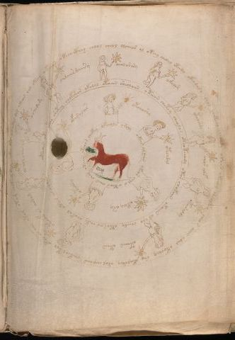

# Voynich Speculative Herbal Ferment Recipe — f72r1

IMPORTANT: this is NOT a real or validated translation of the Voynich Manuscript. It is a speculative/procedural model that interprets EVA using a user-defined grammar to generate experimental recipes using safe, known edible substitutes.

This file is generated automatically from IVTFF/EVA transliteration plus a user-defined procedural grammar.



## Page / Folio
- folio: f72r1
- page_number: 139

## EVA Text (Transliteration)
```text
oteeo cthey chlol cheol olcheor al oteey chedal oteedy okeodaly chol chokeol cheo?ky okaiir okeedy sheoltey cheor aiin ydal okochey sho okalshey shol chalaiin chekeol kol otos ar aiin otam otam chotam sal okeo dar ar a[d:j]al dar okeeas aiin oteey okaiin
oshod[a:o]dy
chdaiirdainy
oaiin ar ary
okalam
ytalshdy
char alif
otaraldy
otaiin otain
otalef ys ainam
ochol sharam
oteodar ytey otey shetey chokshor okalal otaiin sheolaiin otaiin chetey cheolor oteo teeody otar chokaiin okaiin al alo cheedy otear ar cheky chokal otar al o qokar
ofaralar
otchoshy
otchdal
okeey ary
otainy
okeeols aroly okees alaiin okeor chol o oteos aiin chal otaiin [a:o]tchor chckhy
```

## Recipes Index (This Page)
- [f72r1.1,@Cc](#f72r1-1-f72r1-1-cc)
- [f72r1.2,@Lz](#f72r1-2-f72r1-2-lz)
- [f72r1.3,&Lz](#f72r1-3-f72r1-3-lz)
- [f72r1.4,&Lz](#f72r1-4-f72r1-4-lz)
- [f72r1.5,&Lz](#f72r1-5-f72r1-5-lz)
- [f72r1.6,&Lz](#f72r1-6-f72r1-6-lz)
- [f72r1.7,&Lz](#f72r1-7-f72r1-7-lz)
- [f72r1.8,&Lz](#f72r1-8-f72r1-8-lz)
- [f72r1.9,&Lz](#f72r1-9-f72r1-9-lz)
- [f72r1.10,&Lz](#f72r1-10-f72r1-10-lz)
- [f72r1.11,&Lz](#f72r1-11-f72r1-11-lz)
- [f72r1.12,@Cc](#f72r1-12-f72r1-12-cc)
- [f72r1.13,@Lz](#f72r1-13-f72r1-13-lz)
- [f72r1.14,&Lz](#f72r1-14-f72r1-14-lz)
- [f72r1.15,&Lz](#f72r1-15-f72r1-15-lz)
- [f72r1.16,&Lz](#f72r1-16-f72r1-16-lz)
- [f72r1.17,&Lz](#f72r1-17-f72r1-17-lz)
- [f72r1.18,@Cc](#f72r1-18-f72r1-18-cc)

## Line Glosses (Procedural Gloss Only; Not a Translation)

<a id="f72r1-1-f72r1-1-cc"></a>

### f72r1.1,@Cc

EVA: oteeo cthey chlol cheol olcheor al oteey chedal oteedy okeodaly chol chokeol cheo?ky okaiir okeedy sheoltey cheor aiin ydal okochey sho okalshey shol chalaiin chekeol kol otos ar aiin otam otam chotam sal okeo dar ar a[d:j]al dar okeeas aiin oteey okaiin

Direct Gloss (Procedural, Not a Real Translation):
- oteeo: apply heat/cooking → mix / transfer → duration level 2 → state: active extraction
- cthey: add complex herbal compound (safe blend) → duration level 1 → state: active extraction
- chlol: add main plant (safe substitute) → mix / transfer
- cheol: add main plant (safe substitute) → mix / transfer → duration level 1 → state: active extraction
- olcheor: add main plant (safe substitute) → mix / transfer → duration level 1 → state: active extraction
- al: duration level 1 → state: fermentation start
- oteey: apply heat/cooking → mix / transfer → duration level 2 → state: active extraction
- chedal: add main plant (safe substitute) → start fermentation (yeast) → duration level 1 → state: active extraction
- oteedy: apply heat/cooking → mix / transfer → start fermentation (yeast) → duration level 2 → state: active extraction
- okeodaly: add fermentable sugars → mix / transfer → start fermentation (yeast) → duration level 1 → state: active extraction
- chol: add main plant (safe substitute) → mix / transfer
- chokeol: add fermentable sugars → add main plant (safe substitute) → mix / transfer → duration level 1 → state: active extraction
- cheo: add main plant (safe substitute) → mix / transfer → duration level 1 → state: active extraction
- ky: add fermentable sugars
- okaiir: add fermentable sugars → mix / transfer → duration level 1 → state: fermentation start
- okeedy: add fermentable sugars → mix / transfer → start fermentation (yeast) → duration level 2 → state: active extraction
- sheoltey: apply heat/cooking → add secondary herb (safe substitute) → mix / transfer → duration level 1 → state: active extraction
- cheor: add main plant (safe substitute) → mix / transfer → duration level 1 → state: active extraction
- aiin: duration level 1 → state: fermentation start → long fermentation / aging phase
- ydal: start fermentation (yeast) → duration level 1 → state: fermentation start
- okochey: add fermentable sugars → add main plant (safe substitute) → mix / transfer → duration level 1 → state: active extraction
- sho: add secondary herb (safe substitute) → mix / transfer
- okalshey: add fermentable sugars → add secondary herb (safe substitute) → mix / transfer → duration level 1 → state: fermentation start
- shol: add secondary herb (safe substitute) → mix / transfer
- chalaiin: add main plant (safe substitute) → duration level 1 → state: fermentation start → long fermentation / aging phase
- chekeol: add fermentable sugars → add main plant (safe substitute) → mix / transfer → duration level 1 → state: active extraction
- kol: add fermentable sugars → mix / transfer
- otos: apply heat/cooking → mix / transfer
- ar: duration level 1 → state: fermentation start
- aiin: duration level 1 → state: fermentation start → long fermentation / aging phase
- otam: apply heat/cooking → mix / transfer → duration level 1 → state: fermentation start
- otam: apply heat/cooking → mix / transfer → duration level 1 → state: fermentation start
- chotam: apply heat/cooking → add main plant (safe substitute) → mix / transfer → duration level 1 → state: fermentation start
- sal: duration level 1 → state: fermentation start
- okeo: add fermentable sugars → mix / transfer → duration level 1 → state: active extraction
- dar: start fermentation (yeast) → duration level 1 → state: fermentation start
- ar: duration level 1 → state: fermentation start
- a: duration level 1 → state: fermentation start
- d: start fermentation (yeast)
- j: [unparsed]
- al: duration level 1 → state: fermentation start
- dar: start fermentation (yeast) → duration level 1 → state: fermentation start
- okeeas: add fermentable sugars → mix / transfer → duration level 2 → state: active extraction
- aiin: duration level 1 → state: fermentation start → long fermentation / aging phase
- oteey: apply heat/cooking → mix / transfer → duration level 2 → state: active extraction
- okaiin: add fermentable sugars → mix / transfer → duration level 1 → state: fermentation start → long fermentation / aging phase

<a id="f72r1-2-f72r1-2-lz"></a>

### f72r1.2,@Lz

EVA: oshod[a:o]dy

Direct Gloss (Procedural, Not a Real Translation):
- oshod: add secondary herb (safe substitute) → mix / transfer → start fermentation (yeast)
- a: duration level 1 → state: fermentation start
- o: mix / transfer
- dy: start fermentation (yeast)

<a id="f72r1-3-f72r1-3-lz"></a>

### f72r1.3,&Lz

EVA: chdaiirdainy

Direct Gloss (Procedural, Not a Real Translation):
- chdaiirdainy: add main plant (safe substitute) → start fermentation (yeast) → duration level 1 → state: fermentation start

<a id="f72r1-4-f72r1-4-lz"></a>

### f72r1.4,&Lz

EVA: oaiin ar ary

Direct Gloss (Procedural, Not a Real Translation):
- oaiin: mix / transfer → duration level 1 → state: fermentation start → long fermentation / aging phase
- ar: duration level 1 → state: fermentation start
- ary: duration level 1 → state: fermentation start

<a id="f72r1-5-f72r1-5-lz"></a>

### f72r1.5,&Lz

EVA: okalam

Direct Gloss (Procedural, Not a Real Translation):
- okalam: add fermentable sugars → mix / transfer → duration level 1 → state: fermentation start

<a id="f72r1-6-f72r1-6-lz"></a>

### f72r1.6,&Lz

EVA: ytalshdy

Direct Gloss (Procedural, Not a Real Translation):
- ytalshdy: apply heat/cooking → add secondary herb (safe substitute) → start fermentation (yeast) → duration level 1 → state: fermentation start

<a id="f72r1-7-f72r1-7-lz"></a>

### f72r1.7,&Lz

EVA: char alif

Direct Gloss (Procedural, Not a Real Translation):
- char: add main plant (safe substitute) → duration level 1 → state: fermentation start
- alif: add aroma modifier → duration level 1 → state: fermentation start

<a id="f72r1-8-f72r1-8-lz"></a>

### f72r1.8,&Lz

EVA: otaraldy

Direct Gloss (Procedural, Not a Real Translation):
- otaraldy: apply heat/cooking → mix / transfer → start fermentation (yeast) → duration level 1 → state: fermentation start

<a id="f72r1-9-f72r1-9-lz"></a>

### f72r1.9,&Lz

EVA: otaiin otain

Direct Gloss (Procedural, Not a Real Translation):
- otaiin: apply heat/cooking → mix / transfer → duration level 1 → state: fermentation start → long fermentation / aging phase
- otain: apply heat/cooking → mix / transfer → duration level 1 → state: fermentation start

<a id="f72r1-10-f72r1-10-lz"></a>

### f72r1.10,&Lz

EVA: otalef ys ainam

Direct Gloss (Procedural, Not a Real Translation):
- otalef: apply heat/cooking → add aroma modifier → mix / transfer → duration level 1 → state: fermentation start
- ys: [unparsed]
- ainam: duration level 1 → state: fermentation start

<a id="f72r1-11-f72r1-11-lz"></a>

### f72r1.11,&Lz

EVA: ochol sharam

Direct Gloss (Procedural, Not a Real Translation):
- ochol: add main plant (safe substitute) → mix / transfer
- sharam: add secondary herb (safe substitute) → duration level 1 → state: fermentation start

<a id="f72r1-12-f72r1-12-cc"></a>

### f72r1.12,@Cc

EVA: oteodar ytey otey shetey chokshor okalal otaiin sheolaiin otaiin chetey cheolor oteo teeody otar chokaiin okaiin al alo cheedy otear ar cheky chokal otar al o qokar

Direct Gloss (Procedural, Not a Real Translation):
- oteodar: apply heat/cooking → mix / transfer → start fermentation (yeast) → duration level 1 → state: active extraction
- ytey: apply heat/cooking → duration level 1 → state: active extraction
- otey: apply heat/cooking → mix / transfer → duration level 1 → state: active extraction
- shetey: apply heat/cooking → add secondary herb (safe substitute) → duration level 1 → state: active extraction
- chokshor: add fermentable sugars → add main plant (safe substitute) → add secondary herb (safe substitute) → mix / transfer
- okalal: add fermentable sugars → mix / transfer → duration level 1 → state: fermentation start
- otaiin: apply heat/cooking → mix / transfer → duration level 1 → state: fermentation start → long fermentation / aging phase
- sheolaiin: add secondary herb (safe substitute) → mix / transfer → duration level 1 → state: active extraction → long fermentation / aging phase
- otaiin: apply heat/cooking → mix / transfer → duration level 1 → state: fermentation start → long fermentation / aging phase
- chetey: apply heat/cooking → add main plant (safe substitute) → duration level 1 → state: active extraction
- cheolor: add main plant (safe substitute) → mix / transfer → duration level 1 → state: active extraction
- oteo: apply heat/cooking → mix / transfer → duration level 1 → state: active extraction
- teeody: apply heat/cooking → mix / transfer → start fermentation (yeast) → duration level 2 → state: active extraction
- otar: apply heat/cooking → mix / transfer → duration level 1 → state: fermentation start
- chokaiin: add fermentable sugars → add main plant (safe substitute) → mix / transfer → duration level 1 → state: fermentation start → long fermentation / aging phase
- okaiin: add fermentable sugars → mix / transfer → duration level 1 → state: fermentation start → long fermentation / aging phase
- al: duration level 1 → state: fermentation start
- alo: mix / transfer → duration level 1 → state: fermentation start
- cheedy: add main plant (safe substitute) → start fermentation (yeast) → duration level 2 → state: active extraction
- otear: apply heat/cooking → mix / transfer → duration level 1 → state: active extraction
- ar: duration level 1 → state: fermentation start
- cheky: add fermentable sugars → add main plant (safe substitute) → duration level 1 → state: active extraction
- chokal: add fermentable sugars → add main plant (safe substitute) → mix / transfer → duration level 1 → state: fermentation start
- otar: apply heat/cooking → mix / transfer → duration level 1 → state: fermentation start
- al: duration level 1 → state: fermentation start
- o: mix / transfer
- qokar: prepare liquid base → add fermentable sugars → duration level 1 → state: fermentation start

<a id="f72r1-13-f72r1-13-lz"></a>

### f72r1.13,@Lz

EVA: ofaralar

Direct Gloss (Procedural, Not a Real Translation):
- ofaralar: add aroma modifier → mix / transfer → duration level 1 → state: fermentation start

<a id="f72r1-14-f72r1-14-lz"></a>

### f72r1.14,&Lz

EVA: otchoshy

Direct Gloss (Procedural, Not a Real Translation):
- otchoshy: apply heat/cooking → add main plant (safe substitute) → add secondary herb (safe substitute) → mix / transfer

<a id="f72r1-15-f72r1-15-lz"></a>

### f72r1.15,&Lz

EVA: otchdal

Direct Gloss (Procedural, Not a Real Translation):
- otchdal: apply heat/cooking → add main plant (safe substitute) → mix / transfer → start fermentation (yeast) → duration level 1 → state: fermentation start

<a id="f72r1-16-f72r1-16-lz"></a>

### f72r1.16,&Lz

EVA: okeey ary

Direct Gloss (Procedural, Not a Real Translation):
- okeey: add fermentable sugars → mix / transfer → duration level 2 → state: active extraction
- ary: duration level 1 → state: fermentation start

<a id="f72r1-17-f72r1-17-lz"></a>

### f72r1.17,&Lz

EVA: otainy

Direct Gloss (Procedural, Not a Real Translation):
- otainy: apply heat/cooking → mix / transfer → duration level 1 → state: fermentation start

<a id="f72r1-18-f72r1-18-cc"></a>

### f72r1.18,@Cc

EVA: okeeols aroly okees alaiin okeor chol o oteos aiin chal otaiin [a:o]tchor chckhy

Direct Gloss (Procedural, Not a Real Translation):
- okeeols: add fermentable sugars → mix / transfer → duration level 2 → state: active extraction
- aroly: mix / transfer → duration level 1 → state: fermentation start
- okees: add fermentable sugars → mix / transfer → duration level 2 → state: active extraction
- alaiin: duration level 1 → state: fermentation start → long fermentation / aging phase
- okeor: add fermentable sugars → mix / transfer → duration level 1 → state: active extraction
- chol: add main plant (safe substitute) → mix / transfer
- o: mix / transfer
- oteos: apply heat/cooking → mix / transfer → duration level 1 → state: active extraction
- aiin: duration level 1 → state: fermentation start → long fermentation / aging phase
- chal: add main plant (safe substitute) → duration level 1 → state: fermentation start
- otaiin: apply heat/cooking → mix / transfer → duration level 1 → state: fermentation start → long fermentation / aging phase
- a: duration level 1 → state: fermentation start
- o: mix / transfer
- tchor: apply heat/cooking → add main plant (safe substitute) → mix / transfer
- chckhy: add main plant (safe substitute) → add complex herbal compound (safe blend)
