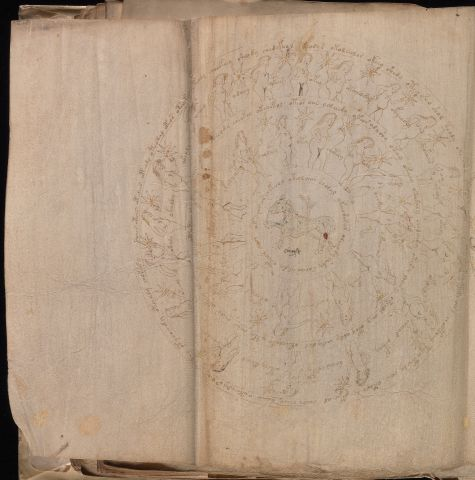

# Voynich Speculative Herbal Ferment Recipe — f72v3

IMPORTANT: this is NOT a real or validated translation of the Voynich Manuscript. It is a speculative/procedural model that interprets EVA using a user-defined grammar to generate experimental recipes using safe, known edible substitutes.

This file is generated automatically from IVTFF/EVA transliteration plus a user-defined procedural grammar.



## Page / Folio
- folio: f72v3
- page_number: 142

## EVA Text (Transliteration)
```text
soees otchs otedar oteody oteodal oteos oteokchd? oteody sheokeey sheody shedykeal ckhodys okoleeolar okeey shedy otey sho shol teody okolshey ykeed?y y okechdy olaiin shokeedy chol choepchey teey teody ches okechedy otechol cheor cheey daiin oyteeedar ??? shecthy otycheedy oteeoly chokary
ocham
orchey
okam
okey
otcheody
okyeeshy
[c'y:??]ofaiin
okaly
ot[o:a]ly
ofalals
sheeos ocfhhy
daiin chepy
oteey deeal
chealpy
okeeol
okaly
okaldy
okeolyd
ototeey r chlyiintee or oteey oteeody cheokey okeoekol oteor aiin yoleeedy okeos alyshy okeey okeeey okeedaly cholainy okedy chees y okeeol chey otey oldy chdy del okeeoloky oty aiin chas oteey okea???
choleey
oky
chcthhy
laly
oeedy
odairan
okary
oeesaiin
oteesed
opal
otaly
otaly yty
okesee[s:r] ar chkeeol okeolaiin chalal ykeeodarar oleeody shedy solar aldy oteor cheor
```

## Recipes Index (This Page)
- [f72v3.1,@Cc](#f72v3-1-f72v3-1-cc)
- [f72v3.2,@Lz](#f72v3-2-f72v3-2-lz)
- [f72v3.3,&Lz](#f72v3-3-f72v3-3-lz)
- [f72v3.4,&Lz](#f72v3-4-f72v3-4-lz)
- [f72v3.5,&Lz](#f72v3-5-f72v3-5-lz)
- [f72v3.6,&Lz](#f72v3-6-f72v3-6-lz)
- [f72v3.7,&Lz](#f72v3-7-f72v3-7-lz)
- [f72v3.8,&Lz](#f72v3-8-f72v3-8-lz)
- [f72v3.9,&Lz](#f72v3-9-f72v3-9-lz)
- [f72v3.10,&Lz](#f72v3-10-f72v3-10-lz)
- [f72v3.11,&Lz](#f72v3-11-f72v3-11-lz)
- [f72v3.12,&Lz](#f72v3-12-f72v3-12-lz)
- [f72v3.13,&Lz](#f72v3-13-f72v3-13-lz)
- [f72v3.14,&Lz](#f72v3-14-f72v3-14-lz)
- [f72v3.15,&Lz](#f72v3-15-f72v3-15-lz)
- [f72v3.16,&Lz](#f72v3-16-f72v3-16-lz)
- [f72v3.17,&Lz](#f72v3-17-f72v3-17-lz)
- [f72v3.18,&Lz](#f72v3-18-f72v3-18-lz)
- [f72v3.19,&Lz](#f72v3-19-f72v3-19-lz)
- [f72v3.20,@Cc](#f72v3-20-f72v3-20-cc)
- [f72v3.21,@Lz](#f72v3-21-f72v3-21-lz)
- [f72v3.22,&Lz](#f72v3-22-f72v3-22-lz)
- [f72v3.23,&Lz](#f72v3-23-f72v3-23-lz)
- [f72v3.24,&Lz](#f72v3-24-f72v3-24-lz)
- [f72v3.25,&Lz](#f72v3-25-f72v3-25-lz)
- [f72v3.26,&Lz](#f72v3-26-f72v3-26-lz)
- [f72v3.27,&Lz](#f72v3-27-f72v3-27-lz)
- [f72v3.28,&Lz](#f72v3-28-f72v3-28-lz)
- [f72v3.29,&Lz](#f72v3-29-f72v3-29-lz)
- [f72v3.30,&Lz](#f72v3-30-f72v3-30-lz)
- [f72v3.31,&Lz](#f72v3-31-f72v3-31-lz)
- [f72v3.32,&Lz](#f72v3-32-f72v3-32-lz)
- [f72v3.33,@Cc](#f72v3-33-f72v3-33-cc)

## Line Glosses (Procedural Gloss Only; Not a Translation)

<a id="f72v3-1-f72v3-1-cc"></a>

### f72v3.1,@Cc

EVA: soees otchs otedar oteody oteodal oteos oteokchd? oteody sheokeey sheody shedykeal ckhodys okoleeolar okeey shedy otey sho shol teody okolshey ykeed?y y okechdy olaiin shokeedy chol choepchey teey teody ches okechedy otechol cheor cheey daiin oyteeedar ??? shecthy otycheedy oteeoly chokary

Direct Gloss (Procedural, Not a Real Translation):
- soees: mix / transfer → duration level 2 → state: active extraction
- otchs: apply heat/cooking → add main plant (safe substitute) → mix / transfer
- otedar: apply heat/cooking → mix / transfer → start fermentation (yeast) → duration level 1 → state: active extraction
- oteody: apply heat/cooking → mix / transfer → start fermentation (yeast) → duration level 1 → state: active extraction
- oteodal: apply heat/cooking → mix / transfer → start fermentation (yeast) → duration level 1 → state: active extraction
- oteos: apply heat/cooking → mix / transfer → duration level 1 → state: active extraction
- oteokchd: add fermentable sugars → apply heat/cooking → add main plant (safe substitute) → mix / transfer → start fermentation (yeast) → duration level 1 → state: active extraction
- oteody: apply heat/cooking → mix / transfer → start fermentation (yeast) → duration level 1 → state: active extraction
- sheokeey: add fermentable sugars → add secondary herb (safe substitute) → mix / transfer → duration level 1 → state: active extraction
- sheody: add secondary herb (safe substitute) → mix / transfer → start fermentation (yeast) → duration level 1 → state: active extraction
- shedykeal: add fermentable sugars → add secondary herb (safe substitute) → start fermentation (yeast) → duration level 1 → state: active extraction
- ckhodys: mix / transfer → start fermentation (yeast) → add complex herbal compound (safe blend)
- okoleeolar: add fermentable sugars → mix / transfer → duration level 2 → state: active extraction
- okeey: add fermentable sugars → mix / transfer → duration level 2 → state: active extraction
- shedy: add secondary herb (safe substitute) → start fermentation (yeast) → duration level 1 → state: active extraction
- otey: apply heat/cooking → mix / transfer → duration level 1 → state: active extraction
- sho: add secondary herb (safe substitute) → mix / transfer
- shol: add secondary herb (safe substitute) → mix / transfer
- teody: apply heat/cooking → mix / transfer → start fermentation (yeast) → duration level 1 → state: active extraction
- okolshey: add fermentable sugars → add secondary herb (safe substitute) → mix / transfer → duration level 1 → state: active extraction
- ykeed: add fermentable sugars → start fermentation (yeast) → duration level 2 → state: active extraction
- y: [unparsed]
- y: [unparsed]
- okechdy: add fermentable sugars → add main plant (safe substitute) → mix / transfer → start fermentation (yeast) → duration level 1 → state: active extraction
- olaiin: mix / transfer → duration level 1 → state: fermentation start → long fermentation / aging phase
- shokeedy: add fermentable sugars → add secondary herb (safe substitute) → mix / transfer → start fermentation (yeast) → duration level 2 → state: active extraction
- chol: add main plant (safe substitute) → mix / transfer
- choepchey: add main plant (safe substitute) → mix / transfer → start fermentation (yeast) → duration level 1 → state: active extraction
- teey: apply heat/cooking → duration level 2 → state: active extraction
- teody: apply heat/cooking → mix / transfer → start fermentation (yeast) → duration level 1 → state: active extraction
- ches: add main plant (safe substitute) → duration level 1 → state: active extraction
- okechedy: add fermentable sugars → add main plant (safe substitute) → mix / transfer → start fermentation (yeast) → duration level 1 → state: active extraction
- otechol: apply heat/cooking → add main plant (safe substitute) → mix / transfer → duration level 1 → state: active extraction
- cheor: add main plant (safe substitute) → mix / transfer → duration level 1 → state: active extraction
- cheey: add main plant (safe substitute) → duration level 2 → state: active extraction
- daiin: start fermentation (yeast) → duration level 1 → state: fermentation start → long fermentation / aging phase
- oyteeedar: apply heat/cooking → mix / transfer → start fermentation (yeast) → duration level 3 → state: active extraction
- shecthy: add secondary herb (safe substitute) → add complex herbal compound (safe blend) → duration level 1 → state: active extraction
- otycheedy: apply heat/cooking → add main plant (safe substitute) → mix / transfer → start fermentation (yeast) → duration level 2 → state: active extraction
- oteeoly: apply heat/cooking → mix / transfer → duration level 2 → state: active extraction
- chokary: add fermentable sugars → add main plant (safe substitute) → mix / transfer → duration level 1 → state: fermentation start

<a id="f72v3-2-f72v3-2-lz"></a>

### f72v3.2,@Lz

EVA: ocham

Direct Gloss (Procedural, Not a Real Translation):
- ocham: add main plant (safe substitute) → mix / transfer → duration level 1 → state: fermentation start

<a id="f72v3-3-f72v3-3-lz"></a>

### f72v3.3,&Lz

EVA: orchey

Direct Gloss (Procedural, Not a Real Translation):
- orchey: add main plant (safe substitute) → mix / transfer → duration level 1 → state: active extraction

<a id="f72v3-4-f72v3-4-lz"></a>

### f72v3.4,&Lz

EVA: okam

Direct Gloss (Procedural, Not a Real Translation):
- okam: add fermentable sugars → mix / transfer → duration level 1 → state: fermentation start

<a id="f72v3-5-f72v3-5-lz"></a>

### f72v3.5,&Lz

EVA: okey

Direct Gloss (Procedural, Not a Real Translation):
- okey: add fermentable sugars → mix / transfer → duration level 1 → state: active extraction

<a id="f72v3-6-f72v3-6-lz"></a>

### f72v3.6,&Lz

EVA: otcheody

Direct Gloss (Procedural, Not a Real Translation):
- otcheody: apply heat/cooking → add main plant (safe substitute) → mix / transfer → start fermentation (yeast) → duration level 1 → state: active extraction

<a id="f72v3-7-f72v3-7-lz"></a>

### f72v3.7,&Lz

EVA: okyeeshy

Direct Gloss (Procedural, Not a Real Translation):
- okyeeshy: add fermentable sugars → add secondary herb (safe substitute) → mix / transfer → duration level 2 → state: active extraction

<a id="f72v3-8-f72v3-8-lz"></a>

### f72v3.8,&Lz

EVA: [c'y:??]ofaiin

Direct Gloss (Procedural, Not a Real Translation):
- c: [unparsed]
- y: [unparsed]
- ofaiin: add aroma modifier → mix / transfer → duration level 1 → state: fermentation start → long fermentation / aging phase

<a id="f72v3-9-f72v3-9-lz"></a>

### f72v3.9,&Lz

EVA: okaly

Direct Gloss (Procedural, Not a Real Translation):
- okaly: add fermentable sugars → mix / transfer → duration level 1 → state: fermentation start

<a id="f72v3-10-f72v3-10-lz"></a>

### f72v3.10,&Lz

EVA: ot[o:a]ly

Direct Gloss (Procedural, Not a Real Translation):
- ot: apply heat/cooking → mix / transfer
- o: mix / transfer
- a: duration level 1 → state: fermentation start
- ly: [unparsed]

<a id="f72v3-11-f72v3-11-lz"></a>

### f72v3.11,&Lz

EVA: ofalals

Direct Gloss (Procedural, Not a Real Translation):
- ofalals: add aroma modifier → mix / transfer → duration level 1 → state: fermentation start

<a id="f72v3-12-f72v3-12-lz"></a>

### f72v3.12,&Lz

EVA: sheeos ocfhhy

Direct Gloss (Procedural, Not a Real Translation):
- sheeos: add secondary herb (safe substitute) → mix / transfer → duration level 2 → state: active extraction
- ocfhhy: mix / transfer → add complex herbal compound (safe blend)

<a id="f72v3-13-f72v3-13-lz"></a>

### f72v3.13,&Lz

EVA: daiin chepy

Direct Gloss (Procedural, Not a Real Translation):
- daiin: start fermentation (yeast) → duration level 1 → state: fermentation start → long fermentation / aging phase
- chepy: add main plant (safe substitute) → start fermentation (yeast) → duration level 1 → state: active extraction

<a id="f72v3-14-f72v3-14-lz"></a>

### f72v3.14,&Lz

EVA: oteey deeal

Direct Gloss (Procedural, Not a Real Translation):
- oteey: apply heat/cooking → mix / transfer → duration level 2 → state: active extraction
- deeal: start fermentation (yeast) → duration level 2 → state: active extraction

<a id="f72v3-15-f72v3-15-lz"></a>

### f72v3.15,&Lz

EVA: chealpy

Direct Gloss (Procedural, Not a Real Translation):
- chealpy: add main plant (safe substitute) → start fermentation (yeast) → duration level 1 → state: active extraction

<a id="f72v3-16-f72v3-16-lz"></a>

### f72v3.16,&Lz

EVA: okeeol

Direct Gloss (Procedural, Not a Real Translation):
- okeeol: add fermentable sugars → mix / transfer → duration level 2 → state: active extraction

<a id="f72v3-17-f72v3-17-lz"></a>

### f72v3.17,&Lz

EVA: okaly

Direct Gloss (Procedural, Not a Real Translation):
- okaly: add fermentable sugars → mix / transfer → duration level 1 → state: fermentation start

<a id="f72v3-18-f72v3-18-lz"></a>

### f72v3.18,&Lz

EVA: okaldy

Direct Gloss (Procedural, Not a Real Translation):
- okaldy: add fermentable sugars → mix / transfer → start fermentation (yeast) → duration level 1 → state: fermentation start

<a id="f72v3-19-f72v3-19-lz"></a>

### f72v3.19,&Lz

EVA: okeolyd

Direct Gloss (Procedural, Not a Real Translation):
- okeolyd: add fermentable sugars → mix / transfer → start fermentation (yeast) → duration level 1 → state: active extraction

<a id="f72v3-20-f72v3-20-cc"></a>

### f72v3.20,@Cc

EVA: ototeey r chlyiintee or oteey oteeody cheokey okeoekol oteor aiin yoleeedy okeos alyshy okeey okeeey okeedaly cholainy okedy chees y okeeol chey otey oldy chdy del okeeoloky oty aiin chas oteey okea???

Direct Gloss (Procedural, Not a Real Translation):
- ototeey: apply heat/cooking → mix / transfer → duration level 2 → state: active extraction
- r: [unparsed]
- chlyiintee: apply heat/cooking → add main plant (safe substitute) → duration level 2 → state: cooling/rest → medium fermentation phase
- or: mix / transfer
- oteey: apply heat/cooking → mix / transfer → duration level 2 → state: active extraction
- oteeody: apply heat/cooking → mix / transfer → start fermentation (yeast) → duration level 2 → state: active extraction
- cheokey: add fermentable sugars → add main plant (safe substitute) → mix / transfer → duration level 1 → state: active extraction
- okeoekol: add fermentable sugars → mix / transfer → duration level 1 → state: active extraction
- oteor: apply heat/cooking → mix / transfer → duration level 1 → state: active extraction
- aiin: duration level 1 → state: fermentation start → long fermentation / aging phase
- yoleeedy: mix / transfer → start fermentation (yeast) → duration level 3 → state: active extraction
- okeos: add fermentable sugars → mix / transfer → duration level 1 → state: active extraction
- alyshy: add secondary herb (safe substitute) → duration level 1 → state: fermentation start
- okeey: add fermentable sugars → mix / transfer → duration level 2 → state: active extraction
- okeeey: add fermentable sugars → mix / transfer → duration level 3 → state: active extraction
- okeedaly: add fermentable sugars → mix / transfer → start fermentation (yeast) → duration level 2 → state: active extraction
- cholainy: add main plant (safe substitute) → mix / transfer → duration level 1 → state: fermentation start
- okedy: add fermentable sugars → mix / transfer → start fermentation (yeast) → duration level 1 → state: active extraction
- chees: add main plant (safe substitute) → duration level 2 → state: active extraction
- y: [unparsed]
- okeeol: add fermentable sugars → mix / transfer → duration level 2 → state: active extraction
- chey: add main plant (safe substitute) → duration level 1 → state: active extraction
- otey: apply heat/cooking → mix / transfer → duration level 1 → state: active extraction
- oldy: mix / transfer → start fermentation (yeast)
- chdy: add main plant (safe substitute) → start fermentation (yeast)
- del: start fermentation (yeast) → duration level 1 → state: active extraction
- okeeoloky: add fermentable sugars → mix / transfer → duration level 2 → state: active extraction
- oty: apply heat/cooking → mix / transfer
- aiin: duration level 1 → state: fermentation start → long fermentation / aging phase
- chas: add main plant (safe substitute) → duration level 1 → state: fermentation start
- oteey: apply heat/cooking → mix / transfer → duration level 2 → state: active extraction
- okea: add fermentable sugars → mix / transfer → duration level 1 → state: active extraction

<a id="f72v3-21-f72v3-21-lz"></a>

### f72v3.21,@Lz

EVA: choleey

Direct Gloss (Procedural, Not a Real Translation):
- choleey: add main plant (safe substitute) → mix / transfer → duration level 2 → state: active extraction

<a id="f72v3-22-f72v3-22-lz"></a>

### f72v3.22,&Lz

EVA: oky

Direct Gloss (Procedural, Not a Real Translation):
- oky: add fermentable sugars → mix / transfer

<a id="f72v3-23-f72v3-23-lz"></a>

### f72v3.23,&Lz

EVA: chcthhy

Direct Gloss (Procedural, Not a Real Translation):
- chcthhy: add main plant (safe substitute) → add complex herbal compound (safe blend)

<a id="f72v3-24-f72v3-24-lz"></a>

### f72v3.24,&Lz

EVA: laly

Direct Gloss (Procedural, Not a Real Translation):
- laly: duration level 1 → state: fermentation start

<a id="f72v3-25-f72v3-25-lz"></a>

### f72v3.25,&Lz

EVA: oeedy

Direct Gloss (Procedural, Not a Real Translation):
- oeedy: mix / transfer → start fermentation (yeast) → duration level 2 → state: active extraction

<a id="f72v3-26-f72v3-26-lz"></a>

### f72v3.26,&Lz

EVA: odairan

Direct Gloss (Procedural, Not a Real Translation):
- odairan: mix / transfer → start fermentation (yeast) → duration level 1 → state: fermentation start

<a id="f72v3-27-f72v3-27-lz"></a>

### f72v3.27,&Lz

EVA: okary

Direct Gloss (Procedural, Not a Real Translation):
- okary: add fermentable sugars → mix / transfer → duration level 1 → state: fermentation start

<a id="f72v3-28-f72v3-28-lz"></a>

### f72v3.28,&Lz

EVA: oeesaiin

Direct Gloss (Procedural, Not a Real Translation):
- oeesaiin: mix / transfer → duration level 2 → state: active extraction → long fermentation / aging phase

<a id="f72v3-29-f72v3-29-lz"></a>

### f72v3.29,&Lz

EVA: oteesed

Direct Gloss (Procedural, Not a Real Translation):
- oteesed: apply heat/cooking → mix / transfer → start fermentation (yeast) → duration level 2 → state: active extraction

<a id="f72v3-30-f72v3-30-lz"></a>

### f72v3.30,&Lz

EVA: opal

Direct Gloss (Procedural, Not a Real Translation):
- opal: mix / transfer → start fermentation (yeast) → duration level 1 → state: fermentation start

<a id="f72v3-31-f72v3-31-lz"></a>

### f72v3.31,&Lz

EVA: otaly

Direct Gloss (Procedural, Not a Real Translation):
- otaly: apply heat/cooking → mix / transfer → duration level 1 → state: fermentation start

<a id="f72v3-32-f72v3-32-lz"></a>

### f72v3.32,&Lz

EVA: otaly yty

Direct Gloss (Procedural, Not a Real Translation):
- otaly: apply heat/cooking → mix / transfer → duration level 1 → state: fermentation start
- yty: apply heat/cooking

<a id="f72v3-33-f72v3-33-cc"></a>

### f72v3.33,@Cc

EVA: okesee[s:r] ar chkeeol okeolaiin chalal ykeeodarar oleeody shedy solar aldy oteor cheor

Direct Gloss (Procedural, Not a Real Translation):
- okesee: add fermentable sugars → mix / transfer → duration level 1 → state: active extraction
- s: [unparsed]
- r: [unparsed]
- ar: duration level 1 → state: fermentation start
- chkeeol: add fermentable sugars → add main plant (safe substitute) → mix / transfer → duration level 2 → state: active extraction
- okeolaiin: add fermentable sugars → mix / transfer → duration level 1 → state: active extraction → long fermentation / aging phase
- chalal: add main plant (safe substitute) → duration level 1 → state: fermentation start
- ykeeodarar: add fermentable sugars → mix / transfer → start fermentation (yeast) → duration level 2 → state: active extraction
- oleeody: mix / transfer → start fermentation (yeast) → duration level 2 → state: active extraction
- shedy: add secondary herb (safe substitute) → start fermentation (yeast) → duration level 1 → state: active extraction
- solar: mix / transfer → duration level 1 → state: fermentation start
- aldy: start fermentation (yeast) → duration level 1 → state: fermentation start
- oteor: apply heat/cooking → mix / transfer → duration level 1 → state: active extraction
- cheor: add main plant (safe substitute) → mix / transfer → duration level 1 → state: active extraction
