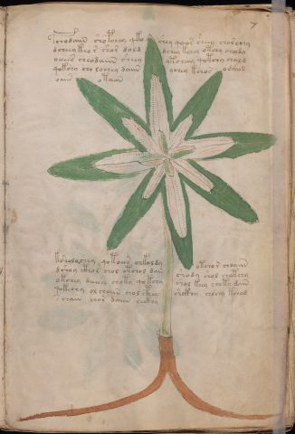

# Voynich Speculative Herbal Ferment Recipe — f7r

IMPORTANT: this is NOT a real or validated translation of the Voynich Manuscript. It is a speculative/procedural model that interprets EVA using a user-defined grammar to generate experimental recipes using safe, known edible substitutes.

This file is generated automatically from IVTFF/EVA transliteration plus a user-defined procedural grammar.



## Page / Folio
- currier: A
- folio: f7r
- page_number: 13
- plant_category_confidence: 0.0
- plant_category_guess: unknown
- section: herbal

## Plant Interpretation (Heuristic)
- category: unknown
- confidence: 0.0
- note: Heuristic classification based on the IVTFF 'Plant ID' string (not the drawing). Does not imply real identification of the manuscript plant.

## EVA Text (Transliteration)
```text
fchodaiin shopchey qko shey qoos sheey charochy
dcheey keo r shor dold dchey kchey otchy cheody
oeeees cheodaiin sheey ytcheey qotchy chald
qokcho cho lochey daiin ychey kchos odaiin
oaiir otaiin
ksholo chey qotoees chkoldy otchor choaiin
dshoy cthol chol otchol dain shody shol chotchy
okchey deeeese choty qokchy shol keey choty dain
qokechy ol choiin chol cphey shckhy chochy kchod
s chain chor daiin chckhy
```

## Page Summary (Procedural, Aggregated)
- compound_counts: {'aroma modifier': 1, 'main herb': 39, 'mix/transfer': 44, 'yeast fermentation': 19, 'secondary herb': 11, 'general base': 1, 'sugars': 12, 'liquid base': 6, 'heat': 10, 'complex herbal compound': 4}
- dose_level: 3
- fermentation_estimate: 7–14 days

## Pantry (Max Needed For Any Single Line-Recipe)
- aroma_modifier: ['lemon peel (optional)']
- aroma_modifier_dose: ['2–5 g (or 1 strip of peel, avoiding the bitter pith)']
- main_plant_dry_g: 15
- main_plant_substitute: ['chamomile (safe default substitute)']
- safe_complex_herbal_blend: ['gentle spices (e.g., 1 g cinnamon + 1 g clove) or a commercial herbal tea blend']
- secondary_herb_dry_g: 7
- secondary_herb_substitute: ['mint']
- sugar_or_honey_g: 75
- water_l: 0.5
- yeast_g: 1

## Recipes Index (This Page)
- [f7r.1,@P0](#f7r-1-f7r-1-p0)
- [f7r.2,+P0](#f7r-2-f7r-2-p0)
- [f7r.3,+P0](#f7r-3-f7r-3-p0)
- [f7r.4,+P0](#f7r-4-f7r-4-p0)
- [f7r.5,+P0](#f7r-5-f7r-5-p0)
- [f7r.6,+P0](#f7r-6-f7r-6-p0)
- [f7r.7,+P0](#f7r-7-f7r-7-p0)
- [f7r.8,+P0](#f7r-8-f7r-8-p0)
- [f7r.9,+P0](#f7r-9-f7r-9-p0)
- [f7r.10,+P0](#f7r-10-f7r-10-p0)

## Line Recipes (Each Line = One Recipe, 0.5L batch)

<a id="f7r-1-f7r-1-p0"></a>

### f7r.1,@P0

EVA: fchodaiin shopchey qko shey qoos sheey charochy

## Ingredients
- aroma_modifier: lemon peel (optional)
- aroma_modifier_dose: 2–5 g (or 1 strip of peel, avoiding the bitter pith)
- main_plant_dry_g: 10
- main_plant_substitute: chamomile (safe default substitute)
- secondary_herb_dry_g: 5
- secondary_herb_substitute: mint
- sugar_or_honey_g: 50
- water_l: 0.5
- yeast_g: 1

Process:
1. Sanitize the jar/fermenter and utensils.
2. Base: combine 0.5 L water with 50 g sugar or honey.
3. Infusion: use hot (not boiling) water, then let it cool before adding yeast.
4. Add main plant: chamomile (safe default substitute) (~10 g dried).
5. Add secondary herb: mint (~5 g dried).
6. Add aroma modifier (optional) in a low dose.
7. Pitch yeast: 1 g (ideally cider/beer yeast).
8. Ferment with an airlock: 7–14 days (guided by iin/aiin markers).
9. Strain/rack (if very solid-heavy) and cold-crash 24 h.
10. Bottle only when activity clearly slows; refrigerate. Avoid overpressure.

Expected Result: A mild, aromatic herbal ferment, low-to-medium intensity depending on dose level.

Does It Make Sense?: partial

Direct Gloss (Procedural, Not a Real Translation):
- fchodaiin: add main plant (safe substitute) → add aroma modifier → mix / transfer → start fermentation (yeast) → duration level 1 → state: fermentation start → long fermentation / aging phase
- shopchey: add main plant (safe substitute) → add secondary herb (safe substitute) → mix / transfer → start fermentation (yeast) → duration level 1 → state: active extraction
- qko: prepare base (generic) → add fermentable sugars → mix / transfer
- shey: add secondary herb (safe substitute) → duration level 1 → state: active extraction
- qoos: prepare liquid base → mix / transfer
- sheey: add secondary herb (safe substitute) → duration level 2 → state: active extraction
- charochy: add main plant (safe substitute) → mix / transfer → duration level 1 → state: fermentation start

<a id="f7r-2-f7r-2-p0"></a>

### f7r.2,+P0

EVA: dcheey keo r shor dold dchey kchey otchy cheody

## Ingredients
- main_plant_dry_g: 10
- main_plant_substitute: chamomile (safe default substitute)
- secondary_herb_dry_g: 5
- secondary_herb_substitute: mint
- sugar_or_honey_g: 50
- water_l: 0.5
- yeast_g: 1

Process:
1. Sanitize the jar/fermenter and utensils.
2. Base: combine 0.5 L water with 50 g sugar or honey.
3. Apply gentle heat: simmer 10–15 min, then cool to <30°C before adding yeast.
4. Add main plant: chamomile (safe default substitute) (~10 g dried).
5. Add secondary herb: mint (~5 g dried).
6. Pitch yeast: 1 g (ideally cider/beer yeast).
7. Ferment with an airlock: 2–4 days (guided by iin/aiin markers).
8. Strain/rack (if very solid-heavy) and cold-crash 24 h.
9. Bottle only when activity clearly slows; refrigerate. Avoid overpressure.

Expected Result: A mild, aromatic herbal ferment, low-to-medium intensity depending on dose level.

Does It Make Sense?: partial

Direct Gloss (Procedural, Not a Real Translation):
- dcheey: add main plant (safe substitute) → start fermentation (yeast) → duration level 2 → state: active extraction
- keo: add fermentable sugars → mix / transfer → duration level 1 → state: active extraction
- r: [unparsed]
- shor: add secondary herb (safe substitute) → mix / transfer
- dold: mix / transfer → start fermentation (yeast)
- dchey: add main plant (safe substitute) → start fermentation (yeast) → duration level 1 → state: active extraction
- kchey: add fermentable sugars → add main plant (safe substitute) → duration level 1 → state: active extraction
- otchy: apply heat/cooking → add main plant (safe substitute) → mix / transfer
- cheody: add main plant (safe substitute) → mix / transfer → start fermentation (yeast) → duration level 1 → state: active extraction

<a id="f7r-3-f7r-3-p0"></a>

### f7r.3,+P0

EVA: oeeees cheodaiin sheey ytcheey qotchy chald

## Ingredients
- main_plant_dry_g: 15
- main_plant_substitute: chamomile (safe default substitute)
- secondary_herb_dry_g: 7
- secondary_herb_substitute: mint
- sugar_or_honey_g: 37
- water_l: 0.5
- yeast_g: 1

Process:
1. Sanitize the jar/fermenter and utensils.
2. Base: combine 0.5 L water with 37 g sugar or honey.
3. Apply gentle heat: simmer 10–15 min, then cool to <30°C before adding yeast.
4. Add main plant: chamomile (safe default substitute) (~15 g dried).
5. Add secondary herb: mint (~7 g dried).
6. Pitch yeast: 1 g (ideally cider/beer yeast).
7. Ferment with an airlock: 7–14 days (guided by iin/aiin markers).
8. Strain/rack (if very solid-heavy) and cold-crash 24 h.
9. Bottle only when activity clearly slows; refrigerate. Avoid overpressure.

Expected Result: A mild, aromatic herbal ferment, low-to-medium intensity depending on dose level.

Does It Make Sense?: partial

Direct Gloss (Procedural, Not a Real Translation):
- oeeees: mix / transfer → duration level 4 → state: active extraction
- cheodaiin: add main plant (safe substitute) → mix / transfer → start fermentation (yeast) → duration level 1 → state: active extraction → long fermentation / aging phase
- sheey: add secondary herb (safe substitute) → duration level 2 → state: active extraction
- ytcheey: apply heat/cooking → add main plant (safe substitute) → duration level 2 → state: active extraction
- qotchy: prepare liquid base → apply heat/cooking → add main plant (safe substitute)
- chald: add main plant (safe substitute) → start fermentation (yeast) → duration level 1 → state: fermentation start

<a id="f7r-4-f7r-4-p0"></a>

### f7r.4,+P0

EVA: qokcho cho lochey daiin ychey kchos odaiin

## Ingredients
- main_plant_dry_g: 5
- main_plant_substitute: chamomile (safe default substitute)
- secondary_herb_dry_g: 1
- secondary_herb_substitute: mint
- sugar_or_honey_g: 25
- water_l: 0.5
- yeast_g: 1

Process:
1. Sanitize the jar/fermenter and utensils.
2. Base: combine 0.5 L water with 25 g sugar or honey.
3. Infusion: use hot (not boiling) water, then let it cool before adding yeast.
4. Add main plant: chamomile (safe default substitute) (~5 g dried).
5. Add secondary herb: mint (~1 g dried).
6. Pitch yeast: 1 g (ideally cider/beer yeast).
7. Ferment with an airlock: 7–14 days (guided by iin/aiin markers).
8. Strain/rack (if very solid-heavy) and cold-crash 24 h.
9. Bottle only when activity clearly slows; refrigerate. Avoid overpressure.

Expected Result: A mild, aromatic herbal ferment, low-to-medium intensity depending on dose level.

Does It Make Sense?: partial

Direct Gloss (Procedural, Not a Real Translation):
- qokcho: prepare liquid base → add fermentable sugars → add main plant (safe substitute) → mix / transfer
- cho: add main plant (safe substitute) → mix / transfer
- lochey: add main plant (safe substitute) → mix / transfer → duration level 1 → state: active extraction
- daiin: start fermentation (yeast) → duration level 1 → state: fermentation start → long fermentation / aging phase
- ychey: add main plant (safe substitute) → duration level 1 → state: active extraction
- kchos: add fermentable sugars → add main plant (safe substitute) → mix / transfer
- odaiin: mix / transfer → start fermentation (yeast) → duration level 1 → state: fermentation start → long fermentation / aging phase

<a id="f7r-5-f7r-5-p0"></a>

### f7r.5,+P0

EVA: oaiir otaiin

## Ingredients
- main_plant_dry_g: 2
- main_plant_substitute: chamomile (safe default substitute)
- secondary_herb_dry_g: 1
- secondary_herb_substitute: mint
- sugar_or_honey_g: 12
- water_l: 0.5
- yeast_g: 1

Process:
1. Sanitize the jar/fermenter and utensils.
2. Base: combine 0.5 L water with 12 g sugar or honey.
3. Apply gentle heat: simmer 10–15 min, then cool to <30°C before adding yeast.
4. Add main plant: chamomile (safe default substitute) (~2 g dried).
5. Add secondary herb: mint (~1 g dried).
6. Pitch yeast: 1 g (ideally cider/beer yeast).
7. Ferment with an airlock: 7–14 days (guided by iin/aiin markers).
8. Strain/rack (if very solid-heavy) and cold-crash 24 h.
9. Bottle only when activity clearly slows; refrigerate. Avoid overpressure.

Expected Result: A mild, aromatic herbal ferment, low-to-medium intensity depending on dose level.

Does It Make Sense?: partial

Direct Gloss (Procedural, Not a Real Translation):
- oaiir: mix / transfer → duration level 1 → state: fermentation start
- otaiin: apply heat/cooking → mix / transfer → duration level 1 → state: fermentation start → long fermentation / aging phase

<a id="f7r-6-f7r-6-p0"></a>

### f7r.6,+P0

EVA: ksholo chey qotoees chkoldy otchor choaiin

## Ingredients
- main_plant_dry_g: 10
- main_plant_substitute: chamomile (safe default substitute)
- secondary_herb_dry_g: 5
- secondary_herb_substitute: mint
- sugar_or_honey_g: 50
- water_l: 0.5
- yeast_g: 1

Process:
1. Sanitize the jar/fermenter and utensils.
2. Base: combine 0.5 L water with 50 g sugar or honey.
3. Apply gentle heat: simmer 10–15 min, then cool to <30°C before adding yeast.
4. Add main plant: chamomile (safe default substitute) (~10 g dried).
5. Add secondary herb: mint (~5 g dried).
6. Pitch yeast: 1 g (ideally cider/beer yeast).
7. Ferment with an airlock: 7–14 days (guided by iin/aiin markers).
8. Strain/rack (if very solid-heavy) and cold-crash 24 h.
9. Bottle only when activity clearly slows; refrigerate. Avoid overpressure.

Expected Result: A mild, aromatic herbal ferment, low-to-medium intensity depending on dose level.

Does It Make Sense?: partial

Direct Gloss (Procedural, Not a Real Translation):
- ksholo: add fermentable sugars → add secondary herb (safe substitute) → mix / transfer
- chey: add main plant (safe substitute) → duration level 1 → state: active extraction
- qotoees: prepare liquid base → apply heat/cooking → mix / transfer → duration level 2 → state: active extraction
- chkoldy: add fermentable sugars → add main plant (safe substitute) → mix / transfer → start fermentation (yeast)
- otchor: apply heat/cooking → add main plant (safe substitute) → mix / transfer
- choaiin: add main plant (safe substitute) → mix / transfer → duration level 1 → state: fermentation start → long fermentation / aging phase

<a id="f7r-7-f7r-7-p0"></a>

### f7r.7,+P0

EVA: dshoy cthol chol otchol dain shody shol chotchy

## Ingredients
- main_plant_dry_g: 5
- main_plant_substitute: chamomile (safe default substitute)
- safe_complex_herbal_blend: gentle spices (e.g., 1 g cinnamon + 1 g clove) or a commercial herbal tea blend
- secondary_herb_dry_g: 2
- secondary_herb_substitute: mint
- sugar_or_honey_g: 12
- water_l: 0.5
- yeast_g: 1

Process:
1. Sanitize the jar/fermenter and utensils.
2. Base: combine 0.5 L water with 12 g sugar or honey.
3. Apply gentle heat: simmer 10–15 min, then cool to <30°C before adding yeast.
4. Add main plant: chamomile (safe default substitute) (~5 g dried).
5. Add secondary herb: mint (~2 g dried).
6. If a complex herbal compound appears, use a safe commercial blend or gentle spices in micro-doses.
7. Pitch yeast: 1 g (ideally cider/beer yeast).
8. Ferment with an airlock: 2–4 days (guided by iin/aiin markers).
9. Strain/rack (if very solid-heavy) and cold-crash 24 h.
10. Bottle only when activity clearly slows; refrigerate. Avoid overpressure.

Expected Result: A mild, aromatic herbal ferment, low-to-medium intensity depending on dose level.

Does It Make Sense?: partial

Direct Gloss (Procedural, Not a Real Translation):
- dshoy: add secondary herb (safe substitute) → mix / transfer → start fermentation (yeast)
- cthol: mix / transfer → add complex herbal compound (safe blend)
- chol: add main plant (safe substitute) → mix / transfer
- otchol: apply heat/cooking → add main plant (safe substitute) → mix / transfer
- dain: start fermentation (yeast) → duration level 1 → state: fermentation start
- shody: add secondary herb (safe substitute) → mix / transfer → start fermentation (yeast)
- shol: add secondary herb (safe substitute) → mix / transfer
- chotchy: apply heat/cooking → add main plant (safe substitute) → mix / transfer

<a id="f7r-8-f7r-8-p0"></a>

### f7r.8,+P0

EVA: okchey deeeese choty qokchy shol keey choty dain

## Ingredients
- main_plant_dry_g: 15
- main_plant_substitute: chamomile (safe default substitute)
- secondary_herb_dry_g: 7
- secondary_herb_substitute: mint
- sugar_or_honey_g: 75
- water_l: 0.5
- yeast_g: 1

Process:
1. Sanitize the jar/fermenter and utensils.
2. Base: combine 0.5 L water with 75 g sugar or honey.
3. Apply gentle heat: simmer 10–15 min, then cool to <30°C before adding yeast.
4. Add main plant: chamomile (safe default substitute) (~15 g dried).
5. Add secondary herb: mint (~7 g dried).
6. Pitch yeast: 1 g (ideally cider/beer yeast).
7. Ferment with an airlock: 2–4 days (guided by iin/aiin markers).
8. Strain/rack (if very solid-heavy) and cold-crash 24 h.
9. Bottle only when activity clearly slows; refrigerate. Avoid overpressure.

Expected Result: A mild, aromatic herbal ferment, low-to-medium intensity depending on dose level.

Does It Make Sense?: partial

Direct Gloss (Procedural, Not a Real Translation):
- okchey: add fermentable sugars → add main plant (safe substitute) → mix / transfer → duration level 1 → state: active extraction
- deeeese: start fermentation (yeast) → duration level 4 → state: active extraction
- choty: apply heat/cooking → add main plant (safe substitute) → mix / transfer
- qokchy: prepare liquid base → add fermentable sugars → add main plant (safe substitute)
- shol: add secondary herb (safe substitute) → mix / transfer
- keey: add fermentable sugars → duration level 2 → state: active extraction
- choty: apply heat/cooking → add main plant (safe substitute) → mix / transfer
- dain: start fermentation (yeast) → duration level 1 → state: fermentation start

<a id="f7r-9-f7r-9-p0"></a>

### f7r.9,+P0

EVA: qokechy ol choiin chol cphey shckhy chochy kchod

## Ingredients
- main_plant_dry_g: 10
- main_plant_substitute: chamomile (safe default substitute)
- safe_complex_herbal_blend: gentle spices (e.g., 1 g cinnamon + 1 g clove) or a commercial herbal tea blend
- secondary_herb_dry_g: 5
- secondary_herb_substitute: mint
- sugar_or_honey_g: 50
- water_l: 0.5
- yeast_g: 1

Process:
1. Sanitize the jar/fermenter and utensils.
2. Base: combine 0.5 L water with 50 g sugar or honey.
3. Infusion: use hot (not boiling) water, then let it cool before adding yeast.
4. Add main plant: chamomile (safe default substitute) (~10 g dried).
5. Add secondary herb: mint (~5 g dried).
6. If a complex herbal compound appears, use a safe commercial blend or gentle spices in micro-doses.
7. Pitch yeast: 1 g (ideally cider/beer yeast).
8. Ferment with an airlock: 3–5 days (guided by iin/aiin markers).
9. Strain/rack (if very solid-heavy) and cold-crash 24 h.
10. Bottle only when activity clearly slows; refrigerate. Avoid overpressure.

Expected Result: A mild, aromatic herbal ferment, low-to-medium intensity depending on dose level.

Does It Make Sense?: partial

Direct Gloss (Procedural, Not a Real Translation):
- qokechy: prepare liquid base → add fermentable sugars → add main plant (safe substitute) → duration level 1 → state: active extraction
- ol: mix / transfer
- choiin: add main plant (safe substitute) → mix / transfer → duration level 2 → state: cooling/rest → medium fermentation phase
- chol: add main plant (safe substitute) → mix / transfer
- cphey: add complex herbal compound (safe blend) → duration level 1 → state: active extraction
- shckhy: add secondary herb (safe substitute) → add complex herbal compound (safe blend)
- chochy: add main plant (safe substitute) → mix / transfer
- kchod: add fermentable sugars → add main plant (safe substitute) → mix / transfer → start fermentation (yeast)

<a id="f7r-10-f7r-10-p0"></a>

### f7r.10,+P0

EVA: s chain chor daiin chckhy

## Ingredients
- main_plant_dry_g: 5
- main_plant_substitute: chamomile (safe default substitute)
- safe_complex_herbal_blend: gentle spices (e.g., 1 g cinnamon + 1 g clove) or a commercial herbal tea blend
- secondary_herb_dry_g: 1
- secondary_herb_substitute: mint
- sugar_or_honey_g: 12
- water_l: 0.5
- yeast_g: 1

Process:
1. Sanitize the jar/fermenter and utensils.
2. Base: combine 0.5 L water with 12 g sugar or honey.
3. Infusion: use hot (not boiling) water, then let it cool before adding yeast.
4. Add main plant: chamomile (safe default substitute) (~5 g dried).
5. Add secondary herb: mint (~1 g dried).
6. If a complex herbal compound appears, use a safe commercial blend or gentle spices in micro-doses.
7. Pitch yeast: 1 g (ideally cider/beer yeast).
8. Ferment with an airlock: 7–14 days (guided by iin/aiin markers).
9. Strain/rack (if very solid-heavy) and cold-crash 24 h.
10. Bottle only when activity clearly slows; refrigerate. Avoid overpressure.

Expected Result: A mild, aromatic herbal ferment, low-to-medium intensity depending on dose level.

Does It Make Sense?: partial

Direct Gloss (Procedural, Not a Real Translation):
- s: [unparsed]
- chain: add main plant (safe substitute) → duration level 1 → state: fermentation start
- chor: add main plant (safe substitute) → mix / transfer
- daiin: start fermentation (yeast) → duration level 1 → state: fermentation start → long fermentation / aging phase
- chckhy: add main plant (safe substitute) → add complex herbal compound (safe blend)

## Risks & Warnings (Applies To All Line-Recipes)
- Never use unidentified Voynich plants directly; only use known edible substitutes.
- Do not consume if you see mold, smell rot, notice abnormal sliminess, or taste something clearly foul.
- Overpressure/bottle-bomb risk: do not bottle before stable; prefer an airlock and refrigeration.
- Avoid if pregnant/breastfeeding, for minors, or with medical conditions; consult a professional.
- No medical claims: this is an experimental beverage.

## Recommended Adjustments (General)
- If too bitter (leafy profile), halve the herbs or shorten steep/maceration time.
- If too sweet, extend fermentation or reduce sugar by 25–50%.
- For a non-alcoholic version, omit yeast and keep refrigerated as an infusion (not fermented).
