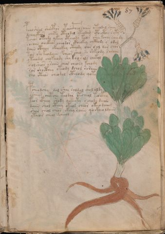

# Voynich Speculative Herbal Ferment Recipe — f87r

IMPORTANT: this is NOT a real or validated translation of the Voynich Manuscript. It is a speculative/procedural model that interprets EVA using a user-defined grammar to generate experimental recipes using safe, known edible substitutes.

This file is generated automatically from IVTFF/EVA transliteration plus a user-defined procedural grammar.



## Page / Folio
- currier: A
- folio: f87r
- page_number: 175
- plant_category_confidence: 0.0
- plant_category_guess: unknown
- section: herbal

## Plant Interpretation (Heuristic)
- category: unknown
- confidence: 0.0
- note: Heuristic classification based on the IVTFF 'Plant ID' string (not the drawing). Does not imply real identification of the manuscript plant.

## EVA Text (Transliteration)
```text
poalshsal shocphor ypcho cpheo saiin oteodal saiin
dcheeckhos chety cthodal yteodam cphecthy syty
tchor oteedy ykeey cthhody keos sheekchey saiidy
soraiin qockhos cheodor ckheokey chcthody s odar
daiin ctheey ckheckhy cthody chor s al dar chor
tos she keodaiin pcheos sheo so shkeody soraiin
y teeodal cho keeody shy ko[o:l] sols chekol
solsheor ysaiin chor cheory kchody
sor shocthey oteody dchol saraiin
sho cthos cheodal ctheody qoty
psheodshy dal shee saldal shol aldy
ysheee[r:s] chetchy teodar otcheol tockhy
keor ckheey shody qoeeeety s chody daiin
daiin shol cthey okeol cheor okeeo daiim
shos cheol cheos ckhey saiin q'ockheo ldaiin
yteeo[r:s] cheol dcheeol
```

## Page Summary (Procedural, Aggregated)
- compound_counts: {'yeast fermentation': 38, 'mix/transfer': 75, 'secondary herb': 18, 'complex herbal compound': 22, 'main herb': 26, 'heat': 16, 'sugars': 13, 'liquid base': 3, 'general base': 1}
- dose_level: 3
- fermentation_estimate: 7–14 days

## Pantry (Max Needed For Any Single Line-Recipe)
- main_plant_dry_g: 15
- main_plant_substitute: ['chamomile (safe default substitute)']
- safe_complex_herbal_blend: ['gentle spices (e.g., 1 g cinnamon + 1 g clove) or a commercial herbal tea blend']
- secondary_herb_dry_g: 7
- secondary_herb_substitute: ['mint']
- sugar_or_honey_g: 75
- water_l: 0.5
- yeast_g: 1

## Recipes Index (This Page)
- [f87r.1,@P0](#f87r-1-f87r-1-p0)
- [f87r.2,+P0](#f87r-2-f87r-2-p0)
- [f87r.3,+P0](#f87r-3-f87r-3-p0)
- [f87r.4,+P0](#f87r-4-f87r-4-p0)
- [f87r.5,+P0](#f87r-5-f87r-5-p0)
- [f87r.6,+P0](#f87r-6-f87r-6-p0)
- [f87r.7,+P0](#f87r-7-f87r-7-p0)
- [f87r.8,+P0](#f87r-8-f87r-8-p0)
- [f87r.9,+P0](#f87r-9-f87r-9-p0)
- [f87r.10,+P0](#f87r-10-f87r-10-p0)
- [f87r.11,+P0](#f87r-11-f87r-11-p0)
- [f87r.12,+P0](#f87r-12-f87r-12-p0)
- [f87r.13,+P0](#f87r-13-f87r-13-p0)
- [f87r.14,+P0](#f87r-14-f87r-14-p0)
- [f87r.15,+P0](#f87r-15-f87r-15-p0)
- [f87r.16,+P0](#f87r-16-f87r-16-p0)

## Line Recipes (Each Line = One Recipe, 0.5L batch)

<a id="f87r-1-f87r-1-p0"></a>

### f87r.1,@P0

EVA: poalshsal shocphor ypcho cpheo saiin oteodal saiin

## Ingredients
- main_plant_dry_g: 5
- main_plant_substitute: chamomile (safe default substitute)
- safe_complex_herbal_blend: gentle spices (e.g., 1 g cinnamon + 1 g clove) or a commercial herbal tea blend
- secondary_herb_dry_g: 2
- secondary_herb_substitute: mint
- sugar_or_honey_g: 12
- water_l: 0.5
- yeast_g: 1

Process:
1. Sanitize the jar/fermenter and utensils.
2. Base: combine 0.5 L water with 12 g sugar or honey.
3. Apply gentle heat: simmer 10–15 min, then cool to <30°C before adding yeast.
4. Add main plant: chamomile (safe default substitute) (~5 g dried).
5. Add secondary herb: mint (~2 g dried).
6. If a complex herbal compound appears, use a safe commercial blend or gentle spices in micro-doses.
7. Pitch yeast: 1 g (ideally cider/beer yeast).
8. Ferment with an airlock: 7–14 days (guided by iin/aiin markers).
9. Strain/rack (if very solid-heavy) and cold-crash 24 h.
10. Bottle only when activity clearly slows; refrigerate. Avoid overpressure.

Expected Result: A mild, aromatic herbal ferment, low-to-medium intensity depending on dose level.

Does It Make Sense?: partial

Direct Gloss (Procedural, Not a Real Translation):
- poalshsal: add secondary herb (safe substitute) → mix / transfer → start fermentation (yeast) → duration level 1 → state: fermentation start
- shocphor: add secondary herb (safe substitute) → mix / transfer → add complex herbal compound (safe blend)
- ypcho: add main plant (safe substitute) → mix / transfer → start fermentation (yeast)
- cpheo: mix / transfer → add complex herbal compound (safe blend) → duration level 1 → state: active extraction
- saiin: duration level 1 → state: fermentation start → long fermentation / aging phase
- oteodal: apply heat/cooking → mix / transfer → start fermentation (yeast) → duration level 1 → state: active extraction
- saiin: duration level 1 → state: fermentation start → long fermentation / aging phase

<a id="f87r-2-f87r-2-p0"></a>

### f87r.2,+P0

EVA: dcheeckhos chety cthodal yteodam cphecthy syty

## Ingredients
- main_plant_dry_g: 10
- main_plant_substitute: chamomile (safe default substitute)
- safe_complex_herbal_blend: gentle spices (e.g., 1 g cinnamon + 1 g clove) or a commercial herbal tea blend
- secondary_herb_dry_g: 2
- secondary_herb_substitute: mint
- sugar_or_honey_g: 25
- water_l: 0.5
- yeast_g: 1

Process:
1. Sanitize the jar/fermenter and utensils.
2. Base: combine 0.5 L water with 25 g sugar or honey.
3. Apply gentle heat: simmer 10–15 min, then cool to <30°C before adding yeast.
4. Add main plant: chamomile (safe default substitute) (~10 g dried).
5. Add secondary herb: mint (~2 g dried).
6. If a complex herbal compound appears, use a safe commercial blend or gentle spices in micro-doses.
7. Pitch yeast: 1 g (ideally cider/beer yeast).
8. Ferment with an airlock: 2–4 days (guided by iin/aiin markers).
9. Strain/rack (if very solid-heavy) and cold-crash 24 h.
10. Bottle only when activity clearly slows; refrigerate. Avoid overpressure.

Expected Result: A mild, aromatic herbal ferment, low-to-medium intensity depending on dose level.

Does It Make Sense?: partial

Direct Gloss (Procedural, Not a Real Translation):
- dcheeckhos: add main plant (safe substitute) → mix / transfer → start fermentation (yeast) → add complex herbal compound (safe blend) → duration level 2 → state: active extraction
- chety: apply heat/cooking → add main plant (safe substitute) → duration level 1 → state: active extraction
- cthodal: mix / transfer → start fermentation (yeast) → add complex herbal compound (safe blend) → duration level 1 → state: fermentation start
- yteodam: apply heat/cooking → mix / transfer → start fermentation (yeast) → duration level 1 → state: active extraction
- cphecthy: add complex herbal compound (safe blend) → duration level 1 → state: active extraction
- syty: apply heat/cooking

<a id="f87r-3-f87r-3-p0"></a>

### f87r.3,+P0

EVA: tchor oteedy ykeey cthhody keos sheekchey saiidy

## Ingredients
- main_plant_dry_g: 10
- main_plant_substitute: chamomile (safe default substitute)
- safe_complex_herbal_blend: gentle spices (e.g., 1 g cinnamon + 1 g clove) or a commercial herbal tea blend
- secondary_herb_dry_g: 5
- secondary_herb_substitute: mint
- sugar_or_honey_g: 50
- water_l: 0.5
- yeast_g: 1

Process:
1. Sanitize the jar/fermenter and utensils.
2. Base: combine 0.5 L water with 50 g sugar or honey.
3. Apply gentle heat: simmer 10–15 min, then cool to <30°C before adding yeast.
4. Add main plant: chamomile (safe default substitute) (~10 g dried).
5. Add secondary herb: mint (~5 g dried).
6. If a complex herbal compound appears, use a safe commercial blend or gentle spices in micro-doses.
7. Pitch yeast: 1 g (ideally cider/beer yeast).
8. Ferment with an airlock: 2–4 days (guided by iin/aiin markers).
9. Strain/rack (if very solid-heavy) and cold-crash 24 h.
10. Bottle only when activity clearly slows; refrigerate. Avoid overpressure.

Expected Result: A mild, aromatic herbal ferment, low-to-medium intensity depending on dose level.

Does It Make Sense?: partial

Direct Gloss (Procedural, Not a Real Translation):
- tchor: apply heat/cooking → add main plant (safe substitute) → mix / transfer
- oteedy: apply heat/cooking → mix / transfer → start fermentation (yeast) → duration level 2 → state: active extraction
- ykeey: add fermentable sugars → duration level 2 → state: active extraction
- cthhody: mix / transfer → start fermentation (yeast) → add complex herbal compound (safe blend)
- keos: add fermentable sugars → mix / transfer → duration level 1 → state: active extraction
- sheekchey: add fermentable sugars → add main plant (safe substitute) → add secondary herb (safe substitute) → duration level 2 → state: active extraction
- saiidy: start fermentation (yeast) → duration level 1 → state: fermentation start

<a id="f87r-4-f87r-4-p0"></a>

### f87r.4,+P0

EVA: soraiin qockhos cheodor ckheokey chcthody s odar

## Ingredients
- main_plant_dry_g: 5
- main_plant_substitute: chamomile (safe default substitute)
- safe_complex_herbal_blend: gentle spices (e.g., 1 g cinnamon + 1 g clove) or a commercial herbal tea blend
- secondary_herb_dry_g: 1
- secondary_herb_substitute: mint
- sugar_or_honey_g: 25
- water_l: 0.5
- yeast_g: 1

Process:
1. Sanitize the jar/fermenter and utensils.
2. Base: combine 0.5 L water with 25 g sugar or honey.
3. Infusion: use hot (not boiling) water, then let it cool before adding yeast.
4. Add main plant: chamomile (safe default substitute) (~5 g dried).
5. Add secondary herb: mint (~1 g dried).
6. If a complex herbal compound appears, use a safe commercial blend or gentle spices in micro-doses.
7. Pitch yeast: 1 g (ideally cider/beer yeast).
8. Ferment with an airlock: 7–14 days (guided by iin/aiin markers).
9. Strain/rack (if very solid-heavy) and cold-crash 24 h.
10. Bottle only when activity clearly slows; refrigerate. Avoid overpressure.

Expected Result: A mild, aromatic herbal ferment, low-to-medium intensity depending on dose level.

Does It Make Sense?: partial

Direct Gloss (Procedural, Not a Real Translation):
- soraiin: mix / transfer → duration level 1 → state: fermentation start → long fermentation / aging phase
- qockhos: prepare liquid base → mix / transfer → add complex herbal compound (safe blend)
- cheodor: add main plant (safe substitute) → mix / transfer → start fermentation (yeast) → duration level 1 → state: active extraction
- ckheokey: add fermentable sugars → mix / transfer → add complex herbal compound (safe blend) → duration level 1 → state: active extraction
- chcthody: add main plant (safe substitute) → mix / transfer → start fermentation (yeast) → add complex herbal compound (safe blend)
- s: [unparsed]
- odar: mix / transfer → start fermentation (yeast) → duration level 1 → state: fermentation start

<a id="f87r-5-f87r-5-p0"></a>

### f87r.5,+P0

EVA: daiin ctheey ckheckhy cthody chor s al dar chor

## Ingredients
- main_plant_dry_g: 10
- main_plant_substitute: chamomile (safe default substitute)
- safe_complex_herbal_blend: gentle spices (e.g., 1 g cinnamon + 1 g clove) or a commercial herbal tea blend
- secondary_herb_dry_g: 2
- secondary_herb_substitute: mint
- sugar_or_honey_g: 25
- water_l: 0.5
- yeast_g: 1

Process:
1. Sanitize the jar/fermenter and utensils.
2. Base: combine 0.5 L water with 25 g sugar or honey.
3. Infusion: use hot (not boiling) water, then let it cool before adding yeast.
4. Add main plant: chamomile (safe default substitute) (~10 g dried).
5. Add secondary herb: mint (~2 g dried).
6. If a complex herbal compound appears, use a safe commercial blend or gentle spices in micro-doses.
7. Pitch yeast: 1 g (ideally cider/beer yeast).
8. Ferment with an airlock: 7–14 days (guided by iin/aiin markers).
9. Strain/rack (if very solid-heavy) and cold-crash 24 h.
10. Bottle only when activity clearly slows; refrigerate. Avoid overpressure.

Expected Result: A mild, aromatic herbal ferment, low-to-medium intensity depending on dose level.

Does It Make Sense?: partial

Direct Gloss (Procedural, Not a Real Translation):
- daiin: start fermentation (yeast) → duration level 1 → state: fermentation start → long fermentation / aging phase
- ctheey: add complex herbal compound (safe blend) → duration level 2 → state: active extraction
- ckheckhy: add complex herbal compound (safe blend) → duration level 1 → state: active extraction
- cthody: mix / transfer → start fermentation (yeast) → add complex herbal compound (safe blend)
- chor: add main plant (safe substitute) → mix / transfer
- s: [unparsed]
- al: duration level 1 → state: fermentation start
- dar: start fermentation (yeast) → duration level 1 → state: fermentation start
- chor: add main plant (safe substitute) → mix / transfer

<a id="f87r-6-f87r-6-p0"></a>

### f87r.6,+P0

EVA: tos she keodaiin pcheos sheo so shkeody soraiin

## Ingredients
- main_plant_dry_g: 5
- main_plant_substitute: chamomile (safe default substitute)
- secondary_herb_dry_g: 2
- secondary_herb_substitute: mint
- sugar_or_honey_g: 25
- water_l: 0.5
- yeast_g: 1

Process:
1. Sanitize the jar/fermenter and utensils.
2. Base: combine 0.5 L water with 25 g sugar or honey.
3. Apply gentle heat: simmer 10–15 min, then cool to <30°C before adding yeast.
4. Add main plant: chamomile (safe default substitute) (~5 g dried).
5. Add secondary herb: mint (~2 g dried).
6. Pitch yeast: 1 g (ideally cider/beer yeast).
7. Ferment with an airlock: 7–14 days (guided by iin/aiin markers).
8. Strain/rack (if very solid-heavy) and cold-crash 24 h.
9. Bottle only when activity clearly slows; refrigerate. Avoid overpressure.

Expected Result: A mild, aromatic herbal ferment, low-to-medium intensity depending on dose level.

Does It Make Sense?: partial

Direct Gloss (Procedural, Not a Real Translation):
- tos: apply heat/cooking → mix / transfer
- she: add secondary herb (safe substitute) → duration level 1 → state: active extraction
- keodaiin: add fermentable sugars → mix / transfer → start fermentation (yeast) → duration level 1 → state: active extraction → long fermentation / aging phase
- pcheos: add main plant (safe substitute) → mix / transfer → start fermentation (yeast) → duration level 1 → state: active extraction
- sheo: add secondary herb (safe substitute) → mix / transfer → duration level 1 → state: active extraction
- so: mix / transfer
- shkeody: add fermentable sugars → add secondary herb (safe substitute) → mix / transfer → start fermentation (yeast) → duration level 1 → state: active extraction
- soraiin: mix / transfer → duration level 1 → state: fermentation start → long fermentation / aging phase

<a id="f87r-7-f87r-7-p0"></a>

### f87r.7,+P0

EVA: y teeodal cho keeody shy ko[o:l] sols chekol

## Ingredients
- main_plant_dry_g: 10
- main_plant_substitute: chamomile (safe default substitute)
- secondary_herb_dry_g: 5
- secondary_herb_substitute: mint
- sugar_or_honey_g: 50
- water_l: 0.5
- yeast_g: 1

Process:
1. Sanitize the jar/fermenter and utensils.
2. Base: combine 0.5 L water with 50 g sugar or honey.
3. Apply gentle heat: simmer 10–15 min, then cool to <30°C before adding yeast.
4. Add main plant: chamomile (safe default substitute) (~10 g dried).
5. Add secondary herb: mint (~5 g dried).
6. Pitch yeast: 1 g (ideally cider/beer yeast).
7. Ferment with an airlock: 2–4 days (guided by iin/aiin markers).
8. Strain/rack (if very solid-heavy) and cold-crash 24 h.
9. Bottle only when activity clearly slows; refrigerate. Avoid overpressure.

Expected Result: A mild, aromatic herbal ferment, low-to-medium intensity depending on dose level.

Does It Make Sense?: partial

Direct Gloss (Procedural, Not a Real Translation):
- y: [unparsed]
- teeodal: apply heat/cooking → mix / transfer → start fermentation (yeast) → duration level 2 → state: active extraction
- cho: add main plant (safe substitute) → mix / transfer
- keeody: add fermentable sugars → mix / transfer → start fermentation (yeast) → duration level 2 → state: active extraction
- shy: add secondary herb (safe substitute)
- ko: add fermentable sugars → mix / transfer
- o: mix / transfer
- l: [unparsed]
- sols: mix / transfer
- chekol: add fermentable sugars → add main plant (safe substitute) → mix / transfer → duration level 1 → state: active extraction

<a id="f87r-8-f87r-8-p0"></a>

### f87r.8,+P0

EVA: solsheor ysaiin chor cheory kchody

## Ingredients
- main_plant_dry_g: 5
- main_plant_substitute: chamomile (safe default substitute)
- secondary_herb_dry_g: 2
- secondary_herb_substitute: mint
- sugar_or_honey_g: 25
- water_l: 0.5
- yeast_g: 1

Process:
1. Sanitize the jar/fermenter and utensils.
2. Base: combine 0.5 L water with 25 g sugar or honey.
3. Infusion: use hot (not boiling) water, then let it cool before adding yeast.
4. Add main plant: chamomile (safe default substitute) (~5 g dried).
5. Add secondary herb: mint (~2 g dried).
6. Pitch yeast: 1 g (ideally cider/beer yeast).
7. Ferment with an airlock: 7–14 days (guided by iin/aiin markers).
8. Strain/rack (if very solid-heavy) and cold-crash 24 h.
9. Bottle only when activity clearly slows; refrigerate. Avoid overpressure.

Expected Result: A mild, aromatic herbal ferment, low-to-medium intensity depending on dose level.

Does It Make Sense?: partial

Direct Gloss (Procedural, Not a Real Translation):
- solsheor: add secondary herb (safe substitute) → mix / transfer → duration level 1 → state: active extraction
- ysaiin: duration level 1 → state: fermentation start → long fermentation / aging phase
- chor: add main plant (safe substitute) → mix / transfer
- cheory: add main plant (safe substitute) → mix / transfer → duration level 1 → state: active extraction
- kchody: add fermentable sugars → add main plant (safe substitute) → mix / transfer → start fermentation (yeast)

<a id="f87r-9-f87r-9-p0"></a>

### f87r.9,+P0

EVA: sor shocthey oteody dchol saraiin

## Ingredients
- main_plant_dry_g: 5
- main_plant_substitute: chamomile (safe default substitute)
- safe_complex_herbal_blend: gentle spices (e.g., 1 g cinnamon + 1 g clove) or a commercial herbal tea blend
- secondary_herb_dry_g: 2
- secondary_herb_substitute: mint
- sugar_or_honey_g: 12
- water_l: 0.5
- yeast_g: 1

Process:
1. Sanitize the jar/fermenter and utensils.
2. Base: combine 0.5 L water with 12 g sugar or honey.
3. Apply gentle heat: simmer 10–15 min, then cool to <30°C before adding yeast.
4. Add main plant: chamomile (safe default substitute) (~5 g dried).
5. Add secondary herb: mint (~2 g dried).
6. If a complex herbal compound appears, use a safe commercial blend or gentle spices in micro-doses.
7. Pitch yeast: 1 g (ideally cider/beer yeast).
8. Ferment with an airlock: 7–14 days (guided by iin/aiin markers).
9. Strain/rack (if very solid-heavy) and cold-crash 24 h.
10. Bottle only when activity clearly slows; refrigerate. Avoid overpressure.

Expected Result: A mild, aromatic herbal ferment, low-to-medium intensity depending on dose level.

Does It Make Sense?: partial

Direct Gloss (Procedural, Not a Real Translation):
- sor: mix / transfer
- shocthey: add secondary herb (safe substitute) → mix / transfer → add complex herbal compound (safe blend) → duration level 1 → state: active extraction
- oteody: apply heat/cooking → mix / transfer → start fermentation (yeast) → duration level 1 → state: active extraction
- dchol: add main plant (safe substitute) → mix / transfer → start fermentation (yeast)
- saraiin: duration level 1 → state: fermentation start → long fermentation / aging phase

<a id="f87r-10-f87r-10-p0"></a>

### f87r.10,+P0

EVA: sho cthos cheodal ctheody qoty

## Ingredients
- main_plant_dry_g: 5
- main_plant_substitute: chamomile (safe default substitute)
- safe_complex_herbal_blend: gentle spices (e.g., 1 g cinnamon + 1 g clove) or a commercial herbal tea blend
- secondary_herb_dry_g: 2
- secondary_herb_substitute: mint
- sugar_or_honey_g: 12
- water_l: 0.5
- yeast_g: 1

Process:
1. Sanitize the jar/fermenter and utensils.
2. Base: combine 0.5 L water with 12 g sugar or honey.
3. Apply gentle heat: simmer 10–15 min, then cool to <30°C before adding yeast.
4. Add main plant: chamomile (safe default substitute) (~5 g dried).
5. Add secondary herb: mint (~2 g dried).
6. If a complex herbal compound appears, use a safe commercial blend or gentle spices in micro-doses.
7. Pitch yeast: 1 g (ideally cider/beer yeast).
8. Ferment with an airlock: 2–4 days (guided by iin/aiin markers).
9. Strain/rack (if very solid-heavy) and cold-crash 24 h.
10. Bottle only when activity clearly slows; refrigerate. Avoid overpressure.

Expected Result: A mild, aromatic herbal ferment, low-to-medium intensity depending on dose level.

Does It Make Sense?: partial

Direct Gloss (Procedural, Not a Real Translation):
- sho: add secondary herb (safe substitute) → mix / transfer
- cthos: mix / transfer → add complex herbal compound (safe blend)
- cheodal: add main plant (safe substitute) → mix / transfer → start fermentation (yeast) → duration level 1 → state: active extraction
- ctheody: mix / transfer → start fermentation (yeast) → add complex herbal compound (safe blend) → duration level 1 → state: active extraction
- qoty: prepare liquid base → apply heat/cooking

<a id="f87r-11-f87r-11-p0"></a>

### f87r.11,+P0

EVA: psheodshy dal shee saldal shol aldy

## Ingredients
- main_plant_dry_g: 5
- main_plant_substitute: chamomile (safe default substitute)
- secondary_herb_dry_g: 5
- secondary_herb_substitute: mint
- sugar_or_honey_g: 25
- water_l: 0.5
- yeast_g: 1

Process:
1. Sanitize the jar/fermenter and utensils.
2. Base: combine 0.5 L water with 25 g sugar or honey.
3. Infusion: use hot (not boiling) water, then let it cool before adding yeast.
4. Add main plant: chamomile (safe default substitute) (~5 g dried).
5. Add secondary herb: mint (~5 g dried).
6. Pitch yeast: 1 g (ideally cider/beer yeast).
7. Ferment with an airlock: 2–4 days (guided by iin/aiin markers).
8. Strain/rack (if very solid-heavy) and cold-crash 24 h.
9. Bottle only when activity clearly slows; refrigerate. Avoid overpressure.

Expected Result: A mild, aromatic herbal ferment, low-to-medium intensity depending on dose level.

Does It Make Sense?: partial

Direct Gloss (Procedural, Not a Real Translation):
- psheodshy: add secondary herb (safe substitute) → mix / transfer → start fermentation (yeast) → duration level 1 → state: active extraction
- dal: start fermentation (yeast) → duration level 1 → state: fermentation start
- shee: add secondary herb (safe substitute) → duration level 2 → state: active extraction
- saldal: start fermentation (yeast) → duration level 1 → state: fermentation start
- shol: add secondary herb (safe substitute) → mix / transfer
- aldy: start fermentation (yeast) → duration level 1 → state: fermentation start

<a id="f87r-12-f87r-12-p0"></a>

### f87r.12,+P0

EVA: ysheee[r:s] chetchy teodar otcheol tockhy

## Ingredients
- main_plant_dry_g: 15
- main_plant_substitute: chamomile (safe default substitute)
- safe_complex_herbal_blend: gentle spices (e.g., 1 g cinnamon + 1 g clove) or a commercial herbal tea blend
- secondary_herb_dry_g: 7
- secondary_herb_substitute: mint
- sugar_or_honey_g: 37
- water_l: 0.5
- yeast_g: 1

Process:
1. Sanitize the jar/fermenter and utensils.
2. Base: combine 0.5 L water with 37 g sugar or honey.
3. Apply gentle heat: simmer 10–15 min, then cool to <30°C before adding yeast.
4. Add main plant: chamomile (safe default substitute) (~15 g dried).
5. Add secondary herb: mint (~7 g dried).
6. If a complex herbal compound appears, use a safe commercial blend or gentle spices in micro-doses.
7. Pitch yeast: 1 g (ideally cider/beer yeast).
8. Ferment with an airlock: 2–4 days (guided by iin/aiin markers).
9. Strain/rack (if very solid-heavy) and cold-crash 24 h.
10. Bottle only when activity clearly slows; refrigerate. Avoid overpressure.

Expected Result: A mild, aromatic herbal ferment, low-to-medium intensity depending on dose level.

Does It Make Sense?: partial

Direct Gloss (Procedural, Not a Real Translation):
- ysheee: add secondary herb (safe substitute) → duration level 3 → state: active extraction
- r: [unparsed]
- s: [unparsed]
- chetchy: apply heat/cooking → add main plant (safe substitute) → duration level 1 → state: active extraction
- teodar: apply heat/cooking → mix / transfer → start fermentation (yeast) → duration level 1 → state: active extraction
- otcheol: apply heat/cooking → add main plant (safe substitute) → mix / transfer → duration level 1 → state: active extraction
- tockhy: apply heat/cooking → mix / transfer → add complex herbal compound (safe blend)

<a id="f87r-13-f87r-13-p0"></a>

### f87r.13,+P0

EVA: keor ckheey shody qoeeeety s chody daiin

## Ingredients
- main_plant_dry_g: 15
- main_plant_substitute: chamomile (safe default substitute)
- safe_complex_herbal_blend: gentle spices (e.g., 1 g cinnamon + 1 g clove) or a commercial herbal tea blend
- secondary_herb_dry_g: 7
- secondary_herb_substitute: mint
- sugar_or_honey_g: 75
- water_l: 0.5
- yeast_g: 1

Process:
1. Sanitize the jar/fermenter and utensils.
2. Base: combine 0.5 L water with 75 g sugar or honey.
3. Apply gentle heat: simmer 10–15 min, then cool to <30°C before adding yeast.
4. Add main plant: chamomile (safe default substitute) (~15 g dried).
5. Add secondary herb: mint (~7 g dried).
6. If a complex herbal compound appears, use a safe commercial blend or gentle spices in micro-doses.
7. Pitch yeast: 1 g (ideally cider/beer yeast).
8. Ferment with an airlock: 7–14 days (guided by iin/aiin markers).
9. Strain/rack (if very solid-heavy) and cold-crash 24 h.
10. Bottle only when activity clearly slows; refrigerate. Avoid overpressure.

Expected Result: A mild, aromatic herbal ferment, low-to-medium intensity depending on dose level.

Does It Make Sense?: partial

Direct Gloss (Procedural, Not a Real Translation):
- keor: add fermentable sugars → mix / transfer → duration level 1 → state: active extraction
- ckheey: add complex herbal compound (safe blend) → duration level 2 → state: active extraction
- shody: add secondary herb (safe substitute) → mix / transfer → start fermentation (yeast)
- qoeeeety: prepare liquid base → apply heat/cooking → duration level 4 → state: active extraction
- s: [unparsed]
- chody: add main plant (safe substitute) → mix / transfer → start fermentation (yeast)
- daiin: start fermentation (yeast) → duration level 1 → state: fermentation start → long fermentation / aging phase

<a id="f87r-14-f87r-14-p0"></a>

### f87r.14,+P0

EVA: daiin shol cthey okeol cheor okeeo daiim

## Ingredients
- main_plant_dry_g: 10
- main_plant_substitute: chamomile (safe default substitute)
- safe_complex_herbal_blend: gentle spices (e.g., 1 g cinnamon + 1 g clove) or a commercial herbal tea blend
- secondary_herb_dry_g: 5
- secondary_herb_substitute: mint
- sugar_or_honey_g: 50
- water_l: 0.5
- yeast_g: 1

Process:
1. Sanitize the jar/fermenter and utensils.
2. Base: combine 0.5 L water with 50 g sugar or honey.
3. Infusion: use hot (not boiling) water, then let it cool before adding yeast.
4. Add main plant: chamomile (safe default substitute) (~10 g dried).
5. Add secondary herb: mint (~5 g dried).
6. If a complex herbal compound appears, use a safe commercial blend or gentle spices in micro-doses.
7. Pitch yeast: 1 g (ideally cider/beer yeast).
8. Ferment with an airlock: 7–14 days (guided by iin/aiin markers).
9. Strain/rack (if very solid-heavy) and cold-crash 24 h.
10. Bottle only when activity clearly slows; refrigerate. Avoid overpressure.

Expected Result: A mild, aromatic herbal ferment, low-to-medium intensity depending on dose level.

Does It Make Sense?: partial

Direct Gloss (Procedural, Not a Real Translation):
- daiin: start fermentation (yeast) → duration level 1 → state: fermentation start → long fermentation / aging phase
- shol: add secondary herb (safe substitute) → mix / transfer
- cthey: add complex herbal compound (safe blend) → duration level 1 → state: active extraction
- okeol: add fermentable sugars → mix / transfer → duration level 1 → state: active extraction
- cheor: add main plant (safe substitute) → mix / transfer → duration level 1 → state: active extraction
- okeeo: add fermentable sugars → mix / transfer → duration level 2 → state: active extraction
- daiim: start fermentation (yeast) → duration level 1 → state: fermentation start

<a id="f87r-15-f87r-15-p0"></a>

### f87r.15,+P0

EVA: shos cheol cheos ckhey saiin q'ockheo ldaiin

## Ingredients
- main_plant_dry_g: 5
- main_plant_substitute: chamomile (safe default substitute)
- safe_complex_herbal_blend: gentle spices (e.g., 1 g cinnamon + 1 g clove) or a commercial herbal tea blend
- secondary_herb_dry_g: 2
- secondary_herb_substitute: mint
- sugar_or_honey_g: 12
- water_l: 0.5
- yeast_g: 1

Process:
1. Sanitize the jar/fermenter and utensils.
2. Base: combine 0.5 L water with 12 g sugar or honey.
3. Infusion: use hot (not boiling) water, then let it cool before adding yeast.
4. Add main plant: chamomile (safe default substitute) (~5 g dried).
5. Add secondary herb: mint (~2 g dried).
6. If a complex herbal compound appears, use a safe commercial blend or gentle spices in micro-doses.
7. Pitch yeast: 1 g (ideally cider/beer yeast).
8. Ferment with an airlock: 7–14 days (guided by iin/aiin markers).
9. Strain/rack (if very solid-heavy) and cold-crash 24 h.
10. Bottle only when activity clearly slows; refrigerate. Avoid overpressure.

Expected Result: A mild, aromatic herbal ferment, low-to-medium intensity depending on dose level.

Does It Make Sense?: partial

Direct Gloss (Procedural, Not a Real Translation):
- shos: add secondary herb (safe substitute) → mix / transfer
- cheol: add main plant (safe substitute) → mix / transfer → duration level 1 → state: active extraction
- cheos: add main plant (safe substitute) → mix / transfer → duration level 1 → state: active extraction
- ckhey: add complex herbal compound (safe blend) → duration level 1 → state: active extraction
- saiin: duration level 1 → state: fermentation start → long fermentation / aging phase
- q: prepare base (generic)
- ockheo: mix / transfer → add complex herbal compound (safe blend) → duration level 1 → state: active extraction
- ldaiin: start fermentation (yeast) → duration level 1 → state: fermentation start → long fermentation / aging phase

<a id="f87r-16-f87r-16-p0"></a>

### f87r.16,+P0

EVA: yteeo[r:s] cheol dcheeol

## Ingredients
- main_plant_dry_g: 10
- main_plant_substitute: chamomile (safe default substitute)
- secondary_herb_dry_g: 2
- secondary_herb_substitute: mint
- sugar_or_honey_g: 25
- water_l: 0.5
- yeast_g: 1

Process:
1. Sanitize the jar/fermenter and utensils.
2. Base: combine 0.5 L water with 25 g sugar or honey.
3. Apply gentle heat: simmer 10–15 min, then cool to <30°C before adding yeast.
4. Add main plant: chamomile (safe default substitute) (~10 g dried).
5. Add secondary herb: mint (~2 g dried).
6. Pitch yeast: 1 g (ideally cider/beer yeast).
7. Ferment with an airlock: 2–4 days (guided by iin/aiin markers).
8. Strain/rack (if very solid-heavy) and cold-crash 24 h.
9. Bottle only when activity clearly slows; refrigerate. Avoid overpressure.

Expected Result: A mild, aromatic herbal ferment, low-to-medium intensity depending on dose level.

Does It Make Sense?: partial

Direct Gloss (Procedural, Not a Real Translation):
- yteeo: apply heat/cooking → mix / transfer → duration level 2 → state: active extraction
- r: [unparsed]
- s: [unparsed]
- cheol: add main plant (safe substitute) → mix / transfer → duration level 1 → state: active extraction
- dcheeol: add main plant (safe substitute) → mix / transfer → start fermentation (yeast) → duration level 2 → state: active extraction

## Risks & Warnings (Applies To All Line-Recipes)
- Never use unidentified Voynich plants directly; only use known edible substitutes.
- Do not consume if you see mold, smell rot, notice abnormal sliminess, or taste something clearly foul.
- Overpressure/bottle-bomb risk: do not bottle before stable; prefer an airlock and refrigeration.
- Avoid if pregnant/breastfeeding, for minors, or with medical conditions; consult a professional.
- No medical claims: this is an experimental beverage.

## Recommended Adjustments (General)
- If too bitter (leafy profile), halve the herbs or shorten steep/maceration time.
- If too sweet, extend fermentation or reduce sugar by 25–50%.
- For a non-alcoholic version, omit yeast and keep refrigerated as an infusion (not fermented).
