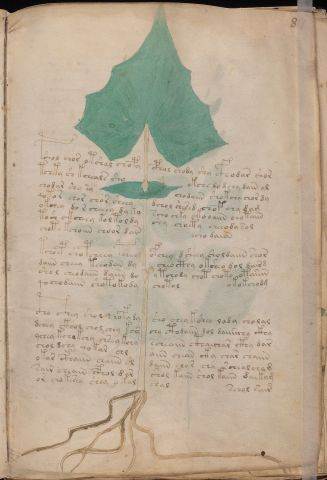

# Voynich Speculative Herbal Ferment Recipe — f8r

IMPORTANT: this is NOT a real or validated translation of the Voynich Manuscript. It is a speculative/procedural model that interprets EVA using a user-defined grammar to generate experimental recipes using safe, known edible substitutes.

This file is generated automatically from IVTFF/EVA transliteration plus a user-defined procedural grammar.



## Page / Folio
- currier: A
- folio: f8r
- page_number: 15
- section: herbal

## EVA Text (Transliteration)
```text
pshol chor otshal chopy cph[o:a]l chody shy cfhodar shor
tchty sh kcheals sho okche do dchy dain al
chodar shy sy chodaiin shokchy chor dy
qotor chor chor sheey dchol shesed chof chy dam
okchey do r cheeey dy ky scho chky ckooaiin ch[y:a] taiin
tosh ckcheey koltoldy shy choety cheeody sol
choto kchoan choor dain
dcho dain
tchoep sho pcheey pchey ofchey dsheey sholdaiin shor
daiin cheey teeodan dy cheocthy oksheo dol dairg
shol cheodaiin daiin do y tchody chot choty otariin
qo chodaiin shotokody chotol
okokchodg
c@132;ho c@196;hey shol chofydy sho chey kshey lody cholal
dchey ckhol chol chey kccs chy ctodaiin dol daiiir[ih:ch]y ckhy
ychey kch[e:o]kchy chsey kchy scheaiin cthaiihar cthy dar
chol dchy qokar chl aiin chean cky char chaiin
okar cfhaiin chaiin cl daiin chor cha rchealcham
sair cheain cphol dar shol kaiin shol kaiin dai kam
or cho kesey shey o kal chal
schol saim
```

## Recipes Index (This Page)
- [f8r.1,@P0](#f8r-1-f8r-1-p0)
- [f8r.2,+P0](#f8r-2-f8r-2-p0)
- [f8r.3,+P0](#f8r-3-f8r-3-p0)
- [f8r.4,+P0](#f8r-4-f8r-4-p0)
- [f8r.5,+P0](#f8r-5-f8r-5-p0)
- [f8r.6,+P0](#f8r-6-f8r-6-p0)
- [f8r.7,+P0](#f8r-7-f8r-7-p0)
- [f8r.8,=Pt](#f8r-8-f8r-8-pt)
- [f8r.9,*P0](#f8r-9-f8r-9-p0)
- [f8r.10,+P0](#f8r-10-f8r-10-p0)
- [f8r.11,+P0](#f8r-11-f8r-11-p0)
- [f8r.12,+P0](#f8r-12-f8r-12-p0)
- [f8r.13,=Pt](#f8r-13-f8r-13-pt)
- [f8r.14,*P0](#f8r-14-f8r-14-p0)
- [f8r.15,+P0](#f8r-15-f8r-15-p0)
- [f8r.16,+P0](#f8r-16-f8r-16-p0)
- [f8r.17,+P0](#f8r-17-f8r-17-p0)
- [f8r.18,+P0](#f8r-18-f8r-18-p0)
- [f8r.19,+P0](#f8r-19-f8r-19-p0)
- [f8r.20,+P0](#f8r-20-f8r-20-p0)
- [f8r.21,=Pt](#f8r-21-f8r-21-pt)

## Line Glosses (Procedural Gloss Only; Not a Translation)

<a id="f8r-1-f8r-1-p0"></a>

### f8r.1,@P0

EVA: pshol chor otshal chopy cph[o:a]l chody shy cfhodar shor

Direct Gloss (Procedural, Not a Real Translation):
- pshol: add secondary herb (safe substitute) → mix / transfer → start fermentation (yeast)
- chor: add main plant (safe substitute) → mix / transfer
- otshal: apply heat/cooking → add secondary herb (safe substitute) → mix / transfer → duration level 1 → state: fermentation start
- chopy: add main plant (safe substitute) → mix / transfer → start fermentation (yeast)
- cph: add complex herbal compound (safe blend)
- o: mix / transfer
- a: duration level 1 → state: fermentation start
- l: [unparsed]
- chody: add main plant (safe substitute) → mix / transfer → start fermentation (yeast)
- shy: add secondary herb (safe substitute)
- cfhodar: mix / transfer → start fermentation (yeast) → add complex herbal compound (safe blend) → duration level 1 → state: fermentation start
- shor: add secondary herb (safe substitute) → mix / transfer

<a id="f8r-2-f8r-2-p0"></a>

### f8r.2,+P0

EVA: tchty sh kcheals sho okche do dchy dain al

Direct Gloss (Procedural, Not a Real Translation):
- tchty: apply heat/cooking → add main plant (safe substitute)
- sh: add secondary herb (safe substitute)
- kcheals: add fermentable sugars → add main plant (safe substitute) → duration level 1 → state: active extraction
- sho: add secondary herb (safe substitute) → mix / transfer
- okche: add fermentable sugars → add main plant (safe substitute) → mix / transfer → duration level 1 → state: active extraction
- do: mix / transfer → start fermentation (yeast)
- dchy: add main plant (safe substitute) → start fermentation (yeast)
- dain: start fermentation (yeast) → duration level 1 → state: fermentation start
- al: duration level 1 → state: fermentation start

<a id="f8r-3-f8r-3-p0"></a>

### f8r.3,+P0

EVA: chodar shy sy chodaiin shokchy chor dy

Direct Gloss (Procedural, Not a Real Translation):
- chodar: add main plant (safe substitute) → mix / transfer → start fermentation (yeast) → duration level 1 → state: fermentation start
- shy: add secondary herb (safe substitute)
- sy: [unparsed]
- chodaiin: add main plant (safe substitute) → mix / transfer → start fermentation (yeast) → duration level 1 → state: fermentation start → long fermentation / aging phase
- shokchy: add fermentable sugars → add main plant (safe substitute) → add secondary herb (safe substitute) → mix / transfer
- chor: add main plant (safe substitute) → mix / transfer
- dy: start fermentation (yeast)

<a id="f8r-4-f8r-4-p0"></a>

### f8r.4,+P0

EVA: qotor chor chor sheey dchol shesed chof chy dam

Direct Gloss (Procedural, Not a Real Translation):
- qotor: prepare liquid base → apply heat/cooking → mix / transfer
- chor: add main plant (safe substitute) → mix / transfer
- chor: add main plant (safe substitute) → mix / transfer
- sheey: add secondary herb (safe substitute) → duration level 2 → state: active extraction
- dchol: add main plant (safe substitute) → mix / transfer → start fermentation (yeast)
- shesed: add secondary herb (safe substitute) → start fermentation (yeast) → duration level 1 → state: active extraction
- chof: add main plant (safe substitute) → add aroma modifier → mix / transfer
- chy: add main plant (safe substitute)
- dam: start fermentation (yeast) → duration level 1 → state: fermentation start

<a id="f8r-5-f8r-5-p0"></a>

### f8r.5,+P0

EVA: okchey do r cheeey dy ky scho chky ckooaiin ch[y:a] taiin

Direct Gloss (Procedural, Not a Real Translation):
- okchey: add fermentable sugars → add main plant (safe substitute) → mix / transfer → duration level 1 → state: active extraction
- do: mix / transfer → start fermentation (yeast)
- r: [unparsed]
- cheeey: add main plant (safe substitute) → duration level 3 → state: active extraction
- dy: start fermentation (yeast)
- ky: add fermentable sugars
- scho: add main plant (safe substitute) → mix / transfer
- chky: add fermentable sugars → add main plant (safe substitute)
- ckooaiin: add fermentable sugars → mix / transfer → duration level 1 → state: fermentation start → long fermentation / aging phase
- ch: add main plant (safe substitute)
- y: [unparsed]
- a: duration level 1 → state: fermentation start
- taiin: apply heat/cooking → duration level 1 → state: fermentation start → long fermentation / aging phase

<a id="f8r-6-f8r-6-p0"></a>

### f8r.6,+P0

EVA: tosh ckcheey koltoldy shy choety cheeody sol

Direct Gloss (Procedural, Not a Real Translation):
- tosh: apply heat/cooking → add secondary herb (safe substitute) → mix / transfer
- ckcheey: add fermentable sugars → add main plant (safe substitute) → duration level 2 → state: active extraction
- koltoldy: add fermentable sugars → apply heat/cooking → mix / transfer → start fermentation (yeast)
- shy: add secondary herb (safe substitute)
- choety: apply heat/cooking → add main plant (safe substitute) → mix / transfer → duration level 1 → state: active extraction
- cheeody: add main plant (safe substitute) → mix / transfer → start fermentation (yeast) → duration level 2 → state: active extraction
- sol: mix / transfer

<a id="f8r-7-f8r-7-p0"></a>

### f8r.7,+P0

EVA: choto kchoan choor dain

Direct Gloss (Procedural, Not a Real Translation):
- choto: apply heat/cooking → add main plant (safe substitute) → mix / transfer
- kchoan: add fermentable sugars → add main plant (safe substitute) → mix / transfer → duration level 1 → state: fermentation start
- choor: add main plant (safe substitute) → mix / transfer
- dain: start fermentation (yeast) → duration level 1 → state: fermentation start

<a id="f8r-8-f8r-8-pt"></a>

### f8r.8,=Pt

EVA: dcho dain

Direct Gloss (Procedural, Not a Real Translation):
- dcho: add main plant (safe substitute) → mix / transfer → start fermentation (yeast)
- dain: start fermentation (yeast) → duration level 1 → state: fermentation start

<a id="f8r-9-f8r-9-p0"></a>

### f8r.9,*P0

EVA: tchoep sho pcheey pchey ofchey dsheey sholdaiin shor

Direct Gloss (Procedural, Not a Real Translation):
- tchoep: apply heat/cooking → add main plant (safe substitute) → mix / transfer → start fermentation (yeast) → duration level 1 → state: active extraction
- sho: add secondary herb (safe substitute) → mix / transfer
- pcheey: add main plant (safe substitute) → start fermentation (yeast) → duration level 2 → state: active extraction
- pchey: add main plant (safe substitute) → start fermentation (yeast) → duration level 1 → state: active extraction
- ofchey: add main plant (safe substitute) → add aroma modifier → mix / transfer → duration level 1 → state: active extraction
- dsheey: add secondary herb (safe substitute) → start fermentation (yeast) → duration level 2 → state: active extraction
- sholdaiin: add secondary herb (safe substitute) → mix / transfer → start fermentation (yeast) → duration level 1 → state: fermentation start → long fermentation / aging phase
- shor: add secondary herb (safe substitute) → mix / transfer

<a id="f8r-10-f8r-10-p0"></a>

### f8r.10,+P0

EVA: daiin cheey teeodan dy cheocthy oksheo dol dairg

Direct Gloss (Procedural, Not a Real Translation):
- daiin: start fermentation (yeast) → duration level 1 → state: fermentation start → long fermentation / aging phase
- cheey: add main plant (safe substitute) → duration level 2 → state: active extraction
- teeodan: apply heat/cooking → mix / transfer → start fermentation (yeast) → duration level 2 → state: active extraction
- dy: start fermentation (yeast)
- cheocthy: add main plant (safe substitute) → mix / transfer → add complex herbal compound (safe blend) → duration level 1 → state: active extraction
- oksheo: add fermentable sugars → add secondary herb (safe substitute) → mix / transfer → duration level 1 → state: active extraction
- dol: mix / transfer → start fermentation (yeast)
- dairg: start fermentation (yeast) → duration level 1 → state: fermentation start

<a id="f8r-11-f8r-11-p0"></a>

### f8r.11,+P0

EVA: shol cheodaiin daiin do y tchody chot choty otariin

Direct Gloss (Procedural, Not a Real Translation):
- shol: add secondary herb (safe substitute) → mix / transfer
- cheodaiin: add main plant (safe substitute) → mix / transfer → start fermentation (yeast) → duration level 1 → state: active extraction → long fermentation / aging phase
- daiin: start fermentation (yeast) → duration level 1 → state: fermentation start → long fermentation / aging phase
- do: mix / transfer → start fermentation (yeast)
- y: [unparsed]
- tchody: apply heat/cooking → add main plant (safe substitute) → mix / transfer → start fermentation (yeast)
- chot: apply heat/cooking → add main plant (safe substitute) → mix / transfer
- choty: apply heat/cooking → add main plant (safe substitute) → mix / transfer
- otariin: apply heat/cooking → mix / transfer → duration level 1 → state: fermentation start → medium fermentation phase

<a id="f8r-12-f8r-12-p0"></a>

### f8r.12,+P0

EVA: qo chodaiin shotokody chotol

Direct Gloss (Procedural, Not a Real Translation):
- qo: prepare liquid base
- chodaiin: add main plant (safe substitute) → mix / transfer → start fermentation (yeast) → duration level 1 → state: fermentation start → long fermentation / aging phase
- shotokody: add fermentable sugars → apply heat/cooking → add secondary herb (safe substitute) → mix / transfer → start fermentation (yeast)
- chotol: apply heat/cooking → add main plant (safe substitute) → mix / transfer

<a id="f8r-13-f8r-13-pt"></a>

### f8r.13,=Pt

EVA: okokchodg

Direct Gloss (Procedural, Not a Real Translation):
- okokchodg: add fermentable sugars → add main plant (safe substitute) → mix / transfer → start fermentation (yeast)

<a id="f8r-14-f8r-14-p0"></a>

### f8r.14,*P0

EVA: c@132;ho c@196;hey shol chofydy sho chey kshey lody cholal

Direct Gloss (Procedural, Not a Real Translation):
- c: [unparsed]
- ho: mix / transfer
- c: [unparsed]
- hey: duration level 1 → state: active extraction
- shol: add secondary herb (safe substitute) → mix / transfer
- chofydy: add main plant (safe substitute) → add aroma modifier → mix / transfer → start fermentation (yeast)
- sho: add secondary herb (safe substitute) → mix / transfer
- chey: add main plant (safe substitute) → duration level 1 → state: active extraction
- kshey: add fermentable sugars → add secondary herb (safe substitute) → duration level 1 → state: active extraction
- lody: mix / transfer → start fermentation (yeast)
- cholal: add main plant (safe substitute) → mix / transfer → duration level 1 → state: fermentation start

<a id="f8r-15-f8r-15-p0"></a>

### f8r.15,+P0

EVA: dchey ckhol chol chey kccs chy ctodaiin dol daiiir[ih:ch]y ckhy

Direct Gloss (Procedural, Not a Real Translation):
- dchey: add main plant (safe substitute) → start fermentation (yeast) → duration level 1 → state: active extraction
- ckhol: mix / transfer → add complex herbal compound (safe blend)
- chol: add main plant (safe substitute) → mix / transfer
- chey: add main plant (safe substitute) → duration level 1 → state: active extraction
- kccs: add fermentable sugars
- chy: add main plant (safe substitute)
- ctodaiin: apply heat/cooking → mix / transfer → start fermentation (yeast) → duration level 1 → state: fermentation start → long fermentation / aging phase
- dol: mix / transfer → start fermentation (yeast)
- daiiir: start fermentation (yeast) → duration level 1 → state: fermentation start
- ih: duration level 1 → state: cooling/rest
- ch: add main plant (safe substitute)
- y: [unparsed]
- ckhy: add complex herbal compound (safe blend)

<a id="f8r-16-f8r-16-p0"></a>

### f8r.16,+P0

EVA: ychey kch[e:o]kchy chsey kchy scheaiin cthaiihar cthy dar

Direct Gloss (Procedural, Not a Real Translation):
- ychey: add main plant (safe substitute) → duration level 1 → state: active extraction
- kch: add fermentable sugars → add main plant (safe substitute)
- e: duration level 1 → state: active extraction
- o: mix / transfer
- kchy: add fermentable sugars → add main plant (safe substitute)
- chsey: add main plant (safe substitute) → duration level 1 → state: active extraction
- kchy: add fermentable sugars → add main plant (safe substitute)
- scheaiin: add main plant (safe substitute) → duration level 1 → state: active extraction → long fermentation / aging phase
- cthaiihar: add complex herbal compound (safe blend) → duration level 1 → state: fermentation start
- cthy: add complex herbal compound (safe blend)
- dar: start fermentation (yeast) → duration level 1 → state: fermentation start

<a id="f8r-17-f8r-17-p0"></a>

### f8r.17,+P0

EVA: chol dchy qokar chl aiin chean cky char chaiin

Direct Gloss (Procedural, Not a Real Translation):
- chol: add main plant (safe substitute) → mix / transfer
- dchy: add main plant (safe substitute) → start fermentation (yeast)
- qokar: prepare liquid base → add fermentable sugars → duration level 1 → state: fermentation start
- chl: add main plant (safe substitute)
- aiin: duration level 1 → state: fermentation start → long fermentation / aging phase
- chean: add main plant (safe substitute) → duration level 1 → state: active extraction
- cky: add fermentable sugars
- char: add main plant (safe substitute) → duration level 1 → state: fermentation start
- chaiin: add main plant (safe substitute) → duration level 1 → state: fermentation start → long fermentation / aging phase

<a id="f8r-18-f8r-18-p0"></a>

### f8r.18,+P0

EVA: okar cfhaiin chaiin cl daiin chor cha rchealcham

Direct Gloss (Procedural, Not a Real Translation):
- okar: add fermentable sugars → mix / transfer → duration level 1 → state: fermentation start
- cfhaiin: add complex herbal compound (safe blend) → duration level 1 → state: fermentation start → long fermentation / aging phase
- chaiin: add main plant (safe substitute) → duration level 1 → state: fermentation start → long fermentation / aging phase
- cl: [unparsed]
- daiin: start fermentation (yeast) → duration level 1 → state: fermentation start → long fermentation / aging phase
- chor: add main plant (safe substitute) → mix / transfer
- cha: add main plant (safe substitute) → duration level 1 → state: fermentation start
- rchealcham: add main plant (safe substitute) → duration level 1 → state: active extraction

<a id="f8r-19-f8r-19-p0"></a>

### f8r.19,+P0

EVA: sair cheain cphol dar shol kaiin shol kaiin dai kam

Direct Gloss (Procedural, Not a Real Translation):
- sair: duration level 1 → state: fermentation start
- cheain: add main plant (safe substitute) → duration level 1 → state: active extraction
- cphol: mix / transfer → add complex herbal compound (safe blend)
- dar: start fermentation (yeast) → duration level 1 → state: fermentation start
- shol: add secondary herb (safe substitute) → mix / transfer
- kaiin: add fermentable sugars → duration level 1 → state: fermentation start → long fermentation / aging phase
- shol: add secondary herb (safe substitute) → mix / transfer
- kaiin: add fermentable sugars → duration level 1 → state: fermentation start → long fermentation / aging phase
- dai: start fermentation (yeast) → duration level 1 → state: fermentation start
- kam: add fermentable sugars → duration level 1 → state: fermentation start

<a id="f8r-20-f8r-20-p0"></a>

### f8r.20,+P0

EVA: or cho kesey shey o kal chal

Direct Gloss (Procedural, Not a Real Translation):
- or: mix / transfer
- cho: add main plant (safe substitute) → mix / transfer
- kesey: add fermentable sugars → duration level 1 → state: active extraction
- shey: add secondary herb (safe substitute) → duration level 1 → state: active extraction
- o: mix / transfer
- kal: add fermentable sugars → duration level 1 → state: fermentation start
- chal: add main plant (safe substitute) → duration level 1 → state: fermentation start

<a id="f8r-21-f8r-21-pt"></a>

### f8r.21,=Pt

EVA: schol saim

Direct Gloss (Procedural, Not a Real Translation):
- schol: add main plant (safe substitute) → mix / transfer
- saim: duration level 1 → state: fermentation start
