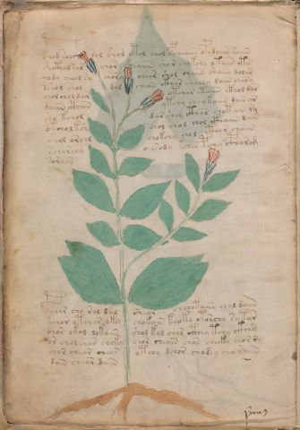

# Voynich Speculative Herbal Ferment Recipe — f8v

IMPORTANT: this is NOT a real or validated translation of the Voynich Manuscript. It is a speculative/procedural model that interprets EVA using a user-defined grammar to generate experimental recipes using safe, known edible substitutes.

This file is generated automatically from IVTFF/EVA transliteration plus a user-defined procedural grammar.



## Page / Folio
- currier: A
- folio: f8v
- page_number: 16
- section: herbal

## EVA Text (Transliteration)
```text
c@216;hod sooc@196;h sol shol otol chol opcheaiin opydaiin saiin
shcthal sar chor sheaiin shor chykchy otaiin cty
qody cheal sy chory chear shol chaiin shaiin dolas
dshol shol dol chean cthar shealy daiin chary
chol chol dar otchar etaiin cthol dar
daiin cthan ytchy chey kaiin dain ar
sho kchol dar shey cthar chotain ry
okcholksh chol chol chol cthaiin dain
shol orchl chokchy chol cthor chaiin
scharchy oeesody kchey pchy cpharom
sorain
pchar cho rol dal shear chchotaiin chal daiin
kchor otchar oky chokain keoky otorchy satar
shor okol lokaiin shol kol char cthey tchy ckham
or chol chan chcky chor cheain char cheeky chor ry
chor cheor chear oteey dchor chodey cho raiin
dain chear daiin
```

## Recipes Index (This Page)
- [f8v.1,@P0](#f8v-1-f8v-1-p0)
- [f8v.2,+P0](#f8v-2-f8v-2-p0)
- [f8v.3,+P0](#f8v-3-f8v-3-p0)
- [f8v.4,+P0](#f8v-4-f8v-4-p0)
- [f8v.5,+P0](#f8v-5-f8v-5-p0)
- [f8v.6,+P0](#f8v-6-f8v-6-p0)
- [f8v.7,+P0](#f8v-7-f8v-7-p0)
- [f8v.8,+P0](#f8v-8-f8v-8-p0)
- [f8v.9,+P0](#f8v-9-f8v-9-p0)
- [f8v.10,+P0](#f8v-10-f8v-10-p0)
- [f8v.11,+P0](#f8v-11-f8v-11-p0)
- [f8v.12,+P0](#f8v-12-f8v-12-p0)
- [f8v.13,+P0](#f8v-13-f8v-13-p0)
- [f8v.14,+P0](#f8v-14-f8v-14-p0)
- [f8v.15,+P0](#f8v-15-f8v-15-p0)
- [f8v.16,+P0](#f8v-16-f8v-16-p0)
- [f8v.17,+P0](#f8v-17-f8v-17-p0)

## Line Glosses (Procedural Gloss Only; Not a Translation)

<a id="f8v-1-f8v-1-p0"></a>

### f8v.1,@P0

EVA: c@216;hod sooc@196;h sol shol otol chol opcheaiin opydaiin saiin

Direct Gloss (Procedural, Not a Real Translation):
- c: [unparsed]
- hod: mix / transfer → start fermentation (yeast)
- sooc: mix / transfer
- h: [unparsed]
- sol: mix / transfer
- shol: add secondary herb (safe substitute) → mix / transfer
- otol: apply heat/cooking → mix / transfer
- chol: add main plant (safe substitute) → mix / transfer
- opcheaiin: add main plant (safe substitute) → mix / transfer → start fermentation (yeast) → duration level 1 → state: active extraction → long fermentation / aging phase
- opydaiin: mix / transfer → start fermentation (yeast) → duration level 1 → state: fermentation start → long fermentation / aging phase
- saiin: duration level 1 → state: fermentation start → long fermentation / aging phase

<a id="f8v-2-f8v-2-p0"></a>

### f8v.2,+P0

EVA: shcthal sar chor sheaiin shor chykchy otaiin cty

Direct Gloss (Procedural, Not a Real Translation):
- shcthal: add secondary herb (safe substitute) → add complex herbal compound (safe blend) → duration level 1 → state: fermentation start
- sar: duration level 1 → state: fermentation start
- chor: add main plant (safe substitute) → mix / transfer
- sheaiin: add secondary herb (safe substitute) → duration level 1 → state: active extraction → long fermentation / aging phase
- shor: add secondary herb (safe substitute) → mix / transfer
- chykchy: add fermentable sugars → add main plant (safe substitute)
- otaiin: apply heat/cooking → mix / transfer → duration level 1 → state: fermentation start → long fermentation / aging phase
- cty: apply heat/cooking

<a id="f8v-3-f8v-3-p0"></a>

### f8v.3,+P0

EVA: qody cheal sy chory chear shol chaiin shaiin dolas

Direct Gloss (Procedural, Not a Real Translation):
- qody: prepare liquid base → start fermentation (yeast)
- cheal: add main plant (safe substitute) → duration level 1 → state: active extraction
- sy: [unparsed]
- chory: add main plant (safe substitute) → mix / transfer
- chear: add main plant (safe substitute) → duration level 1 → state: active extraction
- shol: add secondary herb (safe substitute) → mix / transfer
- chaiin: add main plant (safe substitute) → duration level 1 → state: fermentation start → long fermentation / aging phase
- shaiin: add secondary herb (safe substitute) → duration level 1 → state: fermentation start → long fermentation / aging phase
- dolas: mix / transfer → start fermentation (yeast) → duration level 1 → state: fermentation start

<a id="f8v-4-f8v-4-p0"></a>

### f8v.4,+P0

EVA: dshol shol dol chean cthar shealy daiin chary

Direct Gloss (Procedural, Not a Real Translation):
- dshol: add secondary herb (safe substitute) → mix / transfer → start fermentation (yeast)
- shol: add secondary herb (safe substitute) → mix / transfer
- dol: mix / transfer → start fermentation (yeast)
- chean: add main plant (safe substitute) → duration level 1 → state: active extraction
- cthar: add complex herbal compound (safe blend) → duration level 1 → state: fermentation start
- shealy: add secondary herb (safe substitute) → duration level 1 → state: active extraction
- daiin: start fermentation (yeast) → duration level 1 → state: fermentation start → long fermentation / aging phase
- chary: add main plant (safe substitute) → duration level 1 → state: fermentation start

<a id="f8v-5-f8v-5-p0"></a>

### f8v.5,+P0

EVA: chol chol dar otchar etaiin cthol dar

Direct Gloss (Procedural, Not a Real Translation):
- chol: add main plant (safe substitute) → mix / transfer
- chol: add main plant (safe substitute) → mix / transfer
- dar: start fermentation (yeast) → duration level 1 → state: fermentation start
- otchar: apply heat/cooking → add main plant (safe substitute) → mix / transfer → duration level 1 → state: fermentation start
- etaiin: apply heat/cooking → duration level 1 → state: active extraction → long fermentation / aging phase
- cthol: mix / transfer → add complex herbal compound (safe blend)
- dar: start fermentation (yeast) → duration level 1 → state: fermentation start

<a id="f8v-6-f8v-6-p0"></a>

### f8v.6,+P0

EVA: daiin cthan ytchy chey kaiin dain ar

Direct Gloss (Procedural, Not a Real Translation):
- daiin: start fermentation (yeast) → duration level 1 → state: fermentation start → long fermentation / aging phase
- cthan: add complex herbal compound (safe blend) → duration level 1 → state: fermentation start
- ytchy: apply heat/cooking → add main plant (safe substitute)
- chey: add main plant (safe substitute) → duration level 1 → state: active extraction
- kaiin: add fermentable sugars → duration level 1 → state: fermentation start → long fermentation / aging phase
- dain: start fermentation (yeast) → duration level 1 → state: fermentation start
- ar: duration level 1 → state: fermentation start

<a id="f8v-7-f8v-7-p0"></a>

### f8v.7,+P0

EVA: sho kchol dar shey cthar chotain ry

Direct Gloss (Procedural, Not a Real Translation):
- sho: add secondary herb (safe substitute) → mix / transfer
- kchol: add fermentable sugars → add main plant (safe substitute) → mix / transfer
- dar: start fermentation (yeast) → duration level 1 → state: fermentation start
- shey: add secondary herb (safe substitute) → duration level 1 → state: active extraction
- cthar: add complex herbal compound (safe blend) → duration level 1 → state: fermentation start
- chotain: apply heat/cooking → add main plant (safe substitute) → mix / transfer → duration level 1 → state: fermentation start
- ry: [unparsed]

<a id="f8v-8-f8v-8-p0"></a>

### f8v.8,+P0

EVA: okcholksh chol chol chol cthaiin dain

Direct Gloss (Procedural, Not a Real Translation):
- okcholksh: add fermentable sugars → add main plant (safe substitute) → add secondary herb (safe substitute) → mix / transfer
- chol: add main plant (safe substitute) → mix / transfer
- chol: add main plant (safe substitute) → mix / transfer
- chol: add main plant (safe substitute) → mix / transfer
- cthaiin: add complex herbal compound (safe blend) → duration level 1 → state: fermentation start → long fermentation / aging phase
- dain: start fermentation (yeast) → duration level 1 → state: fermentation start

<a id="f8v-9-f8v-9-p0"></a>

### f8v.9,+P0

EVA: shol orchl chokchy chol cthor chaiin

Direct Gloss (Procedural, Not a Real Translation):
- shol: add secondary herb (safe substitute) → mix / transfer
- orchl: add main plant (safe substitute) → mix / transfer
- chokchy: add fermentable sugars → add main plant (safe substitute) → mix / transfer
- chol: add main plant (safe substitute) → mix / transfer
- cthor: mix / transfer → add complex herbal compound (safe blend)
- chaiin: add main plant (safe substitute) → duration level 1 → state: fermentation start → long fermentation / aging phase

<a id="f8v-10-f8v-10-p0"></a>

### f8v.10,+P0

EVA: scharchy oeesody kchey pchy cpharom

Direct Gloss (Procedural, Not a Real Translation):
- scharchy: add main plant (safe substitute) → duration level 1 → state: fermentation start
- oeesody: mix / transfer → start fermentation (yeast) → duration level 2 → state: active extraction
- kchey: add fermentable sugars → add main plant (safe substitute) → duration level 1 → state: active extraction
- pchy: add main plant (safe substitute) → start fermentation (yeast)
- cpharom: mix / transfer → add complex herbal compound (safe blend) → duration level 1 → state: fermentation start

<a id="f8v-11-f8v-11-p0"></a>

### f8v.11,+P0

EVA: sorain

Direct Gloss (Procedural, Not a Real Translation):
- sorain: mix / transfer → duration level 1 → state: fermentation start

<a id="f8v-12-f8v-12-p0"></a>

### f8v.12,+P0

EVA: pchar cho rol dal shear chchotaiin chal daiin

Direct Gloss (Procedural, Not a Real Translation):
- pchar: add main plant (safe substitute) → start fermentation (yeast) → duration level 1 → state: fermentation start
- cho: add main plant (safe substitute) → mix / transfer
- rol: mix / transfer
- dal: start fermentation (yeast) → duration level 1 → state: fermentation start
- shear: add secondary herb (safe substitute) → duration level 1 → state: active extraction
- chchotaiin: apply heat/cooking → add main plant (safe substitute) → mix / transfer → duration level 1 → state: fermentation start → long fermentation / aging phase
- chal: add main plant (safe substitute) → duration level 1 → state: fermentation start
- daiin: start fermentation (yeast) → duration level 1 → state: fermentation start → long fermentation / aging phase

<a id="f8v-13-f8v-13-p0"></a>

### f8v.13,+P0

EVA: kchor otchar oky chokain keoky otorchy satar

Direct Gloss (Procedural, Not a Real Translation):
- kchor: add fermentable sugars → add main plant (safe substitute) → mix / transfer
- otchar: apply heat/cooking → add main plant (safe substitute) → mix / transfer → duration level 1 → state: fermentation start
- oky: add fermentable sugars → mix / transfer
- chokain: add fermentable sugars → add main plant (safe substitute) → mix / transfer → duration level 1 → state: fermentation start
- keoky: add fermentable sugars → mix / transfer → duration level 1 → state: active extraction
- otorchy: apply heat/cooking → add main plant (safe substitute) → mix / transfer
- satar: apply heat/cooking → duration level 1 → state: fermentation start

<a id="f8v-14-f8v-14-p0"></a>

### f8v.14,+P0

EVA: shor okol lokaiin shol kol char cthey tchy ckham

Direct Gloss (Procedural, Not a Real Translation):
- shor: add secondary herb (safe substitute) → mix / transfer
- okol: add fermentable sugars → mix / transfer
- lokaiin: add fermentable sugars → mix / transfer → duration level 1 → state: fermentation start → long fermentation / aging phase
- shol: add secondary herb (safe substitute) → mix / transfer
- kol: add fermentable sugars → mix / transfer
- char: add main plant (safe substitute) → duration level 1 → state: fermentation start
- cthey: add complex herbal compound (safe blend) → duration level 1 → state: active extraction
- tchy: apply heat/cooking → add main plant (safe substitute)
- ckham: add complex herbal compound (safe blend) → duration level 1 → state: fermentation start

<a id="f8v-15-f8v-15-p0"></a>

### f8v.15,+P0

EVA: or chol chan chcky chor cheain char cheeky chor ry

Direct Gloss (Procedural, Not a Real Translation):
- or: mix / transfer
- chol: add main plant (safe substitute) → mix / transfer
- chan: add main plant (safe substitute) → duration level 1 → state: fermentation start
- chcky: add fermentable sugars → add main plant (safe substitute)
- chor: add main plant (safe substitute) → mix / transfer
- cheain: add main plant (safe substitute) → duration level 1 → state: active extraction
- char: add main plant (safe substitute) → duration level 1 → state: fermentation start
- cheeky: add fermentable sugars → add main plant (safe substitute) → duration level 2 → state: active extraction
- chor: add main plant (safe substitute) → mix / transfer
- ry: [unparsed]

<a id="f8v-16-f8v-16-p0"></a>

### f8v.16,+P0

EVA: chor cheor chear oteey dchor chodey cho raiin

Direct Gloss (Procedural, Not a Real Translation):
- chor: add main plant (safe substitute) → mix / transfer
- cheor: add main plant (safe substitute) → mix / transfer → duration level 1 → state: active extraction
- chear: add main plant (safe substitute) → duration level 1 → state: active extraction
- oteey: apply heat/cooking → mix / transfer → duration level 2 → state: active extraction
- dchor: add main plant (safe substitute) → mix / transfer → start fermentation (yeast)
- chodey: add main plant (safe substitute) → mix / transfer → start fermentation (yeast) → duration level 1 → state: active extraction
- cho: add main plant (safe substitute) → mix / transfer
- raiin: duration level 1 → state: fermentation start → long fermentation / aging phase

<a id="f8v-17-f8v-17-p0"></a>

### f8v.17,+P0

EVA: dain chear daiin

Direct Gloss (Procedural, Not a Real Translation):
- dain: start fermentation (yeast) → duration level 1 → state: fermentation start
- chear: add main plant (safe substitute) → duration level 1 → state: active extraction
- daiin: start fermentation (yeast) → duration level 1 → state: fermentation start → long fermentation / aging phase
