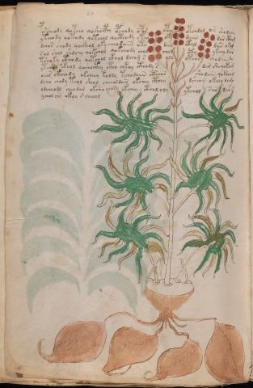

# Voynich Speculative Herbal Ferment Recipe — f93v

IMPORTANT: this is NOT a real or validated translation of the Voynich Manuscript. It is a speculative/procedural model that interprets EVA using a user-defined grammar to generate experimental recipes using safe, known edible substitutes.

This file is generated automatically from IVTFF/EVA transliteration plus a user-defined procedural grammar.



## Page / Folio
- currier: A
- folio: f93v
- page_number: 192
- plant_category_confidence: 0.0
- plant_category_guess: unknown
- section: herbal

## Plant Interpretation (Heuristic)
- category: unknown
- confidence: 0.0
- note: Heuristic classification based on the IVTFF 'Plant ID' string (not the drawing). Does not imply real identification of the manuscript plant.

## EVA Text (Transliteration)
```text
possheody qoteeo qoshocphy opchody opor opchy otchdal or shodaiin
yteeody qotody qotchol qocthody ytey oky daiin dar ctho[g:m]
dchos chody qockhol oky cheodaiin oty daiin otal dair okol
sol shol shdchy qokchol qokchody chol chol cty ykchy dar
tshoky cthody qotchol ckhol dchog s olo oteo[?:s] chodaiindy
ytch[?:o]l ckhol qochocthy ctho chkeey cthody s dar she[y:q]okam
oees ckheody qkcheey koldy tchodaiin ctheos shodain qokeeam
dcho chody teol sheol cheeoldair okchey cthey dsheog okeey dama
odeeeodl cheodar oksho chody okchey cthol oly ytchol sar dar
ychol chs ckhy s cheeol
```

## Page Summary (Procedural, Aggregated)
- compound_counts: {'yeast fermentation': 41, 'mix/transfer': 75, 'secondary herb': 11, 'liquid base': 11, 'heat': 16, 'complex herbal compound': 15, 'main herb': 32, 'sugars': 16, 'general base': 2}
- dose_level: 3
- fermentation_estimate: 7–14 days

## Pantry (Max Needed For Any Single Line-Recipe)
- main_plant_dry_g: 15
- main_plant_substitute: ['chamomile (safe default substitute)']
- safe_complex_herbal_blend: ['gentle spices (e.g., 1 g cinnamon + 1 g clove) or a commercial herbal tea blend']
- secondary_herb_dry_g: 7
- secondary_herb_substitute: ['mint']
- sugar_or_honey_g: 75
- water_l: 0.5
- yeast_g: 1

## Recipes Index (This Page)
- [f93v.1,@P0](#f93v-1-f93v-1-p0)
- [f93v.2,+P0](#f93v-2-f93v-2-p0)
- [f93v.3,+P0](#f93v-3-f93v-3-p0)
- [f93v.4,+P0](#f93v-4-f93v-4-p0)
- [f93v.5,+P0](#f93v-5-f93v-5-p0)
- [f93v.6,+P0](#f93v-6-f93v-6-p0)
- [f93v.7,+P0](#f93v-7-f93v-7-p0)
- [f93v.8,+P0](#f93v-8-f93v-8-p0)
- [f93v.9,+P0](#f93v-9-f93v-9-p0)
- [f93v.10,+P0](#f93v-10-f93v-10-p0)

## Line Recipes (Each Line = One Recipe, 0.5L batch)

<a id="f93v-1-f93v-1-p0"></a>

### f93v.1,@P0

EVA: possheody qoteeo qoshocphy opchody opor opchy otchdal or shodaiin

## Ingredients
- main_plant_dry_g: 10
- main_plant_substitute: chamomile (safe default substitute)
- safe_complex_herbal_blend: gentle spices (e.g., 1 g cinnamon + 1 g clove) or a commercial herbal tea blend
- secondary_herb_dry_g: 5
- secondary_herb_substitute: mint
- sugar_or_honey_g: 25
- water_l: 0.5
- yeast_g: 1

Process:
1. Sanitize the jar/fermenter and utensils.
2. Base: combine 0.5 L water with 25 g sugar or honey.
3. Apply gentle heat: simmer 10–15 min, then cool to <30°C before adding yeast.
4. Add main plant: chamomile (safe default substitute) (~10 g dried).
5. Add secondary herb: mint (~5 g dried).
6. If a complex herbal compound appears, use a safe commercial blend or gentle spices in micro-doses.
7. Pitch yeast: 1 g (ideally cider/beer yeast).
8. Ferment with an airlock: 7–14 days (guided by iin/aiin markers).
9. Strain/rack (if very solid-heavy) and cold-crash 24 h.
10. Bottle only when activity clearly slows; refrigerate. Avoid overpressure.

Expected Result: A mild, aromatic herbal ferment, low-to-medium intensity depending on dose level.

Does It Make Sense?: partial

Direct Gloss (Procedural, Not a Real Translation):
- possheody: add secondary herb (safe substitute) → mix / transfer → start fermentation (yeast) → duration level 1 → state: active extraction
- qoteeo: prepare liquid base → apply heat/cooking → mix / transfer → duration level 2 → state: active extraction
- qoshocphy: prepare liquid base → add secondary herb (safe substitute) → mix / transfer → add complex herbal compound (safe blend)
- opchody: add main plant (safe substitute) → mix / transfer → start fermentation (yeast)
- opor: mix / transfer → start fermentation (yeast)
- opchy: add main plant (safe substitute) → mix / transfer → start fermentation (yeast)
- otchdal: apply heat/cooking → add main plant (safe substitute) → mix / transfer → start fermentation (yeast) → duration level 1 → state: fermentation start
- or: mix / transfer
- shodaiin: add secondary herb (safe substitute) → mix / transfer → start fermentation (yeast) → duration level 1 → state: fermentation start → long fermentation / aging phase

<a id="f93v-2-f93v-2-p0"></a>

### f93v.2,+P0

EVA: yteeody qotody qotchol qocthody ytey oky daiin dar ctho[g:m]

## Ingredients
- main_plant_dry_g: 10
- main_plant_substitute: chamomile (safe default substitute)
- safe_complex_herbal_blend: gentle spices (e.g., 1 g cinnamon + 1 g clove) or a commercial herbal tea blend
- secondary_herb_dry_g: 2
- secondary_herb_substitute: mint
- sugar_or_honey_g: 50
- water_l: 0.5
- yeast_g: 1

Process:
1. Sanitize the jar/fermenter and utensils.
2. Base: combine 0.5 L water with 50 g sugar or honey.
3. Apply gentle heat: simmer 10–15 min, then cool to <30°C before adding yeast.
4. Add main plant: chamomile (safe default substitute) (~10 g dried).
5. Add secondary herb: mint (~2 g dried).
6. If a complex herbal compound appears, use a safe commercial blend or gentle spices in micro-doses.
7. Pitch yeast: 1 g (ideally cider/beer yeast).
8. Ferment with an airlock: 7–14 days (guided by iin/aiin markers).
9. Strain/rack (if very solid-heavy) and cold-crash 24 h.
10. Bottle only when activity clearly slows; refrigerate. Avoid overpressure.

Expected Result: A mild, aromatic herbal ferment, low-to-medium intensity depending on dose level.

Does It Make Sense?: partial

Direct Gloss (Procedural, Not a Real Translation):
- yteeody: apply heat/cooking → mix / transfer → start fermentation (yeast) → duration level 2 → state: active extraction
- qotody: prepare liquid base → apply heat/cooking → mix / transfer → start fermentation (yeast)
- qotchol: prepare liquid base → apply heat/cooking → add main plant (safe substitute) → mix / transfer
- qocthody: prepare liquid base → mix / transfer → start fermentation (yeast) → add complex herbal compound (safe blend)
- ytey: apply heat/cooking → duration level 1 → state: active extraction
- oky: add fermentable sugars → mix / transfer
- daiin: start fermentation (yeast) → duration level 1 → state: fermentation start → long fermentation / aging phase
- dar: start fermentation (yeast) → duration level 1 → state: fermentation start
- ctho: mix / transfer → add complex herbal compound (safe blend)
- g: [unparsed]
- m: [unparsed]

<a id="f93v-3-f93v-3-p0"></a>

### f93v.3,+P0

EVA: dchos chody qockhol oky cheodaiin oty daiin otal dair okol

## Ingredients
- main_plant_dry_g: 5
- main_plant_substitute: chamomile (safe default substitute)
- safe_complex_herbal_blend: gentle spices (e.g., 1 g cinnamon + 1 g clove) or a commercial herbal tea blend
- secondary_herb_dry_g: 1
- secondary_herb_substitute: mint
- sugar_or_honey_g: 25
- water_l: 0.5
- yeast_g: 1

Process:
1. Sanitize the jar/fermenter and utensils.
2. Base: combine 0.5 L water with 25 g sugar or honey.
3. Apply gentle heat: simmer 10–15 min, then cool to <30°C before adding yeast.
4. Add main plant: chamomile (safe default substitute) (~5 g dried).
5. Add secondary herb: mint (~1 g dried).
6. If a complex herbal compound appears, use a safe commercial blend or gentle spices in micro-doses.
7. Pitch yeast: 1 g (ideally cider/beer yeast).
8. Ferment with an airlock: 7–14 days (guided by iin/aiin markers).
9. Strain/rack (if very solid-heavy) and cold-crash 24 h.
10. Bottle only when activity clearly slows; refrigerate. Avoid overpressure.

Expected Result: A mild, aromatic herbal ferment, low-to-medium intensity depending on dose level.

Does It Make Sense?: partial

Direct Gloss (Procedural, Not a Real Translation):
- dchos: add main plant (safe substitute) → mix / transfer → start fermentation (yeast)
- chody: add main plant (safe substitute) → mix / transfer → start fermentation (yeast)
- qockhol: prepare liquid base → mix / transfer → add complex herbal compound (safe blend)
- oky: add fermentable sugars → mix / transfer
- cheodaiin: add main plant (safe substitute) → mix / transfer → start fermentation (yeast) → duration level 1 → state: active extraction → long fermentation / aging phase
- oty: apply heat/cooking → mix / transfer
- daiin: start fermentation (yeast) → duration level 1 → state: fermentation start → long fermentation / aging phase
- otal: apply heat/cooking → mix / transfer → duration level 1 → state: fermentation start
- dair: start fermentation (yeast) → duration level 1 → state: fermentation start
- okol: add fermentable sugars → mix / transfer

<a id="f93v-4-f93v-4-p0"></a>

### f93v.4,+P0

EVA: sol shol shdchy qokchol qokchody chol chol cty ykchy dar

## Ingredients
- main_plant_dry_g: 5
- main_plant_substitute: chamomile (safe default substitute)
- secondary_herb_dry_g: 2
- secondary_herb_substitute: mint
- sugar_or_honey_g: 25
- water_l: 0.5
- yeast_g: 1

Process:
1. Sanitize the jar/fermenter and utensils.
2. Base: combine 0.5 L water with 25 g sugar or honey.
3. Apply gentle heat: simmer 10–15 min, then cool to <30°C before adding yeast.
4. Add main plant: chamomile (safe default substitute) (~5 g dried).
5. Add secondary herb: mint (~2 g dried).
6. Pitch yeast: 1 g (ideally cider/beer yeast).
7. Ferment with an airlock: 2–4 days (guided by iin/aiin markers).
8. Strain/rack (if very solid-heavy) and cold-crash 24 h.
9. Bottle only when activity clearly slows; refrigerate. Avoid overpressure.

Expected Result: A mild, aromatic herbal ferment, low-to-medium intensity depending on dose level.

Does It Make Sense?: partial

Direct Gloss (Procedural, Not a Real Translation):
- sol: mix / transfer
- shol: add secondary herb (safe substitute) → mix / transfer
- shdchy: add main plant (safe substitute) → add secondary herb (safe substitute) → start fermentation (yeast)
- qokchol: prepare liquid base → add fermentable sugars → add main plant (safe substitute) → mix / transfer
- qokchody: prepare liquid base → add fermentable sugars → add main plant (safe substitute) → mix / transfer → start fermentation (yeast)
- chol: add main plant (safe substitute) → mix / transfer
- chol: add main plant (safe substitute) → mix / transfer
- cty: apply heat/cooking
- ykchy: add fermentable sugars → add main plant (safe substitute)
- dar: start fermentation (yeast) → duration level 1 → state: fermentation start

<a id="f93v-5-f93v-5-p0"></a>

### f93v.5,+P0

EVA: tshoky cthody qotchol ckhol dchog s olo oteo[?:s] chodaiindy

## Ingredients
- main_plant_dry_g: 5
- main_plant_substitute: chamomile (safe default substitute)
- safe_complex_herbal_blend: gentle spices (e.g., 1 g cinnamon + 1 g clove) or a commercial herbal tea blend
- secondary_herb_dry_g: 2
- secondary_herb_substitute: mint
- sugar_or_honey_g: 25
- water_l: 0.5
- yeast_g: 1

Process:
1. Sanitize the jar/fermenter and utensils.
2. Base: combine 0.5 L water with 25 g sugar or honey.
3. Apply gentle heat: simmer 10–15 min, then cool to <30°C before adding yeast.
4. Add main plant: chamomile (safe default substitute) (~5 g dried).
5. Add secondary herb: mint (~2 g dried).
6. If a complex herbal compound appears, use a safe commercial blend or gentle spices in micro-doses.
7. Pitch yeast: 1 g (ideally cider/beer yeast).
8. Ferment with an airlock: 7–14 days (guided by iin/aiin markers).
9. Strain/rack (if very solid-heavy) and cold-crash 24 h.
10. Bottle only when activity clearly slows; refrigerate. Avoid overpressure.

Expected Result: A mild, aromatic herbal ferment, low-to-medium intensity depending on dose level.

Does It Make Sense?: partial

Direct Gloss (Procedural, Not a Real Translation):
- tshoky: add fermentable sugars → apply heat/cooking → add secondary herb (safe substitute) → mix / transfer
- cthody: mix / transfer → start fermentation (yeast) → add complex herbal compound (safe blend)
- qotchol: prepare liquid base → apply heat/cooking → add main plant (safe substitute) → mix / transfer
- ckhol: mix / transfer → add complex herbal compound (safe blend)
- dchog: add main plant (safe substitute) → mix / transfer → start fermentation (yeast)
- s: [unparsed]
- olo: mix / transfer
- oteo: apply heat/cooking → mix / transfer → duration level 1 → state: active extraction
- s: [unparsed]
- chodaiindy: add main plant (safe substitute) → mix / transfer → start fermentation (yeast) → duration level 1 → state: fermentation start → long fermentation / aging phase

<a id="f93v-6-f93v-6-p0"></a>

### f93v.6,+P0

EVA: ytch[?:o]l ckhol qochocthy ctho chkeey cthody s dar she[y:q]okam

## Ingredients
- main_plant_dry_g: 10
- main_plant_substitute: chamomile (safe default substitute)
- safe_complex_herbal_blend: gentle spices (e.g., 1 g cinnamon + 1 g clove) or a commercial herbal tea blend
- secondary_herb_dry_g: 5
- secondary_herb_substitute: mint
- sugar_or_honey_g: 50
- water_l: 0.5
- yeast_g: 1

Process:
1. Sanitize the jar/fermenter and utensils.
2. Base: combine 0.5 L water with 50 g sugar or honey.
3. Apply gentle heat: simmer 10–15 min, then cool to <30°C before adding yeast.
4. Add main plant: chamomile (safe default substitute) (~10 g dried).
5. Add secondary herb: mint (~5 g dried).
6. If a complex herbal compound appears, use a safe commercial blend or gentle spices in micro-doses.
7. Pitch yeast: 1 g (ideally cider/beer yeast).
8. Ferment with an airlock: 2–4 days (guided by iin/aiin markers).
9. Strain/rack (if very solid-heavy) and cold-crash 24 h.
10. Bottle only when activity clearly slows; refrigerate. Avoid overpressure.

Expected Result: A mild, aromatic herbal ferment, low-to-medium intensity depending on dose level.

Does It Make Sense?: partial

Direct Gloss (Procedural, Not a Real Translation):
- ytch: apply heat/cooking → add main plant (safe substitute)
- o: mix / transfer
- l: [unparsed]
- ckhol: mix / transfer → add complex herbal compound (safe blend)
- qochocthy: prepare liquid base → add main plant (safe substitute) → mix / transfer → add complex herbal compound (safe blend)
- ctho: mix / transfer → add complex herbal compound (safe blend)
- chkeey: add fermentable sugars → add main plant (safe substitute) → duration level 2 → state: active extraction
- cthody: mix / transfer → start fermentation (yeast) → add complex herbal compound (safe blend)
- s: [unparsed]
- dar: start fermentation (yeast) → duration level 1 → state: fermentation start
- she: add secondary herb (safe substitute) → duration level 1 → state: active extraction
- y: [unparsed]
- q: prepare base (generic)
- okam: add fermentable sugars → mix / transfer → duration level 1 → state: fermentation start

<a id="f93v-7-f93v-7-p0"></a>

### f93v.7,+P0

EVA: oees ckheody qkcheey koldy tchodaiin ctheos shodain qokeeam

## Ingredients
- main_plant_dry_g: 10
- main_plant_substitute: chamomile (safe default substitute)
- safe_complex_herbal_blend: gentle spices (e.g., 1 g cinnamon + 1 g clove) or a commercial herbal tea blend
- secondary_herb_dry_g: 5
- secondary_herb_substitute: mint
- sugar_or_honey_g: 50
- water_l: 0.5
- yeast_g: 1

Process:
1. Sanitize the jar/fermenter and utensils.
2. Base: combine 0.5 L water with 50 g sugar or honey.
3. Apply gentle heat: simmer 10–15 min, then cool to <30°C before adding yeast.
4. Add main plant: chamomile (safe default substitute) (~10 g dried).
5. Add secondary herb: mint (~5 g dried).
6. If a complex herbal compound appears, use a safe commercial blend or gentle spices in micro-doses.
7. Pitch yeast: 1 g (ideally cider/beer yeast).
8. Ferment with an airlock: 7–14 days (guided by iin/aiin markers).
9. Strain/rack (if very solid-heavy) and cold-crash 24 h.
10. Bottle only when activity clearly slows; refrigerate. Avoid overpressure.

Expected Result: A mild, aromatic herbal ferment, low-to-medium intensity depending on dose level.

Does It Make Sense?: partial

Direct Gloss (Procedural, Not a Real Translation):
- oees: mix / transfer → duration level 2 → state: active extraction
- ckheody: mix / transfer → start fermentation (yeast) → add complex herbal compound (safe blend) → duration level 1 → state: active extraction
- qkcheey: prepare base (generic) → add fermentable sugars → add main plant (safe substitute) → duration level 2 → state: active extraction
- koldy: add fermentable sugars → mix / transfer → start fermentation (yeast)
- tchodaiin: apply heat/cooking → add main plant (safe substitute) → mix / transfer → start fermentation (yeast) → duration level 1 → state: fermentation start → long fermentation / aging phase
- ctheos: mix / transfer → add complex herbal compound (safe blend) → duration level 1 → state: active extraction
- shodain: add secondary herb (safe substitute) → mix / transfer → start fermentation (yeast) → duration level 1 → state: fermentation start
- qokeeam: prepare liquid base → add fermentable sugars → duration level 2 → state: active extraction

<a id="f93v-8-f93v-8-p0"></a>

### f93v.8,+P0

EVA: dcho chody teol sheol cheeoldair okchey cthey dsheog okeey dama

## Ingredients
- main_plant_dry_g: 10
- main_plant_substitute: chamomile (safe default substitute)
- safe_complex_herbal_blend: gentle spices (e.g., 1 g cinnamon + 1 g clove) or a commercial herbal tea blend
- secondary_herb_dry_g: 5
- secondary_herb_substitute: mint
- sugar_or_honey_g: 50
- water_l: 0.5
- yeast_g: 1

Process:
1. Sanitize the jar/fermenter and utensils.
2. Base: combine 0.5 L water with 50 g sugar or honey.
3. Apply gentle heat: simmer 10–15 min, then cool to <30°C before adding yeast.
4. Add main plant: chamomile (safe default substitute) (~10 g dried).
5. Add secondary herb: mint (~5 g dried).
6. If a complex herbal compound appears, use a safe commercial blend or gentle spices in micro-doses.
7. Pitch yeast: 1 g (ideally cider/beer yeast).
8. Ferment with an airlock: 2–4 days (guided by iin/aiin markers).
9. Strain/rack (if very solid-heavy) and cold-crash 24 h.
10. Bottle only when activity clearly slows; refrigerate. Avoid overpressure.

Expected Result: A mild, aromatic herbal ferment, low-to-medium intensity depending on dose level.

Does It Make Sense?: partial

Direct Gloss (Procedural, Not a Real Translation):
- dcho: add main plant (safe substitute) → mix / transfer → start fermentation (yeast)
- chody: add main plant (safe substitute) → mix / transfer → start fermentation (yeast)
- teol: apply heat/cooking → mix / transfer → duration level 1 → state: active extraction
- sheol: add secondary herb (safe substitute) → mix / transfer → duration level 1 → state: active extraction
- cheeoldair: add main plant (safe substitute) → mix / transfer → start fermentation (yeast) → duration level 2 → state: active extraction
- okchey: add fermentable sugars → add main plant (safe substitute) → mix / transfer → duration level 1 → state: active extraction
- cthey: add complex herbal compound (safe blend) → duration level 1 → state: active extraction
- dsheog: add secondary herb (safe substitute) → mix / transfer → start fermentation (yeast) → duration level 1 → state: active extraction
- okeey: add fermentable sugars → mix / transfer → duration level 2 → state: active extraction
- dama: start fermentation (yeast) → duration level 1 → state: fermentation start

<a id="f93v-9-f93v-9-p0"></a>

### f93v.9,+P0

EVA: odeeeodl cheodar oksho chody okchey cthol oly ytchol sar dar

## Ingredients
- main_plant_dry_g: 15
- main_plant_substitute: chamomile (safe default substitute)
- safe_complex_herbal_blend: gentle spices (e.g., 1 g cinnamon + 1 g clove) or a commercial herbal tea blend
- secondary_herb_dry_g: 7
- secondary_herb_substitute: mint
- sugar_or_honey_g: 75
- water_l: 0.5
- yeast_g: 1

Process:
1. Sanitize the jar/fermenter and utensils.
2. Base: combine 0.5 L water with 75 g sugar or honey.
3. Apply gentle heat: simmer 10–15 min, then cool to <30°C before adding yeast.
4. Add main plant: chamomile (safe default substitute) (~15 g dried).
5. Add secondary herb: mint (~7 g dried).
6. If a complex herbal compound appears, use a safe commercial blend or gentle spices in micro-doses.
7. Pitch yeast: 1 g (ideally cider/beer yeast).
8. Ferment with an airlock: 2–4 days (guided by iin/aiin markers).
9. Strain/rack (if very solid-heavy) and cold-crash 24 h.
10. Bottle only when activity clearly slows; refrigerate. Avoid overpressure.

Expected Result: A mild, aromatic herbal ferment, low-to-medium intensity depending on dose level.

Does It Make Sense?: partial

Direct Gloss (Procedural, Not a Real Translation):
- odeeeodl: mix / transfer → start fermentation (yeast) → duration level 3 → state: active extraction
- cheodar: add main plant (safe substitute) → mix / transfer → start fermentation (yeast) → duration level 1 → state: active extraction
- oksho: add fermentable sugars → add secondary herb (safe substitute) → mix / transfer
- chody: add main plant (safe substitute) → mix / transfer → start fermentation (yeast)
- okchey: add fermentable sugars → add main plant (safe substitute) → mix / transfer → duration level 1 → state: active extraction
- cthol: mix / transfer → add complex herbal compound (safe blend)
- oly: mix / transfer
- ytchol: apply heat/cooking → add main plant (safe substitute) → mix / transfer
- sar: duration level 1 → state: fermentation start
- dar: start fermentation (yeast) → duration level 1 → state: fermentation start

<a id="f93v-10-f93v-10-p0"></a>

### f93v.10,+P0

EVA: ychol chs ckhy s cheeol

## Ingredients
- main_plant_dry_g: 10
- main_plant_substitute: chamomile (safe default substitute)
- safe_complex_herbal_blend: gentle spices (e.g., 1 g cinnamon + 1 g clove) or a commercial herbal tea blend
- secondary_herb_dry_g: 2
- secondary_herb_substitute: mint
- sugar_or_honey_g: 25
- water_l: 0.5
- yeast_g: 1

Process:
1. Sanitize the jar/fermenter and utensils.
2. Base: combine 0.5 L water with 25 g sugar or honey.
3. Infusion: use hot (not boiling) water, then let it cool before adding yeast.
4. Add main plant: chamomile (safe default substitute) (~10 g dried).
5. Add secondary herb: mint (~2 g dried).
6. If a complex herbal compound appears, use a safe commercial blend or gentle spices in micro-doses.
7. Pitch yeast: 1 g (ideally cider/beer yeast).
8. Ferment with an airlock: 2–4 days (guided by iin/aiin markers).
9. Strain/rack (if very solid-heavy) and cold-crash 24 h.
10. Bottle only when activity clearly slows; refrigerate. Avoid overpressure.

Expected Result: A mild, aromatic herbal ferment, low-to-medium intensity depending on dose level.

Does It Make Sense?: partial

Direct Gloss (Procedural, Not a Real Translation):
- ychol: add main plant (safe substitute) → mix / transfer
- chs: add main plant (safe substitute)
- ckhy: add complex herbal compound (safe blend)
- s: [unparsed]
- cheeol: add main plant (safe substitute) → mix / transfer → duration level 2 → state: active extraction

## Risks & Warnings (Applies To All Line-Recipes)
- Never use unidentified Voynich plants directly; only use known edible substitutes.
- Do not consume if you see mold, smell rot, notice abnormal sliminess, or taste something clearly foul.
- Overpressure/bottle-bomb risk: do not bottle before stable; prefer an airlock and refrigeration.
- Avoid if pregnant/breastfeeding, for minors, or with medical conditions; consult a professional.
- No medical claims: this is an experimental beverage.

## Recommended Adjustments (General)
- If too bitter (leafy profile), halve the herbs or shorten steep/maceration time.
- If too sweet, extend fermentation or reduce sugar by 25–50%.
- For a non-alcoholic version, omit yeast and keep refrigerated as an infusion (not fermented).
