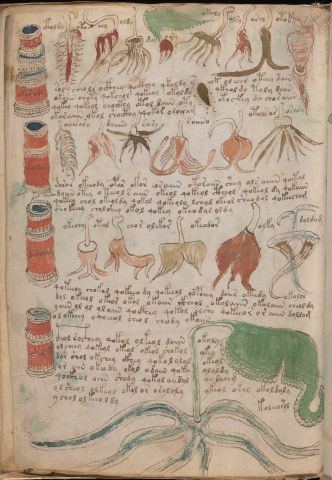

# Voynich Speculative Herbal Ferment Recipe — f99v

IMPORTANT: this is NOT a real or validated translation of the Voynich Manuscript. It is a speculative/procedural model that interprets EVA using a user-defined grammar to generate experimental recipes using safe, known edible substitutes.

This file is generated automatically from IVTFF/EVA transliteration plus a user-defined procedural grammar.



## Page / Folio
- currier: A
- folio: f99v
- page_number: 202

## EVA Text (Transliteration)
```text
okaramy
otoldy
otor chy
oldy
dar ary
otaly
olsy
arol
otoky
sol cheols ockhey qockhhy qkoldy s ok oleees oteey dain
okoiin choty qokchol qokeol okoldy qkholdy toly daiin
qokeo qokeol chockhy otol daiin oty otockey da chor aiin
okoraiin okol shocthy qokor oloiram
okoldody
oeeesary
daiiinc
sary
saiino
otolsar
osary
doror okeeody opar okor eosaiin otoraiin shey ols aiiin qoetal
doiin otey o keeol s aiin okeol qokeol ctheol qokeol dy qokaiin
qokeey chol okeoldy qokol qokeolo lchol okeol sheodol qokeechom
shokeeey cholshey okol qokey okeodal oldy
darolaly
okechy
otal
chor olekor
okeodor
olky
doldam
qokeeoy chokol qokeeo dy qokeeol olpchey daiir okeedy okolol
dol okeeol okeor okal okaiin ckheol okolaiin okolaiin cheoldy
yoiin ol ol olaiin qockhey qokol olshy qokeeor or aiin doldam
ol okeeey oqoeeol cheol chody okoiin
oralas
c@132;eol soc@133;hey qokol olkeol daiin okoly
ol cheey qokeol okeol okeol shokol ykey
dar shol okchey ckhey qokololal okeol
or aiin okeody okol odaiin qoky olaldy
qockhol oiin shody qokol aiidal aiidaiim
ol sheol olkeol okol or oraloly ykeol okal okaldaly
ychol olkeeoldy
koleearol
```

## Recipes Index (This Page)
- [f99v.1,@Lc](#f99v-1-f99v-1-lc)
- [f99v.2,@Lf](#f99v-2-f99v-2-lf)
- [f99v.3,@Lf](#f99v-3-f99v-3-lf)
- [f99v.4,@Lf](#f99v-4-f99v-4-lf)
- [f99v.5,@Lf](#f99v-5-f99v-5-lf)
- [f99v.6,@Lf](#f99v-6-f99v-6-lf)
- [f99v.7,@Lf](#f99v-7-f99v-7-lf)
- [f99v.8,@Lf](#f99v-8-f99v-8-lf)
- [f99v.9,@Lf](#f99v-9-f99v-9-lf)
- [f99v.10,@P0](#f99v-10-f99v-10-p0)
- [f99v.11,+P0](#f99v-11-f99v-11-p0)
- [f99v.12,+P0](#f99v-12-f99v-12-p0)
- [f99v.13,+P0](#f99v-13-f99v-13-p0)
- [f99v.14,@Lc](#f99v-14-f99v-14-lc)
- [f99v.15,@Lf](#f99v-15-f99v-15-lf)
- [f99v.16,@Lf](#f99v-16-f99v-16-lf)
- [f99v.17,@Lf](#f99v-17-f99v-17-lf)
- [f99v.18,@Lf](#f99v-18-f99v-18-lf)
- [f99v.19,@Lf](#f99v-19-f99v-19-lf)
- [f99v.20,@Lf](#f99v-20-f99v-20-lf)
- [f99v.21,@P0](#f99v-21-f99v-21-p0)
- [f99v.22,+P0](#f99v-22-f99v-22-p0)
- [f99v.23,+P0](#f99v-23-f99v-23-p0)
- [f99v.24,+P0](#f99v-24-f99v-24-p0)
- [f99v.25,@Lc](#f99v-25-f99v-25-lc)
- [f99v.26,@Lf](#f99v-26-f99v-26-lf)
- [f99v.27,@Lf](#f99v-27-f99v-27-lf)
- [f99v.28,@Lf](#f99v-28-f99v-28-lf)
- [f99v.29,@Lf](#f99v-29-f99v-29-lf)
- [f99v.30,@Lf](#f99v-30-f99v-30-lf)
- [f99v.31,@Lf](#f99v-31-f99v-31-lf)
- [f99v.32,@P0](#f99v-32-f99v-32-p0)
- [f99v.33,+P0](#f99v-33-f99v-33-p0)
- [f99v.34,+P0](#f99v-34-f99v-34-p0)
- [f99v.35,+P0](#f99v-35-f99v-35-p0)
- [f99v.36,@Lc](#f99v-36-f99v-36-lc)
- [f99v.37,@P0](#f99v-37-f99v-37-p0)
- [f99v.38,+P0](#f99v-38-f99v-38-p0)
- [f99v.39,+P0](#f99v-39-f99v-39-p0)
- [f99v.40,+P0](#f99v-40-f99v-40-p0)
- [f99v.41,+P0](#f99v-41-f99v-41-p0)
- [f99v.42,+P0](#f99v-42-f99v-42-p0)
- [f99v.43,+P0](#f99v-43-f99v-43-p0)
- [f99v.44,@Lf](#f99v-44-f99v-44-lf)

## Line Glosses (Procedural Gloss Only; Not a Translation)

<a id="f99v-1-f99v-1-lc"></a>

### f99v.1,@Lc

EVA: okaramy

Direct Gloss (Procedural, Not a Real Translation):
- okaramy: add fermentable sugars → mix / transfer → duration level 1 → state: fermentation start

<a id="f99v-2-f99v-2-lf"></a>

### f99v.2,@Lf

EVA: otoldy

Direct Gloss (Procedural, Not a Real Translation):
- otoldy: apply heat/cooking → mix / transfer → start fermentation (yeast)

<a id="f99v-3-f99v-3-lf"></a>

### f99v.3,@Lf

EVA: otor chy

Direct Gloss (Procedural, Not a Real Translation):
- otor: apply heat/cooking → mix / transfer
- chy: add main plant (safe substitute)

<a id="f99v-4-f99v-4-lf"></a>

### f99v.4,@Lf

EVA: oldy

Direct Gloss (Procedural, Not a Real Translation):
- oldy: mix / transfer → start fermentation (yeast)

<a id="f99v-5-f99v-5-lf"></a>

### f99v.5,@Lf

EVA: dar ary

Direct Gloss (Procedural, Not a Real Translation):
- dar: start fermentation (yeast) → duration level 1 → state: fermentation start
- ary: duration level 1 → state: fermentation start

<a id="f99v-6-f99v-6-lf"></a>

### f99v.6,@Lf

EVA: otaly

Direct Gloss (Procedural, Not a Real Translation):
- otaly: apply heat/cooking → mix / transfer → duration level 1 → state: fermentation start

<a id="f99v-7-f99v-7-lf"></a>

### f99v.7,@Lf

EVA: olsy

Direct Gloss (Procedural, Not a Real Translation):
- olsy: mix / transfer

<a id="f99v-8-f99v-8-lf"></a>

### f99v.8,@Lf

EVA: arol

Direct Gloss (Procedural, Not a Real Translation):
- arol: mix / transfer → duration level 1 → state: fermentation start

<a id="f99v-9-f99v-9-lf"></a>

### f99v.9,@Lf

EVA: otoky

Direct Gloss (Procedural, Not a Real Translation):
- otoky: add fermentable sugars → apply heat/cooking → mix / transfer

<a id="f99v-10-f99v-10-p0"></a>

### f99v.10,@P0

EVA: sol cheols ockhey qockhhy qkoldy s ok oleees oteey dain

Direct Gloss (Procedural, Not a Real Translation):
- sol: mix / transfer
- cheols: add main plant (safe substitute) → mix / transfer → duration level 1 → state: active extraction
- ockhey: mix / transfer → add complex herbal compound (safe blend) → duration level 1 → state: active extraction
- qockhhy: prepare liquid base → add complex herbal compound (safe blend)
- qkoldy: prepare base (generic) → add fermentable sugars → mix / transfer → start fermentation (yeast)
- s: [unparsed]
- ok: add fermentable sugars → mix / transfer
- oleees: mix / transfer → duration level 3 → state: active extraction
- oteey: apply heat/cooking → mix / transfer → duration level 2 → state: active extraction
- dain: start fermentation (yeast) → duration level 1 → state: fermentation start

<a id="f99v-11-f99v-11-p0"></a>

### f99v.11,+P0

EVA: okoiin choty qokchol qokeol okoldy qkholdy toly daiin

Direct Gloss (Procedural, Not a Real Translation):
- okoiin: add fermentable sugars → mix / transfer → duration level 2 → state: cooling/rest → medium fermentation phase
- choty: apply heat/cooking → add main plant (safe substitute) → mix / transfer
- qokchol: prepare liquid base → add fermentable sugars → add main plant (safe substitute) → mix / transfer
- qokeol: prepare liquid base → add fermentable sugars → mix / transfer → duration level 1 → state: active extraction
- okoldy: add fermentable sugars → mix / transfer → start fermentation (yeast)
- qkholdy: prepare base (generic) → add fermentable sugars → mix / transfer → start fermentation (yeast)
- toly: apply heat/cooking → mix / transfer
- daiin: start fermentation (yeast) → duration level 1 → state: fermentation start → long fermentation / aging phase

<a id="f99v-12-f99v-12-p0"></a>

### f99v.12,+P0

EVA: qokeo qokeol chockhy otol daiin oty otockey da chor aiin

Direct Gloss (Procedural, Not a Real Translation):
- qokeo: prepare liquid base → add fermentable sugars → mix / transfer → duration level 1 → state: active extraction
- qokeol: prepare liquid base → add fermentable sugars → mix / transfer → duration level 1 → state: active extraction
- chockhy: add main plant (safe substitute) → mix / transfer → add complex herbal compound (safe blend)
- otol: apply heat/cooking → mix / transfer
- daiin: start fermentation (yeast) → duration level 1 → state: fermentation start → long fermentation / aging phase
- oty: apply heat/cooking → mix / transfer
- otockey: add fermentable sugars → apply heat/cooking → mix / transfer → duration level 1 → state: active extraction
- da: start fermentation (yeast) → duration level 1 → state: fermentation start
- chor: add main plant (safe substitute) → mix / transfer
- aiin: duration level 1 → state: fermentation start → long fermentation / aging phase

<a id="f99v-13-f99v-13-p0"></a>

### f99v.13,+P0

EVA: okoraiin okol shocthy qokor oloiram

Direct Gloss (Procedural, Not a Real Translation):
- okoraiin: add fermentable sugars → mix / transfer → duration level 1 → state: fermentation start → long fermentation / aging phase
- okol: add fermentable sugars → mix / transfer
- shocthy: add secondary herb (safe substitute) → mix / transfer → add complex herbal compound (safe blend)
- qokor: prepare liquid base → add fermentable sugars → mix / transfer
- oloiram: mix / transfer → duration level 1 → state: cooling/rest

<a id="f99v-14-f99v-14-lc"></a>

### f99v.14,@Lc

EVA: okoldody

Direct Gloss (Procedural, Not a Real Translation):
- okoldody: add fermentable sugars → mix / transfer → start fermentation (yeast)

<a id="f99v-15-f99v-15-lf"></a>

### f99v.15,@Lf

EVA: oeeesary

Direct Gloss (Procedural, Not a Real Translation):
- oeeesary: mix / transfer → duration level 3 → state: active extraction

<a id="f99v-16-f99v-16-lf"></a>

### f99v.16,@Lf

EVA: daiiinc

Direct Gloss (Procedural, Not a Real Translation):
- daiiinc: start fermentation (yeast) → duration level 1 → state: fermentation start → medium fermentation phase

<a id="f99v-17-f99v-17-lf"></a>

### f99v.17,@Lf

EVA: sary

Direct Gloss (Procedural, Not a Real Translation):
- sary: duration level 1 → state: fermentation start

<a id="f99v-18-f99v-18-lf"></a>

### f99v.18,@Lf

EVA: saiino

Direct Gloss (Procedural, Not a Real Translation):
- saiino: mix / transfer → duration level 1 → state: fermentation start → long fermentation / aging phase

<a id="f99v-19-f99v-19-lf"></a>

### f99v.19,@Lf

EVA: otolsar

Direct Gloss (Procedural, Not a Real Translation):
- otolsar: apply heat/cooking → mix / transfer → duration level 1 → state: fermentation start

<a id="f99v-20-f99v-20-lf"></a>

### f99v.20,@Lf

EVA: osary

Direct Gloss (Procedural, Not a Real Translation):
- osary: mix / transfer → duration level 1 → state: fermentation start

<a id="f99v-21-f99v-21-p0"></a>

### f99v.21,@P0

EVA: doror okeeody opar okor eosaiin otoraiin shey ols aiiin qoetal

Direct Gloss (Procedural, Not a Real Translation):
- doror: mix / transfer → start fermentation (yeast)
- okeeody: add fermentable sugars → mix / transfer → start fermentation (yeast) → duration level 2 → state: active extraction
- opar: mix / transfer → start fermentation (yeast) → duration level 1 → state: fermentation start
- okor: add fermentable sugars → mix / transfer
- eosaiin: mix / transfer → duration level 1 → state: active extraction → long fermentation / aging phase
- otoraiin: apply heat/cooking → mix / transfer → duration level 1 → state: fermentation start → long fermentation / aging phase
- shey: add secondary herb (safe substitute) → duration level 1 → state: active extraction
- ols: mix / transfer
- aiiin: duration level 1 → state: fermentation start → medium fermentation phase
- qoetal: prepare liquid base → apply heat/cooking → duration level 1 → state: active extraction

<a id="f99v-22-f99v-22-p0"></a>

### f99v.22,+P0

EVA: doiin otey o keeol s aiin okeol qokeol ctheol qokeol dy qokaiin

Direct Gloss (Procedural, Not a Real Translation):
- doiin: mix / transfer → start fermentation (yeast) → duration level 2 → state: cooling/rest → medium fermentation phase
- otey: apply heat/cooking → mix / transfer → duration level 1 → state: active extraction
- o: mix / transfer
- keeol: add fermentable sugars → mix / transfer → duration level 2 → state: active extraction
- s: [unparsed]
- aiin: duration level 1 → state: fermentation start → long fermentation / aging phase
- okeol: add fermentable sugars → mix / transfer → duration level 1 → state: active extraction
- qokeol: prepare liquid base → add fermentable sugars → mix / transfer → duration level 1 → state: active extraction
- ctheol: mix / transfer → add complex herbal compound (safe blend) → duration level 1 → state: active extraction
- qokeol: prepare liquid base → add fermentable sugars → mix / transfer → duration level 1 → state: active extraction
- dy: start fermentation (yeast)
- qokaiin: prepare liquid base → add fermentable sugars → duration level 1 → state: fermentation start → long fermentation / aging phase

<a id="f99v-23-f99v-23-p0"></a>

### f99v.23,+P0

EVA: qokeey chol okeoldy qokol qokeolo lchol okeol sheodol qokeechom

Direct Gloss (Procedural, Not a Real Translation):
- qokeey: prepare liquid base → add fermentable sugars → duration level 2 → state: active extraction
- chol: add main plant (safe substitute) → mix / transfer
- okeoldy: add fermentable sugars → mix / transfer → start fermentation (yeast) → duration level 1 → state: active extraction
- qokol: prepare liquid base → add fermentable sugars → mix / transfer
- qokeolo: prepare liquid base → add fermentable sugars → mix / transfer → duration level 1 → state: active extraction
- lchol: add main plant (safe substitute) → mix / transfer
- okeol: add fermentable sugars → mix / transfer → duration level 1 → state: active extraction
- sheodol: add secondary herb (safe substitute) → mix / transfer → start fermentation (yeast) → duration level 1 → state: active extraction
- qokeechom: prepare liquid base → add fermentable sugars → add main plant (safe substitute) → mix / transfer → duration level 2 → state: active extraction

<a id="f99v-24-f99v-24-p0"></a>

### f99v.24,+P0

EVA: shokeeey cholshey okol qokey okeodal oldy

Direct Gloss (Procedural, Not a Real Translation):
- shokeeey: add fermentable sugars → add secondary herb (safe substitute) → mix / transfer → duration level 3 → state: active extraction
- cholshey: add main plant (safe substitute) → add secondary herb (safe substitute) → mix / transfer → duration level 1 → state: active extraction
- okol: add fermentable sugars → mix / transfer
- qokey: prepare liquid base → add fermentable sugars → duration level 1 → state: active extraction
- okeodal: add fermentable sugars → mix / transfer → start fermentation (yeast) → duration level 1 → state: active extraction
- oldy: mix / transfer → start fermentation (yeast)

<a id="f99v-25-f99v-25-lc"></a>

### f99v.25,@Lc

EVA: darolaly

Direct Gloss (Procedural, Not a Real Translation):
- darolaly: mix / transfer → start fermentation (yeast) → duration level 1 → state: fermentation start

<a id="f99v-26-f99v-26-lf"></a>

### f99v.26,@Lf

EVA: okechy

Direct Gloss (Procedural, Not a Real Translation):
- okechy: add fermentable sugars → add main plant (safe substitute) → mix / transfer → duration level 1 → state: active extraction

<a id="f99v-27-f99v-27-lf"></a>

### f99v.27,@Lf

EVA: otal

Direct Gloss (Procedural, Not a Real Translation):
- otal: apply heat/cooking → mix / transfer → duration level 1 → state: fermentation start

<a id="f99v-28-f99v-28-lf"></a>

### f99v.28,@Lf

EVA: chor olekor

Direct Gloss (Procedural, Not a Real Translation):
- chor: add main plant (safe substitute) → mix / transfer
- olekor: add fermentable sugars → mix / transfer → duration level 1 → state: active extraction

<a id="f99v-29-f99v-29-lf"></a>

### f99v.29,@Lf

EVA: okeodor

Direct Gloss (Procedural, Not a Real Translation):
- okeodor: add fermentable sugars → mix / transfer → start fermentation (yeast) → duration level 1 → state: active extraction

<a id="f99v-30-f99v-30-lf"></a>

### f99v.30,@Lf

EVA: olky

Direct Gloss (Procedural, Not a Real Translation):
- olky: add fermentable sugars → mix / transfer

<a id="f99v-31-f99v-31-lf"></a>

### f99v.31,@Lf

EVA: doldam

Direct Gloss (Procedural, Not a Real Translation):
- doldam: mix / transfer → start fermentation (yeast) → duration level 1 → state: fermentation start

<a id="f99v-32-f99v-32-p0"></a>

### f99v.32,@P0

EVA: qokeeoy chokol qokeeo dy qokeeol olpchey daiir okeedy okolol

Direct Gloss (Procedural, Not a Real Translation):
- qokeeoy: prepare liquid base → add fermentable sugars → mix / transfer → duration level 2 → state: active extraction
- chokol: add fermentable sugars → add main plant (safe substitute) → mix / transfer
- qokeeo: prepare liquid base → add fermentable sugars → mix / transfer → duration level 2 → state: active extraction
- dy: start fermentation (yeast)
- qokeeol: prepare liquid base → add fermentable sugars → mix / transfer → duration level 2 → state: active extraction
- olpchey: add main plant (safe substitute) → mix / transfer → start fermentation (yeast) → duration level 1 → state: active extraction
- daiir: start fermentation (yeast) → duration level 1 → state: fermentation start
- okeedy: add fermentable sugars → mix / transfer → start fermentation (yeast) → duration level 2 → state: active extraction
- okolol: add fermentable sugars → mix / transfer

<a id="f99v-33-f99v-33-p0"></a>

### f99v.33,+P0

EVA: dol okeeol okeor okal okaiin ckheol okolaiin okolaiin cheoldy

Direct Gloss (Procedural, Not a Real Translation):
- dol: mix / transfer → start fermentation (yeast)
- okeeol: add fermentable sugars → mix / transfer → duration level 2 → state: active extraction
- okeor: add fermentable sugars → mix / transfer → duration level 1 → state: active extraction
- okal: add fermentable sugars → mix / transfer → duration level 1 → state: fermentation start
- okaiin: add fermentable sugars → mix / transfer → duration level 1 → state: fermentation start → long fermentation / aging phase
- ckheol: mix / transfer → add complex herbal compound (safe blend) → duration level 1 → state: active extraction
- okolaiin: add fermentable sugars → mix / transfer → duration level 1 → state: fermentation start → long fermentation / aging phase
- okolaiin: add fermentable sugars → mix / transfer → duration level 1 → state: fermentation start → long fermentation / aging phase
- cheoldy: add main plant (safe substitute) → mix / transfer → start fermentation (yeast) → duration level 1 → state: active extraction

<a id="f99v-34-f99v-34-p0"></a>

### f99v.34,+P0

EVA: yoiin ol ol olaiin qockhey qokol olshy qokeeor or aiin doldam

Direct Gloss (Procedural, Not a Real Translation):
- yoiin: mix / transfer → duration level 2 → state: cooling/rest → medium fermentation phase
- ol: mix / transfer
- ol: mix / transfer
- olaiin: mix / transfer → duration level 1 → state: fermentation start → long fermentation / aging phase
- qockhey: prepare liquid base → add complex herbal compound (safe blend) → duration level 1 → state: active extraction
- qokol: prepare liquid base → add fermentable sugars → mix / transfer
- olshy: add secondary herb (safe substitute) → mix / transfer
- qokeeor: prepare liquid base → add fermentable sugars → mix / transfer → duration level 2 → state: active extraction
- or: mix / transfer
- aiin: duration level 1 → state: fermentation start → long fermentation / aging phase
- doldam: mix / transfer → start fermentation (yeast) → duration level 1 → state: fermentation start

<a id="f99v-35-f99v-35-p0"></a>

### f99v.35,+P0

EVA: ol okeeey oqoeeol cheol chody okoiin

Direct Gloss (Procedural, Not a Real Translation):
- ol: mix / transfer
- okeeey: add fermentable sugars → mix / transfer → duration level 3 → state: active extraction
- oqoeeol: prepare liquid base → mix / transfer → duration level 2 → state: active extraction
- cheol: add main plant (safe substitute) → mix / transfer → duration level 1 → state: active extraction
- chody: add main plant (safe substitute) → mix / transfer → start fermentation (yeast)
- okoiin: add fermentable sugars → mix / transfer → duration level 2 → state: cooling/rest → medium fermentation phase

<a id="f99v-36-f99v-36-lc"></a>

### f99v.36,@Lc

EVA: oralas

Direct Gloss (Procedural, Not a Real Translation):
- oralas: mix / transfer → duration level 1 → state: fermentation start

<a id="f99v-37-f99v-37-p0"></a>

### f99v.37,@P0

EVA: c@132;eol soc@133;hey qokol olkeol daiin okoly

Direct Gloss (Procedural, Not a Real Translation):
- c: [unparsed]
- eol: mix / transfer → duration level 1 → state: active extraction
- soc: mix / transfer
- hey: duration level 1 → state: active extraction
- qokol: prepare liquid base → add fermentable sugars → mix / transfer
- olkeol: add fermentable sugars → mix / transfer → duration level 1 → state: active extraction
- daiin: start fermentation (yeast) → duration level 1 → state: fermentation start → long fermentation / aging phase
- okoly: add fermentable sugars → mix / transfer

<a id="f99v-38-f99v-38-p0"></a>

### f99v.38,+P0

EVA: ol cheey qokeol okeol okeol shokol ykey

Direct Gloss (Procedural, Not a Real Translation):
- ol: mix / transfer
- cheey: add main plant (safe substitute) → duration level 2 → state: active extraction
- qokeol: prepare liquid base → add fermentable sugars → mix / transfer → duration level 1 → state: active extraction
- okeol: add fermentable sugars → mix / transfer → duration level 1 → state: active extraction
- okeol: add fermentable sugars → mix / transfer → duration level 1 → state: active extraction
- shokol: add fermentable sugars → add secondary herb (safe substitute) → mix / transfer
- ykey: add fermentable sugars → duration level 1 → state: active extraction

<a id="f99v-39-f99v-39-p0"></a>

### f99v.39,+P0

EVA: dar shol okchey ckhey qokololal okeol

Direct Gloss (Procedural, Not a Real Translation):
- dar: start fermentation (yeast) → duration level 1 → state: fermentation start
- shol: add secondary herb (safe substitute) → mix / transfer
- okchey: add fermentable sugars → add main plant (safe substitute) → mix / transfer → duration level 1 → state: active extraction
- ckhey: add complex herbal compound (safe blend) → duration level 1 → state: active extraction
- qokololal: prepare liquid base → add fermentable sugars → mix / transfer → duration level 1 → state: fermentation start
- okeol: add fermentable sugars → mix / transfer → duration level 1 → state: active extraction

<a id="f99v-40-f99v-40-p0"></a>

### f99v.40,+P0

EVA: or aiin okeody okol odaiin qoky olaldy

Direct Gloss (Procedural, Not a Real Translation):
- or: mix / transfer
- aiin: duration level 1 → state: fermentation start → long fermentation / aging phase
- okeody: add fermentable sugars → mix / transfer → start fermentation (yeast) → duration level 1 → state: active extraction
- okol: add fermentable sugars → mix / transfer
- odaiin: mix / transfer → start fermentation (yeast) → duration level 1 → state: fermentation start → long fermentation / aging phase
- qoky: prepare liquid base → add fermentable sugars
- olaldy: mix / transfer → start fermentation (yeast) → duration level 1 → state: fermentation start

<a id="f99v-41-f99v-41-p0"></a>

### f99v.41,+P0

EVA: qockhol oiin shody qokol aiidal aiidaiim

Direct Gloss (Procedural, Not a Real Translation):
- qockhol: prepare liquid base → mix / transfer → add complex herbal compound (safe blend)
- oiin: mix / transfer → duration level 2 → state: cooling/rest → medium fermentation phase
- shody: add secondary herb (safe substitute) → mix / transfer → start fermentation (yeast)
- qokol: prepare liquid base → add fermentable sugars → mix / transfer
- aiidal: start fermentation (yeast) → duration level 1 → state: fermentation start
- aiidaiim: start fermentation (yeast) → duration level 1 → state: fermentation start

<a id="f99v-42-f99v-42-p0"></a>

### f99v.42,+P0

EVA: ol sheol olkeol okol or oraloly ykeol okal okaldaly

Direct Gloss (Procedural, Not a Real Translation):
- ol: mix / transfer
- sheol: add secondary herb (safe substitute) → mix / transfer → duration level 1 → state: active extraction
- olkeol: add fermentable sugars → mix / transfer → duration level 1 → state: active extraction
- okol: add fermentable sugars → mix / transfer
- or: mix / transfer
- oraloly: mix / transfer → duration level 1 → state: fermentation start
- ykeol: add fermentable sugars → mix / transfer → duration level 1 → state: active extraction
- okal: add fermentable sugars → mix / transfer → duration level 1 → state: fermentation start
- okaldaly: add fermentable sugars → mix / transfer → start fermentation (yeast) → duration level 1 → state: fermentation start

<a id="f99v-43-f99v-43-p0"></a>

### f99v.43,+P0

EVA: ychol olkeeoldy

Direct Gloss (Procedural, Not a Real Translation):
- ychol: add main plant (safe substitute) → mix / transfer
- olkeeoldy: add fermentable sugars → mix / transfer → start fermentation (yeast) → duration level 2 → state: active extraction

<a id="f99v-44-f99v-44-lf"></a>

### f99v.44,@Lf

EVA: koleearol

Direct Gloss (Procedural, Not a Real Translation):
- koleearol: add fermentable sugars → mix / transfer → duration level 2 → state: active extraction
