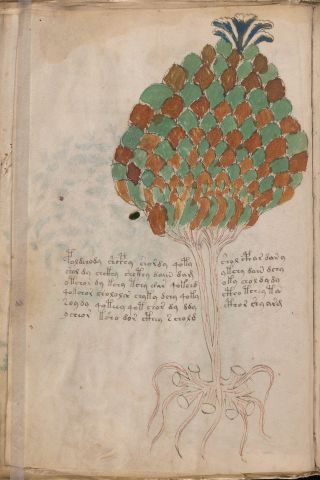

# Voynich Speculative Procedural Protocol — f11v

IMPORTANT: this is NOT a real or validated translation of the Voynich Manuscript. It is a speculative/procedural model that interprets EVA using a user-defined grammar to generate experimental recipes using safe, known edible substitutes.

This file is generated automatically from IVTFF/EVA transliteration plus a user-defined procedural grammar.



## Page / Folio
- currier: A
- folio: f11v
- page_number: 22
- section: herbal

## EVA Text (Transliteration)
```text
poldchody shcphy shordy qoty shol cphar dan y
shol dy chckhy shcthy daiin dam ykchy dain dchy
otchor dy kchy tchy [@152;:d]ar qokchd oky choldy dy
qokchor chololcr chyky dchy qoky ctho tchey tu
dd
soydy qoteey qot chor dy ddy cthor shy arg
ycheor ksho dor cthey s chold
```

## Domain Context (Heuristic; Not a Translation)

This section summarizes recurring **basewords** in this IVTFF domain and shows simple substring evidence that the token markers used by the procedural grammar occur inside frequent words.

Any Italian anagram / English gloss is a best-effort lexicon match, not a decipherment.


### Associated basewords (non-generic; top by frequency in this domain)
- `daiin` (count=461) → Italian anagram `piani`; English: plans (arrangements)
- `okaiin` (count=59) → Italian anagram `coniai`; English: [n/a]
- `chaiin` (count=39) → Italian anagram `acini`; English: [n/a]
- `saiin` (count=37) → Italian anagram `asini`; English: [n/a]
- `qokaiin` (count=34) → Italian anagram `ciancio`; English: [n/a]
- `qokar` (count=29) → Italian anagram `carco`; English: [n/a]
- `odaiin` (count=27) → Italian anagram `inopia`; English: poverty
- `otchol` (count=25) → Italian anagram `colto`; English: cultivated
- `kaiin` (count=24) → Italian anagram `acini`; English: [n/a]
- `chodaiin` (count=24) → Italian anagram `apocini`; English: [n/a]
- `qotol` (count=20) → Italian anagram `colto`; English: cultivated
- `okain` (count=19) → Italian anagram `acino`; English: a berry
- `qotor` (count=18) → Italian anagram `corto`; English: short
- `ykaiin` (count=16) → Italian anagram `acini`; English: [n/a]
- `qodaiin` (count=15) → Italian anagram `apocini`; English: [n/a]

### Marker evidence (substring in frequent basewords)
- `qo`: 57 basewords; examples: `qotchy`, `qokchy`, `qokedy`, `qokaiin`, `qoky`, `qokol`
- `q`: 58 basewords; examples: `qotchy`, `qokchy`, `qokedy`, `qokaiin`, `qoky`, `qokol`
- `o`: 252 basewords; examples: `chol`, `o`, `chor`, `or`, `shol`, `ol`
- `k`: 142 basewords; examples: `okaiin`, `oky`, `chckhy`, `qokchy`, `qokedy`, `okal`
- `t`: 102 basewords; examples: `cthy`, `oty`, `qotchy`, `cthol`, `cthor`, `otaiin`
- `p`: 15 basewords; examples: `cphy`, `ypchedy`, `opchy`, `opchey`, `pchor`, `qopchy`
- `ch`: 138 basewords; examples: `chol`, `chor`, `chy`, `chey`, `chedy`, `chdy`
- `sh`: 46 basewords; examples: `shol`, `sho`, `shy`, `shor`, `shey`, `shedy`
- `f`: 1 basewords; examples: `f`
- `cth`: 17 basewords; examples: `cthy`, `cthol`, `cthor`, `cthey`, `chcthy`, `ctho`
- `ckh`: 15 basewords; examples: `chckhy`, `ckhy`, `ckhol`, `ckhey`, `checkhy`, `shckhy`
- `cph`: 2 basewords; examples: `cphy`, `cphol`
- `dy`: 78 basewords; examples: `dy`, `chedy`, `chdy`, `chody`, `qokedy`, `shedy`
- `iin`: 39 basewords; examples: `daiin`, `aiin`, `okaiin`, `chaiin`, `saiin`, `qokaiin`
- `aiin`: 32 basewords; examples: `daiin`, `aiin`, `okaiin`, `chaiin`, `saiin`, `qokaiin`

## Recipes Index (This Page)
- [f11v.1,@P0](#f11v-1-f11v-1-p0)
- [f11v.2,+P0](#f11v-2-f11v-2-p0)
- [f11v.3,+P0](#f11v-3-f11v-3-p0)
- [f11v.4,+P0](#f11v-4-f11v-4-p0)
- [f11v.5,*L0](#f11v-5-f11v-5-l0)
- [f11v.6,=P0](#f11v-6-f11v-6-p0)
- [f11v.7,+P0](#f11v-7-f11v-7-p0)

## Line Glosses (Procedural Gloss Only; Not a Translation)

<a id="f11v-1-f11v-1-p0"></a>

### f11v.1,@P0

EVA: poldchody shcphy shordy qoty shol cphar dan y

Direct Gloss (Procedural, Not a Real Translation):
- poldchody: add main plant (safe substitute) → mix / transfer → add starter / activate
- shcphy: add secondary herb (safe substitute) → add complex herbal compound (safe blend)
- shordy: add secondary herb (safe substitute) → mix / transfer → add starter / activate
- qoty: prepare liquid base → apply heat/cooking
- shol: add secondary herb (safe substitute) → mix / transfer
- cphar: add complex herbal compound (safe blend) → duration level 1 → state: phase transition/start
- dan: add starter / activate → duration level 1 → state: phase transition/start
- y: [unparsed]

<a id="f11v-2-f11v-2-p0"></a>

### f11v.2,+P0

EVA: shol dy chckhy shcthy daiin dam ykchy dain dchy

Direct Gloss (Procedural, Not a Real Translation):
- shol: add secondary herb (safe substitute) → mix / transfer
- dy: add starter / activate
- chckhy: add main plant (safe substitute) → add complex herbal compound (safe blend)
- shcthy: add secondary herb (safe substitute) → add complex herbal compound (safe blend)
- daiin: add starter / activate → duration level 1 → state: phase transition/start → long phase
- dam: add starter / activate → duration level 1 → state: phase transition/start
- ykchy: add fermentable sugars → add main plant (safe substitute)
- dain: add starter / activate → duration level 1 → state: phase transition/start
- dchy: add main plant (safe substitute) → add starter / activate

<a id="f11v-3-f11v-3-p0"></a>

### f11v.3,+P0

EVA: otchor dy kchy tchy [@152;:d]ar qokchd oky choldy dy

Direct Gloss (Procedural, Not a Real Translation):
- otchor: apply heat/cooking → add main plant (safe substitute) → mix / transfer
- dy: add starter / activate
- kchy: add fermentable sugars → add main plant (safe substitute)
- tchy: apply heat/cooking → add main plant (safe substitute)
- d: add starter / activate
- ar: duration level 1 → state: phase transition/start
- qokchd: prepare liquid base → add fermentable sugars → add main plant (safe substitute) → add starter / activate
- oky: add fermentable sugars → mix / transfer
- choldy: add main plant (safe substitute) → mix / transfer → add starter / activate
- dy: add starter / activate

<a id="f11v-4-f11v-4-p0"></a>

### f11v.4,+P0

EVA: qokchor chololcr chyky dchy qoky ctho tchey tu

Direct Gloss (Procedural, Not a Real Translation):
- qokchor: prepare liquid base → add fermentable sugars → add main plant (safe substitute) → mix / transfer
- chololcr: add main plant (safe substitute) → mix / transfer
- chyky: add fermentable sugars → add main plant (safe substitute)
- dchy: add main plant (safe substitute) → add starter / activate
- qoky: prepare liquid base → add fermentable sugars
- ctho: mix / transfer → add complex herbal compound (safe blend)
- tchey: apply heat/cooking → add main plant (safe substitute) → duration level 1 → state: active extraction
- tu: apply heat/cooking → unmodeled token(s) present: u

<a id="f11v-5-f11v-5-l0"></a>

### f11v.5,*L0

EVA: dd

Direct Gloss (Procedural, Not a Real Translation):
- dd: add starter / activate

<a id="f11v-6-f11v-6-p0"></a>

### f11v.6,=P0

EVA: soydy qoteey qot chor dy ddy cthor shy arg

Direct Gloss (Procedural, Not a Real Translation):
- soydy: mix / transfer → add starter / activate
- qoteey: prepare liquid base → apply heat/cooking → duration level 2 → state: active extraction
- qot: prepare liquid base → apply heat/cooking
- chor: add main plant (safe substitute) → mix / transfer
- dy: add starter / activate
- ddy: add starter / activate
- cthor: mix / transfer → add complex herbal compound (safe blend)
- shy: add secondary herb (safe substitute)
- arg: duration level 1 → state: phase transition/start

<a id="f11v-7-f11v-7-p0"></a>

### f11v.7,+P0

EVA: ycheor ksho dor cthey s chold

Direct Gloss (Procedural, Not a Real Translation):
- ycheor: add main plant (safe substitute) → mix / transfer → duration level 1 → state: active extraction
- ksho: add fermentable sugars → add secondary herb (safe substitute) → mix / transfer
- dor: mix / transfer → add starter / activate
- cthey: add complex herbal compound (safe blend) → duration level 1 → state: active extraction
- s: [unparsed]
- chold: add main plant (safe substitute) → mix / transfer → add starter / activate
