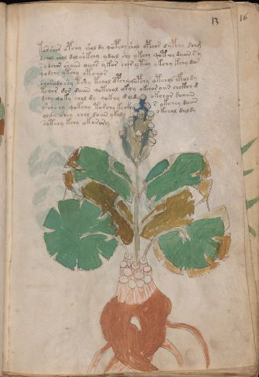

# Voynich Speculative Procedural Protocol — f13r

IMPORTANT: this is NOT a real or validated translation of the Voynich Manuscript. It is a speculative/procedural model that interprets EVA using a user-defined grammar to generate experimental recipes using safe, known edible substitutes.

This file is generated automatically from IVTFF/EVA transliteration plus a user-defined procedural grammar.



## Page / Folio
- currier: A
- folio: f13r
- page_number: 23
- section: herbal

## EVA Text (Transliteration)
```text
torshor opchy shol dy qopchy shol opchor dypchy dchg
dchol chol dol shkchy ydal shy ykchy qot[?:ch]y daiin s y
s y dchor shaiin oeees ykor chor ytshy ykchy kchy dar
qodchy ytchy otchor
shorodo shy tshy kchol dpchy qopchy otchol cfholdy
tchor dor daiin qotchol okchy okchor oiin chckhy d
dchy qoky chol dy qokhy d oldy okchor doaiin
shochy qokchy torchy kchky s okchey daiin
oldy shey chol d[o:a]iin ykoly okchal daldy
sotchy kchy okorory
```

## Domain Context (Heuristic; Not a Translation)

This section summarizes recurring **basewords** in this IVTFF domain and shows simple substring evidence that the token markers used by the procedural grammar occur inside frequent words.

Any Italian anagram / English gloss is a best-effort lexicon match, not a decipherment.


### Associated basewords (non-generic; top by frequency in this domain)
- `daiin` (count=461) → Italian anagram `piani`; English: plans (arrangements)
- `okaiin` (count=59) → Italian anagram `coniai`; English: [n/a]
- `chaiin` (count=39) → Italian anagram `acini`; English: [n/a]
- `saiin` (count=37) → Italian anagram `asini`; English: [n/a]
- `qokaiin` (count=34) → Italian anagram `ciancio`; English: [n/a]
- `qokar` (count=29) → Italian anagram `carco`; English: [n/a]
- `odaiin` (count=27) → Italian anagram `inopia`; English: poverty
- `otchol` (count=25) → Italian anagram `colto`; English: cultivated
- `kaiin` (count=24) → Italian anagram `acini`; English: [n/a]
- `chodaiin` (count=24) → Italian anagram `apocini`; English: [n/a]
- `qotol` (count=20) → Italian anagram `colto`; English: cultivated
- `okain` (count=19) → Italian anagram `acino`; English: a berry
- `qotor` (count=18) → Italian anagram `corto`; English: short
- `ykaiin` (count=16) → Italian anagram `acini`; English: [n/a]
- `qodaiin` (count=15) → Italian anagram `apocini`; English: [n/a]

### Marker evidence (substring in frequent basewords)
- `qo`: 57 basewords; examples: `qotchy`, `qokchy`, `qokedy`, `qokaiin`, `qoky`, `qokol`
- `q`: 58 basewords; examples: `qotchy`, `qokchy`, `qokedy`, `qokaiin`, `qoky`, `qokol`
- `o`: 252 basewords; examples: `chol`, `o`, `chor`, `or`, `shol`, `ol`
- `k`: 142 basewords; examples: `okaiin`, `oky`, `chckhy`, `qokchy`, `qokedy`, `okal`
- `t`: 102 basewords; examples: `cthy`, `oty`, `qotchy`, `cthol`, `cthor`, `otaiin`
- `p`: 15 basewords; examples: `cphy`, `ypchedy`, `opchy`, `opchey`, `pchor`, `qopchy`
- `ch`: 138 basewords; examples: `chol`, `chor`, `chy`, `chey`, `chedy`, `chdy`
- `sh`: 46 basewords; examples: `shol`, `sho`, `shy`, `shor`, `shey`, `shedy`
- `f`: 1 basewords; examples: `f`
- `cth`: 17 basewords; examples: `cthy`, `cthol`, `cthor`, `cthey`, `chcthy`, `ctho`
- `ckh`: 15 basewords; examples: `chckhy`, `ckhy`, `ckhol`, `ckhey`, `checkhy`, `shckhy`
- `cph`: 2 basewords; examples: `cphy`, `cphol`
- `dy`: 78 basewords; examples: `dy`, `chedy`, `chdy`, `chody`, `qokedy`, `shedy`
- `iin`: 39 basewords; examples: `daiin`, `aiin`, `okaiin`, `chaiin`, `saiin`, `qokaiin`
- `aiin`: 32 basewords; examples: `daiin`, `aiin`, `okaiin`, `chaiin`, `saiin`, `qokaiin`

## Recipes Index (This Page)
- [f13r.1,@P0](#f13r-1-f13r-1-p0)
- [f13r.2,+P0](#f13r-2-f13r-2-p0)
- [f13r.3,+P0](#f13r-3-f13r-3-p0)
- [f13r.4,+P0](#f13r-4-f13r-4-p0)
- [f13r.5,+P0](#f13r-5-f13r-5-p0)
- [f13r.6,+P0](#f13r-6-f13r-6-p0)
- [f13r.7,+P0](#f13r-7-f13r-7-p0)
- [f13r.8,+P0](#f13r-8-f13r-8-p0)
- [f13r.9,+P0](#f13r-9-f13r-9-p0)
- [f13r.10,+P0](#f13r-10-f13r-10-p0)

## Line Glosses (Procedural Gloss Only; Not a Translation)

<a id="f13r-1-f13r-1-p0"></a>

### f13r.1,@P0

EVA: torshor opchy shol dy qopchy shol opchor dypchy dchg

Direct Gloss (Procedural, Not a Real Translation):
- torshor: tokens: t o r sh o r → connectors: r r
- opchy: tokens: o p ch
- shol: tokens: sh o l → connectors: l
- dy: tokens: p
- qopchy: tokens: qo p ch
- shol: tokens: sh o l → connectors: l
- opchor: tokens: o p ch o r → connectors: r
- dypchy: tokens: p p ch
- dchg: tokens: p ch g

<a id="f13r-2-f13r-2-p0"></a>

### f13r.2,+P0

EVA: dchol chol dol shkchy ydal shy ykchy qot[?:ch]y daiin s y

Direct Gloss (Procedural, Not a Real Translation):
- dchol: tokens: p ch o l → connectors: l
- chol: tokens: ch o l → connectors: l
- dol: tokens: p o l → connectors: l
- shkchy: tokens: sh k ch
- ydal: tokens: p a l → connectors: l → vowel_run: a (level 1; class a)
- shy: tokens: sh
- ykchy: tokens: k ch
- qot: tokens: qo t
- ch: tokens: ch
- y: [unparsed]
- daiin: tokens: p aiin → vowel_run: a (level 1; class a) → suffix: aiin
- s: tokens: s → connectors: s
- y: [unparsed]

<a id="f13r-3-f13r-3-p0"></a>

### f13r.3,+P0

EVA: s y dchor shaiin oeees ykor chor ytshy ykchy kchy dar

Direct Gloss (Procedural, Not a Real Translation):
- s: tokens: s → connectors: s
- y: [unparsed]
- dchor: tokens: p ch o r → connectors: r
- shaiin: tokens: sh aiin → vowel_run: a (level 1; class a) → suffix: aiin
- oeees: tokens: o eee s → connectors: s → vowel_run: eee (level 3; class e)
- ykor: tokens: k o r → connectors: r
- chor: tokens: ch o r → connectors: r
- ytshy: tokens: t sh
- ykchy: tokens: k ch
- kchy: tokens: k ch
- dar: tokens: p a r → connectors: r → vowel_run: a (level 1; class a)

<a id="f13r-4-f13r-4-p0"></a>

### f13r.4,+P0

EVA: qodchy ytchy otchor

Direct Gloss (Procedural, Not a Real Translation):
- qodchy: tokens: qo p ch
- ytchy: tokens: t ch
- otchor: tokens: o t ch o r → connectors: r

<a id="f13r-5-f13r-5-p0"></a>

### f13r.5,+P0

EVA: shorodo shy tshy kchol dpchy qopchy otchol cfholdy

Direct Gloss (Procedural, Not a Real Translation):
- shorodo: tokens: sh o r o p o → connectors: r
- shy: tokens: sh
- tshy: tokens: t sh
- kchol: tokens: k ch o l → connectors: l
- dpchy: tokens: p p ch
- qopchy: tokens: qo p ch
- otchol: tokens: o t ch o l → connectors: l
- cfholdy: tokens: cfh o l p → connectors: l

<a id="f13r-6-f13r-6-p0"></a>

### f13r.6,+P0

EVA: tchor dor daiin qotchol okchy okchor oiin chckhy d

Direct Gloss (Procedural, Not a Real Translation):
- tchor: tokens: t ch o r → connectors: r
- dor: tokens: p o r → connectors: r
- daiin: tokens: p aiin → vowel_run: a (level 1; class a) → suffix: aiin
- qotchol: tokens: qo t ch o l → connectors: l
- okchy: tokens: o k ch
- okchor: tokens: o k ch o r → connectors: r
- oiin: tokens: o iin → vowel_run: ii (level 2; class i) → suffix: iin
- chckhy: tokens: ch ckh
- d: tokens: p

<a id="f13r-7-f13r-7-p0"></a>

### f13r.7,+P0

EVA: dchy qoky chol dy qokhy d oldy okchor doaiin

Direct Gloss (Procedural, Not a Real Translation):
- dchy: tokens: p ch
- qoky: tokens: qo k
- chol: tokens: ch o l → connectors: l
- dy: tokens: p
- qokhy: tokens: qo k h → unmodeled_tokens: h
- d: tokens: p
- oldy: tokens: o l p → connectors: l
- okchor: tokens: o k ch o r → connectors: r
- doaiin: tokens: p o aiin → vowel_run: a (level 1; class a) → suffix: aiin

<a id="f13r-8-f13r-8-p0"></a>

### f13r.8,+P0

EVA: shochy qokchy torchy kchky s okchey daiin

Direct Gloss (Procedural, Not a Real Translation):
- shochy: tokens: sh o ch
- qokchy: tokens: qo k ch
- torchy: tokens: t o r ch → connectors: r
- kchky: tokens: k ch k
- s: tokens: s → connectors: s
- okchey: tokens: o k ch e → vowel_run: e (level 1; class e)
- daiin: tokens: p aiin → vowel_run: a (level 1; class a) → suffix: aiin

<a id="f13r-9-f13r-9-p0"></a>

### f13r.9,+P0

EVA: oldy shey chol d[o:a]iin ykoly okchal daldy

Direct Gloss (Procedural, Not a Real Translation):
- oldy: tokens: o l p → connectors: l
- shey: tokens: sh e → vowel_run: e (level 1; class e)
- chol: tokens: ch o l → connectors: l
- d: tokens: p
- o: tokens: o
- a: tokens: a → vowel_run: a (level 1; class a)
- iin: tokens: iin → vowel_run: ii (level 2; class i) → suffix: iin
- ykoly: tokens: k o l → connectors: l
- okchal: tokens: o k ch a l → connectors: l → vowel_run: a (level 1; class a)
- daldy: tokens: p a l p → connectors: l → vowel_run: a (level 1; class a)

<a id="f13r-10-f13r-10-p0"></a>

### f13r.10,+P0

EVA: sotchy kchy okorory

Direct Gloss (Procedural, Not a Real Translation):
- sotchy: tokens: s o t ch → connectors: s
- kchy: tokens: k ch
- okorory: tokens: o k o r o r → connectors: r r
