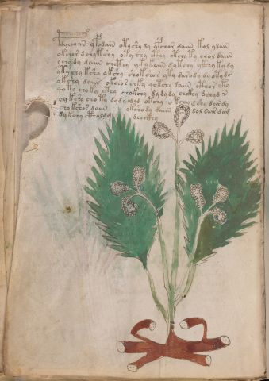

# Voynich Speculative Procedural Protocol — f14v

IMPORTANT: this is NOT a real or validated translation of the Voynich Manuscript. It is a speculative/procedural model that interprets EVA using a user-defined grammar to generate experimental recipes using safe, known edible substitutes.

This file is generated automatically from IVTFF/EVA transliteration plus a user-defined procedural grammar.



## Page / Folio
- currier: A
- folio: f14v
- page_number: 26
- section: herbal

## EVA Text (Transliteration)
```text
pdychoiin yfodain otyshy dy ypchor daiin kol ydain
okchor d chytshy oty chy cthy otchy ty chol daiin
ychy dy daiin chcthy y[k:t] ykaiin dytchy ykhhy ky dy
ytychy ksho ykshy shokshor yty darody dyoty ds
okshy daiin okchor chky qotchy daiin cthor oty
qoty choky cthy chokchy dy dy dy chckhy dchyd n
oy kshy cho ty dydy odyd otchy o kchy dshy dardy
chokshor daiin okshody daiin dol dair dam
dykchy ctholdg dchckhy
```

## Domain Context (Heuristic; Not a Translation)

This section summarizes recurring **basewords** in this IVTFF domain and shows simple substring evidence that the token markers used by the procedural grammar occur inside frequent words.

Any Italian anagram / English gloss is a best-effort lexicon match, not a decipherment.


### Associated basewords (non-generic; top by frequency in this domain)
- `daiin` (count=461) → Italian anagram `piani`; English: plans (arrangements)
- `okaiin` (count=59) → Italian anagram `coniai`; English: [n/a]
- `chaiin` (count=39) → Italian anagram `acini`; English: [n/a]
- `saiin` (count=37) → Italian anagram `asini`; English: [n/a]
- `qokaiin` (count=34) → Italian anagram `ciancio`; English: [n/a]
- `qokar` (count=29) → Italian anagram `carco`; English: [n/a]
- `odaiin` (count=27) → Italian anagram `inopia`; English: poverty
- `otchol` (count=25) → Italian anagram `colto`; English: cultivated
- `kaiin` (count=24) → Italian anagram `acini`; English: [n/a]
- `chodaiin` (count=24) → Italian anagram `apocini`; English: [n/a]
- `qotol` (count=20) → Italian anagram `colto`; English: cultivated
- `okain` (count=19) → Italian anagram `acino`; English: a berry
- `qotor` (count=18) → Italian anagram `corto`; English: short
- `ykaiin` (count=16) → Italian anagram `acini`; English: [n/a]
- `qodaiin` (count=15) → Italian anagram `apocini`; English: [n/a]

### Marker evidence (substring in frequent basewords)
- `qo`: 57 basewords; examples: `qotchy`, `qokchy`, `qokedy`, `qokaiin`, `qoky`, `qokol`
- `q`: 58 basewords; examples: `qotchy`, `qokchy`, `qokedy`, `qokaiin`, `qoky`, `qokol`
- `o`: 252 basewords; examples: `chol`, `o`, `chor`, `or`, `shol`, `ol`
- `k`: 142 basewords; examples: `okaiin`, `oky`, `chckhy`, `qokchy`, `qokedy`, `okal`
- `t`: 102 basewords; examples: `cthy`, `oty`, `qotchy`, `cthol`, `cthor`, `otaiin`
- `p`: 15 basewords; examples: `cphy`, `ypchedy`, `opchy`, `opchey`, `pchor`, `qopchy`
- `ch`: 138 basewords; examples: `chol`, `chor`, `chy`, `chey`, `chedy`, `chdy`
- `sh`: 46 basewords; examples: `shol`, `sho`, `shy`, `shor`, `shey`, `shedy`
- `f`: 1 basewords; examples: `f`
- `cth`: 17 basewords; examples: `cthy`, `cthol`, `cthor`, `cthey`, `chcthy`, `ctho`
- `ckh`: 15 basewords; examples: `chckhy`, `ckhy`, `ckhol`, `ckhey`, `checkhy`, `shckhy`
- `cph`: 2 basewords; examples: `cphy`, `cphol`
- `dy`: 78 basewords; examples: `dy`, `chedy`, `chdy`, `chody`, `qokedy`, `shedy`
- `iin`: 39 basewords; examples: `daiin`, `aiin`, `okaiin`, `chaiin`, `saiin`, `qokaiin`
- `aiin`: 32 basewords; examples: `daiin`, `aiin`, `okaiin`, `chaiin`, `saiin`, `qokaiin`

## Recipes Index (This Page)
- [f14v.1,@P0](#f14v-1-f14v-1-p0)
- [f14v.2,+P0](#f14v-2-f14v-2-p0)
- [f14v.3,+P0](#f14v-3-f14v-3-p0)
- [f14v.4,+P0](#f14v-4-f14v-4-p0)
- [f14v.5,+P0](#f14v-5-f14v-5-p0)
- [f14v.6,+P0](#f14v-6-f14v-6-p0)
- [f14v.7,+P0](#f14v-7-f14v-7-p0)
- [f14v.8,+P0](#f14v-8-f14v-8-p0)
- [f14v.9,+P0](#f14v-9-f14v-9-p0)

## Line Glosses (Procedural Gloss Only; Not a Translation)

<a id="f14v-1-f14v-1-p0"></a>

### f14v.1,@P0

EVA: pdychoiin yfodain otyshy dy ypchor daiin kol ydain

Direct Gloss (Procedural, Not a Real Translation):
- pdychoiin: tokens: p p ch o iin → vowel_run: ii (level 2; class i) → suffix: iin
- yfodain: tokens: f o p a i n → connectors: n → vowel_run: a (level 1; class a)
- otyshy: tokens: o t sh
- dy: tokens: p
- ypchor: tokens: p ch o r → connectors: r
- daiin: tokens: p aiin → vowel_run: a (level 1; class a) → suffix: aiin
- kol: tokens: k o l → connectors: l
- ydain: tokens: p a i n → connectors: n → vowel_run: a (level 1; class a)

<a id="f14v-2-f14v-2-p0"></a>

### f14v.2,+P0

EVA: okchor d chytshy oty chy cthy otchy ty chol daiin

Direct Gloss (Procedural, Not a Real Translation):
- okchor: tokens: o k ch o r → connectors: r
- d: tokens: p
- chytshy: tokens: ch t sh
- oty: tokens: o t
- chy: tokens: ch
- cthy: tokens: cth
- otchy: tokens: o t ch
- ty: tokens: t
- chol: tokens: ch o l → connectors: l
- daiin: tokens: p aiin → vowel_run: a (level 1; class a) → suffix: aiin

<a id="f14v-3-f14v-3-p0"></a>

### f14v.3,+P0

EVA: ychy dy daiin chcthy y[k:t] ykaiin dytchy ykhhy ky dy

Direct Gloss (Procedural, Not a Real Translation):
- ychy: tokens: ch
- dy: tokens: p
- daiin: tokens: p aiin → vowel_run: a (level 1; class a) → suffix: aiin
- chcthy: tokens: ch cth
- y: [unparsed]
- k: tokens: k
- t: tokens: t
- ykaiin: tokens: k aiin → vowel_run: a (level 1; class a) → suffix: aiin
- dytchy: tokens: p t ch
- ykhhy: tokens: k h h → unmodeled_tokens: h
- ky: tokens: k
- dy: tokens: p

<a id="f14v-4-f14v-4-p0"></a>

### f14v.4,+P0

EVA: ytychy ksho ykshy shokshor yty darody dyoty ds

Direct Gloss (Procedural, Not a Real Translation):
- ytychy: tokens: t ch
- ksho: tokens: k sh o
- ykshy: tokens: k sh
- shokshor: tokens: sh o k sh o r → connectors: r
- yty: tokens: t
- darody: tokens: p a r o p → connectors: r → vowel_run: a (level 1; class a)
- dyoty: tokens: p o t
- ds: tokens: p s → connectors: s

<a id="f14v-5-f14v-5-p0"></a>

### f14v.5,+P0

EVA: okshy daiin okchor chky qotchy daiin cthor oty

Direct Gloss (Procedural, Not a Real Translation):
- okshy: tokens: o k sh
- daiin: tokens: p aiin → vowel_run: a (level 1; class a) → suffix: aiin
- okchor: tokens: o k ch o r → connectors: r
- chky: tokens: ch k
- qotchy: tokens: qo t ch
- daiin: tokens: p aiin → vowel_run: a (level 1; class a) → suffix: aiin
- cthor: tokens: cth o r → connectors: r
- oty: tokens: o t

<a id="f14v-6-f14v-6-p0"></a>

### f14v.6,+P0

EVA: qoty choky cthy chokchy dy dy dy chckhy dchyd n

Direct Gloss (Procedural, Not a Real Translation):
- qoty: tokens: qo t
- choky: tokens: ch o k
- cthy: tokens: cth
- chokchy: tokens: ch o k ch
- dy: tokens: p
- dy: tokens: p
- dy: tokens: p
- chckhy: tokens: ch ckh
- dchyd: tokens: p ch p
- n: tokens: n → connectors: n

<a id="f14v-7-f14v-7-p0"></a>

### f14v.7,+P0

EVA: oy kshy cho ty dydy odyd otchy o kchy dshy dardy

Direct Gloss (Procedural, Not a Real Translation):
- oy: tokens: o
- kshy: tokens: k sh
- cho: tokens: ch o
- ty: tokens: t
- dydy: tokens: p p
- odyd: tokens: o p p
- otchy: tokens: o t ch
- o: tokens: o
- kchy: tokens: k ch
- dshy: tokens: p sh
- dardy: tokens: p a r p → connectors: r → vowel_run: a (level 1; class a)

<a id="f14v-8-f14v-8-p0"></a>

### f14v.8,+P0

EVA: chokshor daiin okshody daiin dol dair dam

Direct Gloss (Procedural, Not a Real Translation):
- chokshor: tokens: ch o k sh o r → connectors: r
- daiin: tokens: p aiin → vowel_run: a (level 1; class a) → suffix: aiin
- okshody: tokens: o k sh o p
- daiin: tokens: p aiin → vowel_run: a (level 1; class a) → suffix: aiin
- dol: tokens: p o l → connectors: l
- dair: tokens: p a i r → connectors: r → vowel_run: a (level 1; class a)
- dam: tokens: p a m → connectors: m → vowel_run: a (level 1; class a)

<a id="f14v-9-f14v-9-p0"></a>

### f14v.9,+P0

EVA: dykchy ctholdg dchckhy

Direct Gloss (Procedural, Not a Real Translation):
- dykchy: tokens: p k ch
- ctholdg: tokens: cth o l p g → connectors: l
- dchckhy: tokens: p ch ckh
