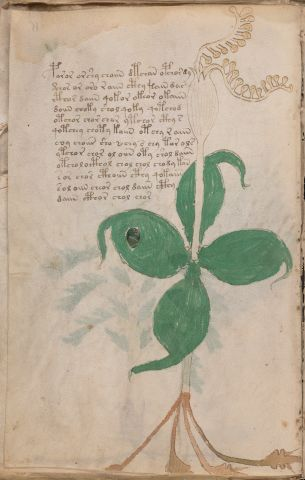

# Voynich Speculative Procedural Protocol — f15v

IMPORTANT: this is NOT a real or validated translation of the Voynich Manuscript. It is a speculative/procedural model that interprets EVA using a user-defined grammar to generate experimental recipes using safe, known edible substitutes.

This file is generated automatically from IVTFF/EVA transliteration plus a user-defined procedural grammar.



## Page / Folio
- currier: A
- folio: f15v
- page_number: 28
- section: herbal

## EVA Text (Transliteration)
```text
poror orshy choiin dtchan opchordy
@138;chor or oro r aiin cthy [?:t]ain dar
cthor daiin qokor okeor okaiin
doiin choky shol qoky qotchod
otchor chor chor ytchor cthy s
qotchey choty kaiin otchy r aiin
coy cho[iin:iir] sho [?:s] chy s chy tor ols
ytchor chor ol oiin oty shol daiin
otchol octhol chol chol chody kan
sor chor cthoiin cthy qokaiin
sol oiin cheor chol daiin cthy
daiin cthor chol chor
```

## Domain Context (Heuristic; Not a Translation)

This section summarizes recurring **basewords** in this IVTFF domain and shows simple substring evidence that the token markers used by the procedural grammar occur inside frequent words.

Any Italian anagram / English gloss is a best-effort lexicon match, not a decipherment.


### Associated basewords (non-generic; top by frequency in this domain)
- `daiin` (count=461) → Italian anagram `piani`; English: plans (arrangements)
- `okaiin` (count=59) → Italian anagram `coniai`; English: [n/a]
- `chaiin` (count=39) → Italian anagram `acini`; English: [n/a]
- `saiin` (count=37) → Italian anagram `asini`; English: [n/a]
- `qokaiin` (count=34) → Italian anagram `ciancio`; English: [n/a]
- `qokar` (count=29) → Italian anagram `carco`; English: [n/a]
- `odaiin` (count=27) → Italian anagram `inopia`; English: poverty
- `otchol` (count=25) → Italian anagram `colto`; English: cultivated
- `kaiin` (count=24) → Italian anagram `acini`; English: [n/a]
- `chodaiin` (count=24) → Italian anagram `apocini`; English: [n/a]
- `qotol` (count=20) → Italian anagram `colto`; English: cultivated
- `okain` (count=19) → Italian anagram `acino`; English: a berry
- `qotor` (count=18) → Italian anagram `corto`; English: short
- `ykaiin` (count=16) → Italian anagram `acini`; English: [n/a]
- `qodaiin` (count=15) → Italian anagram `apocini`; English: [n/a]

### Marker evidence (substring in frequent basewords)
- `qo`: 57 basewords; examples: `qotchy`, `qokchy`, `qokedy`, `qokaiin`, `qoky`, `qokol`
- `q`: 58 basewords; examples: `qotchy`, `qokchy`, `qokedy`, `qokaiin`, `qoky`, `qokol`
- `o`: 252 basewords; examples: `chol`, `o`, `chor`, `or`, `shol`, `ol`
- `k`: 142 basewords; examples: `okaiin`, `oky`, `chckhy`, `qokchy`, `qokedy`, `okal`
- `t`: 102 basewords; examples: `cthy`, `oty`, `qotchy`, `cthol`, `cthor`, `otaiin`
- `p`: 15 basewords; examples: `cphy`, `ypchedy`, `opchy`, `opchey`, `pchor`, `qopchy`
- `ch`: 138 basewords; examples: `chol`, `chor`, `chy`, `chey`, `chedy`, `chdy`
- `sh`: 46 basewords; examples: `shol`, `sho`, `shy`, `shor`, `shey`, `shedy`
- `f`: 1 basewords; examples: `f`
- `cth`: 17 basewords; examples: `cthy`, `cthol`, `cthor`, `cthey`, `chcthy`, `ctho`
- `ckh`: 15 basewords; examples: `chckhy`, `ckhy`, `ckhol`, `ckhey`, `checkhy`, `shckhy`
- `cph`: 2 basewords; examples: `cphy`, `cphol`
- `dy`: 78 basewords; examples: `dy`, `chedy`, `chdy`, `chody`, `qokedy`, `shedy`
- `iin`: 39 basewords; examples: `daiin`, `aiin`, `okaiin`, `chaiin`, `saiin`, `qokaiin`
- `aiin`: 32 basewords; examples: `daiin`, `aiin`, `okaiin`, `chaiin`, `saiin`, `qokaiin`

## Recipes Index (This Page)
- [f15v.1,@P0](#f15v-1-f15v-1-p0)
- [f15v.2,+P0](#f15v-2-f15v-2-p0)
- [f15v.3,+P0](#f15v-3-f15v-3-p0)
- [f15v.4,+P0](#f15v-4-f15v-4-p0)
- [f15v.5,+P0](#f15v-5-f15v-5-p0)
- [f15v.6,+P0](#f15v-6-f15v-6-p0)
- [f15v.7,+P0](#f15v-7-f15v-7-p0)
- [f15v.8,+P0](#f15v-8-f15v-8-p0)
- [f15v.9,+P0](#f15v-9-f15v-9-p0)
- [f15v.10,+P0](#f15v-10-f15v-10-p0)
- [f15v.11,+P0](#f15v-11-f15v-11-p0)
- [f15v.12,+P0](#f15v-12-f15v-12-p0)

## Line Glosses (Procedural Gloss Only; Not a Translation)

<a id="f15v-1-f15v-1-p0"></a>

### f15v.1,@P0

EVA: poror orshy choiin dtchan opchordy

Direct Gloss (Procedural, Not a Real Translation):
- poror: mix / transfer → add starter / activate
- orshy: add secondary herb (safe substitute) → mix / transfer
- choiin: add main plant (safe substitute) → mix / transfer → duration level 2 → state: cooling/rest → medium phase
- dtchan: apply heat/cooking → add main plant (safe substitute) → add starter / activate → duration level 1 → state: phase transition/start
- opchordy: add main plant (safe substitute) → mix / transfer → add starter / activate

<a id="f15v-2-f15v-2-p0"></a>

### f15v.2,+P0

EVA: @138;chor or oro r aiin cthy [?:t]ain dar

Direct Gloss (Procedural, Not a Real Translation):
- chor: add main plant (safe substitute) → mix / transfer
- or: mix / transfer
- oro: mix / transfer
- r: [unparsed]
- aiin: duration level 1 → state: phase transition/start → long phase
- cthy: add complex herbal compound (safe blend)
- t: apply heat/cooking
- ain: duration level 1 → state: phase transition/start
- dar: add starter / activate → duration level 1 → state: phase transition/start

<a id="f15v-3-f15v-3-p0"></a>

### f15v.3,+P0

EVA: cthor daiin qokor okeor okaiin

Direct Gloss (Procedural, Not a Real Translation):
- cthor: mix / transfer → add complex herbal compound (safe blend)
- daiin: add starter / activate → duration level 1 → state: phase transition/start → long phase
- qokor: prepare liquid base → add fermentable sugars → mix / transfer
- okeor: add fermentable sugars → mix / transfer → duration level 1 → state: active extraction
- okaiin: add fermentable sugars → mix / transfer → duration level 1 → state: phase transition/start → long phase

<a id="f15v-4-f15v-4-p0"></a>

### f15v.4,+P0

EVA: doiin choky shol qoky qotchod

Direct Gloss (Procedural, Not a Real Translation):
- doiin: mix / transfer → add starter / activate → duration level 2 → state: cooling/rest → medium phase
- choky: add fermentable sugars → add main plant (safe substitute) → mix / transfer
- shol: add secondary herb (safe substitute) → mix / transfer
- qoky: prepare liquid base → add fermentable sugars
- qotchod: prepare liquid base → apply heat/cooking → add main plant (safe substitute) → mix / transfer → add starter / activate

<a id="f15v-5-f15v-5-p0"></a>

### f15v.5,+P0

EVA: otchor chor chor ytchor cthy s

Direct Gloss (Procedural, Not a Real Translation):
- otchor: apply heat/cooking → add main plant (safe substitute) → mix / transfer
- chor: add main plant (safe substitute) → mix / transfer
- chor: add main plant (safe substitute) → mix / transfer
- ytchor: apply heat/cooking → add main plant (safe substitute) → mix / transfer
- cthy: add complex herbal compound (safe blend)
- s: [unparsed]

<a id="f15v-6-f15v-6-p0"></a>

### f15v.6,+P0

EVA: qotchey choty kaiin otchy r aiin

Direct Gloss (Procedural, Not a Real Translation):
- qotchey: prepare liquid base → apply heat/cooking → add main plant (safe substitute) → duration level 1 → state: active extraction
- choty: apply heat/cooking → add main plant (safe substitute) → mix / transfer
- kaiin: add fermentable sugars → duration level 1 → state: phase transition/start → long phase
- otchy: apply heat/cooking → add main plant (safe substitute) → mix / transfer
- r: [unparsed]
- aiin: duration level 1 → state: phase transition/start → long phase

<a id="f15v-7-f15v-7-p0"></a>

### f15v.7,+P0

EVA: coy cho[iin:iir] sho [?:s] chy s chy tor ols

Direct Gloss (Procedural, Not a Real Translation):
- coy: mix / transfer
- cho: add main plant (safe substitute) → mix / transfer
- iin: duration level 2 → state: cooling/rest → medium phase
- iir: duration level 2 → state: cooling/rest
- sho: add secondary herb (safe substitute) → mix / transfer
- s: [unparsed]
- chy: add main plant (safe substitute)
- s: [unparsed]
- chy: add main plant (safe substitute)
- tor: apply heat/cooking → mix / transfer
- ols: mix / transfer

<a id="f15v-8-f15v-8-p0"></a>

### f15v.8,+P0

EVA: ytchor chor ol oiin oty shol daiin

Direct Gloss (Procedural, Not a Real Translation):
- ytchor: apply heat/cooking → add main plant (safe substitute) → mix / transfer
- chor: add main plant (safe substitute) → mix / transfer
- ol: mix / transfer
- oiin: mix / transfer → duration level 2 → state: cooling/rest → medium phase
- oty: apply heat/cooking → mix / transfer
- shol: add secondary herb (safe substitute) → mix / transfer
- daiin: add starter / activate → duration level 1 → state: phase transition/start → long phase

<a id="f15v-9-f15v-9-p0"></a>

### f15v.9,+P0

EVA: otchol octhol chol chol chody kan

Direct Gloss (Procedural, Not a Real Translation):
- otchol: apply heat/cooking → add main plant (safe substitute) → mix / transfer
- octhol: mix / transfer → add complex herbal compound (safe blend)
- chol: add main plant (safe substitute) → mix / transfer
- chol: add main plant (safe substitute) → mix / transfer
- chody: add main plant (safe substitute) → mix / transfer → add starter / activate
- kan: add fermentable sugars → duration level 1 → state: phase transition/start

<a id="f15v-10-f15v-10-p0"></a>

### f15v.10,+P0

EVA: sor chor cthoiin cthy qokaiin

Direct Gloss (Procedural, Not a Real Translation):
- sor: mix / transfer
- chor: add main plant (safe substitute) → mix / transfer
- cthoiin: mix / transfer → add complex herbal compound (safe blend) → duration level 2 → state: cooling/rest → medium phase
- cthy: add complex herbal compound (safe blend)
- qokaiin: prepare liquid base → add fermentable sugars → duration level 1 → state: phase transition/start → long phase

<a id="f15v-11-f15v-11-p0"></a>

### f15v.11,+P0

EVA: sol oiin cheor chol daiin cthy

Direct Gloss (Procedural, Not a Real Translation):
- sol: mix / transfer
- oiin: mix / transfer → duration level 2 → state: cooling/rest → medium phase
- cheor: add main plant (safe substitute) → mix / transfer → duration level 1 → state: active extraction
- chol: add main plant (safe substitute) → mix / transfer
- daiin: add starter / activate → duration level 1 → state: phase transition/start → long phase
- cthy: add complex herbal compound (safe blend)

<a id="f15v-12-f15v-12-p0"></a>

### f15v.12,+P0

EVA: daiin cthor chol chor

Direct Gloss (Procedural, Not a Real Translation):
- daiin: add starter / activate → duration level 1 → state: phase transition/start → long phase
- cthor: mix / transfer → add complex herbal compound (safe blend)
- chol: add main plant (safe substitute) → mix / transfer
- chor: add main plant (safe substitute) → mix / transfer
