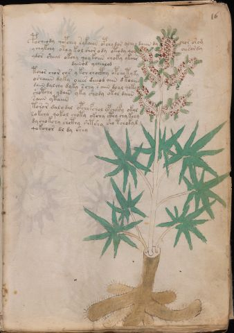

# Voynich Speculative Procedural Protocol — f16r

IMPORTANT: this is NOT a real or validated translation of the Voynich Manuscript. It is a speculative/procedural model that interprets EVA using a user-defined grammar to generate experimental recipes using safe, known edible substitutes.

This file is generated automatically from IVTFF/EVA transliteration plus a user-defined procedural grammar.



## Page / Folio
- currier: A
- folio: f16r
- page_number: 29
- section: herbal

## EVA Text (Transliteration)
```text
pocheody qopchey sykaiin opchy dor ychy daiin dy chor orom
ychykchy otey kol shor ody otody qoy oeesordy
ydor sheal okchy qoy koiin choky ykair
dainod ychealod
tchor chor chs y kch shocthy opchy ty ky
oshaiin dyky oeees deeeod aiin d toaiin
daiin dalchy dyky schy s aiin doal qoky
shotchy ydain yky shody otol daiin
saiin ytaiin
toror dal[y:o] dal opchy fchol ypchocfy okal
sokchy qokol choty okchy cthy chy kchy
dy cho kchy shcthy shtshy sho tchokyd
qok[oh:ch]or dl dy shey
```

## Domain Context (Heuristic; Not a Translation)

This section summarizes recurring **basewords** in this IVTFF domain and shows simple substring evidence that the token markers used by the procedural grammar occur inside frequent words.

Any Italian anagram / English gloss is a best-effort lexicon match, not a decipherment.


### Associated basewords (non-generic; top by frequency in this domain)
- `paiin` (count=477) → Italian anagram `piani`; English: plans (arrangements)
- `okaiin` (count=59) → Italian anagram `coniai`; English: [n/a]
- `qokep` (count=41) → Italian anagram `pecco`; English: [n/a]
- `saiin` (count=40) → Italian anagram `asini`; English: [n/a]
- `kaiin` (count=40) → Italian anagram `acini`; English: [n/a]
- `chaiin` (count=39) → Italian anagram `acini`; English: [n/a]
- `qokaiin` (count=34) → Italian anagram `ciancio`; English: [n/a]
- `qokar` (count=29) → Italian anagram `carco`; English: [n/a]
- `opaiin` (count=29) → Italian anagram `inopia`; English: poverty
- `otchol` (count=25) → Italian anagram `colto`; English: cultivated
- `chopaiin` (count=24) → Italian anagram `apocini`; English: [n/a]
- `qotol` (count=20) → Italian anagram `colto`; English: cultivated
- `okain` (count=19) → Italian anagram `acino`; English: a berry
- `qotor` (count=18) → Italian anagram `corto`; English: short
- `qopaiin` (count=15) → Italian anagram `apocini`; English: [n/a]

### Marker evidence (substring in frequent basewords)
- `qo`: 58 basewords; examples: `qotch`, `qok`, `qot`, `qokch`, `qokep`, `qokaiin`
- `q`: 59 basewords; examples: `qotch`, `qok`, `qot`, `qokch`, `qokep`, `qokaiin`
- `o`: 274 basewords; examples: `chol`, `o`, `chor`, `or`, `shol`, `ol`
- `k`: 146 basewords; examples: `ok`, `k`, `okaiin`, `kch`, `chckh`, `qok`
- `t`: 101 basewords; examples: `cth`, `ot`, `t`, `qotch`, `cthol`, `qot`
- `p`: 152 basewords; examples: `paiin`, `p`, `par`, `pain`, `pal`, `chep`
- `ch`: 145 basewords; examples: `chol`, `chor`, `ch`, `che`, `chep`, `cho`
- `sh`: 51 basewords; examples: `shol`, `sh`, `sho`, `shor`, `she`, `shep`
- `f`: 2 basewords; examples: `fchep`, `f`
- `cth`: 18 basewords; examples: `cth`, `cthol`, `cthor`, `cthe`, `chcth`, `ctho`
- `ckh`: 18 basewords; examples: `chckh`, `ckh`, `ckhe`, `ckhol`, `shckh`, `checkh`
- `cph`: 3 basewords; examples: `cph`, `cphol`, `cphe`
- `iin`: 39 basewords; examples: `paiin`, `aiin`, `okaiin`, `saiin`, `kaiin`, `chaiin`
- `aiin`: 31 basewords; examples: `paiin`, `aiin`, `okaiin`, `saiin`, `kaiin`, `chaiin`

## Recipes Index (This Page)
- [f16r.1,@P0](#f16r-1-f16r-1-p0)
- [f16r.2,+P0](#f16r-2-f16r-2-p0)
- [f16r.3,+P0](#f16r-3-f16r-3-p0)
- [f16r.4,+Pc](#f16r-4-f16r-4-pc)
- [f16r.5,*P0](#f16r-5-f16r-5-p0)
- [f16r.6,+P0](#f16r-6-f16r-6-p0)
- [f16r.7,+P0](#f16r-7-f16r-7-p0)
- [f16r.8,+P0](#f16r-8-f16r-8-p0)
- [f16r.9,+P0](#f16r-9-f16r-9-p0)
- [f16r.10,+P0](#f16r-10-f16r-10-p0)
- [f16r.11,+P0](#f16r-11-f16r-11-p0)
- [f16r.12,+P0](#f16r-12-f16r-12-p0)
- [f16r.13,+P0](#f16r-13-f16r-13-p0)

## Line Glosses (Procedural Gloss Only; Not a Translation)

<a id="f16r-1-f16r-1-p0"></a>

### f16r.1,@P0

EVA (original line):
```text
pocheody qopchey sykaiin opchy dor ychy daiin dy chor orom
```

English structural gloss (generated):

- pocheody: tokens: p o ch e o p → vowel_run: e (level 1; class e)
- qopchey: tokens: qo p ch e → vowel_run: e (level 1; class e)
- sykaiin: tokens: s k aiin → connectors: s → vowel_run: a (level 1; class a) → suffix: aiin
- opchy: tokens: o p ch
- dor: tokens: p o r → connectors: r
- ychy: tokens: ch
- daiin: tokens: p aiin → vowel_run: a (level 1; class a) → suffix: aiin (lexicon-context: `paiin` → `piani`; plans (arrangements))
- dy: tokens: p
- chor: tokens: ch o r → connectors: r
- orom: tokens: o r o m → connectors: r m

<a id="f16r-2-f16r-2-p0"></a>

### f16r.2,+P0

EVA (original line):
```text
ychykchy otey kol shor ody otody qoy oeesordy
```

English structural gloss (generated):

- ychykchy: tokens: ch k ch
- otey: tokens: o t e → vowel_run: e (level 1; class e)
- kol: tokens: k o l → connectors: l
- shor: tokens: sh o r → connectors: r
- ody: tokens: o p
- otody: tokens: o t o p
- qoy: tokens: qo
- oeesordy: tokens: o ee s o r p → connectors: s r → vowel_run: ee (level 2; class e)

<a id="f16r-3-f16r-3-p0"></a>

### f16r.3,+P0

EVA (original line):
```text
ydor sheal okchy qoy koiin choky ykair
```

English structural gloss (generated):

- ydor: tokens: p o r → connectors: r
- sheal: tokens: sh e a l → connectors: l → vowel_run: e (level 1; class e)
- okchy: tokens: o k ch
- qoy: tokens: qo
- koiin: tokens: k o iin → vowel_run: ii (level 2; class i) → suffix: iin
- choky: tokens: ch o k
- ykair: tokens: k a i r → connectors: r → vowel_run: a (level 1; class a)

<a id="f16r-4-f16r-4-pc"></a>

### f16r.4,+Pc

EVA (original line):
```text
dainod ychealod
```

English structural gloss (generated):

- dainod: tokens: p a i n o p → connectors: n → vowel_run: a (level 1; class a)
- ychealod: tokens: ch e a l o p → connectors: l → vowel_run: e (level 1; class e)

<a id="f16r-5-f16r-5-p0"></a>

### f16r.5,*P0

EVA (original line):
```text
tchor chor chs y kch shocthy opchy ty ky
```

English structural gloss (generated):

- tchor: tokens: t ch o r → connectors: r
- chor: tokens: ch o r → connectors: r
- chs: tokens: ch s → connectors: s
- y: [unparsed]
- kch: tokens: k ch
- shocthy: tokens: sh o cth
- opchy: tokens: o p ch
- ty: tokens: t
- ky: tokens: k

<a id="f16r-6-f16r-6-p0"></a>

### f16r.6,+P0

EVA (original line):
```text
oshaiin dyky oeees deeeod aiin d toaiin
```

English structural gloss (generated):

- oshaiin: tokens: o sh aiin → vowel_run: a (level 1; class a) → suffix: aiin (lexicon-context: `shaiin` → `asini`; [n/a])
- dyky: tokens: p k
- oeees: tokens: o eee s → connectors: s → vowel_run: eee (level 3; class e)
- deeeod: tokens: p eee o p → vowel_run: eee (level 3; class e)
- aiin: tokens: aiin → vowel_run: a (level 1; class a) → suffix: aiin
- d: tokens: p
- toaiin: tokens: t o aiin → vowel_run: a (level 1; class a) → suffix: aiin

<a id="f16r-7-f16r-7-p0"></a>

### f16r.7,+P0

EVA (original line):
```text
daiin dalchy dyky schy s aiin doal qoky
```

English structural gloss (generated):

- daiin: tokens: p aiin → vowel_run: a (level 1; class a) → suffix: aiin (lexicon-context: `paiin` → `piani`; plans (arrangements))
- dalchy: tokens: p a l ch → connectors: l → vowel_run: a (level 1; class a)
- dyky: tokens: p k
- schy: tokens: s ch → connectors: s
- s: tokens: s → connectors: s
- aiin: tokens: aiin → vowel_run: a (level 1; class a) → suffix: aiin
- doal: tokens: p o a l → connectors: l → vowel_run: a (level 1; class a)
- qoky: tokens: qo k

<a id="f16r-8-f16r-8-p0"></a>

### f16r.8,+P0

EVA (original line):
```text
shotchy ydain yky shody otol daiin
```

English structural gloss (generated):

- shotchy: tokens: sh o t ch
- ydain: tokens: p a i n → connectors: n → vowel_run: a (level 1; class a)
- yky: tokens: k
- shody: tokens: sh o p
- otol: tokens: o t o l → connectors: l
- daiin: tokens: p aiin → vowel_run: a (level 1; class a) → suffix: aiin (lexicon-context: `paiin` → `piani`; plans (arrangements))

<a id="f16r-9-f16r-9-p0"></a>

### f16r.9,+P0

EVA (original line):
```text
saiin ytaiin
```

English structural gloss (generated):

- saiin: tokens: s aiin → connectors: s → vowel_run: a (level 1; class a) → suffix: aiin (lexicon-context: `saiin` → `asini`; [n/a])
- ytaiin: tokens: t aiin → vowel_run: a (level 1; class a) → suffix: aiin

<a id="f16r-10-f16r-10-p0"></a>

### f16r.10,+P0

EVA (original line):
```text
toror dal[y:o] dal opchy fchol ypchocfy okal
```

English structural gloss (generated):

- toror: tokens: t o r o r → connectors: r r
- dal: tokens: p a l → connectors: l → vowel_run: a (level 1; class a)
- y: [unparsed]
- o: tokens: o
- dal: tokens: p a l → connectors: l → vowel_run: a (level 1; class a)
- opchy: tokens: o p ch
- fchol: tokens: f ch o l → connectors: l
- ypchocfy: tokens: p ch o c f
- okal: tokens: o k a l → connectors: l → vowel_run: a (level 1; class a)

<a id="f16r-11-f16r-11-p0"></a>

### f16r.11,+P0

EVA (original line):
```text
sokchy qokol choty okchy cthy chy kchy
```

English structural gloss (generated):

- sokchy: tokens: s o k ch → connectors: s
- qokol: tokens: qo k o l → connectors: l
- choty: tokens: ch o t
- okchy: tokens: o k ch
- cthy: tokens: cth
- chy: tokens: ch
- kchy: tokens: k ch

<a id="f16r-12-f16r-12-p0"></a>

### f16r.12,+P0

EVA (original line):
```text
dy cho kchy shcthy shtshy sho tchokyd
```

English structural gloss (generated):

- dy: tokens: p
- cho: tokens: ch o
- kchy: tokens: k ch
- shcthy: tokens: sh cth
- shtshy: tokens: sh t sh
- sho: tokens: sh o
- tchokyd: tokens: t ch o k p

<a id="f16r-13-f16r-13-p0"></a>

### f16r.13,+P0

EVA (original line):
```text
qok[oh:ch]or dl dy shey
```

English structural gloss (generated):

- qok: tokens: qo k
- oh: tokens: o h → unmodeled_tokens: h
- ch: tokens: ch
- or: tokens: o r → connectors: r
- dl: tokens: p l → connectors: l
- dy: tokens: p
- shey: tokens: sh e → vowel_run: e (level 1; class e)
