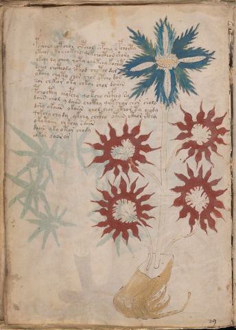

# Voynich Speculative Procedural Protocol — f16v

IMPORTANT: this is NOT a real or validated translation of the Voynich Manuscript. It is a speculative/procedural model that interprets EVA using a user-defined grammar to generate experimental recipes using safe, known edible substitutes.

This file is generated automatically from IVTFF/EVA transliteration plus a user-defined procedural grammar.



## Page / Folio
- currier: A
- folio: f16v
- page_number: 30
- section: herbal

## EVA Text (Transliteration)
```text
pchroiin otchor chpchol chpchey s pchocty
ytchor y ky chokchy qokchocthor shory
ykchy dy choy qoty chy kchy koshet
dchol chcthody cphod chotol dal
ytchy chyty chor chol ytchy dan
sor ch k[a:o]r oty chkar chol dairin
pchocthy chypchy qotchy chcfhhy sy
daiin chol y daiin chcthy qot char chor sholo
dshy okaiin okaiin chol chor cthor ty chody
qokchy chy dy ykchy chckhy otain cthor [cth:ith]y
okytaiin chkchy saiin
daiin yky otor chody
sokar oaorar
```

## Domain Context (Heuristic; Not a Translation)

This section summarizes recurring **basewords** in this IVTFF domain and shows simple substring evidence that the token markers used by the procedural grammar occur inside frequent words.

Any Italian anagram / English gloss is a best-effort lexicon match, not a decipherment.


### Associated basewords (non-generic; top by frequency in this domain)
- `paiin` (count=477) → Italian anagram `piani`; English: plans (arrangements)
- `okaiin` (count=59) → Italian anagram `coniai`; English: [n/a]
- `qokep` (count=41) → Italian anagram `pecco`; English: [n/a]
- `saiin` (count=40) → Italian anagram `asini`; English: [n/a]
- `kaiin` (count=40) → Italian anagram `acini`; English: [n/a]
- `chaiin` (count=39) → Italian anagram `acini`; English: [n/a]
- `qokaiin` (count=34) → Italian anagram `ciancio`; English: [n/a]
- `qokar` (count=29) → Italian anagram `carco`; English: [n/a]
- `opaiin` (count=29) → Italian anagram `inopia`; English: poverty
- `otchol` (count=25) → Italian anagram `colto`; English: cultivated
- `chopaiin` (count=24) → Italian anagram `apocini`; English: [n/a]
- `qotol` (count=20) → Italian anagram `colto`; English: cultivated
- `okain` (count=19) → Italian anagram `acino`; English: a berry
- `qotor` (count=18) → Italian anagram `corto`; English: short
- `qopaiin` (count=15) → Italian anagram `apocini`; English: [n/a]

### Marker evidence (substring in frequent basewords)
- `qo`: 58 basewords; examples: `qotch`, `qok`, `qot`, `qokch`, `qokep`, `qokaiin`
- `q`: 59 basewords; examples: `qotch`, `qok`, `qot`, `qokch`, `qokep`, `qokaiin`
- `o`: 274 basewords; examples: `chol`, `o`, `chor`, `or`, `shol`, `ol`
- `k`: 146 basewords; examples: `ok`, `k`, `okaiin`, `kch`, `chckh`, `qok`
- `t`: 101 basewords; examples: `cth`, `ot`, `t`, `qotch`, `cthol`, `qot`
- `p`: 152 basewords; examples: `paiin`, `p`, `par`, `pain`, `pal`, `chep`
- `ch`: 145 basewords; examples: `chol`, `chor`, `ch`, `che`, `chep`, `cho`
- `sh`: 51 basewords; examples: `shol`, `sh`, `sho`, `shor`, `she`, `shep`
- `f`: 2 basewords; examples: `fchep`, `f`
- `cth`: 18 basewords; examples: `cth`, `cthol`, `cthor`, `cthe`, `chcth`, `ctho`
- `ckh`: 18 basewords; examples: `chckh`, `ckh`, `ckhe`, `ckhol`, `shckh`, `checkh`
- `cph`: 3 basewords; examples: `cph`, `cphol`, `cphe`
- `iin`: 39 basewords; examples: `paiin`, `aiin`, `okaiin`, `saiin`, `kaiin`, `chaiin`
- `aiin`: 31 basewords; examples: `paiin`, `aiin`, `okaiin`, `saiin`, `kaiin`, `chaiin`

## Recipes Index (This Page)
- [f16v.1,@P0](#f16v-1-f16v-1-p0)
- [f16v.2,+P0](#f16v-2-f16v-2-p0)
- [f16v.3,+P0](#f16v-3-f16v-3-p0)
- [f16v.4,+P0](#f16v-4-f16v-4-p0)
- [f16v.5,+P0](#f16v-5-f16v-5-p0)
- [f16v.6,+P0](#f16v-6-f16v-6-p0)
- [f16v.7,+P0](#f16v-7-f16v-7-p0)
- [f16v.8,+P0](#f16v-8-f16v-8-p0)
- [f16v.9,+P0](#f16v-9-f16v-9-p0)
- [f16v.10,+P0](#f16v-10-f16v-10-p0)
- [f16v.11,+P0](#f16v-11-f16v-11-p0)
- [f16v.12,+P0](#f16v-12-f16v-12-p0)
- [f16v.13,+P0](#f16v-13-f16v-13-p0)

## Line Glosses (Procedural Gloss Only; Not a Translation)

<a id="f16v-1-f16v-1-p0"></a>

### f16v.1,@P0

EVA (original line):
```text
pchroiin otchor chpchol chpchey s pchocty
```

English structural gloss (generated):

- pchroiin: tokens: p ch r o iin → connectors: r → vowel_run: ii (level 2; class i) → suffix: iin
- otchor: tokens: o t ch o r → connectors: r (lexicon-context: `otchor` → `corto`; short)
- chpchol: tokens: ch p ch o l → connectors: l
- chpchey: tokens: ch p ch e → vowel_run: e (level 1; class e)
- s: tokens: s → connectors: s
- pchocty: tokens: p ch o c t

<a id="f16v-2-f16v-2-p0"></a>

### f16v.2,+P0

EVA (original line):
```text
ytchor y ky chokchy qokchocthor shory
```

English structural gloss (generated):

- ytchor: tokens: t ch o r → connectors: r
- y: [unparsed]
- ky: tokens: k
- chokchy: tokens: ch o k ch
- qokchocthor: tokens: qo k ch o cth o r → connectors: r
- shory: tokens: sh o r → connectors: r

<a id="f16v-3-f16v-3-p0"></a>

### f16v.3,+P0

EVA (original line):
```text
ykchy dy choy qoty chy kchy koshet
```

English structural gloss (generated):

- ykchy: tokens: k ch
- dy: tokens: p
- choy: tokens: ch o
- qoty: tokens: qo t
- chy: tokens: ch
- kchy: tokens: k ch
- koshet: tokens: k o sh e t → vowel_run: e (level 1; class e)

<a id="f16v-4-f16v-4-p0"></a>

### f16v.4,+P0

EVA (original line):
```text
dchol chcthody cphod chotol dal
```

English structural gloss (generated):

- dchol: tokens: p ch o l → connectors: l
- chcthody: tokens: ch cth o p
- cphod: tokens: cph o p
- chotol: tokens: ch o t o l → connectors: l
- dal: tokens: p a l → connectors: l → vowel_run: a (level 1; class a)

<a id="f16v-5-f16v-5-p0"></a>

### f16v.5,+P0

EVA (original line):
```text
ytchy chyty chor chol ytchy dan
```

English structural gloss (generated):

- ytchy: tokens: t ch
- chyty: tokens: ch t
- chor: tokens: ch o r → connectors: r
- chol: tokens: ch o l → connectors: l
- ytchy: tokens: t ch
- dan: tokens: p a n → connectors: n → vowel_run: a (level 1; class a)

<a id="f16v-6-f16v-6-p0"></a>

### f16v.6,+P0

EVA (original line):
```text
sor ch k[a:o]r oty chkar chol dairin
```

English structural gloss (generated):

- sor: tokens: s o r → connectors: s r
- ch: tokens: ch
- k: tokens: k
- a: tokens: a → vowel_run: a (level 1; class a)
- o: tokens: o
- r: tokens: r → connectors: r
- oty: tokens: o t
- chkar: tokens: ch k a r → connectors: r → vowel_run: a (level 1; class a)
- chol: tokens: ch o l → connectors: l
- dairin: tokens: p a i r i n → connectors: r n → vowel_run: a (level 1; class a)

<a id="f16v-7-f16v-7-p0"></a>

### f16v.7,+P0

EVA (original line):
```text
pchocthy chypchy qotchy chcfhhy sy
```

English structural gloss (generated):

- pchocthy: tokens: p ch o cth
- chypchy: tokens: ch p ch
- qotchy: tokens: qo t ch
- chcfhhy: tokens: ch cfh h → unmodeled_tokens: h
- sy: tokens: s → connectors: s

<a id="f16v-8-f16v-8-p0"></a>

### f16v.8,+P0

EVA (original line):
```text
daiin chol y daiin chcthy qot char chor sholo
```

English structural gloss (generated):

- daiin: tokens: p aiin → vowel_run: a (level 1; class a) → suffix: aiin (lexicon-context: `paiin` → `piani`; plans (arrangements))
- chol: tokens: ch o l → connectors: l
- y: [unparsed]
- daiin: tokens: p aiin → vowel_run: a (level 1; class a) → suffix: aiin (lexicon-context: `paiin` → `piani`; plans (arrangements))
- chcthy: tokens: ch cth
- qot: tokens: qo t
- char: tokens: ch a r → connectors: r → vowel_run: a (level 1; class a)
- chor: tokens: ch o r → connectors: r
- sholo: tokens: sh o l o → connectors: l

<a id="f16v-9-f16v-9-p0"></a>

### f16v.9,+P0

EVA (original line):
```text
dshy okaiin okaiin chol chor cthor ty chody
```

English structural gloss (generated):

- dshy: tokens: p sh
- okaiin: tokens: o k aiin → vowel_run: a (level 1; class a) → suffix: aiin (lexicon-context: `okaiin` → `coniai`; [n/a])
- okaiin: tokens: o k aiin → vowel_run: a (level 1; class a) → suffix: aiin (lexicon-context: `okaiin` → `coniai`; [n/a])
- chol: tokens: ch o l → connectors: l
- chor: tokens: ch o r → connectors: r
- cthor: tokens: cth o r → connectors: r
- ty: tokens: t
- chody: tokens: ch o p

<a id="f16v-10-f16v-10-p0"></a>

### f16v.10,+P0

EVA (original line):
```text
qokchy chy dy ykchy chckhy otain cthor [cth:ith]y
```

English structural gloss (generated):

- qokchy: tokens: qo k ch
- chy: tokens: ch
- dy: tokens: p
- ykchy: tokens: k ch
- chckhy: tokens: ch ckh
- otain: tokens: o t a i n → connectors: n → vowel_run: a (level 1; class a) (lexicon-context: `otain` → `notai`; [n/a])
- cthor: tokens: cth o r → connectors: r
- cth: tokens: cth
- ith: tokens: i t h → vowel_run: i (level 1; class i) → unmodeled_tokens: h
- y: [unparsed]

<a id="f16v-11-f16v-11-p0"></a>

### f16v.11,+P0

EVA (original line):
```text
okytaiin chkchy saiin
```

English structural gloss (generated):

- okytaiin: tokens: o k t aiin → vowel_run: a (level 1; class a) → suffix: aiin
- chkchy: tokens: ch k ch
- saiin: tokens: s aiin → connectors: s → vowel_run: a (level 1; class a) → suffix: aiin (lexicon-context: `saiin` → `asini`; [n/a])

<a id="f16v-12-f16v-12-p0"></a>

### f16v.12,+P0

EVA (original line):
```text
daiin yky otor chody
```

English structural gloss (generated):

- daiin: tokens: p aiin → vowel_run: a (level 1; class a) → suffix: aiin (lexicon-context: `paiin` → `piani`; plans (arrangements))
- yky: tokens: k
- otor: tokens: o t o r → connectors: r
- chody: tokens: ch o p

<a id="f16v-13-f16v-13-p0"></a>

### f16v.13,+P0

EVA (original line):
```text
sokar oaorar
```

English structural gloss (generated):

- sokar: tokens: s o k a r → connectors: s r → vowel_run: a (level 1; class a)
- oaorar: tokens: o a o r a r → connectors: r r → vowel_run: a (level 1; class a)
