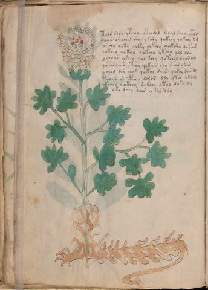

# Voynich Speculative Procedural Protocol — f18v

IMPORTANT: this is NOT a real or validated translation of the Voynich Manuscript. It is a speculative/procedural model that interprets EVA using a user-defined grammar to generate experimental recipes using safe, known edible substitutes.

This file is generated automatically from IVTFF/EVA transliteration plus a user-defined procedural grammar.



## Page / Folio
- currier: A
- folio: f18v
- page_number: 34
- section: herbal

## EVA Text (Transliteration)
```text
told shor ytshy otchdal dchal dchy ytdg
qoeees or oaiin shy@140; okshy qokchy qokchy s g
orshy qoky qoky chkchy qokshy qokam
qotchy qokay qokchy ykcho ydl dar
ychoees ykchy qol kchy qotchol daiir om
qotor chor otchy qokeees chy s ar ykar
ychol dor chod qokol daiin qokol dar dy
tolol sh cphoy daror ddy ytor ykam
okchor qotchy qokchy ytol doky dy
yk[o:a] dshy dair ykol dom
```

## Domain Context (Heuristic; Not a Translation)

This section summarizes recurring **basewords** in this IVTFF domain and shows simple substring evidence that the token markers used by the procedural grammar occur inside frequent words.

Any Italian anagram / English gloss is a best-effort lexicon match, not a decipherment.


### Associated basewords (non-generic; top by frequency in this domain)
- `daiin` (count=461) → Italian anagram `piani`; English: plans (arrangements)
- `okaiin` (count=59) → Italian anagram `coniai`; English: [n/a]
- `chaiin` (count=39) → Italian anagram `acini`; English: [n/a]
- `saiin` (count=37) → Italian anagram `asini`; English: [n/a]
- `qokaiin` (count=34) → Italian anagram `ciancio`; English: [n/a]
- `qokar` (count=29) → Italian anagram `carco`; English: [n/a]
- `odaiin` (count=27) → Italian anagram `inopia`; English: poverty
- `otchol` (count=25) → Italian anagram `colto`; English: cultivated
- `kaiin` (count=24) → Italian anagram `acini`; English: [n/a]
- `chodaiin` (count=24) → Italian anagram `apocini`; English: [n/a]
- `qotol` (count=20) → Italian anagram `colto`; English: cultivated
- `okain` (count=19) → Italian anagram `acino`; English: a berry
- `qotor` (count=18) → Italian anagram `corto`; English: short
- `ykaiin` (count=16) → Italian anagram `acini`; English: [n/a]
- `qodaiin` (count=15) → Italian anagram `apocini`; English: [n/a]

### Marker evidence (substring in frequent basewords)
- `qo`: 57 basewords; examples: `qotchy`, `qokchy`, `qokedy`, `qokaiin`, `qoky`, `qokol`
- `q`: 58 basewords; examples: `qotchy`, `qokchy`, `qokedy`, `qokaiin`, `qoky`, `qokol`
- `o`: 252 basewords; examples: `chol`, `o`, `chor`, `or`, `shol`, `ol`
- `k`: 142 basewords; examples: `okaiin`, `oky`, `chckhy`, `qokchy`, `qokedy`, `okal`
- `t`: 102 basewords; examples: `cthy`, `oty`, `qotchy`, `cthol`, `cthor`, `otaiin`
- `p`: 15 basewords; examples: `cphy`, `ypchedy`, `opchy`, `opchey`, `pchor`, `qopchy`
- `ch`: 138 basewords; examples: `chol`, `chor`, `chy`, `chey`, `chedy`, `chdy`
- `sh`: 46 basewords; examples: `shol`, `sho`, `shy`, `shor`, `shey`, `shedy`
- `f`: 1 basewords; examples: `f`
- `cth`: 17 basewords; examples: `cthy`, `cthol`, `cthor`, `cthey`, `chcthy`, `ctho`
- `ckh`: 15 basewords; examples: `chckhy`, `ckhy`, `ckhol`, `ckhey`, `checkhy`, `shckhy`
- `cph`: 2 basewords; examples: `cphy`, `cphol`
- `dy`: 78 basewords; examples: `dy`, `chedy`, `chdy`, `chody`, `qokedy`, `shedy`
- `iin`: 39 basewords; examples: `daiin`, `aiin`, `okaiin`, `chaiin`, `saiin`, `qokaiin`
- `aiin`: 32 basewords; examples: `daiin`, `aiin`, `okaiin`, `chaiin`, `saiin`, `qokaiin`

## Recipes Index (This Page)
- [f18v.1,@P0](#f18v-1-f18v-1-p0)
- [f18v.2,+P0](#f18v-2-f18v-2-p0)
- [f18v.3,+P0](#f18v-3-f18v-3-p0)
- [f18v.4,+P0](#f18v-4-f18v-4-p0)
- [f18v.5,+P0](#f18v-5-f18v-5-p0)
- [f18v.6,+P0](#f18v-6-f18v-6-p0)
- [f18v.7,+P0](#f18v-7-f18v-7-p0)
- [f18v.8,+P0](#f18v-8-f18v-8-p0)
- [f18v.9,+P0](#f18v-9-f18v-9-p0)
- [f18v.10,+P0](#f18v-10-f18v-10-p0)

## Line Glosses (Procedural Gloss Only; Not a Translation)

<a id="f18v-1-f18v-1-p0"></a>

### f18v.1,@P0

EVA: told shor ytshy otchdal dchal dchy ytdg

Direct Gloss (Procedural, Not a Real Translation):
- told: tokens: t o l p → connectors: l
- shor: tokens: sh o r → connectors: r
- ytshy: tokens: t sh
- otchdal: tokens: o t ch p a l → connectors: l → vowel_run: a (level 1; class a)
- dchal: tokens: p ch a l → connectors: l → vowel_run: a (level 1; class a)
- dchy: tokens: p ch
- ytdg: tokens: t p g

<a id="f18v-2-f18v-2-p0"></a>

### f18v.2,+P0

EVA: qoeees or oaiin shy@140; okshy qokchy qokchy s g

Direct Gloss (Procedural, Not a Real Translation):
- qoeees: tokens: qo eee s → connectors: s → vowel_run: eee (level 3; class e)
- or: tokens: o r → connectors: r
- oaiin: tokens: o aiin → vowel_run: a (level 1; class a) → suffix: aiin
- shy: tokens: sh
- okshy: tokens: o k sh
- qokchy: tokens: qo k ch
- qokchy: tokens: qo k ch
- s: tokens: s → connectors: s
- g: tokens: g

<a id="f18v-3-f18v-3-p0"></a>

### f18v.3,+P0

EVA: orshy qoky qoky chkchy qokshy qokam

Direct Gloss (Procedural, Not a Real Translation):
- orshy: tokens: o r sh → connectors: r
- qoky: tokens: qo k
- qoky: tokens: qo k
- chkchy: tokens: ch k ch
- qokshy: tokens: qo k sh
- qokam: tokens: qo k a m → connectors: m → vowel_run: a (level 1; class a)

<a id="f18v-4-f18v-4-p0"></a>

### f18v.4,+P0

EVA: qotchy qokay qokchy ykcho ydl dar

Direct Gloss (Procedural, Not a Real Translation):
- qotchy: tokens: qo t ch
- qokay: tokens: qo k a → vowel_run: a (level 1; class a)
- qokchy: tokens: qo k ch
- ykcho: tokens: k ch o
- ydl: tokens: p l → connectors: l
- dar: tokens: p a r → connectors: r → vowel_run: a (level 1; class a)

<a id="f18v-5-f18v-5-p0"></a>

### f18v.5,+P0

EVA: ychoees ykchy qol kchy qotchol daiir om

Direct Gloss (Procedural, Not a Real Translation):
- ychoees: tokens: ch o ee s → connectors: s → vowel_run: ee (level 2; class e)
- ykchy: tokens: k ch
- qol: tokens: qo l → connectors: l
- kchy: tokens: k ch
- qotchol: tokens: qo t ch o l → connectors: l (lexicon-context: `otchol` → `colto`; cultivated)
- daiir: tokens: p a ii r → connectors: r → vowel_run: a (level 1; class a) (lexicon-context: `daiir` → `aprii`; [n/a])
- om: tokens: o m → connectors: m

<a id="f18v-6-f18v-6-p0"></a>

### f18v.6,+P0

EVA: qotor chor otchy qokeees chy s ar ykar

Direct Gloss (Procedural, Not a Real Translation):
- qotor: tokens: qo t o r → connectors: r (lexicon-context: `qotor` → `corto`; short)
- chor: tokens: ch o r → connectors: r
- otchy: tokens: o t ch
- qokeees: tokens: qo k eee s → connectors: s → vowel_run: eee (level 3; class e)
- chy: tokens: ch
- s: tokens: s → connectors: s
- ar: tokens: a r → connectors: r → vowel_run: a (level 1; class a)
- ykar: tokens: k a r → connectors: r → vowel_run: a (level 1; class a)

<a id="f18v-7-f18v-7-p0"></a>

### f18v.7,+P0

EVA: ychol dor chod qokol daiin qokol dar dy

Direct Gloss (Procedural, Not a Real Translation):
- ychol: tokens: ch o l → connectors: l
- dor: tokens: p o r → connectors: r
- chod: tokens: ch o p
- qokol: tokens: qo k o l → connectors: l
- daiin: tokens: p aiin → vowel_run: a (level 1; class a) → suffix: aiin (lexicon-context: `daiin` → `piani`; plans (arrangements))
- qokol: tokens: qo k o l → connectors: l
- dar: tokens: p a r → connectors: r → vowel_run: a (level 1; class a)
- dy: tokens: p

<a id="f18v-8-f18v-8-p0"></a>

### f18v.8,+P0

EVA: tolol sh cphoy daror ddy ytor ykam

Direct Gloss (Procedural, Not a Real Translation):
- tolol: tokens: t o l o l → connectors: l l
- sh: tokens: sh
- cphoy: tokens: cph o
- daror: tokens: p a r o r → connectors: r r → vowel_run: a (level 1; class a)
- ddy: tokens: p p
- ytor: tokens: t o r → connectors: r
- ykam: tokens: k a m → connectors: m → vowel_run: a (level 1; class a)

<a id="f18v-9-f18v-9-p0"></a>

### f18v.9,+P0

EVA: okchor qotchy qokchy ytol doky dy

Direct Gloss (Procedural, Not a Real Translation):
- okchor: tokens: o k ch o r → connectors: r (lexicon-context: `okchor` → `corco`; [n/a])
- qotchy: tokens: qo t ch
- qokchy: tokens: qo k ch
- ytol: tokens: t o l → connectors: l
- doky: tokens: p o k
- dy: tokens: p

<a id="f18v-10-f18v-10-p0"></a>

### f18v.10,+P0

EVA: yk[o:a] dshy dair ykol dom

Direct Gloss (Procedural, Not a Real Translation):
- yk: tokens: k
- o: tokens: o
- a: tokens: a → vowel_run: a (level 1; class a)
- dshy: tokens: p sh
- dair: tokens: p a i r → connectors: r → vowel_run: a (level 1; class a)
- ykol: tokens: k o l → connectors: l
- dom: tokens: p o m → connectors: m
