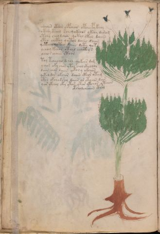

# Voynich Speculative Herbal Ferment Recipe — f19v

IMPORTANT: this is NOT a real or validated translation of the Voynich Manuscript. It is a speculative/procedural model that interprets EVA using a user-defined grammar to generate experimental recipes using safe, known edible substitutes.

This file is generated automatically from IVTFF/EVA transliteration plus a user-defined procedural grammar.



## Page / Folio
- currier: A
- folio: f19v
- page_number: 36
- section: herbal

## EVA Text (Transliteration)
```text
pochaiin cthor chpcheos opchey py kchy
qokchy kchol sor qokchos ykchy darom
otchy chol daiin qotol ytol daiiin
ytch chcthy qotol daiin daiin
qotchy qoteey daiin doty qot
ychoy kchor cthol chocthy s
ycho [r:s] chaiin cthor
toy tchey qo dchol qokchs dom
ychor oky chor yt[o:a]l chol oky ddor
daiin chor daiin qoko[r:n] y okchan
qotol d[o:a]r okchor daiin cthor otam
otch okchodshy daiin or otaiin dai[s:r]
yees ykchol oty ytor ytar ytchor ytaiin
otchol cheaiin cthol
```

## Recipes Index (This Page)
- [f19v.1,@P0](#f19v-1-f19v-1-p0)
- [f19v.2,+P0](#f19v-2-f19v-2-p0)
- [f19v.3,+P0](#f19v-3-f19v-3-p0)
- [f19v.4,+P0](#f19v-4-f19v-4-p0)
- [f19v.5,+P0](#f19v-5-f19v-5-p0)
- [f19v.6,+P0](#f19v-6-f19v-6-p0)
- [f19v.7,+P0](#f19v-7-f19v-7-p0)
- [f19v.8,+P0](#f19v-8-f19v-8-p0)
- [f19v.9,+P0](#f19v-9-f19v-9-p0)
- [f19v.10,+P0](#f19v-10-f19v-10-p0)
- [f19v.11,+P0](#f19v-11-f19v-11-p0)
- [f19v.12,+P0](#f19v-12-f19v-12-p0)
- [f19v.13,+P0](#f19v-13-f19v-13-p0)
- [f19v.14,+Pr](#f19v-14-f19v-14-pr)

## Line Glosses (Procedural Gloss Only; Not a Translation)

<a id="f19v-1-f19v-1-p0"></a>

### f19v.1,@P0

EVA: pochaiin cthor chpcheos opchey py kchy

Direct Gloss (Procedural, Not a Real Translation):
- pochaiin: add main plant (safe substitute) → mix / transfer → start fermentation (yeast) → duration level 1 → state: fermentation start → long fermentation / aging phase
- cthor: mix / transfer → add complex herbal compound (safe blend)
- chpcheos: add main plant (safe substitute) → mix / transfer → start fermentation (yeast) → duration level 1 → state: active extraction
- opchey: add main plant (safe substitute) → mix / transfer → start fermentation (yeast) → duration level 1 → state: active extraction
- py: start fermentation (yeast)
- kchy: add fermentable sugars → add main plant (safe substitute)

<a id="f19v-2-f19v-2-p0"></a>

### f19v.2,+P0

EVA: qokchy kchol sor qokchos ykchy darom

Direct Gloss (Procedural, Not a Real Translation):
- qokchy: prepare liquid base → add fermentable sugars → add main plant (safe substitute)
- kchol: add fermentable sugars → add main plant (safe substitute) → mix / transfer
- sor: mix / transfer
- qokchos: prepare liquid base → add fermentable sugars → add main plant (safe substitute) → mix / transfer
- ykchy: add fermentable sugars → add main plant (safe substitute)
- darom: mix / transfer → start fermentation (yeast) → duration level 1 → state: fermentation start

<a id="f19v-3-f19v-3-p0"></a>

### f19v.3,+P0

EVA: otchy chol daiin qotol ytol daiiin

Direct Gloss (Procedural, Not a Real Translation):
- otchy: apply heat/cooking → add main plant (safe substitute) → mix / transfer
- chol: add main plant (safe substitute) → mix / transfer
- daiin: start fermentation (yeast) → duration level 1 → state: fermentation start → long fermentation / aging phase
- qotol: prepare liquid base → apply heat/cooking → mix / transfer
- ytol: apply heat/cooking → mix / transfer
- daiiin: start fermentation (yeast) → duration level 1 → state: fermentation start → medium fermentation phase

<a id="f19v-4-f19v-4-p0"></a>

### f19v.4,+P0

EVA: ytch chcthy qotol daiin daiin

Direct Gloss (Procedural, Not a Real Translation):
- ytch: apply heat/cooking → add main plant (safe substitute)
- chcthy: add main plant (safe substitute) → add complex herbal compound (safe blend)
- qotol: prepare liquid base → apply heat/cooking → mix / transfer
- daiin: start fermentation (yeast) → duration level 1 → state: fermentation start → long fermentation / aging phase
- daiin: start fermentation (yeast) → duration level 1 → state: fermentation start → long fermentation / aging phase

<a id="f19v-5-f19v-5-p0"></a>

### f19v.5,+P0

EVA: qotchy qoteey daiin doty qot

Direct Gloss (Procedural, Not a Real Translation):
- qotchy: prepare liquid base → apply heat/cooking → add main plant (safe substitute)
- qoteey: prepare liquid base → apply heat/cooking → duration level 2 → state: active extraction
- daiin: start fermentation (yeast) → duration level 1 → state: fermentation start → long fermentation / aging phase
- doty: apply heat/cooking → mix / transfer → start fermentation (yeast)
- qot: prepare liquid base → apply heat/cooking

<a id="f19v-6-f19v-6-p0"></a>

### f19v.6,+P0

EVA: ychoy kchor cthol chocthy s

Direct Gloss (Procedural, Not a Real Translation):
- ychoy: add main plant (safe substitute) → mix / transfer
- kchor: add fermentable sugars → add main plant (safe substitute) → mix / transfer
- cthol: mix / transfer → add complex herbal compound (safe blend)
- chocthy: add main plant (safe substitute) → mix / transfer → add complex herbal compound (safe blend)
- s: [unparsed]

<a id="f19v-7-f19v-7-p0"></a>

### f19v.7,+P0

EVA: ycho [r:s] chaiin cthor

Direct Gloss (Procedural, Not a Real Translation):
- ycho: add main plant (safe substitute) → mix / transfer
- r: [unparsed]
- s: [unparsed]
- chaiin: add main plant (safe substitute) → duration level 1 → state: fermentation start → long fermentation / aging phase
- cthor: mix / transfer → add complex herbal compound (safe blend)

<a id="f19v-8-f19v-8-p0"></a>

### f19v.8,+P0

EVA: toy tchey qo dchol qokchs dom

Direct Gloss (Procedural, Not a Real Translation):
- toy: apply heat/cooking → mix / transfer
- tchey: apply heat/cooking → add main plant (safe substitute) → duration level 1 → state: active extraction
- qo: prepare liquid base
- dchol: add main plant (safe substitute) → mix / transfer → start fermentation (yeast)
- qokchs: prepare liquid base → add fermentable sugars → add main plant (safe substitute)
- dom: mix / transfer → start fermentation (yeast)

<a id="f19v-9-f19v-9-p0"></a>

### f19v.9,+P0

EVA: ychor oky chor yt[o:a]l chol oky ddor

Direct Gloss (Procedural, Not a Real Translation):
- ychor: add main plant (safe substitute) → mix / transfer
- oky: add fermentable sugars → mix / transfer
- chor: add main plant (safe substitute) → mix / transfer
- yt: apply heat/cooking
- o: mix / transfer
- a: duration level 1 → state: fermentation start
- l: [unparsed]
- chol: add main plant (safe substitute) → mix / transfer
- oky: add fermentable sugars → mix / transfer
- ddor: mix / transfer → start fermentation (yeast)

<a id="f19v-10-f19v-10-p0"></a>

### f19v.10,+P0

EVA: daiin chor daiin qoko[r:n] y okchan

Direct Gloss (Procedural, Not a Real Translation):
- daiin: start fermentation (yeast) → duration level 1 → state: fermentation start → long fermentation / aging phase
- chor: add main plant (safe substitute) → mix / transfer
- daiin: start fermentation (yeast) → duration level 1 → state: fermentation start → long fermentation / aging phase
- qoko: prepare liquid base → add fermentable sugars → mix / transfer
- r: [unparsed]
- n: [unparsed]
- y: [unparsed]
- okchan: add fermentable sugars → add main plant (safe substitute) → mix / transfer → duration level 1 → state: fermentation start

<a id="f19v-11-f19v-11-p0"></a>

### f19v.11,+P0

EVA: qotol d[o:a]r okchor daiin cthor otam

Direct Gloss (Procedural, Not a Real Translation):
- qotol: prepare liquid base → apply heat/cooking → mix / transfer
- d: start fermentation (yeast)
- o: mix / transfer
- a: duration level 1 → state: fermentation start
- r: [unparsed]
- okchor: add fermentable sugars → add main plant (safe substitute) → mix / transfer
- daiin: start fermentation (yeast) → duration level 1 → state: fermentation start → long fermentation / aging phase
- cthor: mix / transfer → add complex herbal compound (safe blend)
- otam: apply heat/cooking → mix / transfer → duration level 1 → state: fermentation start

<a id="f19v-12-f19v-12-p0"></a>

### f19v.12,+P0

EVA: otch okchodshy daiin or otaiin dai[s:r]

Direct Gloss (Procedural, Not a Real Translation):
- otch: apply heat/cooking → add main plant (safe substitute) → mix / transfer
- okchodshy: add fermentable sugars → add main plant (safe substitute) → add secondary herb (safe substitute) → mix / transfer → start fermentation (yeast)
- daiin: start fermentation (yeast) → duration level 1 → state: fermentation start → long fermentation / aging phase
- or: mix / transfer
- otaiin: apply heat/cooking → mix / transfer → duration level 1 → state: fermentation start → long fermentation / aging phase
- dai: start fermentation (yeast) → duration level 1 → state: fermentation start
- s: [unparsed]
- r: [unparsed]

<a id="f19v-13-f19v-13-p0"></a>

### f19v.13,+P0

EVA: yees ykchol oty ytor ytar ytchor ytaiin

Direct Gloss (Procedural, Not a Real Translation):
- yees: duration level 2 → state: active extraction
- ykchol: add fermentable sugars → add main plant (safe substitute) → mix / transfer
- oty: apply heat/cooking → mix / transfer
- ytor: apply heat/cooking → mix / transfer
- ytar: apply heat/cooking → duration level 1 → state: fermentation start
- ytchor: apply heat/cooking → add main plant (safe substitute) → mix / transfer
- ytaiin: apply heat/cooking → duration level 1 → state: fermentation start → long fermentation / aging phase

<a id="f19v-14-f19v-14-pr"></a>

### f19v.14,+Pr

EVA: otchol cheaiin cthol

Direct Gloss (Procedural, Not a Real Translation):
- otchol: apply heat/cooking → add main plant (safe substitute) → mix / transfer
- cheaiin: add main plant (safe substitute) → duration level 1 → state: active extraction → long fermentation / aging phase
- cthol: mix / transfer → add complex herbal compound (safe blend)
