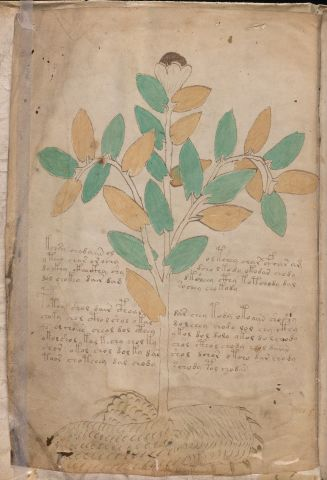

# Voynich Speculative Procedural Protocol — f1v

IMPORTANT: this is NOT a real or validated translation of the Voynich Manuscript. It is a speculative/procedural model that interprets EVA using a user-defined grammar to generate experimental recipes using safe, known edible substitutes.

This file is generated automatically from IVTFF/EVA transliteration plus a user-defined procedural grammar.



## Page / Folio
- currier: A
- folio: f1v
- page_number: 2
- section: herbal

## EVA Text (Transliteration)
```text
kchsy chydaiin ol o l tchey char cfhar am
yteey char or ochy dcho lkody okodar chody
da ckhy ckhockhy shy dksheey cthy kotchody dal
dol chokeo dair dam sochey chokody
potoy shol dair cphoal dar chey tody otoaiin shoshy
choky chol ctho l shol okal dolchey chodo lol chy cthy
qo ol choees cheol dol cthey ykol dol dolo ykol do lchiody
okolshol kol kechy chol ky chol cthol chody chol daiin
shor okol chol dol ky dar shol dchor o tcho dar [sh:@209;h]ody
taor chotchey dal chody schody pol chodar
```

## Domain Context (Heuristic; Not a Translation)

This section summarizes recurring **basewords** in this IVTFF domain and shows simple substring evidence that the token markers used by the procedural grammar occur inside frequent words.

Any Italian anagram / English gloss is a best-effort lexicon match, not a decipherment.


### Associated basewords (non-generic; top by frequency in this domain)
- `paiin` (count=477) → Italian anagram `piani`; English: plans (arrangements)
- `okaiin` (count=59) → Italian anagram `coniai`; English: [n/a]
- `qokep` (count=41) → Italian anagram `pecco`; English: [n/a]
- `saiin` (count=40) → Italian anagram `asini`; English: [n/a]
- `kaiin` (count=40) → Italian anagram `acini`; English: [n/a]
- `chaiin` (count=39) → Italian anagram `acini`; English: [n/a]
- `qokaiin` (count=34) → Italian anagram `ciancio`; English: [n/a]
- `qokar` (count=29) → Italian anagram `carco`; English: [n/a]
- `opaiin` (count=29) → Italian anagram `inopia`; English: poverty
- `otchol` (count=25) → Italian anagram `colto`; English: cultivated
- `chopaiin` (count=24) → Italian anagram `apocini`; English: [n/a]
- `qotol` (count=20) → Italian anagram `colto`; English: cultivated
- `okain` (count=19) → Italian anagram `acino`; English: a berry
- `qotor` (count=18) → Italian anagram `corto`; English: short
- `qopaiin` (count=15) → Italian anagram `apocini`; English: [n/a]

### Marker evidence (substring in frequent basewords)
- `qo`: 58 basewords; examples: `qotch`, `qok`, `qot`, `qokch`, `qokep`, `qokaiin`
- `q`: 59 basewords; examples: `qotch`, `qok`, `qot`, `qokch`, `qokep`, `qokaiin`
- `o`: 274 basewords; examples: `chol`, `o`, `chor`, `or`, `shol`, `ol`
- `k`: 146 basewords; examples: `ok`, `k`, `okaiin`, `kch`, `chckh`, `qok`
- `t`: 101 basewords; examples: `cth`, `ot`, `t`, `qotch`, `cthol`, `qot`
- `p`: 152 basewords; examples: `paiin`, `p`, `par`, `pain`, `pal`, `chep`
- `ch`: 145 basewords; examples: `chol`, `chor`, `ch`, `che`, `chep`, `cho`
- `sh`: 51 basewords; examples: `shol`, `sh`, `sho`, `shor`, `she`, `shep`
- `f`: 2 basewords; examples: `fchep`, `f`
- `cth`: 18 basewords; examples: `cth`, `cthol`, `cthor`, `cthe`, `chcth`, `ctho`
- `ckh`: 18 basewords; examples: `chckh`, `ckh`, `ckhe`, `ckhol`, `shckh`, `checkh`
- `cph`: 3 basewords; examples: `cph`, `cphol`, `cphe`
- `iin`: 39 basewords; examples: `paiin`, `aiin`, `okaiin`, `saiin`, `kaiin`, `chaiin`
- `aiin`: 31 basewords; examples: `paiin`, `aiin`, `okaiin`, `saiin`, `kaiin`, `chaiin`

## Recipes Index (This Page)
- [f1v.1,@P0](#f1v-1-f1v-1-p0)
- [f1v.2,+P0](#f1v-2-f1v-2-p0)
- [f1v.3,+P0](#f1v-3-f1v-3-p0)
- [f1v.4,+P0](#f1v-4-f1v-4-p0)
- [f1v.5,+P0](#f1v-5-f1v-5-p0)
- [f1v.6,+P0](#f1v-6-f1v-6-p0)
- [f1v.7,+P0](#f1v-7-f1v-7-p0)
- [f1v.8,+P0](#f1v-8-f1v-8-p0)
- [f1v.9,+P0](#f1v-9-f1v-9-p0)
- [f1v.10,+P0](#f1v-10-f1v-10-p0)

## Line Glosses (Procedural Gloss Only; Not a Translation)

<a id="f1v-1-f1v-1-p0"></a>

### f1v.1,@P0

EVA: kchsy chydaiin ol o l tchey char cfhar am

Direct Gloss (Procedural, Not a Real Translation):
- kchsy: tokens: k ch s → connectors: s
- chydaiin: tokens: ch p aiin → vowel_run: a (level 1; class a) → suffix: aiin (lexicon-context: `paiin` → `piani`; plans (arrangements))
- ol: tokens: o l → connectors: l
- o: tokens: o
- l: tokens: l → connectors: l
- tchey: tokens: t ch e → vowel_run: e (level 1; class e)
- char: tokens: ch a r → connectors: r → vowel_run: a (level 1; class a)
- cfhar: tokens: cfh a r → connectors: r → vowel_run: a (level 1; class a)
- am: tokens: a m → connectors: m → vowel_run: a (level 1; class a)

<a id="f1v-2-f1v-2-p0"></a>

### f1v.2,+P0

EVA: yteey char or ochy dcho lkody okodar chody

Direct Gloss (Procedural, Not a Real Translation):
- yteey: tokens: t ee → vowel_run: ee (level 2; class e)
- char: tokens: ch a r → connectors: r → vowel_run: a (level 1; class a)
- or: tokens: o r → connectors: r
- ochy: tokens: o ch
- dcho: tokens: p ch o
- lkody: tokens: l k o p → connectors: l
- okodar: tokens: o k o p a r → connectors: r → vowel_run: a (level 1; class a)
- chody: tokens: ch o p

<a id="f1v-3-f1v-3-p0"></a>

### f1v.3,+P0

EVA: da ckhy ckhockhy shy dksheey cthy kotchody dal

Direct Gloss (Procedural, Not a Real Translation):
- da: tokens: p a → vowel_run: a (level 1; class a)
- ckhy: tokens: ckh
- ckhockhy: tokens: ckh o ckh
- shy: tokens: sh
- dksheey: tokens: p k sh ee → vowel_run: ee (level 2; class e)
- cthy: tokens: cth
- kotchody: tokens: k o t ch o p
- dal: tokens: p a l → connectors: l → vowel_run: a (level 1; class a)

<a id="f1v-4-f1v-4-p0"></a>

### f1v.4,+P0

EVA: dol chokeo dair dam sochey chokody

Direct Gloss (Procedural, Not a Real Translation):
- dol: tokens: p o l → connectors: l
- chokeo: tokens: ch o k e o → vowel_run: e (level 1; class e)
- dair: tokens: p a i r → connectors: r → vowel_run: a (level 1; class a)
- dam: tokens: p a m → connectors: m → vowel_run: a (level 1; class a)
- sochey: tokens: s o ch e → connectors: s → vowel_run: e (level 1; class e)
- chokody: tokens: ch o k o p

<a id="f1v-5-f1v-5-p0"></a>

### f1v.5,+P0

EVA: potoy shol dair cphoal dar chey tody otoaiin shoshy

Direct Gloss (Procedural, Not a Real Translation):
- potoy: tokens: p o t o
- shol: tokens: sh o l → connectors: l
- dair: tokens: p a i r → connectors: r → vowel_run: a (level 1; class a)
- cphoal: tokens: cph o a l → connectors: l → vowel_run: a (level 1; class a)
- dar: tokens: p a r → connectors: r → vowel_run: a (level 1; class a)
- chey: tokens: ch e → vowel_run: e (level 1; class e)
- tody: tokens: t o p
- otoaiin: tokens: o t o aiin → vowel_run: a (level 1; class a) → suffix: aiin
- shoshy: tokens: sh o sh

<a id="f1v-6-f1v-6-p0"></a>

### f1v.6,+P0

EVA: choky chol ctho l shol okal dolchey chodo lol chy cthy

Direct Gloss (Procedural, Not a Real Translation):
- choky: tokens: ch o k
- chol: tokens: ch o l → connectors: l
- ctho: tokens: cth o
- l: tokens: l → connectors: l
- shol: tokens: sh o l → connectors: l
- okal: tokens: o k a l → connectors: l → vowel_run: a (level 1; class a)
- dolchey: tokens: p o l ch e → connectors: l → vowel_run: e (level 1; class e)
- chodo: tokens: ch o p o
- lol: tokens: l o l → connectors: l l
- chy: tokens: ch
- cthy: tokens: cth

<a id="f1v-7-f1v-7-p0"></a>

### f1v.7,+P0

EVA: qo ol choees cheol dol cthey ykol dol dolo ykol do lchiody

Direct Gloss (Procedural, Not a Real Translation):
- qo: tokens: qo
- ol: tokens: o l → connectors: l
- choees: tokens: ch o ee s → connectors: s → vowel_run: ee (level 2; class e)
- cheol: tokens: ch e o l → connectors: l → vowel_run: e (level 1; class e)
- dol: tokens: p o l → connectors: l
- cthey: tokens: cth e → vowel_run: e (level 1; class e)
- ykol: tokens: k o l → connectors: l
- dol: tokens: p o l → connectors: l
- dolo: tokens: p o l o → connectors: l
- ykol: tokens: k o l → connectors: l
- do: tokens: p o
- lchiody: tokens: l ch i o p → connectors: l → vowel_run: i (level 1; class i)

<a id="f1v-8-f1v-8-p0"></a>

### f1v.8,+P0

EVA: okolshol kol kechy chol ky chol cthol chody chol daiin

Direct Gloss (Procedural, Not a Real Translation):
- okolshol: tokens: o k o l sh o l → connectors: l l
- kol: tokens: k o l → connectors: l
- kechy: tokens: k e ch → vowel_run: e (level 1; class e)
- chol: tokens: ch o l → connectors: l
- ky: tokens: k
- chol: tokens: ch o l → connectors: l
- cthol: tokens: cth o l → connectors: l
- chody: tokens: ch o p
- chol: tokens: ch o l → connectors: l
- daiin: tokens: p aiin → vowel_run: a (level 1; class a) → suffix: aiin (lexicon-context: `paiin` → `piani`; plans (arrangements))

<a id="f1v-9-f1v-9-p0"></a>

### f1v.9,+P0

EVA: shor okol chol dol ky dar shol dchor o tcho dar [sh:@209;h]ody

Direct Gloss (Procedural, Not a Real Translation):
- shor: tokens: sh o r → connectors: r
- okol: tokens: o k o l → connectors: l
- chol: tokens: ch o l → connectors: l
- dol: tokens: p o l → connectors: l
- ky: tokens: k
- dar: tokens: p a r → connectors: r → vowel_run: a (level 1; class a)
- shol: tokens: sh o l → connectors: l
- dchor: tokens: p ch o r → connectors: r
- o: tokens: o
- tcho: tokens: t ch o
- dar: tokens: p a r → connectors: r → vowel_run: a (level 1; class a)
- sh: tokens: sh
- h: tokens: h → unmodeled_tokens: h
- ody: tokens: o p

<a id="f1v-10-f1v-10-p0"></a>

### f1v.10,+P0

EVA: taor chotchey dal chody schody pol chodar

Direct Gloss (Procedural, Not a Real Translation):
- taor: tokens: t a o r → connectors: r → vowel_run: a (level 1; class a)
- chotchey: tokens: ch o t ch e → vowel_run: e (level 1; class e)
- dal: tokens: p a l → connectors: l → vowel_run: a (level 1; class a)
- chody: tokens: ch o p
- schody: tokens: s ch o p → connectors: s
- pol: tokens: p o l → connectors: l
- chodar: tokens: ch o p a r → connectors: r → vowel_run: a (level 1; class a)
