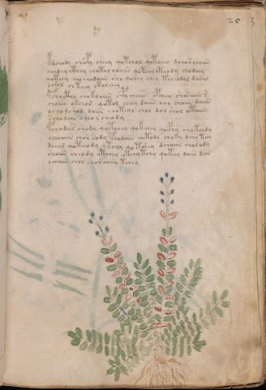

# Voynich Speculative Herbal Ferment Recipe — f20r

IMPORTANT: this is NOT a real or validated translation of the Voynich Manuscript. It is a speculative/procedural model that interprets EVA using a user-defined grammar to generate experimental recipes using safe, known edible substitutes.

This file is generated automatically from IVTFF/EVA transliteration plus a user-defined procedural grammar.



## Page / Folio
- currier: A
- folio: f20r
- page_number: 37
- section: herbal

## EVA Text (Transliteration)
```text
kdchody chopy cheey qotchol qotoeey dchor chaiin
chod ey cthey chotol odaiir qotchy cthody chodchy
qoteey cho chodaiin sho qochy chey tcheodal daral
ochol ol teey ot[o:a]lchey
pchocthy chokoaiin cpy cheeeb opchey shosaiin @243;
choees okchor qotol cheey daiin chy choiin daiin
ocho lshod daiin choteol chol dol shol otaiin
schodain cheo r cheody
fchodees shody qotchey qokchey qocphy chokoldy
ochoaiin chor sody pchodaiin chetody choky dchy toy
dchod qoteeody ytchy qo tshey dchaiin chol ody
shoiin cheody otchey otchy tchy qoteey daiin dar
ochaiin chor chor cheey tchey
```

## Recipes Index (This Page)
- [f20r.1,@P0](#f20r-1-f20r-1-p0)
- [f20r.2,+P0](#f20r-2-f20r-2-p0)
- [f20r.3,+P0](#f20r-3-f20r-3-p0)
- [f20r.4,+P0](#f20r-4-f20r-4-p0)
- [f20r.5,+P0](#f20r-5-f20r-5-p0)
- [f20r.6,+P0](#f20r-6-f20r-6-p0)
- [f20r.7,+P0](#f20r-7-f20r-7-p0)
- [f20r.8,+P0](#f20r-8-f20r-8-p0)
- [f20r.9,+P0](#f20r-9-f20r-9-p0)
- [f20r.10,+P0](#f20r-10-f20r-10-p0)
- [f20r.11,+P0](#f20r-11-f20r-11-p0)
- [f20r.12,+P0](#f20r-12-f20r-12-p0)
- [f20r.13,+P0](#f20r-13-f20r-13-p0)

## Line Glosses (Procedural Gloss Only; Not a Translation)

<a id="f20r-1-f20r-1-p0"></a>

### f20r.1,@P0

EVA: kdchody chopy cheey qotchol qotoeey dchor chaiin

Direct Gloss (Procedural, Not a Real Translation):
- kdchody: add fermentable sugars → add main plant (safe substitute) → mix / transfer → start fermentation (yeast)
- chopy: add main plant (safe substitute) → mix / transfer → start fermentation (yeast)
- cheey: add main plant (safe substitute) → duration level 2 → state: active extraction
- qotchol: prepare liquid base → apply heat/cooking → add main plant (safe substitute) → mix / transfer
- qotoeey: prepare liquid base → apply heat/cooking → mix / transfer → duration level 2 → state: active extraction
- dchor: add main plant (safe substitute) → mix / transfer → start fermentation (yeast)
- chaiin: add main plant (safe substitute) → duration level 1 → state: fermentation start → long fermentation / aging phase

<a id="f20r-2-f20r-2-p0"></a>

### f20r.2,+P0

EVA: chod ey cthey chotol odaiir qotchy cthody chodchy

Direct Gloss (Procedural, Not a Real Translation):
- chod: add main plant (safe substitute) → mix / transfer → start fermentation (yeast)
- ey: duration level 1 → state: active extraction
- cthey: add complex herbal compound (safe blend) → duration level 1 → state: active extraction
- chotol: apply heat/cooking → add main plant (safe substitute) → mix / transfer
- odaiir: mix / transfer → start fermentation (yeast) → duration level 1 → state: fermentation start
- qotchy: prepare liquid base → apply heat/cooking → add main plant (safe substitute)
- cthody: mix / transfer → start fermentation (yeast) → add complex herbal compound (safe blend)
- chodchy: add main plant (safe substitute) → mix / transfer → start fermentation (yeast)

<a id="f20r-3-f20r-3-p0"></a>

### f20r.3,+P0

EVA: qoteey cho chodaiin sho qochy chey tcheodal daral

Direct Gloss (Procedural, Not a Real Translation):
- qoteey: prepare liquid base → apply heat/cooking → duration level 2 → state: active extraction
- cho: add main plant (safe substitute) → mix / transfer
- chodaiin: add main plant (safe substitute) → mix / transfer → start fermentation (yeast) → duration level 1 → state: fermentation start → long fermentation / aging phase
- sho: add secondary herb (safe substitute) → mix / transfer
- qochy: prepare liquid base → add main plant (safe substitute)
- chey: add main plant (safe substitute) → duration level 1 → state: active extraction
- tcheodal: apply heat/cooking → add main plant (safe substitute) → mix / transfer → start fermentation (yeast) → duration level 1 → state: active extraction
- daral: start fermentation (yeast) → duration level 1 → state: fermentation start

<a id="f20r-4-f20r-4-p0"></a>

### f20r.4,+P0

EVA: ochol ol teey ot[o:a]lchey

Direct Gloss (Procedural, Not a Real Translation):
- ochol: add main plant (safe substitute) → mix / transfer
- ol: mix / transfer
- teey: apply heat/cooking → duration level 2 → state: active extraction
- ot: apply heat/cooking → mix / transfer
- o: mix / transfer
- a: duration level 1 → state: fermentation start
- lchey: add main plant (safe substitute) → duration level 1 → state: active extraction

<a id="f20r-5-f20r-5-p0"></a>

### f20r.5,+P0

EVA: pchocthy chokoaiin cpy cheeeb opchey shosaiin @243;

Direct Gloss (Procedural, Not a Real Translation):
- pchocthy: add main plant (safe substitute) → mix / transfer → start fermentation (yeast) → add complex herbal compound (safe blend)
- chokoaiin: add fermentable sugars → add main plant (safe substitute) → mix / transfer → duration level 1 → state: fermentation start → long fermentation / aging phase
- cpy: start fermentation (yeast)
- cheeeb: add main plant (safe substitute) → duration level 3 → state: active extraction
- opchey: add main plant (safe substitute) → mix / transfer → start fermentation (yeast) → duration level 1 → state: active extraction
- shosaiin: add secondary herb (safe substitute) → mix / transfer → duration level 1 → state: fermentation start → long fermentation / aging phase

<a id="f20r-6-f20r-6-p0"></a>

### f20r.6,+P0

EVA: choees okchor qotol cheey daiin chy choiin daiin

Direct Gloss (Procedural, Not a Real Translation):
- choees: add main plant (safe substitute) → mix / transfer → duration level 2 → state: active extraction
- okchor: add fermentable sugars → add main plant (safe substitute) → mix / transfer
- qotol: prepare liquid base → apply heat/cooking → mix / transfer
- cheey: add main plant (safe substitute) → duration level 2 → state: active extraction
- daiin: start fermentation (yeast) → duration level 1 → state: fermentation start → long fermentation / aging phase
- chy: add main plant (safe substitute)
- choiin: add main plant (safe substitute) → mix / transfer → duration level 2 → state: cooling/rest → medium fermentation phase
- daiin: start fermentation (yeast) → duration level 1 → state: fermentation start → long fermentation / aging phase

<a id="f20r-7-f20r-7-p0"></a>

### f20r.7,+P0

EVA: ocho lshod daiin choteol chol dol shol otaiin

Direct Gloss (Procedural, Not a Real Translation):
- ocho: add main plant (safe substitute) → mix / transfer
- lshod: add secondary herb (safe substitute) → mix / transfer → start fermentation (yeast)
- daiin: start fermentation (yeast) → duration level 1 → state: fermentation start → long fermentation / aging phase
- choteol: apply heat/cooking → add main plant (safe substitute) → mix / transfer → duration level 1 → state: active extraction
- chol: add main plant (safe substitute) → mix / transfer
- dol: mix / transfer → start fermentation (yeast)
- shol: add secondary herb (safe substitute) → mix / transfer
- otaiin: apply heat/cooking → mix / transfer → duration level 1 → state: fermentation start → long fermentation / aging phase

<a id="f20r-8-f20r-8-p0"></a>

### f20r.8,+P0

EVA: schodain cheo r cheody

Direct Gloss (Procedural, Not a Real Translation):
- schodain: add main plant (safe substitute) → mix / transfer → start fermentation (yeast) → duration level 1 → state: fermentation start
- cheo: add main plant (safe substitute) → mix / transfer → duration level 1 → state: active extraction
- r: [unparsed]
- cheody: add main plant (safe substitute) → mix / transfer → start fermentation (yeast) → duration level 1 → state: active extraction

<a id="f20r-9-f20r-9-p0"></a>

### f20r.9,+P0

EVA: fchodees shody qotchey qokchey qocphy chokoldy

Direct Gloss (Procedural, Not a Real Translation):
- fchodees: add main plant (safe substitute) → add aroma modifier → mix / transfer → start fermentation (yeast) → duration level 2 → state: active extraction
- shody: add secondary herb (safe substitute) → mix / transfer → start fermentation (yeast)
- qotchey: prepare liquid base → apply heat/cooking → add main plant (safe substitute) → duration level 1 → state: active extraction
- qokchey: prepare liquid base → add fermentable sugars → add main plant (safe substitute) → duration level 1 → state: active extraction
- qocphy: prepare liquid base → add complex herbal compound (safe blend)
- chokoldy: add fermentable sugars → add main plant (safe substitute) → mix / transfer → start fermentation (yeast)

<a id="f20r-10-f20r-10-p0"></a>

### f20r.10,+P0

EVA: ochoaiin chor sody pchodaiin chetody choky dchy toy

Direct Gloss (Procedural, Not a Real Translation):
- ochoaiin: add main plant (safe substitute) → mix / transfer → duration level 1 → state: fermentation start → long fermentation / aging phase
- chor: add main plant (safe substitute) → mix / transfer
- sody: mix / transfer → start fermentation (yeast)
- pchodaiin: add main plant (safe substitute) → mix / transfer → start fermentation (yeast) → duration level 1 → state: fermentation start → long fermentation / aging phase
- chetody: apply heat/cooking → add main plant (safe substitute) → mix / transfer → start fermentation (yeast) → duration level 1 → state: active extraction
- choky: add fermentable sugars → add main plant (safe substitute) → mix / transfer
- dchy: add main plant (safe substitute) → start fermentation (yeast)
- toy: apply heat/cooking → mix / transfer

<a id="f20r-11-f20r-11-p0"></a>

### f20r.11,+P0

EVA: dchod qoteeody ytchy qo tshey dchaiin chol ody

Direct Gloss (Procedural, Not a Real Translation):
- dchod: add main plant (safe substitute) → mix / transfer → start fermentation (yeast)
- qoteeody: prepare liquid base → apply heat/cooking → mix / transfer → start fermentation (yeast) → duration level 2 → state: active extraction
- ytchy: apply heat/cooking → add main plant (safe substitute)
- qo: prepare liquid base
- tshey: apply heat/cooking → add secondary herb (safe substitute) → duration level 1 → state: active extraction
- dchaiin: add main plant (safe substitute) → start fermentation (yeast) → duration level 1 → state: fermentation start → long fermentation / aging phase
- chol: add main plant (safe substitute) → mix / transfer
- ody: mix / transfer → start fermentation (yeast)

<a id="f20r-12-f20r-12-p0"></a>

### f20r.12,+P0

EVA: shoiin cheody otchey otchy tchy qoteey daiin dar

Direct Gloss (Procedural, Not a Real Translation):
- shoiin: add secondary herb (safe substitute) → mix / transfer → duration level 2 → state: cooling/rest → medium fermentation phase
- cheody: add main plant (safe substitute) → mix / transfer → start fermentation (yeast) → duration level 1 → state: active extraction
- otchey: apply heat/cooking → add main plant (safe substitute) → mix / transfer → duration level 1 → state: active extraction
- otchy: apply heat/cooking → add main plant (safe substitute) → mix / transfer
- tchy: apply heat/cooking → add main plant (safe substitute)
- qoteey: prepare liquid base → apply heat/cooking → duration level 2 → state: active extraction
- daiin: start fermentation (yeast) → duration level 1 → state: fermentation start → long fermentation / aging phase
- dar: start fermentation (yeast) → duration level 1 → state: fermentation start

<a id="f20r-13-f20r-13-p0"></a>

### f20r.13,+P0

EVA: ochaiin chor chor cheey tchey

Direct Gloss (Procedural, Not a Real Translation):
- ochaiin: add main plant (safe substitute) → mix / transfer → duration level 1 → state: fermentation start → long fermentation / aging phase
- chor: add main plant (safe substitute) → mix / transfer
- chor: add main plant (safe substitute) → mix / transfer
- cheey: add main plant (safe substitute) → duration level 2 → state: active extraction
- tchey: apply heat/cooking → add main plant (safe substitute) → duration level 1 → state: active extraction
