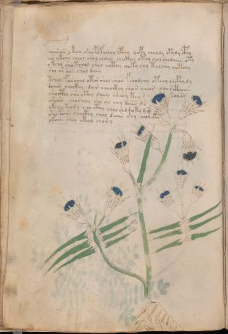

# Voynich Speculative Herbal Ferment Recipe — f20v

IMPORTANT: this is NOT a real or validated translation of the Voynich Manuscript. It is a speculative/procedural model that interprets EVA using a user-defined grammar to generate experimental recipes using safe, known edible substitutes.

This file is generated automatically from IVTFF/EVA transliteration plus a user-defined procedural grammar.



## Page / Folio
- currier: A
- folio: f20v
- page_number: 38
- section: herbal

## EVA Text (Transliteration)
```text
faiis ar okoy shy pofochey opchy qopy choldy opydy cphy
sos ykoiin cheol chol choiin checthy otol chol chodaiin oty
okchy sho kchol shol chcthy qoty chy tolshy qotchy
sho or aiin shol daiin
tshol folchol otor shol shor fshodchy otchy chcphy dy
doiiin chockhy da[n:r] cheoikhy shos cheos char [ith:cth]aiin
shocthy sho cthy daiin sheoy tey s soaiin
shain choraly sho ar chy daiin d s
ykchy keody cho cthy chol shd qoty d@244;
shokaiin chocthy chol daiin chy chor ety
okoiin chey @200;phol chory
```

## Domain Context (Heuristic; Not a Translation)

This section summarizes recurring **basewords** in this IVTFF domain and shows simple substring evidence that the token markers used by the procedural grammar occur inside frequent words.

Any Italian anagram / English gloss is a best-effort lexicon match, not a decipherment.


### Associated basewords (non-generic; top by frequency in this domain)
- `daiin` (count=461) → Italian anagram `piani`; English: plans (arrangements)
- `okaiin` (count=59) → Italian anagram `coniai`; English: [n/a]
- `chaiin` (count=39) → Italian anagram `acini`; English: [n/a]
- `saiin` (count=37) → Italian anagram `asini`; English: [n/a]
- `qokaiin` (count=34) → Italian anagram `ciancio`; English: [n/a]
- `qokar` (count=29) → Italian anagram `carco`; English: [n/a]
- `odaiin` (count=27) → Italian anagram `inopia`; English: poverty
- `otchol` (count=25) → Italian anagram `colto`; English: cultivated
- `kaiin` (count=24) → Italian anagram `acini`; English: [n/a]
- `chodaiin` (count=24) → Italian anagram `apocini`; English: [n/a]
- `qotol` (count=20) → Italian anagram `colto`; English: cultivated
- `okain` (count=19) → Italian anagram `acino`; English: a berry
- `qotor` (count=18) → Italian anagram `corto`; English: short
- `ykaiin` (count=16) → Italian anagram `acini`; English: [n/a]
- `qodaiin` (count=15) → Italian anagram `apocini`; English: [n/a]

### Marker evidence (substring in frequent basewords)
- `qo`: 57 basewords; examples: `qotchy`, `qokchy`, `qokedy`, `qokaiin`, `qoky`, `qokol`
- `q`: 58 basewords; examples: `qotchy`, `qokchy`, `qokedy`, `qokaiin`, `qoky`, `qokol`
- `o`: 252 basewords; examples: `chol`, `o`, `chor`, `or`, `shol`, `ol`
- `k`: 142 basewords; examples: `okaiin`, `oky`, `chckhy`, `qokchy`, `qokedy`, `okal`
- `t`: 102 basewords; examples: `cthy`, `oty`, `qotchy`, `cthol`, `cthor`, `otaiin`
- `p`: 15 basewords; examples: `cphy`, `ypchedy`, `opchy`, `opchey`, `pchor`, `qopchy`
- `ch`: 138 basewords; examples: `chol`, `chor`, `chy`, `chey`, `chedy`, `chdy`
- `sh`: 46 basewords; examples: `shol`, `sho`, `shy`, `shor`, `shey`, `shedy`
- `f`: 1 basewords; examples: `f`
- `cth`: 17 basewords; examples: `cthy`, `cthol`, `cthor`, `cthey`, `chcthy`, `ctho`
- `ckh`: 15 basewords; examples: `chckhy`, `ckhy`, `ckhol`, `ckhey`, `checkhy`, `shckhy`
- `cph`: 2 basewords; examples: `cphy`, `cphol`
- `dy`: 78 basewords; examples: `dy`, `chedy`, `chdy`, `chody`, `qokedy`, `shedy`
- `iin`: 39 basewords; examples: `daiin`, `aiin`, `okaiin`, `chaiin`, `saiin`, `qokaiin`
- `aiin`: 32 basewords; examples: `daiin`, `aiin`, `okaiin`, `chaiin`, `saiin`, `qokaiin`

## Recipes Index (This Page)
- [f20v.1,@P0](#f20v-1-f20v-1-p0)
- [f20v.2,+P0](#f20v-2-f20v-2-p0)
- [f20v.3,+P0](#f20v-3-f20v-3-p0)
- [f20v.4,+P0](#f20v-4-f20v-4-p0)
- [f20v.5,+P0](#f20v-5-f20v-5-p0)
- [f20v.6,+P0](#f20v-6-f20v-6-p0)
- [f20v.7,+P0](#f20v-7-f20v-7-p0)
- [f20v.8,+P0](#f20v-8-f20v-8-p0)
- [f20v.9,+P0](#f20v-9-f20v-9-p0)
- [f20v.10,+P0](#f20v-10-f20v-10-p0)
- [f20v.11,+P0](#f20v-11-f20v-11-p0)

## Line Glosses (Procedural Gloss Only; Not a Translation)

<a id="f20v-1-f20v-1-p0"></a>

### f20v.1,@P0

EVA: faiis ar okoy shy pofochey opchy qopy choldy opydy cphy

Direct Gloss (Procedural, Not a Real Translation):
- faiis: add aroma modifier → duration level 1 → state: fermentation start
- ar: duration level 1 → state: fermentation start
- okoy: add fermentable sugars → mix / transfer
- shy: add secondary herb (safe substitute)
- pofochey: add main plant (safe substitute) → add aroma modifier → mix / transfer → start fermentation (yeast) → duration level 1 → state: active extraction
- opchy: add main plant (safe substitute) → mix / transfer → start fermentation (yeast)
- qopy: prepare liquid base → start fermentation (yeast)
- choldy: add main plant (safe substitute) → mix / transfer → start fermentation (yeast)
- opydy: mix / transfer → start fermentation (yeast)
- cphy: add complex herbal compound (safe blend)

<a id="f20v-2-f20v-2-p0"></a>

### f20v.2,+P0

EVA: sos ykoiin cheol chol choiin checthy otol chol chodaiin oty

Direct Gloss (Procedural, Not a Real Translation):
- sos: mix / transfer
- ykoiin: add fermentable sugars → mix / transfer → duration level 2 → state: cooling/rest → medium fermentation phase
- cheol: add main plant (safe substitute) → mix / transfer → duration level 1 → state: active extraction
- chol: add main plant (safe substitute) → mix / transfer
- choiin: add main plant (safe substitute) → mix / transfer → duration level 2 → state: cooling/rest → medium fermentation phase
- checthy: add main plant (safe substitute) → add complex herbal compound (safe blend) → duration level 1 → state: active extraction
- otol: apply heat/cooking → mix / transfer
- chol: add main plant (safe substitute) → mix / transfer
- chodaiin: add main plant (safe substitute) → mix / transfer → start fermentation (yeast) → duration level 1 → state: fermentation start → long fermentation / aging phase
- oty: apply heat/cooking → mix / transfer

<a id="f20v-3-f20v-3-p0"></a>

### f20v.3,+P0

EVA: okchy sho kchol shol chcthy qoty chy tolshy qotchy

Direct Gloss (Procedural, Not a Real Translation):
- okchy: add fermentable sugars → add main plant (safe substitute) → mix / transfer
- sho: add secondary herb (safe substitute) → mix / transfer
- kchol: add fermentable sugars → add main plant (safe substitute) → mix / transfer
- shol: add secondary herb (safe substitute) → mix / transfer
- chcthy: add main plant (safe substitute) → add complex herbal compound (safe blend)
- qoty: prepare liquid base → apply heat/cooking
- chy: add main plant (safe substitute)
- tolshy: apply heat/cooking → add secondary herb (safe substitute) → mix / transfer
- qotchy: prepare liquid base → apply heat/cooking → add main plant (safe substitute)

<a id="f20v-4-f20v-4-p0"></a>

### f20v.4,+P0

EVA: sho or aiin shol daiin

Direct Gloss (Procedural, Not a Real Translation):
- sho: add secondary herb (safe substitute) → mix / transfer
- or: mix / transfer
- aiin: duration level 1 → state: fermentation start → long fermentation / aging phase
- shol: add secondary herb (safe substitute) → mix / transfer
- daiin: start fermentation (yeast) → duration level 1 → state: fermentation start → long fermentation / aging phase

<a id="f20v-5-f20v-5-p0"></a>

### f20v.5,+P0

EVA: tshol folchol otor shol shor fshodchy otchy chcphy dy

Direct Gloss (Procedural, Not a Real Translation):
- tshol: apply heat/cooking → add secondary herb (safe substitute) → mix / transfer
- folchol: add main plant (safe substitute) → add aroma modifier → mix / transfer
- otor: apply heat/cooking → mix / transfer
- shol: add secondary herb (safe substitute) → mix / transfer
- shor: add secondary herb (safe substitute) → mix / transfer
- fshodchy: add main plant (safe substitute) → add secondary herb (safe substitute) → add aroma modifier → mix / transfer → start fermentation (yeast)
- otchy: apply heat/cooking → add main plant (safe substitute) → mix / transfer
- chcphy: add main plant (safe substitute) → add complex herbal compound (safe blend)
- dy: start fermentation (yeast)

<a id="f20v-6-f20v-6-p0"></a>

### f20v.6,+P0

EVA: doiiin chockhy da[n:r] cheoikhy shos cheos char [ith:cth]aiin

Direct Gloss (Procedural, Not a Real Translation):
- doiiin: mix / transfer → start fermentation (yeast) → duration level 3 → state: cooling/rest → medium fermentation phase
- chockhy: add main plant (safe substitute) → mix / transfer → add complex herbal compound (safe blend)
- da: start fermentation (yeast) → duration level 1 → state: fermentation start
- n: [unparsed]
- r: [unparsed]
- cheoikhy: add fermentable sugars → add main plant (safe substitute) → mix / transfer → duration level 1 → state: active extraction
- shos: add secondary herb (safe substitute) → mix / transfer
- cheos: add main plant (safe substitute) → mix / transfer → duration level 1 → state: active extraction
- char: add main plant (safe substitute) → duration level 1 → state: fermentation start
- ith: apply heat/cooking → duration level 1 → state: cooling/rest
- cth: add complex herbal compound (safe blend)
- aiin: duration level 1 → state: fermentation start → long fermentation / aging phase

<a id="f20v-7-f20v-7-p0"></a>

### f20v.7,+P0

EVA: shocthy sho cthy daiin sheoy tey s soaiin

Direct Gloss (Procedural, Not a Real Translation):
- shocthy: add secondary herb (safe substitute) → mix / transfer → add complex herbal compound (safe blend)
- sho: add secondary herb (safe substitute) → mix / transfer
- cthy: add complex herbal compound (safe blend)
- daiin: start fermentation (yeast) → duration level 1 → state: fermentation start → long fermentation / aging phase
- sheoy: add secondary herb (safe substitute) → mix / transfer → duration level 1 → state: active extraction
- tey: apply heat/cooking → duration level 1 → state: active extraction
- s: [unparsed]
- soaiin: mix / transfer → duration level 1 → state: fermentation start → long fermentation / aging phase

<a id="f20v-8-f20v-8-p0"></a>

### f20v.8,+P0

EVA: shain choraly sho ar chy daiin d s

Direct Gloss (Procedural, Not a Real Translation):
- shain: add secondary herb (safe substitute) → duration level 1 → state: fermentation start
- choraly: add main plant (safe substitute) → mix / transfer → duration level 1 → state: fermentation start
- sho: add secondary herb (safe substitute) → mix / transfer
- ar: duration level 1 → state: fermentation start
- chy: add main plant (safe substitute)
- daiin: start fermentation (yeast) → duration level 1 → state: fermentation start → long fermentation / aging phase
- d: start fermentation (yeast)
- s: [unparsed]

<a id="f20v-9-f20v-9-p0"></a>

### f20v.9,+P0

EVA: ykchy keody cho cthy chol shd qoty d@244;

Direct Gloss (Procedural, Not a Real Translation):
- ykchy: add fermentable sugars → add main plant (safe substitute)
- keody: add fermentable sugars → mix / transfer → start fermentation (yeast) → duration level 1 → state: active extraction
- cho: add main plant (safe substitute) → mix / transfer
- cthy: add complex herbal compound (safe blend)
- chol: add main plant (safe substitute) → mix / transfer
- shd: add secondary herb (safe substitute) → start fermentation (yeast)
- qoty: prepare liquid base → apply heat/cooking
- d: start fermentation (yeast)

<a id="f20v-10-f20v-10-p0"></a>

### f20v.10,+P0

EVA: shokaiin chocthy chol daiin chy chor ety

Direct Gloss (Procedural, Not a Real Translation):
- shokaiin: add fermentable sugars → add secondary herb (safe substitute) → mix / transfer → duration level 1 → state: fermentation start → long fermentation / aging phase
- chocthy: add main plant (safe substitute) → mix / transfer → add complex herbal compound (safe blend)
- chol: add main plant (safe substitute) → mix / transfer
- daiin: start fermentation (yeast) → duration level 1 → state: fermentation start → long fermentation / aging phase
- chy: add main plant (safe substitute)
- chor: add main plant (safe substitute) → mix / transfer
- ety: apply heat/cooking → duration level 1 → state: active extraction

<a id="f20v-11-f20v-11-p0"></a>

### f20v.11,+P0

EVA: okoiin chey @200;phol chory

Direct Gloss (Procedural, Not a Real Translation):
- okoiin: add fermentable sugars → mix / transfer → duration level 2 → state: cooling/rest → medium fermentation phase
- chey: add main plant (safe substitute) → duration level 1 → state: active extraction
- phol: mix / transfer → start fermentation (yeast)
- chory: add main plant (safe substitute) → mix / transfer
