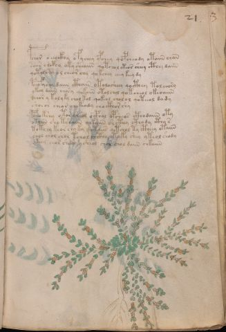

# Voynich Speculative Procedural Protocol — f21r

IMPORTANT: this is NOT a real or validated translation of the Voynich Manuscript. It is a speculative/procedural model that interprets EVA using a user-defined grammar to generate experimental recipes using safe, known edible substitutes.

This file is generated automatically from IVTFF/EVA transliteration plus a user-defined procedural grammar.



## Page / Folio
- currier: A
- folio: f21r
- page_number: 39
- section: herbal

## EVA Text (Transliteration)
```text
pchor o eeockhy o fychey ypchey qopcheody otaiin chan
saiin chcphy oky sheaiin qotchol oteos sheey cthy daiin
qotol shy o l cheor chy qokchey chey keey dy
pchofychy daiin cthain o tolosheey qocthey tolchory
ykeey daiin chosy qokoiin otol chol qotcheol okeoaiin
dchor y kol y ky chol kol qokeol chol ol qoteeol dady
shoeor cheor choke[o:a]dy cho cthor shy
fcho kshy otor sheol ocphal opsheas cthodaiin oty
okaiin sho tshaiin chkaiin sh cthey cthody cthy s
totchy keor chy ky qotaiin qotchol ty ctheey otaiin
shol chol shol tchol chcthy otyky shey yteol shody
ykeey chor sheey ysheol chor chol daiin chkaiin
```

## Domain Context (Heuristic; Not a Translation)

This section summarizes recurring **basewords** in this IVTFF domain and shows simple substring evidence that the token markers used by the procedural grammar occur inside frequent words.

Any Italian anagram / English gloss is a best-effort lexicon match, not a decipherment.


### Associated basewords (non-generic; top by frequency in this domain)
- `daiin` (count=461) → Italian anagram `piani`; English: plans (arrangements)
- `okaiin` (count=59) → Italian anagram `coniai`; English: [n/a]
- `chaiin` (count=39) → Italian anagram `acini`; English: [n/a]
- `saiin` (count=37) → Italian anagram `asini`; English: [n/a]
- `qokaiin` (count=34) → Italian anagram `ciancio`; English: [n/a]
- `qokar` (count=29) → Italian anagram `carco`; English: [n/a]
- `odaiin` (count=27) → Italian anagram `inopia`; English: poverty
- `otchol` (count=25) → Italian anagram `colto`; English: cultivated
- `kaiin` (count=24) → Italian anagram `acini`; English: [n/a]
- `chodaiin` (count=24) → Italian anagram `apocini`; English: [n/a]
- `qotol` (count=20) → Italian anagram `colto`; English: cultivated
- `okain` (count=19) → Italian anagram `acino`; English: a berry
- `qotor` (count=18) → Italian anagram `corto`; English: short
- `ykaiin` (count=16) → Italian anagram `acini`; English: [n/a]
- `qodaiin` (count=15) → Italian anagram `apocini`; English: [n/a]

### Marker evidence (substring in frequent basewords)
- `qo`: 57 basewords; examples: `qotchy`, `qokchy`, `qokedy`, `qokaiin`, `qoky`, `qokol`
- `q`: 58 basewords; examples: `qotchy`, `qokchy`, `qokedy`, `qokaiin`, `qoky`, `qokol`
- `o`: 252 basewords; examples: `chol`, `o`, `chor`, `or`, `shol`, `ol`
- `k`: 142 basewords; examples: `okaiin`, `oky`, `chckhy`, `qokchy`, `qokedy`, `okal`
- `t`: 102 basewords; examples: `cthy`, `oty`, `qotchy`, `cthol`, `cthor`, `otaiin`
- `p`: 15 basewords; examples: `cphy`, `ypchedy`, `opchy`, `opchey`, `pchor`, `qopchy`
- `ch`: 138 basewords; examples: `chol`, `chor`, `chy`, `chey`, `chedy`, `chdy`
- `sh`: 46 basewords; examples: `shol`, `sho`, `shy`, `shor`, `shey`, `shedy`
- `f`: 1 basewords; examples: `f`
- `cth`: 17 basewords; examples: `cthy`, `cthol`, `cthor`, `cthey`, `chcthy`, `ctho`
- `ckh`: 15 basewords; examples: `chckhy`, `ckhy`, `ckhol`, `ckhey`, `checkhy`, `shckhy`
- `cph`: 2 basewords; examples: `cphy`, `cphol`
- `dy`: 78 basewords; examples: `dy`, `chedy`, `chdy`, `chody`, `qokedy`, `shedy`
- `iin`: 39 basewords; examples: `daiin`, `aiin`, `okaiin`, `chaiin`, `saiin`, `qokaiin`
- `aiin`: 32 basewords; examples: `daiin`, `aiin`, `okaiin`, `chaiin`, `saiin`, `qokaiin`

## Recipes Index (This Page)
- [f21r.1,@P0](#f21r-1-f21r-1-p0)
- [f21r.2,+P0](#f21r-2-f21r-2-p0)
- [f21r.3,+P0](#f21r-3-f21r-3-p0)
- [f21r.4,+P0](#f21r-4-f21r-4-p0)
- [f21r.5,+P0](#f21r-5-f21r-5-p0)
- [f21r.6,+P0](#f21r-6-f21r-6-p0)
- [f21r.7,+P0](#f21r-7-f21r-7-p0)
- [f21r.8,+P0](#f21r-8-f21r-8-p0)
- [f21r.9,+P0](#f21r-9-f21r-9-p0)
- [f21r.10,+P0](#f21r-10-f21r-10-p0)
- [f21r.11,+P0](#f21r-11-f21r-11-p0)
- [f21r.12,+P0](#f21r-12-f21r-12-p0)

## Line Glosses (Procedural Gloss Only; Not a Translation)

<a id="f21r-1-f21r-1-p0"></a>

### f21r.1,@P0

EVA: pchor o eeockhy o fychey ypchey qopcheody otaiin chan

Direct Gloss (Procedural, Not a Real Translation):
- pchor: add main plant (safe substitute) → mix / transfer → add starter / activate
- o: mix / transfer
- eeockhy: mix / transfer → add complex herbal compound (safe blend) → duration level 2 → state: active extraction
- o: mix / transfer
- fychey: add main plant (safe substitute) → add aroma modifier → duration level 1 → state: active extraction
- ypchey: add main plant (safe substitute) → add starter / activate → duration level 1 → state: active extraction
- qopcheody: prepare liquid base → add main plant (safe substitute) → mix / transfer → add starter / activate → duration level 1 → state: active extraction
- otaiin: apply heat/cooking → mix / transfer → duration level 1 → state: phase transition/start → long phase
- chan: add main plant (safe substitute) → duration level 1 → state: phase transition/start

<a id="f21r-2-f21r-2-p0"></a>

### f21r.2,+P0

EVA: saiin chcphy oky sheaiin qotchol oteos sheey cthy daiin

Direct Gloss (Procedural, Not a Real Translation):
- saiin: duration level 1 → state: phase transition/start → long phase
- chcphy: add main plant (safe substitute) → add complex herbal compound (safe blend)
- oky: add fermentable sugars → mix / transfer
- sheaiin: add secondary herb (safe substitute) → duration level 1 → state: active extraction → long phase
- qotchol: prepare liquid base → apply heat/cooking → add main plant (safe substitute) → mix / transfer
- oteos: apply heat/cooking → mix / transfer → duration level 1 → state: active extraction
- sheey: add secondary herb (safe substitute) → duration level 2 → state: active extraction
- cthy: add complex herbal compound (safe blend)
- daiin: add starter / activate → duration level 1 → state: phase transition/start → long phase

<a id="f21r-3-f21r-3-p0"></a>

### f21r.3,+P0

EVA: qotol shy o l cheor chy qokchey chey keey dy

Direct Gloss (Procedural, Not a Real Translation):
- qotol: prepare liquid base → apply heat/cooking → mix / transfer
- shy: add secondary herb (safe substitute)
- o: mix / transfer
- l: [unparsed]
- cheor: add main plant (safe substitute) → mix / transfer → duration level 1 → state: active extraction
- chy: add main plant (safe substitute)
- qokchey: prepare liquid base → add fermentable sugars → add main plant (safe substitute) → duration level 1 → state: active extraction
- chey: add main plant (safe substitute) → duration level 1 → state: active extraction
- keey: add fermentable sugars → duration level 2 → state: active extraction
- dy: add starter / activate

<a id="f21r-4-f21r-4-p0"></a>

### f21r.4,+P0

EVA: pchofychy daiin cthain o tolosheey qocthey tolchory

Direct Gloss (Procedural, Not a Real Translation):
- pchofychy: add main plant (safe substitute) → add aroma modifier → mix / transfer → add starter / activate
- daiin: add starter / activate → duration level 1 → state: phase transition/start → long phase
- cthain: add complex herbal compound (safe blend) → duration level 1 → state: phase transition/start
- o: mix / transfer
- tolosheey: apply heat/cooking → add secondary herb (safe substitute) → mix / transfer → duration level 2 → state: active extraction
- qocthey: prepare liquid base → add complex herbal compound (safe blend) → duration level 1 → state: active extraction
- tolchory: apply heat/cooking → add main plant (safe substitute) → mix / transfer

<a id="f21r-5-f21r-5-p0"></a>

### f21r.5,+P0

EVA: ykeey daiin chosy qokoiin otol chol qotcheol okeoaiin

Direct Gloss (Procedural, Not a Real Translation):
- ykeey: add fermentable sugars → duration level 2 → state: active extraction
- daiin: add starter / activate → duration level 1 → state: phase transition/start → long phase
- chosy: add main plant (safe substitute) → mix / transfer
- qokoiin: prepare liquid base → add fermentable sugars → mix / transfer → duration level 2 → state: cooling/rest → medium phase
- otol: apply heat/cooking → mix / transfer
- chol: add main plant (safe substitute) → mix / transfer
- qotcheol: prepare liquid base → apply heat/cooking → add main plant (safe substitute) → mix / transfer → duration level 1 → state: active extraction
- okeoaiin: add fermentable sugars → mix / transfer → duration level 1 → state: active extraction → long phase

<a id="f21r-6-f21r-6-p0"></a>

### f21r.6,+P0

EVA: dchor y kol y ky chol kol qokeol chol ol qoteeol dady

Direct Gloss (Procedural, Not a Real Translation):
- dchor: add main plant (safe substitute) → mix / transfer → add starter / activate
- y: [unparsed]
- kol: add fermentable sugars → mix / transfer
- y: [unparsed]
- ky: add fermentable sugars
- chol: add main plant (safe substitute) → mix / transfer
- kol: add fermentable sugars → mix / transfer
- qokeol: prepare liquid base → add fermentable sugars → mix / transfer → duration level 1 → state: active extraction
- chol: add main plant (safe substitute) → mix / transfer
- ol: mix / transfer
- qoteeol: prepare liquid base → apply heat/cooking → mix / transfer → duration level 2 → state: active extraction
- dady: add starter / activate → duration level 1 → state: phase transition/start

<a id="f21r-7-f21r-7-p0"></a>

### f21r.7,+P0

EVA: shoeor cheor choke[o:a]dy cho cthor shy

Direct Gloss (Procedural, Not a Real Translation):
- shoeor: add secondary herb (safe substitute) → mix / transfer → duration level 1 → state: active extraction
- cheor: add main plant (safe substitute) → mix / transfer → duration level 1 → state: active extraction
- choke: add fermentable sugars → add main plant (safe substitute) → mix / transfer → duration level 1 → state: active extraction
- o: mix / transfer
- a: duration level 1 → state: phase transition/start
- dy: add starter / activate
- cho: add main plant (safe substitute) → mix / transfer
- cthor: mix / transfer → add complex herbal compound (safe blend)
- shy: add secondary herb (safe substitute)

<a id="f21r-8-f21r-8-p0"></a>

### f21r.8,+P0

EVA: fcho kshy otor sheol ocphal opsheas cthodaiin oty

Direct Gloss (Procedural, Not a Real Translation):
- fcho: add main plant (safe substitute) → add aroma modifier → mix / transfer
- kshy: add fermentable sugars → add secondary herb (safe substitute)
- otor: apply heat/cooking → mix / transfer
- sheol: add secondary herb (safe substitute) → mix / transfer → duration level 1 → state: active extraction
- ocphal: mix / transfer → add complex herbal compound (safe blend) → duration level 1 → state: phase transition/start
- opsheas: add secondary herb (safe substitute) → mix / transfer → add starter / activate → duration level 1 → state: active extraction
- cthodaiin: mix / transfer → add starter / activate → add complex herbal compound (safe blend) → duration level 1 → state: phase transition/start → long phase
- oty: apply heat/cooking → mix / transfer

<a id="f21r-9-f21r-9-p0"></a>

### f21r.9,+P0

EVA: okaiin sho tshaiin chkaiin sh cthey cthody cthy s

Direct Gloss (Procedural, Not a Real Translation):
- okaiin: add fermentable sugars → mix / transfer → duration level 1 → state: phase transition/start → long phase
- sho: add secondary herb (safe substitute) → mix / transfer
- tshaiin: apply heat/cooking → add secondary herb (safe substitute) → duration level 1 → state: phase transition/start → long phase
- chkaiin: add fermentable sugars → add main plant (safe substitute) → duration level 1 → state: phase transition/start → long phase
- sh: add secondary herb (safe substitute)
- cthey: add complex herbal compound (safe blend) → duration level 1 → state: active extraction
- cthody: mix / transfer → add starter / activate → add complex herbal compound (safe blend)
- cthy: add complex herbal compound (safe blend)
- s: [unparsed]

<a id="f21r-10-f21r-10-p0"></a>

### f21r.10,+P0

EVA: totchy keor chy ky qotaiin qotchol ty ctheey otaiin

Direct Gloss (Procedural, Not a Real Translation):
- totchy: apply heat/cooking → add main plant (safe substitute) → mix / transfer
- keor: add fermentable sugars → mix / transfer → duration level 1 → state: active extraction
- chy: add main plant (safe substitute)
- ky: add fermentable sugars
- qotaiin: prepare liquid base → apply heat/cooking → duration level 1 → state: phase transition/start → long phase
- qotchol: prepare liquid base → apply heat/cooking → add main plant (safe substitute) → mix / transfer
- ty: apply heat/cooking
- ctheey: add complex herbal compound (safe blend) → duration level 2 → state: active extraction
- otaiin: apply heat/cooking → mix / transfer → duration level 1 → state: phase transition/start → long phase

<a id="f21r-11-f21r-11-p0"></a>

### f21r.11,+P0

EVA: shol chol shol tchol chcthy otyky shey yteol shody

Direct Gloss (Procedural, Not a Real Translation):
- shol: add secondary herb (safe substitute) → mix / transfer
- chol: add main plant (safe substitute) → mix / transfer
- shol: add secondary herb (safe substitute) → mix / transfer
- tchol: apply heat/cooking → add main plant (safe substitute) → mix / transfer
- chcthy: add main plant (safe substitute) → add complex herbal compound (safe blend)
- otyky: add fermentable sugars → apply heat/cooking → mix / transfer
- shey: add secondary herb (safe substitute) → duration level 1 → state: active extraction
- yteol: apply heat/cooking → mix / transfer → duration level 1 → state: active extraction
- shody: add secondary herb (safe substitute) → mix / transfer → add starter / activate

<a id="f21r-12-f21r-12-p0"></a>

### f21r.12,+P0

EVA: ykeey chor sheey ysheol chor chol daiin chkaiin

Direct Gloss (Procedural, Not a Real Translation):
- ykeey: add fermentable sugars → duration level 2 → state: active extraction
- chor: add main plant (safe substitute) → mix / transfer
- sheey: add secondary herb (safe substitute) → duration level 2 → state: active extraction
- ysheol: add secondary herb (safe substitute) → mix / transfer → duration level 1 → state: active extraction
- chor: add main plant (safe substitute) → mix / transfer
- chol: add main plant (safe substitute) → mix / transfer
- daiin: add starter / activate → duration level 1 → state: phase transition/start → long phase
- chkaiin: add fermentable sugars → add main plant (safe substitute) → duration level 1 → state: phase transition/start → long phase
