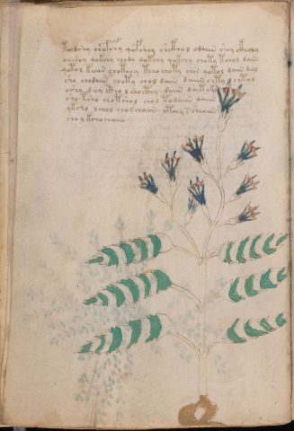

# Voynich Speculative Procedural Protocol — f21v

IMPORTANT: this is NOT a real or validated translation of the Voynich Manuscript. It is a speculative/procedural model that interprets EVA using a user-defined grammar to generate experimental recipes using safe, known edible substitutes.

This file is generated automatically from IVTFF/EVA transliteration plus a user-defined procedural grammar.



## Page / Folio
- currier: A
- folio: f21v
- page_number: 40
- section: herbal

## EVA Text (Transliteration)
```text
toldshy chofchy qofshey shckhol odaiin shey ckholy
oeeesoy qokchy chody qotchy qokchy choty tchol daiin
qotol keeees chotchy tcho choty chor qotol daiin dal
sho chodaiin choty chol daiin daiin chty chtol
osho deey ctho l sho cthy daiin dait oky
sho tsho chotshol chol todaiin daiin
ykcho lchol cho l chaiin otchy s sheaiin
cho l kchochaiin
```

## Domain Context (Heuristic; Not a Translation)

This section summarizes recurring **basewords** in this IVTFF domain and shows simple substring evidence that the token markers used by the procedural grammar occur inside frequent words.

Any Italian anagram / English gloss is a best-effort lexicon match, not a decipherment.


### Associated basewords (non-generic; top by frequency in this domain)
- `daiin` (count=461) → Italian anagram `piani`; English: plans (arrangements)
- `okaiin` (count=59) → Italian anagram `coniai`; English: [n/a]
- `chaiin` (count=39) → Italian anagram `acini`; English: [n/a]
- `saiin` (count=37) → Italian anagram `asini`; English: [n/a]
- `qokaiin` (count=34) → Italian anagram `ciancio`; English: [n/a]
- `qokar` (count=29) → Italian anagram `carco`; English: [n/a]
- `odaiin` (count=27) → Italian anagram `inopia`; English: poverty
- `otchol` (count=25) → Italian anagram `colto`; English: cultivated
- `kaiin` (count=24) → Italian anagram `acini`; English: [n/a]
- `chodaiin` (count=24) → Italian anagram `apocini`; English: [n/a]
- `qotol` (count=20) → Italian anagram `colto`; English: cultivated
- `okain` (count=19) → Italian anagram `acino`; English: a berry
- `qotor` (count=18) → Italian anagram `corto`; English: short
- `ykaiin` (count=16) → Italian anagram `acini`; English: [n/a]
- `qodaiin` (count=15) → Italian anagram `apocini`; English: [n/a]

### Marker evidence (substring in frequent basewords)
- `qo`: 57 basewords; examples: `qotchy`, `qokchy`, `qokedy`, `qokaiin`, `qoky`, `qokol`
- `q`: 58 basewords; examples: `qotchy`, `qokchy`, `qokedy`, `qokaiin`, `qoky`, `qokol`
- `o`: 252 basewords; examples: `chol`, `o`, `chor`, `or`, `shol`, `ol`
- `k`: 142 basewords; examples: `okaiin`, `oky`, `chckhy`, `qokchy`, `qokedy`, `okal`
- `t`: 102 basewords; examples: `cthy`, `oty`, `qotchy`, `cthol`, `cthor`, `otaiin`
- `p`: 15 basewords; examples: `cphy`, `ypchedy`, `opchy`, `opchey`, `pchor`, `qopchy`
- `ch`: 138 basewords; examples: `chol`, `chor`, `chy`, `chey`, `chedy`, `chdy`
- `sh`: 46 basewords; examples: `shol`, `sho`, `shy`, `shor`, `shey`, `shedy`
- `f`: 1 basewords; examples: `f`
- `cth`: 17 basewords; examples: `cthy`, `cthol`, `cthor`, `cthey`, `chcthy`, `ctho`
- `ckh`: 15 basewords; examples: `chckhy`, `ckhy`, `ckhol`, `ckhey`, `checkhy`, `shckhy`
- `cph`: 2 basewords; examples: `cphy`, `cphol`
- `dy`: 78 basewords; examples: `dy`, `chedy`, `chdy`, `chody`, `qokedy`, `shedy`
- `iin`: 39 basewords; examples: `daiin`, `aiin`, `okaiin`, `chaiin`, `saiin`, `qokaiin`
- `aiin`: 32 basewords; examples: `daiin`, `aiin`, `okaiin`, `chaiin`, `saiin`, `qokaiin`

## Recipes Index (This Page)
- [f21v.1,@P0](#f21v-1-f21v-1-p0)
- [f21v.2,+P0](#f21v-2-f21v-2-p0)
- [f21v.3,+P0](#f21v-3-f21v-3-p0)
- [f21v.4,+P0](#f21v-4-f21v-4-p0)
- [f21v.5,+P0](#f21v-5-f21v-5-p0)
- [f21v.6,+P0](#f21v-6-f21v-6-p0)
- [f21v.7,+P0](#f21v-7-f21v-7-p0)
- [f21v.8,+P0](#f21v-8-f21v-8-p0)

## Line Glosses (Procedural Gloss Only; Not a Translation)

<a id="f21v-1-f21v-1-p0"></a>

### f21v.1,@P0

EVA: toldshy chofchy qofshey shckhol odaiin shey ckholy

Direct Gloss (Procedural, Not a Real Translation):
- toldshy: tokens: t o l p sh → connectors: l
- chofchy: tokens: ch o f ch
- qofshey: tokens: qo f sh e → vowel_run: e (level 1; class e)
- shckhol: tokens: sh ckh o l → connectors: l
- odaiin: tokens: o p aiin → vowel_run: a (level 1; class a) → suffix: aiin
- shey: tokens: sh e → vowel_run: e (level 1; class e)
- ckholy: tokens: ckh o l → connectors: l

<a id="f21v-2-f21v-2-p0"></a>

### f21v.2,+P0

EVA: oeeesoy qokchy chody qotchy qokchy choty tchol daiin

Direct Gloss (Procedural, Not a Real Translation):
- oeeesoy: tokens: o eee s o → connectors: s → vowel_run: eee (level 3; class e)
- qokchy: tokens: qo k ch
- chody: tokens: ch o p
- qotchy: tokens: qo t ch
- qokchy: tokens: qo k ch
- choty: tokens: ch o t
- tchol: tokens: t ch o l → connectors: l
- daiin: tokens: p aiin → vowel_run: a (level 1; class a) → suffix: aiin

<a id="f21v-3-f21v-3-p0"></a>

### f21v.3,+P0

EVA: qotol keeees chotchy tcho choty chor qotol daiin dal

Direct Gloss (Procedural, Not a Real Translation):
- qotol: tokens: qo t o l → connectors: l
- keeees: tokens: k eee e s → connectors: s → vowel_run: eeee (level 4; class e)
- chotchy: tokens: ch o t ch
- tcho: tokens: t ch o
- choty: tokens: ch o t
- chor: tokens: ch o r → connectors: r
- qotol: tokens: qo t o l → connectors: l
- daiin: tokens: p aiin → vowel_run: a (level 1; class a) → suffix: aiin
- dal: tokens: p a l → connectors: l → vowel_run: a (level 1; class a)

<a id="f21v-4-f21v-4-p0"></a>

### f21v.4,+P0

EVA: sho chodaiin choty chol daiin daiin chty chtol

Direct Gloss (Procedural, Not a Real Translation):
- sho: tokens: sh o
- chodaiin: tokens: ch o p aiin → vowel_run: a (level 1; class a) → suffix: aiin
- choty: tokens: ch o t
- chol: tokens: ch o l → connectors: l
- daiin: tokens: p aiin → vowel_run: a (level 1; class a) → suffix: aiin
- daiin: tokens: p aiin → vowel_run: a (level 1; class a) → suffix: aiin
- chty: tokens: ch t
- chtol: tokens: ch t o l → connectors: l

<a id="f21v-5-f21v-5-p0"></a>

### f21v.5,+P0

EVA: osho deey ctho l sho cthy daiin dait oky

Direct Gloss (Procedural, Not a Real Translation):
- osho: tokens: o sh o
- deey: tokens: p ee → vowel_run: ee (level 2; class e)
- ctho: tokens: cth o
- l: tokens: l → connectors: l
- sho: tokens: sh o
- cthy: tokens: cth
- daiin: tokens: p aiin → vowel_run: a (level 1; class a) → suffix: aiin
- dait: tokens: p a i t → vowel_run: a (level 1; class a)
- oky: tokens: o k

<a id="f21v-6-f21v-6-p0"></a>

### f21v.6,+P0

EVA: sho tsho chotshol chol todaiin daiin

Direct Gloss (Procedural, Not a Real Translation):
- sho: tokens: sh o
- tsho: tokens: t sh o
- chotshol: tokens: ch o t sh o l → connectors: l
- chol: tokens: ch o l → connectors: l
- todaiin: tokens: t o p aiin → vowel_run: a (level 1; class a) → suffix: aiin
- daiin: tokens: p aiin → vowel_run: a (level 1; class a) → suffix: aiin

<a id="f21v-7-f21v-7-p0"></a>

### f21v.7,+P0

EVA: ykcho lchol cho l chaiin otchy s sheaiin

Direct Gloss (Procedural, Not a Real Translation):
- ykcho: tokens: k ch o
- lchol: tokens: l ch o l → connectors: l l
- cho: tokens: ch o
- l: tokens: l → connectors: l
- chaiin: tokens: ch aiin → vowel_run: a (level 1; class a) → suffix: aiin
- otchy: tokens: o t ch
- s: tokens: s → connectors: s
- sheaiin: tokens: sh e aiin → vowel_run: e (level 1; class e) → suffix: aiin

<a id="f21v-8-f21v-8-p0"></a>

### f21v.8,+P0

EVA: cho l kchochaiin

Direct Gloss (Procedural, Not a Real Translation):
- cho: tokens: ch o
- l: tokens: l → connectors: l
- kchochaiin: tokens: k ch o ch aiin → vowel_run: a (level 1; class a) → suffix: aiin
