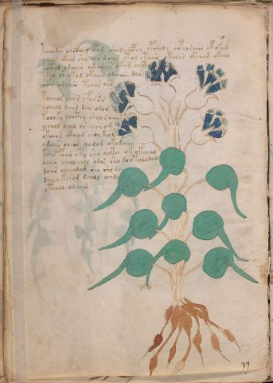

# Voynich Speculative Procedural Protocol — f24v

IMPORTANT: this is NOT a real or validated translation of the Voynich Manuscript. It is a speculative/procedural model that interprets EVA using a user-defined grammar to generate experimental recipes using safe, known edible substitutes.

This file is generated automatically from IVTFF/EVA transliteration plus a user-defined procedural grammar.



## Page / Folio
- currier: A
- folio: f24v
- page_number: 46
- section: herbal

## EVA Text (Transliteration)
```text
tchodar chocfhey opom shod chcphy opshody ocphoraiin o k o@146;am
ydals ckhor shy cho dch[o:a]r otol otaiir otchos okchom okcho
octh[y:o]l odchees oesearies okam chcth
ydal sh okol okaiin odaiin dlos
oeor oraiin tchar oro
tochol chor cfarsa r
ycheol daid dar olom
kochky chcthy shol sain
ychol chol or chor om
okoeor ctheod choy keol
ydaiin chear qodom okodaiin
ksho foar cto sho qok[ch:ee] ok okchal
oeeey cheol chol odor sho do otolodal
do[iir:ar] cheeodam sho sho dy
dchey kchod dch[a:o]l ochdy
otchol odaiim
```

## Domain Context (Heuristic; Not a Translation)

This section summarizes recurring **basewords** in this IVTFF domain and shows simple substring evidence that the token markers used by the procedural grammar occur inside frequent words.

Any Italian anagram / English gloss is a best-effort lexicon match, not a decipherment.


### Associated basewords (non-generic; top by frequency in this domain)
- `paiin` (count=477) → Italian anagram `piani`; English: plans (arrangements)
- `okaiin` (count=59) → Italian anagram `coniai`; English: [n/a]
- `qokep` (count=41) → Italian anagram `pecco`; English: [n/a]
- `saiin` (count=40) → Italian anagram `asini`; English: [n/a]
- `kaiin` (count=40) → Italian anagram `acini`; English: [n/a]
- `chaiin` (count=39) → Italian anagram `acini`; English: [n/a]
- `qokaiin` (count=34) → Italian anagram `ciancio`; English: [n/a]
- `qokar` (count=29) → Italian anagram `carco`; English: [n/a]
- `opaiin` (count=29) → Italian anagram `inopia`; English: poverty
- `otchol` (count=25) → Italian anagram `colto`; English: cultivated
- `chopaiin` (count=24) → Italian anagram `apocini`; English: [n/a]
- `qotol` (count=20) → Italian anagram `colto`; English: cultivated
- `okain` (count=19) → Italian anagram `acino`; English: a berry
- `qotor` (count=18) → Italian anagram `corto`; English: short
- `qopaiin` (count=15) → Italian anagram `apocini`; English: [n/a]

### Marker evidence (substring in frequent basewords)
- `qo`: 58 basewords; examples: `qotch`, `qok`, `qot`, `qokch`, `qokep`, `qokaiin`
- `q`: 59 basewords; examples: `qotch`, `qok`, `qot`, `qokch`, `qokep`, `qokaiin`
- `o`: 274 basewords; examples: `chol`, `o`, `chor`, `or`, `shol`, `ol`
- `k`: 146 basewords; examples: `ok`, `k`, `okaiin`, `kch`, `chckh`, `qok`
- `t`: 101 basewords; examples: `cth`, `ot`, `t`, `qotch`, `cthol`, `qot`
- `p`: 152 basewords; examples: `paiin`, `p`, `par`, `pain`, `pal`, `chep`
- `ch`: 145 basewords; examples: `chol`, `chor`, `ch`, `che`, `chep`, `cho`
- `sh`: 51 basewords; examples: `shol`, `sh`, `sho`, `shor`, `she`, `shep`
- `f`: 2 basewords; examples: `fchep`, `f`
- `cth`: 18 basewords; examples: `cth`, `cthol`, `cthor`, `cthe`, `chcth`, `ctho`
- `ckh`: 18 basewords; examples: `chckh`, `ckh`, `ckhe`, `ckhol`, `shckh`, `checkh`
- `cph`: 3 basewords; examples: `cph`, `cphol`, `cphe`
- `iin`: 39 basewords; examples: `paiin`, `aiin`, `okaiin`, `saiin`, `kaiin`, `chaiin`
- `aiin`: 31 basewords; examples: `paiin`, `aiin`, `okaiin`, `saiin`, `kaiin`, `chaiin`

## Recipes Index (This Page)
- [f24v.1,@P0](#f24v-1-f24v-1-p0)
- [f24v.2,+P0](#f24v-2-f24v-2-p0)
- [f24v.3,+P0](#f24v-3-f24v-3-p0)
- [f24v.4,+P0](#f24v-4-f24v-4-p0)
- [f24v.5,+P0](#f24v-5-f24v-5-p0)
- [f24v.6,+P0](#f24v-6-f24v-6-p0)
- [f24v.7,+P0](#f24v-7-f24v-7-p0)
- [f24v.8,+P0](#f24v-8-f24v-8-p0)
- [f24v.9,+P0](#f24v-9-f24v-9-p0)
- [f24v.10,+P0](#f24v-10-f24v-10-p0)
- [f24v.11,+P0](#f24v-11-f24v-11-p0)
- [f24v.12,+P0](#f24v-12-f24v-12-p0)
- [f24v.13,+P0](#f24v-13-f24v-13-p0)
- [f24v.14,+P0](#f24v-14-f24v-14-p0)
- [f24v.15,+P0](#f24v-15-f24v-15-p0)
- [f24v.16,+P0](#f24v-16-f24v-16-p0)

## Line Glosses (Procedural Gloss Only; Not a Translation)

<a id="f24v-1-f24v-1-p0"></a>

### f24v.1,@P0

EVA (original line):
```text
tchodar chocfhey opom shod chcphy opshody ocphoraiin o k o@146;am
```

English structural gloss (generated):

- tchodar: tokens: t ch o p a r → connectors: r → vowel_run: a (level 1; class a)
- chocfhey: tokens: ch o cfh e → vowel_run: e (level 1; class e)
- opom: tokens: o p o m → connectors: m
- shod: tokens: sh o p
- chcphy: tokens: ch cph
- opshody: tokens: o p sh o p
- ocphoraiin: tokens: o cph o r aiin → connectors: r → vowel_run: a (level 1; class a) → suffix: aiin
- o: tokens: o
- k: tokens: k
- o: tokens: o
- am: tokens: a m → connectors: m → vowel_run: a (level 1; class a)

<a id="f24v-2-f24v-2-p0"></a>

### f24v.2,+P0

EVA (original line):
```text
ydals ckhor shy cho dch[o:a]r otol otaiir otchos okchom okcho
```

English structural gloss (generated):

- ydals: tokens: p a l s → connectors: l s → vowel_run: a (level 1; class a)
- ckhor: tokens: ckh o r → connectors: r
- shy: tokens: sh
- cho: tokens: ch o
- dch: tokens: p ch
- o: tokens: o
- a: tokens: a → vowel_run: a (level 1; class a)
- r: tokens: r → connectors: r
- otol: tokens: o t o l → connectors: l
- otaiir: tokens: o t a ii r → connectors: r → vowel_run: a (level 1; class a)
- otchos: tokens: o t ch o s → connectors: s
- okchom: tokens: o k ch o m → connectors: m
- okcho: tokens: o k ch o

<a id="f24v-3-f24v-3-p0"></a>

### f24v.3,+P0

EVA (original line):
```text
octh[y:o]l odchees oesearies okam chcth
```

English structural gloss (generated):

- octh: tokens: o cth
- y: [unparsed]
- o: tokens: o
- l: tokens: l → connectors: l
- odchees: tokens: o p ch ee s → connectors: s → vowel_run: ee (level 2; class e)
- oesearies: tokens: o e s e a r i e s → connectors: s r s → vowel_run: e (level 1; class e)
- okam: tokens: o k a m → connectors: m → vowel_run: a (level 1; class a)
- chcth: tokens: ch cth

<a id="f24v-4-f24v-4-p0"></a>

### f24v.4,+P0

EVA (original line):
```text
ydal sh okol okaiin odaiin dlos
```

English structural gloss (generated):

- ydal: tokens: p a l → connectors: l → vowel_run: a (level 1; class a)
- sh: tokens: sh
- okol: tokens: o k o l → connectors: l
- okaiin: tokens: o k aiin → vowel_run: a (level 1; class a) → suffix: aiin (lexicon-context: `okaiin` → `coniai`; [n/a])
- odaiin: tokens: o p aiin → vowel_run: a (level 1; class a) → suffix: aiin (lexicon-context: `opaiin` → `opinai`; [n/a])
- dlos: tokens: p l o s → connectors: l s

<a id="f24v-5-f24v-5-p0"></a>

### f24v.5,+P0

EVA (original line):
```text
oeor oraiin tchar oro
```

English structural gloss (generated):

- oeor: tokens: o e o r → connectors: r → vowel_run: e (level 1; class e)
- oraiin: tokens: o r aiin → connectors: r → vowel_run: a (level 1; class a) → suffix: aiin
- tchar: tokens: t ch a r → connectors: r → vowel_run: a (level 1; class a)
- oro: tokens: o r o → connectors: r

<a id="f24v-6-f24v-6-p0"></a>

### f24v.6,+P0

EVA (original line):
```text
tochol chor cfarsa r
```

English structural gloss (generated):

- tochol: tokens: t o ch o l → connectors: l
- chor: tokens: ch o r → connectors: r
- cfarsa: tokens: c f a r s a → connectors: r s → vowel_run: a (level 1; class a)
- r: tokens: r → connectors: r

<a id="f24v-7-f24v-7-p0"></a>

### f24v.7,+P0

EVA (original line):
```text
ycheol daid dar olom
```

English structural gloss (generated):

- ycheol: tokens: ch e o l → connectors: l → vowel_run: e (level 1; class e)
- daid: tokens: p a i p → vowel_run: a (level 1; class a)
- dar: tokens: p a r → connectors: r → vowel_run: a (level 1; class a)
- olom: tokens: o l o m → connectors: l m

<a id="f24v-8-f24v-8-p0"></a>

### f24v.8,+P0

EVA (original line):
```text
kochky chcthy shol sain
```

English structural gloss (generated):

- kochky: tokens: k o ch k
- chcthy: tokens: ch cth
- shol: tokens: sh o l → connectors: l
- sain: tokens: s a i n → connectors: s n → vowel_run: a (level 1; class a)

<a id="f24v-9-f24v-9-p0"></a>

### f24v.9,+P0

EVA (original line):
```text
ychol chol or chor om
```

English structural gloss (generated):

- ychol: tokens: ch o l → connectors: l
- chol: tokens: ch o l → connectors: l
- or: tokens: o r → connectors: r
- chor: tokens: ch o r → connectors: r
- om: tokens: o m → connectors: m

<a id="f24v-10-f24v-10-p0"></a>

### f24v.10,+P0

EVA (original line):
```text
okoeor ctheod choy keol
```

English structural gloss (generated):

- okoeor: tokens: o k o e o r → connectors: r → vowel_run: e (level 1; class e)
- ctheod: tokens: cth e o p → vowel_run: e (level 1; class e)
- choy: tokens: ch o
- keol: tokens: k e o l → connectors: l → vowel_run: e (level 1; class e)

<a id="f24v-11-f24v-11-p0"></a>

### f24v.11,+P0

EVA (original line):
```text
ydaiin chear qodom okodaiin
```

English structural gloss (generated):

- ydaiin: tokens: p aiin → vowel_run: a (level 1; class a) → suffix: aiin (lexicon-context: `paiin` → `piani`; plans (arrangements))
- chear: tokens: ch e a r → connectors: r → vowel_run: e (level 1; class e)
- qodom: tokens: qo p o m → connectors: m
- okodaiin: tokens: o k o p aiin → vowel_run: a (level 1; class a) → suffix: aiin (lexicon-context: `opaiin` → `opinai`; [n/a])

<a id="f24v-12-f24v-12-p0"></a>

### f24v.12,+P0

EVA (original line):
```text
ksho foar cto sho qok[ch:ee] ok okchal
```

English structural gloss (generated):

- ksho: tokens: k sh o
- foar: tokens: f o a r → connectors: r → vowel_run: a (level 1; class a)
- cto: tokens: c t o
- sho: tokens: sh o
- qok: tokens: qo k
- ch: tokens: ch
- ee: tokens: ee → vowel_run: ee (level 2; class e)
- ok: tokens: o k
- okchal: tokens: o k ch a l → connectors: l → vowel_run: a (level 1; class a)

<a id="f24v-13-f24v-13-p0"></a>

### f24v.13,+P0

EVA (original line):
```text
oeeey cheol chol odor sho do otolodal
```

English structural gloss (generated):

- oeeey: tokens: o eee → vowel_run: eee (level 3; class e)
- cheol: tokens: ch e o l → connectors: l → vowel_run: e (level 1; class e)
- chol: tokens: ch o l → connectors: l
- odor: tokens: o p o r → connectors: r
- sho: tokens: sh o
- do: tokens: p o
- otolodal: tokens: o t o l o p a l → connectors: l l → vowel_run: a (level 1; class a)

<a id="f24v-14-f24v-14-p0"></a>

### f24v.14,+P0

EVA (original line):
```text
do[iir:ar] cheeodam sho sho dy
```

English structural gloss (generated):

- do: tokens: p o
- iir: tokens: ii r → connectors: r → vowel_run: ii (level 2; class i)
- ar: tokens: a r → connectors: r → vowel_run: a (level 1; class a)
- cheeodam: tokens: ch ee o p a m → connectors: m → vowel_run: ee (level 2; class e)
- sho: tokens: sh o
- sho: tokens: sh o
- dy: tokens: p

<a id="f24v-15-f24v-15-p0"></a>

### f24v.15,+P0

EVA (original line):
```text
dchey kchod dch[a:o]l ochdy
```

English structural gloss (generated):

- dchey: tokens: p ch e → vowel_run: e (level 1; class e)
- kchod: tokens: k ch o p
- dch: tokens: p ch
- a: tokens: a → vowel_run: a (level 1; class a)
- o: tokens: o
- l: tokens: l → connectors: l
- ochdy: tokens: o ch p

<a id="f24v-16-f24v-16-p0"></a>

### f24v.16,+P0

EVA (original line):
```text
otchol odaiim
```

English structural gloss (generated):

- otchol: tokens: o t ch o l → connectors: l (lexicon-context: `otchol` → `colto`; cultivated)
- odaiim: tokens: o p a ii m → connectors: m → vowel_run: a (level 1; class a)
