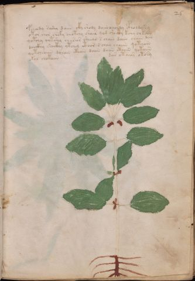

# Voynich Speculative Herbal Ferment Recipe — f25r

IMPORTANT: this is NOT a real or validated translation of the Voynich Manuscript. It is a speculative/procedural model that interprets EVA using a user-defined grammar to generate experimental recipes using safe, known edible substitutes.

This file is generated automatically from IVTFF/EVA transliteration plus a user-defined procedural grammar.



## Page / Folio
- currier: A
- folio: f25r
- page_number: 47
- section: herbal

## EVA Text (Transliteration)
```text
fcholdy soshy daiin cky shody daiin ocholdy cpholdy sy
otor chor chsky chotchy shair qod sh[a:o]chy kchy chkain
qotchy qotshy cheesees sheear s chain daiin chain dan
dchckhy shocthy ytchey cthor s chan chaiin qotchain
qotcheaiin dchain cthain daiin daiin cthain qotaiin
okal chotaiin
dair otaiir otosy
```

## Recipes Index (This Page)
- [f25r.1,@P0](#f25r-1-f25r-1-p0)
- [f25r.2,+P0](#f25r-2-f25r-2-p0)
- [f25r.3,+P0](#f25r-3-f25r-3-p0)
- [f25r.4,+P0](#f25r-4-f25r-4-p0)
- [f25r.5,+P0](#f25r-5-f25r-5-p0)
- [f25r.6,+P0](#f25r-6-f25r-6-p0)
- [f25r.7,=Pt](#f25r-7-f25r-7-pt)

## Line Glosses (Procedural Gloss Only; Not a Translation)

<a id="f25r-1-f25r-1-p0"></a>

### f25r.1,@P0

EVA: fcholdy soshy daiin cky shody daiin ocholdy cpholdy sy

Direct Gloss (Procedural, Not a Real Translation):
- fcholdy: add main plant (safe substitute) → add aroma modifier → mix / transfer → start fermentation (yeast)
- soshy: add secondary herb (safe substitute) → mix / transfer
- daiin: start fermentation (yeast) → duration level 1 → state: fermentation start → long fermentation / aging phase
- cky: add fermentable sugars
- shody: add secondary herb (safe substitute) → mix / transfer → start fermentation (yeast)
- daiin: start fermentation (yeast) → duration level 1 → state: fermentation start → long fermentation / aging phase
- ocholdy: add main plant (safe substitute) → mix / transfer → start fermentation (yeast)
- cpholdy: mix / transfer → start fermentation (yeast) → add complex herbal compound (safe blend)
- sy: [unparsed]

<a id="f25r-2-f25r-2-p0"></a>

### f25r.2,+P0

EVA: otor chor chsky chotchy shair qod sh[a:o]chy kchy chkain

Direct Gloss (Procedural, Not a Real Translation):
- otor: apply heat/cooking → mix / transfer
- chor: add main plant (safe substitute) → mix / transfer
- chsky: add fermentable sugars → add main plant (safe substitute)
- chotchy: apply heat/cooking → add main plant (safe substitute) → mix / transfer
- shair: add secondary herb (safe substitute) → duration level 1 → state: fermentation start
- qod: prepare liquid base → start fermentation (yeast)
- sh: add secondary herb (safe substitute)
- a: duration level 1 → state: fermentation start
- o: mix / transfer
- chy: add main plant (safe substitute)
- kchy: add fermentable sugars → add main plant (safe substitute)
- chkain: add fermentable sugars → add main plant (safe substitute) → duration level 1 → state: fermentation start

<a id="f25r-3-f25r-3-p0"></a>

### f25r.3,+P0

EVA: qotchy qotshy cheesees sheear s chain daiin chain dan

Direct Gloss (Procedural, Not a Real Translation):
- qotchy: prepare liquid base → apply heat/cooking → add main plant (safe substitute)
- qotshy: prepare liquid base → apply heat/cooking → add secondary herb (safe substitute)
- cheesees: add main plant (safe substitute) → duration level 2 → state: active extraction
- sheear: add secondary herb (safe substitute) → duration level 2 → state: active extraction
- s: [unparsed]
- chain: add main plant (safe substitute) → duration level 1 → state: fermentation start
- daiin: start fermentation (yeast) → duration level 1 → state: fermentation start → long fermentation / aging phase
- chain: add main plant (safe substitute) → duration level 1 → state: fermentation start
- dan: start fermentation (yeast) → duration level 1 → state: fermentation start

<a id="f25r-4-f25r-4-p0"></a>

### f25r.4,+P0

EVA: dchckhy shocthy ytchey cthor s chan chaiin qotchain

Direct Gloss (Procedural, Not a Real Translation):
- dchckhy: add main plant (safe substitute) → start fermentation (yeast) → add complex herbal compound (safe blend)
- shocthy: add secondary herb (safe substitute) → mix / transfer → add complex herbal compound (safe blend)
- ytchey: apply heat/cooking → add main plant (safe substitute) → duration level 1 → state: active extraction
- cthor: mix / transfer → add complex herbal compound (safe blend)
- s: [unparsed]
- chan: add main plant (safe substitute) → duration level 1 → state: fermentation start
- chaiin: add main plant (safe substitute) → duration level 1 → state: fermentation start → long fermentation / aging phase
- qotchain: prepare liquid base → apply heat/cooking → add main plant (safe substitute) → duration level 1 → state: fermentation start

<a id="f25r-5-f25r-5-p0"></a>

### f25r.5,+P0

EVA: qotcheaiin dchain cthain daiin daiin cthain qotaiin

Direct Gloss (Procedural, Not a Real Translation):
- qotcheaiin: prepare liquid base → apply heat/cooking → add main plant (safe substitute) → duration level 1 → state: active extraction → long fermentation / aging phase
- dchain: add main plant (safe substitute) → start fermentation (yeast) → duration level 1 → state: fermentation start
- cthain: add complex herbal compound (safe blend) → duration level 1 → state: fermentation start
- daiin: start fermentation (yeast) → duration level 1 → state: fermentation start → long fermentation / aging phase
- daiin: start fermentation (yeast) → duration level 1 → state: fermentation start → long fermentation / aging phase
- cthain: add complex herbal compound (safe blend) → duration level 1 → state: fermentation start
- qotaiin: prepare liquid base → apply heat/cooking → duration level 1 → state: fermentation start → long fermentation / aging phase

<a id="f25r-6-f25r-6-p0"></a>

### f25r.6,+P0

EVA: okal chotaiin

Direct Gloss (Procedural, Not a Real Translation):
- okal: add fermentable sugars → mix / transfer → duration level 1 → state: fermentation start
- chotaiin: apply heat/cooking → add main plant (safe substitute) → mix / transfer → duration level 1 → state: fermentation start → long fermentation / aging phase

<a id="f25r-7-f25r-7-pt"></a>

### f25r.7,=Pt

EVA: dair otaiir otosy

Direct Gloss (Procedural, Not a Real Translation):
- dair: start fermentation (yeast) → duration level 1 → state: fermentation start
- otaiir: apply heat/cooking → mix / transfer → duration level 1 → state: fermentation start
- otosy: apply heat/cooking → mix / transfer
