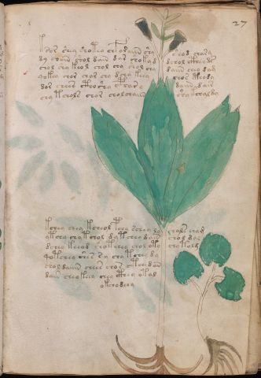

# Voynich Speculative Procedural Protocol — f27r

IMPORTANT: this is NOT a real or validated translation of the Voynich Manuscript. It is a speculative/procedural model that interprets EVA using a user-defined grammar to generate experimental recipes using safe, known edible substitutes.

This file is generated automatically from IVTFF/EVA transliteration plus a user-defined procedural grammar.



## Page / Folio
- currier: A
- folio: f27r
- page_number: 51
- section: herbal

## EVA Text (Transliteration)
```text
ksor shey shoteo chforaiin shy shod chary
dy coain shol dain dar shokyd dchol cthey ds
chol shy keol chol chy shol chy daiin chey dam
qokey chor char chy dchy keey chos cthody
dor chees ctho shy c@148;har y daiin dair
chy t chols chor cholohaiin shy kchal dy
kchey chey kcheol pch[o:y] schey ly chals cham
ytchy chy t chol dy t chey dain chol dal
dchey keeod shotchey chol oty chy tolg
qotchey shes s y chy tchey dy
chol daiiin chees chos ctey dan
dain cheokeey chey cthey otal
o[t:k]chodeey
```

## Domain Context (Heuristic; Not a Translation)

This section summarizes recurring **basewords** in this IVTFF domain and shows simple substring evidence that the token markers used by the procedural grammar occur inside frequent words.

Any Italian anagram / English gloss is a best-effort lexicon match, not a decipherment.


### Associated basewords (non-generic; top by frequency in this domain)
- `daiin` (count=461) → Italian anagram `piani`; English: plans (arrangements)
- `okaiin` (count=59) → Italian anagram `coniai`; English: [n/a]
- `chaiin` (count=39) → Italian anagram `acini`; English: [n/a]
- `saiin` (count=37) → Italian anagram `asini`; English: [n/a]
- `qokaiin` (count=34) → Italian anagram `ciancio`; English: [n/a]
- `qokar` (count=29) → Italian anagram `carco`; English: [n/a]
- `odaiin` (count=27) → Italian anagram `inopia`; English: poverty
- `otchol` (count=25) → Italian anagram `colto`; English: cultivated
- `kaiin` (count=24) → Italian anagram `acini`; English: [n/a]
- `chodaiin` (count=24) → Italian anagram `apocini`; English: [n/a]
- `qotol` (count=20) → Italian anagram `colto`; English: cultivated
- `okain` (count=19) → Italian anagram `acino`; English: a berry
- `qotor` (count=18) → Italian anagram `corto`; English: short
- `ykaiin` (count=16) → Italian anagram `acini`; English: [n/a]
- `qodaiin` (count=15) → Italian anagram `apocini`; English: [n/a]

### Marker evidence (substring in frequent basewords)
- `qo`: 57 basewords; examples: `qotchy`, `qokchy`, `qokedy`, `qokaiin`, `qoky`, `qokol`
- `q`: 58 basewords; examples: `qotchy`, `qokchy`, `qokedy`, `qokaiin`, `qoky`, `qokol`
- `o`: 252 basewords; examples: `chol`, `o`, `chor`, `or`, `shol`, `ol`
- `k`: 142 basewords; examples: `okaiin`, `oky`, `chckhy`, `qokchy`, `qokedy`, `okal`
- `t`: 102 basewords; examples: `cthy`, `oty`, `qotchy`, `cthol`, `cthor`, `otaiin`
- `p`: 15 basewords; examples: `cphy`, `ypchedy`, `opchy`, `opchey`, `pchor`, `qopchy`
- `ch`: 138 basewords; examples: `chol`, `chor`, `chy`, `chey`, `chedy`, `chdy`
- `sh`: 46 basewords; examples: `shol`, `sho`, `shy`, `shor`, `shey`, `shedy`
- `f`: 1 basewords; examples: `f`
- `cth`: 17 basewords; examples: `cthy`, `cthol`, `cthor`, `cthey`, `chcthy`, `ctho`
- `ckh`: 15 basewords; examples: `chckhy`, `ckhy`, `ckhol`, `ckhey`, `checkhy`, `shckhy`
- `cph`: 2 basewords; examples: `cphy`, `cphol`
- `dy`: 78 basewords; examples: `dy`, `chedy`, `chdy`, `chody`, `qokedy`, `shedy`
- `iin`: 39 basewords; examples: `daiin`, `aiin`, `okaiin`, `chaiin`, `saiin`, `qokaiin`
- `aiin`: 32 basewords; examples: `daiin`, `aiin`, `okaiin`, `chaiin`, `saiin`, `qokaiin`

## Recipes Index (This Page)
- [f27r.1,@P0](#f27r-1-f27r-1-p0)
- [f27r.2,+P0](#f27r-2-f27r-2-p0)
- [f27r.3,+P0](#f27r-3-f27r-3-p0)
- [f27r.4,+P0](#f27r-4-f27r-4-p0)
- [f27r.5,+P0](#f27r-5-f27r-5-p0)
- [f27r.6,+P0](#f27r-6-f27r-6-p0)
- [f27r.7,+P0](#f27r-7-f27r-7-p0)
- [f27r.8,+P0](#f27r-8-f27r-8-p0)
- [f27r.9,+P0](#f27r-9-f27r-9-p0)
- [f27r.10,+P0](#f27r-10-f27r-10-p0)
- [f27r.11,+P0](#f27r-11-f27r-11-p0)
- [f27r.12,+P0](#f27r-12-f27r-12-p0)
- [f27r.13,+Pc](#f27r-13-f27r-13-pc)

## Line Glosses (Procedural Gloss Only; Not a Translation)

<a id="f27r-1-f27r-1-p0"></a>

### f27r.1,@P0

EVA: ksor shey shoteo chforaiin shy shod chary

Direct Gloss (Procedural, Not a Real Translation):
- ksor: tokens: k s o r → connectors: s r
- shey: tokens: sh e → vowel_run: e (level 1; class e)
- shoteo: tokens: sh o t e o → vowel_run: e (level 1; class e)
- chforaiin: tokens: ch f o r aiin → connectors: r → vowel_run: a (level 1; class a) → suffix: aiin
- shy: tokens: sh
- shod: tokens: sh o p
- chary: tokens: ch a r → connectors: r → vowel_run: a (level 1; class a)

<a id="f27r-2-f27r-2-p0"></a>

### f27r.2,+P0

EVA: dy coain shol dain dar shokyd dchol cthey ds

Direct Gloss (Procedural, Not a Real Translation):
- dy: tokens: p
- coain: tokens: c o a i n → connectors: n → vowel_run: a (level 1; class a)
- shol: tokens: sh o l → connectors: l
- dain: tokens: p a i n → connectors: n → vowel_run: a (level 1; class a)
- dar: tokens: p a r → connectors: r → vowel_run: a (level 1; class a)
- shokyd: tokens: sh o k p
- dchol: tokens: p ch o l → connectors: l
- cthey: tokens: cth e → vowel_run: e (level 1; class e)
- ds: tokens: p s → connectors: s

<a id="f27r-3-f27r-3-p0"></a>

### f27r.3,+P0

EVA: chol shy keol chol chy shol chy daiin chey dam

Direct Gloss (Procedural, Not a Real Translation):
- chol: tokens: ch o l → connectors: l
- shy: tokens: sh
- keol: tokens: k e o l → connectors: l → vowel_run: e (level 1; class e)
- chol: tokens: ch o l → connectors: l
- chy: tokens: ch
- shol: tokens: sh o l → connectors: l
- chy: tokens: ch
- daiin: tokens: p aiin → vowel_run: a (level 1; class a) → suffix: aiin
- chey: tokens: ch e → vowel_run: e (level 1; class e)
- dam: tokens: p a m → connectors: m → vowel_run: a (level 1; class a)

<a id="f27r-4-f27r-4-p0"></a>

### f27r.4,+P0

EVA: qokey chor char chy dchy keey chos cthody

Direct Gloss (Procedural, Not a Real Translation):
- qokey: tokens: qo k e → vowel_run: e (level 1; class e)
- chor: tokens: ch o r → connectors: r
- char: tokens: ch a r → connectors: r → vowel_run: a (level 1; class a)
- chy: tokens: ch
- dchy: tokens: p ch
- keey: tokens: k ee → vowel_run: ee (level 2; class e)
- chos: tokens: ch o s → connectors: s
- cthody: tokens: cth o p

<a id="f27r-5-f27r-5-p0"></a>

### f27r.5,+P0

EVA: dor chees ctho shy c@148;har y daiin dair

Direct Gloss (Procedural, Not a Real Translation):
- dor: tokens: p o r → connectors: r
- chees: tokens: ch ee s → connectors: s → vowel_run: ee (level 2; class e)
- ctho: tokens: cth o
- shy: tokens: sh
- c: tokens: c
- har: tokens: h a r → connectors: r → vowel_run: a (level 1; class a) → unmodeled_tokens: h
- y: [unparsed]
- daiin: tokens: p aiin → vowel_run: a (level 1; class a) → suffix: aiin
- dair: tokens: p a i r → connectors: r → vowel_run: a (level 1; class a)

<a id="f27r-6-f27r-6-p0"></a>

### f27r.6,+P0

EVA: chy t chols chor cholohaiin shy kchal dy

Direct Gloss (Procedural, Not a Real Translation):
- chy: tokens: ch
- t: tokens: t
- chols: tokens: ch o l s → connectors: l s
- chor: tokens: ch o r → connectors: r
- cholohaiin: tokens: ch o l o h aiin → connectors: l → vowel_run: a (level 1; class a) → suffix: aiin → unmodeled_tokens: h
- shy: tokens: sh
- kchal: tokens: k ch a l → connectors: l → vowel_run: a (level 1; class a)
- dy: tokens: p

<a id="f27r-7-f27r-7-p0"></a>

### f27r.7,+P0

EVA: kchey chey kcheol pch[o:y] schey ly chals cham

Direct Gloss (Procedural, Not a Real Translation):
- kchey: tokens: k ch e → vowel_run: e (level 1; class e)
- chey: tokens: ch e → vowel_run: e (level 1; class e)
- kcheol: tokens: k ch e o l → connectors: l → vowel_run: e (level 1; class e)
- pch: tokens: p ch
- o: tokens: o
- y: [unparsed]
- schey: tokens: s ch e → connectors: s → vowel_run: e (level 1; class e)
- ly: tokens: l → connectors: l
- chals: tokens: ch a l s → connectors: l s → vowel_run: a (level 1; class a)
- cham: tokens: ch a m → connectors: m → vowel_run: a (level 1; class a)

<a id="f27r-8-f27r-8-p0"></a>

### f27r.8,+P0

EVA: ytchy chy t chol dy t chey dain chol dal

Direct Gloss (Procedural, Not a Real Translation):
- ytchy: tokens: t ch
- chy: tokens: ch
- t: tokens: t
- chol: tokens: ch o l → connectors: l
- dy: tokens: p
- t: tokens: t
- chey: tokens: ch e → vowel_run: e (level 1; class e)
- dain: tokens: p a i n → connectors: n → vowel_run: a (level 1; class a)
- chol: tokens: ch o l → connectors: l
- dal: tokens: p a l → connectors: l → vowel_run: a (level 1; class a)

<a id="f27r-9-f27r-9-p0"></a>

### f27r.9,+P0

EVA: dchey keeod shotchey chol oty chy tolg

Direct Gloss (Procedural, Not a Real Translation):
- dchey: tokens: p ch e → vowel_run: e (level 1; class e)
- keeod: tokens: k ee o p → vowel_run: ee (level 2; class e)
- shotchey: tokens: sh o t ch e → vowel_run: e (level 1; class e)
- chol: tokens: ch o l → connectors: l
- oty: tokens: o t
- chy: tokens: ch
- tolg: tokens: t o l g → connectors: l

<a id="f27r-10-f27r-10-p0"></a>

### f27r.10,+P0

EVA: qotchey shes s y chy tchey dy

Direct Gloss (Procedural, Not a Real Translation):
- qotchey: tokens: qo t ch e → vowel_run: e (level 1; class e)
- shes: tokens: sh e s → connectors: s → vowel_run: e (level 1; class e)
- s: tokens: s → connectors: s
- y: [unparsed]
- chy: tokens: ch
- tchey: tokens: t ch e → vowel_run: e (level 1; class e)
- dy: tokens: p

<a id="f27r-11-f27r-11-p0"></a>

### f27r.11,+P0

EVA: chol daiiin chees chos ctey dan

Direct Gloss (Procedural, Not a Real Translation):
- chol: tokens: ch o l → connectors: l
- daiiin: tokens: p a iii n → connectors: n → vowel_run: a (level 1; class a) → suffix: iin
- chees: tokens: ch ee s → connectors: s → vowel_run: ee (level 2; class e)
- chos: tokens: ch o s → connectors: s
- ctey: tokens: c t e → vowel_run: e (level 1; class e)
- dan: tokens: p a n → connectors: n → vowel_run: a (level 1; class a)

<a id="f27r-12-f27r-12-p0"></a>

### f27r.12,+P0

EVA: dain cheokeey chey cthey otal

Direct Gloss (Procedural, Not a Real Translation):
- dain: tokens: p a i n → connectors: n → vowel_run: a (level 1; class a)
- cheokeey: tokens: ch e o k ee → vowel_run: e (level 1; class e)
- chey: tokens: ch e → vowel_run: e (level 1; class e)
- cthey: tokens: cth e → vowel_run: e (level 1; class e)
- otal: tokens: o t a l → connectors: l → vowel_run: a (level 1; class a)

<a id="f27r-13-f27r-13-pc"></a>

### f27r.13,+Pc

EVA: o[t:k]chodeey

Direct Gloss (Procedural, Not a Real Translation):
- o: tokens: o
- t: tokens: t
- k: tokens: k
- chodeey: tokens: ch o p ee → vowel_run: ee (level 2; class e)
