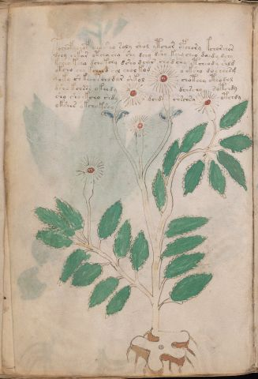

# Voynich Speculative Herbal Ferment Recipe — f27v

IMPORTANT: this is NOT a real or validated translation of the Voynich Manuscript. It is a speculative/procedural model that interprets EVA using a user-defined grammar to generate experimental recipes using safe, known edible substitutes.

This file is generated automatically from IVTFF/EVA transliteration plus a user-defined procedural grammar.



## Page / Folio
- currier: A
- folio: f27v
- page_number: 52
- section: herbal

## EVA Text (Transliteration)
```text
pochof chof cho sho soly shol ytchar opchory kchor chor
dchy chkar otchy shy shy dchy dshy kchy cheo daidy dchy
kchey kchy dchokchy dsho dcar chodchy etcheody shld
okcho chy kch[ee:o]d chl chol kod o oksho do cheesg
qoky sh keeo [s:r]cho dar shkol chotchy ctho dol
dsho kchrrr okeedy dch[s:r]chy sotchdy
sho shoykcho shdy dchd chschsy otchdy
okshes okchokshy
```

## Domain Context (Heuristic; Not a Translation)

This section summarizes recurring **basewords** in this IVTFF domain and shows simple substring evidence that the token markers used by the procedural grammar occur inside frequent words.

Any Italian anagram / English gloss is a best-effort lexicon match, not a decipherment.


### Associated basewords (non-generic; top by frequency in this domain)
- `daiin` (count=461) → Italian anagram `piani`; English: plans (arrangements)
- `okaiin` (count=59) → Italian anagram `coniai`; English: [n/a]
- `chaiin` (count=39) → Italian anagram `acini`; English: [n/a]
- `saiin` (count=37) → Italian anagram `asini`; English: [n/a]
- `qokaiin` (count=34) → Italian anagram `ciancio`; English: [n/a]
- `qokar` (count=29) → Italian anagram `carco`; English: [n/a]
- `odaiin` (count=27) → Italian anagram `inopia`; English: poverty
- `otchol` (count=25) → Italian anagram `colto`; English: cultivated
- `kaiin` (count=24) → Italian anagram `acini`; English: [n/a]
- `chodaiin` (count=24) → Italian anagram `apocini`; English: [n/a]
- `qotol` (count=20) → Italian anagram `colto`; English: cultivated
- `okain` (count=19) → Italian anagram `acino`; English: a berry
- `qotor` (count=18) → Italian anagram `corto`; English: short
- `ykaiin` (count=16) → Italian anagram `acini`; English: [n/a]
- `qodaiin` (count=15) → Italian anagram `apocini`; English: [n/a]

### Marker evidence (substring in frequent basewords)
- `qo`: 57 basewords; examples: `qotchy`, `qokchy`, `qokedy`, `qokaiin`, `qoky`, `qokol`
- `q`: 58 basewords; examples: `qotchy`, `qokchy`, `qokedy`, `qokaiin`, `qoky`, `qokol`
- `o`: 252 basewords; examples: `chol`, `o`, `chor`, `or`, `shol`, `ol`
- `k`: 142 basewords; examples: `okaiin`, `oky`, `chckhy`, `qokchy`, `qokedy`, `okal`
- `t`: 102 basewords; examples: `cthy`, `oty`, `qotchy`, `cthol`, `cthor`, `otaiin`
- `p`: 15 basewords; examples: `cphy`, `ypchedy`, `opchy`, `opchey`, `pchor`, `qopchy`
- `ch`: 138 basewords; examples: `chol`, `chor`, `chy`, `chey`, `chedy`, `chdy`
- `sh`: 46 basewords; examples: `shol`, `sho`, `shy`, `shor`, `shey`, `shedy`
- `f`: 1 basewords; examples: `f`
- `cth`: 17 basewords; examples: `cthy`, `cthol`, `cthor`, `cthey`, `chcthy`, `ctho`
- `ckh`: 15 basewords; examples: `chckhy`, `ckhy`, `ckhol`, `ckhey`, `checkhy`, `shckhy`
- `cph`: 2 basewords; examples: `cphy`, `cphol`
- `dy`: 78 basewords; examples: `dy`, `chedy`, `chdy`, `chody`, `qokedy`, `shedy`
- `iin`: 39 basewords; examples: `daiin`, `aiin`, `okaiin`, `chaiin`, `saiin`, `qokaiin`
- `aiin`: 32 basewords; examples: `daiin`, `aiin`, `okaiin`, `chaiin`, `saiin`, `qokaiin`

## Recipes Index (This Page)
- [f27v.1,@P0](#f27v-1-f27v-1-p0)
- [f27v.2,+P0](#f27v-2-f27v-2-p0)
- [f27v.3,+P0](#f27v-3-f27v-3-p0)
- [f27v.4,+P0](#f27v-4-f27v-4-p0)
- [f27v.5,+P0](#f27v-5-f27v-5-p0)
- [f27v.6,+P0](#f27v-6-f27v-6-p0)
- [f27v.7,+P0](#f27v-7-f27v-7-p0)
- [f27v.8,+P0](#f27v-8-f27v-8-p0)

## Line Glosses (Procedural Gloss Only; Not a Translation)

<a id="f27v-1-f27v-1-p0"></a>

### f27v.1,@P0

EVA: pochof chof cho sho soly shol ytchar opchory kchor chor

Direct Gloss (Procedural, Not a Real Translation):
- pochof: add main plant (safe substitute) → add aroma modifier → mix / transfer → start fermentation (yeast)
- chof: add main plant (safe substitute) → add aroma modifier → mix / transfer
- cho: add main plant (safe substitute) → mix / transfer
- sho: add secondary herb (safe substitute) → mix / transfer
- soly: mix / transfer
- shol: add secondary herb (safe substitute) → mix / transfer
- ytchar: apply heat/cooking → add main plant (safe substitute) → duration level 1 → state: fermentation start
- opchory: add main plant (safe substitute) → mix / transfer → start fermentation (yeast)
- kchor: add fermentable sugars → add main plant (safe substitute) → mix / transfer
- chor: add main plant (safe substitute) → mix / transfer

<a id="f27v-2-f27v-2-p0"></a>

### f27v.2,+P0

EVA: dchy chkar otchy shy shy dchy dshy kchy cheo daidy dchy

Direct Gloss (Procedural, Not a Real Translation):
- dchy: add main plant (safe substitute) → start fermentation (yeast)
- chkar: add fermentable sugars → add main plant (safe substitute) → duration level 1 → state: fermentation start
- otchy: apply heat/cooking → add main plant (safe substitute) → mix / transfer
- shy: add secondary herb (safe substitute)
- shy: add secondary herb (safe substitute)
- dchy: add main plant (safe substitute) → start fermentation (yeast)
- dshy: add secondary herb (safe substitute) → start fermentation (yeast)
- kchy: add fermentable sugars → add main plant (safe substitute)
- cheo: add main plant (safe substitute) → mix / transfer → duration level 1 → state: active extraction
- daidy: start fermentation (yeast) → duration level 1 → state: fermentation start
- dchy: add main plant (safe substitute) → start fermentation (yeast)

<a id="f27v-3-f27v-3-p0"></a>

### f27v.3,+P0

EVA: kchey kchy dchokchy dsho dcar chodchy etcheody shld

Direct Gloss (Procedural, Not a Real Translation):
- kchey: add fermentable sugars → add main plant (safe substitute) → duration level 1 → state: active extraction
- kchy: add fermentable sugars → add main plant (safe substitute)
- dchokchy: add fermentable sugars → add main plant (safe substitute) → mix / transfer → start fermentation (yeast)
- dsho: add secondary herb (safe substitute) → mix / transfer → start fermentation (yeast)
- dcar: start fermentation (yeast) → duration level 1 → state: fermentation start
- chodchy: add main plant (safe substitute) → mix / transfer → start fermentation (yeast)
- etcheody: apply heat/cooking → add main plant (safe substitute) → mix / transfer → start fermentation (yeast) → duration level 1 → state: active extraction
- shld: add secondary herb (safe substitute) → start fermentation (yeast)

<a id="f27v-4-f27v-4-p0"></a>

### f27v.4,+P0

EVA: okcho chy kch[ee:o]d chl chol kod o oksho do cheesg

Direct Gloss (Procedural, Not a Real Translation):
- okcho: add fermentable sugars → add main plant (safe substitute) → mix / transfer
- chy: add main plant (safe substitute)
- kch: add fermentable sugars → add main plant (safe substitute)
- ee: duration level 2 → state: active extraction
- o: mix / transfer
- d: start fermentation (yeast)
- chl: add main plant (safe substitute)
- chol: add main plant (safe substitute) → mix / transfer
- kod: add fermentable sugars → mix / transfer → start fermentation (yeast)
- o: mix / transfer
- oksho: add fermentable sugars → add secondary herb (safe substitute) → mix / transfer
- do: mix / transfer → start fermentation (yeast)
- cheesg: add main plant (safe substitute) → duration level 2 → state: active extraction

<a id="f27v-5-f27v-5-p0"></a>

### f27v.5,+P0

EVA: qoky sh keeo [s:r]cho dar shkol chotchy ctho dol

Direct Gloss (Procedural, Not a Real Translation):
- qoky: prepare liquid base → add fermentable sugars
- sh: add secondary herb (safe substitute)
- keeo: add fermentable sugars → mix / transfer → duration level 2 → state: active extraction
- s: [unparsed]
- r: [unparsed]
- cho: add main plant (safe substitute) → mix / transfer
- dar: start fermentation (yeast) → duration level 1 → state: fermentation start
- shkol: add fermentable sugars → add secondary herb (safe substitute) → mix / transfer
- chotchy: apply heat/cooking → add main plant (safe substitute) → mix / transfer
- ctho: mix / transfer → add complex herbal compound (safe blend)
- dol: mix / transfer → start fermentation (yeast)

<a id="f27v-6-f27v-6-p0"></a>

### f27v.6,+P0

EVA: dsho kchrrr okeedy dch[s:r]chy sotchdy

Direct Gloss (Procedural, Not a Real Translation):
- dsho: add secondary herb (safe substitute) → mix / transfer → start fermentation (yeast)
- kchrrr: add fermentable sugars → add main plant (safe substitute)
- okeedy: add fermentable sugars → mix / transfer → start fermentation (yeast) → duration level 2 → state: active extraction
- dch: add main plant (safe substitute) → start fermentation (yeast)
- s: [unparsed]
- r: [unparsed]
- chy: add main plant (safe substitute)
- sotchdy: apply heat/cooking → add main plant (safe substitute) → mix / transfer → start fermentation (yeast)

<a id="f27v-7-f27v-7-p0"></a>

### f27v.7,+P0

EVA: sho shoykcho shdy dchd chschsy otchdy

Direct Gloss (Procedural, Not a Real Translation):
- sho: add secondary herb (safe substitute) → mix / transfer
- shoykcho: add fermentable sugars → add main plant (safe substitute) → add secondary herb (safe substitute) → mix / transfer
- shdy: add secondary herb (safe substitute) → start fermentation (yeast)
- dchd: add main plant (safe substitute) → start fermentation (yeast)
- chschsy: add main plant (safe substitute)
- otchdy: apply heat/cooking → add main plant (safe substitute) → mix / transfer → start fermentation (yeast)

<a id="f27v-8-f27v-8-p0"></a>

### f27v.8,+P0

EVA: okshes okchokshy

Direct Gloss (Procedural, Not a Real Translation):
- okshes: add fermentable sugars → add secondary herb (safe substitute) → mix / transfer → duration level 1 → state: active extraction
- okchokshy: add fermentable sugars → add main plant (safe substitute) → add secondary herb (safe substitute) → mix / transfer
