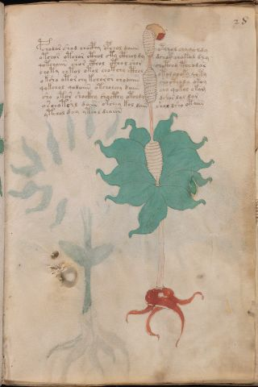

# Voynich Speculative Procedural Protocol — f28r

IMPORTANT: this is NOT a real or validated translation of the Voynich Manuscript. It is a speculative/procedural model that interprets EVA using a user-defined grammar to generate experimental recipes using safe, known edible substitutes.

This file is generated automatically from IVTFF/EVA transliteration plus a user-defined procedural grammar.



## Page / Folio
- currier: A
- folio: f28r
- page_number: 53
- section: herbal

## EVA Text (Transliteration)
```text
pchodar shod chocphy opchol daiin otchol chy qo ldy
otchor otchor cthol cty ctheol dy dchar chakod dly
qotchaiin shor cthol cthol shor chotchy tchodar
choty chtol otol chotchy cthol otol choky qoty
oksho otorchy kchoror chodaiin sho cthody okoy
qokchol qodaiin otcholchy daiin cho qokol o kam
sho otor shockhy shocthy otoldy dshor dol dar
oschotshl daiin okchey kol daiin shol dsho otaiin
ytchol deey yteol deaiin
```

## Domain Context (Heuristic; Not a Translation)

This section summarizes recurring **basewords** in this IVTFF domain and shows simple substring evidence that the token markers used by the procedural grammar occur inside frequent words.

Any Italian anagram / English gloss is a best-effort lexicon match, not a decipherment.


### Associated basewords (non-generic; top by frequency in this domain)
- `daiin` (count=461) → Italian anagram `piani`; English: plans (arrangements)
- `okaiin` (count=59) → Italian anagram `coniai`; English: [n/a]
- `chaiin` (count=39) → Italian anagram `acini`; English: [n/a]
- `saiin` (count=37) → Italian anagram `asini`; English: [n/a]
- `qokaiin` (count=34) → Italian anagram `ciancio`; English: [n/a]
- `qokar` (count=29) → Italian anagram `carco`; English: [n/a]
- `odaiin` (count=27) → Italian anagram `inopia`; English: poverty
- `otchol` (count=25) → Italian anagram `colto`; English: cultivated
- `kaiin` (count=24) → Italian anagram `acini`; English: [n/a]
- `chodaiin` (count=24) → Italian anagram `apocini`; English: [n/a]
- `qotol` (count=20) → Italian anagram `colto`; English: cultivated
- `okain` (count=19) → Italian anagram `acino`; English: a berry
- `qotor` (count=18) → Italian anagram `corto`; English: short
- `ykaiin` (count=16) → Italian anagram `acini`; English: [n/a]
- `qodaiin` (count=15) → Italian anagram `apocini`; English: [n/a]

### Marker evidence (substring in frequent basewords)
- `qo`: 57 basewords; examples: `qotchy`, `qokchy`, `qokedy`, `qokaiin`, `qoky`, `qokol`
- `q`: 58 basewords; examples: `qotchy`, `qokchy`, `qokedy`, `qokaiin`, `qoky`, `qokol`
- `o`: 252 basewords; examples: `chol`, `o`, `chor`, `or`, `shol`, `ol`
- `k`: 142 basewords; examples: `okaiin`, `oky`, `chckhy`, `qokchy`, `qokedy`, `okal`
- `t`: 102 basewords; examples: `cthy`, `oty`, `qotchy`, `cthol`, `cthor`, `otaiin`
- `p`: 15 basewords; examples: `cphy`, `ypchedy`, `opchy`, `opchey`, `pchor`, `qopchy`
- `ch`: 138 basewords; examples: `chol`, `chor`, `chy`, `chey`, `chedy`, `chdy`
- `sh`: 46 basewords; examples: `shol`, `sho`, `shy`, `shor`, `shey`, `shedy`
- `f`: 1 basewords; examples: `f`
- `cth`: 17 basewords; examples: `cthy`, `cthol`, `cthor`, `cthey`, `chcthy`, `ctho`
- `ckh`: 15 basewords; examples: `chckhy`, `ckhy`, `ckhol`, `ckhey`, `checkhy`, `shckhy`
- `cph`: 2 basewords; examples: `cphy`, `cphol`
- `dy`: 78 basewords; examples: `dy`, `chedy`, `chdy`, `chody`, `qokedy`, `shedy`
- `iin`: 39 basewords; examples: `daiin`, `aiin`, `okaiin`, `chaiin`, `saiin`, `qokaiin`
- `aiin`: 32 basewords; examples: `daiin`, `aiin`, `okaiin`, `chaiin`, `saiin`, `qokaiin`

## Recipes Index (This Page)
- [f28r.1,@P0](#f28r-1-f28r-1-p0)
- [f28r.2,+P0](#f28r-2-f28r-2-p0)
- [f28r.3,+P0](#f28r-3-f28r-3-p0)
- [f28r.4,+P0](#f28r-4-f28r-4-p0)
- [f28r.5,+P0](#f28r-5-f28r-5-p0)
- [f28r.6,+P0](#f28r-6-f28r-6-p0)
- [f28r.7,+P0](#f28r-7-f28r-7-p0)
- [f28r.8,+P0](#f28r-8-f28r-8-p0)
- [f28r.9,+P0](#f28r-9-f28r-9-p0)

## Line Glosses (Procedural Gloss Only; Not a Translation)

<a id="f28r-1-f28r-1-p0"></a>

### f28r.1,@P0

EVA: pchodar shod chocphy opchol daiin otchol chy qo ldy

Direct Gloss (Procedural, Not a Real Translation):
- pchodar: add main plant (safe substitute) → mix / transfer → add starter / activate → duration level 1 → state: phase transition/start
- shod: add secondary herb (safe substitute) → mix / transfer → add starter / activate
- chocphy: add main plant (safe substitute) → mix / transfer → add complex herbal compound (safe blend)
- opchol: add main plant (safe substitute) → mix / transfer → add starter / activate
- daiin: add starter / activate → duration level 1 → state: phase transition/start → long phase
- otchol: apply heat/cooking → add main plant (safe substitute) → mix / transfer
- chy: add main plant (safe substitute)
- qo: prepare liquid base
- ldy: add starter / activate

<a id="f28r-2-f28r-2-p0"></a>

### f28r.2,+P0

EVA: otchor otchor cthol cty ctheol dy dchar chakod dly

Direct Gloss (Procedural, Not a Real Translation):
- otchor: apply heat/cooking → add main plant (safe substitute) → mix / transfer
- otchor: apply heat/cooking → add main plant (safe substitute) → mix / transfer
- cthol: mix / transfer → add complex herbal compound (safe blend)
- cty: apply heat/cooking
- ctheol: mix / transfer → add complex herbal compound (safe blend) → duration level 1 → state: active extraction
- dy: add starter / activate
- dchar: add main plant (safe substitute) → add starter / activate → duration level 1 → state: phase transition/start
- chakod: add fermentable sugars → add main plant (safe substitute) → mix / transfer → add starter / activate → duration level 1 → state: phase transition/start
- dly: add starter / activate

<a id="f28r-3-f28r-3-p0"></a>

### f28r.3,+P0

EVA: qotchaiin shor cthol cthol shor chotchy tchodar

Direct Gloss (Procedural, Not a Real Translation):
- qotchaiin: prepare liquid base → apply heat/cooking → add main plant (safe substitute) → duration level 1 → state: phase transition/start → long phase
- shor: add secondary herb (safe substitute) → mix / transfer
- cthol: mix / transfer → add complex herbal compound (safe blend)
- cthol: mix / transfer → add complex herbal compound (safe blend)
- shor: add secondary herb (safe substitute) → mix / transfer
- chotchy: apply heat/cooking → add main plant (safe substitute) → mix / transfer
- tchodar: apply heat/cooking → add main plant (safe substitute) → mix / transfer → add starter / activate → duration level 1 → state: phase transition/start

<a id="f28r-4-f28r-4-p0"></a>

### f28r.4,+P0

EVA: choty chtol otol chotchy cthol otol choky qoty

Direct Gloss (Procedural, Not a Real Translation):
- choty: apply heat/cooking → add main plant (safe substitute) → mix / transfer
- chtol: apply heat/cooking → add main plant (safe substitute) → mix / transfer
- otol: apply heat/cooking → mix / transfer
- chotchy: apply heat/cooking → add main plant (safe substitute) → mix / transfer
- cthol: mix / transfer → add complex herbal compound (safe blend)
- otol: apply heat/cooking → mix / transfer
- choky: add fermentable sugars → add main plant (safe substitute) → mix / transfer
- qoty: prepare liquid base → apply heat/cooking

<a id="f28r-5-f28r-5-p0"></a>

### f28r.5,+P0

EVA: oksho otorchy kchoror chodaiin sho cthody okoy

Direct Gloss (Procedural, Not a Real Translation):
- oksho: add fermentable sugars → add secondary herb (safe substitute) → mix / transfer
- otorchy: apply heat/cooking → add main plant (safe substitute) → mix / transfer
- kchoror: add fermentable sugars → add main plant (safe substitute) → mix / transfer
- chodaiin: add main plant (safe substitute) → mix / transfer → add starter / activate → duration level 1 → state: phase transition/start → long phase
- sho: add secondary herb (safe substitute) → mix / transfer
- cthody: mix / transfer → add starter / activate → add complex herbal compound (safe blend)
- okoy: add fermentable sugars → mix / transfer

<a id="f28r-6-f28r-6-p0"></a>

### f28r.6,+P0

EVA: qokchol qodaiin otcholchy daiin cho qokol o kam

Direct Gloss (Procedural, Not a Real Translation):
- qokchol: prepare liquid base → add fermentable sugars → add main plant (safe substitute) → mix / transfer
- qodaiin: prepare liquid base → add starter / activate → duration level 1 → state: phase transition/start → long phase
- otcholchy: apply heat/cooking → add main plant (safe substitute) → mix / transfer
- daiin: add starter / activate → duration level 1 → state: phase transition/start → long phase
- cho: add main plant (safe substitute) → mix / transfer
- qokol: prepare liquid base → add fermentable sugars → mix / transfer
- o: mix / transfer
- kam: add fermentable sugars → duration level 1 → state: phase transition/start

<a id="f28r-7-f28r-7-p0"></a>

### f28r.7,+P0

EVA: sho otor shockhy shocthy otoldy dshor dol dar

Direct Gloss (Procedural, Not a Real Translation):
- sho: add secondary herb (safe substitute) → mix / transfer
- otor: apply heat/cooking → mix / transfer
- shockhy: add secondary herb (safe substitute) → mix / transfer → add complex herbal compound (safe blend)
- shocthy: add secondary herb (safe substitute) → mix / transfer → add complex herbal compound (safe blend)
- otoldy: apply heat/cooking → mix / transfer → add starter / activate
- dshor: add secondary herb (safe substitute) → mix / transfer → add starter / activate
- dol: mix / transfer → add starter / activate
- dar: add starter / activate → duration level 1 → state: phase transition/start

<a id="f28r-8-f28r-8-p0"></a>

### f28r.8,+P0

EVA: oschotshl daiin okchey kol daiin shol dsho otaiin

Direct Gloss (Procedural, Not a Real Translation):
- oschotshl: apply heat/cooking → add main plant (safe substitute) → add secondary herb (safe substitute) → mix / transfer
- daiin: add starter / activate → duration level 1 → state: phase transition/start → long phase
- okchey: add fermentable sugars → add main plant (safe substitute) → mix / transfer → duration level 1 → state: active extraction
- kol: add fermentable sugars → mix / transfer
- daiin: add starter / activate → duration level 1 → state: phase transition/start → long phase
- shol: add secondary herb (safe substitute) → mix / transfer
- dsho: add secondary herb (safe substitute) → mix / transfer → add starter / activate
- otaiin: apply heat/cooking → mix / transfer → duration level 1 → state: phase transition/start → long phase

<a id="f28r-9-f28r-9-p0"></a>

### f28r.9,+P0

EVA: ytchol deey yteol deaiin

Direct Gloss (Procedural, Not a Real Translation):
- ytchol: apply heat/cooking → add main plant (safe substitute) → mix / transfer
- deey: add starter / activate → duration level 2 → state: active extraction
- yteol: apply heat/cooking → mix / transfer → duration level 1 → state: active extraction
- deaiin: add starter / activate → duration level 1 → state: active extraction → long phase
